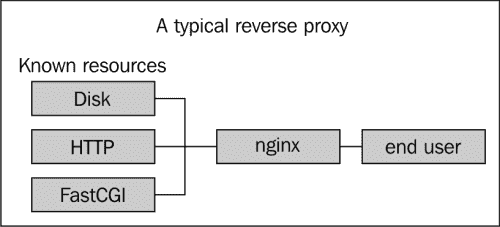
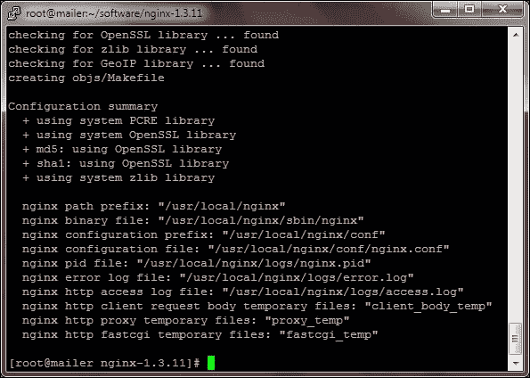

# 第一章. 即刻使用 Nginx

欢迎来到 *即刻使用 Nginx*。本书旨在为你提供 nginx 探险的坚实起点。你将学习 nginx 的基本功能，并在构建第一个虚拟主机的过程中，掌握如何在基础上进一步构建，逐步实现高级功能。

本书包含以下章节：

*那么，什么是 nginx？* 教你 nginx 实际上是什么，它如何使用，以及它与类似技术相比的表现。

*安装* 帮助我们了解如何通过不同的方式下载并安装 nginx，以及每种方法的优缺点。

*快速入门* 介绍了 nginx 配置语法，同时通过一些简单的步骤创建第一个虚拟主机。完成这一部分后，你将能熟练掌握 nginx 配置的工作原理。

*你需要知道的 9 大功能* 帮助你学习如何执行 nginx 模块提供的九项有用任务。完成这一部分后，你将能够：

+   使用 G-zip 压缩资源以优化页面加载时间

+   预压缩资源以优化页面加载时间

+   使用 nginx 作为微缓存

+   如何在 nginx 中使用 WebSockets

+   将 nginx 与其他软件一起使用

+   为 nginx 下载设置后台认证

+   在 nginx 中进行 GeoIP 查找

+   限制用户请求以防止滥用

+   创建可搜索的视频流媒体与 nginx

*你应该了解的人和地方* 提供了许多有用的 nginx 资源链接，同时强调社区对 nginx 的重要性，社区是大多数支持发生的地方，也是许多模块开发的场所。

# 那么，什么是 nginx？

描述 nginx（发音为 engine-x）最好的方式是将其看作一个基于事件的多协议反向代理。这听起来很高大上，但这并非只是流行的术语，实际上它影响了我们配置 nginx 的方式，也突显了 nginx 的一些灵活性。虽然 nginx 通常作为 Web 服务器和 HTTP 反向代理使用，但它也可以作为 IMAP 反向代理或甚至作为原始 TCP 反向代理。得益于插件化的代码结构，我们可以利用大量的第一方和第三方模块，实施多种功能，使 nginx 适用于许多典型的使用场景。



更准确的描述是，nginx 应该首先被看作一个反向代理，其次是一个 Web 服务器。我之所以这样说，是因为它有助于我们通过配置文件来可视化请求流，并理清如何实现所需的 nginx 配置。这种核心差异在于 nginx 是通过 URI 来工作，而不是文件和目录，并根据此来决定如何处理请求。这意味着，在配置 nginx 时，我们告诉它对于某个 URI 应该发生什么，而不是告诉它某个磁盘上的文件应该发生什么。

nginx 作为反向代理的一个有益之处在于，它适用于多种服务器配置，并且能够处理许多其他网页服务器根本不擅长的任务。一个常见的问题是：“既然已经有 Apache httpd，为什么还要使用 nginx？”

答案在于这两个程序的设计方式。大多数 Apache 配置使用预先启动模式（prefork mode），在这种模式下，我们会启动一定数量的进程，然后在每个进程中嵌入我们的动态语言。该配置是同步的，这意味着每个进程一次只能处理一个请求，无论这个连接是用于 PHP 脚本还是图像文件。

相比之下，nginx 采用的是基于事件的异步设计，每个启动的进程可以处理成千上万的并发连接。这里的缺点是，nginx 出于安全和技术原因，不会将编程语言嵌入到其自身进程中——这意味着为了处理这些请求，我们需要将其反向代理到后端，比如 Apache、PHP-FPM 等。幸运的是，作为一个以反向代理为主的服务器，nginx 非常容易做到这一点，并且即使在继续使用 Apache 时，依然能够带来显著的好处。

让我们来看一个使用 Apache 作为应用服务器的案例，而不仅仅是作为网页服务器。我们已经将 PHP、Perl 或 Python 嵌入到 Apache 中，这种配置的主要缺点是每个请求变得非常耗费资源。因为 Apache 进程会一直忙碌，直到请求完全处理完毕，即使它是一个静态文件的请求。我们的在线服务变得越来越受欢迎，现在我们发现服务器无法跟上增加的需求。在这种情况下，引入 nginx 作为一个中介层将是理想的选择。当一个带有中介层的 nginx 服务器位于终端用户和 Apache 之间时，如果请求是针对动态文件，nginx 会将其反向代理到 Apache，而它自己会处理所有静态文件请求。这意味着我们将大量的请求处理从昂贵的 Apache 进程卸载到更轻量级的 nginx 进程，从而在不增加更多硬件的情况下提高了能服务的终端用户数量。

另一个典型的场景是我们有一个全球使用的应用程序。我们没有任何静态文件，因此不能轻松地从 Apache 卸载大量请求。在这种用例中，我们的 PHP 进程会从请求到用户下载完响应为止都很忙。遗憾的是，世界上并不是每个人都有快速的互联网连接，因此，发送过程可能会在相对较长的时间内处于忙碌状态。假设我们的访客使用的是旧款 56k 调制解调器，最大下载速度为每秒 5 KB，那么下载一个由 PHP 生成的 25 KB 压缩 HTML 文件将需要五秒钟。在这五秒钟里，我们的进程无法处理任何其他请求。当我们在这个设置中引入 nginx 时，PHP 仅需几微秒生成响应，而 nginx 将花费五秒钟将其传输到最终用户。由于 nginx 是异步的，它会愉快地在此期间处理其他连接，因此我们显著提高了可以处理的并发请求数量。

在前面两个例子中，我使用了 nginx 在 Apache 前面工作的场景，但这自然不是必须的。nginx 能够通过例如 FastCGI、UWSGI、SCGI、HTTP，甚至 TCP（通过插件）进行反向代理，从而启用后端服务，如 PHP-FPM、Gunicorn、Thin 和 Passenger。

# 安装

安装 nginx 有两种方法，分别是从源代码构建或通过包管理器（如 yum 或 apt）安装二进制包。每种方法都有其优缺点，选择哪种方法取决于我们需要 nginx 完成的任务以及使用的操作系统。

从历史上看，nginx 公司仅提供 nginx 的源代码文件，以便我们自己编译软件，直到最近，他们才开始为各种 Linux 发行版分发二进制包。此外，nginx 要求第三方模块必须静态编译，而不是在运行时加载。最终结果是，nginx 生态系统中会出现许多本地二进制包和由不同人构建的自定义二进制包，包含不同的模块。

即使今天，许多 Linux 发行版仍然发布非常旧版本的 nginx，这意味着我们在安装 nginx 时必须小心，以确保安装到我们需要的版本。如果我们需要启用任何第三方模块，几乎可以确定我们必须从源代码编译。幸运的是，从源代码安装 nginx 是比较简单的，本书详细介绍了如何在不崩溃的情况下进行安装。

在我们继续安装过程之前，最后一个注意事项。nginx 有三个版本可供选择：开发版、稳定版和遗留版。开发版指的是程序 API 的稳定性，而不是运行时稳定性。这意味着开发版通常与稳定版一样稳定，甚至可能更稳定，因为错误修复首先会添加到开发分支，然后才会添加到稳定分支。通常，如果我个人需要新开发版中的功能，我会等一到两周，让社区进行测试，然后才会安全地升级到该版本。遗留版本应该避免使用，因为它们不再得到 nginx、Inc 或社区的支持，通常通过更新到稳定版或开发版来修复错误。

## 第一步 – 不同操作系统

现在，我们将看看如何在不同操作系统上安装 nginx。

### Windows

在 Windows 上安装是最简单的，因为它实际上只提供二进制文件，除非我们想通过 Cygwin 开始编译，但对大多数人来说这是多余的。相反，只需前往 nginx 下载页面并获取标示为 **nginx/Windows-1.X.XX** 的 Windows 版本。将其解压到任意位置，我们就可以开始使用了！

但需要警告一下 Windows 上的 nginx。Windows 有一种独特的事件轮询版本，叫做 IOCP，而 nginx 当前不支持此功能。这意味着 nginx 会退回到一个较慢的变种，因此 Windows 上的 nginx 在性能上无法与 Linux 上的 nginx 相比。除此之外，还有一些我们需要了解的限制。在撰写本文时，以下是已知的限制：

+   只会使用一个工作进程

+   一个工作进程最多只能处理 1,024 个并发连接

+   缓存模块在 Windows Vista 或更高版本上无法工作

nginx, Inc 在以下网址维护已知限制的更新列表：

[`www.nginx.org/en/docs/windows.html`](http://www.nginx.org/en/docs/windows.html)

### Linux

在 Linux 上安装之前，我们首先需要决定是从源代码编译安装还是通过二进制包安装。为了帮助做出决定，下面是一些优缺点的简要概述：

#### 通过源代码安装

通过源代码在 Linux 上安装 nginx 的优点如下：

+   它可以轻松使用第三方模块

+   它可以立即使用最新版本

通过源代码在 Linux 上安装 nginx 的缺点如下：

+   安装起来比二进制包更复杂

+   必须自己跟踪更新

#### 通过二进制包安装

通过二进制包在 Linux 上安装 nginx 的优点如下：

+   安装非常简单

+   不需要自己跟踪更新

通过二进制包在 Linux 上安装 nginx 的缺点如下：

+   很难找到包含第三方模块的二进制包

+   可能会滞后于版本

+   它有许多不同的版本，需要进行研究

最终，我个人认为关键在于你是否需要第三方模块。找到包含所需模块的二进制包通常很困难，而且你需要依赖外部人员来保持他们的二进制包更新。如果你需要第三方模块，编译源代码还意味着我们可以将二进制包限制在官方 nginx 提供的仓库中。这使得安装过程更加简单，并减少了对各种自定义仓库和**Ubuntu 个人软件包归档**（**PPAs**）的研究需求。

### 从源代码安装

从源代码安装 nginx 并不像听起来那么令人畏惧，因为 nginx 是一个相对简单的软件，我们仍然可以使用 yum 和 apt-get 来简化依赖项的安装。

如果使用 apt，只需运行以下命令：

```
sudo apt-get build-dep nginx

```

要自动安装 nginx 包的依赖项，通常这些依赖项与我们将要安装的依赖项相同。

如果使用 yum，请运行以下命令：

```
sudo yum install pcre-devel zlib-devel openssl-devel

```

此时，我们已经获得了依赖项，并准备好编译 nginx。确保我们在要下载源代码的目录中，然后运行以下命令：

```
wget http://www.nginx.org/download/nginx-1.3.15.tar.gz
tar zxf nginx-1.3.15.tar.gz
cd nginx-1.3.15
./configure --help

```

运行最后一个命令后，我们应该在屏幕上看到大量文本。如果你不习惯从源代码编译，刚开始可能会觉得相当令人畏惧，但我们可以一起阅读一些重要的要点。

|

```
--prefix

```

| 这设置了 nginx 安装的基本路径。如果未定义，则默认路径为`/usr/local/nginx`。 |
| --- |

|

```
--sbin-path

```

| 这设置了二进制文件安装的路径。 |
| --- |

|

```
--conf-path

```

| 这设置了配置文件的路径。 |
| --- |

任何其他与安装相关的开关都可以在配置文件中进行配置，因此这些实际上现在还不重要。往下看，我们开始看到名为`—with-*`和`—without-*`的开关。每个开关都允许我们定义哪些标准模块将包含在我们的编译二进制包中，使用哪些开关取决于我们想要的功能。我们包含的每个模块都会增加二进制包的大小，从而增加内存使用。尽管如此，即使我们包含所有模块，内存大小也不会超过几兆字节。请注意，有些模块可能有其他依赖项，例如 GeoIP 模块依赖于外部的 GeoIP 软件，必须通过包管理器进行安装。要了解每个模块的功能，请参阅官方文档：[`www.nginx.org/en/docs/`](http://www.nginx.org/en/docs/)。

一旦我们决定了要包含的模块，只需运行以下命令：

```
./configure —with-foo

```

如果所有依赖项正确，应显示以下摘要界面：



如果信息符合预期，请通过运行以下命令完成编译：

```
make
make install

```

如果我们已经安装了 nginx，我们可以使用以下命令让 make 脚本自动、无缝地切换正在运行的二进制包：

```
make upgrade

```

如果我们做对了所有的步骤，运行`make install`后应该会看到以下信息：

```
make[1]: Leaving directory '/path/to/nginx-1.3.15'

```

从二进制包安装的最快方法是直接使用本地包并运行以下任意一个：

```
yum install nginx

```

或者

```
apt-get install nginx

```

如果安装的版本比较新，我们可能为了方便想要这样做，如果是旧版本，则可以继续使用 nginx 提供的二进制包。要使用这些包，首先按照下面的方式安装仓库。

对于 yum：

创建文件`/etc/yum.repos.d/nginx.repo`，并将以下内容添加到其中：

```
 [nginx]
name=nginx repo
baseurl=http://nginx.org/packages/OS/OSRELEASE/$basearch/
gpgcheck=0
enabled=1

```

其中，`OS`是*centos*（如果使用 CentOS）或者*rhel*（如果使用 RHEL 或其他基于 RHEL 的发行版）。`OSRELEASE`是操作系统版本号，可以是*5*或*6*。如果不确定，可以通过运行`uname -a`查看线索，或者使用反复试错法。

对于 apt：

对于 Debian，添加以下内容到`/etc/apt/sources.list`：

```
deb http://nginx.org/packages/debian/ squeezenginx
deb-src http://nginx.org/packages/debian/ squeezenginx

```

对于 Ubuntu，添加以下内容：

```
deb http://nginx.org/packages/ubuntu/ codenamenginx
deb-src http://nginx.org/packages/ubuntu/ codenamenginx

```

其中，`codename`是`lucid`、`oneiric`、`precise`或`quantal`中的一个，取决于使用的是哪个版本，然后运行：

```
apt-get update
apt-get install nginx

```

## 第 2 步 - 启动 nginx

无论 nginx 是如何安装的，我们大多数情况下都希望通过脚本启动它。我们的选择是经典的`init.d`脚本，或者根据平台选择`upstart/systemd`脚本。如果 nginx 是通过二进制包安装的，那么一个这样的脚本应该已经由我们提供并可以使用，运行以下命令：

```
service nginx start

```

如果 nginx 是通过源代码安装的，我们需要自己安装 init 脚本。nginx 社区为我们收集了`.init`脚本，具体可以访问：[`wiki.nginx.org/InitScripts`](http://wiki.nginx.org/InitScripts)，它将帮助我们快速设置。

下载与平台相关的`init`脚本并将其保存到`/etc/rc.d/init.d/nginx`，检查`.init`文件中的路径，确保它们与我们使用`./configure arguments`（或默认设置）时配置的安装路径一致，然后运行以下命令：

```
chmod +x /etc/rc.d/init.d/nginx

```

现在运行上面提到的命令，查看可用选项。

## 就这样

到此为止，nginx 应该已经安装完毕并准备好进行配置。是时候做一些实验并学习一些有用的东西了！

# 快速开始 – 创建第一个虚拟主机

终于可以让 nginx 启动了。首先，让我们快速回顾一下配置文件。如果通过系统包安装，默认的配置文件位置很可能是`/etc/nginx/nginx.conf`。如果通过源代码安装且没有更改路径前缀，nginx 会安装到`/usr/local/nginx`，并将`nginx.conf`放置在`/conf`子目录中。保持此文件打开，以便在本章中参考，帮助理解描述的许多内容。

## 第 1 步 – 指令和上下文

为了理解我们将在本节中讨论的内容，让我首先介绍一些 nginx 社区常用的术语。nginx 配置文件的两个核心概念是 **指令** 和 **上下文**。指令基本上只是各种配置选项的标识符。上下文是指 nginx 配置文件的不同部分。这个术语很重要，因为文档中通常会说明某个指令在哪些上下文中可以使用。

从标准配置文件来看，nginx 使用一种分层的配置格式，其中块通过大括号 `{}` 表示。这些块就是我们所说的上下文。

最上层的上下文叫做 main，并不是通过一个块表示的，而是整个配置文件本身。main 上下文只有几个我们真正感兴趣的指令，其中两个主要的指令是 `worker_processes` 和 user。这些指令处理 nginx 应该运行多少个工作进程，以及 nginx 应该以哪个用户/组身份运行这些进程。

在主上下文中，有两个可能的子上下文，第一个叫做 **events**。这个块处理与 nginx 事件轮询相关的指令。大多数情况下我们可以忽略这里的指令，因为 nginx 可以自动配置为最优状态；然而，有一个指令很有意思，即 `worker_connections`。这个指令控制每个工作进程可以处理的连接数。值得注意的是，nginx 是一个终止代理，因此如果你将 HTTP 请求代理到后端，比如 Apache httpd，那么就会消耗两个连接。

第二个子上下文是非常有趣的一个，叫做 `http`。这个上下文处理与 HTTP 相关的所有内容，几乎我们所有的工作都会集中在这里。虽然在 `http` 上下文中有一些指令需要配置，但目前我们会专注于 `http` 中的一个子上下文，叫做 `server`。`server` 上下文是 nginx 的虚拟主机等效物。这个上下文用于根据你的站点所在的主机名处理配置指令。

在 `server` 上下文中，我们有一个叫做 `location` 的子上下文。`location` 上下文是我们用来匹配 URI 的地方。基本上，一个请求会依次经过每个上下文，首先是与客户端提供的主机名匹配的 server 块，其次是与客户端提供的 URI 匹配的 location 上下文。

根据安装方式，`nginx.conf` 文件中可能没有任何服务器块。通常，系统包管理器会利用 `include` 指令，使我们能够将配置文件进行内联包含。这样我们可以将每个虚拟主机分开管理，从而保持配置文件的有序。如果没有服务器块，可以检查文件底部是否有 `include` 指令，并检查它所包含的目录，应该会有一个包含服务器块的文件。

## 步骤 2 – 定义你的第一个虚拟主机

最后，让我们定义我们的第一个服务器块！

```
server {
    listen 80;
    server_name example.com;

    root /var/www/website;
}
```

### 小贴士

**下载示例代码**

你可以从你在 [`www.packtpub.com`](http://www.packtpub.com) 账户中下载所有已购买 Packt 书籍的示例代码文件。如果你是在其他地方购买的这本书，可以访问 [`www.packtpub.com/support`](http://www.packtpub.com/support)，并注册以便直接通过电子邮件获取文件。

这基本上就是我们所需的，严格来说，我们甚至不需要定义监听的端口，因为端口 80 是默认的。然而，通常来说，保持这个配置是个好习惯，以便以后我们想要查找所有监听在 80 端口上的虚拟主机时使用。

# 快速入门 – 与后端交互

显然，这个虚拟主机非常简单，它做的只是提供一个静态文件，虽然这确实很有用，但它几乎从来不是我们想要做的全部内容。更有趣的做法可能是处理 PHP 请求，甚至是为一个具有前端控制器模式并且搜索引擎友好的 URL 的框架提供服务。

## 步骤 1 – 快速后端通信示例

与后端的通信是通过在满足特定条件时将请求传递给后端完成的。例如，在以下的服务器块中：

```
server {
    listen 80;
    server_name example.com;

    root /var/www/website;
    index index.php;

    location / {
        try_files $uri $uri/ /index.php;
    }

    location ~ \.php$ {
        include fastcgi.conf;
        fastcgi_pass 127.0.0.1:9000;
    }
}
```

在这里，我们使用正则表达式位置块来定义当请求的 URI 以 `.php` 结尾时应该发生的事情。如果 URI 不是以 `.php` 结尾，而是例如 `/contact-us/`，则会使用 `location /`，该指令尝试使用我们的根目录指令和 URI 来查找磁盘上的文件。如果未找到，它会尝试查找目录，并使用我们的索引指令来查找索引文件。如果仍然找不到，它最终会内部重写为 `/index.php`，并重新开始位置评估，此时 URI 以 `.php` 结尾，因此 PHP 位置将被使用，并将请求发送到 PHP。

## 步骤 2 – 位置块

由于我们将通过使用位置块将请求传递给后端，因此了解可用的不同类型的位置块将非常有用。你注意到在前一节中，位置块在 URI 之前使用了不同的修饰符吗？在第一个位置中没有修饰符，而在第二个位置中使用了 `a ~`。这个修饰符改变了 nginx 匹配位置和用户发送的 URI 的方式。修饰符和规则如下：

| 修饰符 | 结果 |
| --- | --- |
| 无修饰符 | 将作为前缀值进行匹配。`location /` 将匹配以 `/` 开头的任何 URI，而 `location /foo` 将匹配以 `/foo` 开头的任何 URI。 |
| `=` | 将作为精确值匹配。`location = /foo` 只会匹配精确的 `URI /foo`，而不会匹配 `URI /foobar` 或 `/foo/`。 |
| `~` | 将使用 PCRE 库进行区分大小写的正则表达式匹配。 |
| `~*` | 将使用 PCRE 库进行不区分大小写的正则表达式匹配。 |
| `^~` | 将作为前缀值进行匹配，比正则表达式更优先。 |

使用这些不同的路径修饰符时，nginx 需要一种方法来确定在多个匹配时应该使用哪一个。为此，nginx 为每种修饰符分配一个特定的优先级，这有助于确定路径的优先级。

| 修饰符 | 优先级 |
| --- | --- |
| `=` | 这是最具体的修饰符，只匹配精确的字符串。如果该路径匹配，将会首先被选中。 |
| `^~` | 当你希望前缀匹配比正则表达式路径更优先时，使用此修饰符。如果有多个此类型的匹配路径，将使用最长的匹配。 |
| `~` 和 `~*` | nginx 无法决定正则表达式的具体性，因此这些会按定义的顺序匹配。这意味着如果多个正则表达式路径匹配，将使用第一个定义的路径。 |
| 无修饰符 | 最终如果没有其他匹配项，将使用标准的前缀匹配。如果多个前缀路径匹配，将使用最长的匹配。 |

了解 nginx 如何选择路径是非常重要的，因为 nginx 的继承机制如此工作。每个指令的共同点是，它只会向下继承，从不会向上或横向继承。实际上，这意味着我们不能让 nginx 同时应用两个路径。一旦我们在内部重写了请求并重新评估路径，nginx 将忘记旧路径中的指令，只会关注新路径中的指令。

为了说明这种行为，请参见以下服务器块：

```
server {
    root /home/bill/www;
    index index.php;

    location /phpmyadmin {
        root /var/www;
        try_files $uri /phpmyadmin/index.php;
    }

    location ~* \.php$ {
        fastcgi_pass php_upstream;
    }
}
```

当请求 `/phpmyadmin/image/foo.jpg` 时，`/phpmyadmin` 路径将被认为是最具体的，`try_files` 将找到该图像。相比之下，当请求 `/phpmyadmin` 时，它将首先使用 `/phpmyadmin` 路径，然后 `try_files` 会将请求重写为 PHP 路径。发生这种情况时，之前路径中的所有内容都会被丢弃，现在根路径会继承自服务器上下文，使得 `root /home/bill/www` 成为新路径，最终请求会导致 404 错误。

相反，我们在这里需要做的是使用子路径，这样 nginx 就不需要进行跨路径继承了。

```
server {
    root /home/bill/www;
    index index.php;

    location ^~ /phpmyadmin {
        root /var/www;

       location ~* \.php$ {
           fastcgi_pass php_upstream;
       }
    }

    location ~* \.php$ {
        fastcgi_pass php_upstream;
    }
}
```

在这个示例中，我们不需要`try_files`，因为我们不需要重写请求。如果 URI 匹配`/phpmyadmin/`，它将在底部的 PHP 位置之前被选择，如果它还匹配 PHP 子位置，它将进入该位置，并保持父位置的根指令。

前述场景的积极方面是，通过简单地跟随重写到最终位置并检查父上下文中的指令，始终可以轻松判断哪些指令会应用于特定请求。上下文之间没有复杂的继承路径，也没有某些值被新指令覆盖，而其他值保持不变。

与位置块相关的是一种叫做**命名位置**的东西。命名位置本质上是一个无法通过 URI 访问的位置，而是通过内部引用访问。命名位置由`@`表示。

```
    location @error404 { … }
```

此位置在您希望逻辑上分离一些指令，但又不希望该配置部分通过 URI 访问时很有用。之前命名的位置可以用于错误页面，例如，只有当请求导致 404 错误时，才会调用该位置。

```
    error_page 404 @error404;
```

## 步骤 3 – 指令类型

在 nginx 中，指令通常会基于简单的`http`-`server`-`location`流继承。大多数情况下，确实如此。nginx 有不同类型的指令，每种类型的继承方式略有不同。指令如何继承取决于其类型。在 nginx 中，有三种类型的指令以及`try_files`。这三种类型如下：

+   标准指令

+   数组指令

+   动作指令

绝大多数指令都是**标准指令**。这些是被动配置指令，仅配置 nginx 的某些方面，不执行其他操作。它们遵循 nginx 的标准继承规则，并且会向下继承，除非下级上下文指定相同的指令。

**数组指令**略有不同，因为可以在同一上下文中指定多个指令。一个数组指令的例子是`access_log`指令。如果我们在同一位置块中使用三次数组指令，nginx 将创建所有三个访问日志。

数组指令的混淆之处在于，虽然我们可以在同一上下文中多次使用该指令，但当我们尝试在两个不同的上下文中多次使用它时，下级上下文会替换上级上下文，而不是添加到上级上下文中。考虑以下示例：

```
server {
    access_log /var/log/nginx/access.log;

    location ~ ^/calendar/.+\.php$ {
        access_log /var/log/nginx/php-requests.log;
    }
}
```

在前面的示例中，定义了两个访问日志，但只有一个会被写入，取决于 PHP 位置是否匹配。如果目标是同时记录到服务器上下文的访问日志和 PHP 特定的访问日志，我们需要在服务器上下文中定义两次访问日志。

```
server {
    access_log /var/log/nginx/access.log;

    location ~ ^/calendar/.+\.php$ {
        access_log /var/log/nginx/access.log;
        access_log /var/log/nginx/php-requests.log;
    }
}
```

最后一类指令是动作指令。这些指令会立即执行，因此不会继承，而是当相关上下文变为活动状态时立即执行。例如，以下示例中的`rewrite`指令：

```
server {
    rewrite ^/booking(.*) /calendar$1;

    location /calendar {
        rewrite ^ /index.php;
    }
}
```

在`server`上下文中的`rewrite`指令将始终执行，因此正则表达式解析器将始终启动并检查模式`^/booking(.*)`是否与当前 URI 匹配；请求将流入`/calendar`位置，并且下一个重写将被触发。

最后是`try_files`，它有点像例外。因为`try_files`不适用于其他任何指令类型。它可能最接近动作指令，因为它不会继承，区别在于，当它放置在`server`上下文中时，nginx 实际上会创建一个特殊的伪位置，这是最不具体的可能位置。这基本上意味着，`try_files`在`server`上下文中只会在没有任何位置匹配请求时执行。当然，这是一种可能的情况，但如果使用`location /`，此位置将始终匹配，因此`try_files`永远不会被使用。强烈建议`try_files`永远不要放在位置外部，以避免在配置更改时突然发现`try_files`不再执行的情况。

不幸的是，这种行为只有在考虑`http`-`server`-`location`这些上下文时才成立。位置可以有三个不同的子上下文：嵌套位置、if-in-location 和`limit_except`。这里的坏消息是，这些上下文中的指令继承是完全由定义该指令的模块决定的。好消息是，nginx 附带的模块有标准化的行为，这些标准和数组指令的功能与正常情况下基本相同。唯一的真正区别在于动作指令，它们不仅不会继承，而且如果匹配嵌套位置，也不会执行。以下示例说明了这一场景：

```
server {
    location /calendar {
        rewrite ^ /static.php;

        location ~ \.php$ {
            fastcgi_pass php_upstream;
        }
    }
}
```

外部位置中的`rewrite`指令仅在内部位置不匹配时才会执行。

## 步骤 4 – 位置重新评估

在执行动作指令时，谈论这些指令的效果是很有用的，因为它们会导致内部重写。每次内部重写时，nginx 都会重新评估位置，并可能选择一个新的位置。保持内部重定向简单且数量较少，通常可以在出现问题时减少调试工作。

了解这一点很有用：虽然`try_files`被列为与动作指令类似，但只有`try_files`的最终参数才会导致位置重新评估。这可能会导致像这样的`try_files`问题：

```
try_files $uri $uri.php /index.php;

```

虽然最初这可能看起来可以启用漂亮的 URL，但实际上它可能导致 nginx 向用户输出 PHP 文件的源代码，因为 `$uri.php` 不是 `try_files` 的最后一个参数，因此只会设置内部的 `$uri` 指针，而不会重新评估位置。

另一个有用的知识是，通过在末尾使用 `break` 标志，重写操作可以避免触发位置重新评估。例如，如果你希望将旧的 PHP 脚本重写到新的脚本上，你可以避免 nginx 再次进行整个位置评估过程。

```
location ~ \.php$ {
    rewrite ^/old.php /new.php break;
    fastcgi_pass php_upstream;
}
```

## 第 5 步 - 处理后端

后端在我们需要将 nginx 用于不仅仅是静态文件服务时开始发挥作用。nginx 的设计目标是不要在其内部嵌入任何东西，而是使用传输协议与后端进行通信。有多种协议可供选择，如 HTTP、FastCGI、uWSGI、SCGI 和 Memcached。第三方插件可能会增加更多可用的协议，使 nginx 能够与更多不同的后端进行通信。

由于 nginx 通过传输协议与后端进行分离，管理这些后端也成为一个独立的问题。

为了让 nginx 与后端通信，我们需要告诉后端要执行哪个文件，并提供一些其他信息。幸运的是，nginx 在其默认安装中为此提供了配置。检查 `fastcgi.conf`、`uwsgi_params` 和 `scgi_params` 文件。

对于 HTTP 代理，我们通常需要通过 HTTP 头部向后端提供一些信息。大多数后端会期望 `HOST` 头部被设置，并且还需要设置最终用户的 IP 地址。典型的代理配置如下所示：

```
location /proxy {
    proxy_set_header HOST $http_host;
    proxy_set_header X-Forwarded-For $remote_addr;
    proxy_pass http://127.0.0.1:8080;
}
```

## 第 6 步 - 如果卡住了你能做什么？

被卡住是处理服务器时不可避免的一部分。*第 5 步 - 处理后端* 部分的信息将帮助我们理解请求的流程，从而让我们知道哪些指令适用于该请求。然而，有时稍微多一点的信息可以帮助我们更快地调试问题。因此，nginx 提供了错误日志。大多数错误都会记录在错误日志中，即使是 404 错误或后端报告的错误也是如此。因此，定义一个具有适当日志级别的错误日志是至关重要的。

nginx 中的错误日志指令定义如下：

```
error_log file | stderr [debug | info | notice | warn | error | crit | alert | emerg];

```

遇到问题时，首先要做的是将日志级别设置为 info 并检查错误日志中是否有任何条目。通常会有一些线索，例如，如果出现了本不应该出现的 404 错误，nginx 错误日志会解释它试图查找文件的位置，这有助于我们可视化配置中的错误所在。

如果到目前为止仍然没有理解，nginx 提供了另一种简单的方法来查看请求。`return` 指令允许我们返回一个状态码和一个字符串。例如，我们使用以下内容：

```
return 200 $fastcgi_script_name;

```

我们可以获取该变量输出的内容。这可以作为一种简易的调试工具。

# 你需要了解的 9 个重要特性

虽然 nginx 核心设计是作为标准的反向代理和 HTTP 网络服务器，但我们可以进一步扩展，使用 nginx 作为我们工具链中的核心部分，前提是我们研究一些更为深奥的模块以及那些未包含在默认编译中的模块。幸运的是，这些模块通常会包含在由软件包管理库提供的二进制包中，因此无论使用何种方法安装 nginx，它们都应当可以使用。

压缩站点资源是优化首次访问者感知加载时间的最重要方法之一，甚至对于后续页面加载，当压缩 HTML 后端响应时同样有效。

## 压缩

如果加载时间很重要，那么对 JavaScript、CSS 和 HTML 响应进行压缩至关重要，这也意味着 nginx 将其作为核心功能提供。如果我们包含可选的 gzip 静态模块，我们可以通过提前压缩资源进一步优化这个过程，这样 nginx 就可以直接提供静态的 gzip 文件，而无需实时压缩。

首先，让我们来看看如何启用正常的即时 gzip 压缩。

```
gzip             on;
gzip_min_length  100;
gzip_proxied     expired no-cache no-store private auth;
gzip_comp_level  5;
gzip_types       text/plain text/css text/xml text/javascript application/xml application/xml+rss application/x-javascript image/x-icon;
gzip_disable     "msie6";

```

这些指令在 `http` 上下文中有效，这意味着如果我们在 `http` 块中指定它们，它们将适用于每个 `server` 块，从而使我们只需设置一次压缩。通过我们在 *快速入门* 部分获得的 **nginx 继承** 知识，我们仍然可以在需要时通过将 `gzip` 指令设置为 `off`，在某个服务器或位置块上覆盖这些设置。

不同的指令总是会在文档中详细说明；然而，这里是每个指令的简要概述：

| 指令 | 描述 |
| --- | --- |
| `gzip` | 开启或关闭，表示启用或禁用 gzip 压缩。 |
| `gzip_min_length` | 这是在 nginx 压缩响应之前，响应的最小字节数。默认为 20 字节。 |
| `gzip_proxied` | 定义当 nginx 位于其他代理软件（如 Varnish 或 HAProxy）后面时，是否应压缩响应。默认为关闭。 |
| `gzip_comp_level` | 这定义了 gzip 压缩级别，默认值为 `1`。超过级别 `4` 后，压缩效果递减，超过级别 `5` 后几乎没有区别。更高的级别会消耗更多的 CPU 资源。 |
| `gzip_types` | 需要压缩的 MIME 类型。如果启用了 gzip，text/html 总是会被压缩。要压缩所有内容，可以使用 `*`，不过这样会压缩已经被压缩的资源，从而浪费服务器资源。 |
| `gzip_disable` | 正则表达式匹配用户代理，以确定在用户代理存在 bug 的情况下何时不进行压缩。`msie6` 是针对 Internet Explorer 4 到 6 的特殊值，因为它们存在 bug。 |

## 预压缩

使用预先压缩的 gzip 模块有节省 CPU 资源的优势，因为网站资源已经以压缩格式存储，而不必在每次请求时都进行压缩。使用预压缩的 gzip 模块既更简单也更复杂。更复杂的是我们必须自己压缩文件，但更简单的是配置指令要少得多。要启用预压缩的 gzip 模块，我们只需使用以下配置：

```
gzip_static      on;
gzip_proxied     expired no-cache no-store private auth;
gzip_disable     "msie6";

```

我们立刻看到，唯一新增的指令实际上是 `gzip_static`，它与 `gzip` 指令一样，取值为 `on` 或 `off` 来启用或禁用它。

Gzipping 文件超出了本书的范围。它可以通过命令行 gzip 应用手动完成，也可以作为构建过程的一部分自动化处理，但必须在 nginx 之外完成。

## 使用 nginx 作为全页微缓存

现在是中午，你刚坐下准备吃午餐，这时你的监控服务发来一条短信，告诉你初创公司新推出的网页服务宕机了。几秒钟后，你的联合创始人慌张地发来短信，说网站崩溃了，而且恰好他提交到 HackerNews 和 Reddit 的帖子刚刚上了首页。Ars Technica 和 The Next Web 正在撰写关于你们初创公司的文章，如果你不马上让网站恢复在线，整个世界简直要崩溃了。

进入微缓存。其概念是，任何不包含用户特定信息的页面都应该在 nginx 中缓存，这样后端应用程序就不会被访问到。这减轻了后端的负担，使大多数应用程序能够处理更多的流量。通常，应用程序必须考虑缓存，才能在内容更新时处理缓存页面的失效。微缓存的概念通过仅缓存短时间内的内容来处理这个问题。如果流量激增到每秒 20 个请求，而微缓存设置为 10 秒后过期，那么后端应用程序就不必处理 200 个请求，这使得微缓存成为在紧急情况下非常有用的工具。

虽然微缓存的概念很简单，但根据应用程序的不同，执行起来可能会更复杂。关键点是只缓存不包含用户特定信息的页面。如果没有这样的页面，事情会非常简单；否则，我们就需要控制何时缓存，何时不缓存。

有两种方法可以实现这一点。第一种是使用内置的 FastCGI 缓存，或者其他模块的等效方法，如 proxy、uWSGI、SCGI 等。第二种是使用 Memcached 作为缓存，这与代理方法无关。

这两种方法的区别在于，内置的 FastCGI 缓存是读写的，而 Memcached 缓存是只读的。从本质上讲，这是一个关于谁负责写入缓存的问题。对于内置的 FastCGI 缓存，逻辑放在 nginx 配置中，而对于 Memcached，逻辑放在应用程序中，因为它需要自己写入缓存。

### Memcached 微型缓存

我们从 Memcached 场景开始，因为从 nginx 的角度来看，这是更简单的，而且对于我们后续的构建相似。一个基本的 Memcached 微型缓存在 nginx 配置中会如下所示：

```
server {
    root /var/www;

    location / {
        try_files $uri /index.php$is_args$args;
    }

    location ~* \.php$ {
        default_type text/html;
        charset      utf-8;

        if ($request_method = GET) {
            set $memcached_key $request_method$request_uri;

            memcached_pass host:11211;
            error_page     404 502 504 = @nocache;
        }

        if ($request_method != GET) {
            fastcgi_pass backend;
        }
    }

    location @nocache {
        fastcgi_pass backend;
    }
}
```

在前面的配置中，重要的部分发生在处理 PHP 请求的 location 内。具体来说，变量 `$memcached_key` 是最关键的，因为它定义了从 Memcached 请求的键。

一个潜在的复杂问题是，如果带有用户数据的页面和不带用户数据的页面共享相同的请求 URI。在这种情况下，需要额外的配置来检查页面是否包含用户数据。这通常是应用程序特定的，但常见的方法是通过 `$http_cookie` 检查 cookie，或通过 `$args` 检查 URL 参数。

另一个需要注意的事项是，只有 `GET` 请求会使用缓存，任何不是 `GET` 请求的请求会转发到我们的后端，进而绕过缓存。

如果请求通过所有验证并被发送到 Memcached，且 Memcached 返回 404 未找到状态，`error_page` 会将请求发送到 `@nocache` 命名位置，那里会 `fastcgi_pass` 到我们的后端。然后，后端负责为下一个请求在 Memcached 中填充正确的键。

由于应用程序正在向缓存写入数据，记得将缓存过期时间设置得足够短，以便在应用程序数据更新时不会有过期的缓存条目。

### 内置 FastCGI 缓存

使用内置缓存的构建方式与之前的配置示例非常相似。主要区别在于，我们不仅需要定义何时从缓存读取，还需要定义何时写入缓存。一个典型的配置如下所示：

```
fastcgi_cache_path /var/cache/nginx levels=1:2 keys_zone=microcache:5m max_size=500m;

server {
    root /var/www;

    location / {
        try_files $uri /index.php$is_args$args;
    }

    location ~* \.php$ {
        set $no_cache "";

        # Verify request method is GET or HEAD.
        if ($request_method !~ ^(GET|HEAD)$) {
            set $no_cache "1";
        }

        # Check if a nocache cookie is set, for instance after handling a POST.
        if ($http_cookie ~* "_nocache") {
            set $no_cache "1";
        }

        fastcgi_no_cache $no_cache;
        fastcgi_cache_bypass $no_cache;

        fastcgi_cache microcache;
        fastcgi_cache_key $request_method$request_uri;

        fastcgi_cache_valid 200 5s;
        fastcgi_cache_use_stale updating;

        fastcgi_pass backend;
    }
}
```

如图所示，概念大体相同。设置缓存 `keys_zone`，确定是否缓存，最后设置缓存键。为了完整解释发生了什么，我们来看一下不同指令的实际作用。

| 指令 | 描述 |
| --- | --- |
| `fastcgi_cache_path` | 设置存储缓存响应的路径。还命名了与此缓存路径相关联的键区，并指定可以在该路径下存储多少元数据和数据。在此示例中，`keys_zone` 被称为微型缓存。 |
| `fastcgi_no_cache` | 指定是否写入缓存。任何非空字符串或数值 `0` 以外的值都会导致不写入缓存。 |
| `fastcgi_bypass_cache` | 指定是否从缓存读取数据。任何非空字符串或数值`0`都将导致不从缓存读取。 |
| `fastcgi_cache` | 指定要使用的`keys_zone`。在此例中，使用的`keys_zone`是 micro cache。 |
| `fastcgi_cache_key` | 用于标识缓存中数据的键。 |
| `fastcgi_cache_valid` | 设置给定响应码的缓存时间。在这个例子中，我们只缓存 200 响应，并将其缓存 5 秒钟。我们的应用程序可以通过 X-Accel 模块的`X-Accel-Expires`头部或使用标准缓存头`Expires`和`Cache-Control`来覆盖此指令。 |
| `fastcgi_cache_use_stale` | 指定缓存过期后，何时使用缓存条目。在此例中，我们使用`updating`，允许在缓存更新时使用缓存，从而防止在密钥过期时连接突然增加。 |

## 使用 nginx 作为其他代理后的反向代理

虽然 nginx 肯定可以作为我们栈中的唯一反向代理，但在某些情况下，我们可能希望在 nginx 前使用其他软件，因为我们拥有内部专长或已经在使用它们。这里的流行选择包括 Varnish 和 HAProxy。

在这种情况下，我们可以使用可选模块 Real IP，让 nginx 透明地处理这种场景。这样，nginx 可以透明地替换引用 IP 的变量为代理的 IP，从而保持日志和配置一致，同时允许我们开启和关闭前端。

只有三个与真实 IP 模块相关的指令，因此它相对简单实现和理解。

```
set_real_ip_from  192.168.1.0/24;
set_real_ip_from  192.168.2.1;
set_real_ip_from  2001:0db8::/32;
real_ip_header    X-Forwarded-For;
real_ip_recursive on;

```

| 指令 | 描述 |
| --- | --- |
| `set_real_ip_from` | 该指令指定启用真实 IP 模块的 IP。防止随机人员伪装成 nginx 前端。可以多次指定此项。 |
| `real_ip_header` | 该指令指定从哪个头部获取真实 IP。X-Forwarded-For 和 X-Real-IP 是最常用的。默认值为 X-Real-IP。 |
| `real_ip_recursive` | 该指令指定使用哪个 IP。如果关闭，则使用`real_ip_header`中定义的最后一个地址。如果开启，则会遍历 IP 列表，直到找到一个不在受信 IP 列表中的 IP。这在请求被转发多次时非常有用。默认值为关闭。 |

## 设置安全下载

nginx 有一个名为 X-Accel 的功能，旨在替代 Apache httpd 和 lighttpd 中的 `mod_sendfile` 功能。其概念基本相同。请求发送到后端应用程序，后者可以执行其需要的任何操作，例如记录下载或验证用户凭据。一旦后端应用程序完成其工作，它将发出一个非标准的 HTTP 头 `X-Accel-Redirect`，其中包含相对于文档根目录的文件路径。nginx 将检测此头并根据发送的路径查找匹配的位置。例如，PHP 后端应用程序发出头部 X-Accel-Redirect，即 `/video/birthday/dad.mp4`。

在 nginx 中，我们会有以下配置：

```
server {
    root /var/www;

    location /video {
        root /mnt/data;
    }
}
```

在这种情况下，nginx 将查找路径 `/mnt/data/video/birthday/dad.mp4` 的文件。如果未找到文件，将发送 404 状态错误；如果找到文件，将开始向最终用户发送文件，从而减轻后端应用程序的负担。

nginx 有许多可用的 X-Accel 头信息。

| 头信息 | 描述 |
| --- | --- |
| X-Accel-Redirect | 指定一个 URI，相对于 nginx 配置中的根指令，指定要发送给用户的文件。 |
| X-Accel-Buffering | 指定是否允许 nginx 缓冲连接。如果进行 Comet 样式的应用程序，请关闭。默认为是。 |
| X-Accel-Charset | 指定连接的字符集。默认为 utf-8。 |
| X-Accel-Expires | 用于控制 nginx 是否缓存应用响应。默认为关闭。 |
| X-Accel-Limit-Rate | 指定连接的速率限制。 |

## 进行 GeoIP 查找

要执行 GeoIP 查找，nginx 将需要 MaxMind GeoIP 数据库。付费版和免费版均兼容此模块。可以从以下位置下载免费版本：

[`dev.maxmind.com/geoip/geolite`](http://dev.maxmind.com/geoip/geolite)

此模块中的每个指令都必须在 `http` 部分中定义，并且看起来如下所示：

```
geoip_country         /var/data/GeoIP.dat;
geoip_city            /var/data/GeoLiteCity.dat;
geoip_proxy           192.168.2.0/24;
geoip_proxy_recursive on;

```

| 指令 | 描述 |
| --- | --- |

|

```
geoip_country

```

| 指定国家级别 GeoIP 数据库的路径。 |
| --- |

|

```
geoip_city

```

| 指定城市级别 GeoIP 数据库的路径。该数据库还包含国家数据库的数据。 |
| --- |

|

```
geoip_org

```

| 指定组织级别 GeoIP 数据库的路径。GeoIP 组织数据库是一个仅限付费的数据库，nginx 也支持它。 |
| --- |

|

```
geoip_proxy

```

| 当 nginx 用于其他代理软件后面时，可以使用此选项指定该代理的 IP，并让 nginx 在 X-Forwarded-For 中进行 IP 查找。 |
| --- |

|

```
geoip_proxy_recursive

```

| 与在使用 nginx 后面的其他代理示例中的 `real_ip_recursive` 功能上相似。 |
| --- |

加载正确的数据库到 nginx 后，以下变量将可通过配置使用，例如在访问日志中或传递给后端使用。

| 变量 | 描述 |
| --- | --- |

|

```
$geoip_country_code
$geoip_city_country_code

```

| 变量名取决于指定的数据库。包含两位字母的国家代码。 |
| --- |

|

```
$geoip_country_code3
$geoip_city_country_code3

```

| 变量名取决于指定的数据库。包含三位字母的国家代码。 |
| --- |

|

```
$geoip_country_name
$geoip_city_country_name

```

| 变量名取决于指定的数据库。包含完整的国家名称。 |
| --- |

|

```
$geoip_city_continent_code

```

| 包含该大洲的两位字母代码。仅在城市数据库中可用。 |
| --- |

|

```
$geoip_dma_code

```

| 包含美国地区 DMA 代码。仅在城市数据库中可用。 |
| --- |

|

```
$geoip_latitude

```

| 包含用户位置的纬度。仅在城市数据库中可用。 |
| --- |

|

```
$geoip_longitude

```

| 包含用户位置的经度。仅在城市数据库中可用。 |
| --- |

|

```
$geoip_region

```

| 包含两位符号的国家地区代码。仅在城市数据库中可用。 |
| --- |

|

```
$geoip_region_name

```

| 包含完整的国家地区名称。仅在城市数据库中可用。 |
| --- |

|

```
$geoip_city

```

| 包含完整城市名称。仅在城市数据库中可用。 |
| --- |

|

```
$geoip_postal_code

```

| 包含城市的邮政编码。仅在城市数据库中可用。 |
| --- |

|

```
$geoip_org

```

| 包含组织名称。例如，可以是大学。仅在组织数据库中可用。 |
| --- |

## 限制用户请求

限制 nginx 请求的方式有两种，分别是并发请求和请求频率。两者可以同时使用，并且可以在不同的因素上多次应用。例如，我们可以限制每个 IP 的并发请求，同时限制每个服务器块的并发请求。

为了实现这一点，nginx 提供了两个模块：一个限制并发，另一个限制频率。

### 限制并发连接

为了限制并发请求，我们使用 **limit conn** 模块。其概念相当简单，我们基于一个变量创建一个内存区域，然后 nginx 会根据这个变量追踪并发请求。例如，我们可以使用 `$server_name` 变量来限制每个虚拟主机的并发请求，或者使用 `$binary_remote_addr` 来限制用户的 IP。

```
limit_conn_zone $binary_remote_addr zone=perip:5m;

server {
    location /download/ {
        limit_conn perip 1;
        limit_conn_log_level error;
    }
}
```

| 指令 | 描述 |
| --- | --- |
| `limit_conn_zone` | 这创建了内存区域，并指定了用于限制的变量以及内存区域的最大大小。 |
| `limit_conn` | 这指定了要限制的区域以及允许的并发连接数。 |
| `limit_conn_log_level` | 这指定了在模块记录并发连接限制被超出之前所需的日志级别。默认值为 error。通常不建议将其设置为较低级别，除非必要，因为这样会迅速填满错误日志并隐藏更有用的数据。 |

### 限制连接频率

为了限制连接频率，我们可以使用 **limit req** 模块。其语法类似，只有少数的改动，主要是控制速率而非并发。

```
limit_req_zone $binary_remote_addr zone=one:5m rate=1r/s;

server {
    location /search/ {
        limit_req zone=one burst=5;
        limit_req_log_level error;
    }
}
```

| 指令 | 描述 |
| --- | --- |
| `limit_req_zone` | 该指令用于创建内存区域。它指定了限制的变量以及内存区域的最大大小和允许连接的速率。超过该速率的请求将被缓冲，直到达到由 burst 设置的限制，届时将返回 503 错误。 |
| `limit_req` | 该指令指定要限制的区域以及请求缓冲区的大小，称为 **burst**。 |
| `limit_req_log_level` | 该参数指定在模块记录连接频率限制被超出之前需要的日志级别。默认值为 error。通常不建议将其设置得过低，除非有必要，因为这可能会迅速填满错误日志并掩盖更有用的数据。 |

## 使用 nginx 进行视频流传输

使用 nginx 进行视频流式传输非常简单。nginx 提供了两个可选模块来进行视频流传输，分别是 FLV 和 MP4，这使得它能够流式传输 Flash 视频格式和带有 H.264/AAC 编码的 MP4 容器。这些模块与今天所有传统的 Flash 和 HTML5 播放器兼容。

### 流式传输 FLV 文件

FLV 模块是两个模块中最简单的，只有一个指令。要启用它，只需在位置中指定 `flv`，如以下示例所示：

```
location ~ \.flv$ {
    root /var/www/video;
    flv;
}
```

这就是 nginx 端进行 FLV 流式传输的全部内容。如果 `.flv` 文件正确准备了元数据和关键帧，它们应该能够流畅地播放，并支持跳转。

### 流式传输 MP4 文件

MP4 模块与 FLV 模块几乎完全相同，仅增加了一些额外的指令用于额外的控制。

```
location ~ \.mp4$ {
    root /var/www/video;

    mp4;
    mp4_buffer_size     512k
    mp4_max_buffer_size 10m;
}
```

缓冲区控制 nginx 用于处理文件的内存大小。这只在元数据解析期间限制内存使用，可能需要较大的缓冲区。在这种情况下，最大缓冲区大小变得至关重要。如果设置得太小，nginx 会输出 500 状态错误，并记录错误：

```
/var/www/video/file.mp4" mp4 moov atom is too large: 12583268, you may want to increase mp4_max_buffer_size

```

## 使用 nginx 的 WebSocket

版本 1.3.13 引入了连接升级支持到 nginx，这意味着支持 WebSocket。由于 WebSocket 在初始握手时使用标准的 HTTP 协议，nginx 可以将 WebSocket 支持作为标准代理模块的一部分。这意味着，所有普通 HTTP 后端可用的功能，也可以应用于 WebSocket 代理。

处理连接升级所需的配置如下：

```
location /chat/ {
    proxy_pass http://backend;
    proxy_http_version 1.1;
    proxy_set_header Upgrade $http_upgrade;
    proxy_set_header Connection "upgrade";
}
```

关于 WebSocket 支持，有几点需要注意：它们可能会超时，就像任何其他通过 HTTP 代理的请求一样。WebSocket 会受到 `proxy_read_timeout` 的影响，默认时间为 60 秒。nginx 中的 **keepalive** 功能在这里无效，因为 keepalive 心跳包是空的数据包，因此不包含任何数据供 nginx 转发给后端。为了解决这个问题，你需要提高超时时间，或者实现你自己的 keepalive 心跳消息。后者的额外好处是它还可以作为连接本身的健康检查。

# 你应该了解的人和地点

以下链接集合了值得关注的个人、聚合网站和文章，偶尔能找到一些有价值的 nginx 经验分享。

## 官方链接

+   nginx 公司官网，nginx 软件的背后公司：

    [`nginx.com`](http://nginx.com)

+   nginx 软件官网，包含文档以及指向其他资源的链接，如书籍：

    [`nginx.org`](http://nginx.org)

## 文章和教程

+   以下链接是由社区整理的，但也是官方托管的文档，某些情况下包含与官方文档不同的附加信息，更新频率不一：

    [`wiki.nginx.org`](http://wiki.nginx.org)

## 社区

+   邮件列表的网页界面，获取帮助的唯一官方途径：

    [`forum.nginx.org`](http://forum.nginx.org)

+   社区支持的 IRC 频道，活跃度较高：

    [Irc://irc.freenode.org/nginx](http://Irc://irc.freenode.org/nginx) （#nginx 频道位于[irc.freenode.org](http://irc.freenode.org)）

## 博客

+   一个聚合各种 nginx 博客的网站：

    [`planet.ngx.cc/`](http://planet.ngx.cc/)

+   一个支持社区的博客作者，分享关于 nginx 的内容：

    [`kbeezie.com/tag/nginx/`](http://kbeezie.com/tag/nginx/)

+   一个支持社区的博客作者，分享关于 nginx 的内容：

    [`michael.lustfield.net/category/linux/nginx`](http://michael.lustfield.net/category/linux/nginx)

+   一个高产模块创建者的博客；大多写自己的第三方模块，但偶尔也有关于 nginx 内部实现的见解：

    [`agentzh.blogspot.com`](http://agentzh.blogspot.com)

+   一个模块创建者 Valery Kholodkov 的博客，他也会分享关于 nginx 内部实现的内容：

    [`www.nginxguts.com/category/nginx/`](http://www.nginxguts.com/category/nginx/)

+   nginx 公司 Andrew Alexeev 关于 nginx 代码架构的编辑文章：

    [`www.aosabook.org/en/nginx.html`](http://www.aosabook.org/en/nginx.html)

+   一个稍微过时，但仍然相关的 nginx 模块开发指南

    [`www.evanmiller.org/nginx-modules-guide.html`](http://www.evanmiller.org/nginx-modules-guide.html)

+   一个稍微过时，但仍然相关的高级 nginx 模块开发指南

    [`www.evanmiller.org/nginx-modules-guide-advanced.html`](http://www.evanmiller.org/nginx-modules-guide-advanced.html)

+   作为社区支持者，我在博客中分享关于 nginx 的内容：

    [`blog.martinfjordvald.com/category/nginx/`](http://blog.martinfjordvald.com/category/nginx/)

## Twitter

+   官方 nginx Twitter 账号：

    [`twitter.com/nginxorg`](https://twitter.com/nginxorg)

+   nginx 的核心开发者；倾向于活跃在支持渠道中：

    [`twitter.com/mdounin`](https://twitter.com/mdounin)

+   我的 Twitter 账号是：

    [`twitter.com/mfjordvald`](https://twitter.com/mfjordvald)

+   有时在 Twitter 上搜索 nginx 会发现一些有趣的文章：

    [`twitter.com/search?q=nginx`](https://twitter.com/search?q=nginx)
