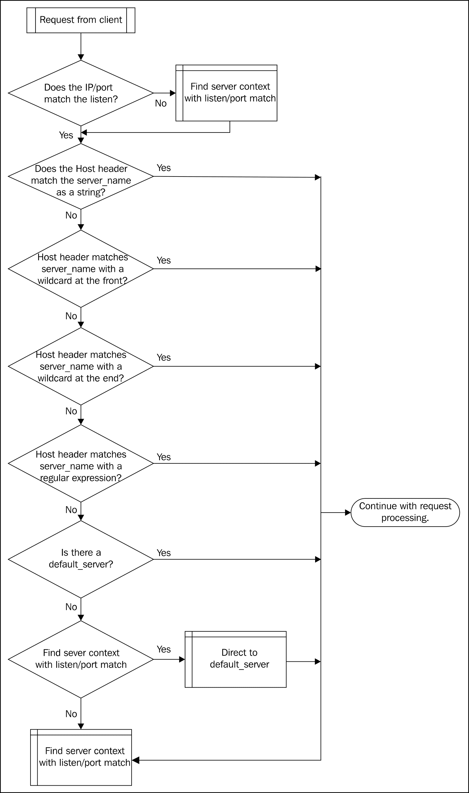

# 第二章：配置指南

NGINX 配置文件遵循非常逻辑化的格式。学习这种格式以及如何使用每个部分是帮助你手动创建配置文件的构建块之一。本章将通过以下内容帮助你实现这一目标：

+   基本配置格式

+   NGINX 全局配置参数

+   使用`include`文件

+   HTTP 服务器部分

+   虚拟服务器部分

+   位置 – 哪里、何时以及如何

+   邮件服务器部分

+   完整的示例配置

# 基本配置格式

基本的 NGINX 配置文件由多个部分组成。每个部分按照以下方式进行划分：

```
<section> {

    <directive> <parameters>;

}
```

需要注意的是，每个指令行都以分号（`;`）结尾。这标志着一行的结束。花括号（`{}`）实际上表示一个新的配置上下文，但我们通常将其视为“部分”。

# NGINX 全局配置参数

全局部分用于配置影响整个服务器的参数，是前面部分格式的一个例外。全局部分可以包括配置指令，如`user`和`worker_processes`，以及如 events 这样的部分。全局部分没有包围的花括号（`{}`）。

全局上下文中最重要的配置指令如以下表所示。这些将是你在大多数情况下要处理的指令。

## 表格：全局配置指令

| 指令 | 说明 |
| --- | --- |
| `user` | 使用此参数配置工作进程运行的用户和组。如果未指定组名，则默认使用与用户名相同的组名。 |
| `worker_processes` | 这是启动的工作进程数量。这些进程将处理所有来自客户端的连接。选择合适的数量取决于服务器环境、磁盘子系统和网络基础设施。一个好的经验法则是，对于 CPU 密集型负载，将其设置为处理器核心数，而对于 I/O 密集型负载，将此数字乘以`1.5`到`2`。 |
| `error_log` | `error_log`是所有错误写入的地方。如果没有在单独的上下文中提供其他`error_log`，则此日志文件将用于所有错误，范围是全局的。此指令的第二个参数指定错误写入日志的级别（`debug`、`info`、`notice`、`warn`、`error`、`crit`、`alert`和`emerg`）。请注意，只有在编译时启用了`--with-debug`配置开关时，才可以获取 debug 级别的错误。 |
| `pid` | 这是一个文件，主进程的进程 ID 会被写入该文件，覆盖掉默认的编译值。 |
| `use` | `use` 指令指示应使用哪种连接处理方法。如果使用，它将覆盖编译时的默认设置，并且必须包含在 `events` 上下文中。除非发现编译时的默认设置随着时间的推移产生错误，否则通常不需要覆盖此设置。 |
| `worker_connections` | 此指令配置工作进程可以打开的最大同时连接数。这包括但不限于客户端连接和与上游服务器的连接。在反向代理服务器上尤其重要——可能需要在操作系统级别进行一些额外的调优，以达到此数量的同时连接。 |

下面是一个简短的示例，展示了如何使用这些指令：

```
# we want nginx to run as user 'www'
user www;

# the load is CPU-bound and we have 12 cores
worker_processes  12;

# explicitly specifying the path to the mandatory error log
error_log  /var/log/nginx/error.log;

# also explicitly specifying the path to the pid file
pid        /var/run/nginx.pid;

# sets up a new configuration context for the 'events' module
events {

    # we're on a Solaris-based system and have determined that nginx
    # will stop responding to new requests over time with the default
    # connection-processing mechanism, so we switch to the second-best
    use /dev/poll;
    # the product of this number and the number of worker_processes
    # indicates how many simultaneous connections per IP:port pair are
    # accepted
    worker_connections  2048;

}
```

该部分应放置在 `nginx.conf` 配置文件的顶部。

# 使用包含文件

包含文件可以在配置文件的任何地方使用，帮助提高可读性，并使你能够重用配置中的部分内容。使用时，确保文件本身包含语法正确的 NGINX 配置指令和块；然后指定文件的路径：

```
include /opt/local/etc/nginx/mime.types;

```

通配符可以出现在路径中，用于匹配多个文件：

```
include /opt/local/etc/nginx/vhost/*.conf;

```

如果没有提供完整路径，NGINX 将相对于其主配置文件进行搜索。

配置文件可以通过以下方式轻松测试：

```
nginx -t -c <path-to-nginx.conf>

```

这将测试包括所有包含文件在内的配置，检查语法错误。

# HTTP 服务器部分

HTTP 服务器部分或 HTTP 配置上下文是可用的，除非你构建 NGINX 时未包含 HTTP 模块（`--without-http`）。此部分控制与 HTTP 模块相关的所有方面，通常是你最常使用的部分。

本节中的配置指令处理 HTTP 连接。由于该模块定义了大量的指令，我们将根据类型将这些指令进行分类，以便更容易讨论它们。

## 客户端指令

这一组指令处理客户端连接本身以及不同类型客户端的相关设置。

### 表格：HTTP 客户端指令

| 指令 | 解释 |
| --- | --- |
| `chunked_transfer_encoding` | 允许在响应客户端时禁用标准的 HTTP/1.1 分块传输编码。 |
| `client_body_buffer_size` | 用于设置客户端请求体的缓冲区大小，超过默认的两个内存页面，以防止将临时文件写入磁盘。 |
| `client_body_in_file_only` | 用于调试或进一步处理客户端请求体。此指令可以设置为 `on`，强制将客户端请求体保存到文件中。 |
| `client_body_in_single_buffer` | 此指令强制 NGINX 将整个客户端请求体保存到单个缓冲区，以减少复制操作。 |
| `client_body_temp_path` | 定义保存客户端请求体的目录路径。 |
| `client_body_timeout` | 指定客户端请求体的连续读取操作之间的时间长度。 |
| `client_header_buffer_size` | 用于指定客户端请求头的缓冲区大小，当该大小需要大于默认的 1 KB 时使用。 |
| `client_header_timeout` | 此超时为读取整个客户端请求头的时间长度。 |
| `client_max_body_size` | 定义允许的最大客户端请求体大小，超过该大小时，将向浏览器返回`413 (Request Entity Too Large)`错误。 |
| `keepalive_disable` | 禁用某些浏览器类型的保持连接请求。 |
| `keepalive_requests` | 定义在关闭连接之前，可以在一个保持连接上进行的请求次数。 |
| `keepalive_timeout` | 指定保持连接的时间。可以给定第二个参数，在响应中设置“Keep-Alive”头。 |
| `large_client_header_buffers` | 定义一个大的客户端请求头的最大数量和大小。 |
| `msie_padding` | 启用禁用为状态大于 400 的 MSIE 客户端响应添加注释，以填充响应大小至 512 字节。 |
| `msie_refresh` | 启用为 MSIE 客户端发送刷新，而不是重定向。 |

## 文件 I/O 指令

这些指令控制 NGINX 如何提供静态文件和/或如何管理文件描述符。

### 表格：HTTP 文件 I/O 指令

| 指令 | 说明 |
| --- | --- |
| `aio` | 启用异步文件 I/O。它在所有现代版本的 FreeBSD 和 Linux 发行版中可用。在 FreeBSD 上，`aio` 可用于预加载数据以进行`sendfile`。在 Linux 上，需要`directio`，这会自动禁用`sendfile`。 |
| `directio` | 启用操作系统特定的标志或功能，以处理大于给定参数的文件。当在 Linux 上使用`aio`时，这是必需的。 |
| `directio_alignment` | 设置`directio`的对齐方式。默认值`512`通常足够，尽管建议在 Linux 上使用 XFS 时将其增加到 4 K。 |
| `open_file_cache` | 配置一个缓存，可以存储打开的文件描述符、目录查找和文件查找错误。 |
| `open_file_cache_errors` | 启用通过`open_file_cache`缓存文件查找错误。 |
| `open_file_cache_min_uses` | 配置文件在`open_file_cache`中保持打开的最小使用次数，以便文件描述符保持打开状态。 |
| `open_file_cache_valid` | 指定`open_file_cache`中项目有效性检查的时间间隔。 |
| `postpone_output` | 指定 NGINX 向客户端发送数据的最小大小。如果可能，直到达到此值才会发送数据。 |
| `read_ahead` | 如果可能，内核将预读取文件，直到`size`参数指定的大小。当前版本的 FreeBSD 和 Linux 支持此功能（在 Linux 上，`size`参数会被忽略）。 |
| `sendfile` | 启用使用`sendfile(2)`将数据直接从一个文件描述符复制到另一个文件描述符。 |
| `sendfile_max_chunk` | 设置在一次`sendfile(2)`调用中复制的数据的最大大小，以防止工作进程发生阻塞。 |

## 哈希指令

哈希指令集控制 NGINX 为某些变量分配的静态内存范围大小。NGINX 将在启动和重新配置时计算所需的最小大小。你很可能只需要通过设置适当的指令来调整`*_hash_max_size`参数，当 NGINX 发出相关警告时。`*_hash_bucket_size`变量默认设置为处理器缓存行大小的倍数，以最小化检索条目时所需的查找次数，因此通常不应更改。有关更多详情，请参见[`nginx.org/en/docs/hash.html`](http://nginx.org/en/docs/hash.html)。

### 表格：HTTP 哈希指令

| 指令 | 说明 |
| --- | --- |
| `server_names_hash_bucket_size` | 指定用于存储`server_name`哈希表的桶大小。 |
| `server_names_hash_max_size` | 指定`server_name`哈希表的最大大小。 |
| `types_hash_bucket_size` | 指定用于存储`types`哈希表的桶大小。 |
| `types_hash_max_size` | 指定`types`哈希表的最大大小。 |
| `variables_hash_bucket_size` | 指定用于存储剩余变量的桶大小。 |
| `variables_hash_max_size` | 指定用于存储剩余变量的哈希表的最大大小。 |

## 套接字指令

这些指令描述了 NGINX 如何为其创建的 TCP 套接字设置各种选项。

### 表格：HTTP 套接字指令

| 指令 | 说明 |
| --- | --- |
| `lingering_close` | 指定客户端连接在接收更多数据时如何保持打开。 |
| `lingering_time` | 配合`lingering_close`指令使用，此指令指定客户端连接保持打开以处理更多数据的时间。 |
| `lingering_timeout` | 也配合`lingering_close`使用，此指令指示 NGINX 在关闭客户端连接之前等待额外数据的时间。 |
| `reset_timedout_connection` | 启用此指令后，超时的连接将立即重置，释放所有关联的内存。默认情况下，套接字会保持在`FIN_WAIT1`状态，这对于保持活动的连接始终是如此。 |
| `send_lowat` | 如果不为零，NGINX 将尽量减少在客户端套接字上的发送操作次数。在 Linux、Solaris 和 Windows 上会被忽略。 |
| `send_timeout` | 设置客户端接收响应时，两个连续写操作之间的超时时间。 |
| `tcp_nodelay` | 启用或禁用 `TCP_NODELAY` 选项，以保持长连接。 |
| `tcp_nopush` | 仅在使用 `sendfile` 时相关。它使 NGINX 尝试将响应头与文件内容一起以一个数据包发送。 |

## 示例配置

以下是 HTTP 配置部分的示例：

```
http {

    include       /opt/local/etc/nginx/mime.types;

    default_type  application/octet-stream;

    sendfile on;

    tcp_nopush on;

    tcp_nodelay on;

    keepalive_timeout  65;

    server_names_hash_max_size 1024;

}
```

此上下文块应位于 `nginx.conf` 文件中的任何全局配置指令之后。

# 虚拟服务器部分

以 `server` 关键字开头的任何上下文都被视为“虚拟服务器”部分。它描述了一组资源的逻辑分离，这些资源将通过不同的 `server_name` 指令提供。这些虚拟服务器响应 HTTP 请求，因此它们被包含在 `http` 部分中。

虚拟服务器由 `listen` 和 `server_name` 指令的组合来定义。`listen` 定义了一个 IP 地址/端口组合或指向 UNIX 域套接字的路径：

```
listen address[:port];
listen port;
listen unix:path;
```

`listen` 指令唯一标识 NGINX 中的一个套接字绑定。`listen` 还可以接受多个可选参数：

## 表格：listen 参数

| 参数 | 说明 | 注释 |
| --- | --- | --- |
| `default_server` | 将 `此地址:端口` 组合定义为绑定此处请求的默认值。 |   |
| `setfib` | 设置对应的 FIB（转发信息库）用于监听套接字。 | 仅支持 FreeBSD。不支持 UNIX 域套接字。 |
| `backlog` | 设置 `listen()` 调用中的 backlog 参数。 | 在 FreeBSD 上默认为 `-1`，在其他所有平台上默认为 `511`。 |
| `rcvbuf` | 设置监听套接字上的 `SO_RCVBUF` 参数。 |   |
| `sndbuf` | 设置监听套接字上的 `SO_SNDBUF` 参数。 |   |
| `accept_filter` | 设置接收过滤器的名称，可以是 `dataready` 或 `httpready`。 | 仅支持 FreeBSD。 |
| `deferred` | 设置 `TCP_DEFER_ACCEPT` 选项，使用延迟的 `accept()` 调用。 | 仅支持 Linux。 |
| `bind` | 为此 `地址:端口` 对进行单独的 `bind()` 调用。 | 如果使用了其他套接字特定参数，则会隐式地进行单独的 `bind()` 调用。 |
| `ipv6only` | 设置 `IPV6_V6ONLY` 参数的值。 | 只能在全新启动时设置。不支持 UNIX 域套接字。 |
| `ssl` | 表示此端口仅允许 HTTPS 连接。 | 允许更简洁的配置。 |
| `so_keepalive` | 配置监听套接字的 TCP `keepalive`。 |   |

`server_name` 指令相对简单，但可以用于解决许多配置问题。其默认值是 `""`，这意味着没有 `server_name` 指令的服务器部分将匹配没有设置 `Host` 头字段的请求。例如，可以用它来丢弃缺少此头字段的请求：

```
server {

    listen 80;

    return 444;

}
```

在这个示例中使用的非标准 HTTP 代码 `444` 将导致 NGINX 立即关闭连接。

除了普通字符串，NGINX 还接受通配符作为 `server_name` 指令的参数：

+   通配符可以替代子域部分：`*.example.com`

+   通配符可以替代顶级域部分：`www.example.*`

+   一种特殊形式将匹配子域或域名本身：`.example.com`（同时匹配`*.example.com`和`example.com`）

正则表达式也可以作为`server_name`的参数，通过在名称前加上波浪号（`~`）来使用：

```
server_name ~^www\.example\.com$;
server_name ~^www(\d+).example\.(com)$;

```

后者形式是一个使用捕获的示例，捕获后可以在后续的配置指令中通过（`$1`、`$2`等）进行引用。

NGINX 在确定哪个虚拟服务器应处理特定请求时使用以下逻辑：

1.  匹配 IP 地址和端口到`listen`指令。

1.  将`Host`头部字段与`server_name`指令作为字符串进行匹配。

1.  将`Host`头部字段与`server_name`指令进行匹配，并在字符串的开头加上通配符。

1.  将`Host`头部字段与`server_name`指令匹配，并在字符串的末尾加上通配符。

1.  将`Host`头部字段与`server_name`指令作为正则表达式进行匹配。

1.  如果所有的`Host`头部匹配`fail`，则跳转到标记为`default_server`的`listen`指令。

1.  如果所有的`Host`头部都匹配`fail`并且没有`default_server`，则直接跳转到第一个满足步骤 1 的`listen`指令的服务器。

该逻辑在以下流程图中表示：



可以使用`default_server`来处理那些否则会被忽略的请求。因此，建议始终显式设置`default_server`，以便这些未处理的请求能够以定义的方式得到处理。

除了这个用法，`default_server`在配置多个具有相同`listen`指令的虚拟服务器时也可能很有用。此处设置的任何指令将适用于所有匹配的服务器块。

# 位置 – 在何时、何地以及如何使用

`location`指令可以在虚拟服务器部分中使用，并指示来自客户端或内部重定向的 URI。位置可以嵌套，但有一些例外。它们用于尽可能具体地配置请求的处理。

位置定义如下：

```
location [modifier] uri {...}
```

或者对于一个命名的位置：

```
location @name {…}
```

命名位置只能通过内部重定向访问。它保持进入位置块之前的 URI 不变。它只能在服务器上下文级别定义。

修饰符会以如下方式影响位置的处理：

## 表格：位置修饰符

| 修饰符 | 处理 |
| --- | --- |
| `=` | 使用精确匹配并终止搜索。 |
| `~` | 区分大小写的正则表达式匹配。 |
| `~*` | 不区分大小写的正则表达式匹配。 |
| `^~` | 如果这是最具体的匹配，则在检查该位置的字符串是否与正则表达式匹配之前停止处理。请注意，这不是正则表达式匹配——它的目的是优先进行正则表达式匹配。 |

当请求到达时，URI 将与最具体的位置进行如下比较：

+   没有正则表达式的定位将搜索最具体的匹配项，而不考虑其定义的顺序。

+   正则表达式的匹配按其在配置文件中的出现顺序进行。正则表达式搜索会在第一次匹配时终止。然后将使用最具体的位置匹配进行请求处理。

此处描述的比较匹配是针对解码后的 URI 进行的；例如，URI 中的`"%20"`将与位置中指定的`" "`（空格）进行匹配。

命名位置只能由内部重定向请求使用。

以下指令仅在位置中找到：

## 表格：仅限位置的指令

| 指令 | 解释 |
| --- | --- |
| `alias` | 为位置定义另一个名称，该名称在文件系统中找到。如果位置使用正则表达式指定，则`alias`应引用该正则表达式中定义的捕获组。`alias`会替换位置匹配的 URI 部分，以便在该文件系统位置中查找其余未匹配的 URI。使用`alias`指令在配置中移动配置项时较为脆弱，因此推荐使用`root`指令，除非需要修改 URI 来找到文件。 |
| `internal` | 指定只能用于内部请求（其他指令中定义的重定向、重写请求、错误页面等）的位置。 |
| `limit_except` | 限制位置只能使用指定的 HTTP 方法（`GET` 也包括`HEAD`）。 |

此外，在`http`部分找到的许多指令也可以在位置中指定。有关完整列表，请参见附录 A，*指令参考*。

`try_files`指令值得特别提及。它也可以在服务器上下文中使用，但通常会出现在位置中。`try_files`将按照给定的参数顺序尝试文件；第一个匹配的文件优先。它通常用于从变量中匹配潜在文件，然后将处理传递给命名位置，如以下示例所示：

```
location / {

    try_files $uri $uri/ @mongrel;

}
location @mongrel {
    proxy_pass http://appserver;

}
```

在此，如果给定的 URI 未找到为文件，则尝试隐式目录索引，然后通过代理将处理传递给`appserver`。在本书的其余部分，我们将探讨如何最好地使用`location`、`try_files`和`proxy_pass`来解决特定问题。

除非在以下情况下，位置可以嵌套：

+   前缀是"`=`"

+   位置是一个命名位置

最佳实践要求将正则表达式位置嵌套在基于字符串的位置内部。以下是一个示例：

```
# first, we enter through the root
location / {

    # then we find a most-specific substring
    # note that this is not a regular expression
    location ^~ /css {

        # here is the regular expression that then gets matched
        location ~* /css/.*\.css$ {

        }

    }

}
```

# 邮件服务器部分

邮件服务器部分或邮件配置上下文，仅在你构建了带有邮件模块的 NGINX（`--with-mail`）时可用。此部分控制与邮件模块相关的所有工作。

邮件模块允许配置影响所有邮件连接代理方面的指令，也允许按服务器指定它们。服务器上下文还接受我们在`http`服务器部分中看到的`listen`和`server_name`指令。

NGINX 可以代理 IMAP、POP3 和 SMTP 协议。以下表格列出了此模块可用的指令：

## 表格：邮件模块指令

| 指令 | 解释 |
| --- | --- |
| `auth_http` | 指定用于验证 POP3/IMAP 用户的服务器。该服务器的功能将在第三章中详细讨论。 |
| `imap_capabilities` | 表示后端服务器支持哪些 IMAP4 功能。 |
| `pop3_capabilities` | 表示后端服务器支持哪些 POP3 功能。 |
| `protocol` | 表示此虚拟服务器上下文支持的协议。 |
| `proxy` | 此指令将简单地启用或禁用邮件代理。 |
| `proxy_buffer` | 此指令允许设置用于代理连接的缓冲区大小，超出默认的单页大小。 |
| `proxy_pass_error_message` | 在后端认证过程中向客户端发出有用错误消息的情况下很有用。 |
| `proxy_timeout` | 如果需要超出默认 24 小时的超时，可以使用此指令。 |
| `xclient` | SMTP 协议允许基于`IP`/`HELO`/`LOGIN`参数进行检查，这些参数通过`XCLIENT`命令传递。此指令启用 NGINX 传递这些信息。 |

如果 NGINX 是通过 SSL 支持编译的（`--with-mail_ssl_module`），除了前述指令之外，还将提供以下指令：

## 表格：邮件 SSL 指令

| 指令 | 解释 |
| --- | --- |
| `ssl` | 表示此上下文是否应支持 SSL 事务。 |
| `ssl_certificate` | 指定此虚拟服务器的 PEM 编码 SSL 证书的路径。 |
| `ssl_certificate_key` | 指定此虚拟服务器的 PEM 编码 SSL 密钥的路径。 |
| `ssl_ciphers` | 指定在此虚拟服务器上下文中应支持的密码（OpenSSL 格式）。 |
| `ssl_prefer_server_ciphers` | 表示优先使用 SSLv3 和 TLSv1 服务器密码，而非客户端密码。 |
| `ssl_protocols` | 表示应启用哪些 SSL 协议。 |
| `ssl_session_cache` | 指定 SSL 缓存，以及是否应在所有工作进程之间共享它。 |
| `ssl_session_timeout` | 客户端可以使用相同 SSL 参数的时间，前提是它们已存储在缓存中。 |

# 完整示例配置

以下是一个示例配置文件，包含本章讨论的不同部分。请注意，不应直接复制粘贴使用此配置文件，因为它很可能不符合您的需求。此配置仅用于展示完整配置文件的结构。

```
user www;

worker_processes 12;

error_log /var/log/nginx/error.log;

pid /var/run/nginx.pid;

events {

    use /dev/poll;

    worker_connections  2048;

}
http {

    include       /opt/local/etc/nginx/mime.types;

    default_type  application/octet-stream;

    sendfile on;

    tcp_nopush on;

    tcp_nodelay on;

    keepalive_timeout  65;

    server_names_hash_max_size 1024;

    server {

        listen 80;

        return 444;

    }

    server {

        listen 80;

        server_name www.example.com;

        location / {

            try_files $uri $uri/ @mongrel;

        }

        location @mongrel {

            proxy_pass http://127.0.0.1:8080;

        }

    }

}
```

# 总结

在本章中，我们已经了解了如何构建 NGINX 配置文件。其模块化特性在一定程度上反映了 NGINX 本身的模块化结构。一个全局配置块负责管理所有影响 NGINX 整体运行的方面。每个 NGINX 负责处理的协议都有一个单独的配置部分。我们可以进一步定义如何处理每个请求，通过在这些协议配置上下文中指定服务器（无论是 `http` 还是 `mail`），以便将请求路由到特定的 IP 地址/端口。在 `http` 上下文中，位置用于匹配请求的 URI。这些位置可以是嵌套的或按照特定顺序排列，以确保请求被正确地路由到文件系统或应用服务器的相应区域。

本章没有涉及的是各种可能被编译进 `nginx` 二进制文件中的模块所提供的配置选项。这些额外的指令将在全书中随着特定模块用于解决某个问题时进行讨论。此外，本章也没有解释 NGINX 为其配置提供的变量。这些内容将在本书后续部分讨论。本章的重点是 NGINX 配置的基础知识。

在下一章，我们将探索如何配置 NGINX 的邮件模块，以启用邮件代理功能。
