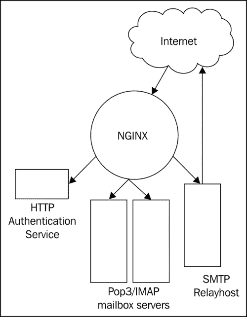
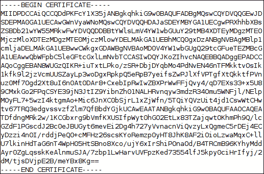
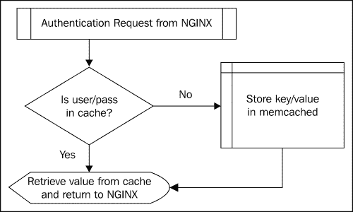

# 第三章：使用邮件模块

NGINX 设计不仅是为了处理 web 流量，还提供了代理邮件服务的功能。在本章中，您将学习如何将 NGINX 配置为 POP3、IMAP 和 SMTP 服务的邮件代理。我们将在以下部分中探讨如何运行 NGINX 作为邮件代理服务器：

+   基本代理服务

+   认证服务

+   与 memcached 结合使用

+   解读日志文件

+   操作系统限制

# 基本代理服务

NGINX 邮件代理模块最初是为 FastMail 开发的。他们需要为用户提供单一的 IMAP 端点，同时将实际的邮件账户托管在多个上游邮件服务器中的某一台。那个时期的典型代理程序使用经典的 Unix 分叉模型，这意味着每个连接都要为其分叉一个新的进程。由于 IMAP 连接非常持久，这些进程会持续很长时间。这会导致代理服务器变得非常迟钝，因为它们必须在每个连接的生命周期内管理这些进程。NGINX 的基于事件的进程模型更适合这种服务。作为邮件代理，NGINX 能够将流量引导到多个邮箱服务器，在这些服务器上托管实际的邮件账户。这使得可以向客户提供一个端点，同时根据用户数量扩展邮箱服务器的数量。商业邮件解决方案和开源邮件解决方案，如 Atmail 和 Zimbra，都是基于这一模型构建的。

以下图表将帮助您理解这一过程：



每个传入请求将按协议分别处理。邮件代理模块可能会为 POP3、IMAP 或 SMTP 配置不同的设置。对于每个协议，NGINX 会使用用户名和密码查询认证服务。如果认证成功，连接会被代理到认证服务响应中指定的邮件服务器。如果认证失败，客户端连接将被终止。因此，认证服务决定哪些客户端可以使用 POP3 / IMAP / SMTP 服务以及它们可以使用哪个邮件服务器。由于可以通过这种方式处理任意数量的邮件服务器，NGINX 可以通过一个中央网关为所有这些邮件服务器提供代理服务。

代理代表其他人或事物行事。在这种情况下，NGINX 代表邮件客户端行事，终止连接并重新连接到上游服务器。这意味着邮件客户端与实际的邮箱服务器或 SMTP 中继主机之间没有直接的通信。

### 注意

如果有任何基于客户端连接中包含的信息的邮件规则，这些规则将无法生效，除非邮件软件能够支持扩展，例如 SMTP 的 XCLIENT。

这是设计包含代理服务器的架构时的一个重要点——代理主机需要支持比典型上游服务器更多的连接。尽管不像邮箱服务器那样需要大量的处理能力或内存，但需要考虑持久连接的数量。

## POP3 服务

**邮局协议**（**Post Office Protocol**）是一个用于从邮箱服务器检索邮件消息的互联网标准协议。该协议的当前版本是 3，因此称为**POP3**。邮件客户端通常会在一个会话中检索邮箱服务器上的所有新消息，然后关闭连接。关闭后，邮箱服务器将删除所有已标记为已检索的消息。

为了让 NGINX 作为 POP3 代理，一些基本的指令需要被配置：

```
mail {
  auth_http  localhost:9000/auth;

  server {
    listen  110;
    protocol  pop3;
    proxy  on;
  }
}
```

这个配置片段启用了邮件模块，并将其配置为 POP3 服务，查询在同一台机器上运行的 9000 端口上的认证服务。NGINX 将监听所有本地 IP 地址上的 110 端口，提供 POP3 代理服务。你会注意到，我们在这里没有配置实际的邮件服务器——这是认证服务的工作，负责告诉 NGINX 特定客户端应该连接到哪个服务器。

如果你的邮件服务器仅支持某些能力（或你只想公布某些能力），NGINX 足够灵活，可以宣布这些能力：

```
mail {
  pop3_capabilities    TOP USER;
}
```

能力是用来宣传支持可选命令的一种方式。对于 POP3，客户端可以在认证前或认证后请求支持的能力，因此正确配置这些能力在 NGINX 中非常重要。

你还可以指定支持哪些认证方法：

```
mail {
  pop3_auth    apop cram-md5;
}
```

如果支持 APOP 认证方法，认证服务需要提供用户的明文密码给 NGINX，以便它能够生成 MD5 摘要。

## IMAP 服务

**互联网邮件访问协议**（**Internet Message Access Protocol**）也是一个互联网标准协议，用于从邮箱服务器检索邮件消息。它提供了比早期的 POP 协议更多的扩展功能。典型使用情况下，所有邮件都保留在服务器上，以便多个邮件客户端可以访问同一个邮箱。这也意味着使用 IMAP 的客户端与使用 POP3 的客户端相比，可能会有更多的持久连接到上游邮箱服务器。

为了代理 IMAP 连接，可以使用类似于之前使用的 POP3 NGINX 配置片段的配置：

```
mail {
  auth_http  localhost:9000/auth;

  imap_capabilities    IMAP4rev1 UIDPLUS QUOTA;
  imap_auth    login cram-md5;

  server {
    listen 143;
    protocol imap;
    proxy on;
  }
}
```

请注意，我们不需要指定`protocol`，因为`imap`是默认值。这里包括它是为了清晰起见。

`imap_capabilities`和`imap_auth`指令的功能与其 POP3 对应项类似。

## SMTP 服务

**简单邮件传输协议**（**Simple Mail Transport Protocol**）是用于将邮件消息从一个服务器传输到另一个服务器或从客户端传输到服务器的互联网标准协议。尽管最初没有为该协议设计认证，但 SMTP-AUTH 作为扩展得到了支持。

如您所见，配置 `mail` 模块的逻辑相当简单。对于 SMTP 代理也是如此：

```
mail {
  auth_http  localhost:9000/auth;

  smtp_capabilities  PIPELINING 8BITMIME DSN;
  smtp_auth    login cram-md5;

  server {
    listen 25;
    protocol smtp;
    proxy on;
  }
}
```

我们的代理服务器只会公布我们设置的`smtp_capabilities`，否则它只会列出它接受的身份验证机制，因为扩展列表会在客户端发送`HELO`/`EHLO`命令时发送给客户端。当代理多个具有不同能力的 SMTP 服务器时，这可能会有用。您可以配置 NGINX，仅列出所有这些服务器共同拥有的能力。重要的是只设置 SMTP 服务器本身支持的扩展。

由于 SMTP-AUTH 是 SMTP 的一个扩展，并非每种配置都支持它，NGINX 能够代理一个不进行任何身份验证的 SMTP 连接。在这种情况下，只有协议的`HELO`、`MAIL FROM`和`RCPT TO`部分会提供给身份验证服务，以便确定为给定客户端连接选择哪个上游服务器。对于此设置，确保将`smtp_auth`指令设置为`none`。

## 使用 SSL/TLS

如果您的组织要求邮件流量加密，或者您自己希望在邮件传输中增加更多的安全性，您可以启用 NGINX 使用 TLS 提供 SSL 上的 POP3、SSL 上的 IMAP 或 SSL 上的 SMTP。要启用 TLS 支持，可以将 `starttls` 指令设置为 `on` 来支持 STLS/STARTTLS，或者将 `ssl` 指令设置为 `on` 来支持纯 SSL/TLS，并为您的站点配置适当的 `ssl_*` 指令：

```
mail {
  # allow STLS for POP3 and STARTTLS for IMAP and SMTP
  starttls    on;
  # prefer the server's list of ciphers, so that we may determine security
  ssl_prefer_server_ciphers  on;
  # use only these protocols
     ssl_protocols    TLSv1 SSLv3;
  # use only high encryption cipher suites, excluding those
  #   using anonymous DH and MD5, sorted by strength
     ssl_ciphers    HIGH:!ADH:!MD5:@STRENGTH;
  # use a shared SSL session cache, so that all workers can
  #   use the same cache
  ssl_session_cache    shared:MAIL:10m;
  # certificate and key for this host
  ssl_certificate      /usr/local/etc/nginx/mail.example.com.crt;
  ssl_certificate_key  /usr/local/etc/nginx/mail.example.com.key;
}
```

请查看 [`www.fastmail.fm/help/technology_ssl_vs_tls_starttls.html`](https://www.fastmail.fm/help/technology_ssl_vs_tls_starttls.html)，了解纯 SSL/TLS 连接与使用 SSL/TLS 升级普通连接到加密连接之间的区别。

### 提示

**使用 OpenSSL 生成 SSL 证书**

如果您以前从未生成过 SSL 证书，以下步骤将帮助您创建一个：

创建证书请求：

```
$ openssl req -newkey rsa:2048 -nodes -out mail.example.com.csr -keyout mail.example.com.key

```

### 提示

这应该会生成以下输出：

```
Generating a 2048 bit RSA private key 
....................................................................................................................+++ 
....................+++ 
writing new private key to 'mail.example.com.key' 
----- 
You are about to be asked to enter information that will be incorporated 
into your certificate request. 
What you are about to enter is what is called a Distinguished Name or a DN. 
There are quite a few fields but you can leave some blank 
For some fields there will be a default value, 
If you enter '.', the field will be left blank. 
----- 
Country Name (2 letter code) [AU]:CH 
State or Province Name (full name) [Some-State]:Zurich 
Locality Name (eg, city) []:ZH 
Organization Name (eg, company) [Internet Widgits Pty Ltd]:Example Company 
Organizational Unit Name (eg, section) []: 
Common Name (e.g. server FQDN or YOUR name) []:mail.example.com 
Email Address []: 
Please enter the following 'extra' attributes 
to be sent with your certificate request 
A challenge password []: 
An optional company name []: 

```

您可以将此证书签名请求（mail.example.com.csr）由像 Verisign 或 GoDaddy 这样的证书授权机构签署，或者您也可以自己签署：

```
$ openssl x509 -req -days 365 -in mail.example.com.csr -signkey mail.example.com.key -out mail.example.com.crt

```

您将看到以下响应：

```
Signature ok 
subject=/C=CH/ST=Zurich/L=ZH/O=Example Company/CN=mail.example.com 
Getting Private key 

```

### 提示

签名证书显示在下面的屏幕截图中。

请注意，自签名证书会在连接到您的服务器的客户端中生成错误。如果您在生产服务器上部署此证书，请确保由一个受认可的证书机构签署。



## 完整的邮件示例

邮件服务通常会在一个网关上组合。以下配置将使 NGINX 为 POP3、IMAP 和 SMTP 流量（以及其加密变种）提供服务，同时为客户端提供使用未加密端口上的 STLS/STARTTLS 的选项：

```
events {
    worker_connections 1024;
}

mail {
     server_name  mail.example.com;
     auth_http  localhost:9000/auth;

     proxy on;

     ssl_prefer_server_ciphers	on;
     ssl_protocols    TLSv1 SSLv3;
     ssl_ciphers      HIGH:!ADH:!MD5:@STRENGTH;
     ssl_session_cache	  shared:MAIL:10m;
     ssl_certificate  	/usr/local/etc/nginx/mail.example.com.crt;
     ssl_certificate_key  /usr/local/etc/nginx/mail.example.com.key;

     pop3_capabilities	  TOP USER;
     imap_capabilities	  IMAP4rev1 UIDPLUS QUOTA;
     smtp_capabilities	  PIPELINING 8BITMIME DSN;

     pop3_auth    apop cram-md5;
     imap_auth    login cram-md5;
     smtp_auth    login cram-md5;

     server {
        listen 25;
        protocol smtp;
        timeout 120000;
        }
     server {
        listen 465;
        protocol smtp;
        ssl on;
        }
     server {
        listen 587;
        protocol smtp;
        starttls on;
        }
     server {
        listen 110;
        protocol pop3;
        starttls on;
        }
     server {
        listen 995;
        protocol pop3;
        ssl on;
        }
     server {
        listen 143;
        protocol imap;
        starttls on;
        }
     server {
        listen 993;
        protocol imap;
        ssl on;
        }
}
```

如你所见，我们在 `mail` 上下文的顶部声明了该服务器的名称。这是因为我们希望每个邮件服务都被称为 `mail.example.com`。即使 NGINX 运行的机器的实际主机名不同，并且每个邮件服务器有自己的主机名，我们希望这个代理成为我们用户的单一参考点。这个主机名将会在 NGINX 需要展示自己名称的地方使用，例如，在初始的 SMTP 服务器问候中。

`timeout` 指令在 `smtp server` 上下文中使用，以将其默认值加倍，因为我们知道这个特定的上游 SMTP 转发主机会插入人为延迟，以劝阻垃圾邮件发送者通过该服务器发送邮件。

# 认证服务

我们在前一部分提到了认证服务很多次，但到底什么是认证服务，它又是做什么的呢？当用户向 NGINX 发出 POP3、IMAP 或 SMTP 请求时，认证连接是第一步之一。NGINX 不会自己执行这个认证，而是向一个认证服务发起查询，该服务会完成认证请求。然后，NGINX 使用认证服务的响应来建立与上游邮件服务器的连接。

这个认证服务可以用任何语言编写，只要它符合 NGINX 所要求的认证协议即可。该协议类似于 HTTP，因此我们编写自己的认证服务会比较容易。

NGINX 会在其请求中向认证服务发送以下头信息：

+   Host

+   Auth-Method

+   Auth-User

+   Auth-Pass

+   Auth-Salt

+   Auth-Protocol

+   Auth-Login-Attempt

+   Client-IP

+   Client-Host

+   Auth-SMTP-Helo

+   Auth-SMTP-From

+   Auth-SMTP-To

这些头信息的含义应该是相当直观的，并且并非每个请求都会包含所有这些头信息。我们将在编写认证服务时逐一讲解这些内容。

我们选择 Ruby 作为这次认证服务实现的语言。如果你当前没有安装 Ruby，也不用担心现在安装它。Ruby 作为一种语言，阅读起来非常清晰，所以只需要跟随下面带注释的代码即可。将其适配到你的环境并运行超出了本书的范围。这个示例将为你编写自己的认证服务提供一个很好的起点。

### Note

一个帮助你轻松安装 Ruby 的好资源可以在 [`rvm.io`](https://rvm.io) 找到。

让我们首先看看 HTTP 请求/响应对话中的请求部分。

我们首先从 NGINX 发送的头信息中收集我们需要的值：

```
      # the authentication mechanism
      meth = @env['HTTP_AUTH_METHOD']
      # the username (login)
      user = @env['HTTP_AUTH_USER']
      # the password, either in the clear or encrypted, depending on the
      #  authentication mechanism used
      pass = @env['HTTP_AUTH_PASS']
      # need the salt to encrypt the cleartext password, used for some
      #  authentication mechanisms, not in our example
      salt = @env['HTTP_AUTH_SALT']
      # this is the protocol being proxied
      proto = @env['HTTP_AUTH_PROTOCOL']
      # the number of attempts needs to be an integer
      attempt = @env['HTTP_AUTH_LOGIN_ATTEMPT'].to_i
      # not used in our implementation, but these are here for reference
      client = @env['HTTP_CLIENT_IP']
      host = @env['HTTP_CLIENT_HOST']
```

### Tip

**这些 @ 符号是什么意思？**

`@` 符号在 Ruby 中用于表示类变量。在我们的示例中，我们将使用它们来更容易地传递变量。在前面的代码片段中，我们引用了作为 Rack 请求传入的环境 `(@env)`。除了我们需要的所有 HTTP 头部外，环境还包含与服务运行方式相关的附加信息。

现在我们知道如何处理 NGINX 可能发送的每个头部，我们需要对它们进行处理，并向 NGINX 发送响应。以下是身份验证服务中响应时预期的头部：

+   `Auth-Status`：在这个头部中，任何不是 `OK` 的值都表示错误。

+   `Auth-Server`：这是连接代理的 IP 地址。

+   `Auth-Port`：这是连接代理的端口。

+   `Auth-User`：这是将用于与邮件服务器进行身份验证的用户。

+   `Auth-Pass`：用于 APOP 的明文密码。

+   `Auth-Wait`：在再次进行身份验证尝试之前，应该等待多少秒。

+   `Auth-Error-Code`：返回给客户端的替代错误代码。

最常用的三个头部是 `Auth-Status`、`Auth-Server` 和 `Auth-Port`。这些头部的存在通常是成功身份验证会话所需的全部。

正如我们在以下代码片段中看到的，根据情况可能会使用额外的头部。响应本身只需发出相关的头部，并用适当的值进行替换。

我们首先检查是否尝试次数过多：

```
      # fail if more than the maximum login attempts are tried
      if attempt > @max_attempts
        @res["Auth-Status"] = "Maximum login attempts exceeded"
        return
      end
```

然后，我们返回适当的头部，并使用从身份验证机制中获取的值进行设置：

```
        @res["Auth-Status"] = "OK"
        @res["Auth-Server"] = @mailhost
        # return the correct port for this protocol
        @res["Auth-Port"] = MailAuth::Port[proto]
        # if we're using APOP, we need to return the password in cleartext
        if meth == 'apop' && proto == 'pop3'
          @res["Auth-User"] = user
          @res["Auth-Pass"] = pass
        end
```

如果身份验证检查失败，我们需要告诉 NGINX。

```
        # if authentication was unsuccessful, we return an appropriate response
        @res["Auth-Status"] = "Invalid login or password"
        # and set the wait time in seconds before the client may make
        # another authentication attempt
        @res["Auth-Wait"] = "3"
        # we can also set the error code to be returned to the SMTP client
        @res["Auth-Error-Code"] = "535 5.7.8"
```

不是每个头部在响应中都是必需的，但正如我们所看到的，有些头部取决于身份验证查询的状态和/或可能存在的任何错误条件。

### 注意

`Auth-User` 头部的一个有趣用途是返回与请求中给定的用户名不同的用户名。例如，当从一个较旧的上游邮件服务器迁移到一个新的上游邮件服务器时，旧服务器接受没有域的用户名，而新服务器要求用户名必须包含域。在这种情况下，NGINX 将使用这个用户名连接到上游服务器。

身份验证数据库可以采取任何形式，从平面文本文件到 LDAP 目录，再到关系型数据库。它不必是邮件服务用来访问这些信息的存储，但应该与该存储同步，以防止由于陈旧数据导致的错误。

我们的示例身份验证数据库是一个简单的哈希：

```
      @auths = { "test:1234" => '127.0.1.1' }
```

用于验证用户的机制是简单的哈希查找：

```
      # this simply returns the value looked-up by the 'user:pass' key
      if @auths.key?("#{user}:#{pass}")
        @mailhost = @auths["#{user}:#{pass}"]
        return true
      #  if there is no such key, the method returns false
      else
        return false
      end
```

将这三个部分结合起来，我们就有了完整的身份验证服务：

```
#!/usr/bin/env rackup

# This is a basic HTTP server, conforming to the authentication protocol
#  required by NGINX's mail module.
#
require 'logger'
require 'rack'

module MailAuth

  # setup a protocol-to-port mapping
  Port = {
    'smtp' => '25',
    'pop3' => '110',
    'imap' => '143'
  }

  class Handler

    def initialize
      # setup logging, as a mail service
      @log = Logger.new("| logger -p mail.info")
      # replacing the normal timestamp by the service name and pid
      @log.datetime_format = "nginx_mail_proxy_auth pid: "
      # the "Auth-Server" header must be an IP address
      @mailhost = '127.0.0.1'
      # set a maximum number of login attempts
      @max_attempts = 3
      # our authentication 'database' will just be a fixed hash for# this example
      # it should be replaced by a method to connect to LDAP or a # database
      @auths = { "test:1234" => '127.0.1.1' }
    end
```

在前面的设置和模块初始化之后，我们告诉 Rack 我们希望处理哪些请求，并定义一个 `get` 方法来响应来自 NGINX 的请求。

```
    def call(env)
      # our headers are contained in the environment
      @env = env
      # set up the request and response objects
      @req = Rack::Request.new(env)
      @res = Rack::Response.new
      # pass control to the method named after the HTTP verb
      #  with which we're called
      self.send(@req.request_method.downcase)
      # come back here to finish the response when done
      @res.finish
    end

    def get
      # the authentication mechanism
      meth = @env['HTTP_AUTH_METHOD']
      # the username (login)
      user = @env['HTTP_AUTH_USER']
      # the password, either in the clear or encrypted, depending on
      # the authentication mechanism used
      pass = @env['HTTP_AUTH_PASS']
      # need the salt to encrypt the cleartext password, used for some
      #  authentication mechanisms, not in our example
      salt = @env['HTTP_AUTH_SALT']
      # this is the protocol being proxied
      proto = @env['HTTP_AUTH_PROTOCOL']
      # the number of attempts needs to be an integer
      attempt = @env['HTTP_AUTH_LOGIN_ATTEMPT'].to_i
      # not used in our implementation, but these are here forreference
      client = @env['HTTP_CLIENT_IP']
      host = @env['HTTP_CLIENT_HOST']

      # fail if more than the maximum login attempts are tried
      if attempt > @max_attempts
        @res["Auth-Status"] = "Maximum login attempts exceeded"
        return
      end

      # for the special case where no authentication is done
      #  on smtp transactions, the following is in nginx.conf:
      #     smtp_auth   none;
      # may want to setup a lookup table to steer certain senders
      #  to particular SMTP servers
      if meth == 'none' && proto == 'smtp'
        helo = @env['HTTP_AUTH_SMTP_HELO']
        # want to get just the address from these two here
        from = @env['HTTP_AUTH_SMTP_FROM'].split(/: /)[1]
        to = @env['HTTP_AUTH_SMTP_TO'].split(/: /)[1]
        @res["Auth-Status"] = "OK"
        @res["Auth-Server"] = @mailhost
        # return the correct port for this protocol
        @res["Auth-Port"] = MailAuth::Port[proto]
        @log.info("a mail from #{from} on #{helo} for #{to}")
      # try to authenticate using the headers provided
      elsif auth(user, pass)
        @res["Auth-Status"] = "OK"
        @res["Auth-Server"] = @mailhost
        # return the correct port for this protocol
        @res["Auth-Port"] = MailAuth::Port[proto]
        # if we're using APOP, we need to return the password in cleartext
        if meth == 'apop' && proto == 'pop3'
          @res["Auth-User"] = user
          @res["Auth-Pass"] = pass
        end
        @log.info("+ #{user} from #{client}")
      # the authentication attempt has failed
      else
        # if authentication was unsuccessful, we return an appropriate response
        @res["Auth-Status"] = "Invalid login or password"
        # and set the wait time in seconds before the client may make
        # another authentication attempt
        @res["Auth-Wait"] = "3"
        # we can also set the error code to be returned to the SMTPclient
        @res["Auth-Error-Code"] = "535 5.7.8"
        @log.info("! #{user} from #{client}")
      end

    end
```

下一部分声明为`private`，以便只有这个类可以使用后面声明的方法。`auth`方法是身份验证服务的核心，负责检查用户名和密码的有效性。`method_missing`方法用于处理无效的方法，并返回`Not Found`错误信息：

```
    private

    # our authentication method, adapt to fit your environment
    def auth(user, pass)
      # this simply returns the value looked-up by the 'user:pass' key
      if @auths.key?("#{user}:#{pass}")
        @mailhost = @auths["#{user}:#{pass}"]
        return @mailhost
      #  if there is no such key, the method returns false
      else
        return false
      end
    end

    # just in case some other process tries to access the service
    #  and sends something other than a GET
    def method_missing(env)
      @res.status = 404
    end

  end # class MailAuthHandler
end # module MailAuth
```

最后一部分设置服务器运行并将`/auth` URI 路由到正确的处理程序：

```
# setup Rack middleware
use Rack::ShowStatus
# map the /auth URI to our authentication handler
map "/auth" do
  run MailAuth::Handler.new
end
```

该列表可以保存为文件`nginx_mail_proxy_auth.ru`，并使用`-p <port>`参数来指定运行的端口。有关更多选项和有关 Rack Web 服务器接口的更多信息，请访问[`rack.github.com`](http://rack.github.com)。

# 与 memcached 结合使用

根据客户端访问代理上邮件服务的频率以及身份验证服务可用的资源，您可能希望在配置中引入缓存层。为此，我们将集成`memcached`作为身份验证信息的内存存储。

NGINX 可以在`memcached`中查找键，但仅限于`http`模块中的某个位置。因此，我们将不得不在 NGINX 外部实现自己的缓存层。



如流程图所示，我们将首先检查此用户名/密码组合是否已在缓存中。如果没有，我们将查询身份验证存储以获取信息，并将键/值对放入缓存。如果有，我们可以直接从缓存中检索该信息。

### 注意

Zimbra 为 NGINX 创建了一个`memcache`模块，直接在 NGINX 的上下文中处理此问题。然而，到目前为止，这段代码还没有被集成到官方的 NGINX 源代码中。

以下代码将通过实现缓存层扩展我们原来的身份验证服务（虽然对于我们的实现来说有点过度，但这是为了提供与网络身份验证数据库交互的基础）：

```
# gem install memcached (depends on libsasl2 and gettext libraries)
require 'memcached'

# set this to the IP address/port where you have memcached running
@cache = Memcached.new("localhost:11211")

def get_cache_value(user, pass)
  resp = ''
  begin
    # first, let's see if our key is already in the cache
    resp = @cache.get("#{user}:#{pass}")
  rescue Memcached::NotFound
    # it's not in the cache, so let's call the auth method
    resp = auth(user, pass)
    # and now store the response in the cache, keyed on 'user:pass'
    @cache.set("#{user}:#{pass}",resp)
  end
  # explicitly returning the response to the caller
  return resp
end
```

要使用此代码，您当然需要安装并运行`memcached`。应该有一个适用于您的操作系统的预构建软件包：

+   Linux（基于 deb）

    ```
    sudo apt-get install memcached

    ```

+   Linux（基于 rpm）

    ```
    sudo yum install memcached

    ```

+   FreeBSD

    ```
    sudo pkg_add -r memcached

    ```

Memcached 的配置非常简单，只需在运行时传递参数给二进制文件。没有直接读取的配置文件，尽管您的操作系统和/或软件包管理器可能提供一个文件，解析该文件可以简化传递这些参数的过程。

`memcached`的最重要参数如下：

+   `-l`：此参数指定`memcached`将监听的地址（默认是所有地址）。需要注意的是，为了确保最大安全性，`memcached`不应监听可以从互联网上访问的地址，因为没有身份验证。

+   `-m`：此参数指定用于缓存的内存大小（以兆字节为单位）。

+   `-c`：此参数指定最大并发连接数（默认是 1024）。

+   `-p`：此参数指定`memcached`监听的端口（默认是 11211）。

将这些设置为合理的值就是启动和运行`memcached`所需做的全部工作。

现在，通过在我们的`nginx_mail_proxy_auth.ru`服务中将`elsif auth(user, pass)`替换为`elsif get_cache_value(user, pass)`，你应该能够运行一个带有缓存层的认证服务，以帮助尽可能快速地处理更多的请求。

# 解释日志文件

日志文件提供了在系统没有按预期运行时，了解发生了什么的最佳线索。根据配置的详细程度以及 NGINX 是否启用了调试支持（`--enable-debug`），日志文件将帮助你理解特定会话中的内容。

错误日志中的每一行对应一个特定的日志级别，这些级别是通过`error_log`指令配置的。不同的日志级别依次为`debug`、`info`、`notice`、`warn`、`error`、`crit`、`alert`和`emerg`，按严重性递增。配置特定的级别时，会包含所有比它更严重的级别的消息。默认的日志级别是`error`。

在`mail`模块的上下文中，我们通常希望配置一个`info`级别的日志，以便尽可能多地获取有关特定会话的信息，而无需配置调试日志。在这种情况下，调试日志仅对跟踪函数入口点或查看特定连接使用了哪个密码有用。

### 注意

由于邮件系统极度依赖正确工作的 DNS，许多错误都可以追溯到无效的 DNS 条目或过期的缓存信息。如果你认为可能是由于名称解析错误导致的问题，可以通过配置调试日志来查看 NGINX 解析某个主机名时所对应的 IP 地址。不幸的是，如果你的`nginx`二进制文件在初始编译时没有启用调试支持，则需要重新编译。

一个典型的代理连接会像下面这个 POP3 会话的示例一样被记录。

首先，客户端与代理建立连接：

```
<timestamp> [info] <worker pid>#0: *<connection id> client <ip address> connected to 0.0.0.0:110 
```

然后，一旦客户端成功登录，系统会记录一条列出所有相关连接信息的语句：

```
<timestamp> [info] <worker pid>#0: *<connection id> client logged in, client: <ip address>, server: 0.0.0.0:110, login: "<username>", upstream: <upstream ip>:<upstream port>, [<client ip>:<client port>-<local ip>:110] <=> [<local ip:<high port>-<upstream ip>:<upstream port>] 
```

你会注意到，双箭头`<=>`之前的部分与客户端到代理的连接有关，而双箭头之后的部分描述了代理到上游的连接。会话结束后，这些信息会再次被记录：

```
<timestamp> [info] <worker pid>#0: *<connection id> proxied session done, client: <ip address>, server: 0.0.0.0:110, login: "<username>", upstream: <upstream ip>:<upstream port>, [<client ip>:<client port>-<local ip>:110] <=> [<local ip:<high port>-<upstream ip>:<upstream port>] 
```

通过这种方式，我们可以看到连接两端使用的端口，以帮助调试潜在问题，或者将日志条目与防火墙日志中的内容进行关联。

`info`级别的其他日志条目与客户端或上游发送的超时或无效命令/响应有关。

`warn`日志级别的条目通常表示配置错误：

```
<timestamp> [warn] <worker pid>#0: *<connection id> "starttls" directive conflicts with "ssl on"
```

许多在`error`日志级别报告的错误表示认证服务存在问题。你会在以下条目中注意到文本`while in http auth state`。这表示错误发生在连接状态中的哪个位置：

```
<timestamp> [error] <worker pid>#0: *<connection id> auth http server 127.0.0.1:9000 timed out while in http auth state, client: <client ip>, server: 0.0.0.0:25
<timestamp> [error] <worker pid>#0: *<connection id> auth http server 127.0.0.1:9000 sent invalid response while in http auth state, client: <client ip>, server: 0.0.0.0:25
```

如果认证查询因任何原因未能成功响应，连接将被终止。NGINX 不知道客户端应该代理到哪个上游，因此会关闭连接，并返回一个`Internal server error`和特定协议的响应码。

根据是否存在用户名，信息将出现在日志文件中。以下是一个经过身份验证的 SMTP 连接的条目：

```
<timestamp> [error] <worker pid>#0: *<connection id> auth http server 127.0.0.1:9000 did not send server or port while in http auth state, client: <client ip>, server: 0.0.0.0:25, login: "<login>"
```

注意，前两个条目在`login`信息中缺失。

`alert`日志级别事件会表明 NGINX 未能按预期设置某个参数，但其他方面会正常运行。

然而，任何`emerg`级别的日志条目都会阻止 NGINX 启动：要么需要修正情况，要么必须更改配置。如果 NGINX 已经在运行，它将不会重新启动任何工作进程，直到更改完成：

```
<timestamp> [error] <worker pid>#0: *<connection id> no "http_auth" is defined for server in /opt/nginx/conf/nginx.conf:32
```

这里我们需要使用`http_auth`指令定义一个认证服务。

# 操作系统限制

你可能会遇到 NGINX 没有按预期执行的情况。要么连接被丢弃，要么警告信息被打印到日志文件中。这时，了解操作系统可能对 NGINX 施加的限制以及如何调整这些限制以获得服务器最佳性能就变得非常重要。

邮件代理最可能遇到问题的领域是连接限制。要理解这意味着什么，首先你需要知道 NGINX 如何处理客户端连接。NGINX 的主进程启动多个工作进程，每个进程作为一个独立的进程运行。每个进程能够处理固定数量的连接，这个数量由`worker_connections`指令设置。对于每个代理连接，NGINX 会打开一个新的连接到邮件服务器。每个连接都需要一个文件描述符，并且每个邮件服务器的 IP/端口组合都需要一个来自临时端口范围的新 TCP 端口（见下面的解释）。

根据你的操作系统，最大打开文件描述符数可以在资源文件中调整，或者通过向资源管理守护进程发送信号进行调整。你可以通过在提示符下输入以下命令来查看当前的设置值：

```
ulimit -n

```

如果你计算后发现这个限制太低，或者在错误日志中看到 `worker_connections exceed open file resource limit` 的消息，那么你就知道需要增加这个值。首先，在操作系统级别调整最大打开文件描述符数，既可以针对 NGINX 运行的用户，也可以全局调整。然后，在 `nginx.conf` 文件的主配置中，将 `worker_rlimit_nofile` 指令设置为新的值。发送 `nginx` 配置重新加载信号（HUP）后，就足以提升该限制，而无需重启主进程。

如果你观察到由于可用 TCP 端口耗尽而导致的连接限制，那么你需要增加临时端口范围。这是操作系统为外向连接维护的 TCP 端口范围。它的默认值可能仅为 5000，但通常设置为 16384 个端口的范围。有关如何为各种操作系统增加该范围的详细描述，请参考 [`www.ncftp.com/ncftpd/doc/misc/ephemeral_ports.html`](http://www.ncftpd.com/ncftpd/doc/misc/ephemeral_ports.html)。

# 总结

在本章中，我们已学习如何配置 NGINX 以代理 POP3、IMAP 和 SMTP 连接。每个协议都可以单独配置，并在上游服务器中宣布对各种功能的支持。通过使用 TLS 加密邮件流量，并为服务器提供适当的 SSL 证书，可以实现邮件流量的加密。

认证服务是 `mail` 模块正常运行的基础，因为没有它无法进行代理。我们详细介绍了一个这样的认证服务的示例，概述了请求中预期的内容以及如何构造响应。以此为基础，你应该能够编写适合自己环境的认证服务。

理解如何解读日志文件是系统管理员可以培养的最有用的技能之一。NGINX 提供了相当详细的日志条目，尽管有些条目可能略显晦涩。了解如何在单个连接的上下文中放置各种条目，并查看此时 NGINX 的状态，对于解读这些条目非常有帮助。

NGINX 和其他任何软件一样，都是在操作系统的上下文中运行的。因此，了解如何增加操作系统对 NGINX 可能施加的限制是非常有用的。如果无法进一步提高这些限制，那么就必须通过增加运行 NGINX 的服务器数量，或采用其他技术来减少单个实例需要处理的连接数，从而找到一种架构解决方案。

在下一章中，我们将学习如何配置 NGINX 以代理 HTTP 连接。
