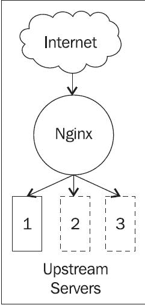

# 第四章 NGINX 作为反向代理

**反向代理**是一个 web 服务器，它与客户端建立连接并代表客户端向上游服务器发起新的连接。**上游服务器**被定义为 NGINX 为了满足客户端请求而与之建立连接的服务器。上游服务器可以采取各种形式，NGINX 可以根据不同的上游服务器配置进行不同的处理。

NGINX 配置，您已经详细学习过，某些时候可能比较难理解。有不同的指令可以用来满足类似的配置需求。某些选项最好不要使用，因为它们可能导致意想不到的结果。

有时，上游服务器可能无法满足请求。NGINX 有能力向客户端传递错误消息，错误消息可以直接来自该上游服务器，也可以来自其本地磁盘，或重定向到另一个完全不同的服务器上的页面。

由于反向代理的特性，上游服务器无法直接从客户端获取信息。某些信息，例如客户端的真实 IP 地址，对于调试和请求追踪非常重要。这些信息可能以头部的形式传递给上游服务器。

我们将在以下章节中介绍这些主题，以及一些代理模块指令的概述：

+   反向代理简介

+   上游服务器的类型

+   将 "if"-fy 配置转换为更现代的解释方式

+   使用错误文档处理上游问题

+   确定客户端的真实 IP 地址

# 反向代理简介

NGINX 可以作为反向代理，通过终止来自客户端的请求并向上游服务器发起新的请求。在传递过程中，按照 URI、客户端参数或其他逻辑，可以将请求拆分，以最佳方式响应客户端的请求。请求原始 URL 的任何部分都可以在通过反向代理时进行转换。

在代理到上游服务器时，最重要的指令是 `proxy_pass` 指令。此指令接受一个参数——请求应传输到的 URL。使用 `proxy_pass` 和 URI 部分时，将用该部分替换 `request_uri`。例如，以下示例中的 `/uri` 在请求传递给上游服务器时将被转换为 `/newuri`：

```
location /uri {

  proxy_pass http://localhost:8080/newuri;
}
```

然而，这个规则有两个例外。首先，如果位置是通过正则表达式定义的，则 URI 不会发生转换。在这个示例中，URI `/local` 将直接传递给上游服务器，而不会像预期的那样转换为 `/foreign`：

```
location ~ ^/local {

  proxy_pass http://localhost:8080/foreign;
}
```

第二个例外是，如果在某个位置的重写规则更改了 URI，然后 NGINX 使用此 URI 来处理请求，则不会发生任何转换。在此示例中，传递给上游的 URI 将是 `/index.php?page=<match>`，其中 `<match>` 是括号内捕获的内容，而不是 `/index`，如 `proxy_pass` 指令中的 URI 部分所示：

```
location / {

  rewrite /(.*)$ /index.php?page=$1 break;

  proxy_pass http://localhost:8080/index;
}
```

### 提示

`break` 标志用于重写指令中，用来立即停止所有重写模块指令的处理。

在这两种情况下，`proxy_pass` 指令中的 URI 部分并不相关，因此可以在没有它的情况下完成配置：

```
location ~ ^/local {

  proxy_pass http://localhost:8080;
}

location / {

  rewrite /(.*)$ /index.php?page=$1 break;

  proxy_pass http://localhost:8080;
}
```

## 代理模块

以下表格总结了代理模块中一些常用的指令：

### 表格：代理模块指令

| 指令 | 说明 |
| --- | --- |
| `proxy_connect_timeout` | NGINX 在向上游服务器发起请求时，等待连接被接受的最大时间。 |
| `proxy_cookie_domain` | 替换来自上游服务器的 `Set-Cookie` 头部中的域名属性；要替换的域名可以是字符串、正则表达式，或者引用一个变量。 |
| `proxy_cookie_path` | 替换来自上游服务器的 `Set-Cookie` 头部中的 `path` 属性；要替换的路径可以是字符串、正则表达式，或者引用一个变量。 |
| `proxy_headers_hash_bucket_size` | 头部名称的最大大小。 |
| `proxy_headers_hash_max_size` | 从上游服务器接收到的头部的总大小。 |
| `proxy_hide_header` | 一个头部字段的列表，这些字段不应传递给客户端。 |
| `proxy_http_version` | 用于与上游服务器通信的 HTTP 协议版本（对于 `keepalive` 连接，使用 `1.1`）。 |
| `proxy_ignore_client_abort` | 如果设置为 `on`，当客户端中止连接时，NGINX 将不会中止与上游服务器的连接。 |
| `proxy_ignore_headers` | 设置在处理来自上游服务器的响应时，可以忽略哪些头部。 |
| `proxy_intercept_errors` | 如果启用，NGINX 将显示配置的 `error_page` 错误，而不是直接显示来自上游服务器的响应。 |
| `proxy_max_temp_file_size` | 当响应无法适应内存缓冲区时，溢出文件的最大大小。 |
| `proxy_pass` | 指定请求传递给的上游服务器，采用 URL 形式。 |
| `proxy_pass_header` | 覆盖在 `proxy_hide_header` 中禁用的头部，使其能够发送到客户端。 |
| `proxy_pass_request_body` | 如果设置为 `off`，则阻止将请求的正文发送到上游服务器。 |
| `proxy_pass_request_headers` | 如果设置为 `off`，则阻止将请求的头部发送到上游服务器。 |
| `proxy_read_timeout` | 指定从上游服务器执行两次读取操作之间需要经过的时间长度，在此时间之后连接将被关闭。如果上游服务器处理请求较慢，应设置较高的值。 |
| `proxy_redirect` | 重写从上游服务器接收到的 `Location` 和 `Refresh` 头；有助于绕过应用框架的假设。 |
| `proxy_send_timeout` | 指定在执行两次写操作到上游服务器之间需要经过的时间长度，在此时间之后连接将被关闭。 |
| `proxy_set_body` | 可以通过设置该指令来更改发送到上游服务器的请求体。 |
| `proxy_set_header` | 重写发送到上游服务器的头内容；也可以通过将其值设置为空字符串来不发送某些头。 |
| `proxy_temp_file_write_size` | 限制一次缓冲到临时文件的数据量，以防止 NGINX 在单个请求上阻塞过久。 |
| `proxy_temp_path` | 一个目录，用于缓存临时文件，这些文件在从上游服务器代理时可能会被存储，可以选择性地多层嵌套。 |

以下列表将许多这些指令组合在一起，并可在与 `proxy_pass` 指令位于同一位置的配置文件中包含。

`proxy.conf` 的内容：

```
proxy_redirect  off;

proxy_set_header Host      $host;

proxy_set_header X-Real-IP    $remote_addr;

proxy_set_header X-Forwarded-For  $proxy_add_x_forwarded_for;

client_max_body_size   10m;

client_body_buffer_size  128k;
proxy_connect_timeout   30;

proxy_send_timeout    	15;

proxy_read_timeout    	15;

proxy_send_lowat     12000;

proxy_buffer_size     	4k;

proxy_buffers       4 32k;

proxy_busy_buffers_size  	64k;

proxy_temp_file_write_size    64k;
```

我们正在设置一些常见的指令值，这些值在反向代理场景中可能会很有用：

+   `proxy_redirect` 指令已设置为 `off`，因为在大多数情况下没有必要重写 `Location` 头。

+   `Host` 头被设置，以便上游服务器可以将请求映射到虚拟服务器，或者利用用户输入的 URL 中的主机部分。

+   `X-Real-IP` 和 `X-Forwarded-For` 头具有相似的功能——将连接客户端的 IP 地址信息转发给上游服务器。

    +   用于 `X-Real-IP` 头中的 `$remote_addr` 变量是 NGINX 感知到的客户端 IP 地址。

    +   `$proxy_add_x_forwarded_for` 变量包含客户端请求中的 `X-Forwarded-For` 头字段的内容，后接 `$remote_addr` 变量。

+   `client_max_body_size` 指令，虽然严格来说不是反向代理模块的指令，但由于与代理配置的相关性，这里提到它。如果该值设置得太低，上传的文件将无法到达上游服务器。在设置此指令时，请记住，通过 Web 表单上传的文件通常比文件系统中的文件大小更大。

+   `proxy_connect_timeout` 指令表示 NGINX 在与上游服务器建立初始连接时的等待时间。

+   `proxy_read_timeout` 和 `proxy_send_timeout` 指令定义了 NGINX 在与上游服务器的连续操作之间等待的时间。

+   `proxy_send_lowat` 指令仅在 FreeBSD 系统上有效，并指定套接字发送缓冲区在将数据传递给协议之前应持有的字节数。

+   `proxy_buffer_size`、`proxy_buffers` 和 `proxy_busy_buffers_size` 指令将在下一章详细讨论。简单来说，这些缓冲区控制 NGINX 对用户请求的响应速度。

+   `proxy_temp_file_write_size` 指令控制工作进程在缓存数据时阻塞的时间：值越高，进程阻塞的时间越长。

这些指令包含在一个文件中，如下所示，并且可以在同一配置中多次使用：

```
location / {

  include proxy.conf;

  proxy_pass http://localhost:8080;
}
```

如果这些指令中的任何一个值与包含文件中的值不同，则在特定位置覆盖它。

```
location /uploads {

  include proxy.conf;

  client_max_body_size   	500m;

  proxy_connect_timeout  	75;

  proxy_send_timeout    	90;

  proxy_read_timeout    	90;

  proxy_pass http://localhost:8080;
}
```

### 提示

这里的顺序很重要。如果配置文件（或包含的文件）中出现多个指令，NGINX 将采用最后定义的指令值。

### 带有 cookie 的旧版服务器

你可能会遇到需要将多个旧版应用程序放置在同一个公共端点后面的情况。这些旧版应用程序是为它们作为唯一与客户端直接通信的服务器而编写的。它们从自己的域设置了 cookie，并假设它们总是可以通过`/` URI 访问。在将新端点放置在这些服务器前面时，这些假设不再成立。以下配置将重写 cookie 的域和路径，以匹配新应用程序端点：

```
server {

  server_name app.example.com;

  location /legacy1 {

    proxy_cookie_domain legacy1.example.com app.example.com;

    proxy_cookie_path $uri /legacy1$uri;

    proxy_redirect default;

    proxy_pass http://legacy1.example.com/;
  }

```

### 提示

`$uri` 变量的值已经包括了开头的斜杠（`/`），因此这里无需重复它。

```
 location /legacy2 {

    proxy_cookie_domain legacy2.example.org app.example.com;

    proxy_cookie_path $uri /legacy2$uri;

    proxy_redirect default;

    proxy_pass http://legacy2.example.org/;

  }

  location / {

    proxy_pass http://localhost:8080;

  }
}
```

## 上游模块

与`proxy`模块紧密配合的是`upstream`模块。`upstream`指令启动一个新的上下文，在其中定义了一组上游服务器。这些服务器可以赋予不同的权重（权重越高，NGINX 将传递给该上游服务器的连接越多），可以是不同类型（TCP 与 UNIX 域），甚至可以因维护原因标记为`down`。

以下表格总结了在上游上下文中有效的指令：

### 表格：上游模块指令

| 指令 | 解释 |
| --- | --- |
| `ip_hash` | 通过对 IP 地址进行哈希并基于其类 C 网络进行键控，确保客户端连接均匀分布在所有服务器上。 |
| `keepalive` | 每个工作进程缓存到上游服务器的连接数。与 HTTP 连接一起使用时，应将`proxy_http_version`设置为`1.1`，并将`proxy_set_header`设置为`Connection "".` |
| `least_conn` | 启动负载均衡算法，其中选择活动连接数最少的服务器来处理下一个新连接。 |

| `server` | 定义一个地址（域名或带可选 TCP 端口的 IP 地址，或 UNIX 域套接字的路径）和上游服务器的可选参数。参数包括：

+   `weight`：它设置了一个服务器相对于另一个服务器的优先级

+   `max_fails`：它是指在 `fail_timeout` 内，服务器未成功通信的最大尝试次数，超过此次数后，服务器将被标记为 `down`

+   `fail_timeout`：它是指服务器必须响应请求的时间长度，以及服务器被标记为宕机的时间长度

+   `backup`：只有在其他服务器不可用时，它才会接收请求

+   `down`：它标记服务器无法处理请求

|

### 保持连接

`keepalive` 指令值得特别提及。NGINX 会为每个工作进程保持一定数量的与上游服务器的连接。这种连接缓存对于需要始终保持一定数量打开连接的情况非常有用。如果上游服务器使用 HTTP，NGINX 可以使用 HTTP/1.1 持久连接机制来维持这些连接。

```
upstream apache {

  server 127.0.0.1:8080;

  keepalive 32;

}

location / {

  proxy_http_version	1.1;

  proxy_set_header		Connection "";

  proxy_pass http://apache;

}
```

在这里，我们已经指示希望保持 32 个与运行在本地主机 `8080` 端口上的 Apache 的连接。NGINX 只需为每个工作进程的前 32 个连接完成 TCP 握手，然后通过不发送带有 `close` 标记的 Connection 头来保持这些连接的开放。通过 `proxy_http_version`，我们指定希望与上游服务器使用 HTTP/1.1 进行通信。我们还通过 `proxy_set_header` 清除了 `Connection` 头的内容，以避免直接代理客户端连接属性。

如果需要超过 32 个连接，NGINX 当然会打开足够的连接以满足请求。在这个高峰期过后，NGINX 将关闭最久未使用的连接，将连接数降回到 32，这正是我们在 `keepalive` 指令中所指定的。

此机制也可以用于代理非 HTTP 连接。以下示例中，我们展示了 NGINX 如何保持与两个 `memcached` 实例的 64 个连接：

```
upstream memcaches {

  server 10.0.100.10:11211;

  server 10.0.100.20:11211;

  keepalive 64;

}
```

如果我们将负载均衡算法从默认的轮询算法切换到 `ip_hash` 或 `least_conn`，我们需要在使用 `keepalive` 指令之前指定这一点：

```
upstream apaches {

  least_conn;

  server 10.0.200.10:80;

  server 10.0.200.20:80;

  keepalive 32;

}
```

### 负载均衡算法

`upstream` 模块可以通过使用三种负载均衡算法之一——轮询、IP 哈希或最少连接——来选择下一个连接的上游服务器。**轮询**算法是默认选择的，无需配置指令来启用它。此算法基于上一个选择的服务器、配置块中下一个服务器以及每个服务器的权重来选择下一个服务器。轮询算法尝试确保流量的公平分配，基于“轮到谁了”的概念。

**IP 哈希**算法，通过`ip_hash`指令启用，采取的是将特定 IP 地址始终映射到同一上游服务器的观点。NGINX 通过使用 IPv4 地址的前三个八位字节或整个 IPv6 地址作为哈希键来实现这一点。因此，相同的 IP 地址池始终会映射到相同的上游服务器。因此，这一机制并不是为了确保公平分配，而是为了在客户端和上游服务器之间实现一致的映射。

默认上游模块支持的第三种负载均衡算法**最少连接数**，通过`least_conn`指令启用。该算法旨在通过选择具有最少活动连接数的上游服务器，均匀分配负载。如果上游服务器的处理能力不完全相同，可以使用`weight`参数在`server`指令中指定。该算法在计算最少连接数时会考虑到不同权重的服务器。

# 上游服务器类型

上游服务器是 NGINX 代理连接的服务器。这可以是不同的物理机或虚拟机，但不一定是。上游服务器可以是一个守护进程，在本地机器上的 UNIX 域套接字上监听连接，也可以是不同机器上的多个服务器，通过 TCP 监听。它可以是一个 Apache 服务器，带有多个模块来处理不同类型的请求，或者是一个 Rack 中间件服务器，为 Ruby 应用程序提供 HTTP 接口。NGINX 可以配置为代理到它们中的每一个。

## 单一上游服务器

Apache Web 服务器在常见的托管场景中用于提供静态文件以及多种类型的解释文件。广泛的文档和在线教程帮助用户快速启动并运行自己喜欢的 CMS。不幸的是，由于资源限制，典型的 Apache 配置无法处理大量的并发请求。然而，NGINX 被设计用于处理这种流量，且资源消耗极低。由于大多数 CMS 预配置为 Apache，并通过`.htaccess`文件集成扩展配置，因此利用 NGINX 优势的最简单方法是让 NGINX 直接将连接代理到 Apache 实例：

```
server {

 location / {

    proxy_pass http://localhost:8080;

  }

}
```

这是最基本的代理配置。NGINX 将终止所有客户端连接，然后将所有请求代理到本地主机的 TCP 端口 8080。我们假设 Apache 已经配置为在`localhost:8080`上监听。

像这样的配置通常会扩展，使得 NGINX 能够直接提供任何静态文件，然后将剩余的请求代理到 Apache：

```
server {

  location / {

    try_files $uri @apache;

  }

  location @apache {

    proxy_pass http://127.0.0.1:8080;

  }

}
```

`try_files` 指令（包含在 `http` 核心模块中）正如其名所示——它按顺序尝试文件，直到找到匹配的文件。所以，在前面的示例中，NGINX 将提供它在根目录中找到的与客户端提供的 URI 匹配的任何文件。如果没有找到任何文件，它将把请求代理到 Apache 进行进一步处理。我们在这里使用了一个命名位置，在本地查找文件失败后将请求代理过去。

## 多个上游服务器

还可以配置 NGINX 将请求传递给多个上游服务器。这是通过声明一个上游上下文，定义多个服务器，并在 `proxy_pass` 指令中引用该上游来实现的：

```
upstream app {

  server 127.0.0.1:9000;

  server 127.0.0.1:9001;

  server 127.0.0.1:9002;

}
server {

  location / {

    proxy_pass http://app;

  }

}
```

使用此配置，NGINX 会按轮询的方式将连续请求传递给三个上游服务器。当应用程序只能同时处理一个请求时，您希望 NGINX 处理客户端的通信，以避免任何一个应用服务器过载时，这种方法会很有用。此配置在以下图示中说明：



本章前面 *负载均衡算法* 部分中详细介绍了其他负载均衡算法。应使用哪种算法取决于具体配置和实际情况。

如果需要确保客户端始终连接到相同的上游服务器，以实现一种简易的会话粘性（poor-man's session-stickiness），则应使用 `ip_hash` 指令。当请求的分发导致每个请求的响应时间差异较大时，应选择 `least_conn` 算法。默认的轮询算法适用于一般情况，无需特殊考虑客户端或上游服务器。

## 非 HTTP 上游服务器

到目前为止，我们已经集中讨论了如何通过 HTTP 与上游服务器进行通信。为此，我们使用 `proxy_pass` 指令。正如本章早些时候在 *保持连接* 部分所提到的，NGINX 可以将请求代理到不同类型的上游服务器。每种类型都有相应的 *`_pass` 指令。

### Memcached 上游服务器

`memcached` NGINX 模块（默认启用）负责与 `memcached` 守护进程进行通信。因此，客户端与 `memcached` 守护进程之间没有直接通信；也就是说，NGINX 在此意义上并不充当反向代理。`memcached` 模块使 NGINX 能够使用 `memcached` 协议，从而在将请求传递到应用服务器之前进行键查找：

```
upstream memcaches {

  server 10.0.100.10:11211;

  server 10.0.100.20:11211;

}

server {

  location / {

    set	$memcached_key "$uri?$args";

    memcached_pass	memcaches;

    error_page 404 = @appserver;

  }
  location @appserver {

    proxy_pass http://127.0.0.1:8080;

  }

}
```

`memcached_pass` 指令使用 `$memcached_key` 变量进行键查找。如果没有对应的值（`error_page 404`），我们将请求传递给 `localhost`，假设该处有一个正在运行的服务器，能够处理此请求并将键/值对插入到 `memcached` 实例中。

### FastCGI 上游服务器

使用 FastCGI 服务器是一种常见的将 PHP 应用程序运行在 NGINX 服务器背后的方式。`fastcgi` 模块默认编译并可以通过 `fastcgi_pass` 指令激活。这使得 NGINX 能够与一个或多个上游服务器进行 FastCGI 协议通信。我们定义一组 FastCGI 上游服务器，如下所示：

```
upstream fastcgis {

  server 10.0.200.10:9000;

  server 10.0.200.20:9000;

  server 10.0.200.30:9000;
}
```

并将连接传递给根位置的这些服务器：

```
location / {

  fastcgi_pass fastcgis;
}
```

这是一个非常简约的配置，用于说明使用 FastCGI 的基本知识。`fastcgi` 模块包含许多指令和配置选项，我们将在第六章中讨论这些内容，*NGINX HTTP 服务器*。

### SCGI 上游服务器

NGINX 还可以通过其内置的 `scgi` 模块支持 SCGI 协议。原理与 `fastcgi` 模块相同。NGINX 通过 `scgi_pass` 指令与指定的上游服务器通信。

### uWSGI 上游服务器

`uWSGI` 协议在 Python 开发者中非常流行。NGINX 提供了通过其 `uwsgi` 模块连接到基于 Python 的上游服务器的支持。配置与 `fastcgi` 模块类似，使用 `uwsgi_pass` 指令来指示一个上游服务器。一个示例配置将在第六章中展示，*NGINX HTTP 服务器*。

# 将“if”-fy 配置转换为更现代的解释方式

在位置内使用 `if` 指令仅在某些情况下被认为是有效的。它可以与返回和重写结合使用，并带有 `last` 或 `break` 标志，但在其他情况下应尽量避免使用。这部分是因为它可能会产生一些非常意外的结果。请考虑以下示例：

```
location / {

 try_files /img /static @imageserver;

 if ($request_uri ~ "/blog") {

  proxy_pass http://127.0.0.1:9000;

  break;

 }

 if ($request_uri ~ "/tickets") {

  proxy_pass http://tickets.example.com;

  break;
 }

}

location @imageserver {

  proxy_pass http://127.0.0.1:8080;
}
```

在这里，我们试图根据 `$request_uri` 变量的值来确定将请求传递给哪个上游服务器。乍一看，这似乎是一个非常合理的配置，因为它适用于我们的简单测试用例。但实际上，图片既不会从 `/img` 文件系统位置提供，也不会从 `/static` 文件系统位置提供，或者从 `@imageserver` 命名位置提供。`try_files` 在同一位置出现 `if` 指令时根本无法工作。`if` 会创建一个隐式的位置，并且有自己的内容处理程序；在此情况下是 `proxy` 模块。因此，外部内容处理程序（即注册了 `try_files` 的地方）将永远不会被调用。实际上，存在一种不同的写法，使得该配置能够按预期工作。

让我们考虑一下 NGINX 如何处理我们的请求。在找到匹配的 IP 和端口后，它首先根据 `Host` 头部选择一个虚拟主机（服务器）。然后，它扫描该服务器下的所有位置，查找匹配的 URI。因此，我们看到，基于 URI 配置选择器的更好方式实际上是通过定义多个位置，如以下示例所示：

```
location /blog {

  proxy_pass http://127.0.0.1:9000;

}

location /tickets {

  proxy_pass http://tickets.example.com;

}

location /img {

  try_files /static @imageserver;

}

location / {

  root /static;

}

location @imageserver {
  proxy_pass http://127.0.0.1:8080;
}
```

这个配置可以通过以下图示来说明：


另一个 `"if"-fy` 配置示例如下：

```
server {

  server_name marketing.example.com communication.example.com marketing.example.org communication.example.org marketing.example.net communication.example.net;

  if ($host ~* (marketing\.example\.com|marketing\.example\.org|marketing\.example\.net)) {

   rewrite ^/$ http://www.example.com/marketing/application.do redirect;

  }

  if ($host ~* (communication\.example\.com|communication\.example\.org|communication\.example\.net)) {

    rewrite ^/$ http://www.example.com/comms/index.cgi redirect;

  }

  if ($host ~* (www\.example\.org|www\.example\.net)) {

    rewrite ^/(.*)$ http://www.example.com/$1 redirect;

  }

}
```

在这里，我们有多个匹配 Host 头部（如果没有，匹配 `server_name`）的 `if` 指令。在每个 `if` 后，URI 会重写为直接指向正确的应用组件。除了因为每个 URI 都需要匹配正则表达式而导致效率极低之外，这还违反了我们的“位置内不使用 if”规则。

这种配置更适合重写为一系列独立的服务器上下文，在这些上下文中，URL 会重写为应用组件：

```
server {

  server_name marketing.example.com marketing.example.org marketing.example.net;

  rewrite ^ http://www.example.com/marketing/application.do permanent;

}

server {

  server_name communication.example.com communication.example.org communication.example.net;

  rewrite ^ http://www.example.com/comms/index.cgi permanent;

}

server {

  server_name www.example.org www.example.net;

  rewrite ^ http://www.example.com$request_uri permanent;
}
```

在每个块中，我们只放置了与各自重写相关的 `server_name`，因此不需要使用 `if`。在每条 `rewrite` 规则中，我们将 `redirect` 标志替换为 `permanent` 标志，表示这是一个完整的 URL，浏览器应记住并在下次请求该域名时自动使用。在最后一条重写规则中，我们还将匹配（`^/(.*)$`）替换为现成的变量 `$request_uri`，该变量包含相同的信息，但省去了匹配正则表达式和保存捕获变量的麻烦。

# 使用错误文档处理上游问题

有时，上游服务器无法响应请求。在这些情况下，NGINX 可以配置为从本地磁盘提供文档：

```
server {

  error_page 500 502 503 504 /50x.html;

  location = /50x.html {

    root share/examples/nginx/html;

  }

}
```

或者来自外部站点：

```
server {

  error_page 500 http://www.example.com/maintenance.html;

}
```

当代理到一组上游服务器时，您可能希望定义一个额外的上游作为“后备”服务器，以在其他服务器无法处理请求时进行处理。当后备服务器能够根据请求的 URI 提供定制的响应时，这在某些场景中非常有用：

```
upstream app {

  server 127.0.0.1:9000;

  server 127.0.0.1:9001;

  server 127.0.0.1:9002;

}

server {

  location / {

    error_page 500 502 503 504 = @fallback;

    proxy_pass http://app;
  }

  location @fallback {

    proxy_pass http://127.0.0.1:8080;

  }
}
```

### 提示

在前面的 `error_page` 行中显示的 "`=`" 符号用于表示我们希望返回由最后一个参数生成的状态码；在这种情况下是 `@fallback` 位置。

这些示例涵盖了错误码为 500 或更高的情况。当 `proxy_intercept_errors` 指令设置为 `on` 时，NGINX 还可以为错误码 400 或更高的错误提供 `error_page`，如下例所示：

```
server {

  proxy_intercept_errors on;

  error_page 400 403 404 /40x.html;

  location = /40x.html {

    root share/examples/nginx/html;

  }
}
```

### 注意

当 HTTP 错误码 401 被配置为从 `error_page` 提供时，身份验证将不会完成。您可能希望在身份验证后端离线时（例如，进行维护或其他原因）这样做，但通常应避免这种做法。

# 确定客户端的真实 IP 地址

当使用代理服务器时，客户端与上游服务器没有直接连接。因此，上游服务器无法直接从这些客户端获取信息。任何信息，如客户端的 IP 地址，都需要通过头部传递。NGINX 使用 `proxy_set_header` 指令提供这一功能：

```
proxy_set_header X-Real-IP $remote_addr;
proxy_set_header X-Forwarded-For $proxy_add_x_forwarded_for;
```

客户端的 IP 地址将同时出现在`X-Real-IP`和`X-Forwarded-For`头部。第二种形式会考虑客户端请求头。如果存在，它将把请求的 IP 地址添加到客户端的`X-Forwarded-For`头部，地址之间用逗号分隔。根据你的上游服务器配置，你可能需要其中之一。例如，配置 Apache 以使用`X-Forwarded-For`头部来记录客户端的 IP 地址，可以通过使用`%{<header-name>}i`格式选项来实现。

以下示例展示了如何更改默认的“combined”Apache 日志格式：

```
LogFormat "%{X-Forwarded-For}i %l %u %t \"%r\" %>s %b \"%{Referer}i\" \"%{User-Agent}i\"" combined
```

如果你的上游服务器需要一个非标准的头部，如`Client-IP`，则可以通过以下方式轻松配置：

```
proxy_set_header Client-IP $remote_addr;
```

其他信息，例如`Host`头部，也可以以相同的方式传递给上游服务器：

```
proxy_set_header Host $host;
```

# 摘要

我们已经看到了 NGINX 如何作为反向代理使用。它高效的连接处理模型非常适合直接与客户端接口。在处理完请求后，NGINX 可以向上游服务器发起新请求，考虑到每个上游服务器的优缺点。在某些情况下，`if`语句在 location 内是有效的。通过了解 NGINX 如何实际处理请求，我们可以制定更符合我们需求的配置。如果 NGINX 因某些原因无法连接到上游服务器，它可以提供另一个页面作为替代。当 NGINX 终止客户端请求时，上游服务器只能通过 NGINX 代理请求中传递的头部信息获取客户端信息。这些概念将帮助你设计一个理想的 NGINX 配置，以满足你的需求。

在下一章中，我们将探讨更多高级的反向代理技术。
