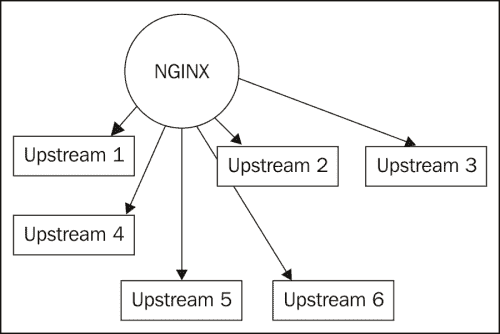
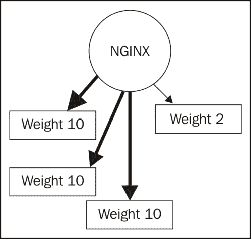
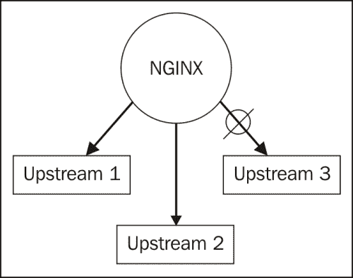
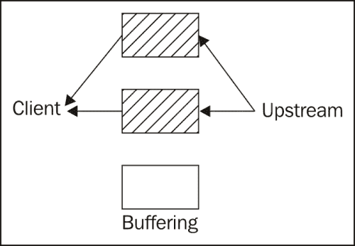
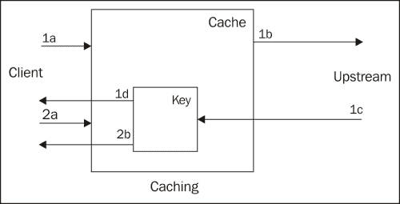
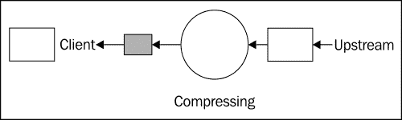

# 第五章：反向代理高级话题

正如我们在上一章看到的，反向代理代表客户端与上游服务器建立连接。因此，这些上游服务器与客户端之间没有直接连接。这是出于多个原因，比如安全性、可扩展性和性能。

反向代理服务器有助于提高安全性，因为如果攻击者试图直接访问上游服务器，他必须首先找到访问反向代理的方法。与客户端的连接可以通过 HTTPS 加密。SSL 连接可能在反向代理上终止，当上游服务器无法或不应该提供此功能时。NGINX 可以充当 SSL 终止器，并根据不同的客户端属性提供额外的访问列表和限制。

可扩展性可以通过使用反向代理来实现，反向代理能够与多个上游服务器建立并行连接，使它们像一个服务器一样工作。如果应用程序需要更多的处理能力，可以向由单个反向代理提供服务的服务器池中添加更多的上游服务器。

通过使用反向代理，应用程序的性能可以在多个方面得到提升。反向代理可以缓存和压缩内容，然后再将其传送给客户端。NGINX 作为反向代理，能够处理比典型应用服务器更多的并发客户端连接。某些架构配置 NGINX 从本地磁盘缓存中提供静态内容，只将动态请求传递给上游服务器处理。客户端可以保持与 NGINX 的连接，而 NGINX 则立即终止与上游服务器的连接，从而释放上游服务器的资源。

我们将在接下来的章节中讨论这些话题以及其余的代理模块指令：

+   通过分离实现安全

+   为了可扩展性隔离应用组件

+   反向代理性能调优

# 通过分离实现安全

我们可以通过分离客户端与应用程序连接的节点来实现一定程度的安全性。这是使用反向代理架构的主要原因之一。客户端仅直接连接到运行反向代理的机器。因此，这台机器应该足够安全，防止攻击者找到入侵点。

安全性是一个非常庞大的话题，我们将简要介绍需要注意的主要要点：

+   在反向代理前设置防火墙，只允许公共访问端口 80（如果需要 HTTPS 连接，则允许端口 443）

+   确保 NGINX 作为非特权用户运行（通常是 `www`、`webservd` 或 `www-data`，具体取决于操作系统）

+   在可以的地方加密流量，以防止窃听

我们将在下一节中详细讨论这一点。

## 使用 SSL 加密流量

NGINX 经常用于终止 SSL 连接，原因可能是上游服务器无法使用 SSL，或者是为了减轻 SSL 连接的处理负载。这要求你的 `nginx` 二进制文件是使用 SSL 支持编译的（`--with_http_ssl_module`），并且你需要安装 SSL 证书和密钥。

### 注意

有关如何生成你自己的 SSL 证书的详细信息，请参阅 第三章 中的 *使用 OpenSSL 生成 SSL 证书* 提示，*使用邮件模块*。

以下是启用 `www.example.com` 的 HTTPS 连接的配置示例：

```
server {

   listen             443 default ssl;

   server_name www.example.com;

    ssl_prefer_server_ciphers  on;

    ssl_protocols    TLSv1 SSLv3;

    ssl_ciphers      RC4:HIGH:!aNULL:!MD5:@STRENGTH;

    ssl_session_cache    shared:WEB:10m;

    ssl_certificate        /usr/local/etc/nginx/www.example.com.crt;

    ssl_certificate_key /usr/local/etc/nginx/www.example.com.key;

    location / {

        proxy_set_header X-FORWARDED-PROTO https;

        proxy_pass http://upstream;

    }

}
```

在上述示例中，我们首先通过在 `listen` 指令中使用 `ssl` 参数来激活 `ssl` 模块。然后，我们指定希望服务器优先选择密码套件而不是客户端的列表，因为我们可以配置服务器使用那些已被证明最安全的密码套件。这可以防止客户端协商已被废弃的密码套件。`ssl_session_cache` 指令被设置为 `shared`，这样所有工作进程都可以利用已经为每个客户端完成的昂贵的 SSL 协商。多个虚拟服务器可以使用相同的 `ssl_session_cache` 指令，只要它们都配置了相同的名称，或者此指令在 `http` 上下文中指定。值的第二部分和第三部分分别是缓存的名称和大小。然后，只需为该主机指定证书和密钥即可。请注意，该密钥文件的权限应设置为仅允许主进程读取。我们将头部 `X-FORWARDED-PROTO` 设置为值 `https`，以便上游服务器上的应用程序能够识别原始请求使用了 HTTPS。

### 提示

**SSL 密码套件**

前面提到的密码套件是基于 NGINX 的默认配置选择的，排除了那些没有认证功能（`aNULL`）的套件以及使用 MD5 的套件。RC4 被放在最前面，以便优先选择那些不容易受到 CVE-2011-3389 中描述的 BEAST 攻击影响的密码套件。`@STRENGTH` 字符串出现在列表末尾，用来根据加密算法的密钥长度对密码套件进行排序。

我们刚刚加密了客户端和反向代理之间的流量。还可以加密反向代理和上游服务器之间的流量：

```
server {
    …

    proxy_pass https://upstream;

}
```

这通常仅限于那些即使是流经该连接的内部网络也被认为不安全的架构。

## 使用 SSL 认证客户端

一些应用程序使用客户端提供的 SSL 证书中的信息，但在反向代理架构中，这些信息并不可直接获取。为了将这些信息传递给应用程序，你可以指示 NGINX 设置一个额外的头部：

```
location /ssl {

    proxy_set_header ssl_client_cert $ssl_client_cert;

    proxy_pass http://upstream;

}
```

`$ssl_client_cert`变量包含客户端的 SSL 证书，格式为 PEM。我们将其以相同名称的头信息传递给上游服务器。应用程序本身则负责根据适当的方式使用这些信息。

NGINX 不会将整个客户端证书传递给上游服务器，而是提前进行一些工作，查看客户端是否有效。有效的客户端 SSL 证书是指由一个被认可的证书颁发机构签署的证书，且有效期在未来，并且未被撤销：

```
server {
    …

    ssl_client_certificate /usr/local/etc/nginx/ClientCertCAs.pem;

    ssl_crl /usr/local/etc/nginx/ClientCertCRLs.crl;

    ssl_verify_client on;

    ssl_verify_depth 3;

    error_page 495 = @noverify;

    error_page 496 = @nocert;

    location @noverify {

        proxy_pass http://insecure?status=notverified;

    }

    location @nocert {

        proxy_pass http://insecure?status=nocert;

    }

    location / {

        if ($ssl_client_verify = FAILED) {

            return 495;

        }

        proxy_pass http://secured;

    }

}
```

上述配置由以下部分构成，以实现 NGINX 在将请求传递给上游服务器之前验证客户端 SSL 证书的目标：

+   `ssl_client_certificate`指令的参数指定了 PEM 编码的根 CA 证书列表的路径，该列表将被视为有效的客户端证书签署者。

+   `ssl_crl`参数指示证书撤销列表的路径，该列表由负责签发客户端证书的证书颁发机构发布。此 CRL 需要单独下载并定期刷新。

+   `ssl_verify_client`指令声明我们希望 NGINX 检查客户端所呈现的 SSL 证书的有效性。

+   `ssl_verify_depth`指令负责检查在声明证书无效之前要检查的签署者数量。SSL 证书可能由一个或多个中间 CA 签署。无论是中间 CA 证书还是签署它的根 CA，都需要在我们的`ssl_client_certificate`路径中，才能使 NGINX 认为客户端证书是有效的。

+   如果在客户端证书验证过程中发生某种错误，NGINX 将返回非标准错误代码 495。我们已定义了一个匹配此代码的`error_page`，并将请求重定向到一个命名位置，由单独的代理服务器处理。我们还在`proxy_pass`位置中包含了对`$ssl_client_verify`值的检查，因此无效证书也会返回此代码。

+   如果证书无效，NGINX 将返回非标准错误代码 496，我们也通过`error_page`指令捕获该错误。我们定义的`error_page`指令指向一个命名位置，该位置将请求代理到单独的错误处理程序。

只有在客户端提供有效的 SSL 证书时，NGINX 才会将请求传递给上游服务器`secured`。通过这样做，我们确保只有经过身份验证的用户才能向上游服务器发起请求。这是反向代理的重要安全功能。

### 注意

从 NGINX 版本 1.3.7 开始，提供了使用 OCSP 响应器来验证客户端 SSL 证书的功能。有关如何激活此功能的描述，请参阅附录 A，*指令参考*中的`ssl_stapling*`和`ssl_trusted_certificate`指令。

如果应用程序仍然需要证书中的某些信息，例如用于授权用户，NGINX 可以通过头部传递这些信息：

```
location / {

    proxy_set_header X-HTTP-AUTH $ssl_client_s_dn;

    proxy_pass http://secured;

}
```

现在，我们在上游服务器`secured`上运行的应用程序可以使用`X-HTTP-AUTH`头部的值来授权客户端访问不同区域。变量`$ssl_client_s_dn`包含客户端证书的主题`DN`。应用程序可以利用这些信息将用户与数据库中的记录进行匹配，或在目录中查找。

## 基于源 IP 地址阻止流量

由于客户端连接终止于反向代理，因此可以基于 IP 地址限制客户端。这在滥用的情况下很有用，其中一些无效连接源自某些 IP 地址。就像在 Perl 中一样，解决问题的方法不止一种。我们将在这里讨论`GeoIP`模块，作为一种可能的解决方案。

你的`nginx`二进制文件需要在编译时激活`GeoIP`模块（`--with-http_geoip_module`），并且系统上需要安装 MaxMind GeoIP 库。通过`http`上下文中的`geoip_country`指令指定预编译数据库文件的位置。这是按国家代码阻止/允许 IP 地址的最有效方式：

```
geoip_country /usr/local/etc/geo/GeoIP.dat;
```

如果客户端的连接来自该数据库中列出的 IP 地址，`$geoip_country_code`变量的值将设置为源国的 ISO 两字母代码。

我们将使用`GeoIP`模块提供的数据，并结合命名相似的`geo`模块。`geo`模块提供了一个非常基本的接口，用于根据客户端连接的 IP 地址设置变量。它设置了一个命名的上下文，其中第一个参数是要匹配的 IP 地址，第二个是匹配时应获得的值。通过将这两个模块结合使用，我们可以根据来源国家阻止 IP 地址，同时允许来自特定 IP 地址组的访问。

在我们的场景中，我们为瑞士银行提供服务。我们希望网站的公共部分被 Google 索引，但目前仍限制只有瑞士 IP 可以访问。我们还希望本地监控服务能够访问网站，确保它仍然正常响应。我们定义了一个变量`$exclusions`，默认值为`0`。如果满足我们的任何条件，值将设置为`1`，我们将使用它来控制访问权限：

```
http {

    # the path to the GeoIP database

    geoip_country /usr/local/etc/geo/GeoIP.dat;

    # we define the variable $exclusions and list all IP addresses # allowed
    #   access by setting the value to "1"

    geo $exclusions {

        default 0;
        127.0.0.1 1;
        216.239.32.0/19 1;
        64.233.160.0/19 1;
        66.249.80.0/20  1;
        72.14.192.0/18  1;
        209.85.128.0/17 1;
        66.102.0.0/20   1;
        74.125.0.0/16   1;
        64.18.0.0/20    1;
        207.126.144.0/20 1;
        173.194.0.0/16 1;

    }

    server {

        # the country code we want to allow is "CH", for Switzerland
        if ($geoip_country_code = "CH") {

            set $exclusions 1;

        }
        location / {

            # any IP's not from Switzerland or in our list above # receive the
            # default value of "0" and are given the Forbidden HTTP# code
            if ($exclusions = "0" ) {

                return 403;

            }

            # anybody else has made it this far and is allowed access# to the
            # upstream server
            proxy_pass http://upstream;

        }

    }

}
```

这只是解决基于客户端 IP 地址阻止访问网站问题的一种方法。其他解决方案包括将客户端的 IP 地址保存在键值存储中，为每次请求更新计数器，并在某个时间段内请求次数过多时阻止访问。

# 隔离应用程序组件以实现可扩展性

扩展应用程序可以通过两个维度来描述，向上和向外。向上扩展指的是为机器增加更多资源，扩大其可用资源池，以满足客户端需求。向外扩展则意味着向可用响应池中添加更多机器，以便没有一台机器被占用处理大部分客户端请求。无论这些机器是运行在云中的虚拟实例，还是坐落在数据中心的物理机器，通常向外扩展比向上扩展更具成本效益。此时，NGINX 作为反向代理发挥了重要作用。

由于其极低的资源使用，NGINX 作为客户端与应用程序之间的代理非常理想。NGINX 处理与客户端的连接，能够同时处理多个请求。根据配置，NGINX 要么从本地缓存中交付文件，要么将请求传递给上游服务器进行进一步处理。上游服务器可以是任何使用 HTTP 协议的服务器。与上游服务器直接响应相比，NGINX 能够处理更多客户端连接：

```
upstream app {

    server 10.0.40.10;

    server 10.0.40.20;

    server 10.0.40.30;

}
```

随着时间的推移，最初的一组上游服务器可能需要扩展。由于网站流量增加，当前的服务器无法及时响应。通过将 NGINX 用作反向代理，可以轻松通过添加更多上游服务器来解决这一问题。



添加更多上游服务器可以通过以下方式完成：

```
upstream app {

    server 10.0.40.10;

    server 10.0.40.20;
    server 10.0.40.30;

    server 10.0.40.40;

    server 10.0.40.50;

    server 10.0.40.60;

}
```

也许是时候重新编写应用程序，或者将其迁移到具有不同应用栈的服务器上。在将整个应用程序迁移之前，可以将一台服务器引入活动池中，在真实负载和实际客户端下进行测试。为了最小化可能出现问题时的负面反应，可以减少这台服务器的请求量。



通过以下配置来完成此操作：

```
upstream app {

    server 10.0.40.10 weight 10;

    server 10.0.40.20 weight 10;

    server 10.0.40.30 weight 10;

    server 10.0.40.100 weight 2;

}
```

另外，可能是时候对某个特定的上游服务器进行计划性维护了，因此它不应接收任何新的请求。通过在配置中将该服务器标记为`down`，我们可以继续进行维护工作：



以下配置描述了如何将服务器标记为`down`：

```
upstream app {

    server 10.0.40.10;

    server 10.0.40.20;

    server 10.0.40.30 down;

}
```

无响应的上游服务器应尽快处理。根据应用程序的不同，超时指令可以设置得非常低：

```
location / {

    proxy_connect_timeout 5;

    proxy_read_timeout 10;

    proxy_send_timeout 10;

}
```

然而，请小心，上游服务器通常需要在超时设置的时间内响应，否则如果在此时间内没有上游服务器响应，NGINX 可能会返回 **504 网关超时错误**。

# 反向代理性能调优

NGINX 可以通过多种方式进行调整，以充分发挥它作为反向代理时的性能。通过缓冲、缓存和压缩，NGINX 可以被配置为尽可能优化客户端的体验。

## 缓冲

缓冲可以通过以下图表来描述：



在进行代理时，考虑性能时最重要的因素是缓冲。NGINX 默认会尽可能快速地从上游服务器读取尽可能多的数据，然后再将响应返回给客户端。它会将响应缓存在本地，以便一次性将其发送给客户端。如果客户端的请求或上游服务器的响应需要写入磁盘，性能可能会下降。这是 RAM 和磁盘之间的权衡。因此，在配置 NGINX 作为反向代理时，考虑以下指令非常重要：

### 表格：代理模块缓冲指令

| 指令 | 说明 |
| --- | --- |
| `proxy_buffer_size` | 用于上游服务器响应的第一部分的缓冲区大小，其中包含响应头信息。 |
| `proxy_buffering` | 启用代理内容的缓冲；当关闭时，响应会在接收到后同步发送给客户端，前提是设置了 `proxy_max_temp_file_size` 参数为 `0`。将此值设置为 `0` 并将 `proxy_buffering` 设置为 `on` 可确保在代理过程中不使用磁盘，同时仍启用缓冲。 |
| `proxy_buffers` | 用于来自上游服务器响应的缓冲区数量和大小。 |
| `proxy_busy_buffers_size` | 在从上游服务器读取时，分配给发送响应给客户端的缓冲区空间的总大小。通常设置为两个 `proxy_buffers`。 |

除了上述指令外，上游服务器还可以通过设置 `X-Accel-Buffering` 头部来影响缓冲。此头部的默认值为 `yes`，表示响应将被缓冲。将其值设置为 `no` 对于 Comet 和 HTTP 流应用程序非常有用，因为这些应用程序需要避免缓冲响应。

通过测量反向代理中经过的平均请求和响应大小，可以优化代理缓冲区的大小。每个缓冲区指令都是按连接计算的，此外还有操作系统相关的每连接开销，因此我们可以根据系统的内存量计算可以支持多少个并发客户端连接。

`proxy_buffers` 指令的默认值（`8 4k` 或 `8 8k`，取决于操作系统）允许大量并发连接。我们来算算这到底能处理多少连接。在一台典型的 1 GB 机器上，如果仅运行 NGINX，大部分内存可以专门分配给它使用。操作系统会用一些内存来处理文件系统缓存和其他需求，所以我们保守估计 NGINX 的可用内存为 768 MB。

八个 4 KB 缓冲区是每个活跃连接 32,768 字节（8 * 4 * 1024）。

我们分配给 NGINX 的 768 MB 是 805,306,368 字节（768 * 1024 * 1024）。

将两者相除，我们得到 805306368 / 32768 = 24576 个活跃连接。

因此，NGINX 在其默认配置下能够处理不到 25,000 个并发活跃连接，假设这些缓冲区会持续被填充。还有许多其他因素也会影响结果，例如缓存内容和空闲连接，但这为我们提供了一个良好的估算值。

现在，如果我们把以下数字作为我们的平均请求和响应大小，我们会发现八个 4 KB 缓冲区根本不足以处理一个典型的请求。我们希望 NGINX 能尽可能缓冲更多的响应，以便用户一次性接收所有数据，前提是用户的网络连接足够快。

+   平均请求大小：800 字节

+   平均响应大小：900 KB

    ### 注意

    本节其余的调优示例将在牺牲并发活跃连接的情况下使用更多内存。它们是优化建议，不应理解为通用配置的推荐。NGINX 已经经过优化调优，可以为大量慢速客户端和少量快速上游服务器提供服务。随着计算趋势越来越偏向于移动用户，客户端连接的速度远低于宽带用户的连接速度。因此，在进行任何优化之前，了解你的用户及其连接方式是非常重要的。

我们将相应地调整缓冲区大小，以便整个响应能够适配到缓冲区中：

```
http {

    proxy_buffers 30 32k;

}
```

这意味着，当然，我们将能够处理的并发用户数量要少得多。

三十个 32 KB 缓冲区是每个连接 983,040 字节（30 * 32 * 1024）。

我们分配给 NGINX 的 768 MB 是 805,306,368 字节（768 * 1024 * 1024）。

将两者相除，我们得到 805306368 / 983040 = 819.2 个活跃连接。

这并不算太多并发连接。让我们减少缓冲区的数量，并确保 NGINX 在剩余的 `proxy_buffers` 空间内读取完其余响应内容时，能够开始向客户端传输一些数据：

```
http {

    proxy_buffers 4 32k;

    proxy_busy_buffers_size 64k;

}
```

四个 32 KB 缓冲区是每个连接 131,072 字节（4 * 32 * 1024）。

我们分配给 NGINX 的 768 MB 是 805,306,368 字节（768 * 1024 * 1024）。

将两者相除，我们得到 805306368 / 131072 = 6144 个活跃连接。

对于反向代理服务器，我们可能希望通过增加更多内存（6 GB RAM 大约可以支持 37,000 个连接）来扩展，或者通过在负载均衡器后添加更多 1 GB 的机器来扩展，直到我们可以预期的并发活动用户数为止。

## 缓存

缓存可以通过以下图示来描述：



NGINX 还能够缓存来自上游服务器的响应，这样相同的请求再次发出时就不必再去上游服务器获取响应。前面的图示如下所示：

+   **1a**：客户端发起请求

+   **1b**：请求的缓存键当前在缓存中找不到，因此 NGINX 从上游服务器请求该内容。

+   **1c**：上游服务器响应，NGINX 将对应请求的缓存键的响应放入缓存中。

+   **1d**：响应被传递给客户端

+   **2a**：另一个客户端发起具有匹配缓存键的请求

+   **2b**：NGINX 能够直接从缓存中提供响应，而无需首先从上游服务器获取响应。

### 表格：代理模块缓存指令

| 指令 | 说明 |
| --- | --- |
| `proxy_cache` | 定义用于缓存的共享内存区域。 |
| `proxy_cache_bypass` | 一个或多个字符串变量，当它们非空或非零时，将导致从上游服务器获取响应，而不是从缓存中获取。 |
| `proxy_cache_key` | 用作存储和检索缓存值的键的字符串。可以使用变量，但应小心避免缓存相同内容的多个副本。 |
| `proxy_cache_lock` | 启用此指令将防止在缓存未命中的情况下向上游服务器发出多个请求。这些请求将等待第一个请求返回并在缓存键中创建条目。此锁定按工作进程划分。 |
| `proxy_cache_lock_timeout` | 请求等待缓存中条目出现或`proxy_cache_lock`释放的时间长度。 |
| `proxy_cache_min_uses` | 需要多少次请求才能缓存某个键的响应。 |

| `proxy_cache_path` | 存放缓存响应的目录以及存储活跃键和响应元数据的共享内存区域（`keys_zone=name:size`）。可选参数有：

+   `levels`：每级子目录名称的冒号分隔长度（1 或 2），最多三层深度

+   `inactive`：未活跃响应在缓存中保留的最长时间，超过此时间会被移除。

+   `max_size`：缓存的最大大小；当超过此值时，缓存管理进程会删除最近最少使用的条目。

+   `loader_files`：缓存加载器进程每次迭代中加载的缓存文件元数据的最大数量

+   `loader_sleep`：缓存加载器进程每次迭代之间暂停的毫秒数

+   `loader_threshold`：缓存加载器迭代可能花费的最长时间

|

| `proxy_cache_use_stale` | 在访问上游服务器时发生错误，接受提供过期缓存数据的情况。`updating` 参数表示正在加载新数据的情况。 |
| --- | --- |
| `proxy_cache_valid` | 指定带有响应码 200、301 或 302 的缓存响应有效的时间。如果在时间参数之前给出了可选的响应码，则该时间仅适用于该响应码。特殊参数 `any` 表示任何响应码都应缓存该时长。 |

以下配置旨在缓存所有响应六小时，直到总缓存大小达到 1 GB。任何保持新鲜的项目，即在六小时超时内被调用的项目，有效期最长为一天。超过此时间后，将再次调用上游服务器提供响应。如果由于错误、超时、无效头部，或者缓存项正在更新，导致上游服务器无法响应，则可能使用过期缓存元素。共享内存区 **CACHE** 被定义为 10 MB 大，并在需要设置和查找缓存键的 `location` 中引用。

```
http {

    # we set this to be on the same filesystem as proxy_cache_path
    proxy_temp_path /var/spool/nginx;

    # good security practice dictates that this directory is owned by the
    #  same user as the user directive (under which the workers run)
    proxy_cache_path /var/spool/nginx keys_zone=CACHE:10m levels=1:2 inactive=6h max_size=1g;

    server {

        location / {

            # using include to bring in a file with commonly-used settings
            include proxy.conf;

            # referencing the shared memory zone defined above
            proxy_cache CACHE;

            proxy_cache_valid any 1d;

            proxy_cache_use_stale error timeout invalid_header updating http_500 http_502 http_503 http_504;

            proxy_pass http://upstream;

        }

    }

}
```

使用此配置，NGINX 将在 `/var/spool/nginx` 下设置一系列目录，首先根据 URI 的 MD5 哈希值的最后一个字符进行区分，接着是倒数第二个字符。例如，"/this-is-a-typical-url" 的响应将存储为：

```
/var/spool/nginx/3/f1/614c16873c96c9db2090134be91cbf13
```

除了 `proxy_cache_valid` 指令外，许多头部控制着 NGINX 如何缓存响应。头部的值优先于指令。

+   `X-Accel-Expires` 头可以由上游服务器设置来控制缓存行为：

    +   整数值表示响应可以缓存的时间，单位为秒。

    +   如果此头的值为 `0`，则该响应的缓存将完全禁用。

+   以 `@` 开头的值表示自纪元以来的秒数。响应仅在此绝对时间之前有效。

+   `Expires` 和 `Cache-Control` 头具有相同的优先级。

+   如果 `Expires` 头的值在未来，响应将一直被缓存直到该时间。

+   `Cache-Control` 头可以有多个值：

    +   `no-cache`

    +   `no-store`

    +   `private`

    +   `max-age`

+   唯一会实际缓存响应的值是 `max-age`，它是一个数字且大于零，也就是说，`max-age=x` 其中 `x` > 0。

+   如果 `Set-Cookie` 头存在，则响应不会被缓存。

    然而，这可以通过使用 `proxy_ignore_headers` 指令来覆盖：

    ```
    proxy_ignore_headers Set-Cookie;
    ```

+   但是如果这样做，请确保将 cookie 值作为 `proxy_cache_key` 的一部分：

    ```
    proxy_cache_key "$host$request_uri $cookie_user";
    ```

不过在进行此操作时需要小心，以防止多个响应主体被缓存到相同的 URI。这种情况可能发生在公共内容意外地为其设置了 `Set-Cookie` 头部，导致该头部成为访问该数据的键的一部分。将公共内容分离到不同的位置是一种确保缓存有效使用的方法。例如，可以从 `/img` 位置提供图片，并在该位置定义不同的 `proxy_cache_key`：

```
server {

    proxy_ignore_headers Set-Cookie;

    location /img {

        proxy_cache_key "$host$request_uri";

        proxy_pass http://upstream;

    }

    location / {

        proxy_cache_key "$host$request_uri $cookie_user";

        proxy_pass http://upstream;

    }

}
```

### 存储

与缓存概念相关的是 **存储**。如果你正在提供不会改变的大型静态文件，即没有必要使条目过期，那么 NGINX 提供了一种叫做存储的功能，帮助更快地提供这些文件。NGINX 会存储任何你配置它去获取的文件的本地副本。这些文件将保留在磁盘上，并且不会再次请求上游服务器。如果这些文件在上游发生变化，它们需要通过某种外部过程被删除，否则 NGINX 将继续提供这些文件，因此对于较小的静态文件，使用缓存更为合适。

以下配置总结了用于存储这些文件的指令：

```
http {

    proxy_temp_path /var/www/tmp;

    server {

        root /var/www/data

        location /img {

            error_page 404 = @store;

        }

        location @store {

            internal;

            proxy_store on;

            proxy_store_access group:r all:r;

            proxy_pass http://upstream;

        }

    }

}
```

在此配置中，我们定义了一个 `server`，其 `root` 位于与 `proxy_temp_path` 相同的文件系统下。`location` 指令 `/img` 将继承此 `root`，并提供与 URI 路径相同名称的文件，这些文件位于 `/var/www/data` 下。如果文件未找到（错误代码 404），则会调用命名的 `location` 指令 `@store`，从上游获取该文件。`proxy_store` 指令表示我们希望将文件存储在继承的 `root` 下，权限为 `0644`（`user:rw` 是默认的，而 `group` 或 `all` 则在 `proxy_store_access` 中指定）。这就是 NGINX 存储上游服务器提供的静态文件本地副本所需要的全部配置。

## 压缩

压缩可以通过以下图示来描述：



针对带宽优化可以帮助减少响应的传输时间。NGINX 具有在将响应从上游服务器转发给客户端之前对其进行压缩的能力。默认启用的 `gzip` 模块通常用于反向代理，以在合适的情况下压缩内容。某些文件类型压缩效果不好，某些客户端对压缩内容反应不佳。我们可以在配置中同时考虑这两种情况：

```
http {

    gzip on;

    gzip_http_version 1.0;

    gzip_comp_level 2;

    gzip_types text/plain text/css application/x-javascript text/xml application/xml application/xml+rss text/javascript application/javascript application/json;

    gzip_disable msie6;

}
```

在这里，我们指定了如果请求至少通过 HTTP/1.0 进行，并且用户代理报告不是旧版的 Internet Explorer，我们希望对前述 MIME 类型的文件进行 gzip 压缩，压缩级别为 2。我们将此配置放在 `http` 上下文中，以使其适用于我们定义的所有服务器。

以下表格列出了 `gzip` 模块中可用的指令：

### 表格：Gzip 模块指令

| 指令 | 说明 |
| --- | --- |
| `gzip` | 启用或禁用响应的压缩。 |
| `gzip_buffers` | 指定用于压缩响应的缓冲区数量和大小。 |
| `gzip_comp_level` | gzip 压缩级别（1-9）。 |
| `gzip_disable` | 一个正则表达式，表示不应接收压缩响应的`User-Agents`。特殊值`msie6`是`MSIE [4-6]\.`的快捷方式，但排除`MSIE 6.0; ... SV1`。 |
| `gzip_min_length` | 在考虑压缩之前响应的最小长度，由`Content-Length`头部确定。 |
| `gzip_http_version` | 请求的最低 HTTP 版本，压缩才会被考虑。 |

| `gzip_proxied` | 如果请求已经通过代理，则启用或禁用压缩。接受以下一个或多个参数：

+   `off`: 禁用压缩

+   `expired`: 当响应不应被缓存时（由`Expires`头部确定），启用压缩

+   `no-cache`: 当`Cache-Control`头部为`no-cache`时启用压缩

+   `no-store`: 当`Cache-Control`头部为`no-store`时启用压缩

+   `private`: 当`Cache-Control`头部为`private`时启用压缩

+   `no_last_modified`: 当响应没有`Last-Modified`头部时启用压缩

+   `no_etag`: 当响应没有`ETag`头部时启用压缩

+   `auth`: 当请求包含`Authorization`头部时启用压缩

+   `any`: 对于任何包含`Via`头部的响应启用压缩

|

| `gzip_types` | 除默认值`text/html`之外，应该压缩的 MIME 类型。 |
| --- | --- |
| `gzip_vary` | 如果 gzip 处于活动状态，则启用或禁用响应头`Vary: Accept-Encoding`。 |

当启用 gzip 压缩并且发现大文件被截断时，可能的原因是`gzip_buffers`。默认值为`32 4k`或`16 8k`缓冲区（具体取决于平台），总缓冲区大小为 128 KB。这意味着 NGINX 要压缩的文件不能大于 128 KB。如果你使用的是未压缩的大型 JavaScript 库，可能会超过这个限制。如果是这种情况，只需增加缓冲区数量，使得总缓冲区大小足够容纳整个文件。

```
http {

    gzip on;

    gzip_min_length 1024;

    gzip_buffers 40 4k;

    gzip_comp_level 5;

    gzip_types text/plain application/x-javascript application/json;

}
```

例如，上述配置将启用对任何最大为 40 * 4 * 1024 = 163840 字节（或 160 KB）的大文件进行压缩。我们还使用`gzip_min_length`指令来告诉 NGINX 仅在文件大于 1 KB 时才进行压缩。通常，`gzip_comp_level`设为 4 或 5 是速度与压缩文件大小之间的良好折衷。根据你的硬件进行测试是找到合适配置值的最佳方式。

除了对响应进行实时压缩外，NGINX 还可以通过`gzip_static`模块提供预压缩文件。该模块默认未编译，但可以通过`--with-http_gzip_static_module`编译时开关启用。该模块本身只有一个指令`gzip_static`，但还使用`gzip`模块的以下指令，以确定何时检查预压缩文件：

+   `gzip_http_version`

+   `gzip_proxied`

+   `gzip_disable`

+   `gzip_vary`

在以下配置中，当请求包含`Authorization`头且响应包含禁用缓存的`Expires`或`Cache-Control`头时，我们启用预压缩文件的传送：

```
http {

    gzip_static on;

    gzip_proxied expired no-cache no-store private auth;

}
```

# 概述

在本章中，我们已经看到 NGINX 如何有效地作为反向代理使用。它可以单独或以某种组合方式扮演三种角色：增强安全性、实现可扩展性和/或提升性能。通过将应用与最终用户分离来实现安全性。NGINX 可以与多个上游服务器结合使用以实现可扩展性。应用的性能直接关系到它对用户请求的响应速度。我们探索了不同的机制来实现一个更具响应性的应用。更快的响应时间意味着用户更满意。

接下来将探讨 NGINX 作为 HTTP 服务器的应用。到目前为止，我们只讨论了 NGINX 如何作为反向代理，但 NGINX 的能力远不止这些。
