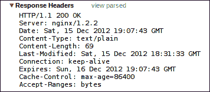

# 第七章：NGINX for the Developer

到目前为止，本书中我们已经看到如何为多种不同的场景配置 NGINX。我们尚未做的是，了解 NGINX 为应用程序开发者提供的可能性。NGINX 有多种方式可以直接集成到您的应用程序中。我们将在以下章节中探讨这些可能性：

+   缓存集成

+   实时内容更改

+   使用服务器端包含（Server Side Includes）

+   NGINX 中的决策制定

+   创建安全链接

+   生成图像

+   跟踪网站访问者

+   防止意外的代码执行

# 缓存集成

NGINX 在提供静态内容方面表现卓越。它被设计成能够支持超过 100,000 个并发连接，同时仅使用最小的系统资源。将动态 Web 应用程序集成到这样一个架构良好的服务器中可能会导致服务器性能下降。我们可能无法支持那么多的并发连接，但这并不意味着我们不能依然为用户提供快速的 Web 体验。

缓存机制在第五章，*反向代理高级主题*中介绍过。在本节中，我们将深入探讨将 NGINX 的缓存机制集成到 Web 应用程序中的方式。您的 Web 应用程序可能已经在一定程度上实现了缓存。也许它将预渲染的页面写入数据库，以避免在每次页面访问时重复执行昂贵的渲染任务。或者，更好的是，您的应用程序可能会将预渲染的页面写入文件系统，这样它们就可以通过 NGINX 强大的静态文件性能直接提供。无论您的应用程序已经实现了什么样的缓存机制（即使没有缓存机制），NGINX 都提供了一种将其集成到服务器中的方式。

## 无应用程序缓存

当您的应用程序完全不进行缓存时，NGINX 仍然可以帮助加速用户的响应时间。`proxy`和`fastcgi`模块都可以利用此缓存功能。因此，您将使用`proxy_cache_*`或`fastcgi_cache_*`指令来配置应用程序的缓存。`proxy_cache_*`指令在第五章，*反向代理高级主题*中已有描述；`fastcgi_cache_*`指令在第六章，*NGINX HTTP 服务器*中进行了总结。

在这里，我们将描述如何扩展您的应用程序，以指示 NGINX 如何缓存单独的页面。这是通过使用发送到 NGINX 的头信息来完成的。您可以使用标准的`Expires`和`Cache-Control`头信息，或者使用特殊的`X-Accel-Expires`头信息，NGINX 会将其用于缓存，并且不会传递给客户端。这个头信息允许应用程序完全控制 NGINX 缓存文件的时长。这使得过期正常长期存在的对象变得非常容易。

假设你有一个新闻应用程序，页面加载时间过慢。这可能由不同的原因造成，但经过分析，你已确定每个页面都是实时从存储在数据库中的内容渲染的。当用户访问网站时，这会导致打开新的数据库连接，执行多个 SQL 查询，并解析结果，直到可以将完全渲染的页面交付给该用户。由于应用程序后端系统中的多个连接，架构无法轻松重构以利用更合理的渲染策略。

鉴于这些限制，你决定采用以下缓存策略：

+   首页需要缓存 1 分钟，因为它包含指向文章的链接，并且列表经常更新

+   每篇文章将缓存 1 天，因为一旦写入，它们就不会改变，但我们不希望缓存被旧条目填满，这些条目需要因空间不足而被移除

+   任何图片都会尽可能长时间地缓存，因为这些图片也存储在数据库中，获取它们是一个真正昂贵的操作。

我们将按如下方式配置 NGINX 来支持这一策略：

```
http {

    # here we configure two separate shared memory zones for the keys/metadata
    #   and filesystem paths for the cached objects themselves
    proxy_cache_path /var/spool/nginx/articles keys_zone=ARTICLES:16m levels=1:2 inactive=1d;

    proxy_cache_path /var/spool/nginx/images keys_zone=IMAGES:128m levels=1:2 inactive=30d;

    # but both paths still lie on the same filesystem as proxy_temp_path
    proxy_temp_path /var/spool/nginx;

    server {

        location / {

            # this is where the list of articles is found
            proxy_cache_valid 1m;

        }

        location /articles {

            # each article has a URI beginning with "/articles"
            proxy_cache_valid 1d;

        }

        location /img {

            # every image is referenced with a URI under "/img"
            proxy_cache_valid 10y;

        }

}
```

这就解决了我们的需求。现在，我们已经为一个没有缓存支持的遗留应用程序启用了缓存。

## 数据库中的缓存

如果你的应用程序当前将预渲染的页面缓存到数据库中，那么应该可以在不做太多额外工作的情况下将这些页面转存到 memcached 实例中。NGINX 能够直接从 memcached 中提供请求的答案。其逻辑如图所示：


接口非常简单，使其尽可能灵活。NGINX 在存储中查找一个键。如果找到了，它会将值返回给客户端。构造正确的键是一个配置任务，我们将在接下来的部分讨论。将值存储在该键下超出了 NGINX 设计的范围。这个任务属于应用程序。

确定使用哪个键是一个相对简单的任务。对于那些不是个性化的资源，最好的键是 URI 本身。这在 `$memcached_key` 变量中设置：

```
location / {

    set $memcached_key $uri;

    memcached_pass 127.0.0.1:11211;

}
```

如果你的应用程序读取请求参数来构建页面，那么 `$memcached_key` 应该包含这些参数：

```
location / {

    set $memcached_key "$uri?$args";

    memcached_pass 127.0.0.1:11211;

}
```

如果键不存在，NGINX 需要一种从应用程序请求页面的方法。希望应用程序随后将键值对写入 memcached，以便下次请求可以直接从内存中提供。如果在 memcached 中找不到键，NGINX 会报告“未找到”错误，因此将请求传递给应用程序的最佳方式是使用 `error_page` 指令和 `location` 来处理该请求。我们还应包括“错误网关”和“网关超时”的错误代码，以防 memcached 对我们的键查找没有响应：

```
server {

    location / {

        set $memcached_key "$uri?$args";

        memcached_pass 127.0.0.1:11211;

        error_page 404 502 504 = @app;

    }

    location @app {

        proxy_pass 127.0.0.1:8080;

    }

}
```

请记住，通过在`error_page`的参数中使用等号（`=`），NGINX 会将最后一个参数中的返回代码进行替换。这使得我们能够将错误条件转换为正常响应。

以下表格描述了`memcached`模块的指令，默认情况下会被编译到`nginx`二进制文件中：

### 表格：Memcached 模块指令

| 指令 | 说明 |
| --- | --- |
| `memcached_buffer_size` | memcached 响应的缓冲区大小。然后该响应会同步发送给客户端。 |
| `memcached_connect_timeout` | NGINX 在向 memcached 服务器发起请求时，等待连接被接受的最大时间。 |

| `memcached_next_upstream` | 根据以下一个或多个参数指定的条件，请求将被传递给下一个 memcached 服务器：

+   `error`: 与 memcached 服务器通信时发生了错误

+   `timeout`: 与 memcached 服务器通信时达到了超时

+   `invalid_response`: memcached 服务器返回了空的或其他无效的响应

+   `not_found`: 在此 memcached 实例中未找到键

+   `off`: 禁止将请求传递给下一个 memcached 服务器

|

| `memcached_pass` | 指定 memcached 服务器的名称或地址及其端口。也可以是`server`组，如在`upstream`上下文中声明。 |
| --- | --- |
| `memcached_read_timeout` | 指定两次连续读取操作之间需要经过的时间，超过该时间后连接将关闭。 |
| `memcached_send_timeout` | 两次连续写操作之间需要经过的时间，超过该时间后连接将关闭。 |

## 文件系统中的缓存

假设你的应用程序将预渲染的页面作为文件写入。你知道每个文件应当有效多久。你可以配置 NGINX 为每个文件添加某些头部信息，指示客户端以及任何中间代理文件应该被缓存多长时间。通过这种方式，你为用户启用了本地缓存，而不需要更改一行代码。

你可以通过设置`Expires`和`Cache-Control`头来实现这一点。这些是客户端和 HTTP 代理都能理解的标准 HTTP 头。你的应用程序不需要做任何修改；你只需在 NGINX 配置块中为相应位置设置这些头。NGINX 通过提供`expires`和`add_header`指令使得这一过程变得更加方便。

### 表格：头部修改指令

| 指令 | 说明 |
| --- | --- |
| `add_header` | 向 HTTP 状态码为 200、204、206、301、302、303、304 或 307 的响应的头部添加字段。 |
| `expires` | 添加或修改`Expires`和`Cache-Control`头部。参数可以是可选的`modified`参数，后面跟着`time`，或者是`epoch`、`max`或`off`中的一个。如果仅存在`time`，则`Expires`头将设置为当前时间加上`time`参数中指定的时间。`Cache-Control`将设置为`max-age=t`，其中`t`是作为参数指定的时间，单位为秒。如果`modified`参数在`time`值之前，则`Expires`头将设置为文件的修改时间加上`time`参数中指定的时间。如果`time`包含`@`，则指定的时间将被解释为一天中的时间；例如，`@12h`表示中午 12 点。`epoch`被定义为精确的日期和时间`Thu, 01 Jan 1970 00:00:01 GMT`。`max`将`Expires`设置为`Thu, 31 Dec 2037 23:55:55 GMT`，并将`Cache-Control`设置为 10 年。任何负时间都会将`Cache-Control`设置为`no-cache`。 |

了解你的应用程序生成的文件后，你可以适当地设置这些头部。让我们以一个示例应用程序为例，其中主页应缓存 5 分钟，所有 JavaScript 和 CSS 文件缓存 24 小时，每个 HTML 页面缓存 3 天，每个图像缓存尽可能长的时间：

```
server {

    root /home/www;

    location / {

        # match the index.html page explicitly so the *.html below
        #  won't match the main page
        location = /index.html	 {

            expires 5m;

        }

        # match any file ending in .js or .css (Javascript or CSS files)
        location ~* /.*\.(js|css)$ {

            expires 24h;

        }

        # match any page ending in .html
        location ~* /.*\.html$ {

            expires 3d;

        }

    }

    # all of our images are under a separate location (/img)
    location /img {

        expires max;

    }

}
```

要查看此配置如何设置头部，让我们看看每个位置在浏览器中的表现。每个现代浏览器都内置或提供插件工具，允许你查看请求和响应的头部。以下一系列截图展示了 Chrome 如何显示这些位置的响应头：

+   **主页** (`index.html`)：`Expires`头设置为比`Date`头晚 5 分钟。`Cache-Control`头的`max-age`参数设置为 300 秒。

+   **CSS 文件**：`Expires`头设置为比`Date`头晚 24 小时。`Cache-Control`头的`max-age`参数为 86400 秒。

+   **HTML 文件**：`Expires`头设置为比`Date`头晚 3 天。`Cache-Control`头的`max-age`参数设置为 259200 秒。

+   **图像**：`Expires`头设置为`Thu, 31 Dec 2037 23:55:55 GMT`。`Cache-Control`头的`max-age`参数设置为 315360000 秒。

只需在适当的位置设置一个指令`expires`，我们就可以确保预渲染的文件在本地缓存存储的时间是符合要求的。

# 动态更改内容

有时，处理来自应用程序的结果可能会很有用。也许您想在页面的某个位置添加一个字符串，以显示哪个前端服务器将该页面传递给客户端。或者您可能希望对呈现的 HTML 页面进行转换。NGINX 提供了三个可能在此处有用的模块：`addition`模块、`sub`模块和`xslt`模块。

## addition 模块

`addition`模块作为过滤器，在响应之前和/或之后添加文本。默认情况下不会被编译，因此如果要使用此功能，必须在配置时通过添加`--with-http_addition_module`来启用它。

该过滤器通过引用一个子请求来工作，然后将其附加到请求中，或将其放置在请求的开头：

```
server {

    root /home/www;

    location / {

        add_before_body /header;

        add_after_body /footer;

    }

    location /header {

        proxy_pass http://127.0.0.1:8080/header;

    }

    location /footer {

        proxy_pass http://127.0.0.1:8080/footer;

    }

}
```

`addition`模块的指令总结如下表所示：

### 表：HTTP addition 模块指令

| 指令 | 解释 |
| --- | --- |
| `add_before_body` | 在响应正文之前添加处理子请求的结果。 |
| `add_after_body` | 在响应正文之后添加处理子请求的结果。 |
| `addition_types` | 列出除了`text/html`之外响应的 MIME 类型，其中将进行附加操作。可以使用`*`来启用所有 MIME 类型。 |

## sub 模块

`sub`模块作为过滤器，用于替换（替代）一个文本为另一个文本。默认情况下不会被编译，因此如果要使用此功能，必须在配置时通过添加`--with-http_sub_module`来启用它。

使用起来非常简单。您只需使用`sub_filter`指令指定要替换的字符串及其替代字符串，然后过滤器会对字符串进行不区分大小写的匹配，并进行替换：

```
location / {

    sub_filter </head> '<meta name="frontend" content="web3"></head>';

}
```

在前面的示例中，我们在页面通过 NGINX 时向页面的头部添加了一个新的 meta 标签。

也可以多次进行匹配。为此，您需要将`sub_filter_once`指令设置为`off`。例如，这对将页面中的所有相对链接替换为绝对链接非常有用：

```
location / {

    sub_filter_once off;

    sub_filter '
```

## 表格：服务器端包含（SSI）命令

| 命令 | 参数 | 说明 |
| --- | --- | --- |
| `block` |   | 定义一个可以在`include`命令中引用的区域。以`<!--# endblock -->`结束。 |
|   | `name` | 块的名称。 |
| `config` |   | 设置 SSI 处理过程中使用的全局参数。 |
|   | `errmsg` | 配置用于作为错误消息的字符串，当 SSI 处理过程中出现问题时会显示该消息。默认值为`[处理指令时发生错误]`。 |
|   | `timefmt` | 传递给`strftime()`的字符串，用于格式化在其他命令中使用的时间戳。默认值是`%A, %d-%b-%Y %H:%M:%S %Z`。 |
| `echo` |   | 输出变量的值。 |
|   | `var` | 要写出的变量名。 |
|   | `encoding` | 用于变量的编码方法。它可以取值之一：`none`、`url`和`entity`。默认值是`entity`。 |
|   | `default` | 如果变量未定义，则写出的值。如果未设置，默认为`none`。 |
| `if` |   | 评估条件。如果为真，将包括被包围的块。支持`if`、`elsif`、`else`和`endif`的一级嵌套。 |

|   | `expr` | 要评估的布尔表达式：

+   变量存在性 (expr="$var")

+   文本比较 (`expr="$var = text"` 或 `expr="$var != text"`)

+   正则表达式匹配 (`expr="$var = /regexp/"` 或 `expr="$var != /regexp/"`)

|

| `include` |   | 写出子请求的结果。 |
| --- | --- | --- |
|   | `file` | 要`include`的文件名。 |
|   | `virtual` | 要包含的子请求的 URI。 |
|   | `stub` | 代替空内容体包含的块，或者如果处理时发生错误。 |
|   | `wait` | 如果同一页面上有多个`include`命令，且存在此参数，它们将按顺序处理。 |
|   | `set` | 如果虚拟子请求是指向`proxy_pass`或`memcached_pass`位置的，则结果可以存储在`set`参数指定的变量中。 |
| `set` |   | 创建一个变量并为其设置值。 |
|   | `var` | 要设置的变量名。 |
|   | `value` | 要设置的变量的值。 |

SSI 文件实际上只是一个嵌入了这些命令的 HTML 文件。这样，如果某个包含此类文件的特定位置没有启用`ssi`，HTML 部分仍然会渲染，尽管内容不完整。

以下是一个 SSI 文件的示例，使用子请求来渲染页面的头部、页脚和菜单：

```
<html>
  <head>
    <title>*** SSI test page ***</title>
    <link rel="stylesheet" href="/css/layout.css" type="text/css"/>
      <!--# block name="boilerplate" -->
      <p>...</p>
      <!--# endblock -->
  </head>
  <body>
    <div id="header">
      <!--# include virtual="/render/header?page=$uri" stub="boilerplate" -->
    </div>
    <div id="menu">
      <!--# include virtual="/render/menu?page=$uri" stub="boilerplate" -->
    </div>
    <div id="content">
      <p>This is the content of the page.</p>
    </div>
    <div id="footer">
      <!--# include virtual="/render/footer?page=$uri" stub="boilerplate" -->
    </div>
  </body>
</html>
```

`stub`用于在处理子请求时发生错误时渲染一些默认内容。

如果这些基本功能在处理逻辑上没有足够的灵活性，你可以使用内嵌的`perl`模块来解决你可能遇到的任何其他处理或配置需求。

# NGINX 中的决策制定

你可能会发现自己试图以 NGINX 配置指令不被设计的方式来弯曲使用它们。这种情况在配置中比较常见，其中包含大量的`if`检查，以尝试模拟某种逻辑链。更好的选择是使用 NGINX 的内嵌`perl`模块。通过这个模块，你将能够利用 Perl 的灵活性来实现你的配置目标。

`perl` 模块默认未构建，因此需要通过 `--with-http_perl_module` 配置开关启用。确保您的 Perl 构建时使用了 `-Dusemultiplicity=yes`（或 `-Dusethreads=yes`）和 `-Dusemymalloc=no`。NGINX 配置重载会导致 `perl` 模块在运行过程中发生内存泄漏，因此此最后一个参数有助于缓解该问题。

在构建了嵌入 Perl 的 `nginx` 后，以下指令可用：

## 表格：Perl 模块指令

| 指令 | 说明 |
| --- | --- |
| `perl` | 为此位置激活 Perl 处理器。参数是处理器的名称或描述完整子例程的字符串。 |
| `perl_modules` | 指定 Perl 模块的额外搜索路径。 |
| `perl_require` | 表示每次 NGINX 重配置时都会加载的 Perl 模块。可以多次指定以加载不同的模块。 |
| `perl_set` | 安装一个 Perl 处理器来设置变量的值。参数是处理器的名称或描述完整子例程的字符串。 |

在编写 Perl 脚本用于 NGINX 配置时，您可以使用 `$r` 对象，该对象表示请求。该对象上的方法如下：

+   `$r->args`: 请求的参数。

+   `$r->filename`: URI 引用的文件名。

+   `$r->has_request_body(handler)`: 如果有请求正文，将调用指定的处理器。

+   `$r->allow_ranges`: 启用在响应中使用字节范围。

+   `$r->discard_request_body`: 丢弃请求的正文。

+   `$r->header_in(header)`: 指定请求头的值。

+   `$r->header_only`: 指示 NGINX 仅返回响应头给客户端。

+   `$r->header_out(header, value)`: 设置指定的响应头为该值。

+   `$r->internal_redirect(uri)`: 在 Perl 处理器执行完成后，进行内部重定向到指定的 URI。

+   `$r->print(text)`: 将指定的文本打印到客户端。

+   `$r->request_body`: 请求的正文，如果它能适合内存的话。

+   `$r->request_body_file`: 请求的正文，如果写入到临时文件中。

+   `$r->request_method`: 请求的 HTTP 方法。

+   `$r->remote_addr`: 客户端的 IP 地址。

+   `$r->flush`: 立即将数据发送给客户端。

+   `$r->sendfile(name[, offset[, length]])`: 发送指定的文件给客户端，执行 Perl 处理器后可以指定偏移量和长度。

+   `$r->send_http_header([type])`: 向客户端发送响应头，可以选择性指定内容类型。

+   `$r->status(code)`: 设置响应的 HTTP 状态。

+   `$r->sleep(milliseconds, handler)`: 设置一个定时器，在等待指定的毫秒数后执行处理器。NGINX 会在定时器运行时继续处理其他请求。

+   `$r->unescape(text)`: 解码 URI 编码的文本。

+   `$r->uri`: 请求中的 URI。

+   `$r->variable(name[, value])`: 返回一个命名的请求局部变量，或将其设置为指定的值。

`perl`模块还可以在服务器端包含（SSI）中使用。使用 Perl 的 SSI 命令格式如下：

```
<!--# perl sub="module::function" arg="parameter1" arg="parameter2" ... -->
```

让我们来看一个使用`perl`模块的例子。我们的目标是将请求传递到不同的上游服务器，具体由请求 URI 的第一个字母决定。我们可以在 NGINX 中实现一系列位置，但用 Perl 处理程序来表达会更加简洁。

第一步是在 Perl 处理程序中定义处理动作：

```
# upstreammapper.pm

# name our package
package upstreammapper;

# include the nginx request methods and return code definitions
use nginx;

# this subroutine will be called from nginx
sub handler {

    my $r = shift;

    my @alpha = ("a".."z");

    my %upstreams = ();

    # simplistically create a mapping between letter and
    #  an IP which is between 10 and 35 of that network
    foreach my $idx (0..$#alpha) {

  $upstreams{ $alpha[$idx] } = $idx + 10;

    }

    # get the URI into an array
    my @uri = split(//,$r->uri);

    # so that we can use the first letter as a key
    my $ip = "10.100.0." . $upstreams{ $uri[1] };

    return $ip;

}

1;

__END__
```

然后我们设置 NGINX 使用这个模块来进行映射：

```
http {

    # this path is relative to the main configuration file
    perl_modules perl/lib;

    perl_require upstreammapper.pm;

    # we'll store the result of the handler in the $upstream variable
    perl_set $upstream upstreammapper::handler;
```

然后我们将请求传递给正确的上游服务器：

```
    location / {

        include proxy.conf;

        proxy_pass http://$upstream;

    }

}
```

我们已经看到了在 Perl 处理程序中实现一些配置逻辑的一个非常简单的示例。几乎任何特殊需求都可以用类似的方式实现。

### 注意

在 Perl 处理程序中处理请求时，应该尽量做到明确定义。每当 NGINX 必须等待 Perl 处理程序完成时，负责处理该请求的整个工作进程都会被阻塞。因此，任何 I/O 或 DNS 相关的任务都应当在 Perl 处理程序之外进行。

# 创建一个安全链接

你可能需要保护网站上的某些内容，但又不想集成完整的用户认证来允许访问这些内容。实现这一目标的一种方法是使用 NGINX 的`secure_link`模块。通过在编译时传递`--with-http_secure_link`选项，你可以使用`secure_link_secret`指令及其对应的变量`$secure_link`。

`secure_link`模块通过计算将密钥词与链接拼接后的 MD5 哈希来工作。如果哈希值与 URI 中的哈希值匹配，则`$secure_link`变量被设置为 URI 中哈希之后的部分。如果没有匹配，则`$secure_link`被设置为空字符串。

一种可能的场景是使用密钥词生成下载链接页面。然后，这个词被放置在 NGINX 配置中，以便启用对这些链接的访问。这个词和页面会定期更新，以防止之前保存的链接在以后再次被调用。以下示例说明了这一场景。

我们首先决定一个密钥词`supersecret`，然后生成我们想要启用的链接的 MD5 哈希：

```
$ echo -n "alphabet_soup.pdfsupersecret" |md5sum 8082202b04066a49a1ae8da9ec4feba1  - 
$ echo -n "time_again.pdfsupersecret" |md5sum 5b77faadb4f5886c2ffb81900a6b3a43  -

```

现在，我们可以为我们的链接创建 HTML：

```
<a href="/downloads/8082202b04066a49a1ae8da9ec4feba1/alphabet_soup.pdf">alphabet soup</a>
<a href="/downloads/5b77faadb4f5886c2ffb81900a6b3a43/time_again.pdf">time again</a>
```

这些链接只有在我们使用与生成这些哈希时相同的`secure_link_secret`指令时才有效：

```
# any access to URIs beginning with /downloads/ will be protected
location /downloads/ {

    # this is the string we used to generate the hashes above
    secure_link_secret supersecret;

    # deny access with a Forbidden if the hash doesn't match
    if ($secure_link = "") {

        return 403;

    }

    try_files /downloads/$secure_link =404;

}
```

为了确保没有哈希值的链接无法使用，我们可以在 HTML 中添加一个额外的链接：

```
<a href="/downloads/bare_link.pdf">bare link</a>
```

调用这个链接会报告“403 Forbidden”错误，这是应该发生的情况。

### 注意

前面描述的生成`secure_link`模块的技术只是解决此类问题的一种可能方法。NGINX 本身甚至提供了一种替代方法，具体描述请见[`wiki.nginx.org/HttpSecureLinkModule`](http://wiki.nginx.org/HttpSecureLinkModule)。

# 生成图像

不需要为应用程序编写图像处理模块，您可以配置 NGINX 来处理一些简单的图像转换。如果您的图像处理需求仅限于旋转图像、调整大小或裁剪图像，NGINX 可以为您完成这些操作。

要使用此功能，您需要安装 `libgd` 库，并在编译时启用 `image_filter` 模块（`--with-http_image_filter_module`）。如果满足条件，则可以使用以下表中的指令：

### 注意

GD 库（`libgd`）是一个用 C 语言编写的图像生成库。它通常与 PHP 或 Perl 等编程语言结合使用，用于为网站生成图像。NGINX 的 `image_filter` 模块使用 `libgd` 提供创建简单图像缩放代理的功能，我们将在以下示例中讨论该功能。

## 表格：图像滤镜指令

| 指令 | 说明 |
| --- | --- |
| `empty_gif` | 为该 `location` 输出一个 1x1 像素的透明 GIF。 |

| `image_filter` | 根据以下参数之一对图像进行转换： |

+   `off`：关闭图像转换。

+   `test`：确保响应是 GIF、JPEG 或 PNG 格式的图像。如果不是，将返回 415 错误（不支持的媒体类型）。

+   `size`：以 JSON 格式输出图像的信息。

+   `rotate`：按顺时针或逆时针旋转图像 90、180 或 270 度。

+   `resize`：根据给定的宽度和高度按比例缩小图像。一个维度可以为 "`-`"，这样就只会按另一个维度缩减。如果与 `rotate` 结合使用，旋转将在缩减后进行。如果出错，将返回 415（不支持的媒体类型）。

+   `crop`：根据给定的宽度和高度减少图像大小，最大的边会被裁剪。沿其他边缘的多余空间将被裁切。如果一个维度为 "`-`"，则只会按另一个维度缩减。若与 `rotate` 结合使用，旋转将在缩减之前进行。如果出错，将返回 415（不支持的媒体类型）。

|

| `image_filter_buffer` | 用于处理图像的缓冲区大小。如果需要更多内存，服务器将返回 415 错误（不支持的媒体类型）。 |
| --- | --- |
| `image_filter_jpeg_quality` | 处理后生成的 JPEG 图像的质量。建议不要超过 95。 |
| `image_filter_sharpen` | 提高处理后图像的锐度，按此百分比增加。 |
| `image_filter_transparency` | 禁用转换后的 GIF 和 PNG 图像的透明度保留。默认值 `on` 会保留透明度。 |

请注意，`empty_gif` 指令不是 `image_filter` 模块的一部分，但它在 NGINX 的默认安装中已包含。

使用这些指令，我们可以构建一个图像缩放模块，如下所示：

```
location /img {

    try_files $uri /resize/$uri;

}

location ~* /resize/(?.<name>.*)_(?<width>[[:digit:]]*)x(?<height>[[:digit:]]*)\.(?<extension>gif|jpe?g|png)$ {

     error_page 404 = /resizer/$name.$extension?width=$width&height=$height;

}

location /resizer {

    image_filter resize $arg_width $arg_height;

}
```

这个小片段首先尝试按 URI 请求提供图片。如果找不到一个合适命名的图片，它将转到 `/resize` 位置。`/resize` 位置被定义为正则表达式，以便我们可以捕获所需的图片大小。请注意，我们使用命名捕获组来创建有意义的变量名。然后，我们将这些变量传递给 `/resizer` 位置，以便将原始文件名作为 URI，宽度和高度作为命名参数传递。 |

我们现在可以将其与 NGINX 的 `proxy_store` 或 `proxy_cache` 功能结合使用，以便保存调整大小后的图片，从而避免对相同 URI 的多次请求每次都访问 `image_filter` 模块： |

```
server {

    root /home/www;

    location /img {

        try_files $uri /resize/$uri;

    }

    location /resize {

        error_page 404 = @resizer;
    }

    location @resizer {

        internal;

        proxy_pass http://localhost:8080$uri;

        proxy_store /home/www/img$request_uri;

        proxy_temp_path /home/www/tmp/proxy_temp;

    }

}

server {

    listen 8080;

    root /home/www/img;

    location ~* /resize/(?.<name>.*)_(?<width>[[:digit:]]*)x(?<height>[[:digit:]]*)\.(?<extension>gif|jpe?g|png)$ {

        error_page 404 = /resizer/$name.$extension?width=$width&height=$height;

    }

    location /resizer {

        image_filter resize $arg_width $arg_height;

    }

}
```

正如你在 `image_filter` 模块的指令表中看到的那样，任何该模块返回的错误代码为 415\。我们可以捕获此错误并用一个空的 GIF 替换它，这样终端用户仍然会看到一张图片，而不是错误信息： |

```
location /thumbnail {

    image_filter resize 90 90;

    error_page 415 = @empty;

}
location = @empty {

    access_log off;

    empty_gif;

}
```

`image_filter` 的 `size` 参数值得特别提及。当为某个位置配置此参数时，会传递有关图片的信息，而不是图片本身。这在应用中可以帮助你在调用调整大小或裁剪 URI 之前，先了解图片的元数据： |

```
location /img {

    image_filter size;

}
```

结果是一个 JSON 对象，如下所示： |

```
{ "img" : { "width": 150, "height": 200, "type": "png" } }
```

# 跟踪网站访问者 |

一种相当不显眼的方式来跟踪独特的访问者是使用 `userid` 模块。该模块设置用于识别唯一客户端的 cookie。这些 cookie 的值通过 `$uid_set` 变量引用。当同一用户再次访问网站且 cookie 仍然有效时，值将在 `$uid_got` 变量中提供。以下是如何使用这些变量的示例： |

```
http {

    log_format useridcomb '$remote_addr - $uid_got [$time_local] ' 
                    '"$request" $status $body_bytes_sent ' 
                    '"$http_referer" "$http_user_agent"';

    server {

        server_name .example.com;

        access_log logs/example.com-access.log useridcomb;

        userid         on; 
        userid_name    uid; 

        userid_domain  example.com; 

        userid_path    /; 

        userid_expires 365d; 

        userid_p3p     'policyref="/w3c/p3p.xml", CP="CUR ADM OUR NORSTA NID"';

    }

}
```

以下表格总结了这些指令： |

## 表：UserID 模块指令 |

| 指令 | 说明 |
| --- | --- |

| `userid` | 根据以下参数激活该模块： |

+   `on`: 设置版本 2 的 cookie 并记录收到的 cookie |

+   `v1`: 设置版本 1 的 cookie 并记录收到的 cookie |

+   `log`: 禁用设置 cookie，但启用日志记录它们 |

+   `off`: 禁用设置 cookie 和记录 cookie |

|

| `userid_domain` | 配置要设置在 cookie 中的域。 |
| --- | --- |
| `userid_expires` | 设置 cookie 的有效期。如果使用关键字 `max`，则表示 `31 Dec 2037 23:55:55 GMT`。 |
| `userid_name` | 设置 cookie 的名称（默认是 `uid`）。 |
| `userid_p3p` | 配置 P3P 头；适用于通过 **隐私偏好平台（Platform for Privacy Preferences Project）** 协议声明其隐私政策的网站。 |
| `userid_path` | 定义 cookie 中设置的路径。 |
| `userid_service` | 设置 cookie 的服务的身份。例如，版本 2 的 cookie 默认值是设置 cookie 的服务器的 IP 地址。 |

# 防止意外的代码执行 |

在尝试构建一个符合预期的配置时，您可能会无意中启用一些您没有预料到的功能。例如，考虑以下配置块：

```
location ~* \.php {

    include fastcgi_params;

    fastcgi_pass 127.0.0.1:9000;

}
```

在这里，我们似乎将所有针对 PHP 文件的请求都转发给了负责处理它们的 FastCGI 服务器。如果 PHP 只是处理它接收到的文件，这样做是可以的，但由于 PHP 的编译和配置方式不同，这并不总是成立。如果用户上传的文件被放入与 PHP 文件相同的目录结构中，这可能会成为一个问题。

用户可能被禁止上传 `.php` 扩展名的文件，但允许上传 `.jpg`、`.png` 和 `.gif` 文件。恶意用户可能会上传一个包含 PHP 代码的图像文件，并通过传递包含上传文件名的 URI，使 FastCGI 服务器执行这段代码。

为了防止这种情况发生，可以将 PHP 参数 `cgi.fix_pathinfo` 设置为 `0`，或者在您的 NGINX 配置中使用类似以下内容：

```
location ~* \.php {

    try_files $uri =404;

    include fastcgi_params;

    fastcgi_pass 127.0.0.1:9000;

}
```

我们使用了 `try_files` 来确保文件在将请求传递给 FastCGI 服务器进行 PHP 处理之前确实存在。

### 注意

请记住，您应该评估您的配置，看看它是否与您的目标一致。如果您只有少数文件，最好明确指定哪些 PHP 文件可以执行，而不是使用常规的正则表达式 `location` 和相应的 `try_files`。

# 总结

NGINX 提供了多种方式，支持开发者将高性能的 Web 服务器集成到他们的应用程序中。我们探讨了集成传统应用和新应用的不同可能性。在现代 Web 应用中，缓存发挥着关键作用。NGINX 提供了被动和主动两种缓存方式，帮助更快速地交付网页。

我们还探索了 NGINX 如何通过添加或替换文本来帮助操作响应。NGINX 还支持服务器端包含（SSI）。我们看到了一种将这些命令集成到普通文本中的方法。接着，我们检查了 NGINX 强大的嵌入式 Perl 功能。使用纯粹的 NGINX 核心也可以实现图像转换。我们还探讨了如何设置唯一的 Cookie 来跟踪网站访客。最后，我们通过一段警告来总结这一章，提醒如何防止代码被无意间执行。总体来说，开发者在使用 NGINX 作为 Web 服务器时，可以使用很多工具。

在下一章中，我们将探讨故障排除技术，尝试找出当某些内容无法按预期工作时的根本原因。
