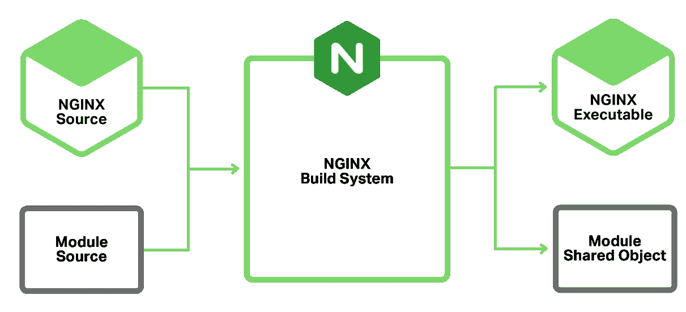

# 开始吧

在本章中，我们将涵盖以下内容：

+   快速安装指南

+   配置 NGINX

+   停止/启动 NGINX

+   启用模块

+   部署基础网站

+   基本监控

+   实时统计

# 简介

NGINX 是一个强大的软件套件，已经远远超出了基础 Web 服务器包的范畴。它的一些附加功能，如反向代理和负载均衡选项，广为人知。

NGINX 最初是为了解决 C10k 问题（处理 10,000 个并发连接）而设计的，通过事件驱动架构与 Apache 区分开来。虽然 Apache 2.4 也增加了事件驱动处理，但 NGINX 仍在许多方面更具灵活性。

本书描述了如何在多种不同场景中使用 NGINX，旨在为你提供一个可操作的解决方案，而不是对所有 NGINX 功能的深入评审。如果你对 NGINX 不熟悉，我强烈推荐你阅读 Clément Nedelcu 的*《Nginx HTTP 服务器 第三版》*，该书由*Packt Publishing*出版。

你也可以在这里阅读官方文档：

[`nginx.org/en/docs/`](http://nginx.org/en/docs/)

# 快速安装指南

由于主线版本（当前版本为 1.11.19）包含了所有最新功能，因此你需要直接从 NGINX 仓库安装它。幸运的是，NGINX 为**Red Hat Enterprise Linux**（**RHEL**）、CentOS、**SUSE Linux Enterprise Server**（**SLES**）、Debian 和 Ubuntu 提供了仓库，并且还提供了 OS X 和 Windows 的二进制文件。


主线与稳定版

（来源：[`nginx-com-uploads.s3.amazonaws.com/wp-content/uploads/2016/04/NGINX-1.11-mainline-1.10-stable.png`](https://nginx-com-uploads.s3.amazonaws.com/wp-content/uploads/2016/04/NGINX-1.11-mainline-1.10-stable.png)）

稳定版和主线版并不一定反映系统稳定性，而是配置和模块集成的稳定性。除非你有需要稳定版的第三方集成，否则我们强烈推荐使用主线版。

# 如何操作...

不同的 Linux 发行版使用不同的包管理器，因此我们将简要介绍常用发行版的安装过程。如果你使用的发行版没有在这里提到，请参考官方 NGINX 文档获取更多指导。

# 包 – RHEL/CentOS

要安装最新的 NGINX 版本，请通过将以下内容添加到`/etc/yum.repos.d/nginx.repo`中来添加 NGINX 主线仓库：

```
[nginx]
name=nginx repo
baseurl=http://nginx.org/packages/mainline/OS/OSRELEASE/$basearch/
gpgcheck=0
enabled=1
```

你还需要将`OS`替换为`rhel`或`centos`，并将`OSRELEASE`替换为`5`、`6`或`7`，以匹配你的正确版本。

你可以通过运行`cat /etc/redhat-release`来检查你的版本。

安装完仓库后，刷新包并安装 NGINX。

```
yum update yum install nginx
```

如果你遇到任何问题，请仔细检查仓库中的语法是否正确。

有关更多信息，请参阅官方文档 [`nginx.org/en/linux_packages.html#mainline`](http://nginx.org/en/linux_packages.html#mainline)。

# 软件包 – Debian/Ubuntu

首先，下载 NGINX 的签名密钥并安装：

```
wget http://nginx.org/keys/nginx_signing.key apt-key add nginx_signing.key
```

然后，使用你喜欢的 Linux 编辑器，将源添加到 `/etc/apt/sources.list.d/nginx.list`：

```
deb http://nginx.org/packages/mainline/debian/ codename nginx
deb-src http://nginx.org/packages/mainline/debian/ codename nginx
```

将 `codename` 替换为发行版名称；例如，如果你使用的是 Debian 8，则应设置为 `jessie`。

对于基于 Ubuntu 的系统，你需要使用以下命令：

```
deb http://nginx.org/packages/mainline/ubuntu/ codename nginx
deb-src http://nginx.org/packages/mainline/ubuntu/ codename nginx
```

将 `codename` 替换为发行版名称；例如，如果你使用的是 Ubuntu 14.04，则应设置为 `trusty`。

添加新的源之后，我们可以更新 `apt` 数据库并安装 NGINX：

```
apt-get update apt-get install nginx
```

安装应该已经完成。

# 从头开始编译

尽管有预编译的软件包非常方便，但并非所有模块都可以直接使用。NGINX 需要将这些模块编译进安装包，而这不像 Apache 那样简单。

你可以直接从源代码构建，而不需要 CentOS 或 Debian 的任何打包工具，然而，这会使得升级和兼容性变得更加困难。默认情况下，用户编译的程序会安装到 `/usr/local`，这意味着任何引用软件包默认路径（`/usr/etc`）的文档将是错误的。

我的偏好是基于官方的软件包源进行构建，而不是直接使用源代码。虽然没有太多额外的步骤，但这样做可以使后续的管理工作变得更简单。如果你需要的是原始构建说明（不带软件包），这些信息在网上很容易找到。

这些示例要求你已安装主线软件库。

# Debian/Ubuntu

在 Ubuntu/Debian 上，安装所需的构建工具：

```
apt-get install devscripts
```

这将会在系统上安装相当多的软件包，因此，如果你试图保持生产环境的简洁，建议使用一个独立的构建机器来完成此操作。

我们现在可以安装 NGINX 的构建前置条件：

```
apt-get build-dep nginx
```

一旦你有了所需的构建依赖项，我们现在可以获取源代码的副本。同样，我们不是直接使用原始 TAR 文件，而是获取打包版本，以便我们可以轻松地进行构建。以下是我们如何操作：

```
mkdir ~/nginxbuild cd ~/nginxbuild apt-get source nginx
```

你现在应该有一个包含原始 TAR 文件、Debian 描述文件和任何 Debian 特定补丁的目录。`apt-get source` 命令会自动提取并根据需要将补丁应用到源代码目录中。

若要在不做任何更改的情况下构建，进入目录并创建软件包：

```
cd nginx-1.9.10/ fakeroot debian/rules binary
```

编译代码可能需要一些时间，具体取决于你的工作站或服务器的处理器数量。一旦编译完成，你应该在父目录（`nginxbuild`）中看到两个二进制文件。生成的文件应为：

+   `nginx-dbg_1.9.10-1~jessie_amd64.deb`

+   `nginx_1.9.10-1~jessie_amd64.deb`

现在，你可以通过新编译的软件包安装 NGINX：

```
sudo dpkg -i nginx_1.9.10-1~jessie_amd64.deb
```

# CentOS/RHEL

与 Debian 构建过程类似，首先我们需要安装软件包构建工具和额外的**企业 Linux 额外软件包** (**EPEL**)存储库：

```
sudo yum install yum-utils epel-release mock
```

接下来，更新`/etc/yum.repos.d/nginx.repo`并添加额外的源库：

```
[nginx-source]
name=nginx source repo
baseurl=http://nginx.org/packages/mainline/centos/7/SRPMS/
gpgcheck=0 
enabled=1 
```

在这个示例中，我们将使用基于 CentOS 7 的发行版。请参考*软件包 - RHEL/CentOS* 部分了解如何修改其他 CentOS 版本。

使用更新后的代码库，我们创建一个用于构建的目录，并下载**源码 RPM** (**SRPM**)：

```
mkdir ~/nginxbuild cd ~/nginxbuild yumdownloader --source nginx
```

接下来，下载所需的软件包以完成构建：

```
yum-builddep nginx
```

一旦下载了所有开发软件包，现在可以从 SRPM 中提取文件：

```
rpm2cpio nginx-1.9.10-1.el7.ngx.src.rpm | cpio -idmv
```

请注意，您的目录名称可能会根据已安装的 NGINX 版本而有所不同。例如，这里是 nginx-1.9.10，因为我安装了 NGINX 1.9.10。

您应该看到类似于此的源文件输出：


如果我们想要更新配置并应用补丁或更改其中一个默认设置，那么只需编辑文件即可完成。

现在可以使用`mock`从源代码重新构建这些文件，`mock`是一个用于构建软件包的工具。`mock`的优点在于所有开发依赖项都包含在*chrooted*环境中，因此不会干扰主要安装。这个*chrooted*环境可以被清理和移除，不会对主机系统产生任何影响，这对于希望重复构建的用户来说非常好。

要构建，请运行以下命令：

```
mock --buildsrpm --spec ~/nginxbuild/nginx.spec --sources ~/nginxbuild
```

这将生成 SRPM，并将其放置在`/var/lib/mock/epel-7-x86_64/result`目录中，连同相关的日志文件。现在我们有了一个重建的 SRPM，现在可以编译它。同样地，我们将使用`mock`以确保一切都整洁地包含在其中：

```
mock --no-clean --rebuild var/lib/mock/epel-7-x86_64/result/nginx-1.9.11-1.el7.ngx.src.rpm
```

根据您的处理能力，这可能需要五分钟或更长时间才能完成。构建完成后，您应该会看到结果二进制 RPM 以及`/var/lib/mock/epel-7-x86_64`目录中的调试 RPM。以下是一个示例：

```
-rw-rw-r-- 1 demo mock 159K Feb 10 20:59 build.log -rw-r--r-- 1 demo mock 889K Feb 10 20:57 nginx-1.9.11-1.el7.ngx.src.rpm -rw-r--r-- 1 demo mock 803K Feb 10 20:59 nginx-1.9.11-1.el7.ngx.x86_64.rpm -rw-r--r-- 1 demo mock 3.1M Feb 10 20:59 nginx-debuginfo-1.9.11-1.el7.ngx.x86_64.rpm -rw-rw-r-- 1 demo mock 45K Feb 10 20:59 root.log -rw-rw-r-- 1 demo mock 1000 Feb 10 20:59 state.log
```

现在我们有了新的二进制文件，可以通过`yum`安装它：

```
sudo yum install /var/lib/mock/epel-7-x86_64/result/nginx-1.9.11-1\. ngx.x86_64.rpm
```

最好使用`yum`而不是`rpm`安装软件包，因为它还可以安装任何依赖项。

现在应该已经完全安装了您从源代码编译的 NGINX 安装程序。

# 测试

无论您的安装方法如何，一旦 NGINX 运行起来，您应该能够通过 IP 地址和/或**完全合格域名** (**FQDN**)访问它，并看到与此处非常相似的内容：


默认的 NGINX 页面

要启动、停止和重新启动 NGINX（如果使用官方二进制文件安装），可以使用标准的 Linux init 系统。不同操作系统版本之间可能存在非常细微的差异，因此确保使用正确的命令是非常重要的。

由于 Ubuntu 从 15.04 开始将 `systemd` 作为默认的初始化系统，请确保你检查所使用的版本。

# 如何操作...

以下是可用命令的快速参考表：

| **活动/操作系统** | **CentOS / RedHat 6** | **CentOS / RedHat 7** | **Ubuntu 14.04 / Debian 8** |
| --- | --- | --- | --- |
| **启动 NGINX** | `service nginx start` | `systemctl start nginx` | `service nginx start` |
| **停止 NGINX**  | `service nginx stop` | `systemctl stop nginx` | `service nginx stop` |
| **重启 NGINX** | `service nginx restart` | `systemctl restart nginx` | `service nginx restart` |
| **重新加载 NGINX** | `service nginx reload` | N/A | N/A |

某些 NGINX 的修改需要完全重启，而其他修改只需重新加载配置。在大多数修改了配置文件的情况下，重载就足够了。NGINX 会派发一组新的工作进程，允许现有工作进程完成并正常退出，从而不会造成停机。

# 还有更多内容...

在做出更改后，我们可以检查 NGINX 配置文件以确保语法正确。为此，我们运行以下命令：

```
/usr/sbin/nginx -t
```

如果一切正常，你应该看到以下内容：

```
nginx: the configuration file /etc/nginx/nginx.conf syntax is ok nginx: configuration file /etc/nginx/nginx.conf test is successful
```

如果你遇到任何错误，请仔细检查配置文件中标出的行是否有语法错误。

# 配置 NGINX

编辑 NGINX 的配置文件对于其运作至关重要。为了将 NGINX 集成到你的网站或需求中，你需要编辑配置文件中的多个部分。为了开始，我们在这里简要介绍基本操作。

# 如何操作...

默认情况下，NGINX 会有两个主要配置文件。第一个是 `/etc/nginx/nginx.conf`，包含主要的服务器配置。第二个是 `/etc/nginx/default.conf`，为你定义了一个基本的站点配置。

警告：不要仅仅增加数值以期获得更高的性能。

在进行任何更改之前，必须百分之百确认你了解其影响。开箱即用的 NGINX 是一个高性能的 web 服务器，已经能够提供出色的性能。编程界流传已久的说法——*过早的优化是万恶之源*——在这里依然适用。仅仅增加一些数值可能会导致内存使用增加、稳定性下降以及性能下降。在第十一章，*性能调优*部分，我们将讨论一些更高级的调优领域，但请确保在尝试这些之前，先达到使用的限制。

以下是默认配置：

```
user  nginx;
worker_processes 1; 

error_log  /var/log/nginx/error.log warn; 
pid        /var/run/nginx.pid; 

events { 
    worker_connections  1024; 
} 

http { 
    include       /etc/nginx/mime.types; 
    default_type  application/octet-stream; 

    log_format  main  '$remote_addr - $remote_user [$time_local] 
     "$request" ' 
    '$status $body_bytes_sent "$http_referer" ' 
    '"$http_user_agent" "$http_x_forwarded_for"'; 

    access_log  /var/log/nginx/access.log  main; 

    sendfile        on; 
    #tcp_nopush     on; 

    keepalive_timeout  65; 

    #gzip  on; 

    include /etc/nginx/conf.d/*.conf; 
} 
```

配置文件中有两个主要组成部分——**简单指令** 和 **块指令**。简单指令是单行项，包含简单的名称和值，后跟分号（`;`）。块指令包含一对大括号，并允许在特定上下文中设置配置项。这使得配置文件更容易理解，尤其是在它们变得更加复杂时。

# 如何工作...

这里有几个关键的配置项。首先，`user nginx` 定义了 NGINX 将作为哪个用户运行。这一点很重要，特别是如果你有一个服务器端脚本需要写文件，并且用户还需要权限来读取这些文件。

其次，`worker_processes` 设置了 NGINX 将启动的工作进程数。虽然默认为 `1` 听起来不算很高，但事件驱动的性质意味着这一开始绝对不会是限制。最佳进程数量取决于许多因素，但一个简单的起始参考是按照服务器的 CPU 核心数来确定。

接下来，`worker_connections` 是工作进程可以打开的最大并发连接数。在默认配置中，这个值被设置为 `1024` 个并发连接。

最后，`include /etc/nginx/conf.d/*.conf;` 这一行告诉 NGINX 加载所有 `.conf` 文件，就像它们是主 `nginx.conf` 文件的一部分。这允许你将不同站点的配置分开。

# 启用模块

默认情况下，并非所有 NGINX 模块都已编译和可用。从版本 1.9.11 开始（发布于 2016 年 2 月），NGINX 添加了动态模块，类似于 Apache HTTP 服务器的 **动态共享对象**（**DSO**）。


之前的 NGINX 构建过程

在此之前，每次更新一个模块，你都需要重新编译 NGINX，因此这是一个重大进步。静态编译进主二进制文件也意味着，每个 NGINX 实例都加载了所有模块，无论你是否需要它们。这就是为什么标准二进制文件中从未编译邮件模块的原因。



NGINX 新的动态模块

# 如何操作...

然而，尽管 1.9.11 添加了动态模块，但标准模块默认都不是动态的。要将它们变成动态模块，你需要更新配置选项。例如，要将邮件模块变成动态模块，更新 `--with-mail` 为 `--with-mail=dynamic`。

主要的 `nginx.conf` 配置文件接着需要以下内容：

```
load_module "modules/ngx_mail_module.so";
```

官方链接：[`www.nginx.com/resources/wiki/extending/`](https://www.nginx.com/resources/wiki/extending/)

# 参见

NGINX 有许多第三方模块，我们稍后将在本书中使用一些，并且可以在 [`www.nginx.com/resources/wiki/modules/`](https://www.nginx.com/resources/wiki/modules/) 找到。

# 部署基本网站

如果你有一个静态网站，使用 NGINX 非常容易部署。像 Jekyll 这样的系统（用于 GitHub Pages），静态站点部署容易生成，并且在安全性和漏洞方面要少得多。简单来说，静态网站无法被黑客入侵，并且不会出现任何性能问题。

# 如何操作...

1.  为了提供静态文件，我们将编辑默认站点配置文件`/etc/nginx/conf.d/default.conf`并进行一些小的修改。

编辑文件并添加以下内容：

```
      server {
          listen 80;
          server_name server.yourdomain.com; 
          access_log /var/log/nginx/log/host.access.log combined;

          location / {
              root /var/www/html;
              index index.html; 
          }
      }
```

1.  如果文件夹不存在，使用以下命令创建`/var/www/vhosts`目录：

```
 mkdir -p /var/www/vhosts
```

1.  将现有的网站文件复制到`/var/www/vhosts`目录中。

1.  确保文件和文件夹可以被`nginx`用户读取：

```
 chmod -R o+r /var/www/vhosts chown -R nginx:nginx /var/www/vhosts
```

1.  从你的网页浏览器访问该网站，并检查它是否正常工作。

# 它是如何工作的...

让我们通过这个设置文件来理解每个指令：

+   `listen 80;`：此指令定义了 NGINX 监听的端口。端口`80`是 HTTP 的默认标准，因此在浏览器 URL 中不需要指定。

+   `server_name server.yourname.com;`：此指令告诉服务器要匹配请求中的主机名。这允许你在一个 IP 地址上运行基于名称的虚拟服务器，但使用不同的域名。你还可以在这里使用不同的别名；例如，你可以同时使用`www.yourname.com`和`yourname.com`。

+   `access_log /var/log/nginx/log/host.access.log combined;`：访问日志记录了所有客户端对该网站的访问，将其存储在指定的文件中（第二个参数），并使用第三个参数定义日志格式（`combined`是默认格式）。

+   `location`：最后，我们有一个`location`块指令。这个指令是针对根指令（由`/`表示），意味着所有的 URL 路径中的内容。然后这个块内包含了两个指令——第一个是`root`指令，它定义了 NGINX 应该在哪里查找文件。

+   `index`：第二个是`index`指令。这个指令告诉 NGINX 在路径未指定时，尝试加载哪个文件。例如，如果你在浏览器中输入`http://server.yourname.com/`，NGINX 会尝试加载`http://server.yourname.com/index.html`，而不是显示 404 错误。

# 基本监控

监控 Web 服务器的性能和正常运行时间是至关重要的，尤其是当你想确保服务器始终保持一致的性能时。可以通过多种方式来监控这两个方面，每种方法的复杂度和信息量有所不同。我们将关注一些较为简单的例子，帮助你从中获得前进的起点。

# 如何操作...

我们可以启用基本的 NGINX `stub_status`页面，以提供一些基本的统计信息和服务状态。要启用它，请编辑你的站点配置并添加以下内容：

```
location = /nginx_status { 
    stub_status on; 
    access_log   off; 
    allow <YOURIPADDRESS>; 
    deny all; 
} 
```

为了防止泄露有关系统的信息，我们添加了`allow`指令，这里应该是你的 IP 地址。接下来是`deny all`指令，防止其他人加载该 URL。我们还关闭了该 URL 的访问日志，以节省空间。

在重新加载配置后（提示：对于基于 systemd 的操作系统，可以使用`systemctl reload nginx`），你现在可以在浏览器中加载新 URL`/nginx_status`。

你应该看到如下内容：


# 它是如何工作的...

让我们逐行解析细节：

+   `Active connections`这一行列出了与服务器的连接数。对于一个空闲的服务器，这个数字可能不到十个。对于一个繁忙的服务器，预计会有数百个。

+   `server accepts handled requests`这一行有些令人困惑，因为它由三个数字（在这个例子中是`81`、`81`和`177`）表示。第一个数字表示已接受的连接数，第二个数字表示处理的连接总数。除非存在资源限制，否则已接受和已处理的连接数应该是相同的。接下来，我们可以看到客户端请求的总数。

+   最后一行表示活跃连接的状态。`Reading`表示 NGINX 正在读取请求头，`Writing`表示 NGINX 正在向客户端写回数据，`Waiting`表示客户端现在处于空闲状态，但仍保持连接（由于保持连接）。

# 实时统计信息

当你的 Web 服务器对你来说非常重要时，你可能会希望实时查看发生了什么。一个很好的工具是`ngxtop`。这个程序会监控你的实时访问日志，显示有用的指标，例如每秒请求数、服务的 HTTP 状态和提供的页面/URL。这些信息对确定最受欢迎的页面以及是否有错误率增加非常有帮助。

# 如何操作...

要安装`ngxtop`，首先需要安装 Python 包管理工具`pip`。在基于 Debian/Ubuntu 的系统中，你需要运行以下命令：

```
apt-get install python-pip
```

对于基于 Red Hat / CentOS 的系统，首先需要 EPEL 仓库。要安装，运行以下命令：

```
yum install epel-release yum install python-pip
```

一旦你安装了`pip`，就可以安装`ngxtop`了：

```
pip install ngxtop
```

这将下载所需的文件并为你安装`ngxtop`。现在它已经准备好使用了。

# 它是如何工作的...

`ngxtop`工具可以简单地从命令行调用，它会尝试从配置中读取日志文件位置。然而，如果你正在使用虚拟主机，它可能无法正确读取访问日志位置。在这种情况下，最简单的方法是手动指定日志位置。

请考虑以下示例：

```
ngxtop -l /var/log/nginx/access.log
```

这将显示一个基于控制台的视图，展示哪些 URL 被访问。以下是一个基本示例：


这将每秒刷新一次，实时提供 NGINX 正在提供哪些 URL 的信息，但这还不是全部。`ngxtop`工具非常可配置，并且有多种不同方式可以显示信息。

我们可以使用以下命令只过滤出`404`页面：

```
ngxtop -l /var/log/nginx/access.log --filter 'status == 404'
```

现在，只有那些返回`404`的 URL 才会在`ngxtop`中显示。以下是一个输出示例：


还有许多其他选项可以轻松根据你的需求进行定制，特别是如果你知道自己要寻找什么。

# 另请参见

要了解更多关于`ngxtop`的信息，请参考[`github.com/lebinh/ngxtop`](https://github.com/lebinh/ngxtop)。
