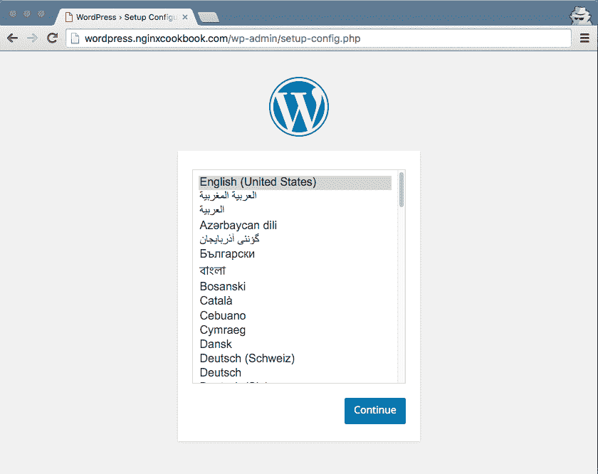
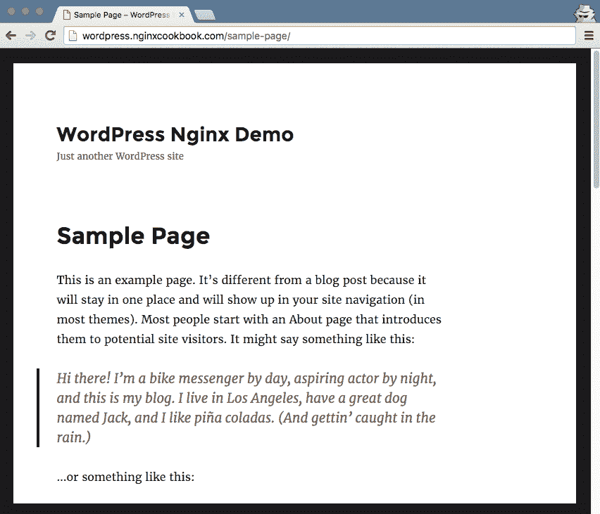
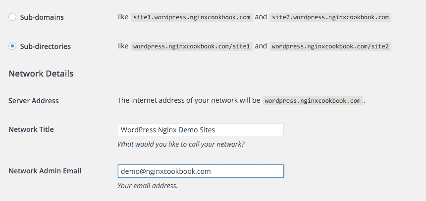
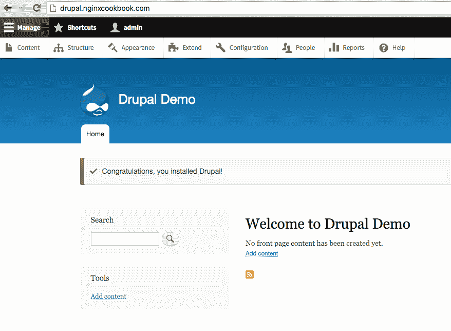
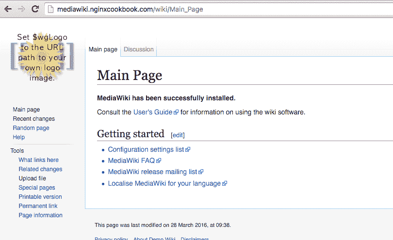
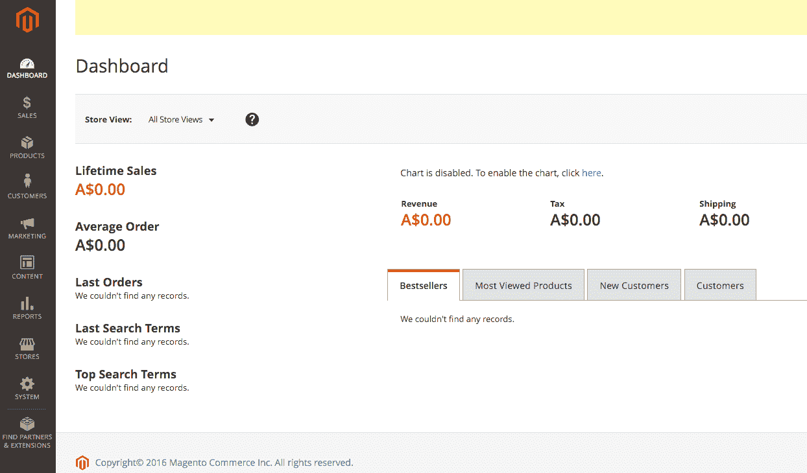
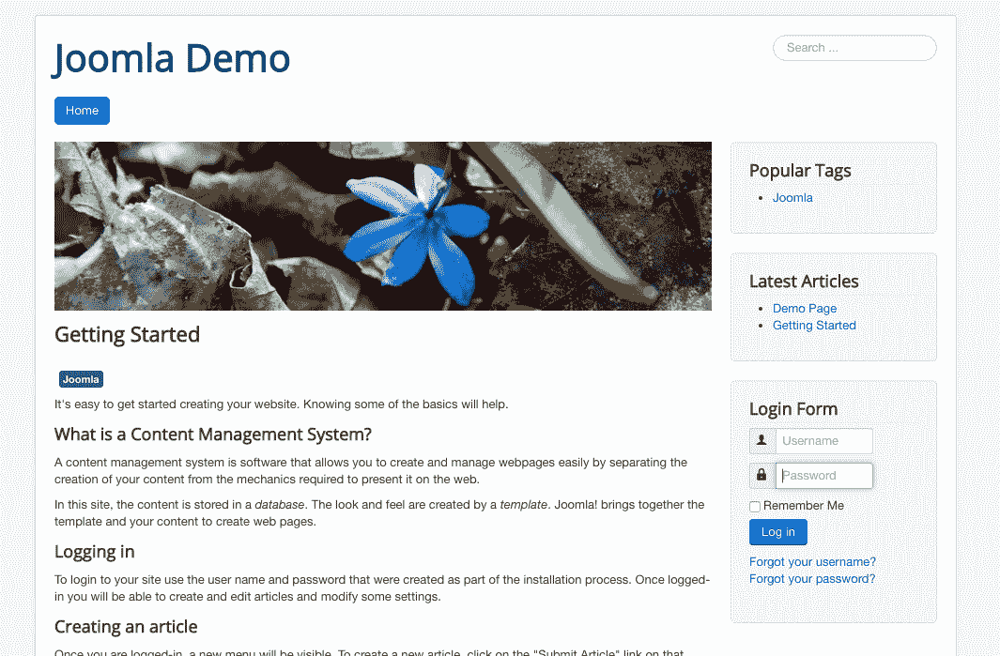
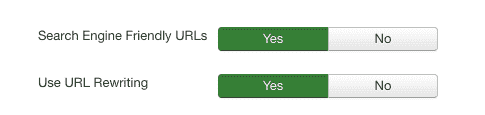

# 第二章：常见的 PHP 场景

在本章中，我们将介绍以下操作步骤：

+   配置 NGINX 以支持 WordPress

+   WordPress 多站点与 NGINX

+   使用 NGINX 运行 Drupal

+   使用 NGINX 与 MediaWiki

+   使用 Magento 与 NGINX

+   配置 NGINX 以支持 Joomla

# 介绍

PHP 是一个经过充分测试的产品，适用于 NGINX，因为它是最流行的基于 Web 的编程语言。它为 Facebook、Wikipedia 以及所有基于 WordPress 的网站提供支持，并且随着其他语言的崛起，它的受欢迎程度没有下降。

在本章中，我们将介绍一些更常见的 PHP 场景，并说明如何使用 NGINX 实现它们。由于 WordPress 是最流行的 PHP 系统，我还添加了一些额外的信息来帮助故障排除。即使您不使用 WordPress，这些信息在遇到其他 PHP 框架问题时也可能会有所帮助。

大多数操作步骤假设您已经对 PHP 系统有一定了解，因此不会覆盖所有系统的设置步骤。这是为了使本书简洁，并让重点集中在 NGINX 组件上。

为了使配置尽可能简单，我没有在这些操作步骤中包含缓存头或 SSL 配置等细节。这些内容将在后续章节中介绍，完整的工作配置将通过[`github.com/timbutler/nginxcookbook/`](https://github.com/timbutler/nginxcookbook/)提供。

# 配置 NGINX 以支持 WordPress

覆盖了几乎 30%的所有网站，WordPress 无疑是许多人的**内容管理系统**（**CMS**）首选。尽管它起源于博客平台，WordPress 现在已成为一个非常强大的 CMS，适用于所有类型的内容，并且支持一些全球访问量最大的站点。

将其与 NGINX 结合使用，您可以部署一个高度可扩展的 Web 平台。

您可以在[`codex.wordpress.org/Nginx`](https://codex.wordpress.org/Nginx)查看官方的 WordPress NGINX 文档。

我们还将涵盖一些更复杂的 WordPress 场景，包括使用子域和目录的多站点配置。

让我们开始吧。

# 准备工作

为了编译 PHP 代码并通过 NGINX 运行，推荐的方法是通过**PHP-FPM**，即高效的**FastCGI 进程管理器**。我们还需要安装 PHP 本身，并且为了简化操作，我们将使用操作系统提供的版本。那些追求最大性能的用户应该确保运行 PHP 7（于 2015 年 12 月 3 日发布），它能够为 WordPress 提供 2-3 倍的速度提升，同时在内存使用效率上比 PHP 5.6 高出四倍。

若要安装 PHP-FPM，您应该在 Debian/Ubuntu 系统上运行以下命令：

```
apt-get install php7.0-fpm
```

对于运行 CentOS/RHEL 的用户，您应运行以下命令：

```
sudo yum install php-fpm 
```

由于 PHP 本身是`php-fpm`包的先决条件，它也将被安装。

注意：如果你打算在单个 VPS 实例上运行，可能还需要其他包，如 MySQL。请查阅 WordPress 文档以获取完整的要求列表。

# 如何操作...

在这个例子中，我们只是使用一个独立的 WordPress 网站，这在许多个人和商业场景中都会部署。这是 WordPress 的典型部署方式。

为了方便管理，我创建了一个专门用于 WordPress 网站的配置文件（`/etc/nginx/conf.d/wordpress.conf`）：

```
server { 
    listen       80; 
    server_name  wordpressdemo.nginxcookbook.com; 

    access_log  /var/log/nginx/access.log  combined; 

    location / { 
        root   /var/www/html; 
        try_files $uri $uri/ /index.php?$args;     
    } 

    location ~ \.php$ { 
        fastcgi_pass unix:/var/run/php7.0-fpm.sock; 
        fastcgi_index index.php; 
        fastcgi_param SCRIPT_FILENAME 
         $document_root$fastcgi_script_name; 
        include fastcgi_params; 
    } 
} 
```

重新加载 NGINX 来读取新的配置文件，并检查你的日志文件是否有任何错误。如果你是从零开始安装 WordPress，你应该看到以下内容：



如果你还没有完成 WordPress 安装，可以继续进行。

# 它是如何工作的...

在大多数情况下，配置与第一章中的静态网站配置相同，*让我们开始吧*。对于根 URL 调用，我们有一个新的 `try_files` 指令，它将按指定的顺序尝试加载文件，如果都失败，将回退到最后一个参数。

对于这个 WordPress 示例，这意味着如果系统上存在任何静态文件，它们将被提供服务，如果失败则回退到`/index.php?args`。

`args` 重写使得站点的永久链接可以呈现更人性化的形式。例如，如果你有一个正常工作的 WordPress 安装，你可以看到如下图所示的链接：



最后，我们通过 FastCGI 接口将所有 PHP 文件处理到 PHP-FPM。在前面的例子中，我们引用的是 Ubuntu/Debian 标准；如果你运行的是 CentOS/RHEL，路径将是 `/var/run/php-fpm.sock`。

NGINX 只是*代理*连接到 PHP-FPM 实例，而不是 NGINX 自身的一部分。这种分离允许更好的资源控制，尤其是在 web 服务器的传入请求数与典型网站的 PHP 请求数不一定匹配时。

# 还有更多...

在复制和粘贴任何配置文件时要小心。很容易遗漏某些内容，使得你的环境中有些微小的不同，这会导致网站无法按预期工作。以下是一些你可能会遇到的其他问题的快速查询表：

| **错误** | **需要检查的内容** |
| --- | --- |
| `502 Bad Gateway` | PHP-FPM 套接字文件的文件所有权权限 |
| `404 File Not Found` | 检查缺少的 `index index.php` 指令 |
| `403 Forbidden` | 检查 `root` 指令中的正确路径和/或检查文件权限是否正确 |

你的错误日志（默认路径为 `/var/log/nginx/error.log`）通常会包含比浏览器显示的更多关于问题的详细信息。如果遇到错误，确保检查错误日志。

提示：NGINX 不支持 `.htaccess` 文件。如果您在网络上看到提到 `.htaccess` 文件的示例，这些是 Apache 特有的。确保您查看的任何配置都是针对 NGINX 的。

# 使用 NGINX 的 WordPress 多站点

WordPress **多站点**（也称为网络站点）允许您从一个代码库运行多个网站。当您拥有类似的网站时，这可以减少管理多个独立 WordPress 安装的负担。例如，如果您有一个体育网站，其中包括不同地区的新闻和工作人员，您可以使用多站点安装来实现这一目标。

# 如何操作...

要将 WordPress 网站转换为多站点，您需要将配置变量添加到配置文件 `wp-config.php` 中：

```
define( 'WP_ALLOW_MULTISITE', true ); 
```

在工具菜单下，您现在会看到一个额外的菜单，称为“网络设置”。它会提供两个主要选项：子域和子目录。这是多站点安装的两种不同方式。子域选项将网站按域名分开，例如 `site1.nginxcookbook.com` 和 `site2.nginxcookbook.com`。子目录选项则意味着网站按目录分开，例如 `www.nginxcookbook.com/site1` 和 `www.nginxcookbook.com/site2`。



这两者在功能上没有区别，纯粹是美学上的选择。然而，一旦做出选择，您就无法返回到之前的状态。

一旦您做出选择，它将提供额外的代码，供您添加到 `wp-config.php` 文件中。

这是我的示例代码，它基于子目录：

```
define('MULTISITE', true); 
define('SUBDOMAIN_INSTALL', false); 
define('DOMAIN_CURRENT_SITE', 'wordpress.nginxcookbook.com'); 
define('PATH_CURRENT_SITE', '/'); 
define('SITE_ID_CURRENT_SITE', 1); 
define('BLOG_ID_CURRENT_SITE', 1); 
```

由于 NGINX 不支持 `.htaccess` 文件，WordPress 指令的第二部分将*无法*工作。相反，我们需要修改 NGINX 配置，以便自己提供重写规则。

在现有的 `/etc/nginx/conf.d/wordpress.conf` 文件中，您需要在 `location /` 指令之后添加以下内容：

```
if (!-e $request_filename) { 
    rewrite /wp-admin$ $scheme://$host$uri/ permanent; 
    rewrite ^(/[^/]+)?(/wp-.*) $2 last;                      
    rewrite ^(/[^/]+)?(/.*\.php) $2 last;                    
} 
```

虽然通常尽可能避免使用 `if` 语句，但在此实例中，它将确保子目录多站点配置按预期工作。如果您的网站预计会有几千个并发用户，那么可能值得研究每个站点的静态映射。虽然有插件可以帮助生成映射，但它们比 `if` 语句更为复杂。

# 子域

如果您选择了子域，则要添加到 `wp-config.php` 中的代码将如下所示：

```
define('MULTISITE', true); 
define('SUBDOMAIN_INSTALL', true); 
define('DOMAIN_CURRENT_SITE', 'wordpressdemo.nginxcookbook.com'); 
define('PATH_CURRENT_SITE', '/'); 
define('SITE_ID_CURRENT_SITE', 1); 
define('BLOG_ID_CURRENT_SITE', 1); 
```

您还需要修改 NGINX 配置，添加服务器名称的通配符：

```
server_name  *.wordpressdemo.nginxcookbook.com wordpressdemo.nginxcookbook.com; 
```

现在，您可以添加额外的网站，例如 `site1.wordpressdemo.nginxcookbook.com`，并且 NGINX 不需要做任何更改。

# 另见

+   NGINX 配方页面: [`www.nginx.com/resources/wiki/start/topics/recipes/wordpress/`](https://www.nginx.com/resources/wiki/start/topics/recipes/wordpress/)

+   WordPress Codex 页面: [`codex.wordpress.org/Nginx`](https://codex.wordpress.org/Nginx)

# 使用 NGINX 运行 Drupal

Drupal 8 最近发布，并拥有超过 100 万名支持者，Drupal 仍然是一个非常受欢迎的高度灵活和功能强大的 CMS 平台。与 7 版本相比，8 版本增加了超过 200 个新功能，旨在提高系统的可用性和可管理性。本食谱将使用 8.0.5 版本。



# 准备工作

本示例假设您已经有一个正在运行的 Drupal 实例，或者熟悉安装过程。您还可以按照 [`www.drupal.org/documentation/install`](https://www.drupal.org/documentation/install) 提供的安装指南进行操作。

# 如何操作...

本食谱适用于基本的 Drupal 配置，Drupal 文件位于 `/var/www/html`。

这是要使用的配置：

```
server { 
    listen       80; 
    server_name  drupal.nginxcookbook.com; 

    access_log  /var/log/nginx/drupal.access.log  combined; 
    index index.php; 

    root   /var/www/html/; 

    location / { 
        try_files $uri $uri/ /index.php?$args; 
    } 

    location ~ (^|/)\. { 
        return 403; 
    } 

    location ~ /vendor/.*\.php$ { 
        deny all; 
        return 404; 
    } 

    location ~ \.php$|^/update.php { 
        fastcgi_pass unix:/var/run/php7.0-fpm.sock; 
        fastcgi_split_path_info ^(.+?\.php)(|/.*)$; 
        fastcgi_index index.php; 
        fastcgi_param SCRIPT_FILENAME 
         $document_root$fastcgi_script_name; 
        include fastcgi_params; 
    } 
} 
```

# 它是如何工作的...

基于简单的 PHP-FPM 结构，我们对 Drupal 环境做了一些特定的关键更改。第一个更改如下：

```
location ~ (^|/)\. { 
    return 403; 
} 
```

我们为任何以点开头的文件添加了一个阻止规则，这些通常是隐藏的和/或系统文件。这样做是为了防止意外的信息泄露：

```
location ~ /vendor/.*\.php$ { 
    deny all; 
    return 404; 
} 
```

`vendor` 目录中的任何 PHP 文件也会被阻止，因为它们不应该直接调用。阻止这些 PHP 文件可以限制可能在第三方代码中发现的任何潜在漏洞机会。

最后，Drupal 8 更改了 PHP 函数的调用方式来进行更新，这导致任何旧的配置都会失效。PHP 文件的 `location` 指令如下所示：

```
location ~ \.php$|^/update.php { 
```

这样做是为了适应 Drupal 使用的独特模式，其中 PHP 文件名可能出现在 URI 的中间。

我们还修改了 FastCGI 进程如何分割字符串，以确保我们始终得到正确的答案：

```
fastcgi_split_path_info ^(.+?\.php)(|/.*)$; 
```

# 另见

NGINX 配方： [`www.nginx.com/resources/wiki/start/topics/recipes/drupal/`](https://www.nginx.com/resources/wiki/start/topics/recipes/drupal/)

# 使用 NGINX 配合 MediaWiki

MediaWiki，最著名的用途是与 Wikipedia 一起使用，是最受欢迎的开源 wiki 平台。它的功能主要集中在简化内容编辑和共享，MediaWiki 使得存储您想要持续编辑的信息成为一种很好的系统：



# 准备工作

本示例假设您已经有一个正在运行的 MediaWiki 实例，或者熟悉安装过程。对于不熟悉该过程的人，可以在线查阅 [`www.mediawiki.org/wiki/Manual:Installation_guide`](https://www.mediawiki.org/wiki/Manual:Installation_guide)。

# 如何操作...

MediaWiki 的基本 NGINX 配置与许多其他 PHP 平台非常相似。它具有一个扁平的目录结构，可以轻松地在基本系统资源下运行。

这是配置：

```
server { 
    listen       80; 
    server_name  mediawiki.nginxcookbook.com; 

    access_log  /var/log/nginx/mediawiki.access.log  combined; 
    index index.php; 

    root   /var/www/html/; 

    location / { 
        try_files $uri $uri/ /index.php?$args; 
    } 

    location ~ \.php$ { 
        fastcgi_pass unix:/var/run/php7.0-fpm.sock; 
        fastcgi_index index.php; 
        fastcgi_param SCRIPT_FILENAME 
         $document_root$fastcgi_script_name; 
        include fastcgi_params; 
    } 
} 
```

默认安装不使用任何重写规则，这意味着你会得到像 `index.php?title=Main_Page` 这样的 URL，而不是更简洁（更易读的）`/wiki/Main_Page`。为了启用此功能，我们需要编辑 `LocalSettings.php` 文件，并添加以下行：

```
$wgArticlePath = "/wiki/$1"; 
$wgUsePathInfo = TRUE; 
```

这可以让 URL 以更简洁的格式进行重写。

# 另见

NGINX 配置示例: [`www.nginx.com/resources/wiki/start/topics/recipes/mediawiki/`](https://www.nginx.com/resources/wiki/start/topics/recipes/mediawiki/)

# 使用 Magento 配合 NGINX

Magento 拥有近 30% 的市场份额，是全球最流行的电子商务平台。由于其众多特性和复杂性，相比轻量级的替代方案，它也是一个非常消耗资源的系统。这意味着 NGINX 是一个理想的搭配，能确保你获得尽可能高的性能。

Magento 的最新主要版本是 2.0，相比之前的版本几乎是一次完全重写。它仍然涉及相当复杂的内容，因此如果你选择 Magento 作为你的电子商务平台，请确保你已经准备好迎接挑战：



# 准备工作

本指南假设你已经熟悉 Magento 2.0 的安装，并且有一个正常运行的实例。虽然应该不会有太多重大变化，但此配置示例已在 2.0.2 版本中进行过测试。

# 如何实现...

幸运的是，Magento 提供了一个相当实用的 NGINX 示例配置（位于 Magento 源代码文件夹的根目录），以供启动。我将文件放置在 `/var/www/html` 目录下，称其为 `MAGE_ROOT`。

Magento 提供了一个开箱即用的基本配置，只需要做几个小调整。但我更喜欢使用自己的配置，因为我发现这样更容易理解。以下是我使用的配置方法：

```
server { 
    listen       80; 
    server_name  magento.nginxcookbook.com; 
    set $MAGE_ROOT /var/www/html; 

    access_log  /var/log/nginx/magento.access.log  combined; 
    index index.php; 

    root   $MAGE_ROOT/pub/; 

    location / { 
        try_files $uri $uri/ /index.php?$args; 
    } 
    location ~ ^/(setup|update) { 
        root $MAGE_ROOT; 
        location ~ ^/(setup|update)/index.php { 
            fastcgi_pass   unix:/var/run/php7.0-fpm.sock; 
            fastcgi_index  index.php; 
            fastcgi_param  SCRIPT_FILENAME  
             $document_root$fastcgi_script_name; 
            include        fastcgi_params; 
        } 

        location ~ ^/(setup|update)/(?!pub/). { 
            deny all; 
        } 

        location ~ ^/(setup|update)/pub/ { 
            add_header X-Frame-Options "SAMEORIGIN"; 
        } 
    } 

    location /static/ { 
        expires max; 

        if (!-f $request_filename) { 
            rewrite ^/static/(version\d*/)?(.*)$ 
             /static.php?resource=$2 last; 
        } 
        add_header X-Frame-Options "SAMEORIGIN"; 
    } 

    location /media/ { 
        try_files $uri $uri/ /get.php?$args; 

        location ~ ^/media/theme_customization/.*\.xml { 
            deny all; 
        } 

        add_header X-Frame-Options "SAMEORIGIN"; 
    } 

    location ~ \.php$ { 
        fastcgi_pass unix:/var/run/php7.0-fpm.sock; 
        fastcgi_index index.php; 
        fastcgi_param SCRIPT_FILENAME 
         $document_root$fastcgi_script_name; 
        include fastcgi_params; 
    } 
} 
```

正如你所看到的，这比基本的 WordPress 配置复杂得多。这里有四个主要部分；第一部分是处理设置和更新，第二部分是处理静态媒体（例如，默认的 Magento、CSS 和 JavaScript）、媒体文件（例如，上传的图片），最后是如何处理 PHP 文件。

# 它是如何工作的...

我们将分步进行讲解。Magento 与许多平面文件 / 单一根目录结构不同，因此相比基本的 PHP 网站，需要做一些微小的调整。

```
set $MAGE_ROOT /var/www/html; 
```

这设置了一个我们可以轻松引用的变量，这意味着如果我们移动文件，只有一个地方需要更新：

```
root   $MAGE_ROOT/pub/; 
```

所有主要的站点文件都位于 `pub` 子目录中。在将文件上传到共享主机平台（如 CPanel 或 Plesk）时，这一点常常被忽视。确保主 `root` 指令指向 `pub` 文件夹，而不仅仅是 Magento 文件的目录。因此，`root` 指令指向了 `pub` 文件夹，前面的配置行即为此目的。

相反，设置和更新的 URL 需要有一个单独的 `root` 指令，以确保它们也指向正确的位置：

```
location (/setup|/upgrade) { 
    root $MAGE_ROOT; 
}
```

这将 `root` 设置回默认目录，该目录位于`pub`目录之外。最简单的理解方式是将设置和升级站点视为具有各自独立结构的独立网站。这就是为什么指令块还包括以下内容：

```
location ~ ^/(setup|update)/index.php { 
    fastcgi_pass   unix:/var/run/php7.0-fpm.sock; 
    fastcgi_index  index.php; 
    fastcgi_param  SCRIPT_FILENAME  
     $document_root$fastcgi_script_name; 
    include        fastcgi_params; 
} 
```

我们仅允许访问位于`setup`/`update`目录中的`index.php`，然后拒绝访问任何*非公开*文件：

```
location ~ ^/(setup|update)/(?!pub/). { 
            deny all; 
        } 
```

如果恶意用户或脚本尝试访问`pub`目录之外的文件，将会返回 403 错误。

它还确保所有请求来自同一框架，从而防止点击劫持：

```
add_header X-Frame-Options SAMEORIGIN; 
```

静态文件和媒体部分在操作方式上非常相似。为缓存设置了头信息（在第七章中详细解释，*反向代理*），并通过 PHP 函数（`static.php` 或 `get.php`）包装调用，以便 Magento 执行诸如文件合并和最小化等任务。这可能导致首次访问稍慢，但由于会缓存结果，随后的请求应该非常快速。

# 另见

Magento 示例配置：[`github.com/magento/magento2/blob/develop/nginx.conf.sample`](https://github.com/magento/magento2/blob/develop/nginx.conf.sample)

# 为 Joomla 配置 NGINX

随着最近发布的 3.5 版本，Joomla 仍然是世界上最受欢迎的 CMS 平台之一。此次最新版本支持完整的 PHP 7，支持拖放图像等功能：



# 准备工作

这假设你已经有了一个正常工作的 Joomla 安装，并且文件位于`/var/www/html/`目录。如果你需要安装指南，可以参考官方文档：[`docs.joomla.org/J3.x:Installing_Joomla`](https://docs.joomla.org/J3.x:Installing_Joomla)。

# 如何操作...

要在 NGINX 上使用 Joomla，我们需要一个简单的 NGINX 配置文件。这是一个非常基础的 PHP-FPM 配置，不需要任何更改：

```
server { 
    listen       80; 
    server_name  joomla.nginxcookbook.com; 

    access_log  /var/log/nginx/joomla.access.log  combined; 
    index index.php; 

    root   /var/www/html/; 

    location / { 
        try_files $uri $uri/ /index.php?$args; 
    } 

    location ~ \.php$ { 
        fastcgi_pass unix:/var/run/php7.0-fpm.sock; 
        fastcgi_index index.php; 
        fastcgi_param SCRIPT_FILENAME 
         $document_root$fastcgi_script_name; 
        include fastcgi_params; 
    } 

    location ^~ /cache/ { 
        deny all; 
    } 
} 
```

要启用干净的 URL，你还需要确保启用了 URL 重写：



# 另见

Joomla 文档：[`docs.joomla.org/Nginx`](https://docs.joomla.org/Nginx)
