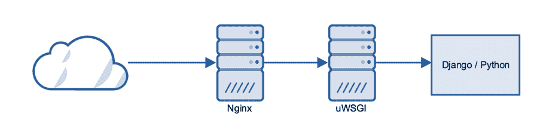

# 第三章：常见框架

在本章中，我们将涵盖以下内容：

+   配置 Django 与 NGINX

+   设置 NGINX 与 Express

+   使用 NGINX 运行 Ruby on Rails

+   使用 NGINX 的简单 Flask

+   通过 NGINX 运行 Laravel

+   使用 NGINX 的 Meteor 应用程序

+   使用 NGINX 的高速 Beego

# 介绍

网络服务和网站的兴起，超越了单纯的静态内容，催生了许多 Web 框架来应对这些更复杂的场景。有些框架源自报纸行业，在那里有非常紧迫的截止日期，而其他一些则专注于性能。

在本章中，我们将通过配置 NGINX 来配合这些不同框架，以便提供一个易于跟随的配置。像上一章一样，我不会介绍如何设置这些框架本身，而是专注于 NGINX 的配置。

让我们开始吧。

# 配置 Django 与 NGINX

Django 的崛起始于 2005 年，一家美国小型报纸公司将其应用开源。从那时起，Django 成长为最广泛使用的基于 Python 的 Web 框架。如今，Instagram 和 Pinterest 等公司仍在使用 Django，Django 的相关性依然如此强大。


# 准备开始

Django 通过**Web 服务器网关接口**（**WSGI**）与 NGINX 进行交互。对于 Django，最常用的 WSGI 接口之一是 uWSGI。

如果你还没有安装 uWSGI，最好的方法是通过`pip`安装最新版本：

```
apt-get install python-pip python-dev pip install uwsgi
```

我们将简单地使用最新版本的 Django 进行基础安装，写本书时的版本是 1.10.5。



# 如何操作...

现在，我们将配置 uWSGI 指向我们的 Django 项目，在本示例中，我将它放置在`/var/www/djangodemo`。这是`uwsgi.ini`文件：

```
[uwsgi] 
socket = 127.0.0.1:8000 
uid=www-data 
gid=www-data 
chdir=/var/www/djangodemo 
module=djangodemo.wsgi 
master=True 
pidfile=/tmp/uwsgi-djangodemo.pid 
vacuum=True 
max-requests=5000 
daemonize=/var/log/uwsgi/djangodemo.log 
```

在这个示例中，我们还使用了 TCP 套接字，而不是 Unix 套接字。虽然 TCP 套接字略微高效，但有一个适当的套接字可以使初期测试阶段更加容易。如果你遇到限制（许多数千个并发连接），那么我建议你使用 Unix 套接字。

现在，我们将为 NGINX 配置文件使用一个单独的配置文件(`/etc/nginx/conf.d/django.conf`)，以保持整洁和有序：

```
server { 
    listen       80; 
    server_name  djangodemo.nginxcookbook.com; 

    access_log  /var/log/nginx/djangodemo-access.log  combined; 

    location = /favicon.ico { access_log off; log_not_found off; } 

    location /static|/media { 
        root /var/www/djangodemo/; 
    } 

    location / { 
        include         uwsgi_params; 
        uwsgi_pass      127.0.0.1:8000; 
    } 
} 
```

# 它是如何工作的....

我们调整的第一个配置项是`favicon`：

```
location = /favicon.ico { access_log off; log_not_found off; } 
```

有一个非常著名的故事，讲述了 Instagram 第一次部署时的情况（他们在第一天就有了 10,000 个用户），以及缺少`favicon`所引发的负载（因为 Django 必须产生`404`错误）导致的显著扩展问题。

接下来，我们通过 NGINX 直接提供任何上传的静态媒体：

```
location /static|/media { 
    root /var/www/djangodemo/; 
} 
```

这些目录通过`settings.py`文件中的`STATIC_ROOT`和`MEDIA_ROOT`配置行映射。NGINX 在服务静态媒体方面非常高效，因此直接提供它产生的开销最小。

然后，我们通过`uwsgi`协议映射应用程序的所有其他 URL 调用：

```
location / { 
    include         uwsgi_params; 
    uwsgi_pass      127.0.0.1:8000; 
} 
```

uWSGI 项目有一个本地协议（称为`uwsgi`，并且是小写的），它默认内置于 NGINX 中。它是一个二进制协议，旨在高度高效和可扩展。

# 另见

有关问题和最佳实践的更多信息，请参考以下链接：

[`uwsgi-docs.readthedocs.org/en/latest/ThingsToKnow.html`](http://uwsgi-docs.readthedocs.org/en/latest/ThingsToKnow.html)

# 使用 Express 设置 NGINX

Express 是一个极简主义和灵活的框架，适用于基于 Node.js 的 Web 和移动应用程序部署。它也是一些功能更复杂且功能更丰富的 Node.js 框架的流行基础，这也是它成为 Node.js Web 部署的优秀学习块的原因。


# 准备工作

Express 极简，甚至没有提供任何启动的样板代码。有一些生成器可以为你设置结构，但我将坚持使用一个简单的网页和 WebSocket 进行测试。这是我的 Express 文件：

```
var express = require('express'); 
var app = express(); 
var expressWs = require('express-ws')(app); 

app.get('/', function (req, res) { 
    res.send('Nginx demo!!!'); 
}); 

app.ws('/echo', function(ws, req) { 
    ws.on('message', function(msg) { 
        ws.send(msg); 
    }); 
}); 

app.listen(3000); 
```

# 如何实现...

现在我们有了一个非常简单的 Express 应用程序，我们将把 NGINX 放在它前面。尽管 Node.js 非常快，但 NGINX 不仅更快，而且提供更多的可配置性。即使是 WebSocket，我们仍然能够通过 NGINX 代理。让我们看看配置：

```
server { 
    listen       80; 
    server_name  express.nginxcookbook.com; 

    access_log  /var/log/nginx/express-access.log  combined; 

    location / { 
         proxy_pass http://127.0.0.1:3000; 
         proxy_http_version 1.1; 
         proxy_set_header Upgrade $http_upgrade; 
         proxy_set_header Connection "upgrade"; 
    } 
} 
```

# 工作原理....

只有一个主要的指令块可以使我们的简单测试工作，并包含几个关键区域。

```
proxy_pass http://127.0.0.1:3000; 
```

代理将把连接转发回我们基于 Express 的测试应用程序，该应用程序已配置为在本地主机的`3000`端口上监听。

```
proxy_http_version 1.1; 
```

默认情况下，代理连接回 Node.js 应用程序时将仅使用 HTTP/1.0。将其设置为 HTTP/1.1 允许使用 keep-alive，这意味着 NGINX 和应用程序之间的连接保持打开状态，而不是每次都建立新连接。在负载较重的系统上，这更加高效。

```
proxy_set_header Upgrade $http_upgrade; 
proxy_set_header Connection "upgrade"; 
```

WebSocket 协议在握手过程中使用`Upgrade`和`Connection`头。我们需要在 NGINX 层设置这些头，以确保握手过程按预期工作。由于它与 HTTP/1.1 兼容，因此也不会干扰标准连接。

# 另见

有关 WebSocket 和 HTTP/1.1 升级头的更多信息，请参考以下链接：

+   [`www.nginx.com/blog/websocket-nginx/`](https://www.nginx.com/blog/websocket-nginx/)

+   [`en.wikipedia.org/wiki/HTTP/1.1_Upgrade_header`](https://en.wikipedia.org/wiki/HTTP/1.1_Upgrade_header)

# 使用 NGINX 运行 Ruby on Rails

Ruby on Rails 是一个完整的 Web 应用程序框架，基于 Ruby 编程语言。与传统框架如 Django 一样，Rails 基于标准的**模型视图控制器**（**MVC**）模式。这使得它非常适合快速开发，同时又具有高度的性能和功能丰富性。


# 准备就绪

尽管 Rails 有许多不同的应用服务器，但 Passenger 是其中最流行的之一。凭借卓越的性能和出色的文档，Passenger 的受欢迎程度当之无愧。此配方已在 Ruby 2.3、Rails 4.2 和 Passenger 5.0 上进行测试。

我们可以通过`gem`安装 Passenger：

```
gem install passenger
```

要与 NGINX 集成，需要启用一个特定的模块。我们将按照第一章中的安装方法从头开始编译 NGINX，并将 Passenger 支持编译为静态模块。

确保你已安装[nginx.org](http://nginx.org)的主线仓库。

对于基于 Debian/Ubuntu 的系统，你需要创建构建环境：

```
apt-get build-dep Nginx mkdir ~/nginxbuild cd ~/nginxbuild apt-get source nginx
```

然后，在 NGINX 源代码目录中，编辑`debian/rules`文件，添加：

```
--add-module=/var/lib/gems/2.3.0/gems/passenger-5.0.27/src/nginx_module \
```

你可以通过以下命令确认`passenger`目录：

```
passenger-config --nginx-addon-dir
```

为了使包名唯一，你可以编辑更改日志并添加额外的行。参考此示例：

```
nginx (1.9.14-1-passenger) wily; urgency=low 

  * Added Passenger as a dynamic module 
```

你现在可以使用以下命令编译该包：

```
fakeroot debian/rules binary
```

这将需要几分钟的时间来完成。一旦更新包准备好，我们就可以安装它：

```
dpkg -i ../nginx_1.9.14-1-passenger_amd64.deb
```

# 如何操作...

Passenger 附带一个基本工具，帮助你创建 NGINX 配置。使用该工具，运行以下命令：

```
passenger start --debug-nginx
```

我简化了生成的配置，因为许多指令本来就是将其设置为默认值。

在主 NGINX 配置中（通常是`/etc/nginx/nginx.conf`），我们需要在`http`指令块中添加以下内容：

```
include '/var/lib/gems/2.3.0/gems/passenger-5.0.27/resources/mime.types'; 
passenger_root '/var/lib/gems/2.3.0/gems/passenger-5.0.27'; 
passenger_abort_on_startup_error on; 
passenger_ctl cleanup_pidfiles L3RtcC9wYXNzZW5nZXItc3RhbmRhbG9uZS41aDBnZG0vdGVtcF9kaXJfdG91Y2hlci5waWQ=; 
passenger_ctl integration_mode standalone; 
passenger_ctl standalone_engine nginx; 
passenger_user_switching off; 
passenger_ruby /usr/bin/ruby2.3; 
passenger_user www-data; 
passenger_default_user www-data; 
passenger_analytics_log_user www-data; 
passenger_log_level 3; 
```

然后，我们为我们的演示站点添加一个特定的服务器配置，例如`/etc/nginx/conf.d/rails.conf`：

```
server { 
    server_name  railsdemo.nginxcookbook.com; 
    listen 80; 
    access_log  /var/log/nginx/rails-access.log  combined; 
    root /var/www/railsdemo/public; 
    passenger_app_root /var/www/railsdemo; 
    passenger_enabled on; 

    location ~ ^/assets/ { 
    } 
} 
passenger_pre_start http://0.0.0.0:3000/; 
```

# 它是如何工作的...

由于此配方使用了特定的 Passenger 模块，因此有一些指令在其他地方未见过。在核心 NGINX 配置文件中，我们设置了通用的 Passenger 变量，以使用正确的 Ruby 版本以及运行 Passenger 服务器的用户。

在我们的`server`块指令中，我们将 Passenger 指向我们的演示 Rails 实例，并为服务器实例启用 Passenger。还包含一个基本的*assets*位置块指令，以便 NGINX 可以本地处理静态媒体。

最后，我们调用`passenger_pre_start`，在 NGINX 启动时自动启动 Passenger 应用服务器。这样你就无需像大多数其他应用服务器那样单独启动它。

# 另见

有关 Passenger 服务器配置和优化的更多信息，请参阅以下链接：

[`www.phusionpassenger.com/library/config/nginx/reference/`](https://www.phusionpassenger.com/library/config/nginx/reference/)

# 使用 NGINX 轻松部署 Flask

作为一种流行的 Python 框架，Flask 是一个极其轻量且功能强大的 Web 应用系统。被视为一种*微型*框架，一个功能齐全的 Flask 应用程序可以简单到只有 20 行代码。


# 准备工作

本食谱基于一个非常简单的单文件 Flask 应用程序。为了展示其简洁性，下面是我们将使用的示例（`demoapp.py`）：

```
from flask import Flask 
application = Flask(__name__) 

@application.route("/") 
def hello(): 
    return "<h1>Demo via Nginx with uWSGI!</h1>" 

if __name__ == "__main__": 
    application.run(host='127.0.0.1', port=9001) 
```

像 Django 的食谱一样，我们也将使用 uWSGI 作为本场景中的应用服务器。如果你还没有安装 uWSGI，最好的方式是通过`pip`安装最新版本：

```
apt-get install python-pip python-dev pip install uwsgi
```

# 如何实现…

1.  首先，我们设置`uwsgi.ini`文件，该文件应位于 Flask 应用程序的根目录中。文件内容如下：

```
      [uwsgi]
      socket = 127.0.0.1:8000
      uid = www-data gid = www-data
      chdir = /var/www/flaskdemo
      module = demoapp
      callable = application
      master = True
      pidfile = /tmp/uwsgi-flaskdemo.pid
      max-requests = 5000
      daemonize = /var/log/uwsgi/flaskdemo.log
```

在本示例中，我们有一个位于`/var/www/flaskdemo/demoapp.py`的单一 Flask 文件。

你可以通过运行以下命令快速启动 uWSGI 服务：

```
      uwsgi --ini uwsgi.ini
```

1.  我们现在需要配置 NGINX 的`server`块指令，再次将其放在一个单独的文件`(/etc/nginx/conf.d/flask.conf)`中：

```
      server { 
          listen 80; 
          server_name flaskdemo.nginxcookbook.com;
          access_log /var/log/nginx/flaskdemo-access.log combined;
          location = /favicon.ico { access_log off; log_not_found off; } 
          location / {
              include uwsgi_params;
              uwsgi_pass 127.0.0.1:8000;
              uwsgi_param SCRIPT_NAME '';
          }
      }
```

# 它是如何工作的…

Flask 应用程序非常简单，它们不像 Django 或其他框架那样附带完整的 WSGI 配置模板。好消息是，uWSGI 的灵活性意味着它非常容易配置。

为了让 uWSGI 知道要调用哪个文件，我们通过`module`配置项来设置，将其设置为`demoapp`。熟悉 Python 的人会知道，这意味着加载`demoapp.py`。

其次，`callable`配置项指定了默认的 WSGI 调用名称，在我们的`demoapp.py`中，这个值设置为`application`。

最后，我们有一个非常简单的 NGINX`server`块指令。它通过 uWSGI 套接字将所有调用转发到我们的 Flask 应用程序。

# Laravel 通过 NGINX

Laravel 受 CodeIgniter 框架的启发，是一个基于 MVC 模式的现代 PHP 框架。Laravel 专注于优雅的代码和模块化的打包，是越来越多希望开发自定义 Web 应用程序的 PHP 开发者的热门选择。

在本食谱中，我们将介绍如何通过 NGINX 发布你的 Laravel 应用程序所需的代码。


# 准备工作

本食谱假设你已经安装并配置好工作中的 Laravel 和 PHP-FPM。以下配置已在 Laravel 5.2 上进行测试。

# 如何实现…

由于 Laravel 是基于 PHP 的，我们将使用 PHP-FPM 来编译 PHP 代码并呈现给 NGINX。如果这是你第一次接触，建议阅读第二章，*常见的 PHP 场景*，其中涵盖了其他一些 PHP 场景以及 PHP-FPM 配置。

为了开始，我们将为 Laravel 创建一个单独的虚拟配置文件：

```
server { 
    listen       80; 
    server_name  laravel.nginxcookbook.com; 
    access_log  /var/log/nginx/laravel.access.log  combined; 
    index index.php; 

    root   /var/www/vhosts/laraveldemo/public; 

    location / { 
        try_files $uri $uri/ /index.php?$args; 
    } 

    location ~ \.php$ { 
        fastcgi_pass unix:/var/run/php7.0-fpm.sock; 
        fastcgi_index index.php; 
        fastcgi_param SCRIPT_FILENAME 
         $document_root$fastcgi_script_name; 
        include fastcgi_params; 
    } 
} 
```

# 它是如何工作的…

Laravel 将 PHP-FPM 和 NGINX 可以访问的文件存储在 public 文件夹中，而不是 Laravel 项目的根目录。确保将根目录指向正确的目录，否则你可能会暴露配置文件。

我们设置了一个 `location` 块（`location ~ \.php$`），以便只有 PHP 文件会被我们的 PHP-FPM 配置编译。这意味着所有其他文件（例如 CSS 样式表）将直接由 NGINX 提供，以实现最高效的处理。

# 参见其他内容

官方 Laravel 网站：[`laravel.com/`](https://laravel.com/)

# Meteor 应用程序与 NGINX 配置

Meteor 是一个全栈的 JavaScript 驱动框架，旨在快速构建跨平台应用程序。它与公司内部设计的 **分布式数据协议**（**DDP**）集成，允许无缝的数据同步到客户端；它还包括一个内置的 MongoDB 数据存储。


# 准备工作

本教程基于 Meteor 1.3，使用 Blaze 模板引擎的基本应用程序。

# 如何操作...

由于 Meteor 内置了服务器，我们需要先确保它正在运行：

```
meteor run
```

这将启动 Meteor 代理，启动 MongoDB，然后构建应用程序。默认情况下，它会监听你本地主机的端口`3000`。对于生产系统，你需要实现一个适当的初始化脚本，在服务器启动时启动此服务。像 Meteor-Up 这样的第三方软件包可以简化这一过程。

和之前的教程一样，我们使用了一个单独的 NGINX 服务器配置文件，例如 `/etc/nginx/conf.d/meteor.conf`：

```
server { 
    listen       80; 
    server_name  meteorapp.nginxcookbook.com; 

    access_log  /var/log/nginx/meteor-access.log  combined; 

    location / { 
         proxy_pass http://127.0.0.1:3000; 
         proxy_http_version 1.1; 
         proxy_set_header Upgrade $http_upgrade; 
         proxy_set_header Connection "upgrade"; 
    } 
} 
```

# 它是如何工作的...

和 Express 示例一样，我们使用代理转发应用程序，并设置头部（`Connection` / `Upgrade`），以确保 WebSockets 正常通过。

# 高速 Beego 与 NGINX

尽管 Go 是一种相对较新的编程语言，但随着对更高性能和更大可扩展性需求的增加，其流行度也在迅速上升。Go 源自 Google 对快速、可靠扩展的需求，目前已经有许多可用的 Web 框架。

最流行的框架之一是 Beego，这是一个易于使用的基于 MVC 的 Web 框架，集成了 REST 和代码热编译。借助 Go 的性能，Beego 在许多情况下可以比其他框架（使用不同编程语言）提高超过十倍的性能。


# 准备工作

在本教程中，我们将使用示例 `todo` 代码。可以在 [`github.com/beego/samples/tree/master/todo`](https://github.com/beego/samples/tree/master/todo) 找到。

构建这个而不是仅仅使用 `go run` 很重要，否则你会遇到问题。考虑以下示例：

```
cd $GOPATH/src/github.com/beego/samples/todo go build ./main
```

# 如何操作...

我们将创建一个单独的 NGINX 配置文件，并在其中包含 `server` 块，如下所示：

```
server { 
    listen       80; 
    server_name  beegodemo.nginxcookbook.com; 
    access_log  /var/log/nginx/beegodemo-access.log  combined; 
    location = /favicon.ico { access_log off; log_not_found off; } 
    location / { 
         proxy_pass http://127.0.0.1:8080; 
         proxy_http_version 1.1; 
         proxy_set_header Upgrade $http_upgrade; 
         proxy_set_header Connection "upgrade"; 
    } 
} 
```

默认情况下，Beego 应用程序会监听本地主机的 `8080` 端口。我们只是通过代理所有连接。像 Express 示例一样，我们也设置了代理头，以允许 WebSocket 正常通过。
