# 第四章：所有关于 SSL 的内容

本章将介绍以下内容：

+   基本的 SSL 证书

+   在 NGINX 上启用 HTTP/2

+   在 NGINX 中配置 HSTS

+   使用 Let's Encrypt 获取简单的 SSL 证书

+   使 NGINX 符合 PCI-DSS 标准

+   使用 NGINX 配置 OCSP stapling

+   达到 A+ 评级的 Qualys 评分

# 介绍

**安全套接字层**（**SSL**）标准传统上用于加密需要保护的 Web 流量，如金融交易（例如，信用卡号码）和敏感信息。然而，最近我们看到加密整个网站及其相关服务的趋势日益增加。使用 SSL 确保信息的整个传输过程都经过加密，因此无法被拦截，尤其是现在 Google 为默认启用 SSL 的站点提供了小幅的 **搜索引擎优化**（**SEO**）排名提升。尽管这种提升较小，但 Google 在鼓励安全数据传输方面的关注意味着这一点在未来可能会增加。

值得庆幸的是，NGINX 对最新的 SSL 标准以及最新的传输标准（如 HTTP/2，稍后会详细介绍）的支持，使得高效部署 SSL 加密站点变得越来越容易。

# 基本的 SSL 证书

在开始之前，让我们简要回顾一下浏览器到服务器的加密是如何工作的以及我们需要考虑的事项。这是一个针对基本 web 服务器场景的简短概述，因此不同场景下的过程可能会有所不同：

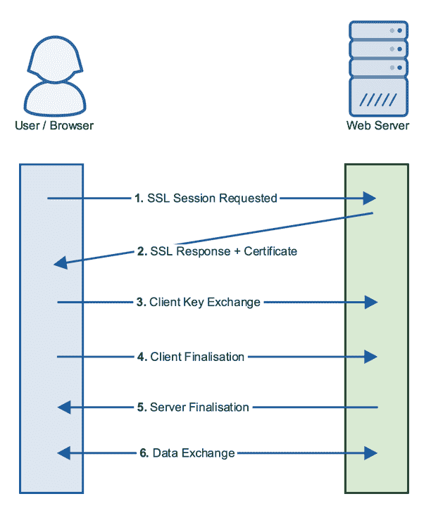

以下是 Web 服务器场景中的步骤：

1.  首先，浏览器与 Web 服务器通信，请求开始 SSL 握手。这也是浏览器向服务器通知它允许使用哪些加密算法的地方。

1.  接下来，服务器响应浏览器。在此阶段，服务器将确认将使用的加密算法（基于浏览器提供的列表）。服务器还会将公钥证书发送给客户端。浏览器随后将与 **证书颁发机构**（**CA**）通信，以验证证书的有效性。

1.  接下来，开始密钥交换。建立会话密钥。该密钥基于客户端的公钥，并由服务器端的私钥解密。

需要特别注意的是，私钥*绝不会*被传输；它始终保留在服务器上。

1.  一旦会话密钥完成，客户端将发送最终确认以完成握手，并等待服务器端的相应确认。

1.  最终，我们已经建立了一个安全的隧道，现在可以在其中传输加密数据。这时，实际的网页内容可以开始发送。

# 准备工作

要安装 SSL，我们需要从三个组件开始。第一个是 **证书签名请求**（**CSR**）。它定义了证书中将包含的信息，包括组织名称和域名等内容。然后将 CSR 发送到 CA 或用来生成自签名证书。

为了简化本例，我们将使用一个自签名证书。我们可以通过一条命令轻松生成 CSR，然后生成私钥和公钥证书。例如，下面是如何使用 2048 位密钥和 600 天有效期生成 CSR 的方法：

```
openssl req -x509 -new -newkey rsa:2048 -nodes -keyout private.key -out public.pem -days 600  
```

本示例将依次询问 CSR 所需的一些问题，并自动生成私钥（`private.key`）和公钥证书（`public.pem`）。以下是一个示例：

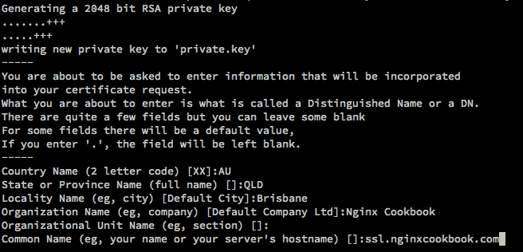

自签名证书无法通过浏览器验证，且不适用于生产环境。它们应仅用于内部和测试目的。

# 如何操作...

现在我们已经有了证书和私钥，可以更新我们的 NGINX 配置以提供基于 SSL 的网站。以下是我们的 NGINX `server` 指令块：

```
server { 
    listen              443 ssl; 
    server_name         ssl.nginxcookbook.com; 
    ssl_certificate     /etc/ssl/public.pem; 
    ssl_certificate_key /etc/ssl/private.key; 
    ssl_protocols       TLSv1 TLSv1.1 TLSv1.2; 
    ssl_ciphers         HIGH:!aNULL:!MD5; 

    access_log  /var/log/nginx/ssl-access.log  combined; 

    location  /favicon.ico { access_log off; log_not_found off; } 
    root  /var/www; 
} 
```

如果你的 `/var/www` 目录中有基本的 `index.html` 或类似文件，你应该会看到如下内容：

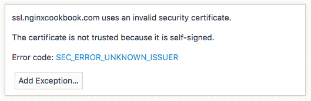

错误信息会在不同的浏览器中有所不同，但它们都只是告诉你证书无法验证，因此不能被本质信任。进行测试时，可以在这里添加一个例外；你应该看到 NGINX 提供的 SSL 网站：

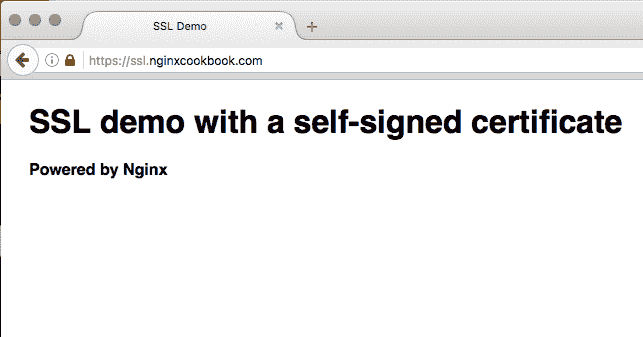

# 它是如何工作的...

下面是这些指令的作用：

+   `listen 443 ssl`：首先，我们告诉 NGINX 使用 SSL 协议在 `443` 端口（HTTPS 标准端口）上监听。之前，我们只是告诉 NGINX 在 `80` 端口上监听，并且默认使用 HTTP 协议。

+   `ssl_certificate`：这是公钥所在的位置，需要是 PEM 格式。如果 CA 还提供了中间证书，那么这些证书也需要包含在该文件中。

+   `ssl_certificate_key`：这是私钥的位置，也需要是 PEM 格式。这个密钥需要妥善保管，以确保证书的完整性——它应该仅存在于服务器上。

+   `ssl_protocols`：在这里，我们指定希望启用哪些变种的 SSL 协议。最简单的默认选项是支持 **传输层安全性**（**TLS**），它是旧版 SSL 协议的继任者。由于 SSLv2 和 SSLv3 在最近几年暴露出了重大缺陷，因此它们应仅在最后的手段下启用。

+   `ssl_ciphers`：密码套件决定了使用哪种加密类型以及加密级别。默认的 `HIGH:!aNULL:!MD5` 意味着我们仅使用高等级（128 位及以上）的认证加密（感叹号表示“不是”）且不使用 MD5 哈希。默认配置是安全的，除非有充分的理由，否则不应更改。

# 在 NGINX 上启用 HTTP/2

现在已经批准的 HTTP/2 标准基于 Google 内部开发的实验性协议 SPDY。正如上一篇中的图表所示，建立 HTTPS 连接可能非常耗时。使用 HTTP/1.1，每个连接到 Web 服务器必须遵循这个过程并等待握手完成。

在 HTTP/2 中，握手时间被缩短，但更重要的是请求可以在单个 TCP 连接上多路复用。这意味着握手只需发生一次，大大减少了对最终用户的延迟。实际上，这意味着基于 HTTP/2 的站点实际上可能比基于标准 HTTP 的站点更快。

HTTP/2 还提供了许多其他优点，例如头部压缩、新的二进制协议和服务器端推送。所有这些进一步提高了 HTTP/2 的效率，同时它还与 HTTP/1.1 兼容：

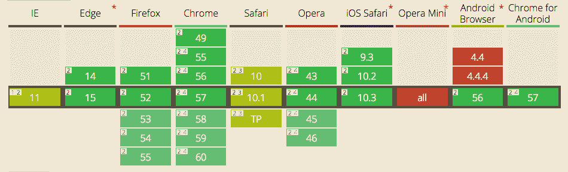

HTTP/2 支持

Source: caniuse.com（2017 年 4 月）

所有现代浏览器（如上图所示）都原生支持 HTTP/2，因此已准备好在生产环境中部署。NGINX 从版本 1.9.5 开始官方支持 HTTP/2。

# 怎么做……

基于我们之前的示例，我们只需要做一个关键的更改。不再只指定`ssl`作为监听协议，我们添加`http2`：

```
server { 
    listen              443 ssl http2; 
    server_name         http2.nginxcookbook.com; 
    ssl_certificate     /etc/ssl/public.pem; 
    ssl_certificate_key /etc/ssl/private.key; 
    ssl_protocols       TLSv1 TLSv1.1 TLSv1.2; 
    ssl_ciphers         HIGH:!aNULL:!MD5; 

    access_log  /var/log/nginx/ssl-access.log  combined; 

    location  /favicon.ico { access_log off; log_not_found off; } 
    root  /var/www; 
} 
```

协议或密码没有任何更改是必要的。要验证 HTTP/2 是否正常工作，您可以使用 Chrome **开发者工具**（**DevTools**）显示协议，或者使用 KeyCDN 提供的外部工具：

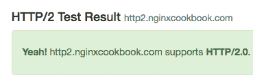

Source: https://tools.keycdn.com/http2-test

虽然简单的页面不会显示性能差异，但平均页面需求约为 50-70 个请求时，我们应该看到约 20% 的改进。对于更复杂的站点（例如电子商务站点），请求超过 200 个时，差异甚至更为显著。

# 另请参阅

NGINX HTTP/2 白皮书：[`assets.wp.nginx.com/wp-content/uploads/2015/09/NGINX_HTTP2_White_Paper_v4.pdf`](https://assets.wp.nginx.com/wp-content/uploads/2015/09/NGINX_HTTP2_White_Paper_v4.pdf)

# 在 NGINX 中配置 HSTS

**HTTP 严格传输安全**（**HSTS**）是 HTTP 协议的增强版，旨在强制执行严格的安全标准，以帮助保护您的站点和用户。HSTS 有几个作用。首先，它确保所有请求必须通过 HTTPS 进行。这确保数据不会意外通过 HTTP 发送，因此不会以未加密的方式留存。

其次，它确保只有有效的证书可以被接受。在我们之前的示例中，我们使用了自签名证书，浏览器允许我们绕过安全检查。启用 HSTS 后，这种情况就不再可能。这意味着试图模仿您的站点或使用不同证书进行中间人攻击现在不再可能。

# 怎么做……

为了启用 HSTS，我们在 `server` 指令中添加一个额外的头部：

```
server { 
    listen              443 ssl http2; 
    server_name         http2.nginxcookbook.com; 
    ssl_certificate     /etc/ssl/public.pem; 
    ssl_certificate_key /etc/ssl/private.key; 
    ssl_protocols       TLSv1 TLSv1.1 TLSv1.2; 
    ssl_ciphers         HIGH:!aNULL:!MD5; 

    add_header Strict-Transport-Security "max-age=31536000; 

    access_log  /var/log/nginx/ssl-access.log  combined; 

    location  /favicon.ico { access_log off; log_not_found off; } 
    root  /var/www; 
} 
```

该头部指定了 `max-age`，在我们的案例中我们将其设置为 `31536000` 秒（即 365 天）。这意味着浏览器将在一年内缓存 HSTS 设置，并确保接下来 365 天内对你的域名的所有请求都会是 HTTPS 请求，并且只接受官方证书。

# 还有更多...

需要记住一个小细节：如果你在其他地方（例如 `location` 块）指定了添加头部，则需要重新声明 HSTS 头部。考虑以下示例：

```
add_header Strict-Transport-Security "max-age=31536000;"; 

location  /api/ { 
    add_header 'Access-Control-Allow-Origin' '*'; 
    add_header 'Access-Control-Allow-Methods' 'GET, POST, 
     OPTIONS'; 
    add_header Strict-Transport-Security "max-age=31536000;"; 
} 
```

由于我们添加了访问控制头部，我们需要重新声明 HSTS 头部。

# 使用 Let's Encrypt 安装简单的 SSL 证书

Let's Encrypt 是一个免费的自动化证书颁发机构（CA），其实现得益于像 **电子前沿基金会**（**EFF**）、Mozilla、Cisco、Akamai、密歇根大学以及其他十多个公司的赞助。Let's Encrypt 由 **互联网安全研究小组**（**ISRG**）组织，自 2016 年 5 月以来，已经颁发了超过 400 万个证书，并且这个数字正在以指数级增长。

虽然免费的组件可能是最大的吸引力，但关键点还是在于自动化。对于那些曾经通过传统 CA 生成 SSL 证书的人来说，需要使用基于文件或电子邮件的域名验证。如果你有多个域名，重复这个过程会非常耗时。

幸运的是，Let's Encrypt CA 完全通过 API 驱动，甚至提供了一个客户端来自动化从验证到更新 NGINX 配置的整个过程。还有一些流行的 Web 控制面板扩展，也能自动化这个过程，比如 Plesk 和 CPanel。

# 如何操作...

官方的 Let's Encrypt 客户端，最近更名为 Certbot，非常容易使用和安装。安装过程对于大多数发行版都是相同的，并且比 Let's Encrypt 测试阶段大大简化了。以下是安装步骤：

```
wget https://dl.eff.org/certbot-auto
chmod a+x certbot-auto
./certbot-auto
```


这将下载并安装系统所需的所有 Python 包，然后创建 Certbot 特定的 **虚拟环境**（**Virtualenv**）。根据系统的速度，这可能需要最多五分钟的时间来完成。

不幸的是，NGINX 插件尚未完成，无法自动创建配置，因此我们需要手动编辑配置。首先，让我们生成证书：

```
./certbot-auto certonly  
```

这将为我们提供两种域名验证的选项：可以通过将文件放置在现有的 `webroot` 目录中，或通过运行一个临时 Web 服务器来实现：

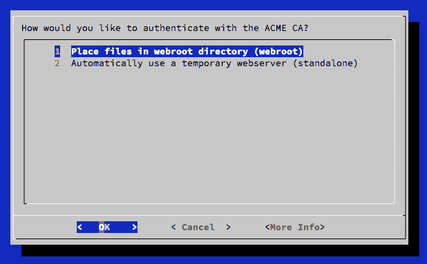

我发现独立的 Web 服务器是最灵活的选择，特别是当你的 NGINX 配置不提供静态文件服务时。然而，这确实要求你首先停止任何使用 `80` 端口的服务。

接下来，向导会要求您输入一个电子邮件账户。这用于在您的证书即将到期或被吊销时通知您。然后您需要输入域名以生成 SSL 证书。

此域名必须有效，并且 DNS 指向服务器才能正确验证。

如果 Certbot 能够验证，您应该会看到一条通知，告知您证书已准备就绪：

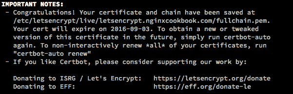

值得注意的是，尽管到期日期看起来很短（90 天），但它设计为自动续订。我们可以使用以下命令运行续订过程：

```
./certbot-auto renew 
```

由于这可以非交互方式运行，您可以通过 Cron 调用或类似方式设置自动更新。

现在，我们有了一对证书（位于`/etc/letsencrypt/live/`），我们现在可以创建一个 NGINX 配置来使用它们：

```
server { 
    listen              443 http2; 
    server_name         letsencrypt.nginxcookbook.com; 
    ssl_certificate     
     /etc/letsencrypt/live/letsencrypt.nginxcookbook.com
     /fullchain.pem; 
    ssl_certificate_key 
     /etc/letsencrypt/live/letsencrypt.nginxcookbook.com
     /privkey.pem; 
    ssl_protocols       TLSv1 TLSv1.1 TLSv1.2; 
    ssl_ciphers         HIGH:!aNULL:!MD5; 

    access_log  /var/log/nginx/letsencrypt-access.log  combined; 

    location /favicon.ico { access_log off; log_not_found off; } 
    root /var/www; 
} 
```

加载我们的新配置后，我们可以验证证书是否有效：

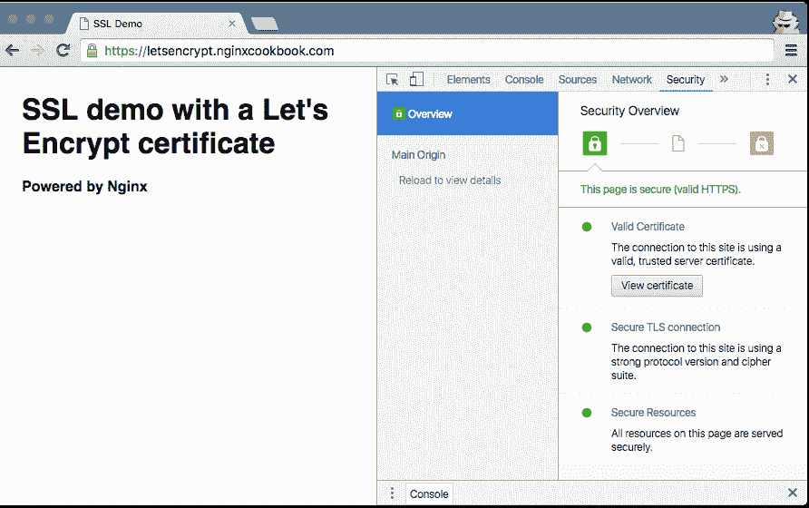

如 Chrome 开发者工具所示，浏览器验证所使用的证书并给出绿色锁定以确认。与其他 CA 相比，此证书没有区别，只是您可以自动化生成和更新！

# 另请参阅

官方 Certbot 网站：[`certbot.eff.org/`](https://certbot.eff.org/)

# 使 NGINX 符合 PCI DSS 标准

**支付卡行业数据安全标准**（**PCI DSS**）是一套包含 12 项安全标准的规定，旨在确保支付相关信息的安全传输和存储。这些标准设定了严格的规则，涵盖从服务器安全到策略和业务标准的各个方面。

我们将仅专注于要求 4 的一部分，即*加密跨开放公共网络传输的持卡人数据*。

# 如何做...

对于使用 NGINX 安全传输 PCI DSS 数据，需要进行一些调整以实现标准配置。截至标准版本 3.2，使用 SSL 协议或 TLS 1.0 需要额外的检查和评估。除非绝对需要用于旧设备的向后兼容性，我们强烈建议禁用它们。以下是我们的工作配置：

```
server { 
    listen              443 http2 default_server; 
    server_name         pcidss.nginxcookbook.com; 
    ssl_certificate     
     /etc/letsencrypt/live/pcidss.nginxcookbook.com/
     fullchain.pem; 
    ssl_certificate_key 
     /etc/letsencrypt/live/pcidss.nginxcookbook.com/
     privkey.pem; 

    ssl_protocols       TLSv1.1 TLSv1.2; 
    ssl_ciphers         HIGH:!aNULL:!MD5:!kEDH; 
    ssl_prefer_server_ciphers on; 
    ssl_session_cache shared:SSL:10m; 

    add_header Strict-Transport-Security "max-age 31536000"; 

    access_log  /var/log/nginx/pcidss-access.log  combined; 

    location /favicon.ico { access_log off; log_not_found off; } 
    root /var/www; 
} 
```

# 工作原理...

让我们来看一些差异：

+   `listen 443 http2 default_server;`: 我们添加`default_server`以便 NGINX 在协商阶段使用默认配置。这是因为**服务器名称指示**（**SNI**）只会在连接协商完成后发生。如果不指定`default_server`指令，初始握手将会回退到 TLS 1.0（NGINX 默认设置）。

+   `ssl_protocols TLSv1.1 TLSv1.2;`: 我们只指定 TLS 1.1 和 1.2 协议，这会禁用旧的 1.0 版本（易受 POODLE 攻击）。这还确保旧的 SSLv2 和 SSLv3 也被禁用。

+   `ssl_ciphers HIGH:!aNULL:!MD5:!kEDH;`：虽然这与我们之前的示例看起来没有太大区别，但我们在末尾添加了 `!kEDH` 参数。这会禁用基础的 Diffie Hellman 密钥交换（容易受到 LOGJAM 攻击），同时仍允许更高效的 **椭圆曲线 Diffie-Hellman** (**EECDH**)。

通过这种组合，我们能够在高科技桥 SSL 服务器测试中获得 A+ 等级，并确认设置符合 PCI DSS 标准：

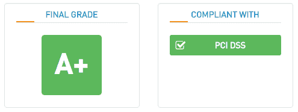

# 另见

+   官方 PCI-DSS 网站：[`www.pcisecuritystandards.org`](https://www.pcisecuritystandards.org)

+   高科技桥 SSL 服务器测试：[`www.htbridge.com/ssl/`](https://www.htbridge.com/ssl/)

# 使用 NGINX 启用 OCSP stapling

**在线证书状态协议** (**OCSP**) 是检查证书是否被吊销的主要协议之一。这一点非常重要，以确保如果服务器或证书被攻击，证书能够被替换并吊销旧证书，防止其被滥用。

这些检查可能会耗费时间，因为浏览器在首次使用证书时需要验证证书。OCSP stapling 是 OCSP 的一种替代方案，它减轻了 OCSP 带来的一些延迟问题。它通过将缓存结果直接附加到主请求中来实现这一点。由于该结果仍由 CA 签名，因此结果同样安全，但没有额外的延迟。

# 如何操作...

为了使用 OCSP stapling，我们需要在 `server` 指令中添加两行额外的配置：

```
ssl_stapling on; 
ssl_stapling_verify on; 
```

这意味着服务器现在负责初始的 OCSP 查找，并将在随后的每个请求中发送缓存结果。

我们可以通过使用 Qualys SSL 服务器测试来验证这一点，并且我们应该关注以下几点：

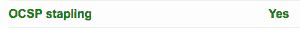

CloudFlare（一个内容分发和网站性能平台）声称，OCSP stapling 可节省最多 30% 的 SSL 协商时间，因此启用此功能对于最大化网站性能至关重要。

# 另见

+   OCSP stapling 的 Wikipedia 页面：[`en.wikipedia.org/wiki/OCSP_stapling`](https://en.wikipedia.org/wiki/OCSP_stapling)

+   Qualys SSL 服务器测试：[`www.ssllabs.com/ssltest`](https://www.ssllabs.com/ssltest)

# 达到完整的 A+ Qualys 等级

配置基于 SSL 的站点的一个基准是通过 Qualys 服务器 SSL 测试获得 A+ 等级。这是因为 Qualys 设置了一套严格的预期结果和最低标准，旨在确保您的网站尽可能安全。

实现这一目标需要禁用旧的协议和密码套件，这与我们为 PCI-DSS 配置所做的操作类似。实际上，我们之前测试的基本 PCI-DSS 配置已经达到了 A+ 等级。接下来，我们将进一步优化，为 NGINX 提供最终的 SSL 配置。

其中一些更改可能会导致与旧设备和浏览器的向后兼容性问题。在将其投入生产之前，请确保对目标用户群体进行充分的测试。

在开始之前，下面是基本配置（例如，我们的 Let's Encrypt 教程）所实现的功能：

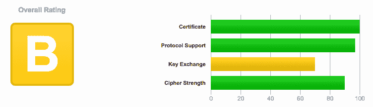

`B`级评分并不差，主要被降级的原因是 Diffie-Hellman 密钥交换较弱。我们将确保在本教程中不会出现这个问题。

# 如何实现...

我们需要做的第一件事是重新生成证书，以确保 RSA 密钥为 4096 位。大多数 CA 会签发 2048 位证书，这样我们只能在密钥交换评估中获得 90%的分数。如果你使用 Let's Encrypt，你需要通过`--rsa-key-size 4096`参数生成证书。

这是我们的`server`指令，它基于 PCI-DSS 配置并进行了进一步调整：

```
server { 
    listen              443 http2 default_server; 
    server_name         ultimate.nginxcookbook.com; 
    ssl_certificate     
     /etc/letsencrypt/live/ultimate.nginxcookbook.com
     /fullchain.pem; 
    ssl_certificate_key 
     /etc/letsencrypt/live/ultimate.nginxcookbook.com
     /privkey.pem; 

    ssl_protocols    TLSv1.2; 
    ssl_ciphers         EECDH+CHACHA20:EECDH+CHACHA20-
     draft:EECDH+AES128:RSA+AES128:EECDH+AES256:
     RSA+AES256:EECDH+3DES:RSA+3DES:!MD5; 
    ssl_prefer_server_ciphers on; 
    ssl_session_cache shared:SSL:10m; 

    ssl_stapling on; 
    ssl_stapling_verify on; 

    ssl_dhparam /etc/ssl/dhparam.pem; 

    add_header Strict-Transport-Security "max-age=31536000"; 

    access_log  /var/log/nginx/ultimate-access.log  combined; 

    location /favicon.ico { access_log off; log_not_found off; } 
    root /var/www; 
} 
```

使用此设置，我们获得了 A+，如下图所示：

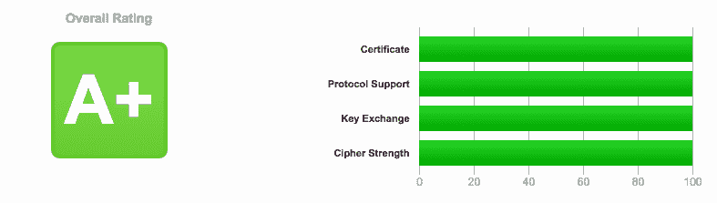

使用 High-Tech Bridge SSL 服务器测试，我们还实现了完整的 NIST 推荐合规性：

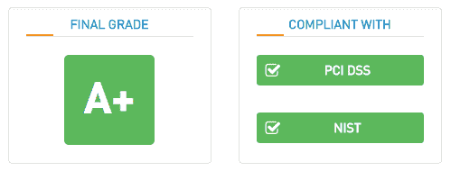

再次重申，安全规则越严格，与旧系统和浏览器的兼容性问题就越大。

# 它是如何工作的...

首先，我们只允许使用 TLS 1.2。Qualys 要求此协议以获得 100%的协议评分。

接下来，我们设置了非常有限的密码套件，所有密码套件都是 256 位或更高。我们还将其设置为仅使用 EECDH，以强制执行前向保密。这与 384 位曲线（`secp384r1`）结合使用，这是 NSA 为最高机密等级文件所要求的等级。它大致相当于一个 7680 位的 RSA 密钥，因此不要被较低的位数所迷惑。

# 另请参见

+   Qualys SSL 服务器测试：[`www.ssllabs.com/ssltest`](https://www.ssllabs.com/ssltest)

+   Qualys 服务器评分指南：[`github.com/ssllabs/research/wiki/SSL-Server-Rating-Guide`](https://github.com/ssllabs/research/wiki/SSL-Server-Rating-Guide)
