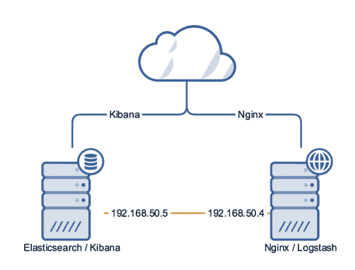
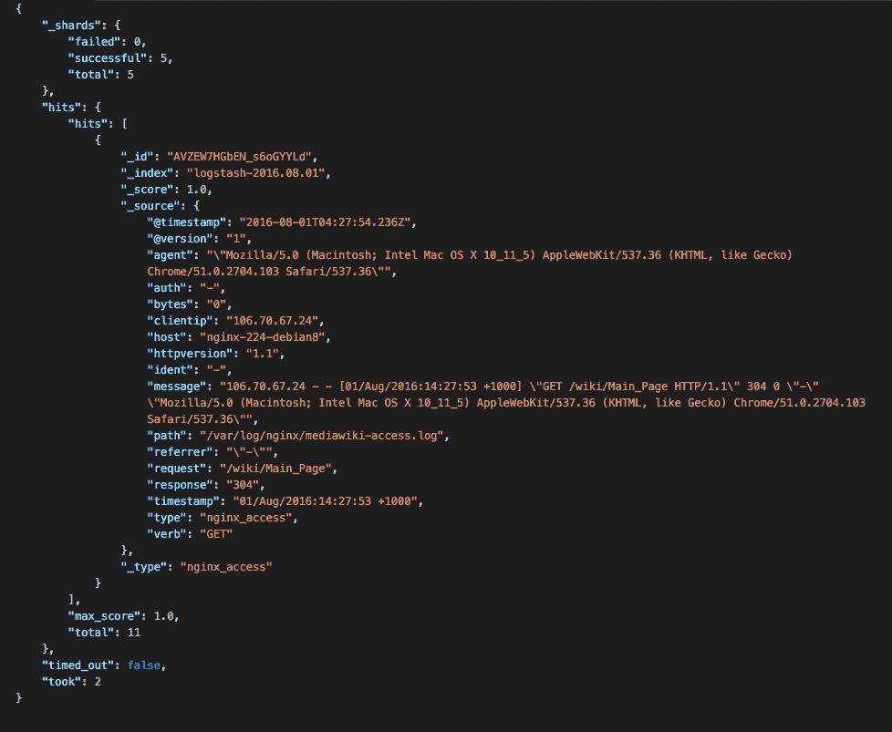
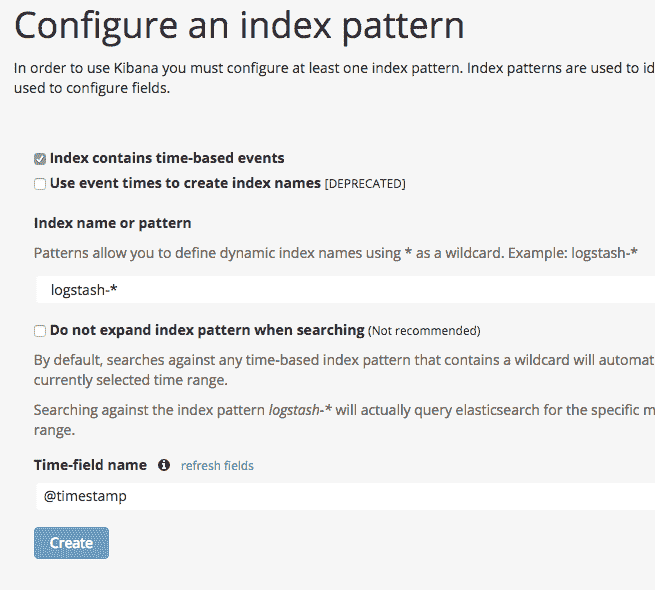
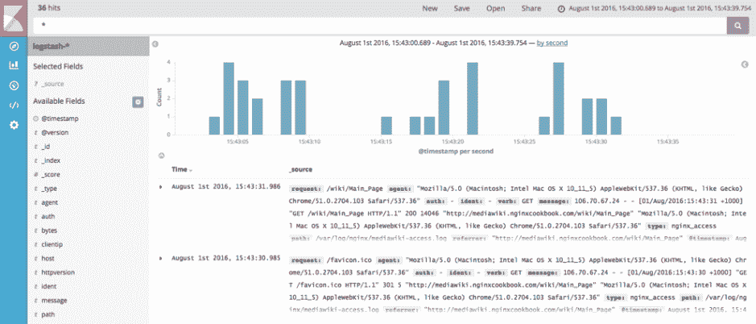
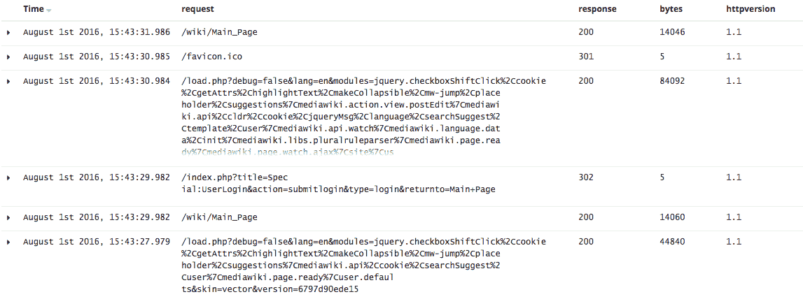
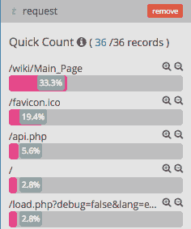
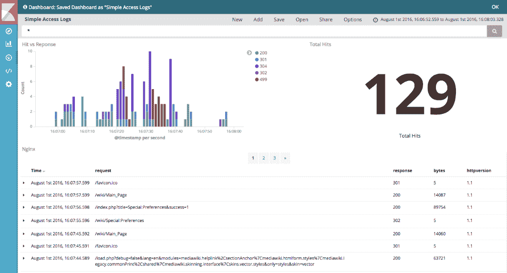

# 日志记录

在本章中，我们将介绍以下内容：

+   记录到 syslog

+   自定义 Web 访问日志

+   虚拟主机日志格式

+   应用程序聚焦日志记录

+   记录 TLS 模式和密码信息

+   记录 POST 数据

+   条件日志记录

+   使用 Elastic Stack

# 介绍

与度量类似，日志记录是监控服务器性能和调试错误的关键。幸运的是，NGINX 内置了一个功能强大的日志记录模块，可以覆盖几乎所有使用场景。在本章中，我们将介绍如何更改标准日志格式的几种不同方式，以及如何以更高效的方式处理它们。

# 记录到 syslog

如果您已经有了集中式服务器日志，或者您的日志已通过标准的 syslog 系统进行分析，您还可以将 NGINX 的日志重定向到同样的系统。这在使用 Loggly 和 Papertrail 等外部平台时非常有用，这些平台通过 syslog 集成。

# 如何操作...

首先，我们需要考虑将日志发送到哪里，syslog 可以是本地的，也可以是基于网络的，因此我们将介绍这两种方式。对于几乎所有 Linux 发行版，默认的 syslog 服务是 `rsyslog`，它会监听位于 `/dev/log` 的 Unix 套接字。以下是我们的 NGINX 本地日志配置：

```
server { 
    listen              80; 
    server_name         syslog.nginxcookbook.com; 
    access_log syslog:server=unix:/dev/log; 
    error_log syslog:server=unix:/dev/log; 
    location /favicon.ico { access_log off; log_not_found off; } 
    root /var/www; 
} 
```

现在日志的处理将由 `rsyslog` 完成。默认情况下，这将匹配通配符规则，并将日志条目写入 `/var/log/syslog`（适用于 Debian / Ubuntu 系统）或 `/var/log/messages`（适用于 CentOS / RedHat 系统）。

通过访问网站后查看 `syslog` 的最后一行，我们可以确认它按预期工作：

```
tail -n 1 /var/log/syslog

Jun 22 23:40:53 nginx-220-ubuntu nginx-220-ubuntu nginx: 
106.71.217.155 - - [22/Jun/2016:23:40:53 +1000] "GET / HTTP/1.1" 200 
192 "-" "Mozilla/5.0 (Macintosh; Intel Mac OS X 10_11_4) 
AppleWebKit/537.36 (KHTML, like Gecko) Chrome/51.0.2704.103 Safari/537.36"
```

# 远程 syslog

尽管我们可以使用本地 syslog 守护进程生成更多的灵活性，但通常，我们希望卸载日志记录的原因是为了减少生产系统的负载，或使用外部工具进行更好的日志分析。

最简单的方法是将日志发送到不在同一服务器上的 syslog 守护进程或处理系统。这也可以用来聚合来自多个服务器的日志，方便在一个中心位置进行监控和报告。

要将日志发送到远程服务器，首先需要启用 syslog 服务器在网络端口上监听。这在大多数基于 `rsyslog` 的系统中是禁用的，目的是避免意外的安全问题。要启用它，我们只需在 `rsyslog.conf` 文件（通常是 `/etc/rsyslog.conf`）中取消注释以下内容：

```
module(load="imudp") 
input(type="imudp" port="514") 
```

在重启 syslog 守护进程（`systemctl restart rsyslog`）后，它将开始监听 `514` 端口的 UDP 日志数据包。

默认情况下，syslog 数据是解密的。我们强烈建议您确保日志通过 VPN 隧道或类似的加密方式发送。

在 NGINX 服务器上，我们现在需要更新 `server` 块来处理访问和调试日志：

```
access_log syslog:server=202.74.71.220,tag=nginx,severity=info combined; 
error_log syslog:server=202.71.71.220,tag=nginx,severity=error debug; 
```

在重新加载 NGINX 以应用新规则后，我们现在可以验证日志是否已经到达远程服务器的 syslog：

```
Aug 09 23:39:02 nginx-220-ubuntu nginx: 106.71.219.248 - - [09/Aug/2016:23:39:02 +1000] "GET / HTTP/1.1" 200 184 "-" "Mozilla/5.0 (Macintosh; Intel Mac OS X 10_11_5) AppleWebKit/537.36 (KHTML, like Gecko) Chrome/52.0.2743.116 Safari/537.36"
Aug 09 23:39:06 nginx-220-ubuntu nginx: 106.71.219.248 - - [09/Aug/2016:23:39:06 +1000] "GET /404 HTTP/1.1" 404 199 "-" "Mozilla/5.0 (Macintosh; Intel Mac OS X 10_11_5) AppleWebKit/537.36 (KHTML, like Gecko) Chrome/52.0.2743.116 Safari/537.36"
```

在基于 Debian / Ubuntu 的系统中，日志会保存在 `/var/log/syslog`。如果你运行基于 RedHat / CentOS 的系统，则会记录到 `/var/log/messages`。

# 另见

NGINX 参考：[`nginx.org/en/docs/syslog.html`](https://nginx.org/en/docs/syslog.html)

# 自定义网页访问日志

你可以通过多种方式自定义日志文件，包括格式、提供的信息以及保存位置。如果你在应用服务器前使用 NGINX 作为代理，这种自定义尤其方便，因为传统的网页日志格式可能不太有用。

# 如何操作...

有几种不同的方式可以自定义访问日志，以获取更相关的信息或减少不必要的日志记录。`combined`的标准配置如下：

```
log_format combined '$remote_addr - $remote_user [$time_local] ' 
                   '"$request" $status $body_bytes_sent ' 
                   '"$http_referer" "$http_user_agent"'; 
```

这个格式已经在 NGINX 中预定义，并且与 Apache 的合并格式兼容。这意味着，默认情况下，合并格式的日志将与大多数日志解析器兼容，从而能够直接解释日志数据。

虽然拥有更多数据可以非常有帮助（如我们稍后将展示的），但要小心偏离标准格式。如果你想使用第三方系统解析日志，你还需要更新或自定义解析器。

# 另见

+   NGINX 日志模块文档：[`nginx.org/en/docs/http/ngx_http_log_module.html`](http://nginx.org/en/docs/http/ngx_http_log_module.html)

+   NGINX 核心变量：[`nginx.org/en/docs/http/ngx_http_core_module.html#variables`](http://nginx.org/en/docs/http/ngx_http_core_module.html#variables)

# 虚拟主机日志格式

如果你在 NGINX 中运行虚拟主机环境（具有多个`server`块），你可以做一个小小的调整来增强日志功能。默认情况下，当使用默认的合并格式时，主机（定义为`$host`）不会被记录。将此字段包含在日志中意味着日志可以在外部解析，而不需要额外的信息。

# 如何操作...

首先，我们需要定义新的日志格式：

```
log_format vhostlogs '$host $remote_addr - $remote_user '  
                     '[$time_local] "$request" $status ' 
                     '$body_bytes_sent "$http_referer" '   
                     '"$http_user_agent"'; 
```

`log_format`指令需要放在`server`块外。

要使用我们新的日志文件，我们需要在`server`块中更新访问日志格式，使用新的格式。以下是使用我们 MediaWiki 配方的一个例子：

```
access_log  /var/log/nginx/mediawiki-vhost-access.log vhostlogs; 
```

如果你为子域名设置了通配符，这意味着日志中也会有正确的主机名。如果没有这个，日志将无法区分任何子域名，从而影响统计分析和比较。

使用更新的格式，下面是我们日志中的一个例子：

```
mediawiki.nginxcookbook.com 106.71.219.248 - - [06/Aug/2016:21:34:42 +1000] "GET /wiki/Main_Page HTTP/1.1" 200 12926 "-" "Mozilla/5.0 (Macintosh; Intel Mac OS X 10_11_5) AppleWebKit/537.36 (KHTML, like Gecko) Chrome/52.0.2743.116 Safari/537.36" 
```

现在，我们可以在日志中清楚地看到主机名。

# 面向应用的日志记录

在本例中，我们将定制日志，以便在涉及应用程序和指标时提供更多的信息。额外的信息，如响应时间，对于衡量应用程序的响应性非常有用。尽管它通常可以在应用程序栈内生成，但也可能会引入一些开销或导致结果不完全。

# 如何操作...

首先，我们需要定义我们新的日志格式：

```
log_format applogs '$remote_addr $remote_user $time_iso8601' 
                   '"$request" $status $body_bytes_sent ' 
                   '$request_time $upstream_response_time'; 
```

`log_format`指令需要位于`server`块之外。

在这里，我们偏离了合并格式，将时间改为 ISO 8601 格式（例如`2016-07-16T21:48:36+00:00`），移除了 HTTP 引用来源和用户代理，但增加了请求处理时间（`$request_time`），以更好地了解我们的应用程序生成响应所花费的时间。

定义了新的日志格式后，我们现在可以将其用于我们的应用程序日志：

```
access_log  /var/log/nginx/meteor-access.log  applogs; 
```

我们使用的是默认的 Meteor 应用程序，它是在第三章中设置的，*常见框架*，并且因为我们希望应用程序具有很高的响应性，`$request_time`将提供即时反馈，告诉我们哪些调用的响应时间不够快。下面是日志中的一个示例输出：

```
106.70.67.24 - 2016-08-07T20:47:07+10:00"GET / HTTP/1.1" 200 2393 0.005 
106.70.67.24 - 2016-08-07T20:47:07+10:00"GET /sockjs/070/tsjnlv82/websocket HTTP/1.1" 101 468 14.175  
```

由于请求时间是以毫秒为单位进行测量的，我们可以看到我们的基本调用花费了 0.005 毫秒完成，而 WebSocket 连接花费了 14 毫秒完成。这些附加信息现在可以轻松搜索，并且通过额外的日志解析器（如本章稍后介绍的 Elastic Stack），我们可以设置进一步的搜索和警报。

# 记录 TLS 模式和密码信息

随着 HTTP/2 的出现以及不断变化的加密最佳实践，可能会出现一些小的兼容性问题，这些问题通常很难解决。浏览器也会不断改变它们接受的内容。为了确保我们确切知道使用了哪些密码算法和协议，我们可以将这些附加信息添加到我们的日志文件中。

# 如何操作...

这是我们的 SSL 增强日志格式：

```
log_format ssl_logs '$remote_addr - $remote_user [$time_local] ' 
                    '"$request" $status $body_bytes_sent ' 
                    '"$http_referer" "$http_user_agent"' 
                    '[$ssl_protocol|$ssl_cipher]'; 
```

这是基于常见格式的，我们在末尾添加了`$ssl_protocol`和`$ssl_cipher`。现在我们的日志看起来是这样的：

```
106.70.67.24 - - [07/Aug/2016:22:39:20 +1000] "GET / HTTP/2.0" 304 118 "-" "Mozilla/5.0 (Macintosh; Intel Mac OS X 10_11_5) AppleWebKit/537.36 (KHTML, like Gecko) Chrome/49.0.2490.71 Safari/537.36"[TLSv1.2|ECDHE-RSA-AES128-GCM-SHA256] 
106.70.67.24 - - [07/Aug/2016:22:39:20 +1000] "GET / HTTP/2.0" 304 118 "-" "Mozilla/5.0 (Linux; Android 5.1.1; Nexus 6 Build/LYZ28E) AppleWebKit/537.36 (KHTML, like Gecko) Chrome/44.0.2403.20 Mobile Safari/537.36"[TLSv1.2|ECDHE-RSA-AES128-GCM-SHA256] 
106.70.67.24 - - [07/Aug/2016:22:39:29 +1000] "GET / HTTP/2.0" 304 118 "-" "Mozilla/5.0 (Macintosh; Intel Mac OS X 10_11_5) AppleWebKit/537.36 (KHTML, like Gecko) Chrome/51.0.2704.103 Safari/537.36"[TLSv1.2|ECDHE-RSA-AES128-GCM-SHA256] 
106.70.67.24 - - [07/Aug/2016:22:42:31 +1000] "GET / HTTP/1.1" 200 215 "-" "curl/7.40.0"[TLSv1.2|ECDHE-RSA-AES128-GCM-SHA256] 
```

在日志细节中，我们现在可以看到来自 Chrome、Firefox、Safari，甚至 cURL 的请求都使用了`TLSv1.2`和`ECDHE-RSA-AES128-GCM-SHA256`。如果我们发现不同浏览器或协议出现异常行为，这将大大帮助我们诊断问题。

# 记录 POST 数据

当我们有表单提交时，如果不知道数据的值，调试和重现错误会变得非常困难。默认情况下，NGINX 不记录 POST 数据，因为它可能非常庞大。然而，在某些情况下，获取这些数据对于调试问题至关重要。

# 如何操作...

为了记录 POST 数据，我们需要定义一个自定义日志格式：

```
log_format post_logs '[$time_local] "$request" $status '  
                     '$body_bytes_sent "$http_referer" '        
                     '"$http_user_agent" [$request_body]'; 
```

通过记录`$request_body`，我们将能够看到 POST 提交的内容。

要启用我们的 POST 日志格式，我们只需指定访问日志的日志格式：

```
access_log  /var/log/nginx/postdata-access.log post_logs; 
```

如果你只是想验证它是否按预期工作，我们可以使用 cURL 发送 POST 数据。我使用了 第三章 中设置的 Express 来接收 POST 数据，因此我们可以如下调用：

```
curl http://express.nginxcookbook.com/ -d 'name=johnsmith,phone=123123,email=john@smith.demo' 
```

这将通过根（`/`）URL 提交变量 name、phone 和 email。如果我们查看 `postdata-access.log`，我们现在可以看到以下内容：

```
[09/Aug/2016:22:45:35 +1000] "POST / HTTP/1.1" 200 18 "-""curl/7.43.0" [name=johnsmith,phone=123123,email=john@smith.demo] 
```

如果你仍然启用了标准日志格式，它会简单地显示一个破折号（`-`）来表示请求，如果应用程序没有捕获它，进一步调试将变得不可能。

这是对应的标准合并格式的日志条目：

```
106.70.67.24 - - [09/Aug/2016:22:45:35 +1000] "POST / HTTP/1.1" 200 18 "-" "curl/7.43.0" 
```

当然，通过记录所有的 POST 数据，你将使用相当多的磁盘空间和服务器开销。我们强烈建议仅在开发环境中启用此功能。

# 条件日志记录

在某些情况下，我们可能希望根据某种条件参数记录不同的数据。例如，如果你有一个应用程序的测试版并且希望收集更多信息，我们可以仅为测试版的 URL 记录这些数据。为了避免在不需要时将额外的信息塞进日志文件，我们可以仅在需要时触发记录。

# 如何实现...

要启用条件日志记录，我们根据是否设置了条件，将 (`$args`) URI 参数映射到 `$debuglogs` 变量。下面是代码：

```
map $args $debuglogs { 
    default     0; 
    debug       1; 
} 
```

与自定义日志格式一样，这需要放在 `server` 指令之外。然后，在 `server` 指令内，我们可以使用该变量并创建额外的日志记录：

```
access_log /var/log/nginx/djangodemo-debug-access.log applogs if=$debuglogs; 
access_log  /var/log/nginx/djangodemo-access.log  combined; 
```

如果我们调用一个普通的 URL，它会简单地将访问记录到标准的 `djangodemo-access.log` 文件中，采用合并格式。如果我们调用一个带有 `debug` 参数的 URL（例如：`http://djangodemo.nginxcookbook.com/?debug`），我们现在可以在标准日志中看到详细信息，并且我们的额外日志文件 `djangodemo-debug-access.log` 也会使用我们在前一个示例中定义的 `applogs` 格式记录这些信息。

# 使用 Elastic Stack


手动翻阅日志文件以获得洞察或检测异常可能非常慢且耗时。为了解决这个问题，我们将通过一个简单的例子来演示如何使用 Elastic Stack（以前称为 **Elasticsearch Logstash Kibana** (**ELK**) 堆栈）。Elasticsearch 是一个高速搜索引擎，提供实时索引和搜索。数据以无模式的 JSON 文档存储，并且有一个易于使用的 API 供访问。

为了配合这一点，还有 Logstash 和 Kibana。Logstash 是一个允许收集日志、即时解析数据并将其推送到存储后端（如 Elasticsearch）的工具。Logstash 的原始创建者（Jordan Sissel）编写它是为了解析如 NGINX 生成的 Web 服务器日志文件，因此它非常适合这项任务。

Kibana 是最终的拼图部分。一旦数据被收集、解析并存储，我们现在需要能够读取并查看它。Kibana 允许你轻松地可视化数据，通过结构化过滤器和查询，然后以易于阅读的图表和表格形式展示信息。作为一种图形表示，它可以更快速、更轻松地解读数据，并看到可能有意义的数据差异。

更重要的是，整个 ELK 堆栈是开源的，因此可以自由使用和扩展。实际上，该堆栈已经扩展，增加了如 Beats 等工具，以提供轻量级数据传输，供 Logstash 处理。一旦开始使用它，就很难再回到平面文件的模式！

# 如何操作...

要运行 Elastic Stack，你可以选择将其安装在自己的系统上，或者使用基于云的实例。对于这个配方，我们将把它安装在一个独立的服务器上。

# Elasticsearch

要安装 Elastic，只需下载适合你实例的`.deb`或`.rpm`包。以这个示例为例，我将使用 Ubuntu 16.04。首先，我们需要安装 Java 8 版本（Elastic 5.x 所需）：

```
apt install openjdk-8-jre  
```

接下来，我们将下载最新的 Elastic 包并安装它：

```
wget https://download.elastic.co/elasticsearch/release/org/elasticsearch/distribution/deb/elasticsearch/5.0.0-alpha4/elasticsearch-5.0.0-alpha4.deb 

dpkg -i elasticsearch-5.0.0-alpha4.deb  
```

该示例还使用的是 5.x 版本，该版本在编写时处于 alpha 阶段。确保为生产环境选择最新的稳定版本。

虽然 Elasticsearch 在你开始重度使用时可能变得相当复杂，但好消息是默认配置无需任何更改即可开始使用。然而，我们强烈建议确保你只在私有网络上运行 Elasticsearch（如果可能的话），以避免不小心将服务器暴露到互联网。以下是我们的场景示例：



在我们的示例中，所有系统都位于`192.168.50.x`范围内的私有网络中，Elasticsearch 服务器的 IP 为`192.168.50.5`。因此，我们只需编辑配置文件(`/etc/elasticsearch/elasticsearch.yml`)，并设置以下内容：

```
# Set the bind address to a specific IP (IPv4 or IPv6): 
# 
network.host: 192.168.50.5  
discovery.zen.minimum_master_nodes: 1 
```

我们还将主节点的最小数量设置为`1`，以便它知道要等待其他主节点。在集群系统中，理想情况下你需要三个或更多节点来形成一个法定人数，从而确保数据的有效性。

所以，我们只需要做的就是启动它：

```
systemctl start elasticsearch   
```

我们现在可以通过一个简单的 cURL 调用来快速测试它，以确保它正常工作：

```
curl http://192.168.50.5:9200  
```

输出应类似于以下内容：

```
{ 
    "name" : "Nebulon", 
    "cluster_name" : "elasticsearch", 
    "version" : { 
        "number" : "5.0.0-alpha4", 
        "build_hash" : "3f5b994", 
        "build_date" : "2016-06-27T16:23:46.861Z", 
        "build_snapshot" : false, 
        "lucene_version" : "6.1.0" 
    }, 
    "tagline" : "You Know, for Search" 
} 
```

# Logstash

设置好 Elasticsearch 后，我们现在可以安装和配置 Logstash。由于 Logstash 将执行日志收集的角色，因此需要将其安装在与 NGINX 相同的服务器上。对于更大的安装，可以使用 Filebeat（也是 Elastic 家族的一部分）作为轻量级的日志转发器，并将 Logstash 单独部署到实例上进行日志解析。

和 Elasticsearch 一样，我们需要 Java 8 或更高版本才能运行 Logstash。由于这个示例配方也使用的是 Ubuntu 16.04，我们可以通过以下方式安装它：

```
apt install openjdk-8-jre  
```

接下来，我们下载 Logstash 的最新版本并安装它：

```
wget https://download.elastic.co/logstash/logstash/packages/debian/logstash-5.0.0-alpha4.deb
dpkg -i logstash-5.0.0-alpha4.deb  
```

安装完成后，我们需要创建配置文件。这个文件将定义在哪里查找日志，如何解析它们，以及将其发送到哪里。虽然一开始配置可能看起来有点复杂，但一旦工作正常，它就像是设定好后不再需要过多关注的情况。以下是适用于本书中大多数已描述配置的配置文件：

```
input { 
    file { 
        type => nginx_access 
        path => ["/var/log/nginx/*-access.log"] 
    } 
} 

filter { 
    grok { 
        match =>{"message" => "%{COMBINEDAPACHELOG}" } 
    } 
} 

output { 
    elasticsearch { hosts => ["192.168.50.5:9200"] } 
    stdout { codec => rubydebug } 
} 
```

对于大多数安装情况，这个文件需要放在`/etc/logstash/conf.d/`文件夹下，并以`.conf`作为文件扩展名（例如`nginx.conf`）。

在`input`部分，我们使用`file`插件来监控所有名称模式为`*-access.log`的日志。`type`定义只是为了在 Elasticsearch 服务器中存在来自多个源的日志时，方便进行过滤。

然后，在`filter`部分，我们使用`grok`插件将纯文本数据转换为结构化格式。如果你之前没有使用过 grok 模式，它们类似于正则表达式，起初可能看起来比较复杂。由于我们使用的是 NGINX 的合并日志格式（它已经被定义为 grok 模式），所以大部分工作已经为我们做完了。

最后，`output`部分定义了数据的发送目标。Logstash 可以将数据发送到多个目标（大约 30 种不同的目标），但在本例中，我们只是将其发送到 Elasticsearch 服务器。`hosts`设置可以接受一个 Elasticsearch 服务器数组，这样在大规模场景下，可以对数据推送进行负载均衡。

要启动 Logstash，我们只需调用标准的 init 系统，在我们的示例中是 systemd：

```
systemctl start logstash  
```

如果我们现在在任何一个监控站点加载页面，你应该会在 Elasticsearch 中看到数据。我们可以通过查询`logstash`索引并返回一条记录来进行简单的测试。要在命令行中执行此操作，请运行以下命令：

```
curl http://192.168.50.5:9200/logstash-*/_search -d '{ "size": 1 }' |  python -m json.tool  
```

我通过`python`管道传输 cURL 命令来快速格式化代码；默认情况下，它以压缩格式返回，且没有空格。虽然这减少了数据包的大小，但也使得阅读起来更加困难。输出应如下所示：



虽然具体的语法现在可能还不太容易理解，但重要的是要注意，我们的单行日志已被解析为多个字段。一旦我们完成 Kibana 的安装，这个功能的强大之处将会显现。

# Kibana

我们技术栈的最后一部分是 Kibana，它用来可视化 Elasticsearch 中的数据。要安装 Kibana，我们只需下载并安装单个包。根据我们最初的示意图，我们将其安装在 Elasticsearch 服务器上：

```
wget https://download.elastic.co/kibana/kibana/kibana-5.0.0-alpha4-amd64.deb
dpkg -i kibana-5.0.0-alpha4-amd64.deb  
```

由于我们已经将 Elasticsearch 绑定到本地 IP（`192.168.50.5`），我们需要编辑 Kibana 配置文件（`/etc/kibana/kibana.yml`），并将其设置为查找这个地址：

```
# The URL of the Elasticsearch instance to use for all your queries.
elasticsearch.url: "http://192.168.50.5:9200"  
```

默认情况下，Kibana 是对外开放的；理想情况下，我们不应该保持这种状态。当然，确保 Kibana 安全的一个简单方法是通过 NGINX 进行代理，我们将在后续章节中讨论这种情况。目前，请确保不要不小心将它暴露给外界。

让我们启动 Kibana 服务并开始：

```
systemctl start kibana  
```

现在，Kibana 可以通过 5601 端口在 Web 界面上访问；你应该会看到如下所示的内容：


这是一个非常简短的 Kibana 使用入门教程，它的复杂程度足以让一本书来讲解。为了能够可视化数据，我们首先需要将索引模式加载到 Kibana 中。如果你点击发现图标（最左边的那个），它会提示你这么做。此时，屏幕应该像以下截图所示：



由于我们的配置非常简单，我们可以直接接受默认设置并点击创建。此时，你应该会看到一个字段和字段类型的列表；这意味着 Kibana 现在知道如何对这些字段进行排序、筛选和搜索。

再次点击发现图标，它应该会以合并的柱状图和表格格式显示访问日志。如果什么都没有显示，检查一下你设置的时间范围，它会显示在右上角。以下是我的测试数据：



这目前还不是很有用，但至少我们可以看到基于命中次数的历史视图。为了在表格中显示其他字段，我们可以将鼠标悬停在左侧栏中的字段上，应该会显示添加按钮。我已经添加了请求、响应、字节和 http 版本，以便提供更详细的视图，如下所示：



我们可以快速浏览数据，查看是否存在错误或异常。如果我们想快速了解请求的分布情况，可以点击左侧栏中的字段，它会显示搜索结果的前五项。例如，以下是我们的演示输出：



一眼看去，我们就能知道最受欢迎的请求是什么。我们还可以根据这些值进行筛选，只需点击对话框右侧的放大镜图标。正向图标会确保只显示与此请求匹配的内容，而负向图标会排除所有与此请求匹配的内容。

这只是一个开始，如你在左侧所见，可以创建可视化图表，然后将其放入完整的仪表盘中。你可以根据预设的过滤器和搜索条件，添加任意数量的折线图、柱状图及类似的项目。当然，你可以拥有多个仪表盘，以便根据不同场景进行定制。举个例子，这里有一个大约五分钟内创建的快速仪表盘：



# 另请参阅

Elastic Stack 文档： [`www.elastic.co/guide/index.html`](https://www.elastic.co/guide/index.html)
