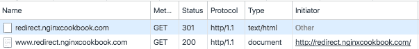

# 第六章：重写规则

在本章中，我们将介绍以下几种重写规则：

+   重定向非 www 到 www 网站

+   重定向到新域名

+   阻止恶意用户代理

+   重定向所有 HTTPS 调用以确保网站安全

+   重定向页面和目录

+   通过搜索页面重定向`404`错误

# 介绍

URL 重写的能力为我们在 NGINX 中提供了多种不同的功能。最重要的是，当我们使用像 WordPress 这样的动态驱动系统时，可以向最终用户展示简洁的 URL。例如，我们可以简单地使用 `/about/`，而不是尝试记住 `index.php?page_id=124`。

其次，当我们迁移内容、换平台或更新系统时，我们需要确保所有旧的 URL 仍然有效。这对于**搜索引擎优化**（**SEO**）以及任何收藏了你旧页面书签的人来说尤为重要。

在本章中，我们将介绍多个示例，说明如何激活所有常见的重写规则，并描述其中一些重写规则，以提供更大的灵活性。

# 重定向非 www 到 www 网站

关于使用非 www 前缀 URL 和包含 www 前缀的 URL，SEO 界的争论依然存在，但关键是要确保 URL 一致性。

这意味着，如果你选择使用 `www` 前缀，那么你需要确保所有 URL 调用都遵循此模式。特别是由于任何 URL 更改都涉及到 SEO 影响，因此在这里细节至关重要。对于这个示例，我们将把所有非 www 的调用重定向到 www 基于的 URL，但反向操作只需要稍微修改重写规则即可。

# 如何实现...

如果你习惯了 Apache 的做法，这看起来可能会有些不同。在 NGINX 中，*if 是邪恶的*，必须尽量避免。相反，我们为非 www 网站设置一个 `server` 块并设置其重定向，同时为基于 www 的站点设置另一个 `server` 块。以下是一个示例代码：

```
server { 
    listen       80; 
    server_name  redirect.nginxcookbook.com; 
    return       301  
    http://www.redirect.nginxcookbook.com$request_uri; 
} 

server { 
    listen       80; 
    server_name  www.redirect.nginxcookbook.com; 
    location / { 
        root   /usr/share/nginx/html; 
        index  index.html index.htm; 
    } 
} 
```

使用 Chrome 开发者工具（或等效工具），我们可以看到以下顺序：



对 `redirect.nginxcookbook.com` 的原始请求发送 `301` 状态码，立即加载 `www.redirect.nginxcookbook.com`。浏览器随后对这个新 URL 发起请求，在前面的示例中，该请求返回了 HTTP 200 响应。

# 它是如何工作的...

在这个重写规则中，我们使用`301` HTTP 调用，表示该 URL 已永久移动。这向任何上游系统（无论是网页爬虫还是代理）表明此更改是最终的，并且不再需要查找旧 URL。从 SEO 的角度来看，这是至关重要的，因为对旧链接应用的任何链接或排名应该转移到新链接上。

`$request_uri` 变量传递完整的 URI，包括参数。这意味着像子目录（例如 `/about/`）以及任何参数（例如 `id=123`）都会被重定向。这样确保所有书签和直接链接在更改后能无缝工作。

# 另见

+   Moz 重定向：[`moz.com/learn/seo/redirection`](https://moz.com/learn/seo/redirection)

+   NGINX 重定向博客：[`www.nginx.com/blog/creating-nginx-rewrite-rules/`](https://www.nginx.com/blog/creating-nginx-rewrite-rules/)

# 重定向到新域名

如果一个产品或公司决定重新品牌化并更名，那么其中一个关键部分就是将旧域名重定向到新域名。即使是像 Google（最初是 BackRub）和 eBay（最初是 AuctionWeb）这样的顶级公司，也不得不经历这个过程，因此这比人们意识到的要普遍得多。

为了保持所有以前的链接和功能，确保所有的 URL 都能重定向到新域名至关重要。幸运的是，所需的只是一个简单的重定向并进行重写，以确保完整的 URL 和所有参数都正确地发送到新域名。

# 如何操作...

和前面的步骤一样，我们需要两个不同的 `server` 块。以下是如何重定向旧站点的方法：

```
server { 
    listen       80; 
    server_name  oldsite.nginxcookbook.com; 
    return       301 http://newsite.nginxcookbook.com$request_uri; 
} 

server { 
    listen       80; 
    server_name  newsite.nginxcookbook.com; 
    location / { 
        root   /usr/share/nginx/html; 
        index  index.html index.htm; 
    } 
} 
```

# 它是如何工作的...

就像我们的非 www 重定向一样，这个步骤以相同的方式工作。事实上，子域名的重定向在功能上与完全不同的域名并没有什么不同。

返回规则的工作方式相同，调用子目录和所有参数会被传递到新域名，而不会破坏其功能。例如，使用我们之前的代码，如果我们调用 `http://oldsite.nginxcookbook.com/pages/?item=1951`，它会发送一个 `301` 重定向到 `http://newsite.nginxcookbook.com/pages/?item=1951`。

# 还有更多...

虽然重定向域名解决了问题的一部分，但你可能还需要进行代码更改。像 WordPress 这样的内容管理系统（CMS）也需要更新站点 URL 和内部链接。确保查阅相应应用程序的文档，确保你采取必要的步骤来迁移内部调用。

# 阻止恶意用户代理

正如俗话所说：

*“仅仅因为你不是偏执狂，并不意味着他们不在找你。”*

– Joseph Heller。

在网络世界中，黑客不断扫描你的服务器和站点，无论你是谁，或者你的网站是什么。99% 的情况下，他们不在乎你是谁或你的网站是什么，只关心他们能多容易地操控它来实现他们的目的。

即使你百分之百确定你的网站是安全的，通过阻止这些代理，你也能节省大量的 CPU 资源并防止潜在的 **拒绝服务攻击** (**DOS**)。

# 如何操作...

`server` 块包含一个 `if` 语句，通常应避免使用，但在这里是必须的。从性能角度来看，每次调用时评估它来检查用户代理是必要的，因此不会导致性能下降。在以下配置中，我们将排除掉不希望访问我们站点的机器人：

```
server {
    listen       80;
    server_name  badbots.nginxcookbook.com;

    if ($http_user_agent ~ 
     (Baiduspider|Yandex|DirBuster|libwww|"")) {
        return 403;
     }

     location / {
         root   /usr/share/nginx/html;
         index  index.html index.htm;
     }
} 
```

当然，这里列出的是仅仅一些常见的用户代理需要阻止，但理想情况下，您应当保持列表较小；列表越大，阻止错误项的风险就越大。

如果查看日志，我们可以看到访问已被阻止：

```
106.74.67.24 - - [04/Sep/2016:22:24:03 +1000] "GET / HTTP/1.1" 403 571 "-" "libwww" "-"
106.74.67.24 - - [04/Sep/2016:22:24:03 +1000] "GET / HTTP/1.1" 403 571 "-" "libwww" "-"
106.74.67.24 - - [04/Sep/2016:22:24:03 +1000] "GET / HTTP/1.1" 403 571 "-" "libwww" "-"
106.74.67.24 - - [04/Sep/2016:22:24:04 +1000] "GET / HTTP/1.1" 403 571 "-" "libwww" "-"
106.74.67.24 - - [04/Sep/2016:22:24:04 +1000] "GET / HTTP/1.1" 403 571 "-" "libwww" "-"  
```

# 它是如何工作的...

在我们的 `location` 块之前，我们添加了一个 `if` 语句来与用户代理进行比较。这确保了每次调用都会进行评估。如果您的目的是通过阻止恶意请求来降低 CPU 负载，这可以是一个不错的折中方案。

```
if ($http_user_agent ~ (Baiduspider|Yandex|DirBuster|libwww|"")) {
    return 403;
}  
```

波浪符号（`~`）对用户代理（`$http_user_agent`）进行区分大小写的匹配，并允许部分匹配。这意味着如果用户代理字符串包含 `Yandex1.0` 或 `Yandex2.0`，都仍然会匹配该规则。

被阻止的代理列表（`Baiduspider|Yandex|DirBuster|libwww|""`）使用管道符号（`|`）作为“或”，以便匹配任何一个字符串。结尾的双引号用于阻止任何不报告用户代理的系统。

如果您需要更复杂和动态的保护，那么合适的**Web 应用防火墙**（**WAF**）可能更适合。WAF 能够阻止其他威胁，例如 SQL 注入和**跨站脚本攻击**（**XSS**）。

# 还有更多...

在编写本章时，我管理的一个站点遭遇了每分钟超过 200,000 次恶意连接，我需要这些规则以确保站点继续运行。此次攻击是一个 WordPress pingback DOS 攻击，利用了 WordPress pingback 无法验证返回地址的问题。由于该站点本身并非基于 WordPress，我们可以简单地将 WordPress 用户代理阻止：

```
if ($http_user_agent ~ "WordPress") { 
    return 403; 
} 
```

在启用此规则后，站点保持运行，唯一的问题是流量稍微增加。服务器能够轻松处理正常流量，CPU 使用率的上升也只是微乎其微。能够在五分钟内将一个完全离线的站点恢复为正常运行，效果非常好。

# 将所有访问重定向到 HTTPS 以确保您的站点安全

在第四章，*SSL 全解析*中，我们介绍了如何使用 NGINX 安装和配置 SSL 证书。然而，我们没有涉及的一点是，确保所有访问您的站点或应用程序的请求始终是加密的。如果您处理的是私人数据或支付信息，这一点尤其重要，可能根据法律要求确保数据传输的加密。幸运的是，强制使用 HTTPS 是非常简单的。

# 如何实现...

像我们之前的重定向一样，使用两个 `server` 块是最有效的方法：

```
server { 
    listen 80; 
    server_name ssl.nginxcookbook.com; 
    return 301 https://ssl.nginxcookbook.com$request_uri; 
} 

server { 
    listen              443 ssl; 
    server_name         ssl.nginxcookbook.com; 
    ssl_certificate     /etc/ssl/public.pem; 
    ssl_certificate_key /etc/ssl/private.key; 
    ssl_protocols       TLSv1 TLSv1.1 TLSv1.2; 
    ssl_ciphers         HIGH:!aNULL:!MD5; 

    access_log  /var/log/nginx/ssl-access.log  combined; 

    location / { 
        root   /var/www; 
        index  index.html index.htm; 
    } 
} 
```

在这里，我们有一个标准的 `server` 块监听端口 `80`，然后将所有请求重定向回 HTTPS 版本的站点。通过将整个站点重定向，即使存在指向 HTTP 版本的错误链接，也会被自动重定向。

# 还有更多...

虽然为每个命名站点重定向创建一个`server`块工作得非常完美，但我们可以轻松地将其转换为通用的`server`块。这样，不同站点之间的配置文件会非常简洁，并确保系统上的所有其他虚拟服务器也会进行重定向。

```
server { 
    listen 80 default_server; 
    server_name  _; 
    return 301 https://$server_name$request_uri; 
} 
```

将`default_server`设置为任何未定义服务器的`server`块。下划线（`_`）仅仅是 NGINX 中的占位符；由于我们已经将这个`server`块设置为默认，它将处理所有不匹配的请求。下划线只是让查看变得更加简便。

# 另见

NGINX 的`server_name`文档：[`nginx.org/en/docs/http/server_names.html`](http://nginx.org/en/docs/http/server_names.html)

# 重定向页面和目录

重写最常见的用途之一是自动将 URL 从旧平台重定向到新网站。如果你曾经更换过平台（例如，从专有系统迁移到 WordPress 或类似平台），你将会有大量已经被书签或在 Google 中排名的现有链接。

像我们的`404`示例一样，许多现代 CMS 都可以做到这一点，但大多数 CMS 无法像 NGINX 那样高效地处理。任何能够减少生产系统服务器负载的东西都是值得推崇的，特别是当你有一个非常繁忙的网站时。

# 如何操作...

以下是一些快速参考，帮助你重定向页面或目录。

# 单页重定向

如果你移动了某个页面或有一个新的 CMS，可以使用以下方法重定向每个页面：

```
rewrite ^/originalpage/$ /newpage/ redirect; 
```

这必须放在你的`server`块指令内。需要注意的是，语法必须完全匹配。在前面的示例中，如果你访问的 URL 没有尾部斜杠，它将无法重定向。我们可以通过快速修改`rewrite`指令来考虑这两种情况：

```
rewrite ^/originalpage/?$ /newpage/ redirect; 
```

如下文所述，这意味着尾部斜杠现在是可选的，因此`/originalpage`和`/originalpage/`都会进行重定向。

# 完整目录重定向

如果你想要整个目录中的内容都进行重定向，也可以通过一行代码轻松实现：

```
rewrite ^/oldproduct/?(.*)$ /newproduct/$1 redirect; 
```

同样，这需要放在你现有的`server`块指令中。虽然与单个页面类似，但有一些关键的区别。首先，我们添加了一个子表达式（`.*`），然后将其作为变量（`$1`）传递到新的 URL 中。

例如，如果我们访问`/oldproduct/information` URL，它会重定向到`/newproduct/information`。这会匹配 URL 中的任何内容，因此如果你在请求中有参数（例如，`id=1`），这些参数也会被传递到新的 URL。

# 它是如何工作的...

重写规则使用**Perl 兼容正则表达式**（**PCRE**），这是一个用于文本内容的模式匹配系统。虽然更复杂的场景可能相当复杂难以阅读，但你可以通过理解语法的基本知识快速掌握基础内容。以下是一个参考表：

| **语法** | **含义** |
| --- | --- |
| `^` | 匹配字符串的开始 |
| `$` | 匹配字符串的结尾 |
| `.` | 任意字符（除了换行符） |
| `\d` | 任意数字 |
| `\D` | 任意非数字字符 |
| `\w` | 单词字符，即字母、数字和下划线(`_`) |
| `*` | 前面的表达式匹配零次或多次 |
| `+` | 一个或多个前面的表达式 |
| `?` | 前面的表达式匹配零次或一次 |
| `()` | 将表达式分组，允许单独使用子表达式 |

这些只是基础知识，但它确实能够让您快速理解一些较简单的规则。以下表格提供了一些快速示例，用于匹配`/oldproduct/show.php?id=1`字符串：

| **规则** | **含义** | **匹配示例** |
| --- | --- | --- |
| `^.*$` | 这个匹配整行的内容 | `/oldproduct/show.php?id=1` |
| `^/oldproduct/$` | 这个匹配必须是精确的`/oldproduct/`字符串 | 无匹配 |
| `^/oldproduct/` | 这个匹配必须以`/oldproduct/`开头，但只匹配该短语 | `/oldproduct/` |
| `^/oldproduct.*` | 这个匹配必须以`/oldproduct/`开头，并且匹配其后所有内容 | `/oldproduct/show.php?id=1` |
| `\w+\.php` | 这个匹配任意字母、数字或下划线，且至少匹配一个以`.php`结尾的字符串 | `show.php` |

除非您每天都在使用正则表达式，否则不要指望第一次就能完美匹配。网上有许多实用的工具（例如[regex101.com](http://regex101.com)），可以帮助您测试正则表达式并提供详细的反馈。对于复杂的场景，这些工具至关重要，它们允许在将规则应用到实际服务器之前进行详细的测试。

# 另见

正则表达式测试工具：[`regex101.com/`](https://regex101.com/)

# 通过搜索页面重定向`404`错误

如果您移动了网址或网站链接不正确，浏览器通常会生成`404 Not Found`错误。虽然您也可以对该页面进行样式设计，使其与网站匹配，但最终结果通常是一样的。如果用户点击此链接，无论如何，他们都无法找到他们原本在搜索的内容。

通过一些小技巧，我们可以将`404`错误转化为搜索参数，从而推送到您的网站。这样，您可以匹配到用户原本寻找的页面或项目，或者至少展示出最有可能的内容给用户。

虽然大多数现代 CMS 系统要么内建此功能，要么有插件可以为您处理它，但如果您使用的是旧系统或自定义编码的网站，您也可以快速添加此功能。

# 如何做到...

为了将`404`请求转换为参数，以下是我们的`server`指令：

```
server { 
    listen       80; 
    server_name  demosite.nginxcookbook.com; 

    access_log  /var/log/nginx/demosite.access.log  combined; 
    index index.php; 

    root   /var/www/vhosts/demosite; 

    error_page 404 @404page; 

    location @404page { 
        try_files $uri $uri/ /search.php?uri=$uri&$args; 
    } 

    location ~ \.php$ { 
        fastcgi_pass unix:/var/run/php7.0-fpm.sock; 
        fastcgi_index index.php; 
        fastcgi_param SCRIPT_FILENAME $document_root$fastcgi_script_name; 
        include fastcgi_params; 

        try_files $uri $uri/ /search.php?uri=$uri&$args; 
    } 
} 
```

在这个`server`区块中，我们假设网站使用 PHP，但仅用于`404`错误的静态搜索文件也可以正常工作。

# 它是如何工作的...

对于我们的`404`错误，我们重写了默认的 NGINX 404 页面，指向一个自定义位置（`error_page 404 @404page;`）。我们需要使用自定义位置的原因是，便于我们重写 URI 和参数。

在我们的`@404page`位置中，我们将 URI 和参数重写为搜索页面(`/search.php?uri=$uri&$args`)，以便它们可以作为变量使用。例如，如果我们调用`/oldpage/index.asp?id=44`，它将把这些作为以下变量发送到`/search.php`：

+   `[uri] => /oldpage/index.asp`

+   `[id] => 44`

最后，我们还包括了一个`try_files`调用，以确保任何丢失的 PHP 文件也会重写到`search.php`文件。

`search.php`文件可以包含一个查找表，也可以集成数据库搜索，进行模糊搜索，并自动重定向或仅向用户呈现选项。
