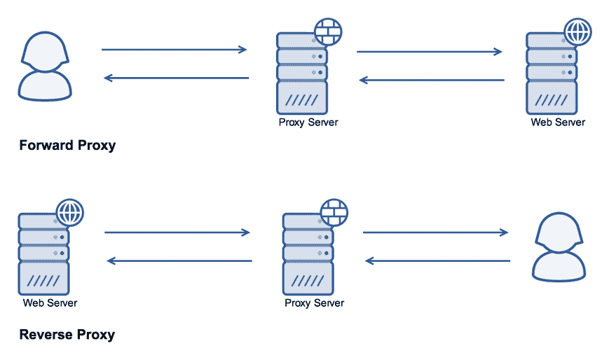
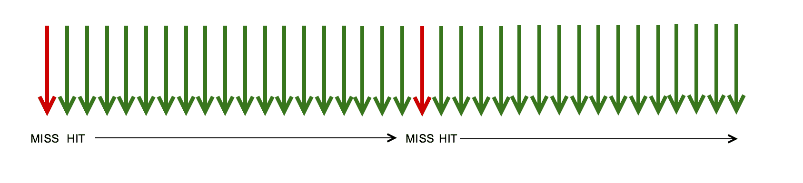
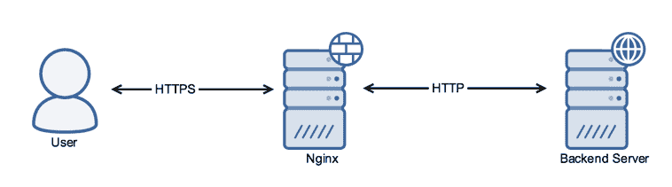

# 反向代理

本章将介绍以下方案：

+   配置 NGINX 作为一个简单的反向代理

+   使用 NGINX 进行内容缓存

+   监控缓存状态

+   微缓存

+   当后端系统不可用时，从缓存中提供服务

+   SSL 终结代理

+   限流

# 介绍

NGINX 最强大的功能之一就是它能够作为反向代理。与客户端和互联网之间的正向代理不同，反向代理位于服务器和互联网之间。

这是一个可视化示意图：



反向代理可以提供多种功能。它可以负载均衡请求，缓存内容，限流，提供 **Web 应用防火墙**（**WAF**）接口，等等。基本上，通过让系统经过一个高级反向代理，你可以大大增加系统的功能。

# 配置 NGINX 作为一个简单的反向代理

在这个方案中，我们将查看简单反向代理场景的基本配置。如果你已经阅读了前几章，你会发现这就是 NGINX 在 PHP-FPM 前的配置方式，差不多是一样的。

# 准备工作

在你配置 NGINX 之前，你首先需要确保你的应用程序监听的端口不是 `80`，并且最好是在 `loopback` 接口上，以确保它能够有效避免直接访问。

# 如何操作...

这是我们的 `server` 块指令，用来将所有请求代理到本地的 `8000` 端口：

```
server { 
    listen       80; 
    server_name  proxy.nginxcookbook.com; 
    access_log  /var/log/nginx/proxy-access.log  combined; 

    location / { 
        proxy_pass http://127.0.0.1:8000; 
    } 
} 
```

# 它是如何工作的...

对于所有请求，`location` 块指令将所有连接代理到指定的地址（此实例为 `127.0.0.1:8000`）。在基本配置下，NGINX 不会修改任何数据，也不会缓存或进行负载均衡。在转向复杂配置之前，使用基本代理方法进行测试总是一个好步骤，以确保你的应用程序或程序能按预期工作。

为了避免缓存私人信息（从而可能导致信息泄漏），NGINX 会检查 Cookies 和缓存头。例如，当你登录到 WordPress 系统时，这次登录会返回一个 `Set-Cookie` 头，因此 NGINX 会排除缓存该请求。

# 还有更多...

使用反向代理时要注意的一点是，返回给你应用程序的头部将基于代理的 IP。这里有两个选择。第一个是使用 NGINX 的日志作为报告的权威来源。第二个是修改头部，以便将正确的 IP 传递给应用程序。以下是我们更新后的块指令：

```
server { 
    listen       80; 
    server_name  proxy.nginxcookbook.com; 
    access_log  /var/log/nginx/proxy-access.log  combined; 

    location / { 
        proxy_pass http://127.0.0.1:8000; 
        proxy_set_header X-Forwarded-For 
         $proxy_add_x_forwarded_for;                 
        proxy_set_header X-Real-IP  $remote_addr; 
        proxy_set_header Host $host; 
    } 
} 
```

`X-Forwarded-For` 头部显示了完整的服务器链，这些服务器可能是多个转发代理。正因如此，我们还需要 `X-Real-IP`，以确保我们获得客户端的真实 IP 地址。

为了确保上游主机名能传递，我们设置了 `Host` 头字段。这使得上游服务器可以基于名称，并允许多个主机（即多个网站）在一个配置或一个服务器下进行代理。

# 参见

+   官方 NGINX 代理帮助：[`nginx.org/en/docs/http/ngx_http_proxy_module.html`](http://nginx.org/en/docs/http/ngx_http_proxy_module.html)

+   NGINX 代理指南：[`www.nginx.com/resources/admin-guide/reverse-proxy/`](https://www.nginx.com/resources/admin-guide/reverse-proxy/)

# 使用 NGINX 进行内容缓存

除了简单地将数据代理通过外，我们还可以使用 NGINX 来缓存代理的内容。通过这样做，我们可以减少对后端服务的调用，前提是这些调用可以被缓存。

# 准备工作

由于缓存是 NGINX 平台的标准部分，因此不需要额外的先决条件。

# 如何实现...

为了启用缓存，首先需要定义存储缓存文件的位置。此设置需要放在 `server` 块指令之外，最好存储在主 `nginx.conf` 文件中。所需的指令如下：

```
proxy_cache_path /var/cache/nginx levels=1:2 keys_zone=cache:2m 
```

确保你创建了该目录并且 NGINX 拥有写入权限。

然后，我们可以创建一个块指令来使用这个缓存：

```
server { 
    listen       80; 
    server_name  cached.nginxcookbook.com; 
    access_log  /var/log/nginx/cache-access.log  combined; 

    location / { 
        proxy_pass http://localhost:8080; 
        proxy_cache cache; 
        proxy_set_header X-Real-IP  $remote_addr; 
        proxy_set_header X-Forwarded-For $remote_addr; 
        proxy_set_header Host $host; 
    } 
} 
```

# 它是如何工作的...

首先，`proxy_cache_path` 指令的第一个参数是缓存文件的位置。你可以选择任何符合服务器结构的目录，但请确保服务器上的 NGINX 用户具有写入权限。

`levels` 参数指定缓存如何写入系统。在我们的示例中，我们指定了 `1:2`。这意味着文件将存储在二级层次结构中。之所以可以配置这个，是因为当单个目录中有成千上万的文件时，可能会导致性能下降。设置两级结构是确保这个问题永远不会出现的好方法。

第三个参数 `keys_zone` 分配内存用于存储缓存内容的元数据。与其进行可能消耗系统资源的调用来检查文件是否存在，NGINX 将映射文件并使用内存中的元数据进行跟踪。在我们的示例中，我们分配了 2 MB，这应该足够存储最多 16,000 条记录。

# 还有更多...

尽管从性能角度来看将缓存写入磁盘似乎是违背直觉的，但你需要考虑到 Linux 内核会将文件访问缓存到内存中。只要有足够的空闲内存，文件会被读取一次，然后每次后续的调用都会直接从 RAM 中获取。虽然这可能会占用比标准配置更多的内存，但一个典型的网站总内存仅为 64 MB，这在现代标准下是微不足道的。

将缓存存储在磁盘上意味着它也能在 NGINX 重启或重启后保持持久性。服务器冷启动时的最大问题之一就是在缓存被加热之前系统的负载。如果您需要确保从磁盘加载缓存文件的速度尽可能快，建议将缓存存储在高速 **固态硬盘**（**SSD**）上。

# 另见

NGINX 缓存指南：[`www.nginx.com/blog/nginx-caching-guide/`](https://www.nginx.com/blog/nginx-caching-guide/)

# 监控缓存状态

在开发复杂的网站或快速变化的内容时，一个关键方面是监控内容的来源。基本上，我们需要知道是命中了缓存，还是未命中缓存。

这帮助我们确保，如果出现问题或看到不正确的内容时，我们知道该去哪里查找。它还可以用于确保缓存按预期工作，在应绕过缓存的区域不被缓存。

# 准备就绪

由于缓存是标准 NGINX 平台的一部分，因此不需要额外的前置条件。

# 如何实现...

最简单的方法之一是简单地添加一个额外的头部。为此，我们在现有的 `location` 配置块指令中添加额外的指令：

```
proxy_set_header X-Cache-Status $upstream_cache_status; 
```

# 它是如何工作的...

NGINX 会在内部跟踪请求的状态（`$upstream_cache_status`），因此通过将其作为头部暴露，我们现在可以从客户端看到它。如果我们使用 Google 开发者工具或类似的工具，如 `httpstat` 来查看头部信息，您应该会看到类似如下的输出：

```
httpstat http://proxy.nginxcookbook.com/ 

HTTP/1.1 200 OK 
Server: nginx/1.11.2 
Date: Sun, 09 Oct 2016 12:18:54 GMT 
Content-Type: text/html; charset=UTF-8 
Transfer-Encoding: chunked 
Connection: keep-alive 
Vary: Accept-Encoding 
X-Powered-By: PHP/7.0.12 
X-Cache-Status: HIT 
```

我们可以通过 `X-Cache-Status` 头部看到请求是命中缓存，意味着它是从缓存中提供的，而不是从后端服务器提供的。除了基本的命中（hit）和未命中（miss）外，还有一些其他状态可能会被返回：

| **状态** | **含义** |
| --- | --- |
| `HIT` | 请求是命中缓存的，因此是从缓存中提供的 |
| `MISS` | 请求未在缓存中找到，因此必须从后端服务器请求 |
| `BYPASS` | 请求来自后端服务器，因为明确指示 NGINX 绕过该请求的缓存 |
| `EXPIRED` | 请求在缓存中已过期，因此 NGINX 必须从后端服务器获取新副本 |
| `STALE` | NGINX 无法与后端服务器通信，但已被指示提供过期内容 |
| `UPDATING` | NGINX 当前正在等待来自后端服务器的更新副本，但也已被告知在此期间提供过期内容 |
| `REVALUATED` | 这依赖于启用 `proxy_cache_revalidate`，并检查来自后端服务器的缓存控制头部，以确定内容是否已过期 |

# 另见

+   NGINX HTTP 上游变量：[`nginx.org/en/docs/http/ngx_http_upstream_module.html#variables`](http://nginx.org/en/docs/http/ngx_http_upstream_module.html#variables)

+   `httpstat` 工具：[`github.com/reorx/httpstat`](https://github.com/reorx/httpstat)

# 微缓存

缓存是加速性能的好方法，但在某些情况下，你可能会不断使内容失效（这意味着你需要更多的服务器资源）或提供过期的内容。这两种情况都不理想，但有一种简单的方法可以在性能和功能之间找到良好的折中。

通过微缓存，你可以将超时时间设置为低至一秒。虽然这听起来不算很多，但如果你运行的是一个热门网站，那么每秒尝试动态处理 50 多个请求很容易就会让服务器崩溃。相反，微缓存将确保大部分请求（也就是 50 个请求中的 49 个）直接从缓存中提供，且缓存数据的年龄仅为 1 秒。

# 准备工作

由于缓存是标准 NGINX 平台的一部分，因此不需要额外的前提条件。

# 如何操作...

为了利用微缓存，我们在之前的方案基础上进行了扩展，减少缓存的超时时间。

```
server { 
    listen       80; 
    server_name  micro.nginxcookbook.com; 

    access_log  /var/log/nginx/micro-access.log  combined; 

    location / { 
        proxy_pass http://127.0.0.1:8080; 
        proxy_cache micro; 
        proxy_cache_valid 200 10s; 
        proxy_set_header X-Real-IP  $remote_addr; 
        proxy_set_header X-Forwarded-For $remote_addr; 
        proxy_set_header Host $host; 
    } 
} 
```

当你首次看到时，1 秒的超时似乎不会带来任何帮助。对于一个繁忙的网站，减少必须访问后台服务器的请求数量可以显著减少。而且这也意味着你的网站的突发能力大大增强，使你能够在流量激增时轻松应对。

如下图所示，**每秒请求数**（**RPS**）越高，微缓存提供的优势越大：



# 它是如何工作的...

我们设置`proxy_cache_valid`指令来缓存`200`响应，并将其有效期设置为 1 秒（`1s`）。

验证值可以设置为你最小的内容刷新间隔。如果你需要即时生效的变化，可以使用 1 秒的超时来验证。如果更新不那么频繁，那么为许多网站设置 10 到 20 秒的超时也是可以接受的。

`200`的 HTTP 响应码表示 OK 响应，意味着这是来自服务器的成功响应。我们也可以缓存`404`请求（未找到），尤其是考虑到其中一些请求可能涉及数据库查询，消耗的资源较多。

# 当后台服务器宕机时从缓存中提供服务

虽然我们不希望看到你的后台服务器出现宕机的情况，但期望保持 100%的正常运行时间显然不现实。无论是意外的还是计划中的升级，能够在后台服务器不可用时继续提供内容是一个非常有用的功能。

使用 NGINX 时，当无法连接到后台服务器时，我们可以让其提供过期的缓存数据。在大多数情况下，提供稍微过期的页面比返回`502` HTTP 错误（错误网关）要好得多。

# 准备工作

由于缓存是标准 NGINX 平台的一部分，因此不需要额外的前提条件。

# 如何操作...

基于我们之前的方案，我们在现有的代理设置上添加了一个额外的指令：

```
server { 
    listen       80; 
    server_name  proxystale.nginxcookbook.com; 
    access_log  /var/log/nginx/proxy-access.log  combined; 

    location / { 
        proxy_pass http://127.0.0.1:8000; 
        proxy_set_header X-Real-IP  $remote_addr; 
        proxy_set_header X-Forwarded-For $remote_addr; 
        proxy_set_header Host $host; 
        proxy_cache_use_stale error timeout http_500 http_502 
         http_503 http_504; 
    } 
} 
```

# 它是如何工作的...

使用`proxy_cache_use_stale`指令时，我们可以指定在哪些情况下使用过期的缓存副本。对于这个方法，我们指定了当后端服务器出现错误、超时、`500`（内部服务器错误）、`502`（错误网关）、`503`（服务不可用）和`504`（网关超时）错误时，可以使用过期的缓存副本。

如果出现这些情况，我们会选择较不突兀的方式来提供内容。特别是，如果你设置了较短的缓存时间（如微缓存），网站的用户甚至不会察觉到差异。

# 还有更多…

你不希望做的事之一是，当你的后端系统重新上线时，排队数千个请求。对于一个繁忙的网站，系统一旦恢复可用，立刻就有可能被压垮。尤其是因为大更新或重启通常意味着后端的本地对象缓存也会变冷，因此在恢复上线时需要格外小心。

NGINX 有一个很棒的功能，可以锁定缓存，确保每个唯一的键只会发送一个请求。以下是更新的配置，用于启用此锁定：

```
location / { 
        proxy_pass http://www.verifiedparts.com:80; 
        proxy_set_header X-Real-IP  $remote_addr; 
        proxy_set_header X-Forwarded-For $remote_addr; 
        proxy_set_header X-Cached $upstream_cache_status; 
        proxy_set_header Host www.verifiedparts.com; 
        proxy_cache_use_stale error updating timeout http_500 http_502 
        http_503 http_504; 
        proxy_cache_lock on; 
        proxy_cache_lock_timeout 60s; 
    }  
```

`proxy_cache_lock`指令确保只有一个请求（如果出现缓存`MISS`）会被发送到后端/上游服务器。所有其他请求要么从缓存中提供（如果使用此方法，可能是过期的），直到超时指令（`proxy_cache_lock_timeout`）被触发，如果缓存状态仍为`MISS`，则会再次尝试。超时值需要足够长，以便让后端准备好提供页面；对于一些基于.NET 或 Java 的系统，这个值可能高达 120 秒。

这种组合大大减少了冷启动后的后端峰值影响，帮助避免系统被压垮。通过确保每个 URI 只允许一个请求发送到后端，我们确保它有足够的时间在缓存重新加热时正确处理请求。

# 另见

+   代理模块：[`nginx.org/en/docs/http/ngx_http_proxy_module.html#proxy_cache_use_stale`](http://nginx.org/en/docs/http/ngx_http_proxy_module.html#proxy_cache_use_stale)

+   缓存锁文档：[`nginx.org/en/docs/http/ngx_http_proxy_module.html#proxy_cache_lock`](http://nginx.org/en/docs/http/ngx_http_proxy_module.html#proxy_cache_lock)

# SSL 终端代理

我最初尝试 NGINX 的用例之一就是作为一个 SSL 终端代理。如果你有一个应用程序无法直接生成 HTTPS（加密）输出，你可以使用 NGINX 作为代理来实现。内容以明文形式从后端提供，然后 NGINX 与浏览器之间的连接会被加密。为了更好地解释，以下是涵盖这一场景的示意图：



其优点在于，你还能利用 NGINX 的其他功能集，特别是在缓存方面。事实上，如果你使用过 Cloudflare 服务来实现类似的效果，那么你可能会惊讶地发现它也是基于 NGINX 的。

# 准备工作

本方案涉及使用 SSL 证书。如果您当前还没有为部署生成证书，请参考第四章，*关于 SSL 的一切*，了解相关提示和技巧。

# 如何操作...

与我们之前的一些方案类似，我们使用 NGINX 来结合 SSL 加密和代理组件：

```
server { 
    listen              443 ssl; 
    server_name         ssl.nginxcookbook.com; 
    ssl_certificate     /etc/ssl/public.pem; 
    ssl_certificate_key /etc/ssl/private.key; 
    ssl_protocols       TLSv1 TLSv1.1 TLSv1.2; 
    ssl_ciphers         HIGH:!aNULL:!MD5; 

    access_log  /var/log/nginx/ssl-access.log  combined; 

    location / { 
        proxy_pass http://localhost:8000; 
        proxy_set_header X-Real-IP  $remote_addr; 
        proxy_set_header X-Forwarded-For $remote_addr; 
        proxy_set_header Host $host; 
    } 
} 
```

以下是一些有用的提示，您应该牢记：

+   有一点需要注意的是，大多数 SSL 证书仅对单一域名有效，除非它们是通配符证书或 **主题备用名称**（**SAN**）。如果您打算将 NGINX 用作多个主机的 SSL 终止器，您需要为每个主机设置 `server` 块或为其映射 SAN 证书。

+   小心应用程序中的内部重定向，尤其是在强制执行 HTTPS 时。当使用 NGINX 进行 SSL 终止时，这需要在 NGINX 层面完成，以避免重定向循环。

# 另见

NGINX SSL 终止指南：[`www.nginx.com/resources/admin-guide/nginx-ssl-termination/`](https://www.nginx.com/resources/admin-guide/nginx-ssl-termination/)

# 速率限制

如果您有一个包含登录的应用程序或网站，或者希望确保不同客户端之间的公平使用，速率限制可以帮助保护您的系统免于过载。

通过限制请求的数量（每个 IP 使用 NGINX 进行限制），我们降低了系统的峰值资源使用，同时也限制了试图暴力破解身份验证系统的攻击效果。

# 如何操作...

请按照以下步骤进行速率限制：

1.  首先，我们需要定义一个共享内存空间，用于跟踪 IP 地址。这需要在主配置文件中添加，位于标准 `server` 块指令之外。以下是我们的代码：

```
      limit_req_zone $binary_remote_addr zone=basiclimit:10m rate=10r/s; 
```

1.  然后，在 `server` 块中，您可以设置希望限制的访问位置。以下是我们的 `server` 块指令：

```
      server { 
          listen       80; 
          server_name  limit.nginxcookbook.com; 
          access_log  /var/log/nginx/limit-access.log  combined; 

          location / { 
              limit_req zone=basiclimit burst=5; 
              proxy_pass http://127.0.0.1:8000; 
              proxy_set_header X-Forwarded-For 
               $proxy_add_x_forwarded_for;                 
              proxy_set_header X-Real-IP  $remote_addr; 
              proxy_set_header Host $host; 
          } 
      } 
```

1.  我们可以在不同的场景下运行 Apache Benchmark（一种简单的 Web 性能基准测试工具）来测试其有效性。第一个测试是使用单个连接并进行 200 次请求：

```
      ab -c 1 -n 200 http://limit.nginxcookbook.com/
```

这给我们带来了以下结果：

```
      Concurrency Level:      1
      Time taken for tests:   20.048 seconds
      Complete requests:      200
      Failed requests:        0
      Total transferred:      5535400 bytes
      HTML transferred:       5464000 bytes 
      Requests per second:    9.98 [#/sec] (mean) 
      Time per request:       100.240 [ms] (mean) 
      Time per request:       100.240 [ms] (mean, across all concurrent 
      requests) 
      Transfer rate:          269.64 [Kbytes/sec] received 
```

如结果所示，我们没有收到任何错误，平均每秒请求 9.98 次。

1.  在下一个测试中，我们将同时增加并发请求的数量，设置为 `4` 次：

```
      ab -c 4 -n 200 http://limit.nginxcookbook.com/
```

这给我们带来了以下结果：

```
      Concurrency Level:      4 
      Time taken for tests:   20.012 seconds 
      Complete requests:      200 
      Failed requests:        0 
      Total transferred:      5535400 bytes 
      HTML transferred:       5464000 bytes 
      Requests per second:    9.99 [#/sec] (mean) 
      Time per request:       400.240 [ms] (mean) 
      Time per request:       100.060 [ms] (mean, across all concurrent 
      requests) 
      Transfer rate:          270.12 [Kbytes/sec] received 
```

即使请求速率增加，我们仍然以每秒 10 次请求的速度接收到响应。

# 工作原理...

这个方案有几个方面需要考虑。第一个是主 NGINX 配置文件中的 `limit_req_zone` 指令。我们可以创建多个区域来跟踪，并根据不同的跟踪参数进行区分。在我们的方案中，我们使用 `$binary_remote_addr` 来跟踪远程 IP 地址。第二个参数是区域的名称和分配的内存。我们将该区域命名为 `basiclimit`，并为其分配了 10 MB 内存，这足以跟踪最多 160,000 个 IP 地址。第三个参数是速率，我们将其设置为每秒 10 次请求（`10r/s`）。

如果你需要为不同的部分设置不同的速率限制（例如，为管理员登录区域设置较低的速率限制），你可以定义多个具有不同名称的区域。

为了使用这个区域，我们将它添加到现有的某个 location 指令中，使用 `limit_req`。在我们的方案中，我们指定了我们创建的区域（`basiclimit`），并且为它设置了 `5` 的突发能力。这个突发能力允许在返回错误之前有一个小的缓冲区，帮助平滑响应。

# 还有更多...

软延迟是一种很好地处理速率限制的方式，它对大多数用户的影响最小。然而，如果你正在运行基于 API 的服务，并希望确保请求的应用程序能够收到任何达到限制的请求通知，你可以将 `nodelay` 参数添加到 `limit_req` 指令中。考虑这个示例：

```
limit_req zone=basiclimit burst=5 nodelay; 
```

与排队连接不同，它们会立即返回一个 503（服务不可用）HTTP 错误。如果我们重新运行相同的初始 Apache Benchmark 调用（即使只使用一个连接），我们现在会看到以下情况：

```
Concurrency Level:      1 
Time taken for tests:   4.306 seconds 
Complete requests:      200 
Failed requests:        152 
   (Connect: 0, Receive: 0, Length: 152, Exceptions: 0) 
Non-2xx responses:      152 
Total transferred:      1387016 bytes 
HTML transferred:       1343736 bytes 
Requests per second:    46.45 [#/sec] (mean) 
Time per request:       21.529 [ms] (mean) 
Time per request:       21.529 [ms] (mean, across all concurrent requests) 
Transfer rate:          314.58 [Kbytes/sec] received 
```

并非所有请求都返回了 `200` 状态码，相反，任何超出限制的请求都会立即收到 `503` 错误。这就是为什么我们的基准测试只显示每秒 46 个成功请求，因为其中 152 个是 `503` 错误。

# 另见

NGINX `ngx_http_limit_req_module`：[`nginx.org/en/docs/http/ngx_http_limit_req_module.html`](http://nginx.org/en/docs/http/ngx_http_limit_req_module.html)
