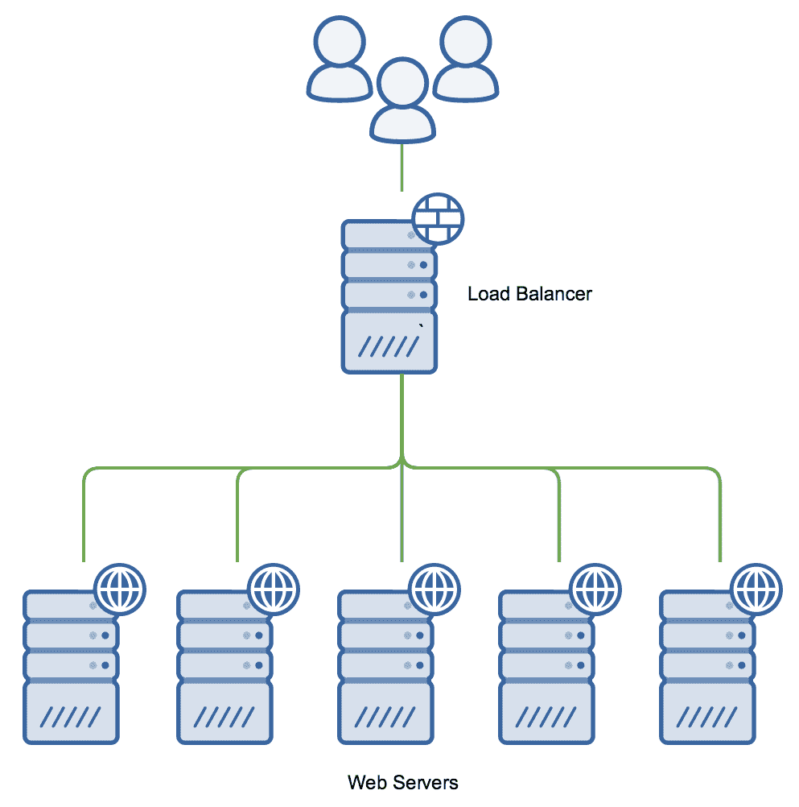
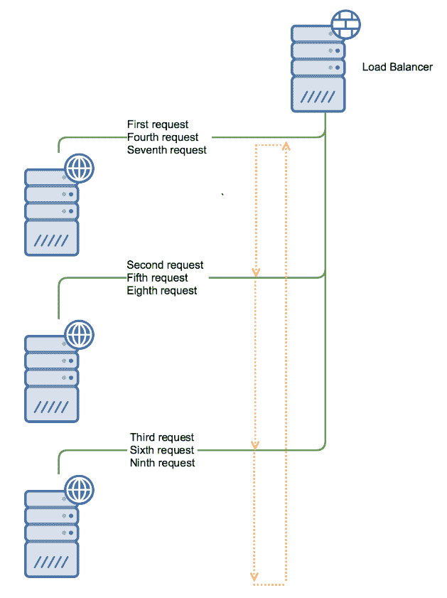
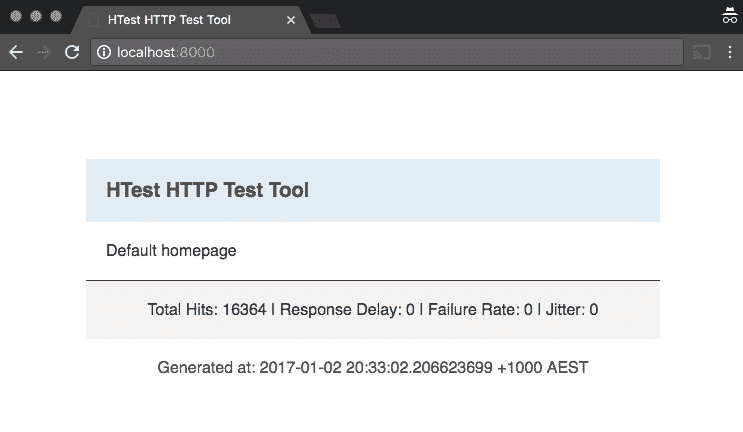
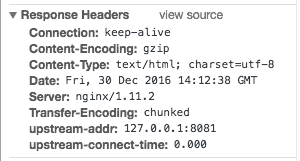
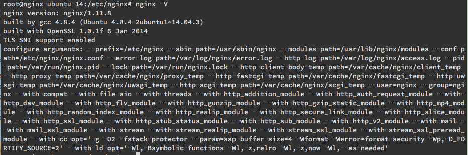
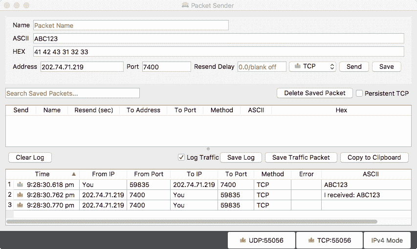
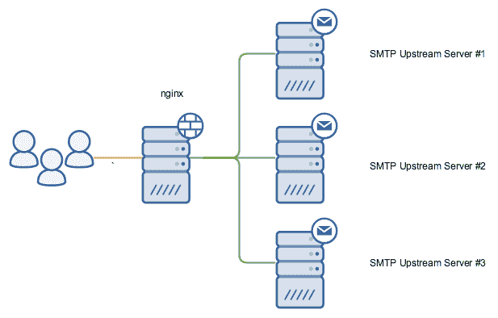

# 负载均衡

在本章中，我们将涵盖以下内容：

+   基本负载均衡技术

+   轮询负载均衡

+   最少连接负载均衡

+   基于哈希的负载均衡

+   测试和调试 NGINX 负载均衡

+   TCP / 应用程序负载均衡

+   NGINX 作为 SMTP 负载均衡器

# 介绍

负载均衡的主要作用有两个——提供更高的容错能力和分配负载。通过将传入请求分发到一个或多个后端服务器，从而实现多个服务器的联合输出。由于大多数负载均衡器配置通常作为反向代理配置（如前一章所述），这使得 NGINX 成为一个非常好的选择。

通过增加容错能力，你可以确保网站或应用程序的可靠性和正常运行时间。在像 Google 或 Facebook 这样的领域中，几秒钟的停机时间可能会造成混乱，负载均衡器是它们业务的关键部分。同样，如果你遇到 Web 服务器偶尔出现问题，或者希望在不让网站宕机的情况下进行维护，负载均衡器将大大增强你的设置。

负载均衡器的分布式负载侧允许你水平扩展网站或应用程序。这是一种比单纯增加硬件到单一服务器更容易的扩展方式，尤其是在高并发的情况下。使用负载均衡器，我们可以轻松增加服务器的数量，如下图所示：



通过正确的配置和监控，你还可以动态地添加或移除这些 Web 服务器。这就是许多人所说的**弹性计算**，资源可以自动化配置。当正确实施时，它可以节省成本，同时确保你能够处理高峰负载而不出现问题。

当然，这里有一些注意事项。第一个是你的应用程序或网站必须能够以分布式方式运行。由于你的 Web 服务器默认没有集中式文件系统，文件上传必须以所有服务器仍然能够访问的方式进行处理。你可以使用集群文件系统来实现这一点（例如，GlusterFS），或者使用集中式对象或文件存储系统，例如 AWS S3。

你的数据库也需要能够被所有 Web 服务器访问。如果用户登录到你的系统，你还需要确保会话追踪使用数据库，以便它能被所有服务器访问。

然而幸运的是，如果你使用的是现代框架（正如我们在第三章中讨论的，*常见框架*）或现代的**内容管理系统**（**CMS**），那么这些方面已经被实现并记录下来。

# 基本负载均衡技术

NGINX 支持的三种调度算法是轮询、最少连接和哈希。

以**轮询**方式配置的负载均衡器会按顺序将请求分配到各个服务器；第一个请求分配给第一个服务器，第二个请求分配给第二个服务器，依此类推。这将一直重复，直到池中的每台服务器都处理了一个请求，接下来的请求将再次从顶部开始。下图解释了轮询调度算法：



这是实现起来最简单的方法，它有正反两面。正面是服务器端无需配置，反面是无法检查服务器的负载以平衡请求。

当配置为使用**最少连接数**负载均衡方法时，NGINX 会将请求分配给活动连接最少的服务器。这提供了一个非常基础的基于负载的分配方式；然而，它是基于连接数，而非实际的服务器负载。

这种方法可能并不总是最有效的，尤其是在某个特定的服务器由于高资源负载或内部问题而连接数最少时。

NGINX 支持的第三种方法是**哈希**方法。它使用一个键来决定如何将请求映射到某个上游服务器。通常，这个键是客户端的 IP 地址，这样可以确保每次请求都映射到同一个上游服务器。

如果您的应用程序不使用任何形式的集中式会话跟踪，那么这就是使负载均衡更兼容的一种方式。

# 轮询负载均衡

# 准备工作

要测试负载均衡，您需要能够运行多个版本的应用程序，每个应用程序运行在不同的端口上。

# 如何操作...

我们将从一个基本的轮询配置开始，我们的上游服务器来自本地。我们将在`http`块级别定义`upstream`块指令，位于`server`块之外：

```
upstream localapp { 
    server 127.0.0.1:8080; 
    server 127.0.0.1:8081; 
    server 127.0.0.1:8082; 
}  
```

然后，我们将定义我们的`server`块指令：

```
server { 
    listen       80; 
    server_name  load.nginxcookbook.com; 
    access_log  /var/log/nginx/load-access.log  combined; 
    location / { 
        proxy_pass http://localapp; 
    } 
}  
```

# 它是如何工作的...

在我们的`upstream`块指令中，我们定义了服务器和后端服务器的名称。在我们的配置中，我们简单地将这些定义为三个本地端口`8080`、`8081`和`8082`上的实例。在许多场景中，这些也可以是外部服务器（以便水平平衡资源）。

在我们的`server`块指令中，我们不再像前面的配置那样直接连接到本地应用程序，而是连接到我们命名为`localapp`的上游指令。

由于我们没有指定用于负载均衡的算法，NGINX 默认使用轮询配置。每个请求按顺序加载，直到某个服务器未响应。

# 还有更多...

此外，您还可以对服务器进行加权，这意味着优先选择权重更高的上游服务器。如果您的服务器配置不同，您可以使用加权来偏向容量较大的系统，以便它们接收更多的请求。考虑以下示例：

```
upstream localapp { 
    server 127.0.0.1:8080 weight=2; 
    server 127.0.0.1:8081; 
    server 127.0.0.1:8082; 
}  
```

由于我们将第一个服务器的权重设置为 `2`，它将比其他服务器接收两倍的请求。

# 另请参见

NGINX upstream 模块：[`nginx.org/en/docs/http/ngx_http_upstream_module.html`](http://nginx.org/en/docs/http/ngx_http_upstream_module.html)

# 最少连接负载均衡

虽然默认的负载均衡算法是轮询，但它并没有考虑服务器负载或响应时间。使用 **最少连接** 方法时，我们将连接分配给具有最少活跃连接的上游服务器。

# 准备工作

要测试负载均衡，您需要能够运行多个版本的应用程序，每个版本监听不同的端口。

# 如何操作...

`upstream` 块指令与轮询配置完全相同，不同之处在于我们现在明确告诉 NGINX 使用最少连接方法——记住，这需要保持在 `server` 块指令之外。以下是我们的 `upstream` 块：

```
upstream localapp { 
    least_conn; 

    server 127.0.0.1:8080; 
    server 127.0.0.1:8081; 
    server 127.0.0.1:8082; 
} 
```

然后，我们将定义 `server` 块指令：

```
server { 
    listen       80; 
    server_name  load.nginxcookbook.com; 
    access_log  /var/log/nginx/load-access.log  combined; 
    location / { 
        proxy_pass http://localapp; 
    } 
} 
```

# 它是如何工作的...

与轮询配置一样，我们定义了三个上游服务器，名称为 `localapp`。在此配置中，我们明确告诉 NGINX 使用 `least_conn` 方法进行负载均衡。

每当有新请求到来时，NGINX 会判断哪个上游服务器的连接最少，并将请求定向到该服务器。

# 基于哈希的负载均衡

当您需要确保哈希负载均衡是最佳选择时，通常会使用客户端的 IP 地址作为匹配模式，这样就可以确保与 Cookies 和每个上游服务器会话的跟踪是粘性的。这意味着，来自相同哈希的每个后续请求将始终路由到相同的上游服务器（除非上游服务器发生故障）。

# 如何操作...

`upstream` 块指令与轮询配置完全相同，不同之处在于我们现在明确告诉 NGINX 使用哈希方法——记住，这需要保持在 `server` 块指令之外。以下是我们的 `upstream` 块：

```
upstream localapp { 
    hash $remote_addr consistent; 
    server 127.0.0.1:8080; 
    server 127.0.0.1:8081; 
    server 127.0.0.1:8082; 
} 
```

然后，我们将定义 `server` 块指令：

```
server { 
    listen       80; 
    server_name  load.nginxcookbook.com; 
    access_log  /var/log/nginx/load-access.log  combined; 
    location / { 
        proxy_pass http://localapp; 
    } 
} 
```

# 它是如何工作的...

对于此哈希方法，我们使用客户端 IP (`$remote_addr`) 作为确定因素来构建哈希映射。

哈希行末尾的 `consistent` 参数实现了 Ketama 一致性哈希方法，该方法有助于最小化重新映射的数量（因此也减少潜在的中断或缓存丢失），如果您需要从 `upstream` 块指令中添加或移除服务器。如果您的上游服务器保持不变，则可以省略此参数。

# 还有更多内容...

对于曾使用过旧版本 NGINX 的用户，`ip_hash` 方法仍然可用，但有一个明显的区别。`ip_hash` 方法使用 IPv4 地址的前三个八位字节（例如，`1.2.3.XXX`）来生成哈希映射。这意味着，如果请求的 IP 地址来自同一标准 C 类网络范围内的其他 IP，它将被定向到同一个上游服务器。以下是实现方式的示例：

```
upstream localapp { 
    ip_hash; 
    server 127.0.0.1:8080; 
    server 127.0.0.1:8081; 
    server 127.0.0.1:8082; 
}  
```

尽管这种方法仍然有效，但如果你需要更好的一致性来进行 ip_hash 映射，则可以使用 `hash $remote_addr` 来匹配完整的 IP 地址。

# 另见

+   一致性哈希的 Wikipedia 页面：[`en.wikipedia.org/wiki/Consistent_hashing`](https://en.wikipedia.org/wiki/Consistent_hashing)

+   `hash` 指令文档：[`nginx.org/en/docs/http/ngx_http_upstream_module.html#hash`](http://nginx.org/en/docs/http/ngx_http_upstream_module.html#hash)

# 测试和调试 NGINX 负载均衡

由于负载均衡可能会为环境引入额外的复杂性，因此确保能够彻底测试你的设置非常重要。特别是当你在调试边缘案例时，能够构建测试平台对重现故障或问题至关重要。

理想情况下，你希望这与实时度量相结合，特别是当你希望能够将其与上游服务器的数据叠加时。正如我们在第十三章中讨论的，*NGINX Plus – 商业版*，NGINX 的商业版包含一个实时监控模块，可以提供当前连接数、上游服务器状态和负载信息等数据。

尽管有很多程序和云服务可以生成负载来从客户端角度测试负载均衡器，但我没有找到很多工具能提供测试实例来模拟问题的上游部分。因此，像任何程序员一样，我干脆写了自己的工具！

HTest 是一个开源工具，用于模拟不同条件下的 Web 服务器。它是用 Go 编写的，因此能够充分利用 Go 的高并发和优化特性；HTest 在非常普通的硬件上也能处理每秒超过 150,000 个请求。

与其仅提供静态页面，HTest 允许你变化响应时间（以模拟典型应用程序的响应）、故障率（其中一部分响应返回 `500` 错误），并且还能加入一些抖动，使得结果更具真实感。

# 准备工作

这个食谱不需要任何前置步骤。

# 如何实现...

下载最新的 HTest 可执行文件（可以在 GitHub 页面中的发布部分找到）后，你只需运行 HTest 即可：

```
./htest  
```

默认情况下，HTest 将在 `127.0.0.1` 的 `8000` 端口监听，并准备好接收请求。它有一个基本的网页，作为结果的一部分返回，页面内容如下所示：



每当请求到达时，命中计数器将增加，如果设置了延迟、失败或抖动的标志，这些信息也会显示出来。

我们可以很容易地在不同端口上启动 HTest，这在对单台服务器的负载均衡器进行测试时是必需的：

```
./htest -port 8001  
```

响应延迟等详细信息可以通过两种方式设置。如果您希望以延迟启动 HTest，也可以通过命令行标志来完成：

```
./htest -responsedelay 20  
```

此值以**毫秒**（**ms**）为单位。或者，我们也可以通过简单的 cURL 调用在程序启动后设置延迟：

```
curl http://localhost:8000/svar/?responsedelay=10  
```

这样做的好处在于可以编写脚本，从而拥有分步测试流程，或者您可以手动更改来测量它对整体负载均衡器配置的影响。以下是配置项的完整参考表：

| **字段** | **值** | **示例** |
| --- | --- | --- |
| `responsedelay` | 延迟时间（毫秒） | 10 |
| `failurerate` | 请求失败率（百分比） | 5 |
| `jitter` | 结果的方差（百分比） | 2 |

# 还有更多内容...

为了进一步帮助追踪和测试负载均衡器配置，我们可以为测试添加一些额外的头部信息。这样，我们就能看到更多信息，了解哪个上游服务器处理了请求，以及花费了多长时间。以下是我为测试添加的额外头部：

```
add_header upstream-addr $upstream_addr; 
add_header upstream-connect-time $upstream_connect_time; 
```

如果这是一个生产系统，您只能在设置了条件标志时启用此功能，正如我们在第五章中详细说明的，*日志记录*。

这使我们能够看到哪个上游服务器处理了我们的请求（`$upstream_addr`），以及连接到上游服务器花费了多长时间（`$upstream_connect_time`）。这有助于指示可能的连接延迟发生在哪儿，以及是来自哪个上游服务器。

如果您需要跟踪上游服务器的响应时间（返回数据所需的时间），这需要被记录下来，而不能作为头部设置。因为头部会在上游服务器的请求返回之前发送到浏览器，所以此时的时间仍然是未知的。

例如，以下是一个非常简单测试的结果：



由于这是基于我们之前的配方，我们可以看到连接已成功建立到本地端口`8081`上的服务器，并且由于服务器的负载非常低，所以没有出现连接延迟（`0.000`秒）。连接时间的增加可能表明负载均衡器端存在负载或网络问题，这通常很难诊断，因为人们通常会将问题归咎于上游服务器。

# 另见

HTest 仓库：[`github.com/timbutler/htest`](https://github.com/timbutler/htest)

# TCP / 应用负载均衡

虽然大多数人知道 NGINX 因其作为 Web 和代理服务器的出色表现，但大多数人并没有超出标准 Web 角色使用它。一些关键功能来自于 NGINX 在操作上的极大灵活性。随着 1.9 版本中引入了流模块，NGINX 现在也可以对 TCP 和 UDP 应用程序进行负载均衡。

这为负载均衡那些没有内部任务分配或无法扩展到多个服务器的应用程序开辟了可能性。

# 如何操作...

要使用 TCP 负载均衡，首先需要检查 NGINX 版本是否编译了流模块。你可以运行以下命令来执行此操作：

```
nginx -V  
```

这将生成一个输出，显示所有编译的模块。如果你在输出中看到`--with-stream`，则表示流模块可用。考虑这个例子：



如果你没有所需的版本，我们在第一章中介绍了如何安装更新版本，*让我们开始吧*。

接下来，我们需要定义一个`stream`块指令，它必须位于 HTTP 块指令之外，或者完全替代它。与之前的例子不同，虽然这些配置可以位于`/etc/nginx/conf.d/`目录内，但这个`stream`块需要放在主 NGINX 配置文件中（通常是`/etc/nginx/nginx.conf`），或者至少从那里包含，并且位于`http`块指令之外。以下是我们的配置：

```
stream { 
    upstream tcpapppool { 
        hash $remote_addr consistent; 
        server 127.0.0.1:8101; 
        server 127.0.0.1:8102; 
        server 127.0.0.1:8103; 
    } 

    server { 
        listen 7400; 
        proxy_pass tcpapppool; 
    } 
} 
```

# 它是如何工作的...

在我们的配置中，我们定义了一个`upstream`块，它与我们的 HTTP 负载均衡器配置几乎完全相同。我们还根据客户端的 IP `($remote_addr)`指定了一个哈希值，因为任何仅具有内部会话跟踪进行身份验证或类似功能的应用程序，如果建立新的连接，就需要对每个上游服务器进行重新身份验证。

在此配置中，我们指定了三个上游服务器，这些服务器实际上是在本地服务器上的回环接口。每个 TCP 应用程序实例都需要在`127.0.0.1`上监听端口`8101`、`8102`和`8103`。

我们的`server`块指令告诉 NGINX 监听`7400`端口。由于我们没有指定协议，它将默认使用 TCP。如果你需要 UDP，你需要将协议指定为参数。考虑这个例子：

```
listen 7400 udp; 
```

最后，我们配置了一个反向代理（`proxy_pass`），指向我们命名的上游配置`tcpapppool`。

# 简单测试

如果你需要一个帮助测试连接的应用程序，我推荐你尝试 Packet Sender。这个应用程序是免费的，跨平台的，允许你通过 GUI 和命令行接口发送和接收 UDP 和 TCP 数据。

这使得它在测试新配置时非常完美，特别是当你需要为负载均衡器提供目标，或者测试通过 NGINX 的连接时。以下是该 GUI 应用程序的界面：



如截图所示，我们快速发送了一个`ABC123`数据包到 NGINX 服务器，并从我们的上游应用（这是一个简单的回显应用）收到了`I received: ABC123`。

# 还有更多...

就像传统的基于 HTTP 的配置一样，我们还可以启用 TCP 负载均衡的访问日志。我们可以定制日志以适应特定应用程序，这可能包括如客户端 IP 地址、发送字节和接收字节等字段。

这需要 NGINX 版本 1.11.4 或更高版本。

要使用流日志，我们首先需要定义一种日志格式。这里是一个基本配置：

```
log_format basic '$remote_addr [$time_local] ' 
                 '$bytes_sent $bytes_received $session_time'; 
```

然后，我们将`access_log`指令添加到`server`块中：

```
server { 
    listen     7400; 
    access_log  /var/log/nginx/tcp-access.log  basic; 
    proxy_pass tcpapppool; 
} 
```

这种基本的日志格式会给我们一个如下的输出：

```
1.2.3.4 [28/Dec/2016:22:17:08 +1000] 18 6 0.001 
1.2.3.4 [28/Dec/216:22:17:08 +1000] 18 6 0.001 
1.2.3.4 [28/Dec/216:22:17:09 +1000] 18 6 0.000 
1.2.3.4 [28/Dec/216:22:17:09 +1000] 18 6 0.001 
```

我们可以看到来源 IP（`1.2.3.4`）、连接时间（12 月 28 日）、发送和接收的字节数，然后是总会话时间。如果需要更详细的信息（例如记录使用的上游服务器），则可以根据具体需求定制日志格式。

# 另见

+   NGINX 流模块文档：[`nginx.org/en/docs/stream/ngx_stream_core_module.html`](https://nginx.org/en/docs/stream/ngx_stream_core_module.html)

+   NGINX 流日志模块文档：[`nginx.org/en/docs/stream/ngx_stream_log_module.html`](https://nginx.org/en/docs/stream/ngx_stream_log_module.html)

+   数据包发送器：[`packetsender.com/`](https://packetsender.com/)

# NGINX 作为 SMTP 负载均衡器

正如我们之前的示例所演示的，NGINX 可以进行纯 TCP 负载均衡。除此之外，还有一些特定协议的实现，它们有一些特定项目来增强实现效果。

**简单邮件传输协议**（**SMTP**）是用于在服务器级别发送和接收电子邮件的标准协议。在 Linux 平台上，最流行的 SMTP 服务器包括 Postfix、Exim 和 Sendmail，而 Exchange 则是 Windows 平台上最受欢迎的选择。

SMTP 负载均衡可以帮助分担电子邮件的发送和接收，特别是在高流量环境中，比如**互联网服务提供商**（**ISP**）。通过运行多个服务器，您可以分配发送任务，并在系统出现问题时提供一些容错能力。

虽然 NGINX 有一个专门的邮件模块，但遗憾的是该模块没有负载均衡功能。好消息是，流模块足够灵活，可以与 SMTP 无缝配合使用。

# 如何操作...

我们将配置三个本地 SMTP 应用，这些应用将帮助分担负载。我们的配置如下所示：



因为这需要使用流模块，我们首先需要确认是否拥有正确版本的 NGINX。为此，我们运行以下命令：

```
nginx -V  
```

如果在输出中看到`--with-stream`，则说明您拥有所需的模块。否则，请首先按照第一章中的指示，*让我们开始吧*，安装更新版本。

然后，我们定义了我们的`stream`块指令，它必须位于根级别，而不能像本书中的大多数其他配方那样放在`http`块内。你需要将它添加到主 NGINX 配置文件中（通常是`/etc/nginx/nginx.conf`），或者至少包含来自这里的配置。

这是`stream`块指令：

```
stream { 
  upstream smtppool { 
      server 127.0.0.1:2501; 
      server 127.0.0.1:2502; 
      server 127.0.0.1:2503; 
  } 

log_format smtplog '$remote_addr $remote_port -> $server_port ' 
                 '[$time_local] $bytes_sent $bytes_received ' 
                 '$session_time ==> $upstream_addr'; 

  server { 
      listen 25; 
      proxy_pass smtppool; 
      access_log  /var/log/nginx/smtp-access.log smtplog; 
  } 
} 
```

# 它是如何工作的……

首先，我们定义了我们的`upstream`块指令，并将其命名为`smtppool`。这个指令内有三台服务器，它们与 NGINX 运行在同一台服务器上，因此监听`127.0.0.1`。在实际场景中，这些服务器会运行在外部服务器上，帮助分配负载。由于没有明确设置负载均衡方法，因此默认采用轮询方式。

接下来，我们定义了一个自定义日志格式，命名为`smtplog`。与前面配方中的简单格式相比，这次我们添加了对端口号以及使用的上游服务器的日志记录。

这是日志输出的示例：

```
1.2.3.4 64811 -> 26 [04/Jan/2017:23:43:00 +1000] 282 122 0.041 ==> 127.0.0.1:2501 
1.2.3.4 64812 -> 26 [04/Jan/2017:23:43:00 +1000] 282 122 0.039 ==> 127.0.0.1:2502 
1.2.3.4 64813 -> 26 [04/Jan/2017:23:43:00 +1000] 282 122 0.040 ==> 127.0.0.1:2503 
1.2.3.4 64814 -> 26 [04/Jan/2017:23:43:01 +1000] 282 122 0.037 ==> 127.0.0.1:2501 
1.2.3.4 64815 -> 26 [04/Jan/2017:23:43:01 +1000] 282 122 0.038 ==> 127.0.0.1:2502 
1.2.3.4 64816 -> 26 [04/Jan/2017:23:43:01 +1000] 282 122 0.040 ==> 127.0.0.1:2503 
1.2.3.4 64817 -> 26 [04/Jan/2017:23:43:01 +1000] 282 122 0.110 ==> 127.0.0.1:2501 
```

虽然上游 SMTP 服务器本身也应有详细的日志，但当发生问题时，这些日志可以帮助诊断是否是某个特定的上游服务器出现了故障。我们还可以看到每次使用的上游服务器是不同的，并且按顺序排列。这表明轮询负载均衡按预期工作。

最后，我们定义了我们的`server`块指令。我们告诉 NGINX 监听`25`端口（SMTP 的默认端口），并将连接代理到我们的`smtppool`上游服务器。接着，我们使用之前定义的日志格式（命名为`smtplog`）记录访问。

# 还有更多……

由于 SMTP 可以在多个端口上运行，我们需要告诉 NGINX 也对这些端口进行负载均衡。为此，我们只需在`server`块中定义多个监听行：

```
server { 
    listen 25; 
    listen 485; 
    listen 581; 
    proxy_pass smtppool; 
    access_log  /var/log/nginx/smtp-access.log smtplog; 
} 
```

通过在自定义日志格式中记录服务器端口（命名为`$server_port`），我们仍然能够将问题追踪到具体的端口。

# 另见

+   NGINX 流模块文档：[`nginx.org/en/docs/stream/ngx_stream_core_module.html`](https://nginx.org/en/docs/stream/ngx_stream_core_module.html)

+   NGINX 流日志模块文档：[`nginx.org/en/docs/stream/ngx_stream_log_module.html`](https://nginx.org/en/docs/stream/ngx_stream_log_module.html)
