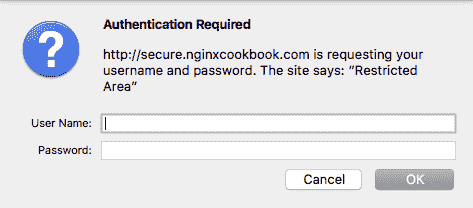
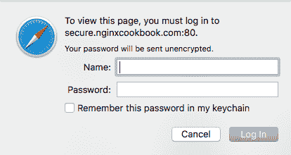
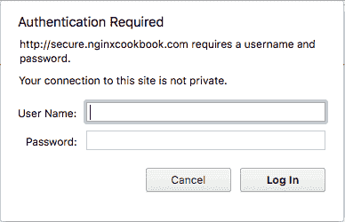
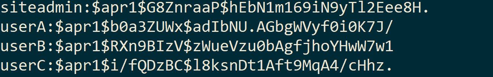
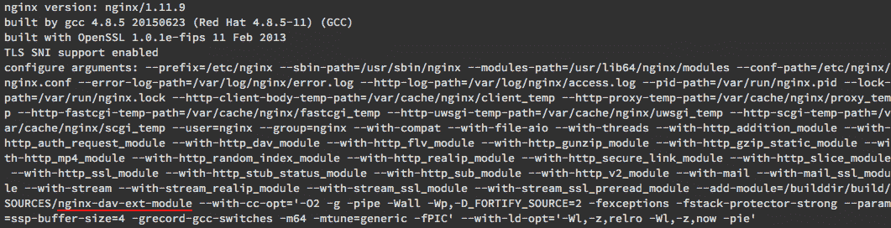
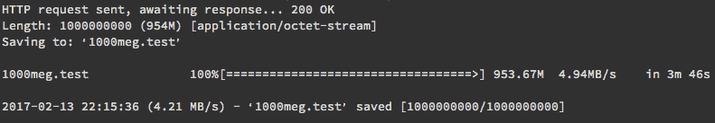
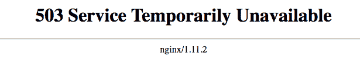
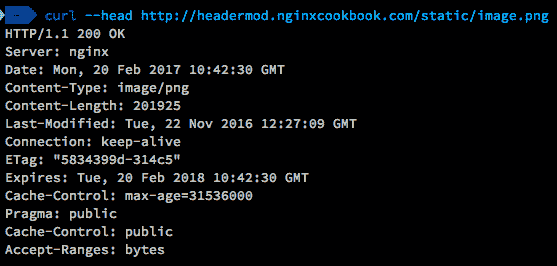
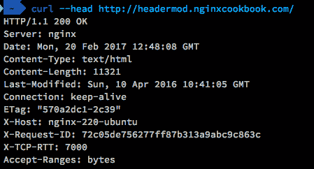

# 第九章：高级功能

在本章中，我们将介绍以下配方：

+   使用 NGINX 认证

+   使用 NGINX 的 WebDAV

+   使用 NGINX 管理带宽

+   使用 NGINX 限制连接

+   使用 NGINX 修改头部

# 介绍

如果你已经读过本书到这一章，你就会知道 NGINX 是一个非常灵活且强大的平台。即使只了解目前为止所讲的内容，你也会知道我们可以使用许多额外的模块和灵活的功能来增强你当前的配置。

这些配方中的一些可能在你开始扩展时非常必要，因为服务器是有限资源。

# 使用 NGINX 认证

尽管许多 CMS 和高级 Web 应用程序有自己的认证系统，我们可以使用 NGINX 提供第二层认证。这可以用于提供多因素认证，并且限制暴力破解尝试。

或者，如果你有一个非常基础的应用程序或系统，例如 Elasticsearch，且没有任何认证，NGINX 是提供此功能的天然选择。

# 准备工作

这个配方假设你有一个现有的 Web 应用程序。它可以是简单的静态页面，或者像 WordPress 这样的完整 CMS。

我们还需要安装 Apache 工具（不是完整的 Web 服务器），在 Debian/Ubuntu 系统中通常以 `apache2-utils` 的形式打包，在 CentOS/RedHat 系统中则是 `httpd-tools`。

# 如何操作...

为了提供基本认证，我们首先需要创建一个密码文件。我们可以使用 `htpasswd` 工具来实现，它是 Apache 工具的一部分。重要的是我们不要将此文件存储在公开可访问的目录中，否则用户名和密码将会泄露。

下面是如何创建密码文件并将 `siteadmin` 用户名添加到其中的方法：

```
htpasswd -c /var/www/private/.htpasswd siteadmin 
```

然后，`htpasswd` 工具将提示你输入密码。虽然我们可以通过命令行指定密码，但这也意味着你的密码会以明文记录在 bash 历史中。通过 `stdin` 输入密码可以减少在日志文件暴露时密码泄露的风险。

接下来，我们可以向密码文件中添加额外的用户（如果需要的话）。如果我想为每个用户添加一个登录账户，可以按如下方式指定：

```
htpasswd /var/www/private/.htpasswd userA  
```

这将再次提示输入密码（以及确认密码）。你可以为需要的用户重复此操作。一旦我们有了密码文件，就可以在 NGINX `server` 块指令中设置认证：

```
server { 
    listen       80; 
    server_name  secure.nginxcookbook.com; 
       access_log  /var/log/nginx/secure-access.log  combined; 

    location = /favicon.ico { access_log off; log_not_found off; } 

    location / { 
        auth_basic "Restricted Area"; 
        auth_basic_user_file /var/www/private/.htpasswd; 

        root   /var/www/html; 
        index  index.html index.htm; 
    } 
```

如果你没有在 SSL 加密的网站上使用此方法，凭证将以明文传输。确保保护好你的网站，以便用户名和密码保持安全。

当你访问该网站（在此例中为 `http://secure.nginxcookbook.com`）时，会看到以下弹出窗口之一。对于 Firefox，它应该与以下截图类似：



Safari 用户也会看到类似的对话框，要求输入登录信息：



最后，Chrome 还会弹出如下截图的对话框：



如果你输入在上一步设置的用户名和密码，你就可以浏览网站了。

# 它是如何工作的...

如果我们查看我们创建的 `.htpasswd` 文件，它应该像这样：



该文件包含用户名、所使用的算法（`$apr1` 表示特定的 Apache MD5 实现）、盐值，然后是密码。尽管一些人可能担心使用 MD5，但 `htpasswd` 应用程序会将密码迭代 1,000 次，以限制暴力破解尝试。这与加盐（添加随机数据）结合，确保密码非常难以暴力破解。

然后我们将在 `location` 块指令中定义两个额外的指令，以启用基本认证。`auth_basic` 指令启用认证，而 `"Restricted Area"` 字符串被一些浏览器用作消息。

然后我们将要求认证模块使用我们创建的文件（`/var/www/private/.htpasswd`），并通过 `auth_basic_user_file` 指令指定该文件。再次提醒，确保该文件不位于可以公开访问的位置。由于我们已将 `root` 指令设置为 `/var/www/html`，而密码文件位于 `/var/www/private` 中，因此无法直接访问。

# 还有更多...

如果我们只想锁定一个特定的位置，也可以做到这一点。考虑这个示例，我们从 第二章的 *为 WordPress 配置 NGINX* 配方中获取 `server` 块指令，*常见的 PHP 场景*，并为 `wp-admin` 目录和 `wp-login.php` 位置添加额外的认证：

```
location ~ ^(/wp-login.php|/wp-admin/) { 
        auth_basic "Restricted Area"; 
        auth_basic_user_file /var/www/private/.htpasswd; 
        location ~ \.php$ { 
            fastcgi_pass unix:/var/run/php7.0-fpm.sock; 
            fastcgi_index index.php; 
            fastcgi_param SCRIPT_FILENAME 
            $document_root$fastcgi_script_name; 
            include fastcgi_params; 
        } 
    } 
```

配置匹配任何以（由 `^` 符号表示）`/wp-login.php` 或（`|`）`/wp-admin/` 开头的请求，并添加基本认证。网站上的其他所有页面不包含额外认证，因此正常加载。

我们还添加了一个嵌套的 PHP `location` 块，因为 NGINX 不会处理当前 `location` 块外部的声明。为了整洁，你也可以在一个单独的文件中定义它，并在每个需要的位置包含它。这样，如果你需要进行更改，只需在一个地方修改即可。

# 另请参阅

+   NGINX 基本认证模块可以在 [`nginx.org/en/docs/http/ngx_http_auth_basic_module.html`](http://nginx.org/en/docs/http/ngx_http_auth_basic_module.html) 找到

+   有关 `htpasswd` 程序，请参考 [`httpd.apache.org/docs/2.4/programs/htpasswd.html`](https://httpd.apache.org/docs/2.4/programs/htpasswd.html)

# 使用 WebDAV 和 NGINX

**Web 分布式创作与版本控制**（**WebDAV**）是标准 HTTP 协议的一个扩展，允许远程创作命令，例如锁定、上传、删除和创建内容的能力。

这些内容可以是文档、图像、对象等形式。尽管随着完整 CMS 和云存储平台（如 Dropbox）的快速更新，WebDAV 的普及度有所下降，但它仍然是一个非常简单的实现方案选项。

# 准备开始

标准的 NGINX 安装仅包括基本的 WebDAV 支持；但是，我们可以通过编译自定义模块来扩展它，提供完整的功能。写作时，扩展模块尚未转换为动态模块，因此我们需要重新编译整个 NGINX。

首先，我们将下载 NGINX 的源代码并准备编译：

```
mkdir /tmp/nginxbuild
cd /tmp/nginxbuild
yumdownloader --source nginx  
```

然后，我们将下载该扩展的副本，以便将其包含在源代码构建中：

```
git clone https://github.com/arut/nginx-dav-ext-module.git /tmp/ nginxbuild/nginx-dav-ext-module  
```

为了包含额外的模块，我们修改`nginx.spec`文件，以编译额外的模块，添加额外的构建要求，复制源代码，然后修改配置行。为了添加构建过程所需的额外库，我们在`zlib-devel`和`pcre-devel`后面追加以下行：

```
BuildRequires: expat-devel 
```

为了将源代码包含在源 RPM 中，我们接着指定额外的目录：

```
Source14: nginx-dav-ext-module 
```

最后，我们通过将以下内容附加到`BASE_CONFIGURE_ARGS`定义中来确保它被编译进来：

```
--add-module=%{SOURCE14} 
```

一本补丁文件可以在书籍的官方代码库中找到。

配置更新后，我们现在可以重新编译 NGINX，并添加我们的额外模块：

```
/usr/bin/mock --buildsrpm --spec /tmp/nginxbuild/nginx.spec --sources /tmp/nginxbuild 
usr/bin/mock --no-clean --rebuild /var/lib/mock/epel-7-x86_64/result/nginx-1.11.9-1.el7.centos.ngx.src.rpm 
```

这将生成源 RPM，然后生成已编译的二进制 RPM，准备安装。我们现在可以使用`yum`安装该 RPM：

```
yum install /var/lib/mock/epel-7-x86_64/root/builddir/build/RPMS/nginx-1.11.9-1.el7.centos.ngx.x86_64.rpm  
```

如果你需要对 Debian 或 Ubuntu 发行版执行相同的操作，请参考 *快速安装指南* 章节中 *从头编译部分*，该部分在第一章的 *开始吧* 里有介绍。

要确认更新后的软件包是否可用，我们可以运行`nginx -V`（注意大写的`V`），以显示 NGINX 编译时使用的模块：



如果你在列表中看到`nginx-dav-ext-module`，表示额外模块已可用，接下来可以继续操作。

# 如何操作...

这是我们 WebDAV 配置的`server`块指令：

```
server { 
    listen              443 ssl; 
    server_name         webdav.nginxcookbook.com; 

    access_log  /var/log/nginx/webdav-access.log  combined; 

    ssl_certificate     /etc/ssl/public.pem; 
    ssl_certificate_key /etc/ssl/private.key; 
    ssl_protocols       TLSv1 TLSv1.1 TLSv1.2; 
    ssl_ciphers         HIGH:!aNULL:!MD5; 

    location / { 
        auth_basic           "Restricted Area"; 
        auth_basic_user_file /var/www/private/.htpasswd; 

        root /var/www/webdav; 
        autoindex       on; 
        client_max_body_size 4g; 
        client_body_temp_path /tmp; 
        dav_methods PUT DELETE MKCOL COPY MOVE; 
        dav_ext_methods PROPFIND OPTIONS; 
        dav_access  group:rw  all:r; 
        create_full_put_path  on; 

    } 
} 
```

# 它是如何工作的...

为了确保传输的文件保持安全，我们通过`HTTPS`（在第四章，*关于 SSL**的部分有介绍）配置 NGINX，以确保所有数据在传输中加密。我们还使用在前面的配方中介绍的基本认证方式，使文件通过用户名和密码得到保护。

`root` 指令接着设置文件存放的位置，在本例中是 `/var/www/webdav`。在这个配置阶段，它与任何其他静态文件提供设置完全相同。将 `autoindex` 指令显式设置为 `on`，这会自动生成文件的索引，以便轻松浏览。

为了允许更大的文件上传，`client_max_body_size` 设置为 `4g`。如果你需要上传超过 4 GB 的文件，你需要增加这个值。然后，`client_body_temp_path` 定义了临时文件上传时存放的位置。对于这个配置，我们将其设置为 `/tmp`，这样任何文件将会被临时上传到该位置，之后再移动到根目录位置。

在这里，`dav_methods` 设置为允许 `PUT`、`DELETE`、`MKCOL`、`COPY` 和 `MOVE` 方法，这是所有可用的方法。这让 WebDAV 客户端可以完全控制文件的上传、创建、删除和移动，按需操作。

使用我们编译的额外模块，`dav_ext_methods` 添加了两个额外的扩展。`PROPFIND` 扩展使得能够以 XML 格式返回文件和目录的属性，许多客户端使用它来列出文件。`OPTIONS` 扩展返回可用命令的列表，以表明有哪些权限可用。

最后，我们将 `create_full_put_path` 设置为 `on`，这意味着我们可以在子目录中创建文件。WebDAV 的默认设置是只允许现有的子目录，这使得移动现有的数据结构变得困难。

# 另见

+   NGINX WebDAV 模块可以在 [`nginx.org/en/docs/http/ngx_http_dav_module.html`](http://nginx.org/en/docs/http/ngx_http_dav_module.html) 查阅

+   你可以访问 WebDAV 的官方网站 [`www.webdav.org/`](http://www.webdav.org/)

# 使用 NGINX 管理带宽

如果你正在提供大型二进制文件（如视频文件），确保合理分配可用带宽给你的用户非常重要。同时，你必须确保这种分配不会影响性能，也不会因设置过高的限制而使用户感到不便。

# 准备工作

所需的模块已内置于 NGINX 核心中，因此无需升级或额外的模块。在这个配置中，我们将提供静态文件，但它们可以很容易地被集成到你现有的网站中。

# 如何实现...

限制带宽必须在 `location` 指令中完成。重要的是，如果你有多个 `location` 块指令需要限制，你需要为每一个都进行调整。以下是我们的基本代码：

```
server { 
    listen 80; 
    server_name limitbw.nginxcookbook.com; 
    access_log  /var/log/nginx/limitbw.log  combined; 
    location / { 
        limit_rate 5m; 
        root   /var/www/html; 
        index  index.html index.htm; 
    } 
} 
```

# 它是如何工作的...

`limit_rate`指令设置每个连接的下载速率。这个速率是以字节每秒为单位的，而不是比特每秒。大多数互联网连接通常用比特每秒表示；因此，为了转换，你需要除以 8 来设置。我们的配方设置了 5 **兆字节每秒**（**MBps**）的限制，因此换算成比特带宽时，我们会看到 40 **兆比特每秒**（**Mbps**）。

我们可以使用`wget`测试这个限制：

```
wget http://limitbw.nginxcookbook.com/1000meg.test  
```

在设置了限制后，结果如下：



尽管速率会有轻微波动，但我们可以看到整体平均值为 4.94 MBps，这与我们指定的 5 MBps 速率相符。

# 还有更多...

另一个技巧是允许在下载开始时进行初始的突发。对于流媒体电影文件，这非常有用，因为它可以快速填充初始缓冲区，从而尽可能快地开始播放电影。为了实现这一点，我们可以在`location`块指令中添加一行：

```
location / {    
        limit_rate 5m; 
        limit_rate_after 20m; 
        root   /var/www/html; 
        index  index.html index.htm; 
} 
```

额外的`limit_rate_after`指令允许下载在前 20 兆字节（`20m`）内以最大速度运行，之后再进行速率限制。许多在线视频流服务都采用这种实现方式，不仅平衡了流媒体快速启动的需求，还确保带宽在用户之间公平共享。

# 另见

NGINX 的`limit_rate`文档可以在[`nginx.org/en/docs/http/ngx_http_core_module.html#limit_rate`](http://nginx.org/en/docs/http/ngx_http_core_module.html#limit_rate)找到

# 使用 NGINX 限制连接数

除了限制带宽以确保所有用户之间的公平和均衡访问外，NGINX 还可以限制连接数。在第七章中，我们讨论了如何限制连接的速率。虽然这两者听起来相似，但连接限制稍有不同，适用的场景也不同。连接限制通常用于长时间运行的任务，比如下载。之前介绍的带宽限制仅适用于每个连接，而不是每个 IP 地址。不过，我们可以将这两者结合起来，以确保每个 IP 地址不会超过指定的带宽限制。

# 准备工作

与带宽限制类似，连接限制是 NGINX 核心功能的一部分，因此不需要额外的模块。

# 如何操作...

要提供连接限制，我们首先需要定义一个共享内存空间来进行跟踪。这需要在`server`指令之外进行，一般放置在 NGINX 的主配置文件（`nginx.conf`）中。以下是我们的指令：

```
limit_conn_zone $binary_remote_addr zone=conlimitzone:10m; 
```

然后，我们将其整合到`server`块指令中：

```
server { 
    listen 80; 
    server_name limitcon.nginxcookbook.com; 
    access_log  /var/log/nginx/limitcon.log  combined; 
    location / { 
        root   /var/www/html; 
        limit_conn conlimitzone 1; 
        limit_rate 5m; 
        index  index.html index.htm; 
    } 
} 
```

我们可以通过浏览器下载一个大文件来确认这一点，然后打开另一个标签页。如果你从同一网站导航到其他页面，你应该看到以下内容：



在第一个请求完成之前，所有后续的尝试将显示`503`错误。

# 它是如何工作的...

我们使用`limit_conn_zone`指令创建一个共享内存空间，以便跟踪连接。我们使用`$binary_remote_addr`来跟踪远程（客户端）IP 地址，然后将我们的区域命名为`conlimitzone`。最后，通过在区域名称后添加`:10m`来分配 10MB 的空间。这是总的空间分配，足以跟踪最多 160,000 个并发 IP 地址。

在我们的`server`区块指令中，我们通过将`limit_conn`设置为区域名称`conlimitzone`来使用我们的区域。此限制设置为总共`1`个连接，这确保每个唯一的 IP 地址只能建立一个连接。

最后，我们使用`limit_rate`（如我们之前的示例中所示）来限制每个连接的带宽。由于我们将连接限制设置为`1`，这意味着每个用户一次只能下载一个文件，总带宽为 5MBps。

# 还有更多...

通过客户端 IP 地址跟踪连接并不是我们限制连接的唯一方式。我们还可以为整个服务器设置限制，这在防止服务器过载时非常有用。特别是在系统位于反向代理后面时，这是一种简单而有效的方法，确保你的网站或应用程序保持响应。

要为整个服务器进行跟踪，我们再次首先设置共享内存区：

```
limit_conn_zone $server_name zone=serverlimitzone:10m; 
```

然后，我们设置我们的`server`指令：

```
server { 
    listen 80; 
    server_name limitcon.nginxcookbook.com; 
    access_log  /var/log/nginx/limitcon.log  combined; 
    location / { 
        root   /var/www/html; 
        limit_conn serverlimitzone 500; 
        index  index.html index.htm; 
    } 
} 
```

在此配置下，我们的服务器限制为`500`个并发连接。如果尝试更多连接，将返回 503 错误给客户端。

# 参见

NGINX 的`limit_conn`模块文档可以在[`nginx.org/en/docs/http/ngx_http_limit_conn_module.html`](http://nginx.org/en/docs/http/ngx_http_limit_conn_module.html)找到。

# 使用 NGINX 修改头部

随着系统复杂性的增加，有时在 HTTP 头部发送一些额外的调试或信息可能是非常宝贵的。HTTP 头部可以具有特定的含义，告诉浏览器以特定的方式处理响应，或者它们仅仅是提供额外的信息，用于追踪网站或应用程序中的特定问题。

# 准备就绪

修改头部的能力已经内置在 NGINX 核心中，但要使用最新功能，你需要使用版本 1.10.0 或更高版本。

# 如何实现...

我们可以通过多种方式修改头部，以适应不同的需求。虽然每种方法的过程相同，但在以下示例中详细介绍了常见的头部修改示例。

# 缓存静态内容

对于那些静态媒体文件（如 CSS、JS 和图片）在文件名中包含版本号的站点，我们可以轻松地缓存这些文件，并设置长时间过期，而不会引起任何问题。这意味着，除非用户清除缓存，否则他们将有该文件的副本来加速页面重新加载。为了设置缓存，我们将使用 `location` 块指令（在主 `server` 块指令内）来添加额外的头信息。以下是所需的代码：

```
location /static { 
    expires 365d; 
    add_header Pragma public; 
    add_header Cache-Control "public";} 
```

要查看头信息，我们可以使用 Chrome **开发者工具** (**DevTools**) 或命令行工具如 cURL。如果你想通过 cURL 执行，下面是操作方法：

```
curl --head http://headermod.nginxcookbook.com/static/image.png  
```

这将仅显示来自服务器响应的头信息，我们将得到一个类似于以下屏幕截图的输出：



从 cURL 输出中，我们可以看到头信息（`Expires`、`Pragma` 和 `Cache-Control`）已被正确设置。

# 移除服务器名称和版本

默认情况下，NGINX 会设置一个 `Server` 响应头，其中包含产品名称和版本号。虽然这通常是一个小问题，但一些人认为这是信息泄漏，可能为黑客提供潜在的攻击起点。我们可以删除这个版本号，以移除头信息中的版本数据。下面是如何操作：

```
server { 
    listen 80; 
    server_name headermod.nginxcookbook.com; 
    server_tokens off; 
} 
```

`server_tokens` 指令默认设置为 `on`，所以我们将其设置为 `off`，以禁用版本号。这也会将错误页面（如 404 错误页面）中的版本号去除。

如果你需要完全移除 `server` 头，你需要使用第三方模块，或者使用 NGINX 的 Plus（付费）版，这允许你覆盖该头信息。

# 额外的调试头信息

虽然你可能没有仔细观察，但许多顶级网站会添加额外的头信息来协助调试。Facebook 添加了 `x-fb-debug` 头，Twitter 有 `x-transaction` 头，像 [`www.wired.com/`](https://www.wired.com/) 这样的站点则插入 `x-served-by` 头来帮助追踪你的请求经过了哪些代理。这些信息不会对最终用户产生影响；然而，在试图诊断难以诊断的问题时，这些信息非常宝贵。虽然许多低级别的调试信息只能在你的应用代码中产生，但在更高层次上，你可以轻松地加入一些有用的头信息。下面是一个例子：

```
add_header X-Host $hostname; 
add_header X-Request-ID $request_id; 
add_header X-TCP-RTT $tcpinfo_rtt; 
```

这些信息只需插入到你现有的 `server` 块指令中，它们会生成如下所示的输出：



如果你有一个有意义的服务器名称（其中可以包括位置、变体、云提供商或类似的内容），添加 `$hostname` 服务器（我们将其设置为 `X-Host` 头）可以让你追踪到导致问题的确切系统。

`$request_id` 命令生成一个 16 字节的唯一标识符，可用于轻松追溯到自定义日志文件格式（参见 第五章，*Logging*，了解更多信息）。这为我们提供了一个确切的字符串匹配，远比尝试在日期范围内搜索日志文件更有效。

最后，我们记录 TCP **往返时间** (**RTT**) 作为 `X-TCP-RTT`，这为我们提供了服务器和客户端之间网络性能的指示。RTT 以微秒为单位（而非毫秒），基于底层操作系统的 `TCP_INFO` 数据。

默认情况下，这些附加头部仅会为 20x 和 30x 响应插入。如果您希望它们插入到您的错误页面（如 404），您需要在 `add_header` 指令的末尾附加 `always`。

# 另请参见

NGINX 头部模块可在 [`nginx.org/en/docs/http/ngx_http_headers_module.html`](http://nginx.org/en/docs/http/ngx_http_headers_module.html) 找到。
