# Docker 容器

本章将涵盖以下主题：

+   通过 Docker 使用 NGINX Web 服务器

+   NGINX 反向代理通过 Docker

+   使用 NGINX 的 Docker Compose

+   NGINX 负载均衡与 Docker

# 介绍

虽然容器技术的概念并不新鲜，但 Docker 流行的崛起只是因为它是第一个将简便性和可扩展性带入市场的工具。对于那些不太理解 Docker 的人，从简单的角度来看，它仅仅是一个应用容器。

容器本身只是虚拟化环境的另一种方式。与其模拟虚拟机（**Virtual Machine**，**VM**）等组件，容器在单一内核上运行，并依赖软件层面的抽象和隔离来提供轻量级且更快速的虚拟环境。Docker 进一步简化了这一过程，将其隔离到单个应用程序，如下图所示：

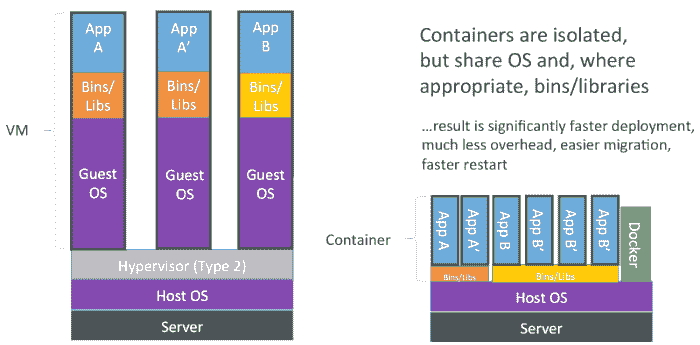

其优点在于，这种高度的抽象意味着你可以提供一个高度一致且可以快速部署的服务架构，并且易于运行。不仅如此，Docker 还有许多工具可以协作并帮助管理容器的部署。

# 安装 Docker

如果你还没有安装 Docker，最简单的尝试方法是在本地开发机器上进行。与本地运行不同，这些环境设置了一个小型的 Linux 虚拟机，并提供了封装器，让你可以直接从现有的操作系统中使用它。

要安装它，请从此处下载并通过安装程序运行：

+   **Windows**: [`www.docker.com/docker-windows`](https://www.docker.com/docker-windows)

+   **macOS**: [`www.docker.com/docker-mac`](https://www.docker.com/docker-mac)

由于 Docker 是一个快速发展的平台，安装时请始终参考官方文档，以防自写作时以来发生了任何变化。

如果你在专用服务器或 VPS 上安装 Docker，可以使用标准工具来完成。对于 CentOS 7 系统，操作非常简单，如下所示：

```
yum install docker
systemctl start docker  
```

对于运行 Ubuntu 的用户，命令同样简单：

```
apt install docker  
```

这为我们提供了一个完全工作的 Docker 环境，如果你有本地开发安装和测试这些配置的预发布/生产系统，那就更好了。

为了熟悉 Docker，我们将介绍一些基本命令。第一个命令是简单地运行 `docker` 命令。这将启动 Docker 客户端，并列出可用的命令。如果此时出现错误，请重新检查安装或系统日志中的输出。

接下来，让我们运行 `docker ps`，它将列出所有容器：

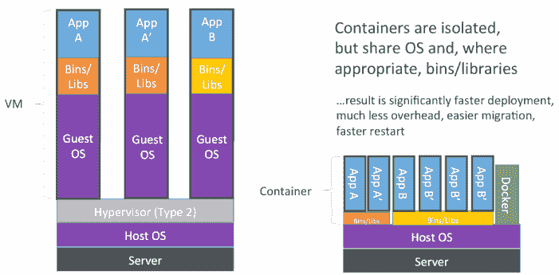

由于这是一个全新的安装，你此时不会看到任何列出的内容。最后，我们可以运行 `docker version` 来列出服务器和客户端的版本：


虽然 Docker 客户端可以在与 Docker 服务器不同的系统上运行（也可以称为 Docker 引擎），但你需要确保它们的版本兼容。

# 通过 Docker 部署 NGINX Web 服务器

本指南将一步步引导你通过 Docker 设置一个简单的 NGINX 容器。当你看到安装的简便性时，不要被它的简单所迷惑，因为这正是 Docker 的优势所在。

# 准备工作

如果你已经在运行现有的 Docker 容器，请确保它们已经停止，或者不在端口 80 上运行。否则，它们将与这个配置冲突。

# 如何操作...

我们将首先拉取最新的 Docker 镜像。虽然这不是必须的步骤，但它将让你第一次看到 Docker 如何分步骤工作。要下载 NGINX 镜像（官方打包的版本叫做 `nginx`），请运行以下命令：

```
docker pull nginx  
```

这将拉取多个镜像，每个镜像都会显示一系列独特的镜像 ID，就像这个示例中显示的那样：


一旦我们的镜像下载完成，我们就可以开始创建第一个容器：

```
docker run --name nginx-basic -d -p 81:80 nginx  
```

如果成功，你应该会看到一行输出，那将是容器的 ID：

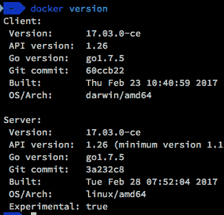

这表示容器已经创建并启动。如果这是你第一次看到容器化系统，那么不到一秒钟的设置可能一开始看起来像是故障。然而，这就是容器创建并启动的速度。为了测试站点，我们现在可以浏览 Docker 实例所在的 IP 地址或主机名，并连接到端口 `81` 进行确认：


# 它是如何工作的...

Docker 镜像采用分层格式，这允许每一层在不同的镜像之间共享。这是为了节省空间，而不是让 20 个 NGINX 实例在 Ubuntu 上运行并重复所有系统库。Docker 会将这些实例分解成多个层，这样你就可以有一个单一的基础镜像，任何对该镜像的修改都会作为一个新层进行存储。我们的 NGINX 镜像长这样：

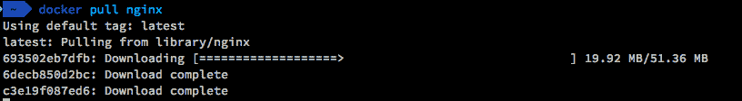

每一层代表一次更改，即使是基础镜像本身也可能由多个层组成。一旦你有了一个正在运行的容器，任何更改都会以 **写时复制** (**COW**) 的方式进行；这意味着原始镜像将被保留，同时也允许基于它们对实例进行修改。

我们的一行部署命令可以分解成多个不同的部分：

+   `run`：这个命令告诉 Docker 创建一个实例并运行默认命令。正如前面的图示所示，这就是启动 NGINX 的 `nginx` 命令。

+   `--name nginx-basic`：这个选项给我们的容器指定一个名称，方便你从其他容器中轻松识别并链接它。

+   `-d`：这个选项将容器从命令行中分离，并在后台运行。

+   `-p 81:80`：使用 `-p` 指定容器的端口映射。格式始终是：`<host>:<container>`。对于我们的实例，我们在服务器（或开发机）上打开了端口 `81`，并将其映射到容器中的端口 `80`（NGINX 默认监听的端口）。

+   `nginx`：最后，我们指定镜像名称。这也可以包含一个版本标签，如果没有指定标签，它将选择最新版本。如果我们想运行 NGINX 的旧版本，我们可以指定 `nginx:1.9.14` 来使用最新的 1.9 版本。

# 还有更多…

我们的初始示例相当基础，但可以很容易地扩展以提供静态文件。我们可以将一个卷映射到 Docker 所在主机上，而不是构建一个包含已部署文件的镜像。这样，我们可以在本地编辑文件，但仍然从 Docker 容器内提供这些文件。下面是我们更新后的 `run` 命令：

```
docker run --name nginx-basic -d -p 81:80 -v /var/static:/usr/share/nginx/html:ro  nginx  
```

Docker 的文件系统使用联合文件系统（例如，OverlayFS）；这允许你在指定的挂载点连接两个系统。在我们之前的示例中，我们将 `/var/static` 挂载在本地服务器上，并指定挂载点为 `/usr/share/nginx/html`。我们还指定该挂载是只读的，以防止容器内的任何内容修改文件。

在本地服务器（或开发机）和 `/var/static` 目录中对文件所做的更改将通过我们的 Docker 实例提供服务。

这也意味着你可以在不同配置之间保持 Docker 配置的一致性，并且只需单独更新内容。如果你特别使用 **版本控制系统**（**RCS**），如 Git，这意味着你有一个可以通过 **持续集成**（**CI**）系统快速更新的系统。

# 另请参见

+   Docker 文档：[`docs.docker.com/`](https://docs.docker.com/)

+   官方 NGINX Docker Hub 条目：[`hub.docker.com/_/nginx/`](https://hub.docker.com/_/nginx/)

+   官方镜像构建代码：[`github.com/nginxinc/docker-nginx`](https://github.com/nginxinc/docker-nginx)

# NGINX 通过 Docker 进行反向代理

在大多数场景中，Docker 会与应用容器一起部署，例如 Ruby on Rails、WordPress 或类似的应用。在传统的部署场景中，这些应用会配置在同一台服务器上。然而，在基于 Docker 的环境中，你可能希望将每个容器简化为单一任务或进程，例如基于微服务的架构。这样你就可以独立升级或替换每个部分，而不会影响到其他部分。一个例子是更新系统库或部署不同版本的 PHP。由于每个任务都是单独的容器，它们是隔离的，因此不会受到其他容器的影响。

在本地开发服务器上使用反向代理也是测试应用程序的一个好方法，尤其是在部署之前。通常，如果你有一个基础的 WAMP（即 Windows、Apache、MySQL、PHP）风格的开发环境，那么你可能不会发现一些只会在有反向代理服务器模拟生产环境时才会暴露的问题。

# 准备工作

该食谱假设你在本地服务器上运行了某种形式的 web 或应用服务器。理想情况下，这也可以是 *Docker 化* 的，但我们将同时涵盖这两种情况。

以下是大致的效果：

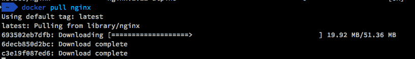

因为大多数实际部署都是通过 HTTPS 完成的，我们还将集成 SSL 证书的部署。

# 如何操作...

由于标准的 NGINX 镜像非常适合更复杂的部署，我们将对其进行修改，以便满足我们的需求。Docker 的一个优点是，这个过程非常简单。

首先，我们将创建一个 Docker 镜像定义文件，称为 `Dockerfile`。Docker 使用此文件来构建镜像，并且它可以引用现有的镜像作为基础，以便不需要重新发明轮子。以下是我们的 `Dockerfile`：

```
FROM nginx:latest 

# Configuration 
COPY default.conf /etc/nginx/conf.d/ 

# SSL Certificates and DH Key 
COPY dockerdemo.crt /etc/ssl/dockerdemo.crt 
COPY dockerdemo.key /etc/ssl/dockerdemo.key 
COPY dh4096.pem /etc/ssl/dh4096.pem 

# Symlink the logs to stdout and stderr 
RUN ln -sf /dev/stdout /var/log/nginx/access.log 
RUN ln -sf /dev/stderr /var/log/nginx/error.log 

# Expose port 443 (HTTPS) 
EXPOSE 443 

CMD ["nginx", "-g", "daemon off;"] 
```

在同一目录下，我们还需要我们的 NGINX 配置文件。因为我们想要覆盖默认设置，所以我们将其命名为 `default.conf`，以便它可以覆盖现有文件。根据 第七章中 *配置 NGINX 作为简单的反向代理* 这一食谱，我们的配置将如下所示：

```
server { 
    listen              443 ssl http2; 
    server_name         dockerdemo.nginxcookbook.com; 
    ssl_certificate     /etc/ssl/dockerdemo.crt; 
    ssl_certificate_key /etc/ssl/dockerdemo.key; 
    ssl_dhparam         /etc/ssl/dh4096.pem; 
    ssl_protocols       TLSv1 TLSv1.1 TLSv1.2; 
    ssl_ciphers         HIGH:!aNULL:!MD5; 

    ssl_prefer_server_ciphers on; 
    client_max_body_size 75M; 

    location / { 
        proxy_pass http://127.0.0.1:8000; 
        proxy_set_header X-Forwarded-For $proxy_add_x_forwarded_for;                 
        proxy_set_header X-Real-IP  $remote_addr; 
        proxy_set_header Host $host; 
    } 
} 
```

最后，我们还需要将 SSL 证书和密钥复制过来。如果你打算分发此镜像或单独更新 SSL 证书，你可以从镜像中移除这些内容，并使用卷挂载将证书存储在本地服务器上。

如果你需要生成一个测试 SSL 证书，可以参考 第四章中的快速指南，*关于 SSL 的一切*。

一旦你准备好了所有配置文件，你就可以告诉 Docker 构建镜像。它会根据你提供的标签将此镜像存储在本地。创建镜像的命令如下：

```
docker build -t nginx-demo-proxy .  
```

Docker 将按照 `Dockerfile` 中的每一个步骤来生成新的镜像。你的输出应该类似于以下内容：


我们可以看到，在最终输出中，我们的 Docker 镜像已经被赋予了 `b4007604b77e` ID。我们可以通过查看已安装的 Docker 镜像来确认这一点：

```
docker images 
```

以下是列出我们 Docker 镜像的输出：

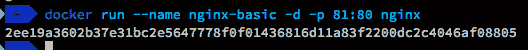

尽管有许多中间镜像，但默认情况下，Docker 不会显示它们。

在构建并确认我们已经有了 Docker 镜像之后，你可以开始部署它：

```
docker run --name nginx-proxy -d --net=host nginx-demo-proxy  
```

这将基于我们的新镜像创建一个容器，通过服务器暴露`443`端口。与桥接网络（因此使用 docker0）不同，我们告诉 NGINX 使用主机的网络。

目前，Docker for Mac 在访问主机时存在一个长期问题，这是由底层操作系统的限制引起的。现在，最简单的解决方法是只使用容器间的网络连接。

这主要适用于开发阶段，因为由于缺乏端口映射，你只能运行每个镜像的一个实例。

# 它是如何工作的...

在我们的`Dockerfile`中，我们定义了多个步骤来构建镜像：

+   `FROM`：这定义了我们的基础镜像；在这个例子中，我们使用的是`nginx:latest`。我们不是从头开始构建镜像，而是直接使用官方的 NGINX 镜像。如果你想手动安装自己的构建版本，可以从基础的 Linux 镜像开始，例如 Debian 或 Alpine。

+   `COPY`：为了将文件作为镜像的一部分，我们可以在构建过程中复制它们。对于这个镜像，我们已经复制了 NGINX 配置文件以及 SSL 证书。如果文件已经存在于基础镜像中，它们将被覆盖。

+   `RUN`：我们可以在构建过程中发出命令。在这个例子中，我们将默认的日志文件通过符号链接方式连接到`/dev/stdout`和`/dev/stderr`，这样我们就可以通过标准的 Docker 日志工具查看日志。

+   `EXPOSE`：为了访问容器外部的网络端口，必须将它们暴露给 Docker 网络子系统。之后，可以通过`docker run`命令中的`-p`明确映射，或者通过`-P`隐式映射。

+   `CMD`：这定义了容器启动时执行的默认命令。它以`['executable', 'param1', 'param2']`的格式设置，对于我们的 NGINX 命令，它对应的是`nginx -g daemon off;`。因为 Docker 要求应用程序保持在前台运行，`-g`选项允许我们设置额外的指令“daemon off”来强制实现这一点。

# 还有更多...

这个示例并不是讲解如何部署生产系统，因为我们混合使用了主机部署的服务和基于容器的服务。大多数生产环境中的 Docker 部署将 100%的服务部署在 Docker 容器中，这简化了网络配置。

在典型的生产部署中，我们可能会看到这样的配置：

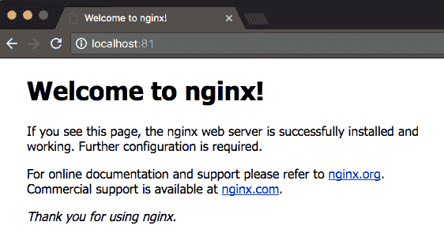

通过将所有内容容器化和隔离，我们仍然可以在不将端口暴露给外界的情况下连接这些容器。之前，这种方式被称为**链接**容器，尽管链接命令有效，但也存在显著的限制。现在，我们通过在主机内创建独立的网络来代替。

这些网络允许容器在具有独特名称的网络中互相通信，并且在一个系统中可以有多个网络而不会出现问题。如果你之前使用过 Docker，并且还没有升级到高于 1.9 的版本，那么仅仅为了这个部分的改进，升级是值得的。

为了让两个容器互相通信，我们首先需要创建一个网络：

```
docker network create webnet  
```

我已经将这个网络命名为 `webnet`，它将仅用于 NGINX 和应用程序之间。在之前的示例中，我们还可以为 Rails 应用程序与 PostgreSQL 之间创建单独的网络，再为 Rails 和 Redis 创建单独的网络。这种级别的隔离有助于确保在出现安全故障时不会发生意外的数据泄漏。

我已经安装了一个 Redmine 容器（这是一个基于 Ruby on Rails 的项目管理应用程序），它将从前端的反向代理中受益，提供 SSL 终止。得益于 Docker 的强大功能，我们可以快速部署一个 Redmine 服务器，并自动将其连接到我们的 `webnet` 网络：

```
docker run -d --name demo-redmine --net webnet redmine  
```

为了让 NGINX 代理 `redmine` 容器，首先我们需要更新代理配置。当容器加入到网络时，Docker 的内部 DNS 服务器会自动添加条目，这样我们就可以通过容器名称直接引用它。在 `default.conf` 文件中更新，`proxy_pass` 行将变成如下：

```
proxy_pass http://redmine-demo:3000; 
```

和之前一样，我们需要重新构建镜像，然后运行一个容器，这次容器将与 `webnet` 网络连接，而不是与主机连接：

```
docker build -t nginx-demo-proxy .
docker run --name nginx-proxy -d --net webnet -p 443:443 nginx-demo-proxy  
```

这次部署 `nginx-proxy` 镜像时，我们还将其加入到 `webnet` 网络，并将端口 `443` 绑定到主机上。由于 NGINX 容器与 Redmine 演示在同一网络上，它可以通过端口 `3000` 显式地访问 Redmine，而主机服务器则无法访问。如果你一切配置正确，你应该能看到代理连接到 Redmine：

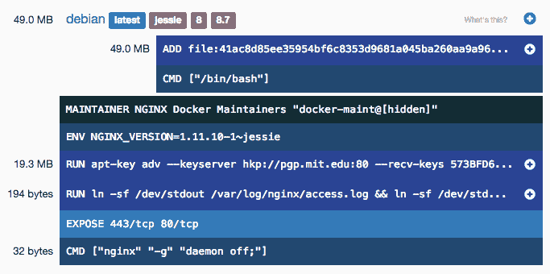

# 另请参阅

+   macOS 网络限制：[`docs.docker.com/docker-for-mac/networking/#there-is-no-docker0-bridge-on-macos`](https://docs.docker.com/docker-for-mac/networking/#there-is-no-docker0-bridge-on-macos)

+   `Dockerfile` 最佳实践：[`docs.docker.com/engine/userguide/eng-image/dockerfile_best-practices/`](https://docs.docker.com/engine/userguide/eng-image/dockerfile_best-practices/)

+   `Dockerfile` 参考：[`docs.docker.com/engine/reference/builder/`](https://docs.docker.com/engine/reference/builder/)

+   Docker 网络：[`docs.docker.com/engine/userguide/networking/`](https://docs.docker.com/engine/userguide/networking/)

# 使用 NGINX 的 Docker Compose

在我们之前的教程中，我们以单一方式部署了 Docker 容器。虽然这种方式适用于小型项目和测试，但在生产环境中，理想情况下我们希望这能尽可能地可重复。这就是 Docker Compose 出现的地方。Docker Compose 是一个工具，允许你定义多容器 Docker 应用程序，便于管理和部署。它通过一个单一的配置文件来实现，定义了要部署的容器以及网络设置。

# 准备工作

Docker Compose 默认会在所有现代的 Docker 安装中安装。我们将把 Redmine 部署转换回一个单命令的部署过程。

# 如何操作...

要开始，我们需要创建一个`docker-compose.yml`文件。这是 YAML 格式的，它是一种简洁的文本语言，强调可读性。以下是我们的`docker-compose.yml`文件内容：

```
version: '3' 

networks: 
  webnet: 

services: 
  redmine: 
    image: redmine 
    networks: 
      webnet: 
        aliases: 
          - demo-redmine 

  nginx-proxy: 
    build: ./ 
    ports: 
      - 443:443 
    networks: 
      - webnet 
```

这个文件位于与`Dockerfile`和我们之前使用的 NGINX 配置文件相同的目录中。目录命名也很重要，因为 Docker Compose 会使用它来在创建的容器名前加上目录名。对于这个配方，我将文件放在`composedemo`目录中。

使用我们的 Docker Compose 配置文件，现在可以构建并创建容器了：

```
docker-compose up  
```

这将首先构建我们的`nginx-proxy`镜像，然后继续创建所有容器。当容器启动时，你应该会看到类似这样的输出：

```
Creating network "composedemo_webnet" with the default driver
Creating composedemo_redmine_1
Creating composedemo_nginx-proxy_1
Attaching to composedemo_nginx-proxy_1, composedemo_redmine_1  
```

命名方式反映了我们所使用的配置，它会在容器名前加上目录名，添加容器名，然后附加一个序列号。

容器启动后，所有日志将输出到屏幕，容器将在前台运行。如果你想在后台启动容器，可以使用以下命令：

```
docker-compose run -d  
```

这将在后台启动容器，就像我们之前的配方一样。容器也可以通过一个命令停止：

```
docker-compose stop  
```

通过能够干净利落地定义多容器部署，并通过一个命令进行部署，Docker Compose 是 Docker 生态系统中的重要组成部分。

# 它是如何工作的...

Docker Compose 的 YAML 配置文件包含了这个配方中的多个元素。首先，我们定义了版本号（`version: '3'`）。这不是单个文件的修订号，而是告诉 Docker Compose 配置文件的格式是什么。

接下来，我们定义网络（`webnet`）。默认情况下，Docker Compose 会为所有容器创建一个独立的网络，但我们在这个配方中显式地命名了它。我们这么做的原因是为了保持与之前配方的兼容性。

最后，我们定义我们的服务。第一个是`redmine`服务，我们从`redmine`镜像创建该服务。然后，将其添加到`webnet`网络，并且我们还为容器设置别名。同样，这是为了帮助保持兼容性并减少变动。虽然这不是必须的，但如果你是从之前的配置过来，减少变动有助于诊断任何问题。

第二个定义的服务是我们的 NGINX 容器，命名为`nginx-proxy`。我们不使用镜像，而是告诉 Docker Compose 从当前目录（`./`）构建容器。之前我们需要手动构建并标记镜像，而 Docker Compose 会自动为我们完成这一步。然后，我们将主机端口`443`映射到容器端口`443`，像 Redmine 服务一样，我们将其加入到`webnet`网络中。

# 另见

+   Docker Compose 文档：[`docs.docker.com/compose/overview/`](https://docs.docker.com/compose/overview/)

+   Docker Compose 文件格式：[`docs.docker.com/compose/compose-file/`](https://docs.docker.com/compose/compose-file/)

# 使用 Docker 进行 NGINX 负载均衡

一旦你解决了从复杂的部署脚本转换为简洁的`Dockerfile`的问题，下一步就是处理扩展问题。对于大多数其他问题，Docker 也有解决方案；扩展正是其中之一。

虽然较新的 Docker 版本增加了本地负载均衡，但它仍然相当简单。这使得 NGINX 成为许多应用场景下更好的选择。由于你已经熟悉 NGINX 的工作原理，它很容易被调整以在 Docker 环境中提供负载均衡。

在更大的部署中，我们会使用更正式的服务发现工具，例如`consul`或`etcd`，以提供更细粒度的控制。这个示例将仅使用 Docker 内置的 DNS 功能，以便进行轮询请求。

# 准备工作

这个示例已简化为只在单个虚拟机上运行。在大多数真实场景中，这将分布在多个虚拟机上。我们的测试场景如下：

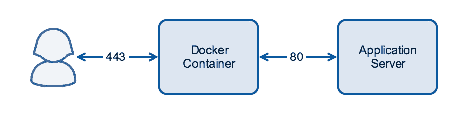

我们使用 HTest 工具，正如在第八章《负载均衡》中介绍的那样，作为我们要扩展和负载均衡的容器。

# 如何操作…

为了部署我们的负载均衡平台，首先我们要创建一个 NGINX 容器。以下是我们的`default.conf`：

```
server { 
    listen              443 ssl http2; 
    server_name         dockerdemo.nginxcookbook.com; 

    ssl_certificate     /etc/ssl/dockerdemo.crt; 
    ssl_certificate_key /etc/ssl/dockerdemo.key; 
    ssl_dhparam         /etc/ssl/dh4096.pem; 
    ssl_protocols       TLSv1 TLSv1.1 TLSv1.2; 
    ssl_ciphers         HIGH:!aNULL:!MD5; 

    ssl_prefer_server_ciphers on; 
    client_max_body_size 75M; 

    location / { 
        resolver 127.0.0.11 valid=1; 
        set $backend "http://htestbackend:8000"; 
        proxy_pass $backend; 
        proxy_set_header X-Forwarded-For $proxy_add_x_forwarded_for; 
        proxy_set_header X-Real-IP  $remote_addr; 
        proxy_set_header Host $host; 
    } 
} 
```

还需要附加文件，如相关的 SSL 证书和`Dockerfile`。

这些文件也可以直接从 GitHub 获取：[`github.com/timbutler/nginxcookbook`](https://github.com/timbutler/nginxcookbook)。

由于我们仍然使用 Docker Compose 进行部署，因此我们还需要更新的`docker-compose.yml`配置：

```
version: '3' 

networks: 
  htestnet: 

services: 
  nginx-proxy: 
    build: ./ 
    ports: 
      - "443:443" 
    networks: 
      - htestnet 

  htest: 
    image: timbutler/htest 
    networks: 
      htestnet: 
        aliases: 
          - htestbackend 
```

再次，这与我们之前的示例非常相似，因为我们要实现的目标结构相当相似。一旦我们有了配置，接下来我们可以构建并启动容器：

```
docker-compose up -d  
```

这将启动`nginx`容器和`htest`容器；它还会启动相关的网络。如果成功，你应该看到如下输出：

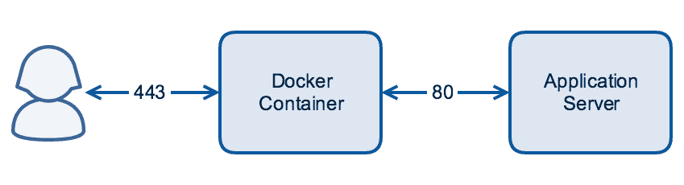

默认情况下，只有一个`htest`实例在运行。为了扩展规模，我们只需要告诉 Docker Compose 我们希望运行多少个实例。下面是一个示例：

```
docker-compose scale htest=4  
```

这将启动额外的三个`htest`容器：

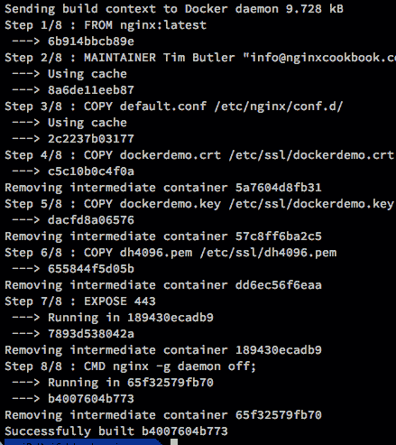

因为我们设置了 NGINX 通过主机名调用代理后端，所以这些请求现在会以基本的轮询方式调用每个容器。如果你访问该网站，你应该会看到`htest`的计数器在跳动，因为每个实例都在处理请求。

# 它是如何工作的…

在我们的 NGINX 配置文件（`default.conf`）中，我们添加了`resolver 127.0.0.11 valid=1`指令，指示 NGINX 使用内置的 Docker DNS 解析器。为了分配负载，将有效期设置为 1 表示任何 TTL 都会被忽略，结果仅保持 1 秒钟有效。

然后，我们将变量`$backend`设置为`http://htestbackend:8000`。使用变量可以确保每次都进行评估，从而更新 IP 地址。

在`Dockerfile`中，我们为`htest`容器设置了别名为`htestbackend`。当我们调用`scale`命令时，它会启动三个额外的容器。尽管每个容器都会分配一个独特的名称（例如，`loadbalancer_htest_1`），但别名确保了它们有一个共同的名称。这避免了每次添加新系统时都需要重新编写 NGINX 配置文件，使我们能够在不重新配置的情况下添加额外的后端。

# 另见

+   NGINX `resolver`指令：[`nginx.org/en/docs/http/ngx_http_core_module.html#resolver`](http://nginx.org/en/docs/http/ngx_http_core_module.html#resolver)

+   若要了解更多关于`docker compose scale`命令的信息：[`docs.docker.com/compose/reference/scale/`](https://docs.docker.com/compose/reference/scale/)
