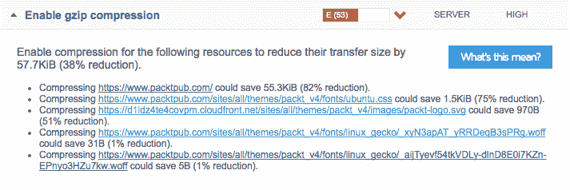
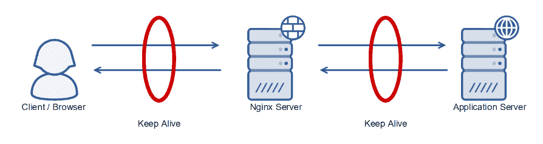
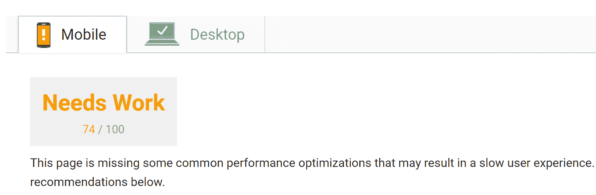
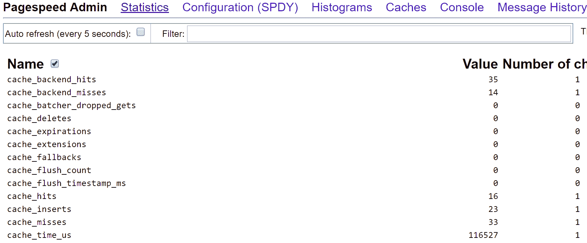

# 性能调优

在本章中，我们将介绍以下几种配置：

+   在 NGINX 中启用 Gzip 压缩

+   通过 Keep-Alive 增强 NGINX

+   调优工作进程和连接

+   精细调整基本的 Linux 系统限制

+   集成`ngx_pagespeed`

# 介绍

一旦你的 NGINX 配置完成并正常工作，你可以将注意力集中在精细调优上，以提高性能。本章的一些部分将专注于为用户提供更高的性能，而另一些则将专注于在服务器级别提供性能提升，以支持更多的并发。

像进行任何调优一样，你需要首先了解系统的限制。

过早的优化是万恶之源。

– 唐纳德·克努斯，1974 年

在 NGINX 的环境下，你需要确保在更改之前了解限制是什么。如果更改不适合你的系统，或者当前没有限制，未必能带来性能的提升。

另一方面，优化 NGINX 服务器也至关重要，确保你的网站或应用能够应对增加的流量并提供快速响应。尤其是对于电子商务平台来说，通过降低响应时间保持用户参与至关重要。亚马逊的研究发现，页面加载时间每增加一秒，每年将导致超过 16 亿美元的收入损失。即便不是电子商务网站，用户等待的时间过长也会导致他们快速流失。

# 在 NGINX 中启用 Gzip 压缩

Gzip 是一种基于 DEFLATE 算法的压缩格式，常见于大多数 Unix 环境中。压缩 HTML 文件是一种简便的方法，能够减少从 NGINX 到浏览器传输的数据量。这意味着页面加载速度更快，因为压缩后文件的大小更小，可以更快地传输。

虽然它通常带来最大的增益，但基于 HTML 的内容并不是唯一能够轻松压缩的内容。任何基于文本的文件（例如 JavaScript 或 CSS）通常都能压缩 70%以上，对于现代网站来说，这种压缩效果可能非常显著。

当然，启用压缩并非没有代价。服务器负载会有所增加，因为服务器需要使用 CPU 周期来压缩数据。虽然这曾经是一个重要的考虑因素，但随着现代 CPU 性能的提升，这种性能损耗已经远远被压缩带来的好处所抵消。

# 准备工作

NGINX 的`gzip`模块是核心模块的一部分，因此无需额外安装。

# 如何实现...

为了在 NGINX 中启用`gzip`，我们需要启用`gzip`模块，并明确告知它哪些文件需要压缩。最简单的方法是直接在`/etc/nginx/conf.d`目录下创建一个`gzip.conf`文件，放在你的服务器指令文件旁边。这也可以根据需要为每个站点或每个位置设置；`gzip`指令可以嵌套在现有的区块指令中。

下面是所需的内容：

```
gzip         on; 
gzip_disable "MSIE [1-6]\.(?!.*SV1)"; 
gzip_proxied any; 
gzip_types   text/plain text/css application/x-javascript application/javascript text/xml application/xml application/xml+rss text/javascript image/x-icon image/bmp image/svg+xml; 
gzip_vary    on; 
```

如果你想衡量*Gzip 压缩*文件可能带来的差异，可以使用 GTmetrix 等工具来概述文件传输大小的减少。例如，当我们查看[`www.packtpub.com/`](https://www.packtpub.com/)网站时，在 Gzip 部分可以看到以下内容：



虽然这个例子中的节省并不大，但 82%的减少可以向你展示其他网站可能实现的效果。如果有其他文件，如 JS 或 CSS，尚未压缩，那么减少的幅度会更显著。

# 它是如何工作的...

配置的第一部分显式启用`gzip`模块。然后，为了保持与非常旧版本的 Internet Explorer 的兼容性（希望没有人还在使用它），我们使用`MSIE [1-6]\.(?!.*SV1)`正则表达式禁用`gzip`。

然后，`gzip_proxied`设置哪些代理连接将使用`gzip`，我们将其设置为`any`，以涵盖所有请求。接着，`gzip_types`用于设置要压缩的文件类型。这与 MIME 类型匹配，例如`text/plain`。我们显式设置类型，因为并非所有文件类型都可以进一步压缩（例如 JPEG 图像）。

最后，我们将`gzip_vary`设置为`on`。这将设置`Vary: Accept-Encoding`头，指定**内容分发网络**（**CDN**）和上游代理存储压缩和未压缩文件的副本。虽然每个现代浏览器都支持 Gzip 压缩，但仍然有一些小型浏览器和基于脚本的 HTTP 工具不支持。在上游 CDN 或代理中存储两者副本，表明它们仍然能够支持这些较旧的系统。

# 还有更多内容...

如果在运行时对文件进行 Gzip 压缩的性能损失过大，NGINX 还允许提前压缩文件以供提供。虽然这意味着需要进行额外的维护工作，但可以将其集成到现有的构建流程中（例如**Grunt**或**Gulp**），从而减少所需的步骤。

要在 NGINX 中启用此功能，我们需要修改`gzip.conf`文件，使其如下所示：

```
gzip         on; 
gzip_static on; 
gzip_disable "MSIE [1-6]\.(?!.*SV1)"; 
gzip_proxied any; 
gzip_types   text/plain text/css application/x-javascript application/javascript text/xml application/xml application/xml+rss text/javascript image/x-icon image/bmp image/svg+xml; 
gzip_vary    on; 
```

设置`gzip_static`为`on`后，NGINX 将在文件存在的情况下提供已压缩的文件。

# 另请参见

+   Gzip NGINX 模块可以在[`nginx.org/en/docs/http/ngx_http_gzip_module.html`](http://nginx.org/en/docs/http/ngx_http_gzip_module.html)找到。

+   请参阅 GTmetrix 的官方网站：[`gtmetrix.com/`](https://gtmetrix.com/)

# 增强 NGINX 的持久连接

使用服务器和浏览器之间的持久 HTTP 连接可以加速额外的请求，因为不需要额外的握手。特别是在延迟较高的连接上，这可以提高整体性能。如果 NGINX 被用作反向代理（如在第七章中详细介绍的，*反向代理*），确保这些连接启用了`keepalive`以确保高吞吐量并最小化延迟也非常重要。下图突出显示了`keepalive`数据包在维护高性能方面的重要性：



这个持久连接通过**Keep Alive**数据包保持连接，从而使得连接在几分钟内保持打开，而不是在完成后关闭。这个重用可以立即进行，例如在请求额外的 CSS/JS 文件或进一步的页面和资源时。

尽管使用 HTTP/2（它进行连接复用并使用`keepalive`）会抵消一些客户端方面的收益，但它仍然对于 HTTP（非 SSL）连接和上游连接是必要的。

# 准备就绪

NGINX 的`keepalive`模块是核心模块的一部分，因此不需要额外安装。

# 如何操作...

默认情况下，NGINX 会为非代理连接启用 keep alive 连接。这意味着 NGINX 与浏览器之间的连接已经被优化。然而，由于`keepalive`数据包需要 HTTP/1.1 支持，因此默认情况下并未为反向代理连接启用它。通过我们在第三章中使用的 Express 示例，*常见框架*，我们可以添加额外的指令：

```
server { 
    listen       80; 
    server_name  express.nginxcookbook.com; 

    access_log  /var/log/nginx/express-access.log  combined; 

    location / { 
        proxy_pass http://127.0.0.1:3000; 
        proxy_http_version 1.1; 
        proxy_set_header Upgrade $http_upgrade; 
        proxy_set_header Connection "upgrade"; 
        keepalive 8; 
    } 
} 
```

# 它是如何工作的...

通过添加`keepalive`指令，我们定义了保持打开的最大空闲连接数。在我们的示例中，我们指定了最多八个空闲连接。需要注意的是，这并不是总连接数的最大值，它仅定义了保持打开的空闲连接数。

我们可以通过检查 NGINX 服务器的连接来确认`keepalive`是否正常工作。为此，我们使用`ss`命令并加上`-o`标志来显示与套接字相关的计时器信息。例如，我们可以运行以下命令：

```
ss -tpno  
```

在我们的基于 Express 的演示中，您应该看到如下内容：

```
State Recv-Q Send-Q Local Address:Port Peer Address:Port 
ESTAB 0      0      127.0.0.1:3000     127.0.0.1:33396 
users:(("nodejs",pid=4669,fd=11))  
ESTAB 0      0      xx.xx.xx.xx:80     yy.yy.yy.yy:51239 
users:(("nginx",pid=4705,fd=29))  timer:(keepalive,3min44sec,0) 
ESTAB 0      0      127.0.0.1:33396    127.0.0.1:3000 users:(("nginx",pid=4705,fd=34))  timer:(keepalive,3min51sec,0) 
```

我们可以看到，具有`keepalive`数据包的套接字已经被标记，并显示了一个计时器输出来展示过期时间。

如果您需要测试浏览器是否看到了来自服务器的`keepalive`响应，可以使用浏览器开发者工具，如 Chrome **开发者工具**（**DevTools**）。在您首选的浏览器中，打开开发者工具并查看响应头：


在前面的截图中，我们可以看到服务器响应了`Connection: keep-alive`。这意味着 keepalive 数据包得到了支持并正在工作。

# 另见

NGINX `keepalive` 文档可以在 [`nginx.org/en/docs/http/ngx_http_upstream_module.html#keepalive`](http://nginx.org/en/docs/http/ngx_http_upstream_module.html#keepalive) 查阅

# 调整工作进程和连接数

在大规模运行 NGINX 时，最先遇到的限制之一就是工作进程和连接数的默认值。在低级别上，NGINX 的工作进程是用于处理所有请求的专用事件处理程序。

大多数 NGINX 安装的默认值是 512 个工作连接和 1 个工作进程。虽然这些默认值在大多数场景下有效，但对于非常繁忙的服务器，调整这些值以适应你的环境会有所帮助。在正确的值方面没有“一刀切”的方案，因此了解你在哪些地方遇到限制，并了解如何调整以克服它们是很重要的。

设置过高的限制可能会导致内存和 CPU 的开销增加，从而产生降低性能的整体效果，而不是提升性能。幸运的是，NGINX 会在达到某些限制时记录日志，这也是为什么系统的日志记录（如在第五章，*日志记录*中所讨论）和指标对于维持高性能至关重要。

# 准备工作

修改工作进程或连接指令没有特别的要求。

# 如何操作...

由于工作进程和工作连接数可以独立调整，我们可以调整其中一个或两个，具体取决于你遇到的限制。

# 工作进程

要调整工作进程的数量，我们需要编辑 NGINX 的主配置文件。对于大多数安装，配置文件通常位于 `/etc/nginx/nginx.conf`，并且该指令通常是文件中的第一行。以下是默认值的示例：

```
worker_processes 1; 
```

如果服务器专门用于运行 NGINX（例如，它没有同时运行数据库和其他服务），一个好的经验法则是将其设置为可用的 CPU 数量。考虑一下以下例子，假设你有四个 CPU：

```
worker_processes 4; 
```

如果你有大量的连接，并且它们不是 CPU 密集型的（例如，磁盘 I/O 很重），那么工作进程数多于 CPU 数可能有助于提高服务器的整体吞吐量。

最后，NGINX 可以尝试通过将值设置为 auto 来自动检测系统中的 CPU 数量：

```
worker_processes auto; 
```

如果你不确定使用什么值，选择 auto 是最好的选择。

# 工作连接数

每个进程可以处理最多数量的连接，该数量由 `worker_connections` 指令指定。默认值是 512，但对于连接数较多的系统，我们可以进一步增加此值。为此，我们需要编辑主 nginx 配置文件(`/etc/nginx/nginx.conf`) 并调整以下内容：

```
events { 
    worker_connections 4096; 
} 
```

由于增加最大连接数意味着需要更多的系统资源，因此在更改时应谨慎。如果服务器达到`worker_connections`的限制，NGINX 错误日志中将记录此信息。通过确保同时监控服务器资源，你可以确保已将其设置为正确的限制。

# 还有更多内容...

在现代系统上，通过增加一些额外的指令可以进一步增强工作进程连接。以下是我们更新后的块指令：

```
events { 
    worker_connections  4096; 
    multi_accept        on; 
    use                 epoll; 
} 
```

我们添加了额外的`multi_accept`指令并将其设置为`on`。这告诉 NGINX 工作进程在有大量新连接时一次接受多个连接。

然后，我们将`use`指令设置为`epoll`。这是 NGINX 用来处理连接的方法。虽然在每个现代系统上，这个参数默认应该自动设置为`epoll`，但我们可以显式设置它以确保使用该方法。

# 另请参见

+   如需了解更多关于工作进程的信息，请参阅[`nginx.org/en/docs/ngx_core_module.html#worker_processes`](http://nginx.org/en/docs/ngx_core_module.html#worker_processes)

+   如需了解更多关于工作进程连接的信息，请参阅[`nginx.org/en/docs/ngx_core_module.html#worker_connections`](http://nginx.org/en/docs/ngx_core_module.html#worker_connections)

# 调整基础 Linux 系统限制

NGINX 最常用的**操作系统**（**OS**）是 Linux，这也是我们在本书中重点讨论的操作系统。与 NGINX 类似，开箱即用的参数在资源使用和性能之间取得了良好的平衡。

Linux 的一个优点是大部分内核（操作系统的*引擎*）都可以根据需要进行调整和优化。实际上，几乎每个底层方面都可以很容易地进行调整，以确保你可以完美地将其调优以满足需求。内核中有超过 1,000 个可配置的参数，几乎可以进行无限的调优。

然而，正如本章开头的警告所述，较大的数字并不一定代表更好的性能。理解你所更改的参数非常重要，这样才能理解它们带来的影响。

# 准备工作

在进行任何更改之前，请确保你已备份现有服务器。由于更改内核参数可能导致性能下降甚至系统无法正常工作，因此建议先在开发或预发布系统上进行测试。

# 如何操作...

每个内核参数都可以实时设置，这使你能够即时测试和调整更改。为此，你可以使用`sysctl`程序来更改这些参数。首先，我们可以确保启用了 TCP 同步 cookie（这是一种抵御低级拒绝服务攻击的方法）：

```
sysctl -w net.ipv4.tcp_syncookies=1  
```

如果你希望此更改在重启后保持有效，我们可以将其添加到`sysctl`配置文件中，通常位于`/etc/sysctl.conf`。以下是配置行的样子：

```
net.ipv4.tcp_syncookies = 1 
```

你可以再次使用`sysctl`以只读模式测试并检索任何内核参数的设置值：

```
sysctl net.ipv4.tcp_syncookies  
```

如果你设置正确，你应该看到以下结果：

```
net.ipv4.tcp_syncookies = 1  
```

当你尝试确定是否已达到限制时，确保通过运行`dmesg`工具检查内核环形缓冲区中的错误。此工具记录来自任何内核模块的输出，通常当它们遇到限制或错误时会发生，通常是判断你已达到哪些限制的第一个方法。

如果你有一台繁忙的服务器，其中一个你可能遇到的第一个 Linux 内核限制是，当处理出现延迟且仍有大量未被接受的传入连接时。虽然有一个缓冲区，但一旦你达到此缓冲区，服务器将会丢弃任何进一步的传入连接，这会导致中断。为了增加这个限制，我们可以通过增加`net.core.somaxconn`的值来调整限制。在许多系统中，这个默认值是 128 个连接，但我们可以通过运行以下命令来增加这个值：

```
sysctl-w net.core.somaxconn=1024  
```

当有大量传入连接时，你可能还会发现自己耗尽了新的连接所需的临时端口。由于 TCP 连接的最后阶段之一是`TIME_WAIT`阶段，此时连接已经请求关闭，但仍保持打开状态，以防有更多数据包到来。在繁忙的服务器上，这可能导致数千个连接被保持在`TIME_WAIT`状态，并且默认情况下，在这些连接可以被重用之前，必须完全关闭它们。我们可以通过运行以下命令查看服务器上 TCP 端口的状态：

```
ss -ant | awk '{print $1}' | sort | uniq -c | sort -n  
```

这是来自一个中等低使用量服务器的输出：

```
1 CLOSING
1 State
2 CLOSE-WAIT
3 LAST-ACK
3 SYN-RECV
5 FIN-WAIT-1 59 FIN-WAIT-2
1311 LISTEN
1516 ESTAB
4210 TIME-WAIT   
```

如果服务器变得非常繁忙，所有可用端口可能都会被锁定在`TIME_WAIT`状态。解决此限制有两种方法。第一种方法是减少我们在`TIME_WAIT`阶段保持连接的时间。这可以通过将默认的`60`秒调整为`10`秒来实现：

```
sysctl-w net.ipv4.tcp_fin_timeout=10  
```

其次，我们可以简单地告诉 Linux 内核，如果需要，可以重用仍处于`TIME_WAIT`阶段的端口进行新的连接：

```
sysctl -w net.ipv4.tcp_tw_reuse=1  
```

由于可能与旧版遗留应用程序存在冲突和问题，默认情况下通常不会启用此功能，但对于 NGINX 服务器启用它应该是安全的。

你也可能会发现许多博客和文章建议你增加 TCP 的缓冲区大小，但这些通常侧重于增加文件服务的缓冲区大小。除非你使用 NGINX 提供大文件服务，否则默认值通常对于低延迟连接已经足够高。

# 另见

+   NGINX 调优博客可以在[`www.nginx.com/blog/tuning-nginx/`](https://www.nginx.com/blog/tuning-nginx/)找到。

+   有关内核调优的更多信息，请参考 [`www.linux.com/news/kernel-tuning-sysctl`](https://www.linux.com/news/kernel-tuning-sysctl)

# 集成 ngx_pagespeed

作为高性能的代表，谷歌为我们提供了许多工具和改进，这些都大大造福了互联网世界。谷歌 Chrome（截至 2017 年）占据了超过 60% 的浏览器市场份额，其对性能的追求也迫使其他浏览器加速跟进。

为了在服务器层面不甘落后，谷歌也致力于确保网站具备高性能。这是因为更快速的网站能提供更好的用户体验，而在提供高度相关的搜索结果时，这一点尤为重要。为加速这一进程，谷歌发布了`ngx_pagespeed`，这是一个为 NGINX 设计的模块，旨在应用谷歌的最佳实践来减少网站的延迟和带宽消耗。

虽然许多（如果不是所有）这些优化可以手动应用，或者应该是任何高性能开发工作流的一部分，但并非每个人都有时间将同样的精力集中于整体网站性能上。这在小型商业网站中尤为常见，这些网站的开发外包给第三方，但没有预算进行全面优化。

# 准备工作

`ngx_pagespeed` 模块要求你从源代码编译模块和 NGINX，这可以通过两种方式实现。第一种是使用谷歌提供的自动化脚本：

```
bash <(curl -f -L -sS https://ngxpagespeed.com/install) \
         --nginx-version latest  
```

在运行任何脚本之前，建议手动检查，特别是当从新的或未知的来源下载时。

该脚本将安装所有所需的依赖项，然后下载最新的主线 NGINX 版本，再添加 `ngx_pagespeed` 模块。这个脚本并非完全自动化，可能会要求你确认一些基本参数，比如是否需要编译其他模块（如果需要的话）。如果打算在生产服务器上使用此脚本，你需要调整一些安装路径，以适应你的环境。

第二种方法是通过手动安装，如果你需要修改标准构建，也可以使用这种方法。手动安装步骤的详细信息可以在 `ngx_pagespeed` 网站上找到。随着 NGINX 动态模块的出现，希望不久后会有一个已编译的二进制版本可用。

# 如何操作…

为了测试启用与未启用该模块的差异，我使用了一个典型的基于 Bootstrap 的网站，其中包含了多个 JavaScript 和 **层叠样式表**（**CSS**）脚本：

为了服务这些文件，我们有一个基本的 NGINX 配置：

```
server { 
    listen       80; 
    server_name  pagespeed.nginxcookbook.com; 

    access_log  /var/log/nginx/test-access.log combined; 

    location / { 
        root   /var/www/test; 
        index  index.html; 
    } 
} 
```

配置好基本站点后，我们现在可以启用 `ngx_pagespeed` 模块。在启用模块之前，我们首先需要为缓存文件存储创建一个目录。可以使用以下命令来完成此操作：

```
mkdir /var/ngx_pagespeed-cache  
```

我们还需要确保 NGINX 对该目录具有写权限，因此只需使用以下命令将目录的所有权设置为 `nginx` 用户：

```
chown nginx:nginx /var/ngx_pagespeed-cache  
```

现在，缓存目录准备好了，我们可以通过将以下行添加到服务器块指令中来加载模块：

```
pagespeed on; 
pagespeed FileCachePath /var/ngx_pagespeed-cache; 
```

尽管这看起来非常简单，但模块中有大量复杂的工作。在某些选项可能导致少数站点出现问题的情况下，还可以禁用某些子模块。例如，如果我们想禁用合并 CSS 文件，可以通过添加以下指令来禁用该过滤器：

```
pagespeed DisableFilters rewrite_images,combine_css;
```

# 它是如何工作的……

使用谷歌的**PageSpeed Insights**，我们可以查看在没有启用任何优化的情况下，网站的开箱即用得分：


显然，51/100 的得分并不高；这是由于多个未经过最小化的 CSS 和 JS 文件，它们没有压缩，也没有使用显式的浏览器缓存。启用`ngx_pagespeed`后，我们可以获得更好的结果：



这立即提升了网站的性能，但简单的得分并没有告诉我们全部内容。在比较请求数量的差异时，总数几乎减半。

|  | **未启用 ngx_pagespeed** | **启用 ngx_pagespeed** |
| --- | --- | --- |
| **已加载文件** | 18 | 11 |
| **总传输量** | 540 kB | 214 kB |

虽然这只是针对一个非常基础的网站，但正如改进所显示的，几乎没有任何努力就能带来显著的性能提升。

像许多工作系统一样，谷歌的优化也有许多巧妙的功能。由于压缩和最小化 CSS/JS 可能会消耗大量 CPU 资源，在第一次加载页面时（缓存未预热），NGINX 会直接提供原始格式的站点。在后台，模块会将这些任务排队，任务完成后，将直接从缓存中提供。

# 还有更多……

如果你想查看正在发生的情况，我们可以为`modpagespeed`启用管理区域。为此，我们需要在主服务器指令之外添加配置项。下面是需要添加的代码：

```
pagespeed on; 
pagespeed FileCachePath /var/ngx_pagespeed-cache; 
pagespeed statistics on; 
pagespeed StatisticsLogging on; 
pagespeed LogDir /var/log/pagespeed; 
pagespeed MessageBufferSize 100000; 
```

这使我们能够看到模块内部发生的情况，包括缓存的命中和未命中、图像压缩、CSS 和 JavaScript 最小化等细节：



如果这是生产环境，请确保限制访问，以防止它被用于恶意目的。

# 另见

+   要了解更多关于 NGINX PageSpeed 的信息，请访问[`ngxpagespeed.com/`](http://ngxpagespeed.com/)

+   安装参考的更多信息请访问[`modpagespeed.com/doc/build_ngx_pagespeed_from_source`](https://modpagespeed.com/doc/build_ngx_pagespeed_from_source)

+   关于 PageSpeed Insights 的更多信息可以在[`developers.google.com/speed/pagespeed/insights/`](https://developers.google.com/speed/pagespeed/insights/)找到
