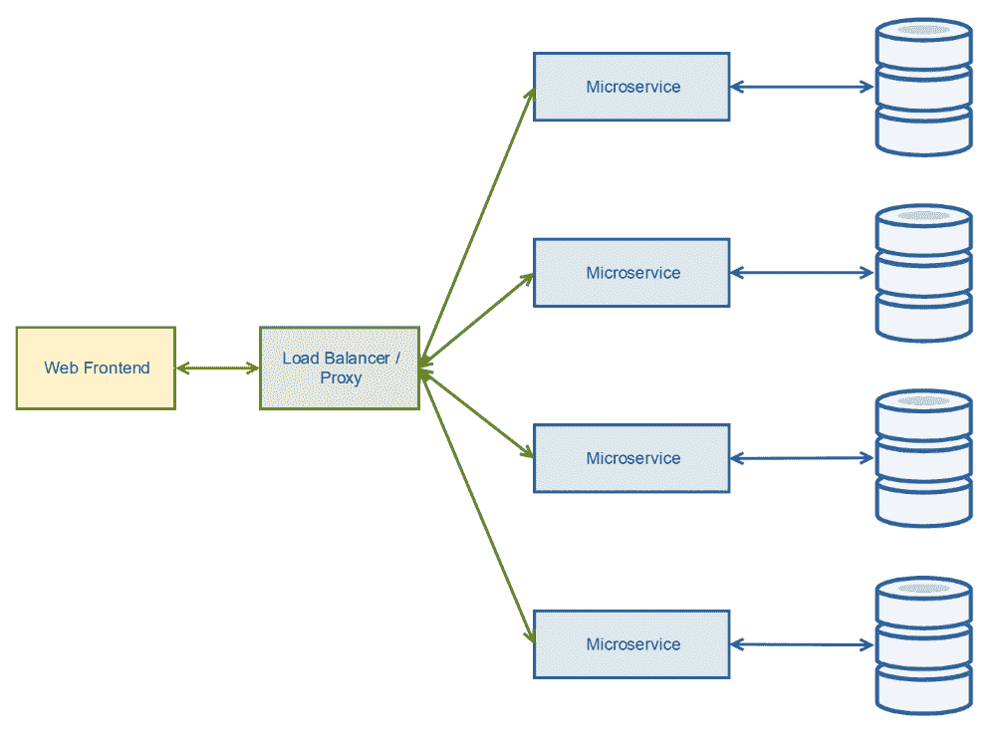

# 第十二章：OpenResty

本章将涵盖以下主题：

+   安装 OpenResty

+   开始使用 OpenResty Lua

+   使用 OpenResty 实现 Lua 微服务

+   一个简单的带 Redis 后端的点击计数器

+   用 OpenResty 提供 API 网关

# 介绍

如果你曾经想过是否可以动态地对 NGINX 进行一些更改，或者希望拥有更多的灵活性，那么你一定会喜欢 OpenResty。


把 OpenResty 想象成是 NGINX 与“厨房水槽”结合体；它是 NGINX 和 Lua 脚本，以及多个额外的第三方模块的组合，所有这些都被打包并准备好使用。Lua 脚本和额外模块的加入，使得 NGINX 能够扩展为一个完整的 Web 应用，而不仅仅是一个 Web 服务器。

有些人可能担心这些额外的功能会带来性能损失，但事实并非如此。像**Cloudflare**这样的巨大平台，使用 NGINX 和 Lua 的组合来实现其大规模的操作，而这正是 OpenResty 强大之处。实际上，OpenResty 的原创者张益春曾在 Cloudflare 工作并参与 OpenResty 项目，现已成立了一个独立的 OpenResty 基金会，以推动平台的未来发展。

这种强大功能使得复杂的场景，例如**Web 应用防火墙**（**WAFs**），能够在网站级别紧密集成，从而将每个站点的灵活性与 NGINX 知名的高速性能结合起来。实际上，许多公司已经开始使用 OpenResty 作为其完整框架，尤其适合简单的微服务驱动系统。

这只是众多示例中的一个。在本章中，你将看到 OpenResty 在很多场景下非常适合使用 NGINX 的同时，还能加入一些动态的特性。

# 安装 OpenResty

OpenResty 为大多数 Linux 发行版提供了简便的安装包，同时也有适用于 Windows 和 OS X 的二进制安装包。由于大多数生产部署将主要基于 Linux，因此我们将专注于 Linux 来进行教程。

# 准备就绪

如果你已经安装了 NGINX，你需要先卸载它，以避免与其他软件产生冲突。

# 如何操作...

大多数主要的 Linux 发行版都有官方仓库，但我们将专注于 CentOS 7 和 Ubuntu 16.04 LTS，涵盖这两种最常见的场景。

# CentOS

要添加仓库，首先需要安装 `yum-utils` 包。通过它，创建仓库就像一行命令那样简单：

```
yum install -y yum-utils  
```

安装了 `yum-utils` 后，我们可以在服务器上创建 `openresty` 仓库：

```
yum-config-manager --add-repo https://openresty.org/package/centos/openresty.repo  
```

这将自动获取远程仓库文件，并将其放置在正确的位置。

安装并启用仓库后，我们可以安装 OpenResty：

```
yum install -y openresty  
```

这将安装最新的 OpenResty 包及其所有所需的依赖项。

要使服务在启动时自动启动，我们可以通过 `systemd` 启用它：

```
systemctl enable openresty  
```

你也可以通过 `systemd` 启动该服务：

```
systemctl start openresty  
```

这将启动 NGINX，并且会预先配置所有 OpenResty 的附加功能。由于它带有一个简单的配置（就像 NGINX 默认安装的配置一样），你可以快速打开浏览器并通过 IP 地址查看输出，以确认它是否正常工作：


# Ubuntu

要在基于 Ubuntu 的系统上安装 OpenResty，首先我们需要导入用于签名包的 **GPG** 密钥：

```
wget -qO - https://openresty.org/package/pubkey.gpg | apt-key add -
```

和 CentOS 安装一样，我们可以使用辅助包来简化仓库的安装。要安装它，使用以下命令：

```
apt install -y software-properties-common  
```

我们现在可以安装 OpenResty 的仓库，并刷新 `package` 索引：

```
add-apt-repository -y "deb http://openresty.org/package/ubuntu $(lsb_release -sc) main"
apt update  
```

安装完仓库后，我们现在可以安装 OpenResty 包：

```
apt install -y openresty  
```

一旦所有依赖项和 OpenResty 包安装完成，你现在可以设置服务在启动时自动启动，然后启动服务以进行测试。你可以通过 `systemd` 来完成此操作：

```
systemctl enable openresty
systemctl start openresty
```

如果没有看到任何错误，你将能够浏览到你的服务器（或虚拟机）的 IP 地址，并看到 OpenResty 测试页面，正如前面 CentOS 安装说明中所示。

# 它是如何工作的...

配置文件和系统库的位置与标准 NGINX 安装有所不同，因此记住这些位置很重要。默认情况下，OpenResty 安装在 `/usr/local/openresty`。例如，如果你查找 NGINX 配置文件，它们将存储在 `/usr/local/openresty/nginx/conf`。

如果你查看标准的 NGINX 配置文件，你将不会看到与标准包有任何实质性的区别。因为 OpenResty 本质上只是带有额外模块的 NGINX，所以你可以轻松地将现有的 NGINX 配置（例如本书中涉及的任何配置）与 OpenResty 的附加模块结合，扩展其功能。

我们可以通过运行以下命令来确认这些模块是否可用：

```
/usr/local/openresty/bin/openresty -V  
```

这应该会给出类似于以下内容的输出：

```
nginx version: openresty/1.11.2.3
built with OpenSSL 1.0.2k  26 Jan 2017
TLS SNI support enabled
configure arguments: --prefix=/usr/local/openresty/nginx --with-cc-opt='-O2 -I/usr/local/openresty/zlib/include -I/usr/local/openresty/pcre/include -I/usr/local/openresty/openssl/include' --add-module=../ngx_devel_kit-0.3.0 --add-module=../echo-nginx-module-0.60 --add-module=../xss-nginx-module-0.05 --add-module=../ngx_coolkit-0.2rc3 --add-module=../set-misc-nginx-module-0.31 --add-module=../form-input-nginx-module-0.12 --add-module=../encrypted-session-nginx-module-0.06 --add-module=../srcache-nginx-module-0.31 --add-module=../ngx_lua-0.10.8 --add-module=../ngx_lua_upstream-0.06 --add-module=../headers-more-nginx-module-0.32 --add-module=../array-var-nginx-module-0.05 --add-module=../memc-nginx-module-0.18 --add-module=../redis2-nginx-module-0.14 --add-module=../redis-nginx-module-0.3.7 --with-ld-opt='-Wl,-rpath,/usr/local/openresty/luajit/lib -L/usr/local/openresty/zlib/lib -L/usr/local/openresty/pcre/lib -L/usr/local/openresty/openssl/lib -Wl,-rpath,/usr/local/openresty/zlib/lib:/usr/local/openresty/pcre/lib:/usr/local/openresty/openssl/lib' --with-pcre-jit --with-ipv6 --with-stream --with-stream_ssl_module --with-http_v2_module --without-mail_pop3_module --without-mail_imap_module --without-mail_smtp_module --with-http_stub_status_module --with-http_realip_module --with-http_addition_module --with-http_auth_request_module --with-http_secure_link_module --with-http_random_index_module --with-http_gzip_static_module --with-http_sub_module --with-http_dav_module --with-http_flv_module --with-http_mp4_module --with-http_gunzip_module --with-threads --with-file-aio --with-dtrace-probes --with-http_ssl_module

```

我们可以确认已经安装了额外的模块，如 `lua_upstream` 和 `luajit`，它们构成了 OpenResty 的核心功能。

# 另见

有关官方安装说明，请参阅 `openresty.org/en/installation.html`。

# 开始使用 OpenResty Lua

OpenResty 的一个关键优势是内置的 Lua 脚本语言。对于那些不熟悉 Lua 的人来说，它是一种高性能且轻量级的脚本语言。这就是为什么，当它与 NGINX 事件引擎结合时，能产生非常强大的组合效果。

作为一种动态类型和解释型语言，Lua 类似于其他脚本语言，如 JavaScript，但也有一些细微的差别（特别是在语法上）。如果你是 Lua 新手，那么阅读一些基础教程以熟悉语法和差异是值得的。

# 准备工作

对于这个食谱，我们将使用标准的 OpenResty 模块，因此无需进行其他更改即可开始使用。

# 如何实现...

我们将从使用 OpenResty 和 Lua 中最基本的功能之一开始，那就是 `content_by_lua_block` 块指令。这个指令允许我们直接在 NGINX 配置中插入 Lua 代码，提供快速和动态的变更。第一个食谱返回一个基本字符串：

```
location /simpletest { 
    default_type 'text/plain'; 
    content_by_lua_block { 
        ngx.say('This is a simple test!') 
  } 
} 
```

如果你浏览该 URL（或使用 cURL 发起请求），你应该会看到 `This is a simple test` 作为 HTTP 响应。使用简单的 Apache Benchmark 对该 URL 进行压力测试（仅为展示基准性能）表明，它可以在配置适中的虚拟机上每秒提供超过 20,000 次的服务。尽管代码并不复杂，但它确实展示了添加 Lua 的开销对性能的影响非常小。

如果你需要将数据以 JSON 格式返回，那么这也是非常简单的。使用我们之前使用的基本示例，我们可以利用 Lua CJSON 库（默认与 OpenResty 一起编译）来编码输出：

```
location /simplejsontest { 
        default_type 'application/json'; 
        content_by_lua_block { 
            local cjson = require "cjson.safe" 
            ngx.say(cjson.encode({test="Encoded with CJSON",enabled=true})) 
      } 
    } 
```

如果我们访问 `/simplejsontest` URL，你应该看到以下输出：

```
{"test":"Encoded with CJSON","enabled":true}

```

当然，这仅仅是 Lua 可以实现的功能的冰山一角，但至少它能让你入门。

# 它是如何工作的...

在这两个食谱中，我们都使用了 Lua 模块来提供（尽管是简单的）基于 Lua 代码的输出。虽然代码与 NGINX 配置行内执行，但它直接在每个工作进程中运行。这为其提供了巨大的并发能力，而 Lua 的原生速度使它非常强大。

# 另见

有关 Lua 模块的更多细节，请参考 [`github.com/openresty/lua-nginx-module#readme`](https://github.com/openresty/lua-nginx-module#readme)。

# 使用 OpenResty 的 Lua 微服务

OpenResty 的一个最快且自然的扩展方式是直接创建和运行一个微服务，而不是将其代理到另一个外部服务。对于不熟悉微服务的人来说，这是一种将软件平台拆分成小的独立服务，而不是单一的庞大系统的方法。以下是 Web 应用程序中服务可能的基本图示：



这意味着每个微服务可以根据需要独立升级、变更和扩展；保持单一任务意味着代码应该更容易管理。

# 准备工作

在这个食谱中，我们将专注于一个微服务。在真实的部署中，这些微服务的数量可能高达 150 个，用于一个复杂的平台，许多通常在 10 到 30 个之间。

对于这个微服务，我们将利用内置的 Lua DNS 模块（`lua-resty-dns`）来提供解析工具并返回 JSON 格式的结果。作为实际的例子，我们将查询**邮件交换器**（**MX**）记录。这可能是用于电子邮件迁移、反垃圾邮件验证或类似功能的平台的一部分，通常需要 NGINX 将连接代理到外部应用程序。

# 如何操作...

为了创建我们的微服务，我们将创建一个`location`块指令，内容如下：

```
location /getmxrecords { 
    default_type 'application/json'; 
    content_by_lua_block { 
        local cjson = require "cjson.safe" 
        local resolver = require "resty.dns.resolver" 
        local r, err = resolver:new{ 
            nameservers = {"8.8.8.8"} 
        } 
        if not r then 
            ngx.say(cjson.encode({result="failed", 
                    message="Failed to initiate the resolver. 
                    Reason: "..err})) 
            return 
        end 

        local domain = ngx.var.arg_domain 
        if not domain or not string.match(domain, "[%w]*[%.]?[%w]*") then 
            ngx.say(cjson.encode({result="failed", 
                    message="Invalid domain entered"})) 
             return 
        end 
          local result, err = r:query(domain, { qtype = r.TYPE_MX }) 
         if not result then 
            ngx.say(cjson.encode({result="failed", 
                    message="Failed to return a result.
                    Reason: "..err})) 
            return 
         end 
           ngx.say(cjson.encode({result="success", records=result})) 
     } 
 } 
```

如果你浏览服务器的 IP 或名称，并传递域名作为 get 变量来进行测试，你应该会收到该域名的 MX 记录的 JSON 格式副本。例如，如果我们调用`http://openresty.nginxcookbook.com/getmxrecord/?domain=instagram.com`，你应该会看到以下内容：

```
    {"records":[{"exchange":"mxa-00082601.gslb.pphosted.com","preference":10,"class":1,"ttl":299,"name":"instagram.com","section":1,"type":15},{"exchange":"mxb-00082601.gslb.pphosted.com","preference":10,"class":1,"ttl":299,"name":"instagram.com","section":1,"type":15}],"result":"success"} 
```

一个域名可能有多个 MX 记录；这就是为什么在记录的 JSON 数据中返回一个数组的原因。

# 它是如何工作的...

我们首先加载 CJSON 和 Lua OpenResty DNS 模块，并通过设置`8.8.8.8`（Google 的免费开放解析器）来初始化 DNS 模块。

然后，我们解析`GET`参数，命名为 domain。通过 NGINX API，Lua 可以直接通过`domain`名称调用它。如果你想要的 get 变量名为 shop，你可以通过`ngx.var.arg_shop`调用它。

这通过确保变量已设置（例如，`GET`参数已传递）并检查基本域名来验证。Lua 中的正则表达式格式与更常见的**Perl 兼容正则表达式**（**PCRE**）略有不同，但概念是相同的。我们确保域名以字母数字字符开头（使用`%w`）；它们应该包含至少一个点（`.`）和字母数字字符。虽然这不是一个完美的验证器，但由于新的**顶级域**（**TLDs**）的出现，这使得验证变得更加困难。

在确保域名有效后，我们执行查询，指定查询类型为 MX。如果收到结果，将通过 CJSON 模块对其进行编码，返回 JSON 格式的结果。

# 还有更多...

在生产环境中，你可以使用标准的 NGINX 限流功能（如第九章，*高级功能*中所述）来限制此类服务的滥用，特别是当它直接暴露到互联网时。OpenResty 的优势在于，你仍然可以使用 NGINX 的全部功能，而不仅仅是它所提供的增强功能。

# 另见

+   有关 Lua-resty-dns 模块的更多信息，请参阅[`github.com/openresty/lua-resty-dns`](https://github.com/openresty/lua-resty-dns)

+   有关 Lua NGINX API 变量的更多信息，请参阅[`github.com/openresty/lua-nginx-module#ngxvarvariable`](https://github.com/openresty/lua-nginx-module#ngxvarvariable)

# 带有 Redis 后端的简单访问计数器

一个简单的例子展示了 OpenResty 的可扩展性，使用一个基本的访问计数器。更进一步，我们将使用 Redis 后端，使得计数器既持久化，又能作为集群部署的一部分，提供一个合并的访问计数器。这也将向你介绍 OpenResty 如何直接与许多其他服务进行交互，而不仅仅是代理连接或通过 FPM。

在每一处优化都至关重要的部署环境中，我们也可以利用这一点直接从 Redis 中获取缓存数据，这样应用服务器就可以以异步的方式将缓存数据写入 Redis。

# 准备工作

我们需要从这个服务器访问 Redis 守护进程或集群。这可以是一个完整的集群，或者你可以仅仅在同一台服务器上安装 Redis 和 OpenResty。

# 如何实现...

为了实现我们的简单访问计数器，我们将向主`nginx.conf`配置文件添加一个基本的 location 块指令。以下是需要添加的块指令：

```
location /redistest { 
    default_type 'text/plain'; 
    content_by_lua_block { 
        local redis = require "resty.redis" 
        local red = redis:new() 
        local ok, err = red:connect("127.0.0.1", 6379) 
        if not ok then 
            ngx.say("Failed to connect to the redis server, the error was: ", err) 
        end 
        local counter = red:get("counter") 
        if tonumber(counter) == nil then 
            counter = 0 
        end 
        counter = counter + 1 
        local ok, err = red:set("counter", counter) 
        ngx.say(counter) 
    } 
} 
```

如果我们访问`/redistest`这个 URL，每次刷新页面时，我们应该看到计数器增加。

# 工作原理...

我们再次使用了`content_by_lua_block`来返回内容，这包含了我们基本的计数器代码。它首先尝试在本地主机（`127.0.0.1`）上与 Redis 建立连接，如果连接失败，则返回错误。

如果连接成功，我们尝试从 Redis 中获取一个名为`counter`的值。如果没有数据或者获取到的是无效的数字，我们将计数器设置为`0`（零）。然后，我们增加 Lua 变量，以表示该 URL 已被访问。接着，计数器的值会通过`set`命令存回 Redis，并且返回一个值为计数器的纯文本，状态码为`200`（`ngx.say`的默认状态码）。

# 另见

有关`lua-resty-redis`模块的更多信息，请参阅[`github.com/openresty/lua-resty-redis.`](https://github.com/openresty/lua-resty-redis)

# 使用 OpenResty 为 API 网关提供支持

在我们之前的示例中，我们探讨了一个基本的微服务来查找 DNS 记录。虽然可以对每个服务进行限制以防止滥用，但理想情况下，我们希望配置一个集中点来管理这些限制。否则，跨多个服务的任何限制将不会作为一个整体来考虑，而需要在每个服务中单独实现。以下图示解释了这些差异：


要构建一个集中式的 API 网关，我们需要考虑以下几点：

+   身份验证

+   请求路由

+   限流

+   负载均衡

+   安全性

+   日志记录

本示例将涵盖 API 网关的基本实现，帮助你了解一些核心概念。由于实现简单，它提供了一种快速的方式，让你开始管理一些小型的微服务。

# 准备工作

因为我们将集中一些信息，所以我们需要访问一个从服务器可访问的 **Redis** 守护进程。这可以是一个完整的集群，也可以是将 Redis 安装在与 OpenResty 相同的服务器上。

为了拥有一个测试 URL，你可以通过 `redis-cli` 设置，使用以下命令：

```
redis-cli SET /api/v1/test http://localhost/simpletest  
```

# 如何做…

我们的 API 网关将是一个简化版的生产系统，确保易于跟随。由于基于 OpenResty，它意味着可以轻松扩展以适应你的需求。

在我们的 `nginx.conf` 文件（位于 `/usr/local/openresty/nginx/conf`）中，添加以下脚本：

```
location /proxy/ { 
    rewrite /proxy/(.*) /$1  break; 
    allow 127.0.0.1; 
    deny all; 
    proxy_pass $1; 
} 

location /api { 
    default_type 'application/json'; 
    access_by_lua_file apigateway/auth.lua; 
    content_by_lua_file apigateway/route.lua; 
} 
```

与之前的教程不同，我们这次将代码分离到单独的文件中，以便管理。在 `nginx` 目录下（位于主 `OpenResty` 目录内），我们创建了一个 `apigateway` 目录来存储文件，以方便管理。以下是 `auth.lua` 文件的代码：

```
local cjson = require "cjson.safe" 
local allowedkeys = {"abc123", "def456", "hij789"} 
local function badAuth() 
    ngx.status = 401 
    ngx.say(cjson.encode({status="error",
             errmessage="Authentication Failed"})) 
    ngx.exit(401) 
end 

local function isAuthorised (key) 
    for index, value in ipairs(allowedkeys) do 
        if value == key then 
            return true 
        end 
    end 
    return false 
end 

local authKey = ngx.req.get_headers()["X-API-KEY"] 
if authKey == nil then 
    badAuth() 
elseif not isAuthorised(authKey) then 
    badAuth() 
end 
```

接下来，我们将创建一个文件来存储路由应用程序代码，命名为 `route.lua`：

```
local cjson = require "cjson.safe" 
local redis = require "resty.redis" 

local red = redis:new() 
local ok, err = red:connect("127.0.0.1", 6379) 
if not ok then 
    ngx.say(cjson.encode({status="ok", errormessage=
         "Failed to connect to the redis server, the error was: "..err})) 
    ngx.exit(500) 
end 

local apiroute = red:get(ngx.var.uri) 
if apiroute == ngx.null then 
    ngx.say(cjson.encode({status="error", errormessage=
            "no service at this path"})) 
    ngx.exit(404) 
end 
res = ngx.location.capture("/proxy/"..apiroute) 
if res then 
    ngx.say(cjson.encode({status="ok", result=res.body})) 
else 
    ngx.say(cjson.encode({status="error", 
            errormessage="service failed to return a result"})) 
    ngx.exit(500) 
end 
```

我们可以通过在有和没有 `X-API-KEY` 头的情况下运行调用来测试身份验证。如果没有头部，我们可以浏览 URL 或使用 cURL 发送 `GET` 请求到 `/api/v1`，并且应该显示如下内容：

```
{"status":"error","errmessage":"Authentication Failed"}  
```

相反，在设置了正确的头部的情况下，我们应该看到返回的预期结果。要测试这个，我们可以运行以下命令：

```
curl -H "X-API-KEY: abc123" http://openresty.nginxcookbook.com/api/v1/test  
```

返回的值应该如下所示：

```
{"status":"ok","result":"This is a simple test!\n"}  
```

# 它是如何工作的…

这篇教程涉及了很多内容，所以我们将分段进行讲解。首先，核心的 NGINX 配置有两个主要部分。第一个是代理位置块指令，我们用它来进行外部请求。这是因为在 `route.lua` 中，`location.capture` 函数仅适用于内部请求。虽然在本教程中我们只进行了内部请求，但有了这个 `proxy_pass` 指令，我们可以轻松地将外部调用纳入其中。它只是将远程请求作为 URI 的一部分传递出去。我们还将它锁定（使用 `allow` / `deny`）为本地主机，以防止外部滥用。

接下来，我们定义了 API 位置块指令。为了保持主配置文件中的代码整洁，我们将配置存储在外部文件中，以便更容易管理代码。

我们的 `auth.lua` 文件包含我们的身份验证代码。为了简化此教程，我创建了一个基本的表类型（即关联数组）来存储一些测试 API 密钥；对于生产系统，这些密钥应该从外部数据源中提取。

接着我们定义了一个 `badAuth` 函数，它为我们提供了一种简单的方法来返回 `HTTP 401` 错误，通知客户端连接没有被授权。

我们定义的下一个函数是 `isAuthorised`。它简单地遍历我们的允许的 API 密钥表，以确定是否有匹配项。

最后，我们提取 `X-API-KEY` 头来查询其值。如果它为 nil，即头部未设置，我们使用 `badAuth` 返回 `401`。如果不为 nil，我们使用 `isAuthorised` 函数判断是否匹配。如果匹配，代码便不再执行任何操作，OpenResty 将开始处理内容组件。

这将我们引导到包含在 `route.lua` 文件中的路由代码。与之前的方案一样，我们连接到了 Redis 服务器，这用于提供动态路由。这意味着，要更改端点或提供新的 API 功能，无需重启 API 网关即可检测到这些变化。

为了获取要调用的端点 URI，我们使用 `ngx.var.uri` 作为键。在我们的示例中，这已经配置为 `/api/v1/test`。如果它存在，我们使用 `ngx.location.capture` 将其代理并检索数据。数据成功返回后，便会发送回客户端，并使用 `CJSON` 模块将其解析为 JSON。如果发生错误，我们会返回一个错误信息，并将 HTTP 状态设置为 `500`。

# 更多内容...

这个方案中缺少的一个功能是 **限流**。我们可以再次使用标准的 NGINX 模块，或者使用 `lua-resty-limit-traffic` 模块来提供扩展功能；另外，你也可以选择一个功能全面的 API 系统，如 Kong：


基于 OpenResty，Kong 提供了一个高度可配置的 API 网关和微服务管理系统，具有如 REST 基础管理、简易的横向扩展以及模块化插件系统等特性，方便扩展。身份验证功能，如 OAuth、JWT、LDAP 等，均可开箱即用，同时还具备 ACL 和 COR 等安全特性，以提供高水平的保护。

如果你超越了几个基本服务，或者想将你的 API 提供给公众，考虑 Kong 作为起点是非常值得的。

# 另见

+   想了解更多 **Lua NGINX API 变量**，请参考 [`github.com/openresty/lua-nginx-module#ngxvarvariable`](https://github.com/openresty/lua-nginx-module#ngxvarvariable)

+   想了解更多 **OpenResty FAQ**，请参考 [`openresty.org/en/faq.html`](https://openresty.org/en/faq.html)

+   你可以访问 **Kong** 的官方网站：[`getkong.org/`](https://getkong.org/)
