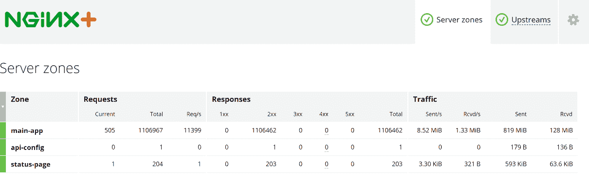

# 第十三章：NGINX Plus – 商业版本

在本章中，我们将涵盖以下内容：

+   安装 NGINX Plus

+   实时服务器活动监控

+   动态配置重新加载

+   会话持久性

# 介绍

虽然大多数人熟悉的是开源版本的 NGINX，但 Nginx Inc 也推出了付费的商业版本，该版本具备多项额外功能，专为企业和大规模部署设计。具有详细的实时监控、负载均衡器的应用健康检查、动态配置重新加载等功能，因此考虑使用 Plus 版本是有充分理由的。

尽管有人可能认为起始价格为 2500 美元相对于开源版本而言偏高，但这些额外的功能使其与价格超过十倍的商业系统竞争。可以说，一旦这些功能对您的业务变得至关重要，价格是非常值得的。您还将支持 NGINX 的持续开发，而大多数使用 Plus 版本的组织仍在运行这个版本。

# 安装 NGINX Plus

和其开源版本一样，NGINX Plus 可以通过 NGINX 提供的官方仓库轻松安装。

# 准备工作

如果您已经安装了 NGINX，则需要先卸载它，以防止冲突。由于 NGINX Plus 是一款付费产品，您还需要一个许可证密钥来完成安装。您可以从 NGINX 商店购买此许可证，或者请求一个试用许可证，在购买之前评估功能。

# 如何操作...

大多数主要的 Linux 发行版都有官方仓库，但我们将专注于 CentOS 7 和 Ubuntu 16.04 LTS，来涵盖最常见的两种情况。

# CentOS

1.  首先，我们需要创建一个目录来存储仓库证书：

```
      mkdir -p /etc/ssl/nginx
```

1.  接下来，您需要从 NGINX 客户门户 ([`cs.nginx.com`](https://cs.nginx.com)) 下载私钥和公钥证书，文件名应该是：

```
      nginx-repo.key
      nginx-repo.crt
```

1.  将这些文件复制到创建的目录中。然后我们可以确保根 CA 证书包已安装：

```
      yum install -y ca-certificates
```

1.  现在我们可以安装 NGINX Plus 仓库：

```
      yum-config-manager --add-repo \
      https://cs.nginx.com/static/files/nginx-plus-7.repo
```

1.  在仓库密钥准备好并安装完仓库之后，我们现在可以安装 NGINX Plus：

```
      yum install -y nginx-plus
```

1.  如果您有正确的密钥，这将安装 NGINX Plus。您可以通过检查版本来确认安装是否正确：

```
      nginx -v
```

这应该会给出类似以下的输出：

```
      nginx version: nginx/1.11.10 (nginx-plus-r12-p3)
```

1.  最后，我们可以启动并确保 NGINX Plus 在启动后自动启动：

```
      systemctl enable nginx
      systemctl start nginx
```

NGINX Plus 的安装现已完成。

# Ubuntu

1.  首先，我们需要创建一个目录来存储仓库证书：

```
      mkdir -p /etc/ssl/nginx
```

1.  接下来，您需要从 NGINX 客户门户 ([`cs.nginx.com`](https://cs.nginx.com)) 下载私钥和公钥证书，文件名应该是：

```
      nginx-repo.key
      nginx-repo.crt
```

1.  将这些文件复制到创建的目录中，然后使用 `apt-key` 添加 NGINX 软件包签名密钥：

```
      wget http://nginx.org/keys/nginx_signing.key && apt-key add \  
      nginx_signing.key
```

1.  为确保我们拥有所需的前提条件，我们可以使用以下命令安装这些软件包：

```
      apt install -y software-properties-common apt-transport-https \
      lsb-release ca-certificates
```

1.  我们可以通过 `add-apt-repository` 命令添加 NGINX Plus 仓库：

```
      add-apt-repository -y \
      "deb https://plus-pkgs.nginx.com/ubuntu $(lsb_release -sc) main"
```

1.  在安装 NGINX Plus 包之前，我们需要先将已下载的密钥链接到安全的仓库。NGINX 提供了一个预配置的文件来执行此操作，我们可以将其下载到正确的位置：

```
      wget -q -O /etc/apt/apt.conf.d/90nginx \
      https://cs.nginx.com/static/files/90nginx
```

1.  在仓库设置并准备好之后，我们可以更新包信息，然后安装 NGINX Plus：

```
      apt update
      apt install nginx-plus
```

1.  如果你拥有正确的密钥，安装过程将会安装 NGINX Plus。你可以通过检查版本来确认安装是否正确：

```
      nginx -v
```

这应该会显示类似以下内容：

```
      nginx version: nginx/1.11.10 (nginx-plus-r12-p3)
```

1.  最后，我们可以启动并确保 NGINX Plus 在启动后自动启动：

```
      systemctl enable nginx
      systemctl start nginx
```

NGINX Plus 的安装现在已经完成。

# 另见

+   NGINX Plus 产品页面：[`www.nginx.com/products/`](https://www.nginx.com/products/)

+   NGINX Plus 安装指南：[`www.nginx.com/resources/admin-guide/installing-nginx-plus/`](https://www.nginx.com/resources/admin-guide/installing-nginx-plus/)

# 实时服务器活动监控

我们在第一章《让我们开始》中已经讨论了监控服务器的一些基础知识，使用了 `ngxtop` 工具来提供基本的命令行驱动的监控和统计。NGINX Plus 包含一个强大而全面的度量系统，可以显示 NGINX 服务器的实时活动。

正如你将在接下来的截图中看到的，这个系统相当全面。它不仅包括一个网页界面来查看统计信息，而且这些数据还可以作为 JSON 提要提供，便于外部监控工具直接导入。

# 准备工作

由于这是 NGINX Plus 包的一部分，你需要确保已经正确安装并配置了 NGINX Plus。你可以通过运行 `nginx -v` 来测试 NGINX Plus 是否已安装。这应该会显示类似以下内容：

```
nginx version: nginx/1.11.10 (nginx-plus-r12-p3)  
```

需要检查的关键部分是 `nginx-plus-r12-p3` 名称中的 *plus* 部分。

# 如何操作...

1.  为了使用状态模块，我们需要将其包含在 `server` 块指令中。你可以选择在与主 Web 服务器不同的端口上运行，并且通过 IP 限制访问，这正是我们在本食谱中要做的。以下是我们的配置：

```
      server { 
          listen 8188; 
          status_zone status-page; 

          allow 192.168.0.0/24; 
          deny all; 

          root /usr/share/nginx/html; 
          location = /status.html { } 
          location = / { 
              return 301 /status.html; 
          } 
          location /status { 
              status; 
              status_format json; 
          } 
      } 
```

这可以作为单独的文件（例如 `status.conf`）放置在 `/etc/nginx/conf.d/` 目录中，以保持整洁和简单。

1.  如果你打开浏览器并访问 `http://<serveripaddress>:8188/status.html`，你应该会看到类似以下截图的页面：


该页面只是一个 HTML 页面，但使用 JSON 数据来更新状态（默认每秒更新一次）。我们可以看到所有重要的服务器统计信息，例如连接、请求、正常运行时间和流量。

如果您配置了多个服务器区域，您可以单独查看每个区域的统计信息，以查看子系统的不同统计数据：



同样，如果您在负载均衡配置中使用 NGINX Plus，我们也可以查看与上游服务器相关的统计信息：


这些洞察使你能够实时精确地了解服务器的各个方面。

# 它是如何工作的…

我们使用`listen`指令告诉 NGINX Plus 在不同的端口上监听这个`server`块，以便将其与主连接隔离。在此示例中，我们让它监听`8188`端口。

接下来，我们设置`status_zone`，它需要在每个`server`或`http`块指令中定义，以便收集统计信息。在这个示例中，我们在统计块指令中只有一个名为`status-page`的区域。对于其他`server`块指令，您可以将它们合并为一个（例如，`backend-zone`）或单独跟踪，如果需要每个指令的唯一统计信息。

为了服务静态的`status.html`文件，我们定义了文件所在的根路径。然后，我们确保任何根路径请求（例如，没有尾部`/status.html`的请求）都会被重定向。

最后，我们设置`/status`位置来提供实际的统计数据。我们将其设置为 JSON 格式，这意味着它可以轻松地被其他许多系统接收。这也是驱动基于 HTML 的仪表板的基础。显示统计信息需要这一点。

# 还有更多…

HTML 仪表板当然只是使用统计数据的一种方式。因为我们可以直接访问 JSON 数据，所以可以从第三方监控系统中提取这些数据。例如，我们可以通过调用来查看有哪些信息可用：

```
curl http://202.74.71.216:8188/status  
```

这将生成基于 JSON 的输出，类似如下：

```
{"version":8,"nginx_version":"1.11.10","nginx_build":"nginx-plus-r12-p3", "address":"202.74.71.216", "generation":1,"load_timestamp":1503127483754, "timestamp":1503149700611, "pid":10008,"ppid":10007, "processes":{"respawned":0}, "connections":{"accepted":945523, "dropped":0,"active":1, "idle":0}, "ssl":{"handshakes":0, "handshakes_failed":0, "session_reuses":0}, "requests":{"total":5249054, "current":1}, "server_zones":{"status-page":{"processing":1, "requests":5249049, "responses":{"1xx":0, "2xx":4903722, "3xx":345306, "4xx":20, "5xx":0,"total":5249048}, "discarded":0, "received":566205691, "sent":16475272258}}, "slabs":{}, "upstreams":{}, "caches":{}} 
d 
```

您还可以将输出缩小到您需要的特定组件，例如，我们可以调用`/status/connections`仅获取关于连接的统计信息：

```
{"accepted":945526,"dropped":0,"active":1,"idle":0} 
```

不要忘记调整您的接受/允许设置和/或第三方监控系统的认证。

# 另见

NGINX Plus 状态模块的文档可在以下链接查看：[`nginx.org/en/docs/http/ngx_http_status_module.html`](https://nginx.org/en/docs/http/ngx_http_status_module.html)

# 动态配置重新加载

在大型高规模系统中，最小化停机时间至关重要。需要重启服务的更改需要仔细规划。如果您有一个**软件即服务**（**SaaS**）平台，在部署更改或新客户注册之前的延迟可能会对您的业务运营产生不利影响。

在负载均衡的情况下，系统停机可能也是必需的，您需要动态添加和移除应用程序后端。幸运的是，NGINX Plus 允许重新加载配置而无需重新启动服务。在这个示例中，我们将介绍如何通过动态重新加载来更新您的配置。

# 准备工作

我们使用了基于我们在第八章的负载均衡食谱的基本食谱。使用 NGINX 的开源版本时，需要完全重新加载 NGINX 配置才能使用新更改。虽然这对轻载系统的影响很小，但对于高负载系统来说，这可能是一个重大问题。因为它必须等待所有 NGINX 工作进程完成重新加载，所以系统在此期间无法像正常情况下那样处理相同的容量。

这是我们的场景如何呈现的：


# 如何操作...

1.  为了允许动态重新加载，我们将配置我们的`upstream`块指令，以及两个`server`块指令。与大多数 NGINX 配置一样，我们可以将其放在一个独立文件中（例如`loadbalancer.conf`），放置在`/etc/nginx/conf.d`目录中。以下是配置内容：

```
      upstream localapp { 
          zone backend 64k; 
          server 127.0.0.1:8080; 
          server 127.0.0.1:8081; 
          server 127.0.0.1:8082; 
      } 

      server { 
          listen       80; 
          server_name  dynamicload.nginxcookbook.com; 
          access_log  /var/log/nginx/dynamicload-access.log  combined; 
          location / { 
              proxy_pass http://localapp; 
          } 
      } 

      server { 
          listen 127.0.0.1:8189; 

          location /upstream_conf { 
              upstream_conf; 
          } 
      } 
```

您还可以使用 HTest 工具来轻松测试，如果这不是在生产环境之外模拟后端服务器。

1.  要在运行时更改此配置，我们可以从命令行调用 API 调用。首先，让我们获取现有配置的副本：

```
      curl 'http://localhost:8189/upstream_conf?upstream=localapp'
```

这应该打印出服务器列表，与我们已经加载的配置相匹配：

```
      server 127.0.0.1:8080; # id=0
      server 127.0.0.1:8081; # id=1
      server 127.0.0.1:8082; # id=2
```

1.  如果我们想要添加另一个后端，我们可以通过`curl`发送添加命令：

```
      curl 'http://localhost:8189/upstream_conf?add=&upstream=localapp&server=127.0.0.1:8083'
```

这应该会确认添加的新服务器：

```
      server 127.0.0.1:8083; # id=3
```

新服务器应立即可用，并且现在将成为轮询分配的一部分。

1.  类似地，我们也可以在运行时移除后端服务器。要删除服务器，我们使用分配的 ID 来将其移除：

```
      curl 'http://localhost:8189/upstream_conf?remove=&upstream=localapp&id=1'
```

这将回显剩余配置的服务器，例如：

```
      server 127.0.0.1:8080; # id=0
      server 127.0.0.1:8082; # id=2
      server 127.0.0.1:8083; # id=3
```

# 工作原理...

与标准的 NGINX 负载均衡器配置类似，我们首先定义一个`upstream`块指令。这定义了一个内存分配以存储配置，以便可以在运行时更新。

接下来，我们定义我们的标准`server`块指令。这与标准配置一样，简单地将连接代理到上游服务器。

最后，我们定义一个单独的块指令来处理`upstream_conf`模块。我们使用单独的`server`块指令将其绑定到本地主机上的特定端口，并防止意外暴露到互联网。

# 还有更多...

虽然我们的示例配置允许实时进行更改，但如果我们重新启动 NGINX Plus，这些更改不会持久化。为了确保这些更改在重启之间得以保持，我们可以添加一个`state`文件来管理当前的配置。这是通过更新`upstream`块指令来实现的。以下是我们更新后的配置：

```
upstream localapp { 
    zone backend 64k; 
    state /var/lib/nginx/state/servers.state; 
} 
```

我们添加了`state`指令，当上游配置发生变化时该指令会被更新，同时在 NGINX 重启时会重新读取该指令。该上游中的所有其他服务器指令也必须被移除，因为你不能将静态服务器配置与动态、有状态配置结合使用。状态文件本身是纯文本（并使用标准的 NGINX 服务器指令格式），但强烈不建议直接操作该文件。

# 另见

NGINX Plus 的`http_upstream_conf`模块文档可在此查阅：[`nginx.org/en/docs/http/ngx_http_upstream_conf_module.html`](https://nginx.org/en/docs/http/ngx_http_upstream_conf_module.html)

# 会话保持

如果你有一个负载均衡器和多个后端服务器的场景（如我们在第八章中讲解的*负载均衡*），可能会有一些复杂的情况，使得会话跟踪变得难以实现。虽然使用基于哈希的算法可以确保来自相同 IP 的请求被路由到相同的后端服务器，但这并不总能确保请求的平衡分配。

NGINX Plus 的一个关键特性是会话保持，其中来自同一客户端的请求需要在该会话的生命周期内发送到同一服务器。也称为“粘性”会话，这在支付系统中尤其重要，因为后端服务器之间的信息共享可能会受到限制。

# 准备工作

我们将重用我们简单的轮询负载均衡场景，并结合 NGINX Plus 中可用的各种会话保持选项。

# 如何操作...

有三种不同的方法来确保会话粘性，每种方法都有其优缺点。这里是一个简要总结：

+   `cookie`：这种方法在第一次请求时使用一个 cookie 来存储跟踪信息，以确保后续请求被路由到相同的后端服务器。由于这意味着修改头部信息，可能与所有系统不兼容。

+   `learn`：这是一种有状态的方法，它依赖于现有响应头中的数据来确定一个唯一的标识符，以跟踪请求。例如，大多数 Web 框架都有自己的会话 ID，可以利用它进行跟踪。这意味着无需修改数据。

+   `route`：最后，我们可以根据变量来路由请求，明确选择使用的上游服务器。尽管这与 Cookie 方法相似（路由也使用 Cookie 来帮助追踪），但明确选择服务器在有理由将不同客户端推送到不同服务器时非常有用。如果匹配特定变量，它还可以作为一种“功能开关”方法，用于将客户端路由到具有不同功能的更新服务器。

# 基于 Cookie 的追踪

1.  要配置基于 Cookie 的粘性会话，我们可以使用以下配置：

```
      upstream stickyapp { 
          server 127.0.0.1:8080; 
          server 127.0.0.1:8081; 
          server 127.0.0.1:8082; 
          sticky cookie cookbook expires=1h; 
      } 

      server { 
          listen       80; 
          server_name  session.nginxcookbook.com; 
          access_log  /var/log/nginx/sessiontest-access.log  combined; 
          location / { 
              proxy_pass http://stickyapp; 
          } 
      }
```

1.  在第一次请求时，NGINX 将设置一个 Cookie 来追踪所有后续的会话。您可以通过使用如 HTTPie 等工具查看接收到的 HTTP 头部来确认 Cookie：

```
      http http://session.nginxcookbook.com/
```

此输出应显示服务器头信息，其中将包含一个`Set-Cookie`头信息：

```
      HTTP/1.1 200 OK
      Connection: keep-alive
      Content-Length: 613
      Content-Type: text/html; charset=utf-8
      Date: Mon, 18 Aug 2017 15:39:37 GMT
      Server: nginx/1.11.10
      Set-Cookie: cookbook=df2b80dc43705d28db9be6f29fe58da3; expires=Mon,
      18-Aug-17 16:39:37 GMT
```

# 基于学习的追踪

1.  如果您能够利用应用程序中现有的唯一标识符来进行会话追踪，您可以避免创建更多的 Cookie。许多常见的 Web 框架将会话设置为 Cookie 进行追踪，因此，只要您知道 Cookie 的名称，就可以使用它。以下是我们配方的样子：

```
      upstream stickyapp { 
          server 127.0.0.1:8080; 
          server 127.0.0.1:8081; 
          server 127.0.0.1:8082; 
          sticky learn create=$upstream_cookie_sessionid 
          lookup=$cookie_sessionid zone=client_sessions:1m; 
      } 

      server { 
          listen       80; 
          server_name  session.nginxcookbook.com; 
          access_log  /var/log/nginx/sessiontest-access.log  combined; 
          location / { 
              proxy_pass http://stickyapp; 
          } 
      }
```

1.  测试时，您需要确保您的应用程序发送了一个设置为`sessionid`的 Cookie。

# 基于路由的追踪

1.  创建和确保一致会话的最后一种方法是通过路由。为了做到这一点，我们还需要告诉 NGINX Plus 如何解释路由。以下是我们的配置：

```
      map $cookie_route $route_cookie { 
          ~(?P<route>\w+)$ $route; 
      } 

      map $arg_route $route_uri { 
          ~ (?P<route>\w+)$ $route; 
      } 

      upstream stickyapp { 
          server 127.0.0.1:8080 route=server1; 
          server 127.0.0.1:8081 route=server2; 
          server 127.0.0.1:8082 route=server3; 
          sticky route $route_cookie $route_uri; 
      } 

      server { 
          listen       80; 
          server_name  session.nginxcookbook.com; 
          access_log  /var/log/nginx/sessiontest-access.log  combined; 
          location / { 
              proxy_pass http://stickyapp; 
          } 
          status_zone sticky-app; 
      } 
```

1.  对于这个配方，我们正在读取一个名为`route`的 Cookie，然后使用它来确定将请求持久性地发送到哪个服务器。为了测试，我们可以发送一个测试路由 Cookie，以确保它有效：

```
      curl --cookie 'route=server2' http://session.nginxcookbook.com/
```

每个请求应由标记为`server2`的上游服务器提供服务，您可以通过 HTest 工具或后端服务器的日志来验证这一点。

# 它是如何工作的...

对于我们的基于 Cookie 的会话追踪，我们设置了一个名为`cookbook`的 Cookie，用作会话持久性的追踪。这也设置了一个一小时的过期时间。如果需要更严格的限制，还可以显式设置域和路径。

我们的基于学习的追踪有三个已设置的变量。第一个，create，用于从`upstream`服务器追踪，我们通过查找设置的 Cookie 头（`Set-Cookie`）并使用命名模式`$upstream_cookie_<cookiename>`。对于我们的配方，`$upstream_cookie_sessionid`意味着我们匹配`sessionid`。

接下来，我们使用`lookup`变量来指定需要从客户端追踪的内容。这与 create 命令使用的追踪方法相似。此配方使用`$cookie_sessionid`模式，这意味着它将匹配名为`sessionid`的 Cookie 内容。

最后，由于这是有状态的，我们需要分配内存来存储查找表。这是通过`zone`变量完成的。在这个示例中，我们将该 zone 命名为`client_sessions`并分配了 1 兆字节的内存。这足够存储大约 8,000 个会话。默认情况下，这些会话只会持久化 10 分钟。因此，如果每 10 分钟内的用户数较多，或需要更长的超时时间，可能需要增加分配的内存。

# 另请参阅

NGINX Plus 的`http_upstream_conf`模块文档可以在以下网址查看：[`nginx.org/en/docs/http/ngx_http_upstream_conf_module.html#sticky`](https://nginx.org/en/docs/http/ngx_http_upstream_conf_module.html#sticky)
