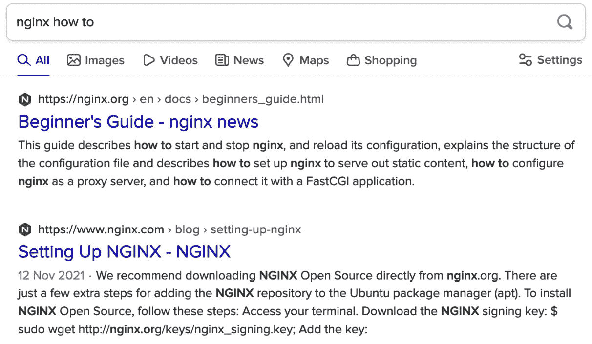
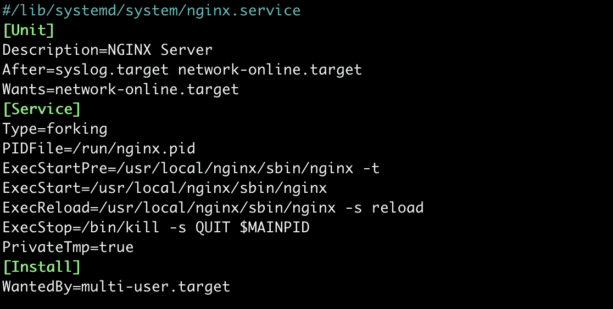

# 第一章：下载并安装 NGINX

**NGINX**（发音为*engine-x*）自 20 年前发布以来，已成为 Web 服务器中的领导者。2004 年，它的主要目标是超越 Apache，而今天，在高流量网站或安全性方面，NGINX 超越了所有其他 Web 服务器。在本书中，我们将一步步发现并学习如何使用 NGINX。我们将涉及多个主题，以便为每个人量身定制配置。

在本章的第一部分，我们将进行建立一个功能正常的 NGINX 配置所需的步骤。这一时刻对于确保您的 Web 服务器顺利运行至关重要——在安装 Web 服务器时需要一些必备的库和工具，在编译二进制文件时您需要决定一些参数，并且可能还需要对系统进行一些配置更改。

到本章结束时，您将通过公共仓库或通过编译定制版本（嵌入所有可能需要的额外模块）来安装 NGINX。

本章内容包括以下内容：

+   通过包管理器安装 NGINX

+   下载并安装编译 NGINX 二进制文件的前提条件

+   下载适合版本的 NGINX 源代码

+   配置 NGINX 编译时选项

+   使用`unit` `service`文件控制应用程序

+   配置系统在启动时自动启动 NGINX

+   快速概览 NGINX Plus 提供的功能

…

# 通过包管理器安装 NGINX

安装 NGINX 最快、最简单的方法是直接使用操作系统提供的版本。大多数情况下，这些版本都保持相对较新；然而，对于一些专注于稳定性的 Linux 发行版，您可能只能找到较旧的 NGINX 版本。有时，您的 Linux 发行版可能会提供多个版本的 NGINX，且具有不同的编译标志。

一般来说，在开始更复杂的操作之前，我们应当检查是否可以使用简单的解决方案。对于基于 Red Hat Linux 的操作系统，我们需要先启用 EPEL 仓库，然后进行相同操作：

```
yum install epel-release
yum search nginx
yum info PACKAGE_NAME
yum install PACKAGE_NAME
```

对于基于 Debian 的操作系统，我们首先查找可用的 NGINX 编译版本，然后获取我们需要的版本信息：

```
apt-cache search nginx
apt-cache show PACKAGE_NAME
apt install PACKAGE_NAME
```

如果提供的版本足够新，那么您已经准备好在下一章配置 NGINX 了。

如果您发行版提供的版本过旧，NGINX 也提供**RHEL/CentOS 发行版**以及**Debian/Ubuntu 发行版**的包。我们建议您访问 NGINX 官方网站，确保您发行版提供的版本不是过时的。

## NGINX 提供的包

要为 RHEL/CentOS 设置`yum`仓库，创建一个名为`/etc/yum.repos.d/nginx.repo`的文件，内容如下：

```
[nginx]
name=nginx repo
baseurl=http://nginx.org/packages/OS/OSRELEASE/$basearch/
gpgcheck=0
enabled=1
```

根据所使用的发行版，将`OS`替换为`rhel`或`centos`，将`OSRELEASE`替换为`8`或`9`，分别对应 8.x 或 9.x 版本。之后，您可以使用`yum`安装 NGINX：

```
yum install nginx
```

对于基于 Debian 的发行版，我们首先需要使用它们的签名密钥来验证软件包签名。首先从[`nginx.org/keys/nginx_signing.key`](http://nginx.org/keys/nginx_signing.key)下载以下文件。

然后，运行以下命令：

```
sudo apt-key add nginx_signing.key
```

添加密钥后，我们现在可以将 NGINX 的仓库添加到`/etc/apt/sources.list`中的`sources.list`文件里。对于 Debian 系统，我们添加以下行：

```
deb http://nginx.org/packages/debian/ codename nginx
deb-src http://nginx.org/packages/debian/ codename nginx
```

在这里，`codename`是`trixie`或`bookworm`，具体取决于你使用的 Debian 版本。对于 Ubuntu 系统，我们使用以下依赖项：

```
deb http://nginx.org/packages/ubuntu/ codename nginx
deb-src http://nginx.org/packages/ubuntu/ codename nginx
```

在这里，`codename`是`noble`、`focal`或`bionic`，具体取决于你使用的 Ubuntu 版本。最后，我们可以使用`apt`命令安装 NGINX：

```
apt update
apt install nginx
```

既然我们已经了解了如何从软件仓库安装 NGINX，接下来我们来看看如何从源代码编译它，并通过自定义模块获得额外的功能，这些模块在默认的 NGINX 中并不提供。

# 从源代码编译 NGINX

在某些情况下，从源代码编译 NGINX 是更可取的。它为我们提供了最大的灵活性，特别是在模块方面，这样我们可以根据预期的用途进行更好的定制。例如，我们可以为嵌入式硬件编译一个非常精简的版本。

此外，我们可以确保使用最新版本的 NGINX，并能使用所有新功能。然而请记住，当你从源代码安装软件时，你需要自行负责更新它。NGINX 和其他软件一样，偶尔会发现需要解决的安全问题。操作系统的软件包比源代码安装更容易更新，但只要你清楚需要自己维护它，就完全没有问题。

根据你在编译时选择的可选模块，你可能需要不同的前提条件。我们将引导你安装最常见的依赖项，如**GCC**、**PCRE**、**zlib**和**OpenSSL**。

## 安装 GNU 编译器集合

NGINX 是用 C 语言编写的，因此你首先需要在系统上安装一个编译工具，如**GNU 编译器集合**（**GCC**）。GCC 可能已经存在于你的系统中，但如果没有，你需要在继续之前先安装它。

注意

GCC 是一个免费的开源编译器集合，支持多种语言——如 C、C++、Java、Ada、Fortran 等。它是 Linux 世界中最常用的编译器套件，Windows 版本也有提供。支持大量处理器架构，如 x86、AMD64、PowerPC、ARM、MIPS 等。

按照以下步骤安装 GCC：

1.  首先，确保它没有在你的系统上安装：

    ```
    vary-yum for a Red Hat Linux-based distribution, apt for Debian and Ubuntu, yast for SUSE Linux, and so on. Here is the typical way to proceed with the download and installation of the GCC package:

    ```

    执行以下命令以安装`apt`：

    ```
    man utility. Either way, your package manager should be able to download and install GCC correctly, after having resolved dependencies automatically.
    ```

    ```

    ```

请注意，`apt`和`yum`命令不仅会安装 GCC，还会下载并安装构建源代码应用程序所需的所有常见依赖项，如代码头文件和其他编译工具。

## PCRE 库

`pcre` 和 `pcre-devel`。第一个提供了库的编译版本，而第二个则提供了开发头文件和编译项目所需的源代码，这在我们的情况下是必需的。

这里是一些示例命令，你可以执行这些命令来安装这两个软件包。

使用 `yum`，执行以下命令：

```
[root@server ~]# yum install pcre pcre-devel
```

或者你可以使用以下命令安装所有与 PCRE 相关的软件包：

```
[root@server ~]# yum install pcre*
```

如果你使用 `apt`，请使用以下命令：

```
[root@server ~]# apt install libpcre3 libpcre3-dev
```

如果这些软件包已经安装在系统中，你会收到类似 `nothing to do` 的消息；换句话说，包管理器没有安装或更新任何组件：


图 1.1：APT 显示 PCRE 库已经安装。

上述输出表明，`libpcre3` 和 `libpcre3-dev` 这两个组件已经存在于系统中。

## zlib 库

`zlib` 库为开发者提供了压缩算法。它在 NGINX 的多个模块中使用 `.gzip` 压缩时是必需的。同样，你可以使用包管理器安装这个组件，因为它是默认仓库的一部分。类似于 PCRE，你还需要安装 `zlib` 库及其关联的 `zlib-dev` 组件。

使用 `yum`，执行以下命令：

```
[root@server ~]# yum install zlib zlib-devel
```

使用 `apt`，执行以下命令：

```
[root@server ~]# apt install zlib1g zlib1g-dev
```

这些软件包安装速度很快，并且没有已知的依赖问题。

## OpenSSL

OpenSSL 项目是一个合作开发的项目，旨在开发一个强大、商业级、全功能的开源工具包，实施 **安全套接字层**（**SSL**）v2/v3 和 **传输层安全性**（**TLS**）v1 协议，并提供一个强大的通用加密库。该项目由全球志愿者社区管理，他们通过互联网进行沟通、规划并开发 OpenSSL 工具包及相关文档。如需更多信息，请访问 [`www.openssl.org`](https://www.openssl.org)。

NGINX 将使用 OpenSSL 库来提供安全的网页。因此，我们需要安装该库及其开发包。这个过程与之前相同——你需要安装 `openssl` 和 `openssl-devel`：

```
[root@server ~]# yum install openssl openssl-devel
```

使用 `apt`，执行以下命令：

```
[root@server ~]# apt install openssl libssl-dev
```

重要说明

请注意你所在国家的法律法规。有些国家不允许使用强加密技术。OpenSSL 和 NGINX 项目的作者、出版商以及开发者不对你违反法律或相关规定的行为负责。

现在，你已经安装了所有必要的前提条件，准备好下载并编译 NGINX 源代码。

# 下载并编译 NGINX 源代码

这种下载过程的方法将帮助我们发现服务器管理员、网站、社区和维基等相关的各种资源。我们还将简要讨论不同的版本分支，并最终选择最适合您设置的版本。

## 网站和资源

尽管 NGINX 是一个相对较新且不断发展的项目，但在 **万维网** (**WWW**) 上已经有大量的资源可供使用，并且有一个活跃的管理员和开发者社区。

官方网站 [`nginx.org/`](https://nginx.org/) 目前作为官方文档参考，并提供下载最新版本应用源代码和二进制文件的链接。还可以访问 [`www.nginx.com/resources/wiki/`](https://www.nginx.com/resources/wiki/) 提供的维基，里面有丰富的额外资源，比如针对不同操作系统的安装指南、与 NGINX 各种模块相关的教程等。

如果您需要帮助，有几种方式可以获取支持。如果您有具体问题，可以尝试在 NGINX 论坛上提问，地址是 [`forum.nginx.org/`](https://forum.nginx.org/)。活跃的用户社区会迅速回答您的问题。此外，NGINX 邮件列表也会通过 NGINX 论坛转发，是解决您可能遇到的任何问题的优秀资源。如果您需要直接帮助，IRC 频道 `#Nginx` 上总有一群常驻人员在互相帮助，频道地址为 `irc.libera.chat`。

另一个有趣的信息来源是博客圈。只需在您喜欢的搜索引擎中简单查询，应该能找到大量记录 NGINX、其配置和模块的博客文章：



图 1.2：记录 Nginx 的网站和博客

现在是时候前往官方网站，开始下载源代码以进行编译和安装 NGINX 了。在此之前，让我们先快速回顾一下可用的版本以及它们所包含的功能。

## 版本分支

Igor Sysoev，一位才华横溢的俄罗斯开发者和服务器管理员，于 2002 年发起了这个开源项目。从 2004 年的第一次发布到现在的版本，NGINX 的市场份额稳步增长。根据 2023 年 4 月在 [`www.netcraft.com/`](https://www.netcraft.com/) 的调查，NGINX 目前服务着全球近 26.23% 的网站。其功能众多，使得这个应用既强大又灵活。

目前项目有三个版本分支：

+   **稳定版本**：这个版本通常是推荐使用的，因为它得到了开发者和用户的认可，但通常会稍微滞后于主线版本。

+   **主线版本**：这是最新的可下载版本，包含最新的开发内容和错误修复。之前称为**开发版本**。尽管它通常足够稳定，可以安装在生产服务器上，但仍然有小概率遇到偶尔的 bug。因此，如果你更看重稳定性而非新颖性，建议选择稳定版本。

+   **旧版本**：如果你出于某些原因有兴趣查看旧版本，可以找到几个版本。

关于主线版本的一个常见问题是“*它们足够稳定，能够在生产服务器上使用吗？*”NGINX Wiki 的创始人和原始维护者 Cliff Wells 在 [`www.nginx.com/resources/wiki/`](https://www.nginx.com/resources/wiki/) 上表示，“*我通常使用并推荐最新的开发版本。它只让我碰了一次钉子！*”早期采用者很少报告严重问题。你可以根据自己的需要选择服务器使用的版本，知道本书中的指导适用于任何版本，因为 NGINX 开发者已经决定在新版本中保持向后兼容。你可以在官网的专门的变更日志页面找到更多关于版本变化、新增功能和 bug 修复的信息。

## 功能

从主线版本 1.25.2 开始，NGINX 提供了丰富的功能，尽管本书标题所示，这些功能并非全都与提供 HTTP 内容相关。以下是官网引用的 Web 分支的主要功能列表（[`nginx.org/`](https://nginx.org/)）：

+   提供静态文件和索引文件，自动索引；打开文件描述符缓存；加速的反向代理缓存；负载均衡和容错。

+   加速支持缓存 FastCGI、uWSGI、SCGI 和 memcached 服务器；负载均衡和容错；模块化架构。过滤器包括 gzipping、字节范围、分块响应、XSLT、SSI 和图像转换过滤器。如果通过代理或 FastCGI/uWSGI/SCGI 服务器处理，单个页面中的多个 SSI 包含可以并行处理。

+   SSL 和 TLS SNI 支持。

NGINX 还可以用作邮件代理服务器。尽管本书不会详细介绍这一部分，但以下内容将为你提供一些见解：

+   用户通过外部 HTTP 身份验证服务器重定向到 IMAP/POP3 后端

+   使用外部 HTTP 身份验证服务器进行用户身份验证，并将连接重定向到内部 SMTP 后端

+   身份验证方法：

    +   `USER/PASS, APOP,` `AUTH LOGIN/PLAIN/CRAM-MD5`

    +   `LOGIN,` `AUTH LOGIN/PLAIN/CRAM-MD5`

    +   `AUTH LOGIN/PLAIN/CRAM-MD5`

    +   **SSL 支持**

    +   **STARTTLS 和** **STLS 支持**

NGINX 与大多数计算机架构和操作系统兼容——Windows、Linux、macOS、FreeBSD 和 Solaris。该应用在 32 位和 64 位架构上都能正常运行。

## 下载和提取

一旦选择了要使用的版本，访问[`nginx.org/`](https://nginx.org/)并找到您希望下载的文件的 URL。将自己定位在`home`目录中，该目录将包含待编译的源代码，并使用`wget`下载文件：

```
[user@server ~]$ mkdir src && cd src
[user@server src]$ wget https://nginx.org/download/nginx-1.25.2.tar.gz
```

我们将使用版本`1.25.2`，这是截至 2023 年 9 月的最新稳定版本。下载后，请在当前文件夹中解压归档内容：

```
[user@server src]$ tar zxf nginx-1.25.2.tar.gz
```

您已经成功下载并解压了 NGINX。接下来的步骤是配置编译过程，以便获得一个完美适配您操作系统的二进制文件。

# 探索配置编译选项

从源代码构建应用程序通常有三个步骤——*配置*、*编译*和*安装*。配置步骤允许您选择一些选项，这些选项在程序构建后将不可编辑，因为它们直接影响项目的二进制文件。因此，这是一个非常重要的阶段，如果您不想后期遇到惊讶，比如缺少某个特定模块或文件被放置在随机文件夹中，您需要认真跟进此步骤。

该过程包括向随源代码一起提供的`configure`脚本添加某些选项。我们将介绍您可以启用的三种类型的选项，但首先让我们学习最简单的操作方式。

## 简单方式

如果由于某些原因，您不想麻烦进行配置步骤，比如为了测试目的，或者因为您将来还会重新编译应用程序，您可以简单地使用没有选项的`configure`命令。执行以下三个命令来构建并安装一个可用的 NGINX 版本：

```
[user@server nginx-1.25.2]# ./configure
```

运行此命令应启动一长串的验证过程，以确保您的系统包含所有必要的组件。如果配置过程失败，请确保再次检查先决条件部分，因为这是最常见的错误原因。有关命令失败的详细信息，您还可以参考`objs/autoconf.err`文件，该文件提供了更详细的报告。`make`命令将编译应用程序：

```
[user@server nginx-1.25.2]# make
```

只要配置顺利进行，这一步应该不会出现错误：

```
[root@server nginx-1.25.2]# make install
```

最后一步将把编译后的文件以及其他资源复制到安装目录，默认是`/usr/local/nginx`。根据`/usr/local`目录的权限设置，您可能需要以`root`用户身份登录才能执行此操作。

再次强调，如果您在没有配置的情况下构建应用程序，您将面临错过许多功能的风险，例如可选模块和我们接下来将要介绍的其他功能。

## 路径选项

在运行`configure`命令时，你将有机会启用一些开关，允许你为各种元素指定目录或文件路径。请注意，配置开关提供的选项可能会根据你下载的版本有所不同。以下列出的选项适用于稳定版本，即 1.25.2 版。如果你使用的是其他版本，请运行`./configure --help`命令来列出适用于你设置的可用开关。

使用开关通常包括将一些文本附加到命令行。以下是使用`--conf-path`开关的示例：

```
[root@server nginx]# ./configure --conf-path=/etc/nginx/nginx.conf
```

大多数情况下，默认的配置开关无需定制。然而，强烈建议你查看官方文档页面、`https`和一些库（如`geoip`、`gzip`、`zlib`或`pcre`）中的配置开关。请注意，在本书中，我们将按照**从源代码构建 NGINX**中的标准开关来编译 NGINX，并与流行 Linux 发行版中使用的已编译二进制文件对齐。

注意

请注意，这些配置不包括额外的第三方模块。有关安装插件的更多信息，请参考*第五章*。

## 构建配置问题

在某些情况下，`configure`命令可能会失败——在进行一长串检查后，你的终端可能会显示几个错误信息。在大多数（如果不是全部）情况下，这些错误与缺少前提条件或未指定路径有关。

在这种情况下，请仔细进行以下验证，以确保你具备编译应用程序所需的一切，并可选择参考`objs/autoconf.err`文件，以获取关于编译问题的更多详细信息。此文件在`configure`过程中生成，将告诉你具体是哪个环节失败。

### 确保你已安装前提条件

基本上有四个主要的前提条件：GCC、PCRE、`zlib`和 OpenSSL。后三者是必须安装的库，分为两个包：库本身和其开发源代码。确保你已为每个库安装了这两部分。请参考本章开头的前提条件。请注意，其他前提条件（如`LibXML2`或`LibXSLT`）可能是启用额外模块所必需的（例如，在 HTTP XSLT 模块的情况下）。

如果你确定所有的前提条件已经正确安装，那么问题可能出在`configure`脚本无法找到必要的文件。在这种情况下，请确保你包含了与文件路径相关的配置开关，如前所述。

例如，以下开关允许你指定 OpenSSL 库文件的位置：

```
./configure [...] --with-openssl=/usr/lib64
```

OpenSSL 库文件将会在指定的文件夹中查找。

### 目录存在且可写

始终记得检查显而易见的地方；每个人都会迟早犯下即使是最简单的错误。确保你放置 NGINX 文件的目录对运行配置和编译脚本的用户具有*读*和*写*权限。同时，确保 `configure` 脚本中的所有路径都是现有的、有效的路径。

## 编译和安装

配置过程至关重要——它根据所选的选项为应用程序生成一个 makefile，并对你的系统执行一长串的需求检查。一旦 `configure` 脚本成功执行，你就可以继续编译 NGINX。

编译项目相当于在项目源目录中执行 `make` 命令：

```
[user@server nginx-1.25.2]$ make
```

成功构建后，应该会出现一条最终消息：`make[1]: leaving directory`，后面跟着项目的源路径。

再次强调，编译时可能会出现问题。大多数问题可能源自缺少先决条件或指定的路径无效。如果出现这种情况，请重新运行 `configure` 命令，并仔细检查所有选项和先决条件配置。也有可能是你下载了一个过于新的先决条件版本，导致与旧版本不兼容。在这种情况下，最好的做法是访问缺失组件的官方网站并下载旧版本。

如果编译过程成功，你就可以进入下一步：安装应用程序。以下命令必须使用 `root` 权限执行：

```
[root@server nginx-1.25.2]# make install
```

`make install` 命令执行 makefile 中的 `install` 部分。换句话说，它执行一些简单的操作，如将二进制文件和配置文件复制到指定的 `install` 文件夹中。如果这些文件夹不存在，它还会创建用于存储日志和 HTML 文件的目录。除非系统遇到特殊错误（如存储空间或内存不足），否则 `make install` 步骤通常不会出问题。

注意

根据文件夹权限，你可能需要 `root` 权限才能将应用程序安装到 `/usr/local/` 文件夹中。

NGINX 现在已经准备好，因为它已经成功编译完成。在接下来的部分，我们将把 NGINX 转变为一个在后台运行的守护进程。

# 控制 NGINX 服务

在这一阶段，你应该已经成功构建并安装了 NGINX。默认情况下，输出文件的位置是 `/usr/local/nginx`，因此我们将在后续的示例中基于这个路径进行启动、停止、设置开机自启，并通过守护进程查看 NGINX 状态。

## 守护进程和服务

下一步显然是执行 NGINX。然而，在此之前，了解这个应用程序的性质非常重要。计算机应用程序有两种类型——一种是需要立即用户输入的，因此运行在前台，另一种则不需要，因此运行在后台。NGINX 属于后一种类型，通常被称为守护进程。守护进程的名称通常带有一个尾随的 `d`，这里可以提到几个例子——`httpd`（HTTP 服务器守护进程）是 Apache 在多个 Linux 发行版中的名称，`named` 是名称服务器守护进程。`cron` 是任务调度程序——虽然，如你所注意到的，NGINX 并非如此。当从命令行启动时，守护进程会立即返回提示窗口，而且在大多数情况下，甚至不会输出任何数据到终端。

因此，当启动 NGINX 时，你不会看到任何文本出现在屏幕上，提示符会立即返回。虽然这看起来有些令人吃惊，但相反，这是一个好兆头。这意味着守护进程已经正确启动，且配置没有包含任何错误。

## 用户和组

了解 NGINX 的进程架构至关重要，特别是它的各个进程运行的用户和组。设置 NGINX 时，最常见的麻烦源是无效的文件访问权限——由于用户或组配置错误，通常会导致 `403 Forbidden` HTTP 错误，因为 NGINX 无法访问请求的文件。

进程有两种级别，可能具有不同的权限集：

+   `root`。在大多数类 Unix 系统中，以 `root` 账户启动的进程可以在任何端口上打开 TCP 套接字，而其他用户只能在 `1024` 以上的端口上打开监听套接字。如果你不是以 `root` 启动 NGINX，标准端口如 `80` 或 `443` 将无法访问。

注意

允许你为工作进程指定不同用户和组的用户指令将不会被主进程考虑。

+   `user nobody`，且组将是 nobody（或 `nogroup`，取决于你的操作系统）。

## NGINX 命令行选项

NGINX 二进制文件接受命令行参数用于执行各种操作，其中包括控制后台进程。要获取完整的命令列表，可以使用以下命令调用 **帮助** 屏幕：

```
[user@server ~]$ cd /usr/local/nginx/sbin
[user@server sbin]$ ./nginx -h
```

接下来的几个部分将描述这些选项的目的。一些选项允许你控制守护进程，一些选项则让你对应用程序配置执行各种操作。

## 启动和停止守护进程

你可以通过运行没有任何选项的 NGINX 二进制文件来启动 NGINX。如果守护进程已经在运行，将会显示一条消息，提示指定端口已经有一个套接字在监听：

```
[emerg]: bind() to 0.0.0.0:80 failed (98: Address already in use) [...] [emerg]: still could not bind().
```

在此之后，你可以通过停止、重新启动或简单地重新加载配置来控制守护进程。控制是通过向进程发送信号来完成的，使用 `nginx -``s` 命令：

| **命令** | **描述** |
| --- | --- |
| `nginx -``s stop` | 立即停止守护进程（使用 `TERM` 信号） |
| `nginx -``s quit` | 优雅地停止守护进程（使用 `QUIT` 信号） |
| `nginx -``s reopen` | 重新打开日志文件 |
| `nginx -``s reload` | 重新加载配置 |

表 1.1：记住如何控制 nginx 守护进程的表格

当启动守护进程、停止它或执行任何前述操作时，首先会解析并验证配置文件。如果配置无效，任何提交的命令都会 *失败*，即使是停止守护进程也是如此。换句话说，在某些情况下，如果配置文件无效，你甚至无法停止 NGINX。

另一种终止进程的方式，仅在紧急情况下使用，是使用 `kill` 或 `killall` 命令并赋予 `root` 权限：

```
[root@server ~]# killall nginx
```

## 配置测试

正如你想象的那样，这个小细节可能会成为一个重要的问题，如果你不断修改配置。配置文件中的任何细微错误都可能导致服务失控——你将无法通过常规的 `init` 控制命令停止服务，显然它也会拒绝再次启动。

因此，以下命令在许多场合都非常有用。它允许你检查配置的语法、有效性和完整性：

```
[user@server ~]$ /usr/local/nginx/sbin/nginx -t
```

`-t` 选项代表 **测试配置**。NGINX 将重新解析配置并告知你配置是否有效。然而，一个有效的配置文件并不意味着 NGINX 一定会启动，因为可能还会有其他问题，比如套接字问题、路径无效或权限不正确等。

显然，在服务器生产环境中操作配置文件是一项危险的操作，应尽可能避免。此时的最佳实践是将新配置放入单独的临时文件中，并在该文件上进行测试。NGINX 提供了 `-``c` 选项来实现这一点：

```
[user@server sbin]$ ./nginx -t -c /home/user/test.conf
```

此命令将解析 `/home/user/test.conf` 并确保它是有效的 NGINX 配置文件。完成后，在确保新文件有效后，继续替换当前配置文件并重新加载服务器配置：

```
[user@server sbin]$ cp -i /home/user/test.conf usr/local/nginx/conf/nginx.conf
cp: erase 'nginx.conf' ? yes
[user@server sbin]$ ./nginx -s reload
```

## 其他选项

另一个在许多情况下可能派上用场的选项是 `-V`。它不仅会告诉你当前的 NGINX 构建版本，更重要的是，它还会提醒你在配置步骤中使用的参数——换句话说，它会列出你在编译前传递给 `configure` 脚本的命令选项：

```
[user@server sbin]$ ./nginx -V
nginx version: nginx/1.25.2 (Ubuntu)
built by gcc 11.4.0 (Ubuntu 11.4.0-1ubuntu1~22.04)
TLS SNI support enabled
configure arguments: --with-http_ssl_module
```

在这种情况下，NGINX 仅配置了 `--with-http_ssl_module` 选项。

为什么这如此重要？嗯，如果你尝试使用一个在预编译过程中没有通过 `configure` 脚本包含的模块，启用该模块的指令将导致配置错误。你最初的反应可能是想知道语法错误来自哪里。接下来的反应可能会是，你甚至怀疑自己是否根本就没有构建这个模块！运行 `nginx -V` 将回答这个问题。

此外，`-g` 选项允许你指定额外的配置指令，以防这些指令未包含在配置文件中：

```
[user@server sbin]$ ./nginx -g "timer_resolution 200ms";
```

在下一节中，我们将通过系统配置守护进程，使 NGINX 在你的 Linux 发行版上自动集成并运行。

# 将 NGINX 添加为系统服务

在本节中，我们将创建一个脚本，将 NGINX 守护进程转换为实际的系统服务。这将带来两个主要结果——守护进程将能够使用标准命令进行控制，更重要的是，它将在系统启动时自动启动，在系统关闭时自动停止。

## systemd 单元文件

到目前为止，大多数基于 Linux 的操作系统都使用 systemd 风格的 *服务文件*。Debian、Ubuntu、RHEL 和 CentOS 都使用 systemd；因此，这个服务文件应该在任何流行的 Linux 发行版中都能工作。还有其他初始化软件，如 System V 和 OpenRC；然而，我们将坚持使用更流行且得到最多支持的初始化方式。

在这个例子中，我们将使用官方 NGINX 网站提供的 NGINX 服务文件：

1.  使用以下命令创建文件：

    ```
    nano /etc/systemd/system/nginx.service
    ```



图 1.3：Nginx 的默认 systemd 服务文件

注意

确保你的路径是正确的，以及 `After=` 部分，它告诉 `systemd` 只在 `syslog.target` 和 `network-online.target` 之后执行 NGINX。在此处添加你自己的服务，例如数据库服务器、PHP 服务器等。

1.  一旦文件保存，使用 `systemctl daemon-reload` 重新加载 `systemd` 配置。然后，使用 `systemctl start nginx` 启动服务。你可以以相同的方式启动、停止和重启服务。要在启动时启用服务，请运行以下命令：

    ```
    disable instead of enable in the preceding command.
    ```

1.  你可以通过运行 `is-enabled` 命令检查你的 NGINX 服务器是否会启动：

    ```
    root@server:~# systemctl is-enabled nginx
    enabled
    ```

## 处理系统错误

有时，在使用 `systemd` 启动 NGINX 时，你会遇到错误。这里有一个例子：


图 1.4：通过 systemd 状态调试 Nginx

在这种情况下，你可以使用 `systemctl status nginx` 检查当前状态。大多数时候，这会告诉你为什么 NGINX 服务器无法启动：NGINX 配置文件通常因为拼写错误或遗漏字符而不正确。请确保在重新启动 NGINX 服务器之前仔细检查你的配置。

我们已经深入探讨了 NGINX 的编译选项以及其控制守护进程。如果你需要来自将 NGINX 发展至今日的专家的专业支持，NGINX Plus 可能适合你。

# NGINX Plus 所提供的可能性概览

截至 2013 年中期，NGINX 项目背后的公司 NGINX, Inc.也推出了一个名为 NGINX Plus 的付费订阅服务。这一公告令开源社区感到惊讶，但几家公司很快就跟进并报告了在性能和可扩展性方面的惊人改进。

高性能的 Web 公司 NGINX, Inc.今天宣布推出 NGINX Plus，这是流行的 NGINX 开源软件的完全支持版本，包含了先进的功能并提供专业服务。该产品由*Nginx Inc.*的核心工程团队开发和支持，并已通过订阅方式立即提供。

随着业务需求的快速变化，如向移动端的转型以及 Web 上动态内容的爆炸性增长，CIO 们不断寻找机会来提高应用性能和开发灵活性，同时减少对基础设施的依赖。NGINX Plus 提供了一种灵活、可扩展、广泛适用的解决方案，专为这些现代的分布式应用架构而设计。

考虑到定价计划（每年每实例$1,500）以及提供的额外功能，这个平台显然是针对那些希望将 NGINX 无缝集成到全球架构中的大型企业。NGINX 团队提供专业支持，并且对于多实例订阅可以提供折扣。本书仅涵盖 NGINX 的开源版本，不详细介绍 NGINX Plus 提供的高级功能。如需了解付费订阅的更多信息，请访问[`www.nginx.com/`](https://www.nginx.com/)。

# 总结

本章涵盖了一些关键步骤。我们首先确保你的系统包含了编译 NGINX 所需的所有组件。然后我们选择了适合你使用的版本分支——你是使用稳定版，还是选择一个更先进但可能不那么稳定的版本？在下载源代码并通过启用或禁用 SSL、GeoIP 等功能模块来配置编译过程后，我们编译了应用程序并将其安装到你选择的目录中。我们创建了一个`unit service`文件，并修改了系统启动顺序，以便调度启动该服务。

从这一刻起，NGINX 已经安装在你的服务器上，并随系统自动启动。你的 web 服务器已经具备功能，尽管它尚未实现最基本的功能——提供网站服务。托管网站的第一步将是准备一个合适的配置文件。下一章将涵盖 NGINX 的基础配置，并教你如何根据预期的访客群体和系统资源优化性能。
