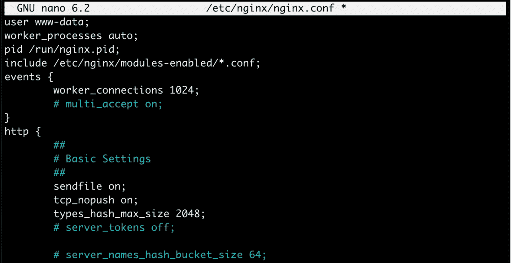
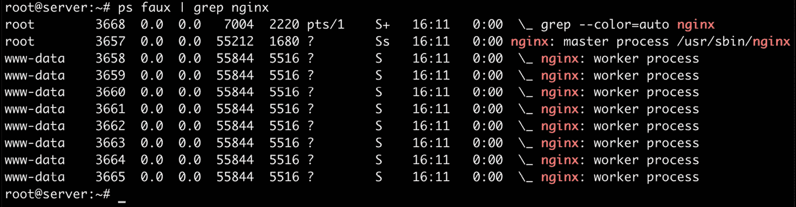
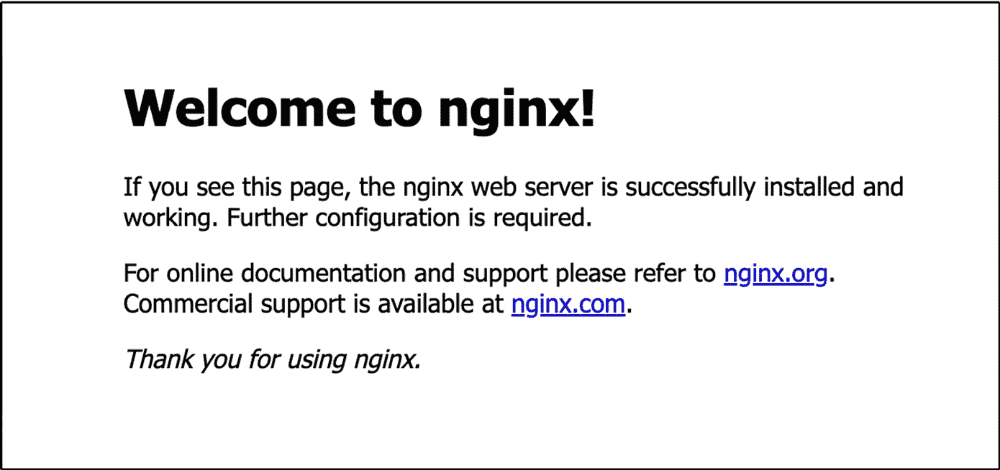

# 第二章：基本 NGINX 配置

在本章中，我们将开始为你的 Web 服务器建立适当的配置。为此，我们需要首先了解 NGINX 配置文件中使用的语法。然后，我们需要理解各种指令，这些指令将帮助你为不同的流量模式和硬件设置准备和优化 Web 服务器。最后，我们将创建一些测试页面，以确保一切配置正确且有效。这里我们只会讨论基本配置指令。本章以及接下来的章节将详细介绍更高级的主题，例如 HTTP 模块的配置和使用、创建虚拟主机和设置 SSL。

本章内容包括以下主题：

+   配置语法的展示

+   基本模块指令

+   测试和维护您的 Web 服务器

# 深入了解配置文件语法

配置文件通常是一个由管理员编辑并由程序解析的文本文件。通过指定一组值，你可以定义程序的行为。在基于 Linux 的操作系统中，大多数应用程序依赖于庞大而复杂的配置文件，这些文件往往令人头痛不已。Apache、Postfix 和 Bind——这些名字在 Linux 系统管理员的脑海中总会带来一些不愉快的回忆。

事实上，所有这些应用程序都使用各自的配置文件，语法和风格各不相同。PHP 使用 Windows 风格的 `.ini` 文件，Sendmail 使用 M4 宏处理器编译配置文件，Zabbix 从 MySQL 数据库中提取配置，等等。不幸的是，至今没有统一的标准，NGINX 也不例外——你需要学习一种具有自己特性和词汇的新语法：


图 2.1：一个在技术爱好者中很有名的讽刺标准情况的网站

注意事项

为什么没有统一的配置文件语法标准？一个可能的解释来自 *Randall Munroe*，他在 [`xkcd.com/`](https://xkcd.com/) 上给出了答案（已获授权转载）。

相反（这也是它的一个优点），配置 NGINX 其实相当简单，至少与 Apache 或其他主流 Web 服务器相比是如此。只有几个需要掌握的机制——*指令*、*块* 和 *整体逻辑结构*（将在 *第三章* 中讲解）。大部分实际的配置过程将涉及为指令编写值。

## 配置指令

NGINX 配置文件可以描述为一系列按照逻辑结构组织的指令。应用程序的整个行为由你为这些指令赋予的值来定义。

默认情况下，NGINX 使用一个主配置文件。该文件的路径在 *第一章*的 *构建配置问题* 部分中已定义。如果你没有编辑配置文件路径和前缀选项，它们应该位于 `/usr/local/nginx/conf/nginx.conf`。

然而，如果你通过包管理器安装了 NGINX，你的配置文件很可能位于 `/etc/nginx/nginx.conf`，而且该文件的内容可能与原始 NGINX 源代码包中的版本差异较大。现在，让我们快速浏览一下这个初始设置的前几行：



图 2.2：使用 nano 编辑 nginx.conf 文件

注意

默认的配置文件与 `Nginx` 源代码包一起捆绑提供。

让我们仔细看看前两行：

```
#user nobody;
worker_processes 1;
```

如你从 `#` 字符中可能看出，第一行是一个注释。换句话说，它是一段不会被解释并且没有任何实际意义的文本。它的唯一目的是供打开文件的人阅读，或暂时禁用现有配置部分。你可以在一行的开头或指令后使用 `#` 字符。

第二行是一个实际的声明——指令。第一部分（`worker_processes`）表示设置的键，后面附加一个或多个值。在这个例子中，值为 `1`，表示 NGINX 应该使用单个工作进程运行（关于这个指令的更多信息将在后续章节中提供）。

注意

指令总是以分号（`；`）结尾。

每个指令都有其独特的含义，定义了应用程序的某个特定特性。它还可能有特定的语法。例如，`worker_process` 指令只接受一个数字值，而 `user` 指令允许你指定最多两个字符字符串，一个用于用户账户（NGINX 工作进程应该以此身份运行），另一个用于 `user` 组。

NGINX 以模块化的方式工作，因此每个模块都有一组特定的指令。最基本的指令是 NGINX 核心模块的一部分，本章将详细介绍这些指令。至于其他模块带入的指令，将在后续章节中探讨。

## 组织与包含

在 *图 2.2* 中，你可能注意到了一条特别的指令——`include`：

```
include mime.types;
```

正如名称所示，这条指令将执行包含指定文件的操作。换句话说，文件的内容将在此位置插入。以下是一个实际的示例，帮助你理解：

+   `nginx.conf`：

    ```
    user nginx nginx;
    worker_processes 4;
    include other_settings.conf;
    ```

+   `other_settings.conf`：

    ```
    error_log logs/error.log;
    pid logs/nginx.pid;
    The final result, as interpreted by Nginx, is as follows:
    user nginx nginx;
    worker_processes 4;
    error_log logs/error.log;
    pid logs/nginx.pid;
    ```

包含操作是递归处理的。在这种情况下，你可以在 `other_settings.conf` 文件中再次使用 `include` 指令，来包含另一个文件。

在初始配置设置中，使用了两个文件——`nginx.conf`和`mime.types`。然而，在更高级的配置中，可能会有五个或更多文件，如下表所示： |

| **标准名称** | **描述** |
| --- | --- |
| `nginx.conf` | 应用程序的基础配置。 |
| `mime.types` | 一个文件扩展名及其关联的 MIME 类型的列表。 |
| `fastcgi.conf` | 与 FastCGI 相关的配置。 |
| `proxy.conf` | 与代理相关的配置。 |
| `sites.conf` | 由 NGINX 服务的网站的配置，也称为**虚拟主机**。建议为每个域名创建单独的文件。 |

表 2.1：详细列出默认包含的配置文件的表格 |

这些文件名是按照约定定义的；实际上没有任何东西阻止你将 FastCGI 和代理设置重新组合到一个名为`proxy_and_fastcgi_config.conf`的通用文件中。 |

`include`指令支持文件名模式匹配——换句话说，文件名可以使用`*`通配符，其中`*`可以匹配零个、一个或多个连续字符： |

```
include sites/*.conf;
```

这将包括`sites`文件夹中所有以`.conf`结尾的文件。这种机制允许你为每个网站创建一个单独的文件，并一次性包含它们。 |

在包含文件时请小心。如果指定的文件不存在，配置检查将失败，NGINX 将无法启动： |

```
[root@server nginx]# ./nginx -t
[emerg]: open() "/etc/nginx/dummyfile.conf" failed (2: No such file or directory) in /etc/nginx/nginx.conf:48
```

前述声明不适用于包含带有通配符的文件。更进一步，如果你将`include dummy*.conf`插入到配置中并进行测试（无论系统中是否有与此模式匹配的文件），应该发生的情况如下： |

```
[root@server nginx]# ./nginx -t
the configuration file /etc/nginx/nginx.conf syntax is ok configuration file /etc/nginx/nginx.conf test is successful
```

## 指令块 |

指令是由模块引入的；如果启用新模块，则会提供一组特定的指令。模块还可以启用**指令块**，允许逻辑构建配置： |

```
events {
    worker_connections 1024;
}
```

默认配置文件中可以找到的`events`块是由`events`模块引入的。该模块启用的指令只能在该块内使用。在前面的例子中，`worker_connections`只有在`events`块中才有意义。相反，一些指令必须放置在配置文件的根部，因为它们对服务器有全球性影响。配置文件的根部也被称为**主块**。 |

大多数情况下，块可以相互嵌套，遵循特定的逻辑。以下序列展示了一个简单网站设置的结构，使用了嵌套块： |

```
http {
    server {
        listen 80;
        server_name example.com;
        access_log /var/log/nginx/example.com.log;
        location ^~ /admin/ {
            index index.php;
       }
    }
}
```

最上层的指令块是`http`块，在其中你可以声明各种配置指令，以及一个或多个`server`块。`server`块允许你配置虚拟主机——换句话说，就是你打算托管在你机器上的网站。这个示例中的`server`块包含一些配置，它适用于所有`Host`头完全匹配`example.com`的 HTTP 请求。

在这个`server`块中，你可以插入一个或多个`location`块。这些块允许你仅在请求的 URI 与指定的路径匹配时启用设置。更多信息请参见*第三章*中的*The Location block*部分。

最后但同样重要的是，配置在子块中是会继承的。`access_log`指令（在这个示例中的`server`块级别定义）指定该服务器的所有 HTTP 请求应记录到文本文件中。这在`location`子块中仍然适用，尽管你可以通过重新使用`access_log`指令来禁用它：

```
[...]
    location ^~ /admin/ {
        index index.php;
        access_log off;
    }
[...]
```

在这种情况下，日志记录将在网站的各个地方启用，除了`/admin/`位置路径。`server`块级别设置的`access_log`指令值被`location`块级别的值所覆盖。

## 高级语言规则

关于 NGINX 配置文件语法有一些重要的观察点。这些将帮助你理解某些语言规则，如果你以前没有使用过 NGINX，这些规则可能会让你感到困惑。

### 指令接受特定的语法

你确实可能会遇到一些复杂的语法，初看起来可能会让人感到困惑：

```
rewrite ^/(.*)\.(png|jpg|gif)$ /image.php? file=$1&format=$2 last;
```

语法是指令特定的。虽然`root`指令只接受一个简单的字符字符串，用于定义包含网站文件的文件夹，但`location`块或`rewrite`指令支持复杂的表达式，用于匹配特定的模式。其他一些指令，比如`listen`，可以接受多达*17*个不同的参数。语法将在各自的章节中与指令一起解释。

稍后，我们将详细介绍一个模块（*rewrite*模块），它通过`if`、`set`、`break`和`return`块和指令，以及使用变量，允许更复杂的逻辑结构。随着这些新元素的加入，配置文件将开始看起来像编程脚本。不管怎样，随着我们发现更多的模块，语法会变得更加丰富。

### 指令值中的缩写

最后，你可以使用以下缩写来指定指令值中的文件大小：

+   **k 或** **K**：**千字节**

+   **m 或** **M**：**兆字节**

+   **g 或** **G**：**吉字节**

因此，以下三种语法是正确且等效的：

```
client_max_body_size 2G;
client_max_body_size 2048M;
client_max_body_size 2097152k;
```

NGINX 不允许在同一个块中多次插入相同的指令（尽管有一些例外，如 `allow` 或 `deny`）；如果你这样做，配置将被视为无效，NGINX 会拒绝启动或重新加载。

此外，在指定时间值时，你可以使用以下快捷方式：

+   **ms**：**毫秒**

+   **s**：**秒**

+   **m**：**分钟**

+   **h**：**小时**

+   **d**：**天**

+   **w**：**周**

+   **M**：**月**（30 天）

+   **y**：**年**（365 天）

这种方式在接受时间段作为值的指令中尤其有用：

```
client_body_timeout 3m;
client_body_timeout 180s;
client_body_timeout 180;
```

默认的时间单位是秒；因此，前两行的行为是相同的。你也可以将两个不同单位的值组合起来：

```
client_body_timeout 1m30s;
client_body_timeout '1m 30s 500ms';
```

后一种变体被引号括起来，因为值是通过空格分隔的。

### 变量

模块还提供了可以在指令值定义中使用的变量。例如，NGINX HTTP 核心模块定义了 `$nginx_version` 变量。NGINX 中的变量总是以 `$` 符号开头。当设置 `log_format` 指令时，你可以在格式字符串中包含各种变量：

```
[...]
location ^~ /admin/ {
    access_log logs/main.log;
    log_format main '$pid - $nginx_version - $remote_addr';
}
[...]
```

有些指令不允许使用变量：

```
error_log logs/error-$nginx_version.log;
```

前面的指令在语法上是有效的。但它仅生成一个名为 `error-$nginx_version.log` 的文件，而不会解析变量。

### 字符串值

你作为指令值使用的字符串可以以三种形式编写。首先，你可以输入没有引号的值：

```
root /home/example.com/www;
```

但是，如果你想使用某个特定字符，如空格（` `）、分号（`;`）或一对大括号（`{` `}`），你需要在该字符前加上反斜杠（`\`），或将整个值用单引号或双引号括起来：

```
root '/home/example.com/my web pages';
```

NGINX 无论是使用单引号还是双引号都没有区别。请注意，插入引号中的字符串中的变量会正常展开，除非你在`$`符号前加上反斜杠（`\`）。

我们现在对配置的工作原理有了更好的理解，因为我们已经学习了语法和简写。现在我们准备深入了解 NGINX 模块，帮助我们根据硬件和网络的特点对 NGINX 进行精细调整，更好地满足我们的需求。

# 查看基础模块指令

在本节中，我们将更详细地了解基础模块。我们特别关注回答两个问题——*什么是基础模块？* 和 *提供了哪些指令？*

## 什么是基础模块？

基础模块提供了允许你定义 NGINX 基本功能参数的指令。这些模块在编译时无法禁用，因此它们提供的指令和块始终可用。基础模块有三种：

+   **核心模块**：这包含了基本的功能和指令，如进程管理和安全性。

+   **事件模块**：此模块让你配置网络功能的内部机制

+   **配置模块**：启用包含机制

这些模块提供了广泛的指令；我们将逐一详细说明它们的语法和默认值。

## NGINX 进程架构

在我们详细说明基本配置指令之前，首先需要理解整体的进程架构 —— 即 NGINX 后台的工作原理。尽管该应用程序作为一个简单的二进制文件（以及一个相对轻量级的后台进程）运行，但它在运行时的工作方式可能相对复杂。

在启动 NGINX 的那一刻，内存中会存在一个唯一的进程 —— `主进程`。它以当前用户和组的权限启动，通常为 `root/root`，如果服务是通过 `init` 脚本在启动时启动的。主进程本身不会处理任何客户端请求；相反，它会生成处理请求的进程 —— *工作进程*，这些进程可以由可自定义的用户和组来控制。

通过配置文件，你可以定义工作进程的数量、每个工作进程的最大连接数、工作进程运行的用户和组等。以下截图展示了一个正在运行的 NGINX 实例，八个工作进程在 `www-data` 用户账户下运行：



图 2.3：使用 ps faux 列出进程，使用 grep 仅显示 nginx

## 核心模块指令

以下是核心模块提供的指令列表。大多数指令必须放置在配置文件的根部，并且只能使用一次。然而，其中一些在多个上下文中有效。

如果是这种情况，以下是指令名称下有效的上下文列表：

| **名称** **和上下文** | **语法** **和描述** |
| --- | --- |
| `daemon` | `on` 或 `off`。`daemon on;`。`on`。启用或禁用守护进程模式。如果禁用，程序将不会在后台启动；从 shell 启动时，它将保持在前台。这在调试时可能非常有用，尤其是在需要知道 NGINX 崩溃的原因和时间时。 |
| `debug_points` | `stop` 或 `abort`。`debug_points stop;`。**默认** **值**：无。启用 NGINX 中的调试点。使用 `stop` 可在调试点出现时中断应用程序，以便附加调试器。使用 `abort` 可中止调试点并创建核心转储文件。要禁用此功能，只需不使用该指令。 |
| `Env` | `env MY_VARIABLE;` `env MY_VARIABLE=my_value;`。允许你定义或重新定义环境变量 |
| `error_log``main`，`http`，`server`，和`location` | `error_log /``file/path level;`。`logs/error.log error`。`debug`，`info`，`notice`，`warn`，`error`，`crit`，`alert`，和`emerg`（从最详细到最简略– `debug` 提供频繁的日志条目，而 `emerg` 只报告最关键的错误）。**启用不同级别的错误日志记录**：应用程序、HTTP 服务器、虚拟主机和虚拟主机目录。通过将日志输出重定向到 `/dev/null`，可以禁用错误日志记录。使用以下指令在配置文件根目录设置：`error_log /``dev/null crit;`。除了指定文件路径，还可以选择以下替代方式 – `stderr` 会将日志条目发送到标准错误文件，`Syslog` 会将其发送到系统日志。这些替代方式将在第*C*hapter 11*中进一步详细说明。 |
| `lock_file` | `lock_file logs/nginx.lock;`。**默认值**：在编译时定义。使用锁文件进行互斥。默认情况下未启用，除非在编译时启用了它。在大多数操作系统中，锁是通过原子操作实现的，因此此指令实际上会被忽略。 |
| `load_module``main` | `load_module` `modules/ngx_http_geoip_module.so;`。**默认** **值**：无。在运行时加载一个动态编译的模块 |
| `log_not_found``main`，`http`，`server`，和`location` | `on` 或 `off`。`log_not_found on;`。`on`。启用或禁用 `404` 未找到 HTTP 错误的日志记录。如果你的日志充满了因缺少 `favicon.ico` 或 `robots.txt` 文件而产生的 `404` 错误，你可能需要关闭此功能。 |
| `master_process` | `on` 或 `off`。`master_process on;`。`on`。如果启用，NGINX 会启动多个进程——主进程（主进程）和工作进程。如果禁用，NGINX 将仅使用一个唯一的进程。此指令仅应在测试时使用，因为它禁用了主进程；因此客户端无法连接到你的服务器。 |
| `pcre_jit` | `on` 或 `off`。`pcre_jit on;`。启用或禁用 `--enable-jit` 配置参数。在配置你的 NGINX 构建时，必须同时添加 `--``with-pcre-jit` 参数。 |
| `Pid` | `pid logs/nginx.pid;`。**默认值**：在编译时定义。NGINX 守护进程的 `pid` 文件路径。默认值可以在编译时进行配置。确保启用此指令并正确设置其值，因为 `pid` 文件可能会被 NGINX 的 `init` 脚本使用，具体取决于你的操作系统。 |
| `ssl_engine` | `ssl_engine enginename;`。**默认** **值**：无。`enginename` 是你系统中可用的硬件 SSL 加速器的名称。要检查可用的硬件 SSL 加速器，可以在命令行运行此命令：`openssl` `engine -t` |
| `thread_pool` | **语法**：`thread_pool name` `threads=number [max_queue=number];`。`thread_pool default` `threads=32 max_queue=65536;`。定义一个线程池引用，可以与 `aio` 指令一起使用，以便异步地处理更大的文件。更多详细信息请参见 *第九章*。 |
| `timer_resolution` | `timer_resolution 100ms;`。**默认值**：无。控制系统调用 `gettimeofday()` 的间隔，以同步内部时钟。如果未指定此值，则时钟将在每个内核事件通知后刷新。 |
| `user` | **语法**：`user` `username groupname;` `user username;`。**默认值**：在编译时定义。如果仍未定义，则使用 NGINX 主进程的用户和组。允许您定义用于启动 NGINX 工作进程的用户帐户，并可选地指定用户组。出于安全原因，您应确保指定一个具有有限权限的用户和组。例如，可以为 NGINX 创建一个新的用户和组，并记得为要提供服务的文件应用适当的权限。 |
| `worker_cpu_affinity` | **语法**：`worker_cpu_affinity 1000 0100 0010 0001; worker_cpu_affinity 10 10` `01 01;` `worker_cpu_affinity auto;`。**默认值**：无。此指令与 `worker_processes` 一起使用，允许您将工作进程绑定到特定的 CPU 核心。每个工作进程有一组数字块，数字块的数量与 CPU 核心数相同。如果配置 NGINX 使用三个工作进程，则会有三块数字。例如，在双核 CPU 上，每个块有两个数字：`worker_cpu_affinity 01` `01 10;` 第一个块（`01`）表示第一个工作进程绑定到第二个核心。第二个块（`01`）表示第二个工作进程绑定到第二个核心。第三个块（`10`）表示第三个工作进程绑定到第一个核心。`auto` 值允许 NGINX 自动管理进程绑定。这与默认的未指定绑定有所不同，未指定时由操作系统来管理。请注意，亲和性仅推荐用于多核 CPU，不适用于支持超线程或类似技术的处理器。 |
| `worker_priority` | `worker_priority 0;`。`0`。定义工作进程的优先级，从 `-20`（最高）到 `19`（最低）。默认值是 `0`。请注意，内核进程运行在优先级 `-5`，因此不建议将优先级设置为 `-5` 或更低。 |
| `worker_processes` | `worker_processes 4;`。`1`。定义工作进程的数量。NGINX 提供将请求处理分配到多个进程的功能。默认值是 `1`，但如果你的 CPU 有多个核心，建议增加此值。此外，如果一个进程因 I/O 操作缓慢而被阻塞，传入的请求可以转交给其他工作进程。或者，你可以使用 `auto` 值，允许 NGINX 为该指令选择一个合适的值。默认情况下，这个值等于系统上检测到的 CPU 核心数。 |
| `worker_rlimit_core` | `worker_rlimit_core 100m;`。**默认** **值**：无。定义每个工作进程的核心文件大小。 |
| `worker_rlimit_nofile` | `worker_rlimit_nofile 10000;`。**默认** **值**：无。定义工作进程可以同时使用的文件数量。 |
| `working_directory` | `working_directory /usr/local/nginx/;`。**默认值**：编译时定义的前缀开关。工作目录用于工作进程；它仅用于定义核心文件的位置。工作进程的用户账户（`user` 指令）必须对该文件夹具有写权限，才能写入核心文件。 |
| `worker_aio_requests` | `worker_aio_requests 10000;`。如果你在使用 `epoll` 连接处理方法时启用 `aio`，该指令设置单个工作进程的最大未完成异步 I/O 操作数。 |
| `worker_shutdown_timeout` | `worker_shutdown_timeout 5s;`。配置工作进程优雅关闭的时间限制。如果超过此时间，NGINX 将尝试强制关闭工作进程以完成关闭。 |

表 2.2：列出了核心模块指令的表格

## 事件模块

`events` 模块带有指令，允许你配置网络机制。一些参数对应用程序的性能有重要影响。

所有列出的指令必须放在位于配置文件根目录的 events 块中：

```
user nginx nginx;
master_process on;
worker_processes 4;
events {
  worker_connections 1024;
  use epoll;
}
[...]
```

这些指令不能放置在其他位置（如果这样做，配置测试将失败）：

| **指令名称** | **语法** **和描述** |
| --- | --- |
| `accept_mutex` | `on` 或 `off`。`accept_mutex` `on;`。`off`；在 1.11.3 版本之前为 `on`。启用或禁用使用接受互斥锁（互斥）来打开监听套接字。 |
| `accept_mutex_delay` | `accept_mutex_delay 500ms;`。**默认值**：500 毫秒。定义工作进程在再次尝试获取资源之前应等待的时间。如果 `accept_mutex` 指令设置为 `off`，则不使用该值。 |
| `debug_connection` | **语法（IP 地址或** **CIDR 块）**：`debug_connection` `172.63.155.21;` `debug_connection` `172.63.155.0/24;`。**默认** **值**：无。为匹配此 IP 地址或地址块的客户端写入详细日志。调试信息会存储在 `error_log` 指令指定的文件中，并且以调试级别启用此功能。NGINX 必须使用 `--debug` 开关编译才能启用此功能。 |
| `multi_accept` | `multi_accept` `off;` 。`off`。定义 NGINX 是否应从监听队列中一次性接受所有传入连接。 |
| `use` | `/dev/poll`，`epoll`，`eventport`，`kqueue`，`rtsig`，或 `select`。`use kqueue;`。**默认值**：在编译时定义。选择可用的 `event` 模型（即在编译时启用的模型）。NGINX 会自动选择最合适的模型，因此您通常无需修改此值。支持的模型如下：`select`：默认的标准模块，若操作系统不支持更高效的方式则使用此方法（在 Windows 系统中是唯一可用的方法）。不推荐在高负载服务器上使用此方法。`poll`：自动优先于 `select`，但并非所有系统都支持此方法。`kqueue`：适用于 FreeBSD 4.1+、OpenBSD 2.9+、NetBSD 2.0 和 macOS 操作系统的高效方法。`epoll`：适用于 Linux 2.6+ 的操作系统的高效方法。`rtsig`：实时信号，从 Linux 2.2.19 起可用，但不适用于高流量场景，因为默认的系统设置只允许 1,024 个排队信号。`/dev/poll`：适用于 Solaris 7 11/99+、HP/UX 11.22+、IRIX 6.5.15+ 和 Tru64 UNIX 5.1A+ 操作系统的高效方法。`eventport`：适用于 Solaris 10 的高效方法，但需要安全补丁。 |
| `worker_connections` | `worker_connections 1024;`。**默认** **值**：无。定义了一个工作进程可同时处理的连接数。 |

表 2.3：详细列出事件模块指令的表格

## 配置模块

NGINX `configuration` 模块是一个简单的模块，允许通过 `include` 指令进行文件包含，正如在*组织与包含*部分中之前所描述的那样。该指令可以插入到配置文件的任何位置，并接受一个参数——文件路径：

```
include /file/path.conf;
include sites/*.conf;
```

注意事项

如果您没有指定绝对路径，文件路径将相对于配置目录。默认情况下，`include sites/example.conf` 将会包含该文件。

`/``usr/local/nginx/conf/sites/example.conf` 文件。

## 必要的调整

在准备初始设置 NGINX 时，几个核心指令值得仔细调整。我们将回顾其中几个指令以及您可以设置的可能值：

+   `user root;`：此指令指定工作进程将以 `root` 用户身份启动。这对于安全性而言是危险的，因为它授予 NGINX 对你的文件系统的完全权限。你需要在系统上创建一个新的用户帐户，并在此处使用它。推荐的值（假设系统中存在 `www-data` 用户帐户和组）是 `user www-data www-data;`。

+   `worker_processes 1;`：此设置表示仅启动一个工作进程，这意味着所有请求将由一个唯一的执行流程处理。这也意味着执行仅会分配给 CPU 的一个核心。强烈建议增加此值；每个 CPU 核心至少应该有一个进程。或者，可以将此值设置为 `auto`，让 NGINX 自行确定最佳值。推荐的值是 `worker_processes auto;`。

+   `worker_priority 0;`：默认情况下，工作进程是以常规优先级启动的。如果你的系统同时执行其他任务，可能希望给予 NGINX 工作进程更高的优先级。在这种情况下，你应该减少该值；*值越小，优先级越高*。值的范围从 `-20`（最高优先级）到 `19`（最低优先级）。这里没有推荐值，因为这完全取决于你的情况。然而，不应将其设置为低于 `-5`，因为这是内核进程的默认优先级。

+   `log_not_found on;`：此指令指定 NGINX 是否记录 `404 错误`。虽然这些错误确实可以提供关于缺失资源的有用信息，但其中很多可能是由浏览器尝试访问 *favicon*（网站的常规 `/favicon.ico`）或机器人尝试访问索引指令（`robots.txt`）所产生的。如果你希望确保日志文件不会被 **404 错误** 记录填满，可以将其设置为 `off`，但请记住，这可能会让你错过其他未能访问的页面的潜在重要信息。请注意，此指令属于 HTTP 核心模块。有关更多信息，请参阅下一章。

+   `worker_connections 1024;`：此设置与工作进程数量结合使用，允许你定义服务器同时接受的最大连接数。如果你启用了四个工作进程，每个进程接受 1,024 个连接，那么你的服务器将处理总共 4,096 个并发连接。你需要根据硬件调整此设置——服务器的 RAM 和 CPU 功率越强，能够同时接受的连接数就越多。如果你的服务器是一个用于托管高流量网站的巨型服务器，你会希望增加这个值。

我们已经查看了配置。接下来，我们将通过尝试配置并启动一个测试服务器，看看 NGINX 如何表现。

# 测试你的服务器

到目前为止，您已经配置了影响 NGINX 核心功能的几个基本指令。我们将进行一个简单的测试，以确保一切正常工作，并且您已准备好进一步配置和部署您的网站。

## 创建测试服务器

为了执行简单的测试，比如使用网页浏览器连接到服务器，我们需要为 NGINX 设置一个网站来提供服务。默认包中会附带一个测试页面，位于 `html` 文件夹（`/usr/local/nginx/html/index.html`），并且原始的 `nginx.conf` 被配置为提供该页面。这里是我们目前感兴趣的部分：

```
http {
    include       mime.types;
    default_type  application/octet-stream;
    sendfile        on;
    keepalive_timeout  65;
    server {
        listen       80;
        server_name  localhost;
        location / {
            root   html;
            index  index.html index.htm;
        }
        error_page   500 502 503 504  /50x.html;
        location = /50x.html {
            root   html;
        }
}
```

正如您可能已经注意到的，这一部分配置了 NGINX 来提供一个网站：

+   它在端口 `80` 上打开了一个监听套接字

+   可通过 `http://localhost/` 地址访问

+   带有 `index.html` 的索引页面

欲了解有关这些指令的更多细节，请参考 *第三章* 中的 *HTTP 模块配置* 部分。无论如何，启动您喜欢的网页浏览器，访问 `http://localhost/`：



图 2.4：NGINX 服务器的默认页面

您应该会看到一个欢迎消息；如果没有，检查配置并确保您已经重新加载了 NGINX 以应用更改。

## 平稳地升级 NGINX

有很多情况下，您需要替换 NGINX 二进制文件——例如，当您编译了一个新版本并希望将其投入生产，或者仅仅是在启用新模块并重新构建应用程序后。大多数管理员在这种情况下会停止服务器，覆盖旧的二进制文件，并重启 NGINX。虽然对大多数网站来说，这并不算问题，但在一些情况下，持续运行时间至关重要，并且应该尽一切可能避免连接丢失。

幸运的是，NGINX 嵌入了一种机制，允许您在不中断运行时间的情况下切换二进制文件；如果您仔细按照这些步骤操作，零请求丢失是有保证的：

1.  用新版本替换旧的 NGINX 二进制文件（默认路径为 `/usr/local/nginx/sbin/nginx`）。

1.  查找 NGINX 主进程的 `pid`——例如，使用 `ps x` | `grep nginx` | `grep master`，或者查看 `.pid` 文件中找到的值。

1.  向主进程发送 `USR2`（`12`）信号，`kill -USR2 1234`，将 `1234` 替换为 *步骤 2* 中找到的 `pid`。这将通过重命名旧的 `.pid` 文件并运行新的二进制文件来启动升级。

1.  向旧的主进程发送 `WINCH`（`28`）信号，`kill -WINCH 1234`，将 `1234` 替换为 *步骤 2* 中找到的 `pid`。这将启动旧工作进程的平稳关闭。

1.  确保所有旧的工作进程都已经终止，然后向旧的主进程发送 `QUIT` 信号，`kill -QUIT 1234`，将 `1234` 替换为 *步骤 2* 中找到的 `pid`。

恭喜！您已经成功升级了 NGINX，并且没有丢失任何连接。

# 总结

本章通过研究语法和对整体服务器性能有影响的核心模块指令，提供了对配置架构的初步了解。然后，我们进行了一系列调整，以适应您自己的需求，接着介绍了在不中断连接的情况下升级正在运行的 NGINX 服务器的程序。

然而，这仅仅是开始。从现在开始，我们将做的几乎所有事情都是为了准备配置部分。下一章将通过进一步探索模块系统以及它为您提供的令人兴奋的可能性，详细介绍更高级的指令。

# 第二部分：深入了解 NGINX

在这一部分，您将通过探索 NGINX 的各种模块和高级配置选项，进一步加深对 NGINX 的理解。您将深入了解 HTTP 模块、重写模块等基础模块的复杂性，并学习如何与 PHP 和 Python 集成。您还将学习如何根据您的特定需求调整 NGINX。

本部分包括以下章节：

+   *第三章**，*探索 HTTP 配置*

+   *第四章**，探索 NGINX 中的模块配置*

+   *第五章**，NGINX 与 PHP 和 Python 配合使用*

+   *第六章**，NGINX 作为反向代理*
