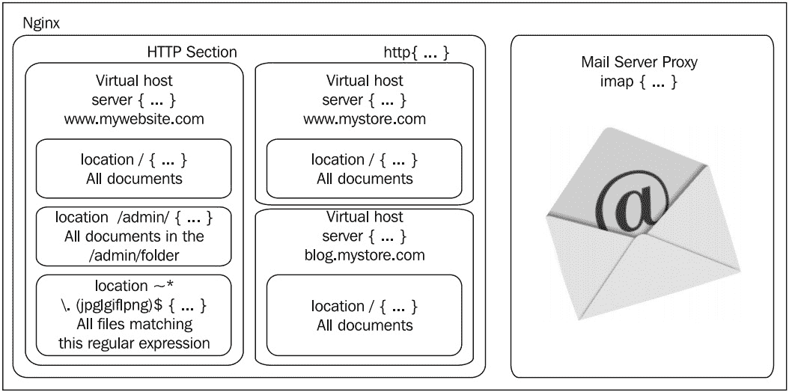

# 3

# 探索 HTTP 配置

在这个阶段，我们有一个工作中的 NGINX 设置——它不仅安装在系统上并在启动时自动运行，而且通过基本指令的帮助也进行了组织和优化。现在是时候进一步探索配置，了解 HTTP 核心模块。这个模块是 HTTP 配置的一个重要组成部分——它允许你设置网站以进行服务，也称为虚拟主机。

本章将涵盖以下主题：

+   HTTP 核心模块及其三个新块的简介

+   探索 HTTP 核心模块指令

+   探索 HTTP/2 的指令

+   探索 HTTP 核心模块引入的变量

+   理解和探索`location`块

通过本章的学习，你将了解如何配置 NGINX 服务器的所有要点及其模块，并能够托管你的第一个网站。

# HTTP 核心模块及其三个新块的简介

**HTTP 核心模块**是包含所有 HTTP 服务器的基本块、指令和变量的组件。当你配置构建时（如*第一章*中描述的），它是默认启用的，但实际上是可选的——你可以决定在自定义构建中不包含它。这样做将完全禁用所有 HTTP 功能，并且所有其他 HTTP 模块将不会被编译。显然，如果你购买了这本书，你很可能对 NGINX 的网页服务能力感兴趣，因此你将启用它。

这个模块是所有标准 NGINX 模块中最大的一个——它提供了大量的指令和变量。为了理解所有这些新元素及其如何发挥作用，我们首先需要了解三个主要块——`http`、`server`和`location`引入的逻辑组织。

在上一章中，我们通过研究默认的 NGINX 配置文件发现了核心模块，其中包含一系列指令和值，没有明显的组织。然后是`events`模块，引入了第一个块，(`events`)。这个块是`events`模块带来的所有指令的唯一占位符。

正如事实证明，HTTP 模块引入了三个新的逻辑块：

+   `http`：这个块被插入到配置文件的根部。它允许你开始定义与 NGINX 的 HTTP 相关的所有模块的指令和块。虽然这样做没有实际目的，但可以多次插入该块，这种情况下，最后一个块中插入的指令值将覆盖前面的值。

+   `server`：这个块允许你声明一个网站。换句话说，特定的网站（通过一个或多个主机名标识，例如`www.mywebsite.com`）被 NGINX 承认并接收其自己的配置。这个块只能在`http`块内使用。

+   `location`：该区块允许你为网站的特定位置定义一组设置。此区块可以在 `server` 区块内使用，也可以嵌套在另一个 `location` 区块中。

以下示意图通过提供几个与实际情况相对应的基本示例，总结了最终的结构：



图 3.1：显示区块结构和层次的示意图，包含一些示例

`http{...}` 区块定义的 HTTP 部分包含了所有与 Web 相关的配置。它可以包含一个或多个 `server{...}` 区块，定义你托管的域名和子域名。对于每个网站，你可以定义 `location` 区块，以便为特定请求 URI 或匹配某个模式的请求 URI 应用额外的设置。

记住，这里适用设置继承的原则。如果你在 `http{...}` 区块层次上定义某个设置（例如，`gzip on` 来启用 gzip 压缩），该设置将在可能包含的 `server` 和 `location` 区块中保留其值：

```
http {
   # Enable gzip compression at the http block level
   gzip on;
   server {
      server_name localhost;
       listen 80;
      # At this stage, gzip still set to on
      location /downloads/ {
          gzip off;
     #    This directive only applies to documents found
     #    in /downloads/
      }
   }
}
```

我们已经学习了 NGINX 的区块结构，并通过具体示例进行了实践。接下来，我们将介绍这三个区块中可用的模块。

# 探索 HTTP 核心模块指令

在这三个层次中的每个层次（即之前讨论的区块），可以插入指令以影响 Web 服务器的行为。以下小节介绍了主 HTTP 模块所引入的所有指令，并按主题分组。对于每个指令，还提供了相关的上下文信息。有些指令在某些层次上无法使用。例如，在 `http` 区块层次上插入 `server_name` 指令是没有意义的，因为 `server_name` 是直接影响虚拟主机的指令——它应仅在 `server` 区块中插入。因此，表格中指明了每个指令允许的层次——`http` 区块、`server` 区块、`location` 区块，以及附加的 `if` 区块。

注意

本文档适用于稳定版本 `1.25`。未来的更新可能会改变某些指令的*语法*，或提供本节未讨论的新特性。

## 套接字和主机配置

这组指令将允许你通过创建 `server` 区块来配置虚拟主机，区块可以通过主机名或 IP 地址与端口组合来标识。此外，某些指令将允许你通过配置 TCP 套接字选项来微调网络设置。

### listen

`server`

指定将用于监听套接字的 IP 地址和/或端口，套接字将为网站提供服务。网站通常通过 HTTP 使用端口 `80`（默认值）或通过 HTTPS 使用端口 `443`。

`listen [地址][:端口] [``附加选项];`

附加选项包括以下内容：

+   `default_server`：指定此`server`块用于作为任何接收到的指定 IP 地址和端口的默认网站

+   `ssl`：指定网站应该使用 SSL 进行服务

+   `http2`：启用对 HTTP/2 协议的支持，如果`http2`模块存在

+   `proxy_protocol`：为所有接受此端口的连接启用代理协议

+   其他选项与`bind`和`listen`系统调用相关：

    ```
    backlog=num, rcvbuf=size, sndbuf=size, accept_filter=filter, deferred, setfib=number, fastopen=number, ipv6only=on|off, reuseport, so_keepalive=on|off|[keepidle]:[keepintvl]:[keepcnt], bind, http2
    ```

+   以下是一些示例：

    ```
    listen 192.168.1.1:80; listen 127.0.0.1;
    listen 80 default_server;
    listen [:::a8c9:1234]:80; # IPv6 addresses must be put between square brackets
    listen 443 ssl http2;
    ```

### server_name

`server`

`server_name`指令将一个或多个主机名分配给`server`块。当 NGINX 收到 HTTP 请求时，它会将请求的`Host`头与所有`server`块进行匹配。第一个匹配此主机名的`server`块会被选择。

如果没有任何`server`块匹配所需的主机，NGINX 将选择第一个匹配`listen`指令参数的`server`块（例如，`listen *:80`将匹配所有收到的端口`80`的请求），优先选择在`listen`指令上启用了`default_server`选项的第一个块。

重要提示

此指令接受通配符以及正则表达式。在这种情况下，主机名应以`~`字符开头。

`server_name` `hostname1 [hostname2...];`

**示例**：

```
server_name www.website.com;
server_name www.website.com website.com;
server_name *.website.com;
server_name .website.com; # combines both *.website.com and website.com
server_name *.website.*;
server_name ~^(www)\.example\.com$; # $1 = www
```

你可以使用空字符串作为指令值，以捕捉所有没有`Host`头的请求，但只有在至少有一个常规名称（或用于虚拟主机名的`_`）之后：

```
server_name website.com "";
server_name _ "";
```

### server_name_in_redirect

`http`, `server`, 和 `location`

此指令适用于内部重定向。如果设置为`on`，NGINX 将使用`server_name`指令中指定的第一个主机名。如果设置为`off`，NGINX 将使用 HTTP 请求中的`Host`头的值。

`on` 或 `off`

`off`

### server_names_hash_max_size

`http`

NGINX 使用哈希表来处理各种数据集合（如映射、mimes、头部等），以加速请求的处理。此指令定义了服务器名称哈希表的最大大小。默认值适用于大多数配置。如果需要更改，NGINX 将在启动时或重新加载配置时自动通知你。

**语法**：数字值

`512`

### server_names_hash_bucket_size

`http`

设置服务器名称哈希表的桶大小。同样，只有在 NGINX 告诉你时才应更改此值。

**语法**：数字值

`32`（或`64`或`128`，取决于你的处理器缓存规格）。

### port_in_redirect

`http`, `server` 和 `location`

如果禁用，NGINX 发出的重定向将是相对路径。

`on` 或 `off`

`on`

### absolute_redirect

`http`, `server`, `location`

在重定向的情况下，此指令定义 NGINX 是否应将端口号附加到重定向 URL。

`on` 或 `off`

`on`

### sendfile

`http`, `server`, `location`

如果启用此指令，NGINX 将使用 `sendfile` 内核调用来处理文件传输。如果禁用，NGINX 将自己处理文件传输。根据文件传输的物理位置（如 NFS），此选项可能会影响服务器的性能。

在 Linux 上，使用`sendfile`会自动禁用异步 I/O。如果使用 FreeBSD，理论上可以结合使用`aio`和`sendfile`。

`on` 或 `off`

`off`

### sendfile_max_chunk

`http` 和 `server`

该指令定义了每次调用`sendfile`时可使用的最大数据大小（请参考前一条目）。

**语法**：数值（大小）

`0`

### send_lowat

`http` 和 `server`

该选项仅允许在 FreeBSD 下使用 TCP 套接字的 `SO_SNDLOWAT` 标志。此值定义了输出操作中缓冲区的最小字节数。

**语法**：数值（大小）

`0`

### reset_timedout_connection

`http`、`server` 和 `location`

当客户端连接超时时，相关信息可能会根据连接时的状态保留在内存中。启用此指令后，超时后会清除与连接相关的所有内存。

`on` 或 `off`

`off`

## 路径和文档

本节描述了配置每个网站所需提供文档的指令，如文档根目录、站点索引、错误页面等。

### root

`http`、`server`、`location` 和 `if`。接受变量。

定义文档根目录，包含您希望提供给访问者的文件。

**语法**：目录路径

`html`

**示例**：

```
root /home/website.com/public_html;
```

### alias

`location`。接受变量。

`/`）或文件路径

`alias`是一个仅在`location`块中使用的指令。它为 NGINX 指定一个不同的路径，用于获取特定请求的文档。例如，考虑以下配置：

```
http {
   server {
       server_name localhost;
       root /var/www/website.com/html;
        location /admin/ {
        alias /var/www/locked/;
      }
   }
}
```

当收到对`http://localhost/`的请求时，文件将从`/var/www/website.com/html/`文件夹提供。然而，如果 NGINX 收到对`http://localhost/admin/`的请求，用于获取文件的路径是`/home/website.com/locked/`。此外，文档根目录指令（`root`）的值不会改变。此过程对于动态脚本来说是不可见的。

### error_page

`http`、`server`、`location` 和 `if`。接受变量。

允许您根据 URI 修改 HTTP 响应代码，并可选地将代码替换为其他代码。

`error_page code1 [code2...] [=replacement code] [=@block | URI]`，其中替代代码（用`=code`表示）是`301`、`302`、`303`、`307`或`308`之一

**示例**：

```
error_page 404 /not_found.html;
error_page 500 501 502 503 504 /server_error.html;
error_page 403 http://website.com/;
error_page 404 @notfound; # jump to a named location block
error_page 404 =200 /index.html; # in case of 404 error, redirect to index.html with a 200 OK response code
```

### if_modified_since

`http`、`server` 和 `location`

定义了 NGINX 如何处理 `If-Modified-Since` HTTP 头。此头部通常由搜索引擎蜘蛛（如 Google 爬虫）使用。爬虫会指示上次访问的日期和时间。如果请求的文件自那时以来没有被修改，服务器将仅返回 `304 Not Modified` 响应代码且不包含正文。

此指令接受以下三个值：

+   `off`：忽略`If-Modified-Since`头部。

+   `exact`：如果 HTTP 头中指定的日期和时间与实际请求的文件修改日期完全匹配，则返回`304 Not Modified`。如果文件修改日期早于或晚于指定时间，则正常提供文件（`200` `OK` 响应）。

+   `before`：如果 HTTP 头中指定的日期和时间早于或等于请求的文件修改日期，则返回`304 Not Modified`。

`if_modified_since off | exact |` `before`

`exact`

### index

`http`、`server`、`location`。支持使用变量。

定义当请求中未指定文件名时，NGINX 将提供的默认页面（换句话说，即索引页面）。你可以指定多个文件名，第一个找到的文件将被提供。如果没有找到任何指定的文件，NGINX 将尝试在启用`autoindex`指令的情况下自动生成文件索引（请查看`HTTP Autoindex`模块），或者返回`403 Forbidden`错误页面。你还可以选择插入一个绝对文件名（如`/page.html`，基于文档根目录），但只能作为该指令的最后一个参数。

`index file1 [``file2...] [absolute_file];`

`index.html`

**示例**：

```
index index.php index.html index.htm;
index index.php index.php /catchall.php;
```

### recursive_error_pages

`http`、`server`、`location`

有时，由`error_page`指令服务的错误页面本身可能会触发错误；在这种情况下，`error_page`指令会再次被使用（递归）。此指令启用或禁用递归错误页面。

`on` 或 `off`

`off`

### try_files

`server`、`location`。支持使用变量。

尝试提供指定的文件（参数*1*到*N-1*）；如果这些文件都不存在，它将跳转到相应的命名`location`块（最后一个参数），或提供指定的 URI。

`location`块或 URI

**示例**：

```
location / {
    try_files $uri $uri.html $uri.xml @proxy;
}
# the following is a "named location block"
location @proxy {
    proxy_pass 127.0.0.1:8080;
}
```

在此示例中，NGINX 会正常尝试提供文件。如果请求的 URI 与任何现有文件不匹配，NGINX 会将`.html`附加到 URI 并再次尝试提供文件。如果仍然失败，它会尝试`.xml`。最终，如果所有这些可能性都失败，另一个`location`块（`@proxy`）将处理请求。

需要注意的是，除了最后一个参数外，`try_files`将直接提供文件，而不进行内部重定向。这意味着你*不能*这样使用`try_files`指令，因为这样会导致任何与`$uri.php`匹配的文件作为 PHP 源代码提供。这会留下安全漏洞，用户可能通过请求`/config` URI 来获得`/config.php`的内容：

```
location / {
    try_files $uri $uri.php @proxy;
}
# the following is a "named location block"
location @proxy {
    proxy_pass 127.0.0.1:8080;
}
```

注意

你还可以在值列表中指定`$uri/`，以检查是否存在具有该名称的目录。

## 客户端请求

本节文档介绍了 NGINX 如何处理客户端请求。除此之外，你可以配置保持连接机制行为，并可能将客户端请求记录到文件中。

### keepalive_requests

`http`、`server` 和 `location`

单个 keep-alive 连接上服务的最大请求数。

**语法**：数值

`100`

### keepalive_timeout

`http`、`server` 和 `location`

此指令定义服务器在关闭 keep-alive 连接之前等待的秒数。第二个（可选）参数作为 `Keep-Alive: timeout= <HTTP 响应头>` 的值传输。其预期效果是让客户端浏览器在此时间段过后自行关闭连接。请注意，某些浏览器会忽略此设置。例如，Internet Explorer 会在大约 60 秒后自动关闭连接。

`keepalive_timeout` `time1 [time2];`

`75`

**示例**：

```
keepalive_timeout 75;
keepalive_timeout 75 60;
```

### keepalive_disable

`http`、`server` 和 `location`

此选项允许你禁用所选浏览器家族的 `keepalive` 功能。

`keepalive_disable` `browser1 browser2;`

`msie6`

### send_timeout

`http`、`server` 和 `location`

NGINX 在关闭一个不活动连接之前的最大次数。连接一旦客户端停止传输数据，就会变为不活动。

**语法**：时间值（以秒为单位）

`60`

### client_body_in_file_only

`http`、`server` 和 `location`

如果启用此指令，传入的 HTTP 请求体将存储为磁盘上的实际文件。客户端请求体对应于客户端 HTTP 请求的原始数据，不包括头部（换句话说，就是通过 `POST` 请求传输的内容）。文件以纯文本形式存储。

此指令接受三个值：

+   `off`：不将请求体存储在文件中

+   `clean`：将请求体存储在文件中，并在请求处理完成后删除该文件

+   `on`：将请求体存储在文件中，但在请求处理完成后不删除该文件（除非用于调试，否则不推荐使用）

`client_body_in_file_only on | clean |` `off`

`off`

### client_body_in_single_buffer

`http`、`server` 和 `location`

定义 NGINX 是否应该将请求体存储在内存中的单个缓冲区中。

`on` 或 `off`

`off`

### client_body_buffer_size

`http`、`server` 和 `location`

指定保存客户端请求体的缓冲区的大小。如果此大小被超出，请求体（或至少部分内容）将被写入磁盘。请注意，如果启用了 `client_body_in_file_only` 指令，请求体始终会存储在磁盘上的文件中，无论其大小如何（是否适合缓冲区）。

**语法**：大小值

`8k` 或 `16k`（两页内存），具体取决于你的计算机架构。

### client_body_temp_path

`http`、`server` 和 `location`

允许你定义存储客户端请求体文件的目录路径。另一个选项允许你将这些文件分隔到最多三层的文件夹层次结构中。

`client_body_temp_path path [level1] [level2] [level3]`

`client_body_temp`

**示例**：

```
client_body_temp_path /tmp/nginx_rbf;
client_body_temp_path temp 2; # Nginx will create 2-digit folders to hold request body files
client_body_temp_path temp 1 2 4; # Nginx will create 3 levels of folders (first level: 1 digit, second level: 2 digits, third level: 4 digits)
```

### client_body_timeout

`http`、`server` 和 `location`

定义在读取客户端请求体时的非活动超时时间。当客户端停止传输数据时，连接变为非活动状态。如果达到超时，NGINX 会返回 `408 请求超时` HTTP 错误。

**语法**：时间值（秒）

`60`

### client_header_buffer_size

`http`、`server` 和 `location`

此指令允许您定义 NGINX 为请求头分配的缓冲区大小。通常，`1k` 就足够了。然而，在某些情况下，头部可能包含大量的 cookie 数据，或请求 URI 很长。如果是这种情况，NGINX 会分配一个或多个更大的缓冲区（较大缓冲区的大小由 `large_client_header_buffers` 指令定义）。

**语法**：大小值

`1k`

### client_header_timeout

`http`、`server` 和 `location`

定义在读取客户端请求头时的非活动超时时间。当客户端停止传输数据时，连接变为非活动状态。如果达到超时，NGINX 会返回 `408 请求超时` HTTP 错误。

**语法**：时间值（秒）

`60`

### client_max_body_size

`http`、`server` 和 `location`

这是客户端请求体的最大大小。如果超过此大小，NGINX 会返回 `413 请求实体过大` HTTP 错误。此设置在允许用户通过 HTTP 上传文件到服务器时特别重要。

**语法**：大小值

`1m`

### large_client_header_buffers

`http`、`server` 和 `location`

定义用于存储客户端请求的大型缓冲区的数量和大小，以防默认缓冲区（`client_header_buffer_size`）不足。每一行请求头必须适合一个缓冲区的大小。如果请求 URI 行大于一个缓冲区的大小，NGINX 会返回 `414 请求 URI 过大` 错误。如果其他请求头行超过一个缓冲区的大小，NGINX 会返回 `400 错误请求` 错误。

`large_client_header_buffers` `数量 大小`

**默认值**：*4*8* 千字节

### lingering_time

`http`、`server` 和 `location`

此指令适用于带请求体的客户端请求。当上传数据量超过 `max_client_body_size` 时，NGINX 会立即发送 `413 请求实体过大` HTTP 错误响应。然而，大多数浏览器仍会继续上传数据，忽略该通知。此指令定义了 NGINX 在发送该错误响应后，关闭连接前应等待的时间。

**语法**：数值（时间）

`30` 秒

### lingering_timeout

`http`、`server` 和 `location`

此指令定义 NGINX 在关闭客户端连接前，两个读取操作之间应等待的时间。

**语法**：数值（时间）

`5` 秒

### lingering_close

`http`、`server` 和 `location`

控制 NGINX 关闭客户端连接的方式。将此设置为 `off`，在接收到所有请求数据后立即关闭连接。默认值（`on`）允许在处理额外数据时等待。如果设置为 `always`，NGINX 将始终等待关闭连接。等待时间由 `lingering_timeout` 指令定义。

`on`、`off` 或 `always`

`on`

### ignore_invalid_headers

`http` 和 `server`

如果此指令被禁用，当请求头部格式不正确时，NGINX 将返回 `400 Bad Request` HTTP 错误。

`on` 或 `off`

`on`

### chunked_transfer_encoding

`http`、`server` 和 `location`

启用或禁用 HTTP/1.1 请求的分块传输编码。

`on` 或 `off`

`on`

### max_ranges

`http`、`server` 和 `location`

定义当客户端请求文件的部分内容时，NGINX 将提供多少字节范围。如果未指定值，则没有限制。如果将其设置为 `0`，则禁用字节范围功能。

**语法**：大小值

## MIME 类型

NGINX 提供了两个特别的指令来帮助你配置 MIME 类型：`types` 和 `default_type`，它们定义了文档的默认 MIME 类型。这将影响响应中发送的 `Content-Type` HTTP 头部。继续阅读。

### types

`http`、`server` 和 `location`

此指令允许你在 MIME 类型和文件扩展名之间建立关联。它实际上是一个接受特定语法的块：

```
types {
  mimetype1  extension1;
  mimetype2  extension2 [extension3...];
  [...]
}
```

当 NGINX 提供文件时，它会检查文件扩展名以确定 MIME 类型。然后，MIME 类型将作为响应中的 `Content-Type` HTTP 头部的值发送。这个头部可能会影响浏览器如何处理文件。例如，如果你请求的文件的 MIME 类型是 `application/pdf`，浏览器可能会尝试使用与该 MIME 类型相关联的插件来渲染文件，而不是仅仅下载它。

NGINX 提供了一组基本的 MIME 类型作为一个独立的文件（`mime.types`），并通过 `include` 指令包含：

```
include mime.types;
```

该文件已经涵盖了最常用的文件扩展名，因此你可能不需要编辑它。如果所提供文件的扩展名没有列在类型列表中，将使用默认类型，如 `default_type` 指令所定义的（参见下一项）。

请注意，你可以通过重新声明 `types` 块来覆盖类型列表。一个有用的例子是强制所有文件在文件夹中被下载，而不是被显示：

```
http {
   include mime.types;
   [...]
   location /downloads/ {
       # removes all MIME types
       types { }
       default_type application/octet-stream;
    }
  [...]
}
```

一些浏览器忽略 MIME 类型，可能仍然会显示文件，特别是当文件名以已知扩展名结尾时，例如 `.html` 或 `.txt`。

为了以更确定和明确的方式控制文件如何被访问者的浏览器处理，你应该通过 `add_header` 指令使用 `Content-Disposition` HTTP 头部，具体内容见 *HTTP 头部* 模块（*第四章*）。

如果未包含 `mime.types` 文件，默认值如下：

```
types {
  text/html html;
  image/gif gif;
  image/jpeg jpg;
}
```

### default_type

`http`、`server` 和 `location`

定义默认的 MIME 类型。当 NGINX 提供文件时，会将文件扩展名与 `types` 块中声明的已知类型进行匹配，以返回正确的 MIME 类型作为 `Content-Type` HTTP 响应头的值。如果扩展名与已知的 MIME 类型不匹配，则使用 `default_type` 指令的值。

**语法**: MIME 类型

`text/plain`

### types_hash_max_size

`http`、`server` 和 `location`

定义 MIME 类型哈希表中条目的最大大小。

**语法**: 数值

`4k` 或 `8k`（一个 CPU 缓存行）

### types_hash_bucket_size

`http`、`server` 和 `location`

设置 MIME 类型哈希表的桶大小。只有当 NGINX 提示你时，你才应该更改此值。

**语法**: 数值

`64`

## 限制和约束

这一组指令允许你添加限制，当客户端尝试访问服务器上的特定位置或文档时应用这些限制。请注意，在下一章中，你将找到更多用于限制访问的指令。

### limit_except

`location`

该指令允许你防止使用所有 HTTP 方法，除非明确允许的那些方法。在 `location` 块中，你可能想要限制某些 HTTP 方法的使用，例如禁止客户端发送 `POST` 请求。你需要定义两个元素：首先是未被禁止的方法（允许的方法；所有其他方法将被禁止）；其次是受限制影响的对象：

```
location /admin/ {
    limit_except GET {
      allow 192.168.1.0/24;
      deny all;
    }
}
```

这个示例对 `/admin/` 位置应用了限制——所有访客仅允许使用 `GET` 方法。通过 `allow` 指令（在 HTTP 访问模块中详细说明）指定的本地 IP 地址的访客不受此限制。如果访客使用了被禁止的方法，NGINX 将返回 `403 Forbidden` HTTP 错误。请注意，`GET` 方法隐含了 `HEAD` 方法（如果你允许 `GET`，则 `GET` 和 `HEAD` 都被允许）。

语法是特定的：

```
limit_except METHOD1 [METHOD2...] {
  allow | deny | auth_basic | auth_basic_user_file | proxy_pass | perl;
}
```

你可以在块内插入的指令在其各自模块的 *第四章*中有详细文档。

### limit_rate

`http`、`server`、`location` 和 `if`

允许你限制单个客户端连接的传输速率。速率以每秒字节数表示：

```
limit_rate 500k;
```

这将把连接传输速率限制为每秒 `500` 千字节。如果客户端打开两个连接，则客户端将被允许 *2*500* 千字节。

**语法**: 大小值

**默认值**: 无限制

### limit_rate_after

`http`、`server`、`location` 和 `if`

定义在 `limit_rate` 指令生效之前传输的数据量：

```
limit_rate 10m;
```

NGINX 将以最大速度发送前 10 兆字节。超过此大小后，传输速率将受 `limit_rate` 指令指定的值限制（见前一项）。与 `limit_rate` 指令类似，此设置仅适用于单个连接。

**语法**: 大小值

**默认值**: 无

### satisfy

`location`

`satisfy` 指令定义了客户端是否需要所有访问条件都有效（satisfy all），或者至少满足一个条件（satisfy any）：

```
location /admin/ {
    allow 192.168.1.0/24;
    deny all;
    auth_basic "Authentication required";
    auth_basic_user_file conf/htpasswd;
}
```

在之前的示例中，客户端能够访问资源需要满足两个条件：

+   通过 `allow` 和 `deny` 指令（HTTP 访问模块），我们只允许具有本地 IP 地址的客户端访问，其他所有客户端都被拒绝访问

+   通过 `auth_basic` 和 `auth_basic_user_file` 指令（HTTP `auth_basic` 模块），我们只允许提供有效用户名和密码的客户端

使用 `satisfy all`，客户端必须同时满足两个条件才能访问资源；使用 `satisfy any`，如果客户端满足任一条件，则会授予访问权限。

`satisfy any |` `all`

`all`

### internal

`location`

该指令指定 `location` 块为内部块。换句话说，指定的资源无法通过外部请求访问：

```
server {
    [...]
    server_name .website.com;
    location /admin/ {
        internal;
    }
}
```

使用之前的配置，客户端将无法浏览 `http://website.com/admin/`。此类请求会返回 `404 Not Found` 错误。访问资源的唯一方法是通过内部重定向。

## 文件处理和缓存

为您的网站构建坚实的基础至关重要。文件访问和缓存是 web 服务的重要方面。在这方面，NGINX 允许您通过使用以下指令来精确调整设置。

### disable_symlinks

该指令允许您控制 NGINX 在处理符号链接时的行为。默认情况下（指令值为 `off`），符号链接是允许的，NGINX 会跟随它们。您可以通过指定以下值之一，在不同条件下决定禁用某些符号链接：

+   `on`：如果请求的 URI 中有任何部分是符号链接，则拒绝访问，并且 NGINX 返回 `403 HTTP` 错误页面。

+   `if_not_owner`：与之前的链接类似，但仅当符号链接与它指向的对象具有不同所有者时才拒绝访问。

+   可选的 `from=` 参数允许您指定一个 URL 部分，该部分将不会检查符号链接。例如，`disable_symlinks on from=$document_root` 将告诉 NGINX 在 URI 中正常跟随符号链接，直到 `$document_root` 文件夹。如果在之后的 URI 部分中发现符号链接，则拒绝访问请求的文件。

### directio

`http`、`server` 和 `location`

如果启用此指令，则大于指定值的文件将使用直接 I/O 系统机制进行读取。这允许 NGINX 从存储设备读取数据，并将其直接放入内存，而无需经过中间缓存过程。

`off`

`off`

### directio_alignment

`http`、`server` 和 `location`

在使用 `directio` 时设置字节对齐。如果在 Linux 上使用 XFS，请将此值设置为 `4k`。

**语法**：大小值

`512`

### open_file_cache

`http`、`server` 和 `location`

本指令允许你启用一个缓存，用来存储关于已打开文件的信息。它并不实际存储文件内容，而只存储以下信息：

+   文件描述符（文件大小、修改时间等）。

+   文件和目录的存在性。

+   文件错误，如权限拒绝、文件未找到等。注意，这可以通过 `open_file_cache_errors` 指令禁用。

本指令接受两个参数：

+   `max=X`，其中 `X` 是缓存可以存储的条目数。如果达到此数量，旧的条目将被删除，以为新的条目腾出空间。

+   可选地，`inactive=Y`，其中 `Y` 是缓存条目应存储的秒数。默认情况下，NGINX 在清除缓存条目前会等待 *60* 秒。如果缓存条目被访问，定时器会被重置。如果缓存条目被访问的次数超过了 `open_file_cache_min_uses` 定义的值，那么该缓存条目将不会被清除（直到 NGINX 空间不足，决定清除旧条目）。

`open_file_cache max=X [inactive=Y] |` `off`

`off`

**示例**：

```
open_file_cache max=5000 inactive=180;
```

### open_file_cache_errors

`http`、`server` 和 `location`

启用或禁用文件错误的缓存，使用 `open_file_cache` 指令（请参考前一条）。

`on` 或 `off`

`off`

### open_file_cache_min_uses

`http`、`server` 和 `location`

默认情况下，`open_file_cache` 指令中的条目会在一段不活动时间后被清除（默认 60 秒）。然而，如果有活动发生，你可以防止 NGINX 删除缓存条目。本指令定义了一个条目必须被访问的次数，才能够得到保护：

```
open_file_cache_min_uses 3;
```

如果缓存条目被访问超过三次，它将变为永久活动，并且在 NGINX 决定清除旧条目以腾出空间之前不会被删除。

**语法**：数值

`1`

### open_file_cache_valid

`http`、`server` 和 `location`

打开文件缓存机制非常重要，但缓存的信息会迅速变得过时，特别是在快速变化的文件系统中。因此，需要在短时间后重新验证信息。本指令指定 NGINX 在重新验证缓存项之前等待的秒数。

**语法**：时间值（以秒为单位）

`60`

### read_ahead

`http`、`server` 和 `location`

定义从文件中预读取的字节数。在基于 Linux 的操作系统中，将此指令设置为大于 `0` 的值将启用预读取，但你指定的实际值没有影响。将其设置为 `0` 以禁用预读取。

**语法**：大小值

`0`

## 其他指令

以下指令涉及网页服务器日志记录、URI 组合、DNS 等各个方面。

### log_not_found

`http`、`server` 和 `location`

启用或禁用记录 `404 Not Found` HTTP 错误。如果由于缺少 `favicon.ico` 或 `robots.txt` 文件而使日志中充满了 `404` 错误，你可能希望关闭此功能。

`on` 或 `off`

`on`

### log_subrequest

`http`，`server` 和 `location`

启用或禁用由内部重定向或**服务器端包含**（**SSI**）请求触发的子请求日志记录。

`on` 或 `off`

`off`

### merge_slashes

`http`，`server` 和 `location`

启用此指令将合并 URI 中的多个连续斜杠。这在类似以下的情况下特别有用：

```
server {
    [...]
    server_name website.com;
    location /documents/ {
        type { }
        default_type text/plain;
   }
}
```

默认情况下，如果客户端尝试访问 `http://website.com//documents/`（注意 URI 中的 `//`），NGINX 会返回 `404 未找到` HTTP 错误。如果启用此指令，两个斜杠将被合并为一个，并且位置模式将被匹配。

`on` 或 `off`

`off`

### msie_padding

`http`，`server` 和 `location`

如果响应体的长度小于 512 字节，且响应码为 `400` 或更高，浏览器会显示自己的错误页面，有时会覆盖服务器提供的更有信息的页面。如果启用此选项，状态码为 `400` 或更高的响应体将被填充到 512 字节。

`on` 或 `off`

`off`

### msie_refresh

`http`，`server` 和 `location`

这是另一个 MSIE 特定的指令，它将在以下 HTTP 响应码（`301 永久移动` 和 `302 临时移动`）的情况下生效。当启用时，NGINX 会向运行 MSIE 浏览器的客户端发送一个包含刷新元标签（`<meta http-equiv="Refresh"...>`）的响应体，以便将浏览器重定向到请求资源的新位置。

`on` 或 `off`

`off`

### 解析器

`http`，`server` 和 `location`

指定 NGINX 用来将主机名解析为 IP 地址以及反向解析的名称服务器。DNS 查询结果会缓存一段时间，缓存时间由 DNS 服务器提供的**生存时间**（**TTL**）决定，或者通过为有效参数指定时间值来控制。

如果指定了多个 DNS 服务器，NGINX 将使用轮询算法查询它们。

`valid=Time` `value, ipv6=on|off`

**默认值**：无（系统默认）

**示例**：

```
resolver 127.0.0.1; #use local DNS
resolver 8.8.8.8 8.8.4.4 valid=1h;#GoogleDNS & 1 hour cache
```

重要说明

尽管 NGINX 支持外部 DNS 解析器，但我们强烈建议您使用本地解析器（如 `dnsmasq`），并让 NGINX 查询 `dnsmasq`。在重载情况下，NGINX 可能会与外部解析器配合不好，而使用本地解析器可以消除网络问题，例如 NGINX 和 DNS 服务器之间的延迟。这样，您可以优化 `dnsmasq`，或者使用 `dnscrypt` 等替代方案来保持 DNS 请求的私密性。设置后，本地 DNS 服务器可以用于任何其他服务器应用。

### resolver_timeout

`http`，`server` 和 `location`

主机名解析查询的超时时间。

**语法**：时间值（以秒为单位）

`30`

### server_tokens

`http`，`server` 和 `location`

此指令允许您定义是否让 NGINX 向客户端通报正在运行的版本号。NGINX 在以下三种情况下会指示其版本号：

+   在 HTTP 响应的服务器头部（例如 `nginx/1.25.0`）中。如果将 `server_tokens` 设置为 `off`，服务器头部将仅显示 `Nginx`。

+   在错误页面上，NGINX 会在页脚中显示版本号。如果将 `server_tokens` 设置为 `off`，错误页面上的页脚将仅显示 `Nginx`。

+   如果使用 `build` 值，NGINX 将输出在编译时指定的构建值。

如果你正在使用较旧版本的 NGINX 并且不打算更新，出于安全原因，*隐藏*你的版本号可能是个好主意。

`on`、`off` 或 `build`。默认值：`on`。

### underscores_in_headers

`http` 和 `server`

允许或不允许在自定义 HTTP 头部名称中使用下划线。如果将此指令设置为 `on`，则以下示例头部在 `Nginx` 中被视为有效：`test_header: value`：

`on` 或 `off`

`off`

### variables_hash_max_size

`http`

此指令定义变量哈希表的最大大小。如果服务器配置使用的变量总数超过 1,024，则必须增加此值。

**语法**：数值

`1024`

### variables_hash_bucket_size

`http`

此指令允许你设置变量哈希表的桶大小。

**语法**：数值

`64`（或 `32` 或 `128`，取决于你的处理器缓存规格）

### post_action

`http`、`server`、`location` 和 `if`

定义一个完成后的操作，一个在请求完成后由 NGINX 调用的 URI。

`location` 块

**示例**：

```
location /payment/ {
    post_action /scripts/done.php;
}
```

我们已经涵盖了未来可能需要的大多数指令。这里有一组我们建议你使用的其他可选指令。请注意，在撰写本书时，HTTP/3 和 **快速 UDP 网络连接**（**QUIC**）在 NGINX 中尚未完全支持或部署。

# 探索 HTTP/2 的指令

NGINX 添加了对 `1.9.5` 的支持，并取代了 `1.9.5`，SPDY 不再可用，我们现在必须使用 HTTP/2。

如果你通过包管理器安装了 NGINX，通常该模块已启用；如果你是自己编译的，请确保在编译 NGINX 时使用了 `--with_http_v2_module` 配置标志。

与 SPDY 类似，HTTP/2 要求使用 SSL，而这无论如何都是一种好习惯。现在，像 *Let’s Encrypt* 这样的服务可以免费颁发 SSL 证书，因此强烈推荐使用。

要启用 HTTP/v2，请将 `http2` 标志添加到 `listen` 指令中：

```
listen 443 ssl http2;
```

让我们来探索本节中不同模块的指令。

## http2_chunk_size

`http`、`server` 和 `location`

设置响应体切片的最大块大小。

**语法**：大小

`8k`

## http2_body_preread_size

`http` 和 `server`

设置请求缓冲区的大小，该缓冲区用于在处理之前保存请求体。

**语法**：大小

`64k`

## http2_idle_timeout

`http` 和 `server`

设置因不活动而关闭连接的时间。

**语法**：时间

`3m`

## http2_max_concurrent_streams

`http` 和 `server`

设置每个连接中 HTTP/2 流的最大并发数。

**语法**：数字

`128`

## http2_max_field_size

`http` 和 `server`

限制压缩请求头字段的最大大小。

**语法**：大小

`4k`

## http2_max_header_size

`http` 和 `server`

限制解压后的整个请求头列表的最大大小。

**语法**：大小

`16k`

## http2_max_requests

`http` 和 `server`

设置通过一个 HTTP/2 连接可以处理的最大请求数，超过后该连接会关闭，客户端应使用新的连接。

**语法**：数字

`1000`

## http2_recv_buffer_size

`http`

设置每个工作进程的输入缓冲区大小。

**语法**：大小

`256k`

## http2_recv_timeout

`http` 和 `server`

设置期望从客户端获取更多数据的超时时间，超时后连接将关闭。

**语法**：时间

`30`

## 模块变量

HTTP/2 模块仅设置一个变量来确定是否使用 HTTP/2：

| **变量** | **描述** |
| --- | --- |
| `$``http2` | 如果通过 TLS 使用 HTTP/2，则为 `h2`，如果通过明文 TCP 使用则为 `h2c`。如果未使用 HTTP/2，则为空字符串 (`( )`)。 |

现在我们已经覆盖了大部分指令，让我们继续探讨这些指令的变量和扩展配置。

# 探索 HTTP 核心模块引入的变量

HTTP 核心模块引入了大量的变量，你可以在指令的值中使用它们。请小心，因为只有少数指令会接受变量定义其值。如果你在不接受变量的指令值中插入变量，不会报告错误；相反，变量名会作为原始文本出现。

你会遇到三种不同类型的变量。第一组表示在客户端请求的头中传输的值。第二组对应于响应头，发送到客户端。最后，第三组包括完全由 NGINX 生成的变量。

## 请求头

NGINX 允许你通过变量的形式访问客户端请求头，之后你可以在配置中使用它们：

| **变量** | **描述** |
| --- | --- |
| `$``http_host` | `Host` HTTP 头的值，表示客户端试图访问的主机名。 |
| `$``http_user_agent` | `User-Agent` HTTP 头的值，表示客户端的 web 浏览器。 |
| `$``http_referer` | `Referer` HTTP 头的值，表示客户端来自的上一页的 URL。 |
| `$``http_via` | `Via` HTTP 头的值，告知我们客户端使用的可能的代理。 |
| `$``http_x_forwarded_for` | `X-Forwarded-For` HTTP 头的值，如果客户端在代理后面，它显示客户端的实际 IP 地址。 |
| `$``http_cookie` | `Cookie` HTTP 头的值，包含客户端发送的 Cookie 数据。 |
| `$``http_...` | 可以使用 `$http_` 后跟头部名称的小写形式，并将短横线（`-`）替换为下划线（`_`），来检索客户端发送的其他头部。 |

表 3.1：可定制 HTTP 请求头部列表

## 响应头部

类似地，你可以访问发送给客户端的 HTTP 响应头部。这些变量并非始终可用，它们仅在响应发送之后才会有值；例如，在写入日志时：

| **变量** | **描述** |
| --- | --- |
| `$``sent_http_content_type` | `Content-Type` HTTP 头部的值，指示传输资源的 MIME 类型。 |
| `$``sent_http_content_length` | `Content-Length` HTTP 头部的值，通知客户端响应体的长度。 |
| `$``sent_http_location` | `Location` HTTP 头部的值，表示所请求资源的位置与原始请求中指定的位置不同。 |
| `$``sent_http_last_modified` | `Last-Modified` HTTP 头部的值，对应于请求资源的修改日期。 |
| `$``sent_http_connection` | `Connection` HTTP 头部的值，定义连接是保持活跃还是关闭。 |
| `$``sent_http_keep_alive` | `Keep-Alive` HTTP 头部的值，定义了连接保持活跃的时间。 |
| `$``sent_http_transfer_encoding` | `Transfer-Encoding` HTTP 头部的值，提供有关响应体编码方法的信息（如 compress、gzip）。 |
| `$``sent_http_cache_control` | `Cache-Control` HTTP 头部的值，告诉我们客户端浏览器是否应该缓存资源。 |
| `$``sent_http_...` | 可以使用 `$sent_http_` 后跟头部名称的小写形式，并将短横线（`-`）替换为下划线（`_`），来检索发送给客户端的其他头部。 |

表 3.2：可定制 HTTP 响应头部列表

## NGINX 生成的头部

除了 HTTP 头部，NGINX 还提供了许多与请求相关的变量，涵盖了请求的处理方式、当前配置的使用设置等内容：

| **变量** | **描述** |
| --- | --- |
| `$``arg_XXX` | 允许你访问查询字符串（`GET` 参数），其中 `XXX` 是你想要使用的参数名称。 |
| `$``args` | 所有查询字符串参数的组合。 |
| `$``binary_remote_addr` | 客户端的 IP 地址，以二进制数据（4 字节）表示。 |
| `$``body_bytes_sent` | 响应体中发送的字节数（不包括响应头部）。 |
| `$``bytes_sent` | 发送给客户端的字节数。 |
| `$``connection` | 标识连接的序列号。 |
| `$``connection_requests` | 当前连接已处理的请求数量。 |
| `$``content_length` | 等同于 `Content-Length` HTTP 头部的值。 |
| `$``content_type` | 等同于 `Content-Type` HTTP 头。 |
| `$``cookie_XXX` | 允许访问 cookie 数据，其中 `XXX` 是您想要使用的参数名称。 |
| `$``document_root` | 返回当前请求的 `root` 指令的值。 |
| `$``document_uri` | 返回请求的当前 URI。如果执行了内部重定向，则可能与原始请求 URI 不同。与 `$``uri` 变量相同。 |
| `$``host` | 此变量等同于请求的 `host` HTTP 头。在原始请求中未提供 `host` 头的情况下，NGINX 本身会为此变量赋值。 |
| `$``hostname` | 返回服务器计算机的系统主机名。 |
| `$``https` | 对于 HTTPS 连接设置为 `on`；否则为空。 |
| `$``is_args` | 如果 `$args` 变量已定义，则 `$is_args` 等同于 `?`。如果 `$args` 为空，则 `$is_args` 也为空。您可以用此变量构建一个可选包含查询字符串的 URI，例如 `index.php$is_args$args`。如果请求中有任何查询字符串参数，则 `$is_args` 设置为 `?`，使其成为有效的 URI。 |
| `$``limit_rate` | 返回每个连接的传输速率限制，由 `limit_rate` 指令定义。您可以使用 `set`（来自*Rewrite 模块*的指令）编辑此变量：`set $``limit_rate 128k;`。 |
| `$``msec` | 返回当前时间（秒和毫秒）。 |
| `$``nginx_version` | 返回正在运行的 NGINX 版本。 |
| `$``pid` | 返回 NGINX 进程标识符。 |
| `$``pipe` | 如果当前请求是流水线化的，则此变量设置为 `p`；否则值为 `[.]`。 |
| `$``proxy_protocol_addr` | 如果在 `listen` 指令上启用了 `proxy_protocol` 参数，则此变量将包含客户端地址。 |
| `$``query_string` | 等同于 `$args`。 |
| `$``remote_addr` | 返回客户端的 IP 地址。 |
| `$``remote_port` | 返回客户端套接字的端口。 |
| `$``remote_user` | 如果客户端使用了身份验证，则返回客户端用户名。 |
| `$``realpath_root` | 返回客户端请求中文档根目录，符号链接已解析为实际路径。 |
| `$``request_body` | 返回客户端请求的主体，如果主体为空则返回 `–`。 |
| `$``request_body_file` | 如果请求体已保存（参见 `client_body_in_file_only` 指令），此变量表示临时文件的路径。 |
| `$``request_completion` | 如果请求已完成，则返回 `OK`；否则返回*空* *字符串*。 |
| `$``request_filename` | 返回当前请求中提供的*完整文件名*。 |
| `$``request_length` | 返回客户端请求的*总长度*。 |
| `$``request_method` | 指示请求中使用的 HTTP 方法，如 `GET` 或 `POST`。 |
| `$``request_time` | 返回自从从客户端读取第一个字节以来经过的时间（秒和毫秒）。 |
| `$``request_id` | 从 16 个随机字节生成的唯一请求标识符，以十六进制表示。 |
| `$``request_uri` | 对应于请求的原始 URI；在整个过程中保持不变（不同于`$document_uri/$uri`）。 |
| `$``scheme` | 根据请求返回`http`或`https`。 |
| `$``server_addr` | 返回服务器的 IP 地址。请小心，因为每次使用该变量都需要进行系统调用，这可能会影响高流量配置中的整体性能。 |
| `$``server_name` | 指示处理请求时使用的`server_name`指令的值。 |
| `$``server_port` | 指示接收到请求数据的服务器套接字端口。 |
| `$``server_protocol` | 返回协议和版本，通常为 HTTP/1.0 或 HTTP/1.1。 |
| `$``status` | 返回响应状态码。 |
| `$tcpinfo_rtt, $tcpinfo_rttvar, $``tcpinfo_snd_cwnd, $tcpinfo_rcv_space` | 如果您的操作系统支持`TCP_INFO`套接字选项，这些变量将被填充为当前客户端 TCP 连接的信息。 |
| `$``time_iso8601, $time_local` | 提供当前时间，分别以*ISO 8601*和本地格式用于`access_log`指令。 |
| `$``uri` | 与 `$document_uri` 相同。 |

表 3.3：各种可定制变量的列表；这些变量是可选的，但可能会派上用场。

# 理解和探索`location`块

我们已经确定 NGINX 允许您将配置精细化到三个层次——协议层（`http`块）、服务器层（`server`块）和请求的 URI 层（`location`块）。现在让我们更详细地了解第三个层次。

## `Location`修饰符

NGINX 允许您通过指定一个模式来定义`location`块，该模式将与请求的文档 URI 进行匹配：

```
server {
    server_name website.com;
    location /admin/ {
    # The configuration you place here only applies to
    # http://website.com/admin/
    }
}
```

您可以插入复杂的模式，而不是简单的文件夹名称。`location`块的语法如下所示：

```
location [=|~|~*|^~|@] pattern { … }
```

第一个可选参数是一个符号，称为`location`，它将定义 NGINX 如何匹配指定的模式，并且还定义了模式的性质（简单字符串或正则表达式）。下述子部分详细说明了不同的修饰符及其行为。

### `=` 修饰符

请求的文档 URI 必须与指定的模式完全匹配。这里的模式仅限于简单的字面字符串；不能使用正则表达式：

```
server {
    server_name website.com;
    location = /abcd {
    [...]
    }
}
```

`location`块中的配置具有以下属性：

+   适用于`http://website.com/abcd`（精确匹配）

+   可能适用于`http://website.com/ABCD`（如果您的操作系统使用区分大小写的文件系统，它是区分大小写的）

+   适用于`http://website.com/abcd?param1&param2`（无论查询字符串参数如何）

+   不适用于`http://website.com/abcd/`（尾部斜杠）

+   不适用于`http://website.com/abcde`（指定模式后的额外字符）

### 没有修饰符

请求的文档 URI 必须以指定的模式开头。你不能使用正则表达式：

```
server {
    server_name website.com;
    location /abcd {
    [...]
    }
}
```

`location`块中的配置具有以下属性：

+   适用于`http://website.com/abcd`（完全匹配）

+   可能适用于`http://website.com/ABCD`（如果你的操作系统使用大小写敏感的文件系统，它是大小写敏感的）

+   适用于`http://website.com/abcd?param1&param2`（无论查询字符串参数如何）

+   适用于`http://website.com/abcd/`（尾部斜杠）

+   适用于`http://website.com/abcde`（在指定模式之后的额外字符）

### ~ 修饰符

请求的 URI 必须与指定的正则表达式大小写敏感地匹配：

```
server {
    server_name website.com;
    location ~ ^/abcd$ {
    [...]
    }
}
```

示例中使用的`^/abcd$`正则表达式指定该模式必须以（`^`）`/`开头，跟着`abc`，并以（`$`）`d`结束。因此，`location`块中的配置具有以下属性：

+   适用于`http://website.com/abcd`（完全匹配）

+   不适用于`http://website.com/ABCD`（大小写敏感）

+   适用于`http://website.com/abcd?param1&param2`（无论查询字符串参数如何）

+   不适用于`http://website.com/abcd/`（尾部斜杠），因为指定的正则表达式

+   不适用于`http://website.com/abcde`（额外字符），因为指定的正则表达式

注意

对于操作系统如微软 Windows，`~` 和 `~*` 都是大小写不敏感的，因为操作系统使用大小写不敏感的文件系统。

### ~* 修饰符

请求的 URI 必须与指定的正则表达式大小写不敏感地匹配：

```
server {
    server_name website.com;
    location ~* ^/abcd$ {
    [...]
    }
}
```

示例中使用的正则表达式类似于之前的正则表达式。因此，`location`块中的配置具有以下属性：

+   适用于`http://website.com/abcd`（完全匹配）

+   适用于`http://website.com/ABCD`（大小写不敏感）

+   适用于`http://website.com/abcd?param1&param2`（无论查询字符串参数如何）

+   不适用于`http://website.com/abcd/`（尾部斜杠），因为指定的正则表达式

+   不适用于`http://website.com/abcde`（额外字符），因为指定的正则表达式

### ^~ 修饰符

与无符号行为类似，位置 URI 必须以指定的模式开头。不同之处在于，如果匹配到该模式，NGINX 将停止查找其他模式（请参阅*搜索顺序和* *优先级*部分）。

### @ 修饰符

定义一个命名的`location`块。这些块无法由客户端访问，只能通过其他指令生成的内部请求访问，例如`try_files`或`error_page`。

## 搜索顺序和优先级

由于可以定义多个具有不同模式的`location`块，您需要理解，当 NGINX 接收到请求时，它会搜索与请求的 URI 最匹配的`location`块：

```
server {
    server_name website.com;
    location /files/ {
    # applies to any request starting wi"h "/fil"s/"
    # for example /files/doc.txt, /files/, /files/temp/
    }
    location = /files/ {
    # applies to the exact request "o "/fil"s/"
    # and as such does not apply to /files/doc.txt
    # but only /files/
    }
}
```

当客户端访问 `http://website.com/files/doc.txt` 时，第一个 `location` 块会被应用。然而，当他们访问 `http://website.com/files/` 时，第二个块会被应用（即使第一个块也匹配），因为它优先于第一个块（它是精确匹配）。

你在配置文件中建立的顺序（将 `/files/` 块放在 `= /files/` 块之前）并不重要。NGINX 会按特定顺序查找匹配的模式：

+   带 `=` 修饰符的 `location` 块：如果指定的字符串与请求的 URI 完全匹配，NGINX 将保留该 `location` 块

+   没有修饰符的 `location` 块：如果指定的字符串 *完全* 匹配请求的 URI，NGINX 将保留该 `location` 块

+   带 `^~` 修饰符的 `location` 块：如果指定的字符串与请求的 URI 开头部分匹配，NGINX 将保留该 `location` 块

+   带 `~` 或 `~*` 修饰符的 `location` 块：如果正则表达式匹配请求的 URI，NGINX 将保留该 `location` 块

+   没有修饰符的 `location` 块：如果指定的字符串与请求的 URI *开头* 部分匹配，NGINX 将保留该 `location` 块

到此为止，`^~` 修饰符开始变得有意义，我们可以设想一些它会非常有用的情况，如下文的三个小节所示。

### 案例 1

这是两个都以 `/doc` 开头的 `location` 块的例子：

```
server {
    server_name website.com;
    location /doc {
    [...] # requests beginning with "/doc"
    }
    location ~* ^/document$ {
    [...] # requests exactly matching "/document"
    }
}
```

你可能会问：当客户端请求 `http://website.com/document` 时，哪个 `location` 块会被应用？确实，这两个块都匹配此请求。答案并不在于这些块在配置文件中的出现顺序。在这种情况下，第二个 `location` 块会被应用，因为 `~*` 修饰符优先于其他修饰符。

### 案例 2

这是两个 `location` 块处理类似 URL 的一个例子。第一个 `location` 块以 `/document[+]` 开头，而最后一个是 `/document` 的精确匹配：

```
server {
    server_name website.com;
    location /document {
    [...] # requests beginning with "/document"
    }
    location ~* ^/document$ {
    [...] # requests exactly matching "/document"
    }
}
```

问题依然是一样的：当客户端发送请求下载 `http://website.com/document` 时会发生什么？这里有一个技巧。第一个块中指定的字符串现在恰好与请求的 URI 匹配。因此，NGINX 会偏好它，而不是正则表达式。

### 案例 3

这是第二个 `location` 块的相应字符串，且由第一个 `location` 块处理的例子：

```
server {
    server_name website.com;
    location ^~ /doc {
    [...] # requests beginning with "/doc"
    }
    location ~* ^/document$ {
    [...] # requests exactly matching "/document"
    }
}
```

最后这个案例使用了 `^~` 修饰符。当客户端访问 `http://website.com/document` 时，哪一个块会被应用？答案是第一个块。原因是 `^~` 优先于 `~*`。因此，任何以 `/doc` 开头的 URI 请求都会受到第一个块的影响，即使请求的 URI 匹配第二个块中定义的正则表达式。

现在我们已经涵盖了 `location` 块、它的修饰符以及可重用的用例，学会了如何根据路径的不同优先级来处理请求。

# 总结

在本章中，我们学习了 NGINX HTTP 配置的关键概念。首先，我们了解了通过声明 `server` 块来创建虚拟主机。接着，我们探索了 HTTP 核心模块的指令和变量，这些指令和变量可以插入到这些块中，最终理解了控制 `location` 块的机制。

工作已经完成。你的服务器现在实际上能够提供网站服务。我们将更进一步，探索那些真正构成 NGINX 强大核心的模块。下一章将涉及高级主题，如重写模块（rewrite）和服务器端包含模块（SSI），以及 HTTP 服务器的其他组件。
