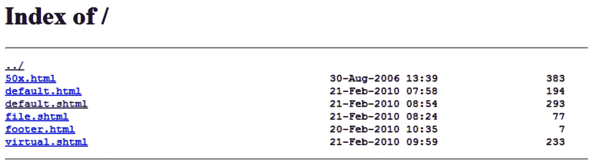

# 第四章：探索 NGINX 中的模块配置

NGINX 的真正强大之处在于其模块化系统。整个应用程序建立在一个模块化系统上，每个模块都可以在编译时启用或禁用。有些模块提供简单的功能，例如自动索引模块，它生成目录中文件的列表。另一些模块则能改变你对 Web 服务器的认知（例如重写模块）。除了已经存在的 NGINX 模块外，开发者还可以根据需要创建自己的模块。

本章末尾提供了第三方模块系统的简要概述。请注意，第三方模块由社区维护，并不能保证这些模块与你的 NGINX 版本兼容。

本章涵盖以下内容：

+   重写模块，做的不仅仅是重写 URI

+   默认 NGINX 构建中启用的附加模块

+   必须在编译时启用的可选模块

+   关于第三方模块的简要说明

# 探索重写模块

这个模块，特别是，它为 NGINX 带来了远超简单指令集的功能。它定义了一种全新的请求处理方式，接下来我们将详细讲解这一过程。

最初，该模块（正如其名称所示）的目的是进行 URL 重写。这个机制允许你摆脱包含多个参数的难看的 URL——例如，[`example.com/article.php?id=1234&comment=32—such`](http://example.com/article.php?id=1234&comment=32-such)这样的 URL 对普通访问者来说既无意义又缺乏信息。

相反，指向你网站的链接将包含有用的信息，指示你即将访问的页面的性质。示例中给出的 URL 变为[`website.com/article-1234-32-US-economy-strengthens.html`](http://website.com/article-1234-32-US-economy-strengthens.html)。这种解决方案不仅对访问者更具吸引力，对搜索引擎也是如此。URL 重写是**搜索引擎** **优化**（**SEO**）的关键元素。

这一机制背后的原理很简单：它是在接收到客户端请求后，在服务文件之前重写 URI。一旦重写，URI 将与`location`块匹配，以便找到应应用于请求的配置。这个技巧将在接下来的章节中进一步详细介绍。

## 正则表达式回顾

首先，该模块需要一定的正则表达式理解，通常称为`rewrite`指令，它接受一个模式并跟随替换的 URI。

这是一个庞大的话题；整个书籍都在解释它的细节。然而，我们即将探讨的简化方法应该足以充分利用这一机制。

### 目的

我们必须回答的第一个问题是：正则表达式的目的是什么？简单来说，主要目的是验证一个字符串是否与给定的模式匹配。该模式是用特定的语言编写的，允许定义极其复杂和精确的规则：

| **字符串** | **模式** | **是否匹配？** | **解释** |
| --- | --- | --- | --- |
| `hello` | `^``hello$` | 是 | 字符串以 `h` 字符（`^h`）开头，后接 `e`、`l`、`l`，然后以 `o` 结尾（`o$`）。 |
| `hell` | `^``hello$` | 否 | 字符串以 `h` 字符（`^h`）开头，后接 `e`、`l`、`l`，但没有以 `o` 结尾。 |
| `Hello` | `^``hello$` | 视情况而定 | 如果执行匹配的引擎区分大小写，则字符串不匹配该模式。 |

表 4.1：模式列表及解释

当使用复杂模式时，这个概念变得更加有趣，例如一个验证电子邮件地址的模式：`^[A-Z0-9._%+-]+@[A-Z0-9.-]+\.[A-Z]{2,4}$`。程序化地验证一个格式正确的电子邮件地址需要大量代码，而所有工作都可以通过单个正则表达式模式匹配来完成。

### PCRE 语法

NGINX 使用的语法来自 **Perl 兼容正则表达式**（**PCRE**）库，（如果你还记得 *第二章*）是构建你自己的版本所必需的，除非你禁用使用它的模块。它是最常用的正则表达式形式，几乎所有在这里学到的内容在其他语言变种中也适用。

最简单的形式是，模式由一个字符组成——例如，`x`。我们可以根据这个模式匹配字符串。`example` 是否与 `x` 模式匹配？是的，`example` 包含字符 `x`。它可以是多个特定字符；例如，`[a-z]` 模式匹配任意一个 `a` 到 `z` 之间的字符，甚至是字母和数字的组合：`[a-z0-9]`。因此，`hell[a-z0-9]` 模式会验证以下字符串：`hello` 和 `hell4`，但不包括 `hell` 或 `hell!`。

你可能注意到我们使用了 `[` 和 `]` 字符。这些被称为 `\`（反斜杠）：

| **元字符** | **描述** |
| --- | --- |

| `^`开始 | 该字符之后的实体必须出现在开头：

+   示例模式：`^h`

+   匹配的字符串：`hello`、`h`、`hh`（以 *h* 开头的任何内容）

+   不匹配的字符串：`character`、`ssh`

|

| `$`结束 | 该字符之前的实体必须出现在结尾：

+   示例模式：`e$`

+   匹配的字符串：`sample`、`e`、`file`（以 *e* 结尾的任何内容）

+   不匹配的字符串：`extra`、`shell`

|

| `.`（点）任何 | 匹配任何字符：

+   示例模式：`hell.`

+   匹配的字符串：`hello`、`hellx`、`hell5` 和 `hell!`

+   不匹配的字符串：`hell`，`helo`

|

| `[ ]`集合 | 匹配指定集合内的任何字符：

+   语法：`[a-z]`表示一个范围，`[abcd]`表示一个集合，`[a-z0-9]`表示两个范围。注意，如果你想在范围中包含`-`字符，你需要将其插入在`[`之后或`]`之前。

+   示例模式：`hell[a-y123-]`

+   匹配的字符串：`hello`，`hell1`，`hell2`，`hell3`，和 `hell-`

+   不匹配的字符串：`hellz`，`hell4`，`heloo`，和 `he-llo`

|

| `[^ ]` 否定集合 | 匹配不在指定集合中的任何字符：

+   示例模式：`hell[^a-np-z0-9]`

+   匹配的字符串：`hello`，和 `hell!`

+   不匹配的字符串：`hella`，`hell5`

|

| `&#124;` 或选择 | 匹配 `&#124;` 前后任一位置的实体：

+   示例模式：`hello&#124;welcome`

+   匹配的字符串：`hello`，`welcome`，`helloes`，和 `awelcome`

+   不匹配的字符串：`hell`，`ellow`，`owelcom`

|

| `( )` 分组 | 将一组实体分组，通常与 `&#124;` 一起使用。也会**捕获**匹配的实体；捕获的详细信息稍后会讲解：

+   示例模式：`^(``hello&#124;hi) there$`

+   匹配的字符串：`hello there`，`hi there`

+   不匹配的字符串：`hey there`，`ahoy there`

|

| `\` 转义 | 允许你转义特殊字符：示例模式：`Hello\` 匹配的字符串：`Hello.`，`Hello. How are you?`，`Hi! Hello...` 不匹配的字符串：`Hello`，`Hello!how`，`are you?` |
| --- | --- |

表 4.2：元字符及其作用的列表

### 量词

到目前为止，你可以使用有限数量的字符来表达简单的模式。量词允许你扩展可接受的实体数量：

| **量词** | **描述** |
| --- | --- |

| `*` 0 次或更多次 | `*` 之前的实体必须出现 0 次或更多次：

+   示例模式：`he*llo`

+   匹配的字符串：`hllo`，`hello`，`heeeello`

+   不匹配的字符串：`hallo`，`ello`

|

| `+` 至少 1 次 | 在`+`之前的实体必须出现 1 次或更多次：

+   示例模式：`he+llo`

+   匹配的字符串：`hello`，`heeeello`

+   不匹配的字符串：`hllo`，`helo`

|

| `?` 0 次或 1 次 | `?` 之前的实体必须出现 0 次或 1 次：

+   示例模式：`he?llo`

+   匹配的字符串：`hello`，`hllo`

+   不匹配的字符串：`heello`，`heeeello`

|

| `{x}` `x` 次 | `{x}` 之前的实体必须出现 `x` 次：

+   示例模式：`he{3}llo`

+   匹配的字符串：`heeello`，`oh`，`heeello there!`

+   不匹配的字符串：`hello`，`heello`，`heeeello`

|

| `{x,}` 至少 `x` 次 | `{x,}` 之前的实体必须出现至少 `x` 次：

+   示例模式：`he{3,}llo`

+   匹配的字符串：`heeello`，`heeeeeeello`

+   不匹配的字符串：`hllo`，`hello`，`hello`

|

| `{x,y}` `x` 到 `y` 次 | `{x,y}` 之前的实体必须出现次数在 `x` 和 `y` 之间：

+   示例模式：`he{2,4}llo`

+   匹配的字符串：`heello`，`heeello`，`heeeello`

+   不匹配的字符串：`hello`，`heeeeello`

|

表 4.3：量词及其作用的列表

正如您可能注意到的，正则表达式中的 `{` 和 `}` 字符与 NGINX 配置文件语法语言中的块定界符发生冲突。如果您想写一个包含 *大括号* 的正则表达式模式，您需要将模式放在引号中（单引号或双引号）：

```
rewrite hel{2,}o /hello.php; # invalid
rewrite "hel{2,}o" /hello.php; # valid
rewrite 'hel{2,}o' /hello.php; # valid
```

### 捕获

正则表达式机制的最后一个特性是能够捕获子表达式。任何放在圆括号（`( )`）中的文本都会被捕获，并且可以在匹配过程之后使用。捕获的字符将以变量的形式提供，这些变量被命名为 `$N`，其中 `N` 是按捕获顺序排列的数字索引。或者，您可以为每个捕获指定一个任意的名称（参见以下示例）。通过捕获生成的变量可以插入到指令值中。

这里有几个示例来说明这一原理：

| **模式** | **匹配字符串示例** | **捕获的内容** |
| --- | --- | --- |
| `^(``hello&#124;hi) (sir&#124;mister)$` | `hello sir` | `$1 =` `hello``$2 =` `sir` |
| `^(``hello (sir))$` | `hello sir` | `$1 =` `hello sir``$2 =` `sir` |
| `^(.*)$` | `nginx rocks` | `$1 =` `nginx rocks` |
| `^(.{``1,3})([0-9]{1,4})([?!]{1,2})$` | `abc1234!?` | `$1 =` `abc``$2 =` `1234``$3 = !?` |
| 命名捕获也可以通过以下语法实现：`?<``name>`示例：`^/(?<folder>[^/]+)/(?<file>.*)$` | `/``admin/doc` | `$folder =` `admin``$file =` `doc` |

表 4.4：模式和表达式列表

当您在 NGINX 中使用正则表达式时——例如，在 `location` 块的上下文中——您捕获的缓冲区可以在后续的指令中使用：

```
server {
    server_name website.com;
    location ~* ^/(downloads|files)/(.*)$ {
        add_header Capture1 $1;
        add_header Capture2 $2;
    }
}
```

在前面的示例中，`location` 块会将请求的 URI 与正则表达式进行匹配。适用的几个 URI 可能是 `/downloads/file.txt`、`/files/archive.zip`，甚至是 `/files/docs/report.doc`。捕获了两部分：`$1` 将包含 `downloads` 或 `files`，而 `$2` 将包含 `/downloads/` 或 `/files/` 后的内容。请注意，这里使用了 `add_header` 指令（语法：`add_header header_name header_value`；参见 *HTTP 头部* 部分），将任意头部添加到客户端响应中，仅用于演示目的。

## 内部请求

NGINX 区分外部和内部请求。外部请求直接来自客户端；然后，URI 会与可能的 `location` 块进行匹配：

```
server {
    server_name website.com;
    location = /document.html {
        deny all; # example directive
    }
}
```

客户端对 [`website.com/document.html`](http://website.com/document.html) 的请求会直接落入前面的 `location` 块。

与此相反，内部请求是通过 NGINX 的特定指令触发的。在默认的 NGINX 模块提供的指令中，有几条指令能够产生内部请求：`error_page`、`index`、`rewrite`、`try_files`、`add_before_body` 和 `add_after_body`（来自添加模块）、`include` **服务器端包含**（**SSI**）命令等。

内部请求有两种不同的类型：

+   `location`块并成为不同设置的适用对象。内部重定向的最常见情况是使用`rewrite`指令，它允许你重写请求的 URI。

+   `add_after_body`指令允许你指定一个 URI，该 URI 将在原始 URI 之后进行处理，并将结果内容附加到原始请求的主体中。SSI 模块也利用子请求通过`include` SSI 命令插入内容。

### error_page

在 NGINX HTTP 核心模块的模块指令中详细说明了，`error_page`允许你定义当发生特定错误代码时服务器的行为。最简单的形式是将 URI 与错误代码关联：

```
server {
    server_name website.com;
    error_page 403 /errors/forbidden.html;
    error_page 404 /errors/not_found.html;
}
```

当客户端尝试访问触发这些错误之一的 URI（例如加载服务器上不存在的文档或文件，导致`404`错误）时，NGINX 应该服务于与错误代码相关的页面。实际上，它不仅仅是向客户端发送错误页面；它会基于新的 URI 发起一个全新的请求。

因此，你可能会回退到不同的配置，如以下示例所示：

```
server {
    server_name website.com;
    root /var/www/vhosts/website.com/httpdocs/;
    error_page 404 /errors/404.html;
    location /errors/ {
        alias /var/www/common/errors/;
        internal;
    }
}
```

当客户端尝试加载一个不存在的文档时，最初会收到一个`404`错误。我们使用`error_page`指令指定`404`错误应该创建一个内部重定向到`/errors/404.html`。结果，NGINX 生成了一个新的请求，URI 为`/errors/404.html`。这个 URI 属于`/errors/`块，因此会应用相应的配置。

注意

日志在处理重定向和 URL 重写时尤其有用。请注意，只有在将`error_log`指令设置为`debug`时，内部重定向的信息才会出现在日志中。你还可以通过在需要的位置指定`rewrite_log on;`，使其出现在`notice`级别的日志中。

来自调试日志的一个原始但精简的摘录总结了这一机制：

```
->http request line: "GET /page.html HTTP/1.1"
->http uri: "/page.html"
->test location: "/errors/"
->using configuration ""
->http filename: "/var/www/vhosts/website.com/httpdocs/page.html"
-> open() "/var/www/vhosts/website.com/httpdocs/page.html" failed (2: No such file or directory), client: 127.0.0.1, server: website.com, request: "GET /page.html HTTP/1.1", host:"website.com"
->http finalize request: 404, "/page.html?" 1
->http special response: 404, "/page.html?"
->internal redirect: "/errors/404.html?"
->test location: "/errors/"
->using configuration "/errors/"
->http filename: "/var/www/common/errors/404.html"
->http finalize request: 0, "/errors/404.html?" 1
```

请注意，`location`块中使用`internal`指令禁止客户端访问`/errors/`目录。因此，该位置只能通过内部重定向访问。

该机制与`index`指令相同（在*Index*部分进一步详细说明）。如果客户端请求中未提供文件路径，NGINX 将通过触发内部重定向来尝试提供指定的索引页面。

### 重写

尽管之前的`error_page`指令实际上并不是重写模块的一部分，但详细介绍其功能为理解 NGINX 如何处理客户端请求提供了一个坚实的基础。

类似于`error_page`指令将请求重定向到另一个位置的方式，使用`rewrite`指令重写 URI 时会生成一个内部重定向：

```
server {
    server_name website.com;
    root /var/www/vhosts/website.com/httpdocs/;
    location /storage/ {
        internal;
        alias /var/www/storage/;
    }
    location /documents/ {
        rewrite ^/documents/(.*)$ /storage/$1;
    }
}
```

一个客户端查询`http://website.com/documents/file.txt`，最初匹配第二个`location`区块（`location /documents/`）。然而，区块中包含一个重写指令，将 URI 从`/documents/file.txt`转换为`/storage/file.txt`。URI 转换重新启动了过程；新的 URI 再次与`location`区块进行匹配。这时，第一个`location`区块（`location /storage/`）匹配 URI（`/storage/file.txt`）。

再次查看调试日志，快速了解机制：

```
->http request line: "GET /documents/file.txt HTTP/1.1"
->http uri: "/documents/file.txt"
->test location: "/storage/"
->test location: "/documents/"
->using configuration "/documents/"
->http script regex: "^/documents/(.*)$"
->"^/documents/(.*)$" matches "/documents/file.txt", client: 127.0.0.1, server: website.com, request: "GET /documents/file.txt HTTP/1.1", host: "website.com"
->rewritten data: "/storage/file.txt", args: "", client: 127.0.0.1, server: website.com, request: "GET /documents/file.txt HTTP/1.1", host: "website.com"
->test location: "/storage/"
->using configuration "/storage/"
->http filename: "/var/www/storage/file.txt"
->HTTP/1.1 200 OK
->http output filter "/storage/test.txt?"
```

### 无限循环

在众多语法和指令面前，你很容易感到困惑。更糟的是，你可能会让 NGINX 也搞混。这种情况发生在你的重写规则冗余时，导致内部重定向*无限循环*：

```
server {
    server_name website.com;
    location /documents/ {
        rewrite ^(.*)$ /documents/2018/$1;
    }
}
```

你以为自己做得很好，但实际上这个配置会触发`/documents/anything`到`/documents/2018//documents/anything`的内部重定向。而且，由于在内部重定向后会重新评估位置模式，`/documents/2018//documents/anything`将变成`/documents/2018//documents/2018//documents/anything`。

以下是来自调试日志的相应摘录：

```
->test location: "/documents/"
->using configuration "/documents/"
->rewritten data: "/documents/2018//documents/file.txt", [...]
->test location: "/documents/"
->using configuration "/documents/"
->rewritten data: "/documents/2018//documents/2018//documents/file.txt" [...]
->test location: «/documents/»
->using configuration «/documents/»
->rewritten data: -
>»/documents/2018//documents/2018//documents/2018//documents/file.txt» [...]
->[...]
```

你可能会想，这个过程会不会无限进行下去；答案是*不*。循环次数是有限制的，最多为*10*次。你只能进行 10 次内部重定向。超过此限制时，NGINX 会生成`500 Internal Server` `Error`错误信息。

对于这种情况，如果你希望随时间更新内部路径，可以通过使用`break`标志来防止无限循环，具体如后文所述，NGINX 将不会执行内部重定向。

## 条件结构

重写模块引入了一组新的指令和区块，其中包括`if`条件结构：

```
server {
    if ($request_method = POST) {
      [...]
    }
}
```

这提供了根据指定条件应用配置的可能性。如果条件为`true`，则应用配置；否则不应用。

下表描述了在形成条件时接受的各种语法：

| **操作符** | **描述** |
| --- | --- |
| 无 | 如果指定的变量或数据不等于空字符串或以字符`0`开头的字符串，则条件为`true`：`if ($``string) {``[...]``}` |
| `=`, `!=` | 如果`=`符号前的参数与后面的参数相等，则条件为`true`。以下示例可以理解为，“*如果请求方法等于* `POST`*，则应用* *配置*”:`if ($request_method =` `POST) {``[...]``}`而`!=`操作符则执行相反操作：“*如果请求方法不等于* `GET`*，则应用* *配置*”:`if ($request_method !=` `GET) {``[...]``}` |
| `~`, `~*`, `!~`, `!~*` | 如果前面的参数匹配放在 `~` 符号后面的正则表达式模式，则条件为 `true`：`if ($request_filename ~ "\.``txt$") {``[...]``}` `~` 区分大小写，而 `~*` 不区分大小写。使用 `!` 符号来否定匹配：`if ($request_filename !~* "\.``php$") {``[...]``}` 你可以在正则表达式中插入捕获缓冲区：`if ($uri ~ "^/search/(.*)$") {``set $``query $1;``rewrite ^` `http://google.com/search?q=$query;``}` |
| `-``f`, `!-f` | 测试指定文件的存在性：`if (-f $``request_filename) {``[...] # 如果文件存在``}`` 使用 `!-f` 来测试文件不存在：`if (!-f $``request_filename) {``[...] # 如果文件不存在``}` |
| `-``d`, `!-d` | 类似于 `-f` 操作符，用于测试目录的存在性。 |
| `-``e`, `!-e` | 类似于 `-f` 操作符，用于测试文件、目录或符号链接的存在性。 |
| `-``x`, `!-x` | 类似于 `-f` 操作符，用于测试文件是否存在并且可执行。 |

表 4.5：条件语法列表

从版本 1.13.8 开始，已经没有类似 `else` 或 `else if` 的指令。然而，其他允许你控制配置流顺序的指令是可用的。

你可能会想：*使用* `location` *块相对于* `if` *块有什么优势？* 确实，在以下示例中，两者似乎有相同的效果：

```
if ($uri ~ /search/) {
  [...]
}
location ~ /search/ {
    [...]
}
```

实际上，主要的区别在于可以在任一块中使用的指令。一些指令可以插入 `if` 块，而一些则不行；相反，几乎所有的指令都可以在 `location` 块中使用，正如你在前面的指令列表中可能已经注意到的那样。一般来说，最好只在 `if` 块中插入来自重写模块的指令，因为其他指令最初并不打算用于这种用途。

## 指令

重写模块为你提供了一组指令，这些指令不仅仅用于重写 URI。下表描述了这些指令，以及它们可以使用的上下文：

| **Directive** | **Description** |
| --- | --- |
| `rewrite``Context: server,` `location, if` | 如前所述，`rewrite` 指令允许你重写当前请求的 URI，从而重置该请求的处理。语法：`rewrite regexp` `replacement [flag];` 其中 `regexp` 是正则表达式，只有当 URI 匹配时，才会进行替换。 |

|  | 标志可能采用以下值之一：

+   `last`: 当前的重写规则应是最后一个应用的规则。在其应用后，新的 URI 由 NGINX 处理，并会查找 `location` 块。然而，之后的重写指令将被忽略。

+   `break`：当前的重写规则会被应用，但 NGINX 不会为修改后的 URI 发起新的请求（即不会重新开始查找匹配的`location`块）。所有后续的`rewrite`指令都会被忽略。

+   `redirect`：返回一个`302 临时移动`的 HTTP 响应，并将替换后的 URI 设置为`location`头的值。

|

|  |
| --- |

+   `permanent`：返回一个`301 永久移动`的 HTTP 响应，并将替换后的 URI 设置为`location`头的值。

+   如果你指定以`http://`开头的 URI 作为替换 URI，NGINX 会自动使用`redirect`标志。

+   请注意，指令处理的请求 URI 是一个相对 URI；它不包含主机名和协议。对于请求`http://website.com/documents/page.html`，请求 URI 是`/documents/page.html`。

+   如果解码，此 URI 对应的请求，例如`http://website.com/my%20page.html`，将变成`/my page.html`（在编码的 URI 中，`%20`表示一个空格字符）。

+   不包含参数；对于请求如`http://website.com/page.php?id=1&p=2`，URI 将是`/page.php`。在重写 URI 时，你不需要考虑将参数包含在替换 URI 中；NGINX 会为你处理。如果你希望 NGINX 在重写后的 URI 后不包含参数，必须在替换 URI 的末尾插入`?`字符：`rewrite ^/``search/(.*)$ /search.php?q=$1?`。

示例：`rewrite ^/``search/(.*)$ /search.php?q=$1;``rewrite ^/``search/(.*)$ /search.php?q=$1?;``rewrite ^` `http://website.com;``rewrite ^` `http://website.com permanent;` |

| `break`上下文：`server`，`location`，`if` | `break`指令用于防止进一步的`rewrite`指令。此时，URI 已经固定，不能再更改。示例：`if (-f $``uri) {``break; # 如果文件存在，停止重写``}``if ($uri ~ ^/``search/(.*)$) {``set $``query $1;``rewrite ^ /``search.php?q=$query?;``}`这个例子将`/search/anything`类型的查询重写为`/search.php?q=anything`。但是，如果请求的文件存在（比如`/search/index.html`），`break`指令会阻止 NGINX 重写 URI。 |
| --- | --- |
| `return`上下文: `server`, `location`, `if` | 中断请求处理并返回指定的 HTTP 状态码或指定的文本。语法：`return code &#124;` `text;` 这里，代码可以是以下状态码之一：`204`, `308`, `400`, `402`至`406`, `408`, `410`, `411`, `413`, `416`，以及`500`至`504`。此外，你还可以使用 NGINX 特有的`444`代码，返回`HTTP 200 OK`状态码并不带有响应头或正文。或者，你也可以指定一个原始文本值，作为响应体返回给用户。这在测试请求 URI 是否落在特定的`location`块内时非常有用。示例：`if ($uri ~ ^/``admin/) {``return 403;``# 以下指令` `不会执行``# 因为 Nginx 已经完成` `了请求``rewrite ^` `http://website.com;``}` |
| `set`上下文: `server`, `location`, `if` | 初始化或重新定义一个变量。请注意，有些变量无法重新定义；例如，不能修改`$uri`。语法：`set $``variable value;` 示例：`set $var1 "some` `text";``if ($var1 ~ ^(.*) (.*)$) {``set $var2 $1$2; #``拼接``rewrite ^` `http://website.com/$var2;``}` |
| `uninitialized_variable_warn`上下文: `http`, `server`, `location`, `if` | 如果设置为`on`，NGINX 将在配置中使用尚未初始化的变量时发出日志消息。语法：`on` 或 `off` 示例：`uninitialized_variable_warn on;` |
| `rewrite_log`上下文: `http`, `server`, `location`, `if` | 如果`rewrite_log`设置为`on`，NGINX 将在每次重写引擎执行操作时发出日志消息，日志级别为`notice`（参见`error_log`指令）。语法：`on` 或 `off` 默认值：`off` 示例：`rewrite_log off;` |

表 4.6：用于重写 URI 的指令列表

## 常见的重写规则

这里是一组重写规则，满足希望通过 URL 重写机制美化页面链接的动态网站的基本需求。你显然需要根据你的具体情况调整这些规则，因为每个网站都是不同的。

### 执行搜索

该重写规则用于搜索查询。搜索关键词包含在 URL 中：

+   `http://website.com/search/some-search-keywords`

+   `http://website.com/search.php?q=some-search-keywords`

+   `rewrite ^/``search/(.*)$ /search.php?q=$1?;`

### 用户个人资料页面

大多数允许访客注册的动态网站都提供个人资料查看页面。此类 URL 形式可以用于包含用户 ID 和用户名：

+   `http://website.com/user/31/James`

+   `http://website.com/user.php?id=31&name=James`

+   `rewrite ^/``user/([0-9]+)/(.+)$ /user.php?id=$1&name=$2?;`

### 多个参数

有些网站可能使用不同的语法来表示参数字符串——例如，通过斜杠分隔未命名的参数：

+   `http://website.com/index.php/param1/param2/param3`

+   `http://website.com/index.php?p1=param1&p2=param2&p3=param3`

+   `rewrite ^/``index.php/(.*)/(.*)/(.*)$ /index.php?p1=$1&p2=$2&p3=$3?;`

### 类似维基百科

现在许多网站已经采用了*维基百科*引入的 URL 样式，包括一个前缀文件夹，后跟文章名称：

+   `http:// website.com/wiki/Some_keyword`

+   **重写后的 URI**: http://website.com/wiki/index.php?title=Some_keyword

+   `rewrite ^/``wiki/(.*)$ /wiki/index.php?title=$1?;`

### 新闻网站文章

这种 URL 结构常被新闻网站采用，因为 URL 中包含了文章内容的指示。它由一个文章标识符组成，后跟一个斜杠，然后是关键词列表。通常情况下，关键词可以被忽略，并不包含在重写的 URI 中：

+   `http://website.com/33526/us-economy-strengthens`

+   `http://website.com/article.php?id=33526`

+   `rewrite ^/([``0-9]+)/.*$ /article.php?id=$1?;`

### 讨论板

现代的留言板大多使用*美观的 URL*。这个例子展示了如何创建一个带有两个参数的*话题视图* URL：话题标识符和起始帖子。再次强调，关键字会被忽略：

+   `http://website.com/topic-1234-50-some-keywords.html`

+   `http://website.com/viewtopic.php?topic=1234&start=50`

+   `rewrite ^/``topic-([0-9]+)-([0-9]+)-(.*)\.html$ /viewtopic.php?topic=$1&start=$2?;`

本章的前半部分介绍了最重要的 NGINX 模块之一——重写模块。还有许多其他模块，可以大大丰富 Web 服务器的功能；它们将在以下章节中按主题重新分组。

# 查看一些额外的模块

在本节描述的模块中，有些包含在默认的 NGINX 构建中，但有些则不包含。这意味着，除非你特别配置了 NGINX 构建以包含这些模块（如*第一章*所述），否则它们对你来说是不可用的。但请记住，重新构建 NGINX 以包含额外模块是一个相对快速且简单的过程。

## 网站访问与日志记录

以下一组模块允许你配置访客如何访问你的网站以及服务器如何记录请求。

### 索引

Index 模块提供了一个简单的指令`index`，让你定义如果客户端请求中没有指定文件名时，NGINX 将默认提供的页面（换句话说，它定义了网站的`index`页面）。你可以指定多个文件名；第一个找到的文件将会被提供。如果找不到任何指定的文件，NGINX 将尝试生成一个自动的文件索引（如果启用了`autoindex`指令，请检查 HTTP `autoindex`模块），或者返回`403 Forbidden`错误页面。

可选地，你可以插入一个绝对文件名（例如`/page.html`），但仅能作为指令的最后一个参数。

`index file1 [``file2...] [absolute_file];`

`index.html`

这是一个示例：

```
index index.php index.html index.htm;
index index.php index2.php /catchall.php;
```

此指令在以下上下文中有效：`http`、`server` 和 `location`。

### 自动索引

如果 NGINX 无法为请求的目录提供索引页面，默认行为是返回`403 Forbidden HTTP`错误页面。通过以下指令集，您可以启用自动列出请求目录中存在的文件：



图 4.1：显示自动索引模块列出目录内容的截图

每个文件会显示三列信息：文件名、文件日期和时间，以及文件大小（字节为单位）：

| **指令** | **描述** |
| --- | --- |
| `Autoindex`上下文：`http`、`server`、`location` | 启用或禁用自动目录列表，适用于缺少`index`页面的目录。语法：`on`或`off` |
| `autoindex_exact_size`上下文：`http`、`server`、`location` | 如果设置为`on`，该指令确保列表中显示文件大小（以字节为单位）。否则，将使用其他单位，如 KB、MB 或 GB。语法：`on`或`off` 默认值：`on` |
| `autoindex_localtime`上下文：`http`、`server`、`location` | 默认情况下，该指令设置为`off`，因此文件列表中的日期和时间将以格林威治标准时间（GMT）显示。将其设置为`on`可以使用本地服务器时间。语法：`on`或`off` 默认值：`off` |
| `autoindex_format`上下文：`http`、`server`、`location` | NGINX 提供以不同格式提供目录索引：HTML、XML、JSON 或 JSONP（默认使用 HTML）。语法：`autoindex_format html &#124; xml &#124; json &#124;` `jsonp;`如果将指令值设置为`jsonp`，NGINX 会将`callback`查询参数的值作为 JSONP 回调插入。例如，您的脚本应调用该 URI：`/folder/?callback=MyCallbackName`。 |

表 4.7：自动索引模块的指令列表

### 随机索引

该模块启用了一个简单的指令`random_index`，可以在`location`块中使用，以便 NGINX 从指定目录中的文件中随机选择一个`index`页面返回。

注意

该模块不包含在默认的 NGINX 构建中。

语法：`on` 或 `off`

### 日志

该模块控制 NGINX 有关访问日志的行为。它是系统管理员的一个关键模块，因为它可以分析 Web 应用程序的运行时行为。它由三个基本指令组成：

| **指令** | **描述** |
| --- | --- |

| `access_log`上下文：`http`、`server`、`location`、`if`（在 location 中）、`limit_except` | 此参数定义访问日志文件路径和通过选择模板名称来记录条目的格式，或者禁用访问日志记录。语法：`access_log path [format [buffer=size]] &#124;` `off;`关于指令语法的一些备注：

+   使用`access_log off`来禁用当前级别的访问日志记录

+   格式参数对应于通过`log_format`指令声明的模板

+   如果未指定格式参数，则使用默认格式（combined）。

+   您可以在文件路径中使用变量

|

| `log_format`上下文：`http`，`server`，`location` | 定义供 `access_log` 指令使用的模板，描述应包含在访问日志条目中的内容。语法：`log_format template_name [``escape=default&#124;json] format_string;`默认模板称为 `combined`，匹配以下示例：`log_format combined '$remote_addr - $remote_user [$time_local] '"$``request" $status``$``body_bytes_sent '"$http_referer"``"$``http_user_agent"';``#` `其他示例``log_format simple '$``remote_addr $request';` |
| --- | --- |
| `open_log_file_cache`上下文：`http`，`server`，`location` | 配置日志文件描述符的缓存。有关更多信息，请参阅 HTTP 核心模块的 `open_file_cache` 指令。语法：`open_log_file_cache max=N [inactive=time] [min_uses=N] [valid=time] &#124;` `off;`参数类似于 `open_file_cache` 指令和其他相关指令，不同之处在于它仅适用于访问日志文件。 |

表 4.8：日志模块的指令列表

日志模块还启用了几个新变量，尽管它们只能在编写日志条目时访问：

+   `$connection`：连接编号

+   `$pipe`：如果请求是流水线处理的，则变量设置为 `p`

+   `$time_local`：本地时间（写入日志条目时）

+   `$msec`：本地时间（写入日志条目时）到微秒级别

+   `$request_time`：请求处理的总时长，以毫秒为单位

+   `$status`：响应状态码

+   `$bytes_sent`：发送到客户端的总字节数

+   `$body_bytes_sent`：发送到客户端的响应体字节数

+   `$apache_bytes_sent`：类似于 Apache 的 `mod_log_config` 中 `%B` 参数对应的 `$body_bytes`

+   `$request_length`：请求体的长度

## 限制和约束

以下模块允许您管理对网站文档的访问、要求用户进行身份验证、匹配一组规则或仅限制对特定访客的访问。

### auth_basic 模块

`auth_basic` 模块使基本认证功能生效。通过其引入的两个指令，您可以使网站（或服务器）的特定位置仅限于使用用户名和密码进行身份验证的用户：

```
location /admin/ {
    auth_basic "Admin control panel"; # variables are supported
    auth_basic_user_file access/password_file;
}
```

第一个指令 `auth_basic` 可以设置为 `off` 或文本消息，通常称为 *身份验证挑战* 或 *身份验证领域*。当客户端尝试访问受保护资源时，Web 浏览器会显示此消息在用户名/密码框中。

第二个指令 `auth_basic_user_file` 定义了密码文件相对于配置文件目录的路径。密码文件由符合 `username:[{SCHEME}]password[:comment]` 语法的行组成：

+   `username`：明文用户名。

+   `{SCHEME}`：可选的密码哈希方法。目前支持三种方案：`{PLAIN}` 代表明文密码，`{SHA}` 代表 SHA-1 哈希，`{SSHA}` 代表带盐的 SHA-1 哈希。

重要提示

请注意，虽然 `PLAIN` 和 `SHA` 仍然支持，但它们是不安全的方法。我们建议使用 `SSHA` 进行密码加盐。

+   `password`：密码。

+   `comment`：供自己使用的纯文本注释。

如果未指定方案，密码需要使用 `crypt(3)` 函数进行加密——例如，可以借助 Apache 包中的 `htpasswd` 命令行工具进行加密。

### 访问

本模块引入了两个重要的指令：`allow` 和 `deny`。它们允许您为特定的 IP 地址或 IP 地址范围允许或拒绝对资源的访问。

两个指令具有相同的语法：`allow IP` | `CIDR` | `unix:` | `all`，其中 `IP` 是 IP 地址，`CIDR` 是 IP 地址范围（`unix:` 代表所有 Unix 域套接字，`all` 表示该指令适用于所有客户端）。

```
location {
allow 127.0.0.1; # allow local IP address
allow unix:; # allow UNIX domain sockets
    deny all; # deny all other IP addresses
}
```

重要提示

请注意，规则是从上到下处理的：如果您的第一个指令是 `deny all`，则之后放置的所有 `allow` 异常将无效。反之亦然；如果从 `allow all` 开始，之后放置的所有 `deny` 指令也将无效，因为您已经允许了所有 IP 地址。

### 限制连接

该模块引入的机制比常规机制稍微复杂一些。它允许您定义特定 *区域* 中同时连接到服务器的最大数量。

第一步是使用 `limit_conn_zone` 指令定义区域：

+   指令语法为 `limit_conn_zone $``variable zone=name:size;`

+   `$variable` 是用于区分不同客户端的变量，通常为 `$binary_remote_addr`，即客户端的二进制格式 IP 地址（比 ASCII 格式更高效）。

+   `name` 是为区域指定的任意名称。

+   `size` 是分配给存储会话状态表的最大大小。

以下示例根据客户端 IP 地址（传入连接）定义区域：

```
limit_conn_zone $binary_remote_addr zone=myzone:10m;
```

现在您已经定义了一个区域，可以使用 `limit_conn` 限制连接数：

```
limit_conn zone_name connection_limit;
```

应用到之前的示例后，变成以下内容：

```
location /downloads/ {
    limit_conn myzone 1;
}
```

结果是，共享相同 `$binary_remote_addr` IP 地址的请求会受到连接限制（每次连接仅允许一个）。如果达到限制，所有额外的并发请求将返回 `503 Service Unavailable` HTTP 响应。如果希望使用其他响应码，可以通过 `limit_conn_status` 指令指定。若要记录受限客户端请求的日志，请启用 `limit_conn_log_level` 指令，并指定日志级别（`info` | `notice` | `warn` | `error`）。

### 限制请求

类似地，Limit 请求模块允许您限制特定区域的请求数量。

定义区域是通过`limit_req_zone`指令完成的；它的语法与 Limit 区域的等效指令不同：

```
limit_req_zone $variable zone=name:max_memory_size rate=rate;
```

指令的参数是相同的，唯一不同的是`rate`参数，它在`limit_req`指令中表示：

```
limit_req zone=name burst=burst [nodelay];
```

`burst`参数定义了请求的最大爆发次数。当从客户端收到的请求数量超过区域中定义的限制时，响应会根据你定义的速率进行延迟。在一定程度上，只有最多`burst`个请求会同时被接受。超过此限制后，NGINX 会返回`503 Service Unavailable` HTTP 错误响应。如果你通过`limit_req_status`指令指定了其他状态码，则可以覆盖此响应代码：

```
limit_req_zone $binary_remote_addr zone=myzone:10m rate=2r/s;
[...]
location /downloads/ {
limit_req zone=myzone burst=10;
limit_req_status 404; # returns a 403 error if limit is exceeded
}
```

如果你希望记录受你设置的限制影响的客户端请求，请启用`limit_req_log_level`指令，并指定日志级别（`info` | `notice` | `warn` | `error`）。

### 身份验证请求

`auth_request`模块是在 NGINX 的最新版本中实现的，允许你根据子请求的结果来允许或拒绝对某个资源的访问。NGINX 通过`auth_request`指令调用你指定的 URI：如果子请求返回`2xx`响应码（例如`HTTP/200 OK`），则允许访问。如果子请求返回`401`或`403`状态码，则拒绝访问，NGINX 将响应码转发给客户端。如果后端返回任何其他响应码，NGINX 将视其为错误并拒绝访问该资源：

```
location /downloads/ {
# if the script below returns a 200 status code,
# the download is authorized
auth_request /authorization.php;
}
```

此外，模块还提供了第二个指令，名为`auth_request_set`，允许你在子请求执行后设置一个变量。你可以插入来自子请求上游的变量（`$upstream_http_*`），例如`$upstream_http_server`或其他 HTTP 头信息，这些来自服务器响应：

```
location /downloads/ {
     # requests authorization from PHP script
     auth_request /authorization.php;
     # assuming authorization is granted, get filename from
     # sub-request response header and redirect
     auth_request_set $filename "${upstream_http_x_filename}.zip";
    rewrite ^ /documents/$filename;
}
```

## 内容和编码

以下模块集提供了对客户端服务内容的功能影响，无论是通过修改响应编码方式、影响头部信息，还是通过从头开始生成响应。

### 空 GIF

此模块的目的是提供一个指令，从内存中提供一个 1x1 透明 GIF 图像。这种文件有时被网页设计师用来调整他们网站的外观。使用此指令，你可以直接从内存获取一个空的 GIF，而无需从存储空间读取和处理实际的 GIF 文件。

要使用此功能，只需在你选择的位置插入`empty_gif`指令：

```
location = /empty.gif {
    empty_gif;
}
```

### MP4

MP4 是一个模块，它提供了一种简单的功能，尤其在服务 MP4 视频文件时非常有用。它解析请求的特殊参数`start`，该参数指示客户端希望下载或伪流的部分偏移量。因此，视频文件必须通过以下 URI 访问：`video.mp4?start=XXX`。这一参数通常由主流视频播放器（例如 JW Player）自动准备。

注意

本模块不包含在默认的 NGINX 构建中。

要使用此功能，只需在你选择的位置插入 `.mp4` 指令：

```
location ~* \.mp4 {
    mp4;
}
```

请注意，如果 NGINX 无法在视频文件中找到请求的位置，请求将导致 `500 内部服务器错误` HTTP 响应。JW Player 有时会误解此错误，直接显示 `视频未找到` 错误信息。

### HTTP 头部

本模块引入了三个指令，这些指令会影响发送给客户端的响应头。

首先，`add_header name value [always]` 让你在响应头中添加一行，遵循以下语法：`Name: value`。该行仅在以下响应码的响应中添加：`200`、`201`、`204`、`301`、`302` 或 `304`。你可以在 `value` 参数中插入变量。如果在指令值的末尾指定 `always`，则无论响应码是什么，头部都会始终添加。

此外，`add_trailer name value [always]` 指令允许你在响应结尾处添加一个头部，如果响应码是 `200`、`201`、`204`、`206`、`301`、`302`、`303`、`307` 或 `308` 中的任何一个。此指令可以多次指定，以添加多个头部。`always` 标志与 `add_header` 版本的作用相似。

最后，`expires` 指令允许你控制发送给客户端的 `Expires` 和 `Cache-Control` HTTP 头的值，影响相同响应码的请求，如前所列。它接受以下其中一个值：

+   `off`：不修改任何头部。

+   `expires 24h` 将返回设置为 24 小时后的过期日期。

+   `epoch`：文件的过期日期设置为 1970 年 1 月 1 日。`Cache-Control` 头设置为 `no-cache`。

+   `max`：文件的过期日期设置为 2037 年 12 月 31 日。`Cache-Control` 头设置为 10 年。

### 附加

附加模块允许你通过简单的指令在 HTTP 响应的正文前后添加内容。

注意

本模块不包含在默认的 NGINX 构建中。

主要的两个指令如下：

+   `add_before_body file_uri;`

+   `add_after_body file_uri;`

如前所述，NGINX 会触发一个子请求来获取指定的 URI。此外，如果你的 `location` 匹配模式不够具体（默认：`text/html`），你可以定义要追加内容的文件类型：

```
addition_types mime_type1 [mime_type2...];
addition_types *;
```

### 替换

与之前的模块类似，替换模块允许你直接在响应体中搜索并替换文本：

```
sub_filter searched_text replacement_text;
```

本模块不包含在默认的 NGINX 构建中。

两个附加指令提供了更多的灵活性：

+   `sub_filter_once`（`on` 或 `off`，默认值 `on`）：只会替换文本一次，并在第一次出现后停止。

+   `sub_filter_types`（默认值 `text/html`）：影响将适用于文本替换的其他 MIME 类型。允许使用 `*` 通配符。

### Gzip 过滤器

本模块允许您在将响应体发送到客户端之前，使用 Gzip 算法对其进行压缩。要启用 Gzip 压缩，请在`http`、`server`、`location`甚至`if`级别（虽然不推荐）使用`gzip`指令（`on`或`off`）。以下指令将帮助您进一步配置过滤器选项：

| **指令** | **描述** |
| --- | --- |
| `gzip_buffers`上下文：`http`，`server`，`location` | 定义用于存储压缩响应的缓冲区的数量和大小。语法：`gzip_buffers` `数量 大小;` 默认值：`gzip_buffers 4 4k`（或`8k`，取决于操作系统） |
| `gzip_comp_level`上下文：`http`，`server`，`location` | 定义算法的压缩级别。指定的值范围从`1`（低压缩，CPU 更快）到`9`（高压缩，速度较慢）。语法：数值 默认值：`1` |
| `gzip_disable`上下文：`http`，`server`，`location` | 禁用 Gzip 压缩，适用于`User-Agent` HTTP 头部匹配指定正则表达式的请求。语法：正则表达式 默认值：无 |
| `gzip_http_version`上下文：`http`，`server`，`location` | 启用指定协议版本的 Gzip 压缩。语法：`1.0`或`1.1` 默认值：`1.1` |
| `gzip_min_length`上下文：`http`，`server`，`location` | 如果响应体长度小于指定值，则不进行压缩。语法：数值（大小） 默认值：`0` |

| `gzip_proxied`上下文：`http`，`server`，`location` | 启用或禁用对来自代理的响应体进行 Gzip 压缩（参见后续章节中的反向代理机制）。此指令接受以下参数；某些参数可以组合使用：

+   `off/any`：禁用或启用所有请求的压缩

+   `expired`：如果`Expires`头部禁止缓存，则启用压缩

+   `no-cache/no-store/private`：如果`Cache-Control`头部设置为`no-cache`、`no-store`或`private`，则启用压缩。

+   `no_last_modified`：如果未设置`Last-Modified`头部，则启用压缩

+   `no_etag`：如果未设置`ETag`头部，则启用压缩

+   `auth`：如果设置了`Authorization`头部，则启用压缩

|

| `gzip_types`上下文：`http`，`server`，`location` | 启用除默认`text/html` MIME 类型之外的其他类型的压缩。语法：`gzip_types` `mime_type1 [mime_type2...];` `gzip_types *;` 默认值：`text/html`（无法禁用） |
| --- | --- |
| `gzip_vary`上下文：`http`，`server`，`location` | 将`Vary: Accept-Encoding` HTTP 头部添加到响应中。语法：`on`或`off` 默认值：`off` |
| `gzip_window`上下文：`http`，`server`，`location` | 设置 Gzipping 操作的窗口缓冲区大小（`windowBits`参数）。此指令的值用于调用 Zlib 库中的函数。语法：数值（大小） 默认值：Zlib 库中的`MAX_WBITS`常量 |
| `gzip_hash`上下文：`http`，`server`，`location` | 设置分配给内部压缩状态（`memLevel` 参数）的内存量。此指令的值用于调用 Zlib 库中的函数。语法：数值（大小）默认值：Zlib 先决库中的 `MAX_MEM_LEVEL` 常量 |
| `postpone_gzipping`上下文：`http`，`server`，`location` | 定义在开始 Gzip 压缩之前必须达到的最小数据阈值。语法：大小（数值）默认值：`0` |
| `gzip_no_buffer`上下文：`http`，`server`，`location` | 默认情况下，NGINX 等到至少有一个缓冲区（由 `gzip_buffers` 定义）填充了数据后，才会将响应发送给客户端。启用此指令将禁用缓冲区。语法：`on` 或 `off` 默认值：`off` |

表 4.9：Gzip 模块的指令列表

### Gzip 静态

该模块为 Gzip 过滤器机制添加了简单的功能。当其 `gzip_static` 指令（`on`、`off` 或 `always`）启用时，NGINX 会在服务请求的文件之前，自动查找对应的 `.gz` 文件。这允许 NGINX 发送预压缩的文档，而不是在每次请求时动态压缩文档。指定 `always` 将强制 NGINX 无论客户端是否接受 `gzip` 编码，都服务 `gzip` 版本。

注意

该模块不包含在默认的 NGINX 构建中。

如果客户端请求 `/documents/page.html`，NGINX 会检查是否存在 `/documents/page.html.gz` 文件。如果找到 `.gz` 文件，则将其提供给客户端。请注意，NGINX 并不会生成 `.gz` 文件，即使在提供请求的文件后也不会生成。

### Gunzip 过滤器

使用 Gunzip 过滤器模块，您可以解压后端发送的 Gzip 压缩响应，并将其 *原始* 内容直接提供给客户端—例如，在客户端浏览器无法处理 Gzip 文件的情况下（如 Microsoft Internet Explorer 6）。只需在 `location` 块中插入 `gunzip on;` 来使用此模块。您还可以使用 `gunzip_buffers amount size;` 设置缓冲区的数量和大小，其中 `amount` 是要分配的缓冲区数量，`size` 是每个分配的缓冲区的大小。

### 字符集过滤器

使用字符集过滤器模块，您可以更准确地控制响应体的字符集。不仅可以指定 `Content-Type` HTTP 头中的 `charset` 参数的值（如 `Content-Type: text/html; charset=utf-8`），NGINX 还可以自动重新编码数据为指定的编码方法：

| **指令** | **描述** |
| --- | --- |
| `charset`上下文：`http`，`server`，`location`，`if` | 此指令将指定的编码添加到响应的 `Content-Type` 头中。如果指定的编码与 `source_charset` 编码不同，NGINX 会重新编码文档。语法：`charset encoding &#124;` `off;` 默认值：`off` 示例：`charset utf-8;` |
| `source_charset`上下文：`http`、`server`、`location`、`if` | 定义响应的初始编码；如果 `charset` 指令中指定的值不同，NGINX 将重新编码文档。语法：`source_charset encoding;` |
| `override_charset`上下文：`http`、`server`、`location`、`if` | 当 NGINX 从代理或 FastCGI 网关接收到响应时，定义是否检查字符编码并可能进行覆盖。语法：`on` 或 `off` 默认值：`off` |
| `charset_types`上下文：`http`、`server`、`location` | 定义符合重新编码条件的 MIME 类型。语法：`charset_types mime_type1 [mime_type2...];` `charset_types *;` 默认值：`text/html`、`text/xml`、`text/plain`、`text/vnd.wap.wml`、`application/x-javascript` 和 `application/rss+xml` |
| `charset_map`上下文：`http` | 允许您定义字符重新编码表。表的每一行包含两个需要交换的十六进制代码。您可以在默认的 NGINX 配置文件夹中找到 `koi8-r` 字符集的重新编码表（`koi-win` 和 `koi-utf`）。语法：`charset_map src_encoding dest_encoding { ... }` |

表 4.10：Charset 过滤器模块的指令列表

### Memcached

Memcached 是一个可以通过套接字连接的守护进程应用程序。顾名思义，它的主要目的是提供一个高效的分布式键/值内存缓存系统。NGINX Memcached 模块提供了一些指令，使您可以配置访问 Memcached 守护进程：

| **指令** | **描述** |
| --- | --- |
| `memcached_pass`上下文：`location`、`if` | 定义 Memcached 守护进程的主机名和端口。语法：`memcached_pass hostname:port;` 示例：`memcached_pass localhost:11211;` |
| `memcached_bind`上下文：`http`、`server`、`location` | 强制 NGINX 使用指定的本地 IP 地址连接到 Memcached 服务器。如果您的服务器连接到多个网络的不同网卡时，这非常有用。语法：`memcached_bind IP_address;` 示例：`memcached_bind 192.168.1.2;` |
| `memcached_connect_timeout`上下文：`http`、`server`、`location` | 定义连接超时时间（以毫秒为单位，默认值：`60000`）。示例：`memcached_connect_timeout 5000;` |
| `memcached_send_timeout`上下文：`http`、`server`、`location` | 定义数据写入操作的超时时间（以毫秒为单位，默认值：`60000`）。示例：`memcached_send_timeout 5,000;` |
| `memcached_read_timeout`上下文：`http`、`server`、`location` | 定义数据读取操作的超时时间（以毫秒为单位，默认值：`60000`）。示例：`memcached_read_timeout 5,000;` |
| `memcached_buffer_size`上下文：`http`、`server`、`location` | 定义读写缓冲区的大小（以字节为单位，默认值：页面大小）。示例：`memcached_buffer_size 8k;` |
| `memcached_next_upstream`上下文：`http`，`server`，`location` | 当`memcached_pass`指令连接到上游块时（参见 Upstream 模块），此指令定义应满足的条件，以便跳到下一个上游服务器。语法：从`error timeout`，`invalid_response`，`not_found`或`off`中选择的值 默认值：`error timeout` 示例：`memcached_next_upstream off;` |
| `memcached_gzip_flag`上下文：`http`，`server`，`location` | 检查`memcached`服务器响应中是否存在指定的标志。如果该标志存在，NGINX 会将`Content-encoding`头设置为`gzip`，以指示将提供压缩的内容。语法：数字标志 默认值：（无） 示例：`memcached_gzip_flag 1;` |

表 4.11：Memcached 模块的指令列表

此外，您需要定义一个`$memcached_key`变量，用于定义您正在放置或从缓存中获取的元素的键。例如，您可以使用`set $memcached_key $uri`或`set $memcached_key $uri?$args`。

请注意，NGINX Memcached 模块只能从缓存中检索数据；它不会存储请求的结果。将数据存储到缓存中应该由服务器端脚本完成。只需要确保在服务器端脚本和 NGINX 配置中使用相同的键命名方案。例如，如果请求的 URI 未找到，我们可以决定使用`memcached`从缓存中获取数据，然后将请求传递给代理（有关代理模块的更多详细信息，请参见*第六章*）：

```
server {
    server_name example.com;
    [...]
    location / {
        set $memcached_key $uri;
        memcached_pass 127.0.0.1:11211;
        error_page 404 @notcached;
    }
    location @notcached {
        internal;
        # if the file is not found, forward request to proxy
        proxy_pass 127.0.0.1:8080;
    }
}
```

### 图像过滤器

此模块通过**GD 图形库**（也称为**gdlib**）提供图像处理功能。

注意

此模块不包含在默认的 NGINX 构建中。

确保在仅过滤图片文件的`location`块中使用以下指令，例如`location ~* \.(png|jpg|gif|webp)$ { ... }`：

| **指令** | **描述** |
| --- | --- |

| `image_filter`上下文：`location` | 允许在将图像发送给客户端之前对其进行转换。有五个选项可用：

+   `off`：关闭之前设置的`image_filter`。

+   `test`：确保请求的文档是一个图片文件；如果测试失败，则返回`415 不支持的媒体类型`HTTP 错误。

+   `size`：生成一个简单的 JSON 响应，指示图片的相关信息，例如大小和类型（例如：`{ "img": { "width":50, "height":50, "type":"png"}}`）。如果文件无效，则返回一个简单的`{}`实例。

+   `resize width height`：将图片调整为指定的尺寸。

+   `crop width height`：选择图片中指定尺寸的部分。

+   `rotate 90` &#124; `180` &#124; `270`：按指定角度（度数）旋转图片。

示例：`image_filter resize` `200 100;` |

| `image_filter_buffer`上下文: `http`，`server`，`location` | 定义需要处理的图像的最大文件大小。默认值：`image_filter_buffer 1m;` |
| --- | --- |
| `image_filter_jpeg_quality`上下文: `http`，`server`，`location` | 定义输出 JPEG 图像的质量。默认值：`image_filter_jpeg_quality 75;` |
| `image_filter_webp_quality`上下文: `http`，`server`，`location` | 定义输出 `webp` 图像的质量。默认值：`image_filter_webp_quality 80;` |
| `image_filter_transparency`上下文: `http`，`server`，`location` | 默认情况下，PNG 和 GIF 图像在使用图像过滤模块执行操作时会保持其现有的透明度。如果将此指令设置为 `off`，则所有现有的透明度将丢失，但图像质量将得到提高。语法：`on` 或 `off` 默认值：`on` |
| `image_filter_sharpen`上下文: `http`，`server`，`location` | 通过指定的百分比锐化图像（数值可以超过 100）。语法：数值 默认值：`0` |
| `image_filter_interlace`上下文: `http`，`server`，`location` | 启用输出图像的隔行扫描。如果输出图像是 JPG 文件，则图像会以 *渐进式* *JPEG* 格式生成。语法：`on` 或 `off` 默认值：`off` |

表 4.12：图像过滤模块的指令列表

注意

对于 JPG 图像，NGINX 会自动剥离元数据（例如 **EXIF**），如果元数据占文件总空间的百分比超过五。

### XSLT

NGINX XSLT 模块允许你在向客户端提供服务之前，对从后端服务器（代理、FastCGI 等）接收到的 XML 文件或响应应用 **可扩展样式表语言转换（**XSLT**）** 转换：

| **指令** | **描述** |
| --- | --- |
| `xml_entities`上下文: `http`，`server`，`location` | 指定包含符号元素定义的 **文档类型定义（**DTD**）** 文件。语法：文件路径 示例：`xml_entities xml/entities.dtd;` |
| `xslt_stylesheet`上下文: `location` | 指定 XSLT 模板文件路径及其参数。变量可以插入到参数中。语法：`xslt_stylesheet template [``param1] [param2...];` 示例：`xslt_stylesheet` `xml/sch.xslt param=value;` |
| `xslt_types`上下文: `http`，`server`，`location` | 定义应用转换的额外 MIME 类型，除了 `text/xml`。语法：MIME 类型 示例：`xslt_types` `text/xml text/plain;``xslt_types *;` |
| `xslt_paramxslt_string_param`上下文: `http`，`server`，`location` | 两个指令都允许为 XSLT 样式表定义参数。不同之处在于指定的值如何被解释：使用 `xslt_param`，值中的 XPath 表达式将被处理；`xslt_string_param` 应该用于普通字符字符串。语法：`xslt_param` `key value;` |

表 4.13：XSLT 模块的指令列表

## 关于您的访客

以下一组模块提供额外的功能，帮助你了解更多关于访问者的信息，比如解析客户端请求头中的浏览器名称和版本，给相似请求分配标识符等。

### 浏览器

浏览器模块解析客户端请求中的`User-Agent` HTTP 头，以便为稍后在配置中使用的变量设定值。产生的三个变量如下：

+   `$modern_browser`：如果客户端浏览器被识别为现代网页浏览器，则该变量的值由`modern_browser_value`指令定义。

+   `$ancient_browser`：如果客户端浏览器被识别为旧版网页浏览器，则该变量的值由`ancient_browser_value`指令定义。

+   `$msie`：如果客户端使用 Microsoft Internet Explorer 浏览器，则该变量被设置为`1`。

为了帮助 NGINX 识别网页浏览器，并区分旧版和现代浏览器，你需要插入多个`ancient_browser`和`modern_browser`指令：

```
modern_browser opera 10.0;
```

在这个示例中，如果`User-Agent` HTTP 头包含 Opera 10.0，那么客户端浏览器被认为是现代浏览器。

### 映射

与浏览器模块相同，Map 模块允许你根据变量创建值的映射：

```
map $uri $variable {
  /page.html  0;
  /contact.html  1;
  /index.html  2;
  default 0;
}
rewrite ^ /index.php?page=$variable;
```

`map`指令只能插入`http`块中。按照此示例，`$variable`可能有三个不同的值。如果`$uri`被设置为`/page.html`，则`$variable`的值为`0`；如果`$uri`被设置为`/contact.html`，则`$variable`的值为`1`；如果`$uri`被设置为`/index.html`，则`$variable`的值为`2`。对于所有其他情况（`default`），`$variable`被设置为`0`。最后一条指令会相应地重写 URL。除了`default`，`map`指令还接受另一个特殊关键字：`hostnames`。它允许你使用通配符（如`*.domain.com`）来匹配主机名。最后，可以将映射标记为`volatile`，这将使映射不可缓存。

另外两个指令允许你调整 NGINX 管理内存机制的方式：

+   `map_hash_max_size`：设置持有映射的哈希表的最大大小。

+   `map_hash_bucket_size`：映射中每个条目的最大大小。

如果在模式前加上`~`（区分大小写）或`~*`（不区分大小写），也可以使用正则表达式：

```
map $http_referer $ref {
~google "Google";
    ~* yahoo "Yahoo";
    \~bing "Bing"; # not a regular expression due to the \ before the tilde
default $http_referer; # variables may be used
}
```

### 地理

本模块的目的是提供与`map`指令非常相似的功能，依据客户端数据（在此案例中为 IP 地址）影响变量。语法略有不同，允许你指定 IPv4 和 IPv6 地址范围（CIDR 格式）：

```
geo $variable {
  default unknown;
  127.0.0.1   local;
  123.12.3.0/24  uk;
  92.43.0.0/16  fr;
}
```

请注意，前面的代码块只是为了示例展示，实际上并不会检测英国和法国的访问者；如果你想实现准确的地理位置检测，应该使用 GeoIP 模块。在这个代码块中，你可以插入一些特定于此模块的指令：

+   `delete`：允许你从映射中移除指定的子网。

+   `default`：如果用户的 IP 地址不匹配任何指定的 IP 范围，则为 `$variable` 提供的默认值。

+   `include`：允许你包含一个外部文件。

+   `proxy`：定义受信任地址的子网。如果用户的 IP 地址属于这些受信任的地址之一，则使用 `X-Forwarded-For` 头部的值作为 IP 地址，而不是套接字的 IP 地址。

+   `proxy_recursive`：如果启用，即使客户端 IP 地址不受信任，它也会查找 `X-Forwarded-For` 头部的值。

+   `ranges`：如果你将此指令作为 `geo` 块的第一行插入，它允许你指定 IP 范围，而不是 CIDR 子网掩码。如下语法是允许的：`127.0.0.1-127.0.0.255 LOCAL;`。

### GeoIP

尽管名称与之前的模块有一些相似之处，但这个可选模块通过利用 *MaxMind* ([`www.maxmind.com/en/home`](https://www.maxmind.com/en/home)) 的 GeoIP 二进制数据库，提供关于访问者的准确地理位置信息。你需要从 *MaxMind* 网站下载数据库文件，并将其放置在 NGINX 目录中。

注意

该模块未包含在默认的 NGINX 构建中。

然后，你只需使用任一指令指定数据库路径：

```
geoip_country country.dat; # country information db
geoip_city city.dat; # city information db
geoip_org geoiporg.dat; # ISP/organization db
```

第一个指令启用几个变量：`$geoip_country_code`（两字母国家代码）、`$geoip_country_code3`（三字母国家代码）和 `$geoip_country_name`（完整的国家名称）。第二个指令包含相同的变量，但提供更多信息：`$geoip_region`，`$geoip_city`，`$geoip_postal_code`，`$geoip_city_continent_code`，`$geoip_latitude`，`$geoip_longitude`，`$geoip_dma_code`，`$geoip_area_code` 和 `$geoip_region_name`。第三个指令通过填充 `$geoip_org` 变量，提供关于指定 IP 地址的组织或 ISP 的信息。

注意

如果你需要变量以 UTF-8 编码，只需在 `geoip_` 指令的末尾添加 `utf8` 关键字。

### 用户 ID 过滤器

这个模块通过发放 cookies 来为客户端分配一个标识符。标识符可以通过配置中的 `$uid_got` 和 `$uid_set` 变量来访问：

| **指令** | **描述** |
| --- | --- |

| `userid`上下文：`http`，`server`，`location` | 启用或禁用 cookies 的发放和记录。该指令接受四种可能的值：

+   `on`：启用 v2 cookies 并记录它们

+   `v1`：启用 v1 cookies 并记录它们

+   `log`：不发送 cookie 数据，但记录传入的 cookies

+   `off`：不发送 cookie 数据

默认值：`userid off;` |

| `userid_service`上下文：`http`，`server`，`location` | 定义发放 cookie 的服务器的 IP 地址。语法：`userid_service ip;` 默认值：服务器的 IP 地址 |
| --- | --- |
| `userid_name`上下文：`http`，`server`，`location` | 定义分配给 cookie 的名称。语法：`userid_name name;` 默认值：用户标识符 |
| `userid_domain`上下文：`http`，`server`，`location` | 定义分配给 cookie 的域名。语法：`userid_domain domain;`默认值：无（域名部分不发送） |
| `userid_path`上下文：`http`，`server`，`location` | 定义 cookie 的路径部分。语法：`userid_path path;`默认值：`/` |
| `userid_expires`上下文：`http`，`server`，`location` | 定义 cookie 的过期日期。语法：`userid_expires date &#124;` `max;`默认值：没有过期日期 |
| `userid_p3p`上下文：`http`，`server`，`location` | 为与 cookie 一起发送的**隐私偏好平台项目**（**P3P**）头分配一个值。语法：`userid_p3p data;`默认值：无 |

表 4.14：userid cookie 标识符模块的指令列表

### 来源

本模块引入了一个简单的指令：`valid_referers`。它的目的是检查客户端请求中的`Referer` HTTP 头，并根据其值可能拒绝访问。如果来源被认为是无效的，`$invalid_referer`将被设置为`1`。在有效来源列表中，您可以使用三种类型的值：

+   **无**：没有来源被认为是有效的来源

+   `XXXXX`) 也被视为有效

+   **服务器名称**：指定的服务器名称被认为是有效的来源

在定义了`$invalid_referer`变量后，例如，如果发现来源无效，您可以返回一个错误代码：

```
valid_referers none blocked *.website.com *.google.com;
  if ($invalid_referer) {
  return 403;
}
```

请注意，伪造`Referer` HTTP 头是一个非常简单的过程，因此检查客户端请求的来源不应作为安全措施。

本模块还提供了两个指令，`referer_hash_bucket_size`和`referer_hash_max_size`，分别允许您定义有效来源哈希表的桶大小和最大大小。

### 实际 IP

本模块提供了一个简单的功能：它将客户端 IP 地址替换为`X-Real-IP` HTTP 头中指定的地址，适用于通过代理访问您网站的客户端，或在使用 NGINX 作为后端服务器时，从正确的头部获取 IP 地址（如果您有 Apache 经验，它与 Apache 的`mod_rpaf`效果相同）。要启用此功能，您需要插入`real_ip_header`指令，定义要使用的 HTTP 头：`X-Real-IP`或`X-Forwarded-For`。第二步是定义可信任的 IP 地址；换句话说，就是允许使用这些头的客户端。这可以通过`set_real_ip_from`指令来实现，该指令接受 IP 地址和 CIDR 地址范围：

```
real_ip_header X-Forwarded-For;
set_real_ip_from 192.168.0.0/16;
set_real_ip_from 127.0.0.1;
set_real_ip_from unix:; # trusts all UNIX-domain sockets
```

| **指令** | **描述** |
| --- | --- |
| `set_real_ip_from`上下文：`http`，`server`，`location` | 设置将触发真实 IP 头替换的信任地址。将其设置为前置 NGINX 的可信反向代理的 IP（或多个代理）。此指令可以多次指定，并允许使用主机名。`unix:`的特殊值将所有 Unix 套接字设置为受信任。语法：`set_real_ip_from address | CIDR | ` `unix:;` 默认值：无 |
| `real_ip_header`上下文：`http`，`server`，`location` | 设置用于替代 IP 地址的头字段。`proxy_protocol`特殊值将 IP 更改为来自 Proxy 协议的 IP。语法：`real_ip_header field | X-Real-Ip | X-Forwarded-For | ` `proxy_protocol;` 默认值：`X-Real-Ip` |
| `real_ip_recursive`上下文：`http`，`server`，`location` | 如果设置为`on`，则替换后的 IP 将设置为`real_ip_header`字段中最后一个非信任 IP。如果设置为`off`，将使用`real_ip_header`字段中的最后一个 IP，无论其是否受信任。语法：`on`或`off` 默认值：`off` |

表 4.15：real_ip 模块的指令列表

注意

此模块不包含在默认的 NGINX 构建中。

## SSL 与安全性

NGINX 通过 SSL 模块提供安全的 HTTP 功能，但还提供了一个额外的模块，叫做**安全链接**，它以完全不同的方式帮助您保护网站和访客。

### SSL

SSL 模块启用 HTTPS 支持，特别是 SSL/TLS 下的 HTTP 协议。它通过提供证书、证书密钥和其他参数，使您能够为网站提供安全服务，这些内容通过以下指令进行定义：

| **指令** | **描述** |
| --- | --- |
| `ssl`上下文：`http`，`server` | 启用指定服务器的 HTTPS。此指令等同于`listen 443 ssl`或`listen port ssl`。语法：`on`或`off` 默认值：`ssl off;` |
| `ssl_certificate`上下文：`http`，`server` | 设置**隐私增强邮件**（**PEM**）证书的路径。此指令可以多次指定，以加载不同类型的证书。语法：文件路径 |
| `ssl_certificate_key`上下文：`http`，`server` | 设置 PEM 私钥文件的路径。此指令可以多次指定，以加载不同类型的证书。语法：文件路径 |
| `ssl_client_certificate`上下文：`http`，`server` | 设置客户端 PEM 证书的路径。语法：文件路径 |
| `ssl_crl`上下文：`http`，`server` | 告诉 NGINX 加载**证书吊销列表**（**CRL**）文件，这在使用 TLS 双向认证时检查证书的吊销状态。 |
| `ssl_dhparam`上下文：`http`，`server` | 设置**Diffie-Hellman**参数文件的路径。语法：文件路径 |
| `ssl_protocols`上下文：`http`，`server` | 指定应使用的协议。语法：`ssl_protocols [SSLv2] [SSLv3] [TLSv1] [TLSv1.1] [``TLSv1.2] [TLSv1.3];` 默认值：`ssl_protocols TLSv1 TLSv1.1` `TLSv1.2 TLSv1.3;` |
| `ssl_ciphers`上下文：`http`，`server` | 指定应该使用的密码。可以通过在 shell 中运行以下命令来获取可用的密码列表：`openssl ciphers`。语法：`ssl_ciphers cipher1[:cipher2...];`*推荐*：请访问 [ssl-config.mozilla.org](http://ssl-config.mozilla.org) 获取默认使用的密码。 |
| `ssl_prefer_server_ciphers`上下文：`http`，`server` | 指定是否优先使用服务器密码而不是客户端密码。语法：`on` 或 `off` 默认值：`off` |
| `ssl_verify_client`上下文：`http`，`server` | 启用验证客户端传输的证书，并将结果设置在 `$ssl_client_verify` 中。`optional_no_ca` 值在有证书时验证证书，但不要求证书必须由受信的**证书授权机构**（**CA**）签名。语法：`on &#124; off &#124; optional &#124;` `optional_no_ca`默认值：`off` |
| `ssl_verify_depth`上下文：`http`，`server` | 指定客户端证书链的验证深度。语法：数值默认值：`1` |
| `ssl_session_cache`上下文：`http`，`server` | 配置 SSL 会话的缓存。语法：`off`，`none`，`builtin:size`，或 `shared:name:size` 默认值：`off`（禁用 SSL 会话） |
| `ssl_session_timeout`上下文：`http`，`server` | 启用 SSL 会话时，此指令定义使用会话数据的超时时间。语法：时间值默认值：5 分钟 |
| `ssl_password_phrase`上下文：`http`，`server` | 指定一个包含私钥口令的文件。每个口令在单独一行中指定；加载证书密钥时，它们将依次尝试。语法：文件名默认值：（无） |
| `ssl_buffer_size`上下文：`http`，`server` | 指定通过 SSL 提供请求时的缓冲区大小。语法：大小值默认值：`16k` |
| `ssl_session_tickets`上下文：`http`，`server` | 启用 TLS 会话票证，允许客户端更快地重新连接，跳过重新协商。语法：`on` 或 `off` 默认值：`on` |
| `ssl_session_ticket_key`上下文：`http`，`server` | 设置用于加密和解密 TLS 会话票证的密钥文件路径。默认情况下，会生成一个随机值。语法：文件名默认值：（无） |
| `ssl_trusted_certificate`上下文：`http`，`server` | 设置受信任证书文件的路径（PEM 格式），用于验证客户端证书的真实性，以及 OCSP（**在线证书状态协议**）响应的粘贴。有关 SSL 粘贴的更多信息，请参见下一节。语法：文件名默认值：（无） |

表 4.16：SSL 模块的指令列表

注意

该模块不包含在默认的 NGINX 构建中。

此外，以下变量也可用：

+   `$ssl_cipher`：表示当前请求使用的加密套件

+   `$ssl_ciphers`：返回客户端支持的加密套件列表

+   `$ssl_curves`：返回客户端支持的椭圆曲线/EC/ECDH 的曲线列表

+   `$ssl_client_serial`：表示客户端证书的序列号

+   `$ssl_client_s_dn` 和 `$ssl_client_i_dn`：表示客户端证书的主题和颁发者**区分名称**（**DN**）的值

+   `$ssl_protocol`：表示当前请求使用的协议

+   `$ssl_client_cert` 和 `$ssl_client_raw_cert`：返回客户端证书数据，第二个变量为原始数据

+   `$ssl_client_verify`：如果客户端证书成功验证，则设置为`SUCCESS`

+   `$ssl_session_id`：允许你检索 SSL 会话的 ID

+   `$ssl_client_escaped_cert`：返回 PEM 格式的客户端证书

### 设置 SSL 证书

虽然 SSL 模块提供了很多可能性，但在大多数情况下，实际上只有几个指令对设置安全网站有用。本指南将帮助你配置 NGINX，以便为你的网站使用 SSL 证书（在本示例中，你的网站标识为`secure.website.com`）。在开始之前，确保你已经具备以下元素：

+   使用以下命令生成的`.key`文件：`openssl genrsa -out secure.website.com.key 2048`（其他加密级别也可以使用）

+   使用以下命令生成的`.csr`文件：`openssl req -new -key secure.website.com.key -out secure.website.com.csr`

+   由 CA 颁发的网站证书文件；例如，`secure.website.com.crt`（为了从 CA 获取证书，你需要提供你的`.csr`文件）

+   由 CA 颁发的 CA 证书文件（例如，如果你从[`godaddy.com/`](https://godaddy.com/)购买了证书，则是`gd_bundle.crt`）

第一步是使用以下命令将你的网站证书和 CA 证书合并：

```
cat secure.website.com.crt gd_bundle.crt > combined.crt
```

然后，你可以配置 NGINX 来提供安全内容：

```
server {
    listen 443;
    server_name secure.website.com;
    ssl on;
    ssl_certificate /path/to/combined.crt;
    ssl_certificate_key /path/to/secure.website.com.key;
    [...]
}
```

#### SSL stapling

SSL stapling，也称为 OCSP stapling，是一种技术，允许客户端轻松连接并恢复与 SSL/TLS 服务器的会话，而无需联系 CA，从而减少 SSL 协商时间。在正常的 OCSP 交易中，客户端联系 CA 检查服务器证书的吊销状态。在高流量网站的情况下，这可能会给 CA 服务器带来巨大压力。为了解决这个问题，设计了一种中介方案：stapling。OCSP 记录由你的服务器定期从 CA 获取，并**附加**到与客户端的交换中。OCSP 记录会在你的服务器上缓存最多 48 小时，以限制与 CA 的通信。

启用 SSL stapling 应该能加速您的访问者与服务器之间的通信。在 NGINX 中实现这一点相对简单——您只需要在 `server` 块中插入三条指令，并从您的 CA 获取一个完全受信任的证书链文件（包含根证书和中间证书）：

+   `ssl_stapling on`：在 `server` 块中启用 SSL stapling

+   `ssl_stapling_verify on`：启用服务器对 OCSP 响应的验证

+   `ssl_trusted_certificate filename`：这里的 `filename` 是您的完整信任证书文件的路径（扩展名应为 `.pem`）

还有两个可选指令，允许您修改该模块的行为：

+   `ssl_stapling_file filename`：这里的 `filename` 是缓存的 OCSP 记录路径，覆盖证书文件中指定的 OCSP 响应者提供的记录

+   `ssl_stapling_responder url`：这里的 `url` 是您 CA 的 OCSP 响应者的 URL，覆盖证书文件中指定的 URL

如果您在连接 OCSP 响应者时遇到问题，请确保您的 NGINX 配置中包含有效的 DNS 解析器，使用 `resolver` 指令（本地 DNS 响应者也可能有所帮助）。

## 其他杂项和可选模块

剩余的两个模块（都需要在编译时启用）是可选的，提供额外的高级功能。

### Stub 状态

在 `location` 块中的 `stub_status` 指令。所有与该 `location` 块匹配的请求将生成一个状态页面：

```
location = /nginx_status {
    stub_status on;
    allow 127.0.0.1; # you may want to protect the information
    deny all;
}
```

注意

该模块未包含在默认的 NGINX 构建中。请确保保护此页面，因为它不应在生产环境中使用。

这是由 NGINX 产生的一个示例结果：

```
Active connections: 1
server accepts handled requests
10 10 23
Reading: 0 Writing: 1 Waiting: 0
```

值得注意的是，有几个服务器监控解决方案，如 *netdata*，通过定期调用 Stub 状态页面并解析统计信息，提供 NGINX 支持。

### 降级

HTTP 降级模块配置您的服务器，在内存不足时返回错误页面。它通过定义一个被视为低内存的量来工作，然后指定您希望启用降级检查的位置：

```
degradation sbrk=500m; # to be inserted at the http block level
degrade 204; # in a location block, specify the error code (204 or 444) to return in case the server condition has degraded
```

### 将第三方模块集成到您的 NGINX 构建中

NGINX 社区在过去几年里不断壮大，许多额外的模块也由第三方开发者编写。这些模块可以从官方维基网站 [`www.nginx.com/resources/wiki/modules/`](https://www.nginx.com/resources/wiki/modules/) 下载。然而，我们建议您在集成这些第三方模块时要小心，因为它们没有来自 NGINX 开发团队的安全支持或保障，可能会引入安全漏洞。

目前可用的模块提供了广泛的新功能，其中包括以下内容：

+   一个 *访问密钥* 模块，可以像 Secure Link 一样保护您的文档，由 Mykola Grechukh 开发

+   一个由 Adrian Perez de Castro 提供的 *Fancy Indexes* 模块，旨在改善 NGINX 自动生成的目录列表。

+   由 Yichun Zhang（`agentzh`）提供的 *Headers More* 模块，旨在提高 HTTP 头部的灵活性。

+   许多其他功能，涵盖了 Web 服务器的各个部分。

要将第三方模块集成到你的 NGINX 构建中，你需要遵循以下三个简单步骤：

1.  下载与你希望下载的模块相关的 `.tar.gz` 归档文件。

1.  使用以下命令解压归档文件：

    ```
    tar xzf module.tar.gz
    ```

1.  使用以下命令配置你的 NGINX 构建：

    ```
    ./configure --add-module=/module/source/path [...]
    ```

完成构建和安装应用程序后，该模块可以像常规 NGINX 模块一样使用，带有它的指令和变量。

如果你有兴趣自己编写 NGINX 模块，Evan Miller 发布了一个很棒的教程：*Emiller’s Guide to Nginx Module Development*。你可以从他的个人网站 [`www.evanmiller.org/`](https://www.evanmiller.org/) 查阅完整指南。

# 总结

在本章中，我们探索了能够帮助你改进或微调 Web 服务器配置的模块。NGINX 在功能方面与其他并发 Web 服务器激烈竞争，而且它对虚拟主机的处理方式及配置方法，可能会说服许多管理员切换到它。

不过，有三个额外的模块被省略了。首先，FastCGI 模块将在下一章中介绍，它将帮助我们配置与 PHP 或 Python 等应用程序的网关。其次，Proxy 模块将允许我们设计复杂的配置，它将在*第六章*中进行描述。最后，Upstream 模块与前两个模块有关，因此将并行详细介绍。
