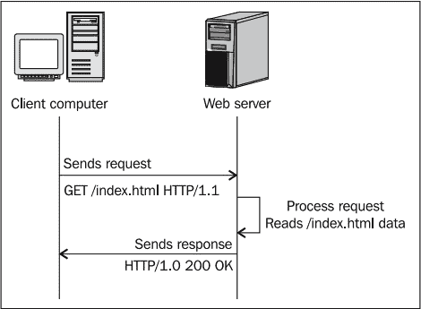
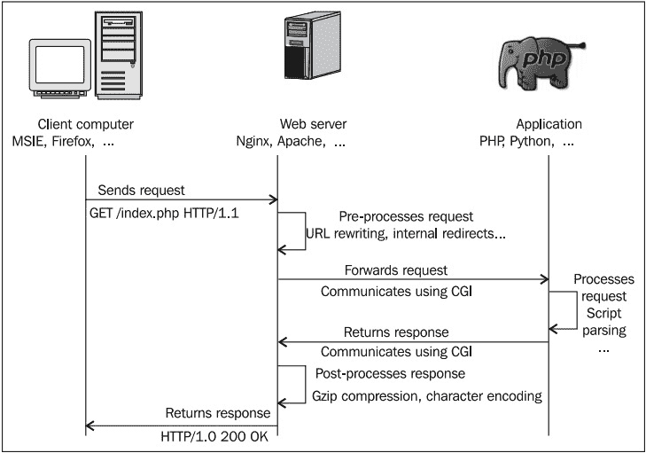
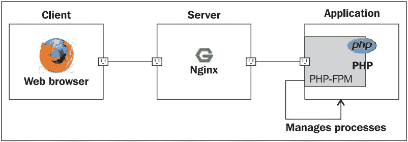
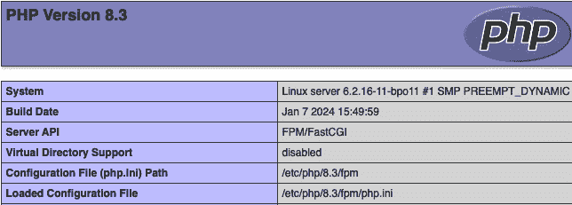

# 5

# PHP 和 Python 与 NGINX

2000 年代是服务器端技术的时代。在过去的 15 年里，绝大多数网站从简单的静态 HTML 内容转向了高度和完全动态的页面，使得网页与访问者的互动达到了全新的水平。软件解决方案迅速涌现，其中一些包括开源解决方案，且有些已经足够成熟，能够处理高流量网站。在本章中，我们将研究 NGINX 与这些应用程序的交互能力。我们选择了两种不同的技术。第一种显然是 PHP。截至 2015 年 6 月，*W3Techs*（一个专注于网络技术调查的网站）显示，PHP 驱动着超过 80% 使用服务器端语言设计的网站。我们选择的第二种语言是 Python，原因在于它的安装方式和与 NGINX 配合使用的配置方式。我们将发现的机制同样适用于其他应用程序，如 Perl 或 **Ruby on** **Rails**（**RoR**）。

本章内容包括以下主题：

+   介绍 **快速公共网关接口**（**FastCGI**）技术

+   配置 NGINX 与 PHP 及 **PHP FastCGI 进程管理器**（**PHP-FPM**）

+   设置 NGINX 与 Python 和 Django

# 介绍 FastCGI 技术

在我们开始之前，您需要知道（如名称所示）**FastCGI** 实际上是 **公共网关接口**（**CGI**）的一种变体。因此，首先解释 CGI 是合适的。FastCGI 引入的改进将在接下来的章节中详细介绍。

## 了解 CGI 机制

网页服务器的最初目的是仅通过提供存储设备上的文件来响应客户端请求。客户端发送请求以下载文件，服务器处理请求并发送相应的响应：**200 OK**（如果文件可以正常提供），404（如果文件未找到），以及其他不同的响应，如下图所示：



图 5.1：描述标准 HTTP 请求的示意图

这种机制自万维网诞生以来一直在使用，并且至今仍在使用。然而，正如前面所说，静态网站逐渐被放弃，取而代之的是包含由如 PHP 和 Python 等应用程序处理的脚本的动态网站。因此，网页提供机制逐步演变成了以下形式：



图 5.2：描述 Nginx 与 CGI 处理标准 HTTP 请求的示意图

当客户端尝试访问动态页面时，网页服务器会接收请求并将其转发给第三方应用程序。应用程序独立处理脚本并将处理结果返回给网页服务器，然后网页服务器将响应转发回客户端。

为了使 Web 服务器能够与该应用程序进行通信，CGI 协议是在 1990 年代初期发明的。

## CGI

以下内容在 *RFC 3875 (CGI 协议 v1.1)* 中有所提到，由**互联网** **协会**（**ISOC**）设计：

*CGI 允许 HTTP 服务器和 CGI 脚本共同负责响应客户端请求。 [...] 服务器负责管理连接、数据传输、传输和与客户端请求相关的网络问题，而 CGI 脚本则处理应用程序方面的问题，例如数据访问和* *文档处理。*

CGI 是描述 Web 服务器（如 NGINX）和网关应用程序（如 PHP、Python 等）之间信息交换方式的协议。在实际操作中，当 Web 服务器接收到一个应该转发到网关应用程序的请求时，它会执行与所需应用程序相对应的命令；例如，`/usr/bin/php`。有关客户端请求的详细信息（例如 `User-Agent` 头和其他请求信息）要么作为命令行参数传递，要么作为环境变量传递，而来自 `POST` 或 `PUT` 请求的实际数据则通过标准输入传输。随后，调用的应用程序将处理后的文档内容写入标准输出，Web 服务器会重新捕获这些输出。

虽然这种技术乍看之下似乎简单高效，但它也有一些主要的缺点，以下将讨论这些缺点：

+   每个请求都会生成一个独立的进程。内存和其他上下文信息会在不同请求之间丢失。

+   启动一个进程可能会消耗系统的资源。大量同时的请求（每个请求都会生成一个进程）可能会迅速使服务器变得杂乱无章。

+   设计一个将 Web 服务器和网关应用程序放置在不同计算机上的架构看起来似乎很困难，甚至是不可能的。

## FastCGI

在 *CGI* 部分提到的问题使得 CGI 协议对于承载高负载的服务器来说效率相对较低。寻找解决方案的愿望促使开放市场在 90 年代中期开发了 CGI 的进化版本：FastCGI。过去 15 年里，它已经成为主要标准，现在大多数 Web 服务器都提供此功能，甚至像微软 **Internet Information** **Services**（**IIS**）这样的专有服务器软件也支持。

尽管目的保持不变，但 FastCGI 在 CGI 的基础上通过以下原则的建立提供了显著的改进：

+   FastCGI 并不为每个请求生成新的进程，而是采用了持久化进程，这些进程具有处理多个请求的能力。

+   Web 服务器和网关应用程序通过使用 TCP 或 Unix 本地 IPC 套接字等套接字进行通信。因此，Web 服务器和后台进程可能位于网络中两台不同的计算机上。

+   Web 服务器将客户端请求转发到网关，并在一个连接内接收响应。后续的请求也可以跟随而不需要创建额外的连接。请注意，在大多数 Web 服务器中，包括 NGINX 和 Apache，FastCGI 的实现并不（或者至少不完全）支持 *多路复用*。

+   由于 FastCGI 是基于套接字的协议，它可以在任何平台上使用任何编程语言实现。

在本章中，我们将通过 FastCGI 配置 PHP 和 Python。此外，你会发现，其他应用程序（如 Perl 或 RoR）的机制也相对类似。

设计一个基于 FastCGI 的架构其实并不像想象的那样复杂。只要你有运行中的 web 服务器和后端应用程序，剩下的唯一难题就是建立两者之间的连接。从这个角度来看，第一步是配置 NGINX 与 FastCGI 应用程序的通信方式。FastCGI 与 NGINX 的兼容性通过 FastCGI 模块引入，该模块包含在默认的 NGINX 构建中（包括通过软件库安装的版本）。本节详细介绍了该模块提供的指令。

## uWSGI 和 SCGI

在阅读本章的其余部分之前，你应该知道 NGINX 还提供了其他两种基于 CGI 的模块实现：

+   `uWSGI` 模块允许 NGINX 通过 `uwsgi` 协议与应用程序通信，`uwsgi` 协议本身源自于一个名字并不原创的 uWSGI 服务器。其最新文档可在 [`uwsgi-docs.readthedocs.io/en/latest/`](http://uwsgi-docs.readthedocs.io/en/latest/) 上找到。这个模块对 Python 开发者特别有用，因为 uWSGI 项目主要是为 Python 应用程序设计的。

+   **SCGI**，即**简单公共网关接口**，是 CGI 协议的一个变体，类似于 FastCGI。由于其规范首次发布于 2006 年，SCGI 比 FastCGI 出现得晚。SCGI 的设计目标是更容易实现，正如其名称所示：简单。它与特定编程语言无关。SCGI 接口和模块可以在多种软件项目中找到，如 Apache、IIS、Java、Cherokee 等。

NGINX 处理 FastCGI、uWSGI 和 SCGI 协议的方式没有重大差异：每个协议都有各自的模块，其中包含类似名称的指令。以下表格列出了来自 FastCGI 模块的几个指令（在后续部分将详细说明）及其 uWSGI 和 SCGI 等效指令：

| **FastCGI 模块** | **uWSGI 等效** | **SCGI 等效** |
| --- | --- | --- |
| `fastcgi_pass` | `uwsgi_pass` | `scgi_pass` |
| `fastcgi_cache` | `uwsgi_cache` | `scgi_cache` |
| `fastcgi_temp_path` | `uwsgi_temp_path` | `scgi_temp_path` |

表 5.1：FastCGI、uWSGI 和 SCGI 等效指令

指令名称和语法是相同的。此外，NGINX 开发团队一直在并行维护这三个模块。新指令或指令更新总是同时应用于它们。因此，以下部分将记录 NGINX 对 FastCGI 协议的实现（因为它是最广泛使用的），但同样适用于 uWSGI 和 SCGI。

## 主要指令

FastCGI、uWSGI 和 SCGI 模块已包含在默认的 NGINX 构建中。你无需在编译时手动启用它们。下表中列出的指令允许你配置 NGINX *传递* 请求到 FastCGI/uWSGI/SCGI 应用程序的方式。请注意，你会在 NGINX 配置文件夹中找到 `fastcgi_params`、`uwsgi_params` 和 `scgi_params` 文件；这些文件定义了在大多数情况下有效的指令值：

| **指令** | **描述** |
| --- | --- |

| `fastcgi_pass`上下文：`location`，`if` | 此指令指定请求应传递给 FastCGI 服务器，通过指示其位置：

+   对于 TCP 套接字，语法是 `fastcgi_pass hostname:port;`

+   对于 Unix 域套接字，语法是 `fastcgi_pass unix:/path/to/fastcgi.socket;`

+   你还可以引用 upstream 块（请阅读以下部分以获取更多信息）：`fastcgi_pass myblock;`

示例：`fastcgi_pass` `localhost:9000;``fastcgi_pass` `127.0.0.1:9000;``fastcgi_pass` `unix:/tmp/fastcgi.socket;``# 使用` `upstream 块``upstream fastcgi {``server` `127.0.0.1:9000;``server` `127.0.0.1:9001;``}``location ~* \.``php$ {``fastcgi_pass` `fastcgi;``}` |

| `fastcgi_param`上下文：http，`server`，`location` | 此指令允许你配置传递给 FastCGI 的请求。所有 FastCGI 请求严格需要两个参数：`SCRIPT_FILENAME` 和 `QUERY_STRING`。示例：`fastcgi_param` `SCRIPT_FILENAME /home/website.com/www$fastcgi_script_name;``fastcgi_param` `QUERY_STRING $query_string;`至于 `POST` 请求，还需要额外的参数：`REQUEST_METHOD`、`CONTENT_TYPE` 和 `CONTENT_LENGTH`。示例：`fastcgi_param` `REQUEST_METHOD $request_method;``fastcgi_param` `CONTENT_TYPE $content_type;``fastcgi_param` `CONTENT_LENGTH $content_length;`在 NGINX 配置文件夹中的 `fastcgi_params` 文件已包含所有必要的参数定义，除了 `SCRIPT_FILENAME`，你需要为每个 FastCGI 配置指定它。如果参数名以 `HTTP_` 开头，它将覆盖客户端请求中可能存在的 HTTP 头部。你可以选择性地指定 `if_not_empty` 关键字，强制 NGINX 仅在指定值不为空时传递该参数。语法：`fastcgi_param PARAM` `value [if_not_empty];` |
| --- | --- |
| `fastcgi_bind`上下文：`http`，`server`，`location` | 此指令将套接字绑定到本地 IP 地址，允许你指定用于 FastCGI 通信的网络接口。语法：`fastcgi_bind IP_address[:port] [transparent] | ` `off;` |
| `fastcgi_pass_header`上下文：`http`，`server`，`location` | 此指令指定应传递给 FastCGI 服务器的附加头部。语法：`fastcgi_pass_header headername;` 示例：`fastcgi_pass_header Authorization;` |
| `fastcgi_hide_header`上下文：`http`，`server`，`location` | 此指令指定应从 FastCGI 服务器隐藏的头部（NGINX 不会转发的头部）。语法：`fastcgi_hide_header headername;` 示例：`fastcgi_hide_header X-Forwarded-For;` |
| `fastcgi_index`上下文：`http`，`server`，`location` | FastCGI 服务器不支持自动目录索引。如果请求的 URI 以 `/` 结尾，NGINX 会附加 `fastcgi_index` 值。语法：`fastcgi_index filename;` 示例：`fastcgi_index index.php;` |
| `fastcgi_ignore_client_abort`上下文：`http`，`server`，`location` | 此指令允许你定义客户端中止请求时的处理方式。如果启用此指令，NGINX 会忽略中止请求并继续处理请求。如果禁用此指令，NGINX 不会忽略中止请求，会中断请求处理并终止与 FastCGI 服务器的相关通信。语法：`on` 或 `off`默认值：`off` |
| `fastcgi_intercept_errors`上下文：`http`，`server`，`location` | 此指令定义了 NGINX 是否应处理网关返回的错误，或直接将错误页面返回给客户端。错误处理通过 NGINX 的 `error_page` 指令完成。语法：`on` 或 `off`默认值：`off` |
| `fastcgi_read_timeout`上下文：`http`，`server`，`location` | 此指令定义了从 FastCGI 应用程序接收响应的超时时间。如果 NGINX 在此时间段内没有收到响应，将返回 `504 Gateway Timeout` HTTP 错误。语法：数字值（单位：秒）默认值：`60` |
| `fastcgi_connect_timeout`上下文：`http`，`server`，`location` | 此指令定义了后端服务器连接的超时时间。与读/发送超时不同。如果 NGINX 已经连接到后端服务器，则 `fastcgi_connect_timeout` 指令不适用。语法：时间值（单位：秒）默认值：`60` |
| `fastcgi_send_timeout`上下文：`http`，`server`，`location` | 这是发送数据到后端服务器的超时时间。超时并不适用于整个响应延迟，而是适用于两次写操作之间的延迟。语法：时间值（单位：秒）默认值：`60` |

| `fastcgi_split_path_info`上下文：`location` | 此指令特别适用于以下形式的 URL：`http://website.com/page.php/param1/param2/`该指令根据指定的正则表达式拆分路径信息：`fastcgi_split_path_info ^(.+\.php)(.*)$;`这会影响两个变量：

+   `$fastcgi_script_name`：实际脚本的文件名；例如：`page.php`

+   `$fastcgi_path_info`：URL 中脚本名称后的部分；例如：`/param1/param2/`

这些可以在进一步的参数定义中使用：`fastcgi_param` `SCRIPT_FILENAME /home/website.com/www$fastcgi_script_name;``fastcgi_param` `PATH_INFO $fastcgi_path_info;`语法：正则表达式 |

| `fastcgi_store`上下文：`http`、`server`、`location` | 此指令启用一个简单的*缓存存储*，将 FastCGI 应用程序的响应存储为存储设备上的文件。当再次请求相同的 URI 时，文档将直接从缓存存储中提供，而不是将请求转发到 FastCGI 应用程序。此指令启用或禁用缓存存储。语法：`on` 或 `off` |
| --- | --- |
| `fastcgi_store_access`上下文：`http`、`server`、`location` | 此指令定义了应用于缓存存储上下文中文件的访问权限。语法：`fastcgi_store_access [user:r&#124;w&#124;rw][group:r&#124;w&#124;rw][all:r&#124;w&#124;rw];`默认值：`fastcgi_store_access user:rw;` |
| `fastcgi_temp_path`上下文：`http`、`server`、`location` | 此指令设置临时文件和缓存存储文件的路径。语法：文件路径 示例：`fastcgi_temp_path /tmp/nginx_fastcgi;` |
| `fastcgi_max_temp_file_size`上下文：`http`、`server`、`location` | 将此指令设置为 `0` 可以禁用 FastCGI 请求使用临时文件，或指定最大文件大小。默认值：1 GB 语法：大小值 示例：`fastcgi_max_temp_file_size 5m;` |
| `fastcgi_temp_file_write_size`上下文：`http`、`server`、`location` | 此指令设置在将临时文件保存到存储设备时的写入缓冲区大小。语法：大小值 默认值：`2 *` `proxy_buffer_size` |
| `fastcgi_send_lowat`上下文：`http`、`server`、`location` | 该选项允许你仅在 FreeBSD 下使用 TCP 套接字的`SO_SNDLOWAT`标志。此值定义了输出操作缓冲区中的最小字节数。语法：数值（大小）默认值：`0` |
| `fastcgi_pass_request_body``fastcgi_pass_request_headers`上下文：`http`、`server`、`location` | 这些指令分别定义是否将请求体和额外的请求头传递给*后端*服务器。语法：`on` 或 `off` 默认值：`on` |

| `fastcgi_ignore_headers`上下文：`http`、`server`、`location` | 此指令防止 NGINX 处理来自后端服务器响应的以下一个或多个头信息：

+   `X-Accel-Redirect`

+   `X-Accel-Expires`

+   `Expires`

+   `Cache-Control`

+   `X-Accel-Limit-Rate`

+   `X-Accel-Buffering`

+   `X-Accel-Charset`

语法：`fastcgi_ignore_headers` `header1 [header2...];` |

| `fastcgi_next_upstream`上下文: `http`, `server`, `location` | 当`fastcgi_pass`连接到上游块时，该指令定义了应放弃请求并将其重新发送到该块下一个上游服务器的情况。该指令接受以下值的组合：

+   `error`：与服务器通信或尝试通信时发生错误

+   `timeout`：传输或连接尝试期间发生超时

+   `invalid_header`：后端服务器返回了空或无效的响应

+   `http_500`，`http_503`，`http_403`，`http_404`，`http_429`：如果发生此类 HTTP 错误，NGINX 将切换到下一个上游服务器

+   `non-idempotent`：允许重试非幂等请求（`LOCK`，`POST`，`PATCH`）

+   `off`：禁止使用下一个上游服务器

示例：`fastcgi_next_upstream error` `timeout http_504;``fastcgi_next_upstream` `timeout invalid_header;` |

| `fastcgi_next_upstream_timeout`上下文: `http`, `server`, `location` | 定义与`fastcgi_next_upstream`一起使用的超时设置。将该指令设置为`0`会禁用它。语法：时间值（秒） |
| --- | --- |
| `fastcgi_next_upstream_tries`上下文: `http`, `server`, `location` | 定义在返回错误信息之前尝试的最大上游服务器数量，应与`fastcgi_next_upstream`一起使用。语法：数字值（默认值: `0`） |
| `fastcgi_catch_stderr`上下文: `http`, `server`, `location` | 此指令允许你拦截发送到`stderr` (**标准错误**流) 的部分错误信息并将其存储在 NGINX 错误日志中。语法：`fastcgi_catch_stderr filter;` 示例：`fastcgi_catch_stderr "PHP Fatal error:";` |
| `fastcgi_keep_conn`上下文: `http`, `server`, `location` | 当设置为`on`时，NGINX 将保持与 FastCGI 服务器的连接，从而减少开销。语法：`on` 或 `off`（默认值：`off`）注意：uWSGI 和 SCGI 模块中没有等效指令。 |
| `fastcgi_force_ranges`上下文: `http`, `server`, `location` | 当设置为`on`时，NGINX 将启用来自 FastCGI 后端的字节范围支持。语法：`on` 或 `off`（默认值：`off`） |
| `fastcgi_limit_rate`上下文: `http`, `server`, `location` | 允许你限制 NGINX 从 FastCGI 后端下载响应的速率。语法：数字值（每秒字节数） |

表 5.2：主要 FastCGI 指令列表

我们已经浏览了主要的 FastCGI 指令，接下来让我们深入了解 FastCGI 缓存和缓冲指令。

## FastCGI 缓存和缓冲

一旦您正确配置了 NGINX 与您的 FastCGI 应用程序一起工作，您可以选择使用 `fastcgi_cache` 指令，这将通过设置缓存系统来帮助您提高服务器的整体性能。此外，FastCGI 缓冲区允许您缓冲来自 FastCGI 后端的响应，而不是同步地将其转发给客户端。您可以在官方的 [`nginx.org`](https://nginx.org) 网站上找到 NGINX FastCGI 缓存模块的完整列表。

这是一个完整的 NGINX FastCGI 缓存配置示例，利用了前面表格中描述的与缓存相关的大部分指令：

```
fastcgi_cache phpcache;
fastcgi_cache_key "$scheme$host$request_uri"; # $request_uri includes the request arguments (such as /page.php?arg=value)
fastcgi_cache_min_uses 2; # after 2 hits, a request receives a cached response
fastcgi_cache_path /tmp/cache levels=1:2 keys_zone=phpcache:10m
inactive=30m max_size=500M;
fastcgi_cache_use_stale updating timeout;
fastcgi_cache_valid 404 1m;
fastcgi_cache_valid 500 502 504 5m;
```

由于这些指令适用于几乎所有虚拟主机配置，您可能希望将它们保存在一个单独的文件（`fastcgi_cache`），并在适当的位置引入：

```
server {
    server_name website.com;
    location ~* \.php$ {
         fastcgi_pass 127.0.0.1:9000;
         fastcgi_param SCRIPT_FILENAME /home/website.com/www$fastcgi_script_name;
         fastcgi_param PATH_INFO $fastcgi_script_name;
         include fastcgi_params;
         include fastcgi_cache;
    }
}
```

我们已经介绍了 FastCGI 模块中您可能会用到的大部分指令。现在，我们将把这些知识应用到一个涉及 NGINX 与 PHP 的实际用例中。

# PHP 与 NGINX

现在我们将配置 PHP 与 NGINX 通过 FastCGI 一起工作。为什么要特别选择 FastCGI，而不是另外两种替代方案 SCGI 和 uWSGI 呢？答案在于 PHP 版本 `5.3.3` 的发布。自该版本起，所有发布都自带一个集成的 FastCGI 进程管理器，允许您轻松连接实现 FastCGI 协议的应用程序。唯一的要求是您的 PHP 构建必须配置 `--enable-fpm` 参数。如果您不确定当前的设置是否包含所需的组件，不必担心：本章中有一部分内容专门介绍了如何构建 PHP 并包含我们需要的所有内容。或者，您可以在大多数软件仓库中找到 `php-fpm` 或 `php8-fpm` 包。

## 架构

在开始设置过程之前，了解 PHP 如何与 NGINX 交互非常重要。我们已经确定，FastCGI 是一种通过套接字运行的通信协议，这意味着存在客户端和服务器。客户端显然是 NGINX。至于服务器，答案实际上比单纯的“PHP”更复杂。

默认情况下，PHP 支持 FastCGI 协议。PHP 二进制文件处理脚本，并能够通过套接字与 NGINX 进行交互。然而，我们将使用一个额外的组件来改进整体的进程管理——PHP-FPM：



图 5.3：展示 PHP-FPM 在沙盒中运行 PHP 的示意图

PHP-FPM 将 FastCGI 支持提升到了一个全新的水平。它的众多功能将在下一节详细介绍。

## PHP-FPM

进程管理器，顾名思义，是一个用于管理 PHP 进程的脚本。它等待并接收来自 NGINX 的指令，在您配置的环境中运行请求的 PHP 脚本。实际上，PHP-FPM 引入了许多可能性，例如以下内容：

+   自动 *守护进程化* PHP（将其转为后台进程）

+   在 *chroot*（或沙箱）环境中执行脚本

+   改进的日志记录、IP 地址限制、池分离等更多功能

## 设置 PHP 和 PHP-FPM

本节将详细介绍下载和安装 PHP 的过程。

### 使用包管理器安装

在写这些内容时，PHP 的最新稳定版本是 8.3，但具体版本可能会因你的发行版及其中包含的 PHP 版本而有所不同。

对于基于 Red Hat 的系统和其他使用 `dnf` 作为包管理器的系统，执行以下命令：

```
[root@local ~]# dnf install php-fpm
```

对于 Ubuntu、Debian 和其他使用 `apt` 的系统，执行以下命令：

```
[root@local ~]# apt install php-fpm
```

### 安装后的配置

从配置你新安装的 PHP 开始；例如，可以将你之前设置的 `php.ini` 文件复制到新的配置文件中。

注意

由于 NGINX 转发脚本文件和请求信息给 PHP 的方式，使用 `cgi.fix_pathinfo=1` 配置选项可能会导致安全漏洞。强烈建议你在 `php.ini` 文件中将此选项设置为 `0`（在大多数发行版中默认就是 `0`）。有关这个特定安全问题的更多信息，请查阅以下文章：

[`cnedelcu.blogspot.in/2010/05/nginx-php-via-fastcgi-important.html`](http://cnedelcu.blogspot.in/2010/05/nginx-php-via-fastcgi-important.html).

下一步是配置 PHP-FPM。打开 `php-fpm.conf` 文件。我们无法在这里详细介绍 PHP-FPM 配置的所有方面（大部分配置都在配置文件中有详细文档），但有一些重要的配置指令你不应错过：

+   编辑工作进程使用的用户(s) 和组(s)，以及（可选的）Unix 套接字

+   PHP-FPM 将监听的地址和端口

+   将处理的同时请求数量

+   允许连接到 PHP-FPM 的 IP 地址

### 运行和控制

一旦你对 PHP-FPM 配置文件进行了适当的修改，可以使用以下命令启动或重启它：

```
[root@local ~]# systemctl restart php-fpm
```

上述命令将重启你的 `php-fpm` 守护进程；如果你的守护进程尚未运行，可以使用 `start`。

注意

你可以通过输入 `systemctl status php-fpm` 来实时查看当前 `php-fpm` 的负载和请求情况。这个命令非常有用，可以让你知道服务器是否过载或工作正常。

## NGINX 配置

如果你已经成功配置并启动了 PHP-FPM，那么你可以开始调整你的 NGINX 配置文件，以建立两者之间的连接。以下的服务器块是一个简单有效的模板，你可以基于它来配置你自己的网站：

```
server {
    server_name .website.com; # server name, accepting www
    listen 80; # listen on port 80
    root /home/website/www; # our root document path
    index index.php; # default request filename: index.php
    location ~* \.php$ { # for requests ending with .php
        # specify the listening address and port that you configured previously
        fastcgi_pass 127.0.0.1:9000;
        # the document path to be passed to PHP-FPM
        fastcgi_param SCRIPT_FILENAME $document_root$fastcgi_script_name;
        # the script filename to be passed to PHP-FPM
        fastcgi_param PATH_INFO $fastcgi_script_name;
        # include other FastCGI related configuration settings
        include fastcgi_params;
    }
}
```

保存配置文件后，重新加载 NGINX：

```
[root@local ~]# systemctl reload nginx
```

在你的网站根目录创建一个简单的脚本，确保 PHP 被正确解析：

```
[user@local ~]# echo "<?php phpinfo(); ?>" >/home/website/www/index.php
```

打开你最喜欢的网页浏览器并加载`http://localhost/`（或者你的网站 URL）。你应该会看到类似下面的截图，这是 PHP 服务器信息页面：



图 5.4：PHP 服务器信息页面的截图

请注意，如果文件和目录访问权限未正确配置，你可能会遇到偶尔的 `403 Forbidden` HTTP 错误。如果是这种情况，请确保在 `php-fpm.conf` 文件中指定了正确的用户和组，并确保目录和文件可被 PHP 读取。

我们已经学习了如何使用 PHP-FPM 服务器设置 NGINX。接下来的部分，我们将学习如何使用 Python 服务器做相同的事情。

# Python 和 NGINX

Python 是一种流行的**面向对象编程**（**OOP**）语言，支持多平台，从类 Unix 系统到 Windows 系统。它也可以在 Java 和 Microsoft .NET 平台上使用。如果你有兴趣将 Python 配置为与 NGINX 一起使用，那么你可能已经清楚 Python 的用途了。我们将使用 Python 作为服务器端的 web 编程语言，并借助 Django 框架。

## Django

Django 是一个为 Python 设计的开源 web 开发框架，旨在使 web 开发变得简单易行，正如它的口号所说：

*完美主义者的 web 框架* *有截止日期。*

更多信息可以在项目官网 [`www.djangoproject.com/`](https://www.djangoproject.com/) 上找到。

除了其他一些有趣的功能，如动态管理界面、缓存框架和单元测试外，Django 还配备了一个 FastCGI 管理器。尽管通常部署 Django 的方式是通过 WSGI，但我们将使用 Django 的 FastCGI 管理器，因为它能让我们通过 NGINX 运行 Python 脚本时更加简便。

## 设置 Python 和 Django

现在我们将在你的 Linux 操作系统上安装 Python 和 Django，以及其前提条件。这个过程相对顺利，主要是执行几个很少出问题的命令。

### Python

Python 应该可以在你的包管理器库中找到。要安装它，请运行以下命令。对于基于 Red Hat 的系统和其他使用 `dnf` 作为包管理器的系统，请使用以下命令：

```
[root@local ~]# dnf install python python-devel
```

对于 Ubuntu、Debian 以及其他使用 `apt` 的系统，请使用以下命令：

```
[root@local ~]# apt install python python-dev
```

包管理器会自动解决依赖关系。

### Django

为了安装 Django，我们将采用一种不同的方法（虽然你完全可以跳过这一步，直接从常规软件库中安装）。我们将使用 `pip` 来下载框架，`pip` 是一个简化 Python 包安装的工具。因此，第一步是安装 `pip`；对于基于 Red Hat 的系统和其他使用 `dnf` 作为包管理器的系统，执行以下命令：

```
[root@local ~]# dnf install python-pip
```

对于 Ubuntu、Debian 及其他使用`apt`的系统，请使用以下命令：

```
[root@local ~]# apt install python-pip
```

包管理器会自动解决依赖问题。安装`pip`之后，运行以下命令下载并安装 Django 1.8.2，这是目前为止最新的稳定版本：

```
[root@website.com ~]# pip install Django==5.0.3
[...]
[root@website.com ~]# pip install -e django-trunk/
```

最后，为了运行 Python FastCGI 管理器，还需要一个组件：`flup`库。这个库提供了实际的 FastCGI 协议实现。对于基于 Red Hat 的系统以及其他使用`dnf`作为包管理器的系统（必须启用**企业 Linux 额外软件包**（**EPEL**）库；否则，你需要从源代码编译），请使用以下命令：

```
[root@local ~]# dnf install python-flup
```

对于 Ubuntu、Debian 及其他使用`apt`的系统，请使用以下命令：

```
[root@local ~]# apt install python-flup
```

### 启动 FastCGI 进程管理器

使用 Django 框架开始构建网站的过程简单至极，只需运行以下命令：

```
[root@website.com ~]# django-admin startproject mysite
```

完成上述步骤后，你会在默认项目模板中找到一个`manage.py`的 Python 脚本。打开新创建的包含`manage.py`的`mysite`目录，并运行以下命令：

```
[root@website.com mysite]# python manage.py runfcgi method=prefork host=127.0.0.1 port=9000 pidfile=/var/run/django.pid
```

如果一切配置正确且依赖项已正确安装，运行此命令应该不会输出任何内容，这通常是一个好兆头。FastCGI 进程管理器现在在后台运行，等待连接。你可以使用`ps`命令验证应用程序是否在运行（例如，通过执行`ps aux | grep python`）。如果没有看到任何正在运行的进程，可以尝试通过选择不同的端口稍微修改之前的命令。如果一切正常，我们接下来只需在 NGINX 配置文件中设置虚拟主机。

## NGINX 配置

NGINX 的配置与 PHP 的配置类似：

```
server {
    server_name .website.com;
listen 80;
# Insert the path of your Python project public files below
    root /home/website/www;
    index index.html;
    location / {
       fastcgi_pass 127.0.0.1:9000;
        fastcgi_param SCRIPT_FILENAME  $document_root$fastcgi_script_name;
        fastcgi_param PATH_INFO $fastcgi_script_name;
        include fastcgi_params;
    }
}
```

我们现在已经完成了通过 FastCGI 运行 NGINX 与 Python 的部分。

# 总结

无论你使用 PHP、Python，还是其他任何 CGI 应用程序，现在应该已经清楚如何让你的脚本在 NGINX 后端处理。网络上有各种主流编程语言和 FastCGI 协议的实现。由于其高效性，它开始取代 Apache 的`mod_php`和`mod_wsgi`等服务器集成解决方案。

在下一章中，我们将学习如何使用 NGINX 作为微服务的前端，使我们能够通过将 NGINX 置于它们前端来提高 Web 应用程序的安全性和速度。
