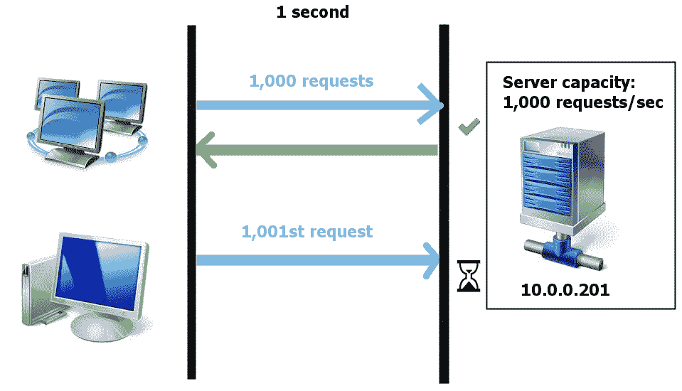
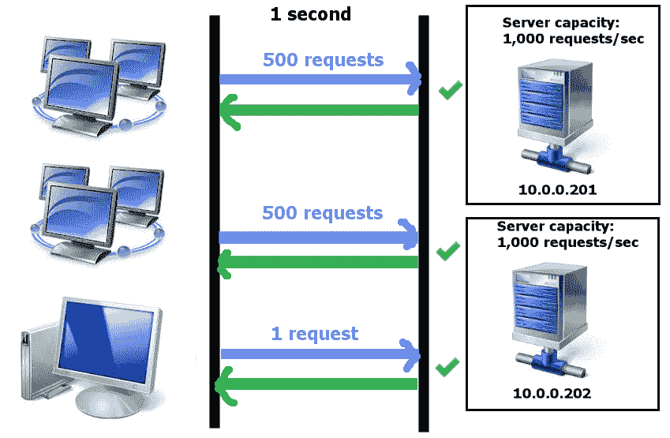
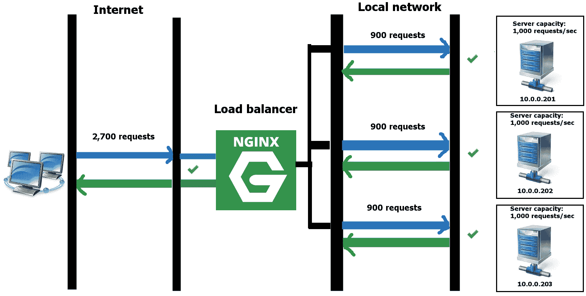
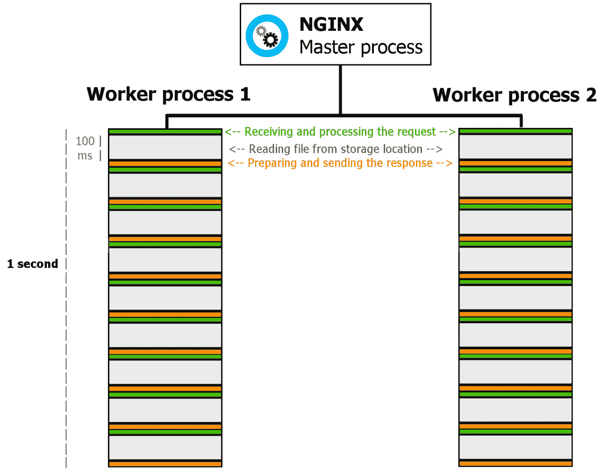

# 第七章：负载均衡和优化简介

尽管 NGINX 将帮助您的服务器承载负载，但单台机器能够处理的限制总是存在；老化的硬盘或有限的带宽最终会造成瓶颈，导致请求处理时间延长，从而令访问者感到失望。

随着您的网站变得更加流行，单一服务器开始承受压力，您会有诱惑仅仅购买更大更昂贵的服务器。但从长远来看，这并不是一种成本效益的方法；请记住，服务器承受的压力越大，硬件故障的可能性就越大。

在本章中，我们将探讨两个概念，第一个是负载均衡：即在多台服务器间分配负载并有效管理这种分配的艺术。第二部分将探索线程池的主题：一种通过稍微不同的方式为服务器服务来减轻由阻塞操作引起的重负载的新机制。

本章涵盖以下主题：

+   引入负载均衡

+   使用 NGINX 作为 TCP 负载均衡器

+   探索线程池和 I/O 机制

# 引入负载均衡

全球访问量最高的网站都建立在精心规划的服务器架构之上；快速的页面加载和下载速度是长期流量增长的要求。负载均衡的概念有潜力解决与可扩展性、可用性和性能相关的问题。在快速描述这一概念后，我们将详细介绍 NGINX 如何提供实施这样一种架构的方式。

## 理解负载均衡的概念

简而言之，负载均衡的概念包括将工作负载（CPU 负载、硬盘负载或其他形式）完全透明地分配到多台服务器上，以使您的访问者毫不感知。

在单一服务器架构的情况下，客户端请求由一台机器接收并处理。一台机器的操作能力是有限的；例如，一个能够每秒响应 1,000 个 HTTP 请求的 Web 服务器。如果服务器在一秒内收到超过 1,000 个请求，那么第 1,001 个客户端请求就无法及时得到服务。从那时起，页面服务速度会开始增加，导致访问体验下降：



图 7.1：请求顶点管理示例

将负载分布到多台服务器上可以增加整体请求处理能力；如果您拥有两台服务器，理论上可以允许每秒服务 2,000 个 HTTP 请求。有了三台服务器，您可以服务 3,000 个请求，以此类推。

有几种技术可以实现负载均衡，例如将`example.com`解析为一个 IP 地址（`1.2.3.4`）。为了实现 DNS 负载均衡，只需将多个 IP 地址关联到您的域名。访客访问您的网站时，操作系统会根据**简单的轮询**算法从这些 IP 地址中选择一个，从而确保您的所有服务器在全球范围内接收到大致相同数量的流量：



图 7.2：请求如何被管理的另一个示例

尽管这种负载均衡方法易于实现，但它并不总是适用于高流量网站，因为它存在几个主要问题：

+   如果访客的操作系统选择的 IP 地址指向一个临时不可用的服务器怎么办？

+   如果您的架构由几种不同类型的服务器组成，其中一些能够处理比其他服务器更多的请求，怎么办？

+   如果访客连接到某个服务器并登录了他们的用户账户，结果 10 分钟后被切换到另一台服务器，丢失了会话数据怎么办？

这些问题中的最后一个也被称为**会话亲和性**问题，下面的章节将进一步详细介绍。

## 会话亲和性

会话亲和性是一个术语，指的是在负载均衡架构中将客户端持久分配到特定服务器的过程。我们使用*会话*一词来描述客户端对服务器发出的请求集合。当访客浏览一个网站时，他们通常会访问多个页面：他们登录自己的账户，添加商品到购物车，进行结账等等。直到他们关闭浏览器（或标签页），所有后续的页面浏览都属于一个会话，这通常是有状态的：服务器会保存与访问过程中执行的操作相关的数据。在我们的示例中，服务器会记住购物车的内容和登录凭证。

如果在会话期间，访客切换了服务器并连接到**服务器 B**，那么他们将失去保存在**服务器 A**上的会话信息。访客将丢失购物车内容以及登录凭证（他们将被登出）：


图 7.3：当切换后端服务器时，我们可能会丢失现有的会话

因此，保持会话亲和性至关重要：换句话说，要确保访客始终分配到特定的服务器上。DNS 负载均衡方法不能确保会话亲和性，但幸运的是，NGINX 可以帮助您实现这一点。

## 上游模块

NGINX 的负载均衡实现特别巧妙，因为它允许你在基础架构的多个层级分配负载。它不仅仅限于在后端服务器之间代理 HTTP 请求；它还可以分配请求到 FastCGI 后端（FastCGI、uWSGI、SCGI 等），甚至可以将查询分配给 Memcached 服务器。任何以`_pass`结尾的指令，如`proxy_pass`、`fastcgi_pass`或`memcached_pass`，都可以接受一个服务器组的引用。

第一步是通过`*upstream*`块声明这一组服务器，`upstream`块必须放置在 http 块内。在`upstream`块中，使用`server`指令声明一个或多个服务器：

```
http {
    upstream MyUpstream {
        server 10.0.0.201;
        server 10.0.0.202;
        server 10.0.0.203;
}
[...]
}
```

或者，你也可以在`upstream`块中使用`include`来加载来自外部文件的服务器：

```
http {
    upstream MyUpstream {
        include myUpstreamServers.txt
}
[...]
}
```

现在你已经声明了服务器组，可以在虚拟主机配置中引用它。例如，你可以通过代理请求来简单地将传入的 HTTP 请求分配到该服务器组：

```
server {
    server_name example.com;
    listen 80;
    root /home/example.com/www;
# Proxy all requests to the MyUpstream server group
proxy_pass http://MyUpstream;
    [...]
}
```



图 7.4：Nginx 作为内部服务器中继的示例

在这种最基本的配置状态下，请求会根据简单的轮询算法分配到`MyUpstream`组中的三个服务器，而不会保持会话亲和性。

## 请求分配机制

NGINX 提供了多种方式来解决我们之前提到的问题。最简单的方式之一是`weight`标志，它可以在服务器组的定义中启用：

```
upstream MyUpstream {
    server 10.0.0.201 weight=3;
    server 10.0.0.202 weight=2;
    server 10.0.0.203;
}
```

默认情况下，服务器的权重为`1`，除非你另行指定。这样的配置使你能够赋予特定服务器更高的优先级；服务器的权重越高，NGINX 将接收更多的请求。在此示例中，每接收六个 HTTP 请求，NGINX 将按以下方式分配：

+   向`10.0.0.201`服务器发送三个请求（`weight=3`）

+   向`10.0.0.202`服务器发送两个请求（`weight=2`）

+   向`10.0.0.203`服务器发送一个请求（`weight=1`）

每接收 12 个请求，NGINX 将按以下方式分配：

+   向`10.0.0.201`服务器发送六个请求（`weight=3`）

+   向`10.0.0.202`服务器发送四个请求（`weight=2`）

+   向`10.0.0.203`服务器发送两个请求（`weight=1`）

NGINX 还包括一种机制，用于验证服务器组中服务器的状态。如果某个服务器未能及时响应，请求将被重新发送到组中的下一个服务器。可以为`upstream`块中的服务器分配多个标志，以便更好地控制该机制：

+   `fail_timeout=N`，其中`N`是请求被认为失败前的秒数。

+   `max_fails=N`，其中 `N` 是在 NGINX 放弃并切换到下一个服务器之前，应该在服务器上进行的尝试次数。默认情况下，NGINX 只会尝试一次。如果所有服务器都无法响应，NGINX 将等待 `fail_timeout` 到期，然后重置所有服务器失败计数并重新尝试。

+   `max_conns=N`，其中 `N` 是可以发送到该服务器的最大并发连接数。默认情况下，NGINX 不限制并发连接数。

+   `backup` 将服务器标记为备份服务器，指示 NGINX 仅在另一个服务器故障时使用它（否则不使用）。

+   `down` 将服务器标记为永久不可用，指示 NGINX 不再使用该服务器。

最后，NGINX 提供了许多选项来实现会话亲和性。它们以指令的形式出现，应该插入到 upstream 块中。最简单的指令是 `ip_hash`；该指令指示 NGINX 根据客户端 IPv4 地址的前 3 个字节（或完整的 IPv6 地址）计算一个哈希值，并根据该哈希值将客户端分配到特定服务器。只要客户端 IP 地址保持不变，NGINX 将始终将请求转发到上游组中的同一服务器：

```
upstream {
    server 10.0.0.201 weight=3;
    server 10.0.0.202 weight=2;
    server 10.0.0.203;
    ip_hash;
}
```

一些管理员可能认为这种方法不够可靠，因为全球大多数互联网服务提供商仍然提供动态 IP 地址，并且这些地址每 24 小时更新一次。那么为什么不使用你自己的分配密钥呢？通过 `hash` 指令，你可以根据自己选择的标准来分隔请求，而不是使用客户端 IP 地址。由于该指令允许使用变量，你可以根据 cookie 值来分隔请求：

```
upstream {
    server 10.0.0.201;
    server 10.0.0.202;
    hash $cookie_username;
}
```

根据 `username` cookie 中的数据，您的访客将被分配到上游组中的第一个或第二个服务器。

我们刚刚看到如何将 NGINX 用作 HTTP 负载均衡器。在接下来的部分，我们将讨论如何使 NGINX 负载均衡器正常工作，不过这次使用的是 TCP 而不是 HTTP。

# 使用 NGINX 作为 TCP/UDP 负载均衡器

直到最近，NGINX 的开源版本仅允许在 HTTP 请求的上下文中进行负载均衡。与此同时，商业订阅版 NGINX Plus 将这一概念推进了一步：使用 NGINX 作为 TCP/UDP 负载均衡器。这为更广泛的可能性铺平了道路；您可以设置 NGINX 来分配负载到任何形式的网络服务器——数据库服务器、邮件服务器，实际上所有通过 TCP 通信的服务。2015 年 5 月，开发者决定将 TCP/UDP 负载均衡纳入开源版本。从 NGINX 1.9.0 版本开始，stream 模块已经包含在可以从 [`nginx.org/`](https://nginx.org/) 获取的源代码中。

## stream 模块

TCP/UDP 负载均衡在 NGINX 中的工作原理与 HTTP 负载均衡非常相似。然而，由于引入新一组指令的模块不包含在默认构建中，您需要在构建程序之前使用以下标志运行`configure`命令：

```
 --with-stream
```

流模块提供了一个称为`http`块的新块。在此块中，您必须声明两组指令：

+   `server` 声明一个监听特定端口的 TCP/UDP 服务器，可以选择指定网络接口，可选 SSL。

+   `upstream` 定义了一个类似于之前所见的服务器组

在您的服务器块中，请求将通过`proxy_pass`指令发送到服务器组。

## MySQL 负载均衡的示例

如果您已经了解了 NGINX 中的 HTTP 负载均衡工作原理，下面的示例将看起来非常简单。我们将配置 NGINX 接收 MySQL 连接，并在两个后端服务器之间进行负载均衡：

```
stream {
  upstream MyGroup {
    # use IP address-based distribution
    hash $remote_addr;
    server 10.0.0.201 weight=2;
    server 10.0.0.202;
    server 10.0.0.203 backup; # use as backup only
  }
  server {
    # listen on the default MySQL port
    listen 3306;
    proxy_pass MyGroup; # forward requests to upstream
  }
}
```

就是这样。上游模块提供的所有指令和选项仍然存在，但请注意，您将无法使用基于 HTTP 的变量（例如 cookie）来实现会话亲和性。流模块提供了更多选项和标志，但这些内容未在此详述，因为这超出了 HTTP 服务器的范围；更多文档可以在[`nginx.org/`](https://nginx.org/)找到。

现在我们了解了如何使用 NGINX 运行 HTTP 和 TCP/UDP 请求的负载均衡器的概述。在下一节中，我们将深入研究线程和 I/O，以更好地理解和改进在重负载下的服务器资源管理。

# 探索线程池和 I/O 机制

在做出重要的财务决策之前，比如投资于额外的一两台服务器，您应该优化当前的设置，充分利用现有的基础设施。

## 缓解工作进程

对于需要大量 I/O 操作的网站，如文件上传或下载，NGINX 的异步架构可能存在一定的劣势：虽然主进程能够异步地吸收传入的连接，但工作进程可能会被某些任务（最常见的是从硬盘驱动器或网络驱动器读取数据）阻塞相对较长的时间。

考虑一个简化的配置，有两个工作进程；NGINX 收到的每个 HTTP 请求都分配给其中一个进程。在进程内部，操作是顺序执行的：接收和解析请求，从其存储位置读取请求的文件，最后准备并发送响应给客户端。如果由于某种原因你需要服务于网络驱动器上存储的文件，延迟约为 100 毫秒，那么你的两个工作进程将大部分时间都在等待文件。因此，你的服务器每秒只能处理 18 到 20 个请求：



图 7.5：工作进程与延迟的工作原理说明

这个问题不仅仅出现在网络驱动器上。即使是常规的硬盘驱动器，如果文件不在缓存中，也可能需要一定的时间来获取文件；当你将 10 毫秒的延迟乘以 1000 时，它并不是一个可以忽视的数值！

在 NGINX 1.7.11 版本中，提供的解决方案被称为**线程池**。该解决方案的基本原理是，NGINX 不再在工作进程中同步读取文件，而是将操作委托给一个线程。这样立即解放了工作进程，使其能够处理队列中的下一个请求。当线程完成操作时，工作进程会最终完成并将响应发送给客户端。这个概念相当简单，幸运的是，配置起来也同样简单。

## AIO、Sendfile 与 DirectIO

为了启用线程池支持，必须使用`--with-threads`参数构建 NGINX；这个功能默认是不可用的。配置的第一步是在配置文件的根目录定义一个线程池，使用`thread_pool`指令。

语法：`thread_pool name` `threads=N [max_queue=Q];`

在这个语法中，`name`是你希望给线程池命名的名称，`N`是应该创建的线程数，`Q`是队列中允许的最大操作数。默认情况下，线程池的名称为`default`，配有 32 个线程和最多 65,536 个操作的队列。

在需要的`location`块中，简单地插入`aio`指令并指定线程池名称：

```
thread_pool MyPool threads=64;
[...]
location /downloads/ {
    aio threads=MyPool;
}
```

或者，如果你想使用默认的线程池，可以直接插入`aio threads`而不指定池名称。也可以在同一个`location`中同时使用`sendfile`和`aio`：

```
location /downloads/ {
aio threads;
directio 8k;
sendfile on;
}
```

如果客户端请求的文件大于`8k`（该值由`directio`指令指定），则会使用`aio`。否则，文件将通过`sendfile`发送。要深入了解`sendfile`和`directio`的具体细节，建议查阅官方 NGINX 文档。

现在我们对如何管理 NGINX 服务器资源有了更好的理解，特别是得益于线程池的引入。现在是时候总结一下我们在本章所学的内容了。

# 总结

在将基础设施调整到应对越来越高的流量之前，你应该始终先寻求当前工具集提供的解决方案。如果流量导致服务器因阻塞操作（如慢速磁盘读取）而无法响应，你应该尝试使用线程池。如果这还不够，那么负载均衡就是下一个最佳选择。幸运的是，正如我们在本章中发现的，NGINX 使得实现负载均衡架构变得异常简单；你甚至可以用它来分配其他服务器应用程序的负载，比如 MySQL、邮件等。

现在我们已经了解了 NGINX 提供的最先进机制的基本且全面的方式，接下来让我们基于本书中获得的知识，开始在云基础设施（docker）中部署 NGINX。
