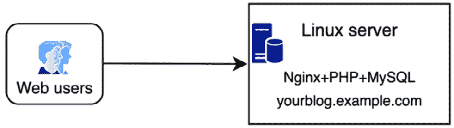
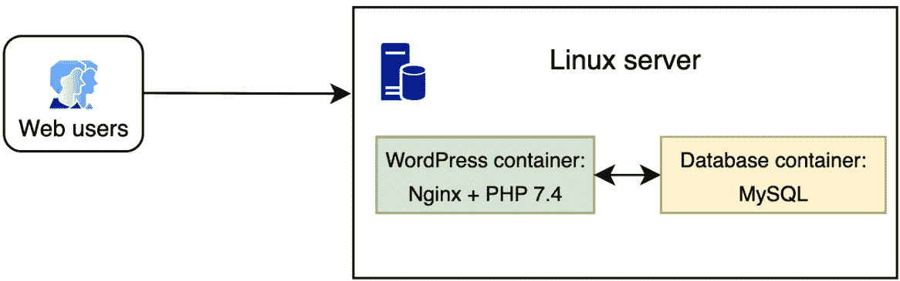
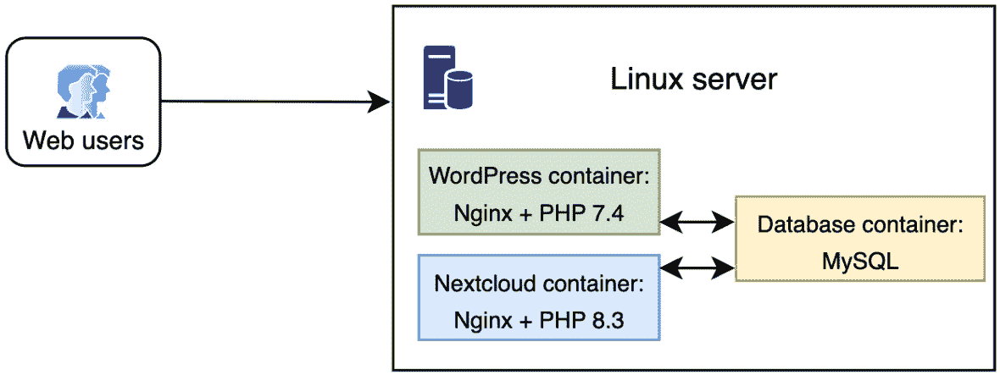
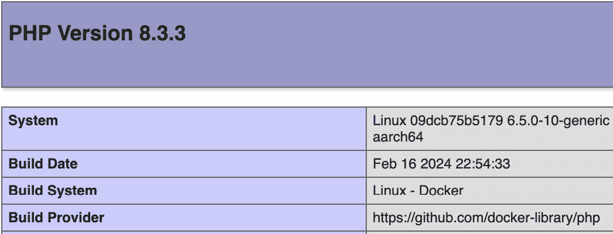

# 8

# NGINX 在云基础设施中的应用

在不断发展的 web 基础设施格局中，从传统服务器配置到云架构的转变是不可否认的。传统部署方式中，服务器被手动配置以托管多个站点或应用程序，而现在正逐步被更灵活、更可扩展的基于云的方法所取代。本章将关注采用云基础设施的实际方面，突出其提供的资源管理效率、增强的安全性和对高流量需求的更好管理。

在本章中，我们将重点讨论 NGINX 在云基础设施中的角色，使用 Docker 作为首选平台。通过将 NGINX 与 Docker 集成，我们将演示如何无缝地协调多个服务，营造一个具有韧性和适应性的环境。无论 Docker 对你来说是一个新概念与否，请放心，我们将通过你第一次使用 Docker 的经历，确保通过 NGINX 这一共同纽带，帮助你顺利而清晰地进入容器化部署的旅程。

本章涉及以下主题：

+   理解云基础设施

+   使用 Docker

+   在 Docker 中设置 NGINX

+   在 Docker 中设置 NGINX 来代理主机应用程序

# 理解云基础设施

云服务是我们在线生活的重要组成部分。我们的移动应用程序与桌面版本无缝同步，而曾经熟悉的服务器已经转变为今天的云——这个概念简化了用户的生活，同时使得 web 基础设施变得更加复杂。这种数字化变革彻底改变了我们存储和互动数据的方式，将我们推向了一个始终连接、以云为中心的现实。

## 传统方法

为了理解云基础设施的复杂性，让我们用现代的*云*视角重新审视传统设置。以 WordPress 为例，这是一个著名的开源网站创建平台，它运行在 web 服务器、PHP 服务器和数据库服务器上。经典方法是在一台机器上安装每个组件——这是托管单个博客的简单解决方案：



图 8.1：运行你的 web 项目的传统方法

然而，扩展这个模型揭示了它的局限性。各种软件依赖可能需要多个有时互相矛盾的版本，使得它们的共存变得困难。而且，随着服务的扩展，在单台服务器上管理它们变得越来越复杂。

## 云方法

在追求在单台服务器上托管多个服务的过程中，我们经常遇到一个常见问题：**软件依赖冲突**。假设需要运行两个应用程序，一个需要 PHP 7.4，另一个需要 PHP 8.3。Docker 通过将应用程序封装在容器中解决了这个问题，容器是独立于底层 Linux 发行版软件版本的隔离环境。

使用 Docker 容器的优势包括以下几点：

+   **版本管理**：Docker 容器简化了软件版本的维护和更改过程，使得必要时可以轻松回退

+   **隔离与效率**：容器隔离应用程序，这不仅提高了可移植性，便于迁移，还确保一个容器的资源消耗不会影响到其他容器

+   **部署简化**：通过克服 Docker 的学习曲线，部署和扩展变得更加容易管理，提供了一种传统配置中没有的灵活性

让我们重新回顾一下使用 Docker 的博客托管场景：



图 8.2：运行 WordPress 与 Docker 的示例

服务器运行一个 Linux 发行版，并在此基础上，两个独立的容器充当最小化的 Linux 环境，每个容器仅携带运行其应用程序所需的内容。

添加一个如 Nextcloud 这样的服务，它可以运行 PHP 8.3，并与运行 PHP 7.4 的 WordPress 一起使用，展示了 Docker 的能力：



图 8.3：运行多个容器与 Docker 的示例

如图所示，该配置允许许多 Docker 镜像，每个镜像都有其特定的软件版本，能够同时在隔离的环境中运行。如果某个容器出现安全问题，其影响被局限在该容器内部，从而保护了系统的其余部分。

本章不会涉及高级主题，如 Docker Swarm 用于 **高可用性**（**HA**）或 Kubernetes 用于可扩展性，但这些是云基础设施发展的重要领域，值得进一步探讨。

# 使用 Docker

在上一节中，我们探讨了云架构的基础知识。现在，我们将从理论走向实践，通过一步步安装和配置 Docker，启动我们的第一个容器。

**Docker** 不仅仅是一个工具，而是一种范式转变——一个新的时代，在这个时代，软件可以被打包并隔离，确保环境间的一致性。在本节结束时，Docker 不仅仅是一个概念，它将成为您工具箱中的一部分，从部署第一个 NGINX 容器开始。

## 安装 Docker

幸运的是，Docker 团队提供了一个简化安装过程的脚本。该脚本兼容多种 Linux 发行版，包括 **Red Hat 企业 Linux**（**RHEL**）、CentOS、Fedora、Debian、Ubuntu 及其衍生版本。

要安装 Docker，您需要以 root 权限运行脚本。打开终端并输入以下命令：

```
# curl -s https://get.docker.com | bash
```

通过这一条命令，Docker 将通过适配你 Linux 发行版包管理器的自定义仓库，原生安装在你的系统上。这意味着更新 Docker 将像更新系统中任何其他包一样简单。

## 你的第一个 Docker 容器

有许多方法可以操作 Docker 容器。例如，你可以使用一个简单的命令启动容器：

```
root@docker:~# docker run -d nginx
latest: Pulling from library/nginx
e1caac4eb9d2: Pull complete
```

此命令从 Docker Hub 拉取 NGINX 镜像，并以分离模式启动一个新的容器。然而，这个容器使用默认设置，尚未针对特定用途进行配置。

若要自定义容器，可以传递额外的参数。例如，要将容器的端口 80 映射到主机的端口 80，从而允许 Web 流量到达容器，可以运行以下命令：

```
root@docker:~# docker run -d nginx -p 80:80
```

第一个命令启动了具有默认配置的 NGINX 容器。第二个命令运行相同的容器，但现在它可以通过主机的端口 80 访问。如果你需要更高级、更完整的配置怎么办？这时 Docker Compose 便能派上用场，提供了一个轻松管理多容器 Docker 应用程序的解决方案。

在本书的上下文中，NGINX 镜像作为 Docker 能力的一个优秀示例，展示了容器化如何简化传统上需要专用服务器的服务部署。

随着我们深入探索，我们将看到如何定制 NGINX 容器以提供静态内容或充当反向代理，并引入 Docker 卷的概念，以及如何使用它们来提供自定义配置文件和内容。

## 使用 Docker Compose 简化操作

在运行了第一个 Docker 容器之后，我们发现直接通过命令行管理容器的参数很快会变得繁琐。**Docker Compose** 通过允许我们使用 YAML 文件来定义和运行多容器 Docker 应用程序，简化了这个过程。

让我们创建一个与上一节中运行的设置等效的配置——一个将端口 80 暴露给主机的 NGINX 容器：

1.  首先创建一个 `/root/nginx` 目录，并在该目录下保存一个名为 `docker-compose.yml` 的文件，内容如下：

    ```
    version: '3'
    services:
      nginx:
        image: nginx:latest
        ports:
          - "80:80"
    ```

提示

尽管文件格式称为 *YAML*，但扩展名需要是 `.yml`。

在这个 `docker-compose.yml` 文件中，我们定义了一个名为 `nginx` 的服务，使用官方的 `nginx` 镜像，并标记为 `latest`，这意味着每次从 Docker Hub 拉取时，它都会被更新。如果你愿意，也可以指定固定版本，如 `nginx:1.25.4`。更多详细信息请参见 Docker Hub 上的 NGINX 页面（[`hub.docker.com/_/nginx/`](https://hub.docker.com/_/nginx/)）。

1.  现在，在保存 Docker Compose 文件后，在相同的目录中运行以下命令：

    ```
    root@nginx:~/nginx# docker compose up
    [+] Running 1/1
    ^C). Alternatively, you can start the container in detached mode with up -d and stop it with down:

    ```

    root@nginx:~/nginx# docker compose up -d

    root@nginx:~/nginx# docker compose down

    ```

    ```

使用 Docker Compose，在 Docker 中运行 NGINX 变成了在一个文件中定义期望状态的任务，这比单独的命令更容易管理和阅读。在接下来的部分，我们将探索如何进一步配置 Docker 中的 NGINX，使其更加符合我们的具体需求。

# 在 Docker 内部设置 NGINX

熟悉了 Docker Compose 后，我们准备进一步推进容器的使用。在本节中，我们将通过添加个性化配置和网站内容来改进我们的 NGINX 容器。

让我们从重新审视之前创建的 `docker-compose.yml` 文件开始。这个文件已经指定了 NGINX 服务，并将容器的端口 80 映射到主机的端口 80，使得 Web 服务器可以从主机访问。

接下来，我们希望 NGINX 容器能够使用来自主机的实际配置文件和内容来提供网站服务。为此，我们将使用 Docker 卷。卷是持久化 Docker 容器生成和使用的数据的首选机制。以下是如何修改 `docker-compose.yml` 文件以挂载卷的示例：

```
version: '3'
services:
  nginx:
    image: nginx:latest
    ports:
      - «80:80»
    volumes:
      - ./config/nginx.conf:/etc/nginx/nginx.conf
      - ./html:/usr/share/nginx/html
```

在这个设置中，`./config/nginx.conf` 是主机上自定义的 NGINX 配置文件的路径，`/etc/nginx/nginx.conf` 是 NGINX 容器期望找到配置文件的路径。第二个卷 `./html` 是主机上包含网站内容的目录，它会挂载到 Docker 容器的 `/usr/share/nginx/html/` 目录中。

这种方法确保您可以直接在主机上编辑 NGINX 配置或网站内容，并且这些更改会反映在容器内。

说明

NGINX 是预配置的，因此您可以跳过挂载 `nginx.conf` 卷，使用默认设置即可。请挂载 `html` 目录，因为它是 NGINX 期望找到并提供的 Web 内容。

## 使用 Docker Compose 集成 PHP 与 NGINX

随着进展，我们的下一步是提升我们的 NGINX 服务器，以处理动态内容和 PHP。这个组合在 Web 开发中很常见，而 Docker Compose 使得这一过程变得容易实现。

我们将通过扩展现有的 `docker-compose.yml` 文件来添加一个 PHP 服务，然后确保 NGINX 能够使用 FastCGI 与 PHP 服务进行通信：

1.  首先，我们需要添加一个运行 `php-fpm` 的 PHP 服务。以下是更新后的 `docker-compose.yml` 文件的示例：

    ```
    version: '3'
    services:
      nginx:
        image: nginx:latest
        ports:
          - "80:80"
        volumes:
          - ./config/nginx.conf:/etc/nginx/nginx.conf
          - ./html:/usr/share/nginx/html
        depends_on:
          - php
      php:
        image: php:8.3-fpm
        volumes:
          - ./html:/usr/share/nginx/html
    ```

    在这个设置中，`php` 服务使用官方 PHP 镜像和 `php-fpm`。我们还将 `html` 目录挂载到 PHP 容器中，以确保它可以访问与 NGINX 相同的网页文件。

1.  在启动 Docker 容器之前，我们需要确保 NGINX 和 PHP 可以通信。让我们编辑 `nginx.conf` 文件以包括 FastCGI 参数。以下是包含 FastCGI 参数的 `nginx.conf` 示例：

    ```
    events {}
    http {
      server {
        listen 80;
        server_name localhost;
        root /usr/share/nginx/html;
        index index.php index.html index.htm;
        location / {
            try_files $uri $uri/ =404;
        }
        location ~ \.php$ {
          try_files $uri =404;
          fastcgi_pass php:9000;
          fastcgi_index index.php;
          fastcgi_param SCRIPT_FILENAME $document_root$fastcgi_script_name;
          include fastcgi_params;
        }
      }
    }
    ```

    这个配置指示 NGINX 将 PHP 文件的请求转发到在 `php` 容器中运行的 PHP-FPM 服务。

注意

NGINX 通过 Docker 的内部 DNS 解析`php`服务名，以与`php-fpm`服务进行通信。如果你在`docker-compose.yml`文件中重命名了服务，请记得相应地更新`nginx.conf`文件，以匹配新的服务名称。

1.  使用此`docker-compose.yml`和`nginx.conf`配置，你可以运行`docker compose up`，NGINX 将同时提供你的静态内容和动态 PHP 页面：

    ```
    root@nginx:~/nginx# docker compose up
    [+] Running 2/0
    ✔ Container docker-php-1    Created
    ✔ Container docker-nginx-1  Created
    Attaching to nginx-1, php-1
    <?php phpinfo(); ?>. This will display a PHP information page when accessed, confirming successful communication between the containers:
    ```



图 8.4：在 Docker 中运行的 phpinfo

本小节指导你如何在 Docker 环境中添加 PHP 服务，并配置 NGINX 通过 FastCGI 处理 PHP 脚本。此配置模拟了生产环境，为使用 Docker 构建和部署 PHP 应用程序提供了坚实的基础。

在下一节中，我们将探索如何配置 Docker 容器内的 NGINX 来代理直接运行在主机服务器上的应用。

# 在 Docker 内设置 NGINX 以代理主机应用

幸运的是，Docker 天生就支持容器与主机之间的连接。在容器内设置 NGINX 时，会使用一个特殊的`host.docker.internal`主机名来定位主机机器。

这是一个 NGINX 代理配置示例，用于与托管在服务器上的 Web 应用进行交互：

```
server {
    listen 80;
    location /hostapp {
        proxy_pass http://host.docker.internal:4000;
        proxy_set_header Host $host;
        proxy_set_header X-Real-IP $remote_addr;
        proxy_set_header X-Forwarded-For $proxy_add_x_forwarded_for;
        proxy_set_header X-Forwarded-Proto $scheme;
    }
}
```

为确保 NGINX 能够与主机服务器上的 Web 应用进行通信，请检查主机防火墙是否允许指定端口上的传入流量。

总结本节内容，我们成功地将容器化的 NGINX 与主机上的应用程序连接起来，利用了 Docker 的内部网络功能。

在下一节中，我们将回顾本书中所学的内容。

# 小结

在本章中，我们迈出了使用 Docker 和 Docker Compose 的第一步，设置了 NGINX 容器，添加了 PHP，并学会了如何将流量代理到主机服务器上的 Web 应用。

结合前几章的知识，本章的练习突显了 NGINX 作为云基础设施关键资产的潜力，增强了安全性，并高效地管理流量，非常适合处理 SSL、负载均衡和内容缓存。

在下一章中，我们将学习如何使用编排工具自动化任务来部署和更新 NGINX。
