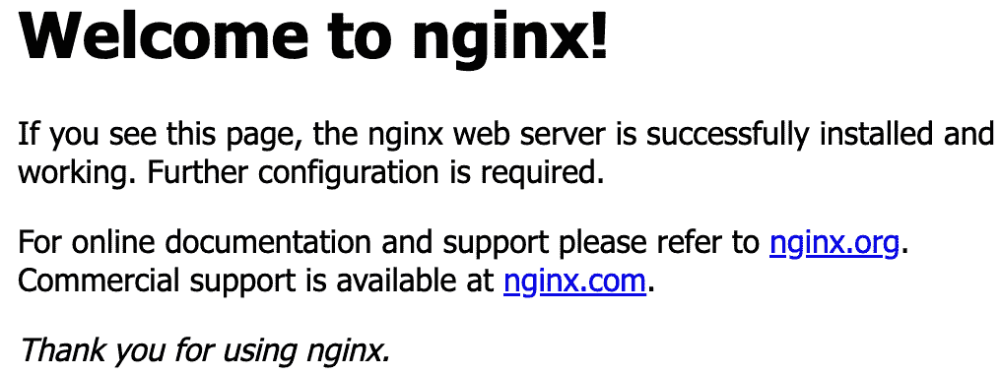

# 9

# 使用 Ansible 完全部署、管理和自动更新 NGINX

在上一章中，我们讨论了 NGINX 在云基础设施中的工作方式以及如何使用 Docker Compose 配置文件。在云之外，配置管理因其增强任何基础设施的弹性以及简化安全标准的合规性而突出。

在本章中，我们将深入探讨 Ansible 的实际用途，带您亲身体验其功能。您将学习如何使用 Ansible 进行高效的配置管理，允许您精确地在任意数量的服务器上部署 NGINX，从单台机器到整个服务器群，都可以通过统一的配置方法进行管理。

本章涵盖以下主题：

+   理解配置管理

+   使用 Ansible 进行配置管理的第一步

+   使用 Ansible 设置 NGINX

+   使用 Ansible 设置自动更新

# 理解配置管理

**配置管理**就像是拥有一个主钥匙，可以轻松设置您的基础设施，尤其是在处理多个部署时。我们已经通过 Docker Compose 了解了这一点，所有的配置都在 Docker 中，随时可以重复使用。这种方法不仅整洁，而且确保系统的每个部分都协调一致，使得在需要时可以轻松扩展或克隆配置。这一切都关乎节省时间、保持有序和尽可能实现自动化。

进入配置管理领域，我们转向 **Ansible**，这一工具因其简洁性和高效性而广受推崇。与需要在每个服务器上安装代理的其他管理工具不同，Ansible 通过 SSH 操作，减少了设置开销并保持了轻量级的存在。它是一个无代理的编排工具，将简洁性和安全性置于服务器自动化的前沿。尽管我们的教程主要集中在 Ubuntu 上，因为它的广泛采用，但其原理和实践可以轻松转移到其他发行版，如 Debian、RHEL 或 Fedora，只需做一些小调整，以适应不同的包管理器和系统布局。

现在我们对配置管理有了更清晰的了解。在下一节中，我们将使用 Ansible 运行我们的第一个 playbook。

# 运行您的第一个 Ansible playbook

Ansible 是一个通过 playbook 组织的编排工具。每个 playbook 可以包含多个角色。我们将从安装 Ansible 开始，运行我们的第一个 playbook 来安装 NGINX。

Ansible 通过由多个角色组成的 playbook 来协调任务。我们的第一步是安装 Ansible，以执行我们的第一个角色：*安装 Nginx*。

让我们从安装 Ansible 开始。Ansible 可以在远程服务器或本地 Linux 系统上设置，只要能够连接到你的 NGINX 服务器：

1.  我们将在每一步使用 root 账户：

    ```
    root@ansible:~# apt install ansible
    ```

1.  通过检查 Ansible 的版本来确保已安装：

    ```
    root@ansible:~# ansible –-version
    ansible-galaxy command to create it:

    ```

    root@ansible:~# ansible-galaxy init nginx_install

    nginx_install 包含子目录，用于任务、处理程序、模板等。

    ```

    ```

1.  接下来，使用命令`mkdir -p roles/nginx_install/tasks`创建路径`roles/nginx_install/tasks`，然后创建`roles/nginx_install/tasks/main.yml`文件，内容如下：

    ```
    ---
    - name: Install nginx
      apt:
        name: nginx
        state: latest
        update_cache: yes
    ```

    这将定义一个任务，通过 Ubuntu 的包管理器安装 NGINX。

1.  接下来，我们将创建一个 playbook 来使用这个角色。在`nginx_install`项目的根目录下，创建`nginx_install.yml`文件，内容如下：

    ```
    ---
    - hosts: webservers
      become: true
      roles:
        - nginx_install
    ```

    这将把角色应用到所有已设置的主机（组：`webservers`）。

1.  我们为 playbook 所需的最后一个文件是清单文件。这是存储您机器地址的地方。创建`inventory.ini`文件，内容如下：

    ```
    [webservers]
    server_ip ansible_ssh_user=root
    ```

    请确保使用 SSH 密钥，并将`server_ip`替换为您服务器的 IP 地址，以便连接到服务器。

1.  在这个清单中，我们创建了一个名为`webservers`的主机组。在这个组内，我们添加了一个服务器`server_ip`。如果涉及多个服务器，您的清单将扩展，列出每个服务器，允许在基础设施中进行并行管理。以下是包含多个服务器的`inventory.ini`示例：

    ```
    [webservers]
    server1.example.com ansible_ssh_user=root
    server2.example.com ansible_ssh_user=root
    [backend_api]
    api1.example.com ansible_ssh_user=root
    api2.example.com ansible_ssh_user=root
    ```

1.  现在我们已经拥有了运行第一个 playbook 所需的所有文件。让我们运行 playbook：

    ```
    root@ansible:~/nginx_install# ansible-playbook -i inventory.ini nginx_install.yml
    PLAY [all]
    TASK [Gathering Facts]
    ok: [testvm.lxd]
    TASK [nginx_install : Install nginx]
    changed: [testvm.lxd]
    PLAY RECAP
    testvm.lxd: ok=2    changed=1
    ```

很棒，我们的第一个 Ansible playbook 成功地安装了 NGINX。如果您再次运行 playbook，它会识别出 NGINX 已经安装，并且不会尝试重新安装。

现在，您可以通过`80`端口访问您的 Web 服务器，检查 NGINX 是否可用：



图 9.1：Ansible 安装的默认 Nginx 配置

我们已经安装了 Ansible，并使用 Ansible 在远程服务器上安装了 NGINX。在接下来的章节中，我们将学习如何使用 Ansible 处理配置文件。

# 使用 Ansible 设置 NGINX

在上一节中，我们创建了一个名为`nginx_install`的项目。我们将继续使用该项目，以便让 Ansible 为我们编写`nginx.conf`文件。现在让我们开始吧：

1.  首先，使用命令`mkdir -p roles/nginx_install/files`创建`roles/nginx_install/files`目录，然后将您的`nginx.conf`文件添加到此文件夹中。

1.  然后，创建一个新的任务来复制`nginx.conf`文件。编辑现有的`roles/nginx_install/tasks/main.yml`文件，并添加如下内容：

    ```
    - name: Copy nginx configuration file
      copy:
        src: nginx.conf
        dest: /etc/nginx/nginx.conf
        owner: root
        group: root
        mode: '0644'
      notify: restart nginx
    ```

    这将把`files`目录中的`nginx.conf`文件发送到远程服务器的`/etc/nginx/`目录。

1.  接下来，我们将在 Ansible 中定义一个处理程序。处理程序是只有在另一个任务通知时才会执行的任务。在我们的案例中，我们将设置一个处理程序来重启 NGINX，但只有在配置文件发生更改时才会触发。

    让我们通过运行命令`mkdir -p roles/nginx_install/handlers`来创建`roles/nginx_install/handlers`目录，然后创建一个`roles/nginx_install/handlers/main.yml`文件，内容如下：

    ```
    - name: restart nginx
      service:
        name: nginx
        state: restarted
    ```

1.  让我们再次运行 playbook：

    ```
    root@ansible:~/nginx_install# ansible-playbook -i inventory.ini nginx_install.yml
    PLAY [all]
    TASK [Gathering Facts]
    ok: [testvm.lxd]
    TASK [nginx_install : Install nginx]
    ok: [testvm.lxd]
    TASK [nginx_install : Copy nginx configuration file]
    changed: [testvm.lxd]
    RUNNING HANDLER [nginx_install : restart nginx]
    changed: [testvm.lxd]
    PLAY RECAP
    Install nginx task as OK since NGINX is already in place from a previous run. The copy nginx configuration file task was successful, prompting the handler to restart NGINX. If you rerun the playbook, it won’t repeat these actions as it recognizes NGINX’s installation and the existing configuration.
    ```

NGINX 已通过 Ansible 安装。在下一节中，我们将学习自动更新以及如何通过 Ansible 配置文件直接保障服务器环境的安全。

# 使用 Ansible 设置自动更新

`unattended-upgrades`负责更新过程，让你无需人工干预就能放心确保服务器的安全。

要安装`unattended-upgrades`包，你可以编辑现有文件`roles/nginx_install/tasks/main.yml`，并添加以下内容：

```
- name: Install unattended-upgrades
  apt:
    name: unattended-upgrades
    state: present
```

重新运行 playbook 以安装该软件包：

```
root@ansible:~/nginx_install# ansible-playbook -i inventory.ini nginx_install.yml
[…]
TASK [nginx_install : Install unattended-upgrades]
ok: [testvm.lxd]
```

安装了`unattended-upgrades`后，你的系统已配置为自动进行安全更新。对于需要更多全面更新的用户，包的文档提供了调整设置的指导。

# 总结

在本章中，我们探索了使用 Ansible 进行配置管理的强大功能，学习了如何无缝地协调我们的 NGINX 设置。通过 Ansible 的能力，我们已经启动了软件包安装、更新了配置，并采用了自动更新的高效性。这些过程的可扩展性为系统管理开辟了新天地。虽然我们仅触及了表面，但进一步探索 Ansible 可以解锁动态配置、TLS 证书、全面的防火墙设置等自动化部署。对于那些有兴趣深入了解 Ansible 的人，可以在 [docs.ansible.com](http://docs.ansible.com) 找到各种 playbook。

在下一章中，我们将探讨实现 NGINX 的实际应用和真实场景。
