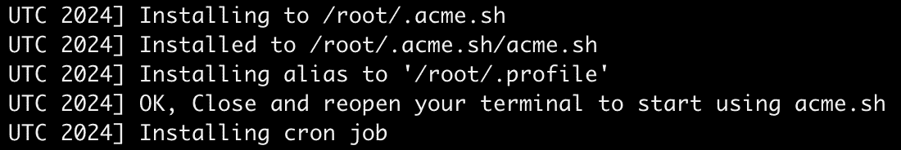
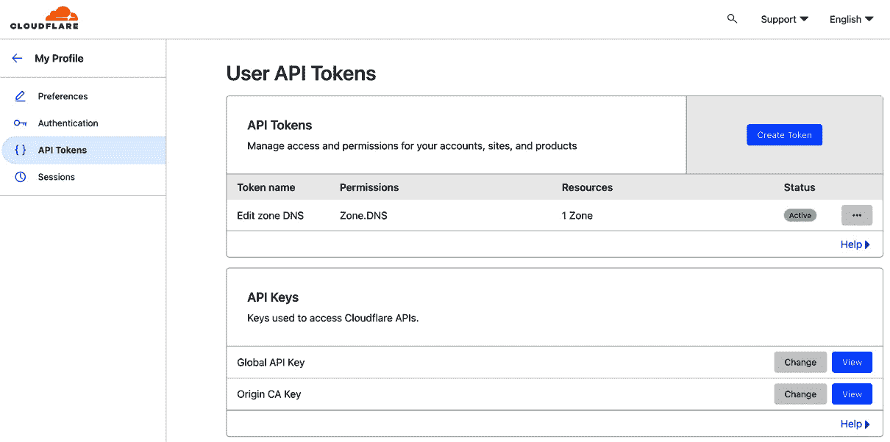
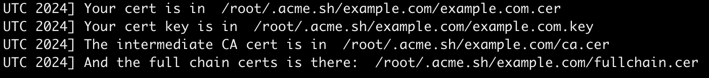
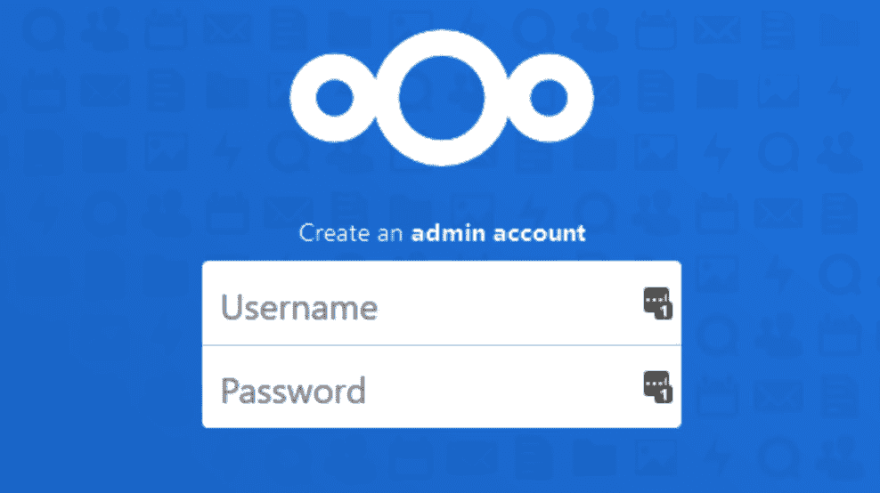

# 10

# 案例研究

在本书中，我们已探讨了 NGINX 的广泛功能，从交付静态内容到实施复杂的负载均衡策略。你新获得的知识不仅涵盖了服务器上的基本 NGINX 设置，还包括针对各种 Web 应用量身定制的配置，并通过一系列高级模块增强，解锁了复杂的功能。

现在，是时候通过一系列实际场景来应用我们所学的知识了。通过 HTTPS 来确保通信安全将是我们的基础步骤，确保与你的 Web 服务的所有交互默认都是加密的。在这个安全措施到位后，我们将继续进行完整的 WordPress 站点设置。在这里，我们不仅关注如何使用 NGINX 让你的站点上线，还会利用我们建立的安全通道，整合最佳实践来优化和缓存，从而提升性能。

随着章节的进展，本章将指导你如何部署 Nextcloud 实例，演示如何建立一个安全、私有的云存储解决方案。

本章内容包括：

+   默认的 SSL 证书和 HTTPS

+   实施 HTTP/2

+   部署 WordPress，高效的内容管理

+   部署 NextCloud，一个强大的个人云服务

# 探索 SSL 证书和默认的 HTTPS

数字安全至关重要，采用*安全优先*的方式不仅是最佳实践——它是必要的。因此，明文传输已不再被接受；SSL 加密是新的标准。

认识到这一点后，我们转向`ssl.conf`，它将在所有安全站点配置中作为可重用组件。默认的 SSL 基础设置为我们部署的所有 Web 服务提供了坚实的基础。

## 使用 acme.sh 进行证书管理

一步步地，我们将学习如何利用 acme.sh 与 DNS API 的集成，简化证书颁发的验证过程。通过本教程的学习，你将掌握获取首个签名通配符证书所需的知识。

让我们从 acme.sh 的安装开始：

```
root@nginx:~# curl https://get.acme.sh | sh
```

然后将别名“`alias acme.sh=~/.acme.sh/acme.sh`”添加到文件“/root/.bashrc”

验证 acme.sh 是否已正确安装。首先，确保按照安装脚本的建议关闭并重新打开终端（或 SSH 会话）：



图 10.1：acme.sh 脚本提示我们关闭并重新打开终端会话。

然后运行`acme.sh --version`：

```
root@nginx:~# acme.sh --version
https://github.com/acmesh-official/acme.sh
v3.0.8
```

现在，acme.sh 已成功安装。我们将使用 acme.sh 生成一个通配符证书，但在此之前，让我们快速了解什么是通配符证书，为什么我们需要一个，以及 acme.sh 如何帮助我们生成它。

想象以下情况：我们拥有域名`example.com`。通过使用 acme.sh，我们将生成一个有效期涵盖多个域名的单一证书。第一个域名是`example.com`，第二个域名是`*.example.com`。我们想这样做有很多原因：

+   首先，为了简化操作。不需要调整 NGINX 配置使其在特定的文件夹下运行 80 端口。一旦你拥有了域名的证书，你可以将其用于子域名，并且复用相同的证书用于其他子域名。

+   其次，通过防止扫描器来增强你基础设施的安全性。每个签名证书都是公开可用的，你可以通过像 [`crt.sh`](https://crt.sh) 这样的工具找到它们。

要生成通配符证书，最快的方法是通过 DNS API。这意味着你将创建一个临时子域，以让证书颁发机构知道你拥有该域名。例如，你将创建 “yes-i-own-it-12345.example.com”，作为交换，证书颁发机构将为你颁发证书。我们将学习如何通过授权 acme.sh 创建临时子域来自动完成此过程。一旦设置完成，你的证书将每 90 天自动更新。

在这个示例中，我们将使用 Cloudflare API，但要知道 acme.sh 支持更多的注册商，超过一百个注册商。完整列表可以在它们的官方 GitHub 仓库中找到，链接如下：[`github.com/acmesh-official/acme.sh/wiki/dnsapi`](https://github.com/acmesh-official/acme.sh/wiki/dnsapi)。

## acme.sh 与 DNS API

使用 Cloudflare，我们来获取 API 密钥：



图 10.2：获取 Cloudflare API 密钥

如上所示，你可以通过进入 **Profile**，然后选择 **View** 来获取 **Global** **API Key**

在这个示例中，假设我们的 API 密钥是 `abcd1234`。我们将把它存储在 `/root/.acme.sh/account.conf` 文件中，和用于 Cloudflare 帐户的电子邮件地址一起：

```
SAVED_CF_Key='abcd1234'
SAVED_CF_Email=my-cloudflare-account@personal.email
```

## 签发签名证书

现在我们已经准备好获得第一个签名证书。我们已经安装了 acme.sh，并且已授权 acme.sh 访问我们的域名 `example.com`。下一步是使用 acme.sh 签发证书：

```
root@nginx:~# acme.sh --issue --dns dns_cf -d example.com -d *.example.com
```

这个命令将让 acme.sh 联系 Cloudflare 创建临时子域，然后让证书颁发机构（默认：zerossl）签署它刚刚生成的证书，并删除临时子域。



图 10.3：确认 acme.sh 已生成并签发了签名证书。

恭喜你获得了第一个签名通配符证书！在接下来的子章节中，我们将把 NGINX 的 SSL 配置集中到一个配置文件中，并使用我们现有的证书。

## 使用 NGINX 集中 SSL 配置

在上一个小节中，我们学习了如何获取签名证书。我们将在 NGINX 配置中使用这些证书。我们面临的挑战是，根据我们的设置，我们可能需要在多个位置使用证书，因为它适用于多个子域。为了避免重复，并以最简便的方式管理我们的配置，我们将编写一个配置文件，并在其他配置文件中包含它。

首先，让我们编写文件`ssl.conf`。此文件必须存储在 NGINX 配置文件夹中，例如`/etc/nginx/`：

```
 ssl_certificate /root/.acme.sh/example.com/fullchain.cer;
 ssl_certificate_key /root/.acme.sh/example.com/example.com.key;
 ssl_protocols TLSv1.3;
 ssl_prefer_server_ciphers off;
 ssl_session_cache  builtin:1000  shared:SSL:10m;
 ssl_session_tickets on;
 ssl_stapling on;
 ssl_stapling_verify on;
```

就这样！在我们部署新项目时，我们会包含这个`ssl.conf`文件，以节省时间。

在下一节中，我们将介绍 HTTP/2。

## 实现带 SSL 的 HTTP/2

**HTTP/2**是 HTTP 协议的重大进化，旨在提升网页性能和效率。它具有多路复用等特性，可以通过单一连接进行多个请求和响应，并且通过头部压缩来减少开销，HTTP/2 使网页浏览速度明显更快，更加高效。另一个关键特性是服务器推送，服务器可以在没有等待请求的情况下预先将资源发送到客户端，从而进一步优化加载时间。

下面是如何在服务器块中启用 HTTP/2 的方法：

```
server {
    listen 443 ssl http2;
    listen [::]:443 ssl http2;
…
}
```

在设置 SSL 时务必启用 HTTP/2，它在现代浏览器中得到了很好的支持，但需要一个安全的连接。

尽管 HTTP/3 提供了有前景的进展，但它还没有完全准备好广泛投入生产使用。我们鼓励你关注它的发展，因为我们相信当它完全准备好时，实施它将会非常令人兴奋。

接下来，我们将演示如何设置一个启用了安全证书和 HTTP/2 的**WordPress 站点**。

# 部署 WordPress 站点

WordPress 目前是全球最流行的内容管理系统。根据 Kinsta 的统计数据（[`kinsta.com/wordpress-market-share/`](https://kinsta.com/wordpress-market-share/)），它的市场份额达到了 42%。对于许多 Web 服务器管理员来说，设置 WordPress 站点或博客已经成为一项常见任务，无论是用于个人还是专业用途。

## 准备服务器并获取 WordPress

在这一部分中，我们将为下载和安装 WordPress 应用程序做好准备。需要检查一些配置文件，以确保 WordPress 顺利运行。

### 系统要求

设置 WordPress 站点的第一步是在全新的服务器上，确保你安装并更新了必要的组件：建议至少运行 PHP 8.1 和 MySQL Server 8。如果你还没有做到这一点，运行以下命令将提供一个基本的工作环境，并包括最小的 PHP 扩展。在基于 Debian 的 Linux 操作系统下：

```
# apt install mysql-server php8.1-fpm php8.1-mysql php8.1-gd php8.1-xml php8.1-mbstring php8.1-curl php8.1-zip
```

如果你的服务器运行的是基于 Red Hat 的操作系统，如 Fedora：

```
# dnf install mysql-server php8.1-fpm php8.1-mysqlnd php8.1-gd php8.1-xml php8.1-mbstring php8.1-curl php8.1-zip
```

如果你的系统上安装的是较旧版本，建议你使用 `apt update && apt upgrade` 或 `dnf upgrade --refresh` 命令升级到最新版本。

### PHP 配置

在确保服务器组件满足最低要求后，如果希望 WordPress 能顺利运行，你需要编辑一些设置。有两个主要的 PHP 配置方面需要关注。首先，默认的 PHP 配置文件(`php.ini`)包含了一些你可能需要更新的指令：

+   `cgi.fix_pathinfo`：出于安全考虑，将此值设置为`0`，正如我们在*第五章*中所看到的那样。

+   `post_max_size`：默认情况下，`POST` 请求体的最大大小为`8`兆字节。如有必要，可以增大该值；请记住，文件上传通常是通过 `POST` 请求进行的。

+   `upload_max_filesize`：默认设置为`2`兆字节，如果你希望允许上传大文件，需要增加此值。

+   `date.timezone`：如果你保持此项为空（默认设置），系统将会发出警告。请参阅[`php.net/manual/en/timezones.php`](https://php.net/manual/en/timezones.php)来查找适合你情况的正确值。

配置的第二个方面是 PHP-FPM 配置。主要的 `php-fpm.conf` 文件不需要立即修改，但如果你还没有操作的话，你需要创建一个*配置池*：这是一组适用于特定网站或应用的配置指令。这样可以让 PHP 进程在特定用户账户下运行，并可选地配置一个特定的网络接口与 NGINX 通信。

通过在括号中声明其名称来创建一个新的池：

```
[wordpress]
```

添加以下配置指令：

```
; Specify user account and group for the pool 
; We assume that you created a "wordpress" user and group  
user=wordpress 
group=wordpress 
; Network interface and listening port 
; Use 127.0.0.1 if Nginx runs on the same machine 
listen=127.0.0.1:9000 
; Only allow connections from local computer 
; Change this value if Nginx runs on a different machine 
allowed_clients=127.0.0.1
```

可选地，你可以启用 *chroot*：为该池的 PHP 进程指定一个根目录。例如，如果你将 chroot 设置为 `/home/wordpress/www`，你的 PHP 脚本将只能读取指定路径内的文件和目录（任何尝试读取或写入 `/home/wordpress/www` 以外的文件或目录的操作都会失败）。强烈推荐启用此功能：如果 WordPress 代码中发现安全漏洞，攻击者将只能利用 PHP 进程可以访问的文件；服务器的其余部分不会受到威胁：

```
chroot /home/wordpress/www;
```

其他配置指令在 PHP-FPM 默认池文件中有详细文档；它们的默认值在大多数情况下是适用的。

### MySQL 配置

在安装 MySQL 服务器时，你被要求设置管理员（`root`）凭据。由于这些凭据允许完全访问 SQL 服务器，包括对所有数据库的权限，你绝不应在任何 PHP 应用程序中使用它们。最佳做法是创建一个单独的 MySQL 用户，并为你的应用程序使用的数据库分配权限：

1.  使用以下命令登录到你的本地 MySQL 服务器：

    ```
     # mysql -u root -p
    ```

1.  创建一个新的 SQL 数据库：

    ```
    wordpress database (don’t forget to specify a complex enough password):

    ```

    使用退出命令离开 MySQL 控制台，并尝试使用新创建的账户登录服务器：

    ```
    mysql> exit 
    # mysql -u wordpress -p 
    wordpress database you created a minute ago.
    ```

    ```

    ```

### 下载并提取 WordPress

最后一步是下载最新版本的 WordPress，并在之前指定的位置提取；在我们的示例中是：`/home/wordpress/www`。最新版本总是可以在 [`wordpress.org/latest.tar.gz`](https://wordpress.org/latest.tar.gz) 找到：

```
/home/wordpress/www# wget https://wordpress.org/latest.tar.gz
/home/wordpress/www# tar xzf latest.tar.gz
/home/wordpress/www# mv ./wordpress/* ./ && rm -r ./wordpress
```

确保用户和组设置正确，并为 `wordpress` 用户提供应用文件的写权限：

```
/home/wordpress/www# chown -R wordpress ./
/home/wordpress/www# chgrp -R wordpress ./
/home/wordpress/www# chmod -R 0644 ./
```

## NGINX 配置

在你可以通过用户友好的 Web 安装程序开始设置 WordPress 之前，你需要完成 NGINX 服务器配置。我们将在接下来的子章节中逐一详细讲解。

### HTTP 区块

我们将从顶部开始逐一讲解各个区块：HTTP 区块，包括对整个服务器有影响的指令。这意味着这里放置的指令将影响所有由此 NGINX 实例提供服务的网站。打开你的 NGINX 主配置文件（`nginx.conf`），并插入或更新以下指令：

```
# Sets the user and group under which the worker processes  
# will run. The following values are valid assuming your server  
# will only be hosting one website.  
user wordpress wordpress; 
worker_processes 8; # 1 process per core 
pid /var/run/nginx.pid; 

events { 
# Edit this value depending on your server hardware 
   worker_connections 768; 
} 

http { 
   # Core settings affecting I/O 
   sendfile on; 
   tcp_nopush on; 
   tcp_nodelay on; 

   # Default Nginx values 
   keepalive_timeout 65; 
   types_hash_max_size 2048; 
   include /etc/nginx/mime.types; 
   default_type application/octet-stream; 

   # Set access and error log paths 
   access_log /var/log/nginx/access.log; 
   error_log /var/log/nginx/error.log; 

   # Enable gzipping of files matching the given mime types 
   gzip on; 

   gzip_types text/plain text/css application/json application/x-javascript text/xml application/xml application/xml+rss text/javascript; 

   # Include virtual host configuration files; 
   # Edit path accordingly 
   include /etc/nginx/sites-enabled/*; 
}
```

### 服务器区块

下一步将要求你在之前指定的目录中创建一个新文件。例如，在 `/etc/nginx/sites-available/` 文件夹中创建一个名为 `wordpress.conf` 的文件。通过插入或更新以下指令来定义你的虚拟主机配置：

```
server {
#Default server on port 80
  Listen [::]:80 default_server;
  listen 80 default_server;
  server_name _;
#Always redirect to https
  return 301 https://$host$request_uri;
}
server { 
   # Listen on all network interfaces on port 443 SSL and HTTP2 
   listen 443 ssl http2;
   listen [::]:443 ssl http2;
   #Include ssl.conf created earlier
   include ssl.conf

   # Specify the host name(s) that will match the site 
   # The following value allows both www. and no subdomain 
   server_name .example.com; 

   # Set the path of your WordPress files 
   root /home/wordpress/www; 

   # Automatically load index.php 
   index index.php; 

   # Saves client request body into files, cleaning up afterwards 
   client_body_in_file_only clean; 
   client_body_buffer_size 32K; 

   # Allow uploaded files up to 300 megabytes 
   client_max_body_size 300M; 

   # Automatically close connections if no data is  
   # transmitted to the client for a period of 10 seconds 
   send_timeout 10s; 

   # The rest of the configuration (location blocks)  
   # is found below 
   [...] 
}
```

完成后，使用以下命令在 `/etc/NGINX/sites-enabled/` 中为 `/etc/nginx/sites-available/wordpress.conf` 创建一个符号链接：`ln -s /etc/nginx/sites-available/wordpress.conf /etc/nginx/sites-enabled/`

### 位置区块

最后，设置你的 `location` 区块——这些指令应用于你网站上的特定位置：

```
   # The following applies to static files:  
   # images, CSS, javascript 
   location ~* ^.+.(jpg|jpeg|png|gif|ico|css|js)$ { 
         access_log off; # Disable logging 
         # Allow client browsers to cache files  
         # for a long period of time 
         expires max;  
   } 

   # The following applies to every request 
   location / { 
      # Try serving the requested URI: 
      # - If the file does not exist, append / 
      # - If the directory does not exist,  
      # redirect to /index.php forwarding the request URI 
      # and other request arguments 
         try_files $uri $uri/ /index.php?q=$uri&$args; 
   } 

   # The following applies to every PHP file 
   location ~ .php$ { 
         # Ensure file really exists 
            if (!-e $request_filename) { 
                  return 404; 
            } 
            # Pass the request to your PHP-FPM backend 
            fastcgi_pass 127.0.0.1:9000; 
         fastcgi_index index.php; 
         fastcgi_param PATH_INFO $fastcgi_script_name; 
         include fastcgi_params; 
   }
}
```

## WordPress 配置

一旦你的 NGINX 配置完成并保存，确保通过 `systemctl reload nginx` 或 `/usr/local/nginx/sbin/nginx -s reload`（或你常用的 NGINX 二进制位置）重新加载 NGINX 配置。

如果一切顺利，你应该能够通过访问 `https://example.com/wp-admin/install.php`（将 `example.com` 替换为你自己的域名）运行基于 Web 的 WordPress 安装程序。系统会提示你：

+   你之前创建的数据库名称，在我们的示例中是：`wordpress`

+   你之前创建的 SQL 用户名，在我们的示例中是：`wordpress`

+   用户的密码：`password`

+   数据库主机：`127.0.0.1`，如果你的 MySQL 服务器托管在同一台服务器上

+   WordPress 创建的所有 SQL 表的前缀：`wp_`


图 10.4：WordPress 数据库安装页面

一旦安装程序完成，你可以开始配置并准备你的 WordPress 网站。为了启用漂亮的 URL，你应该检查 `https://example.com/post-name/` 或 `https://example.com/year/month/post-name/`。

…我们已经部署了 WordPress。在接下来的部分，我们将使用 Docker 在 WordPress 旁边部署 Nextcloud，以便正确隔离 WordPress 和 Nextcloud 的配置。

# 部署 Nextcloud

**Nextcloud** 代表了自托管云服务的巅峰，提供的不仅仅是文件存储，还有集成的日历、联系人和协作工具。作为一个开源解决方案，它提供了透明性和控制力，确保您的数据真正属于您。

在本节中，我们将介绍如何在 NGINX 服务器上设置 Nextcloud，重点是通过已验证的 SSL 证书确保安全通信。这将补充我们通过 NGINX 构建的多应用托管环境，在该环境中，NGINX 同时处理 WordPress 的动态内容管理和 Nextcloud 的强大数据生态系统。

## 获取 Nextcloud

由于我们已经配置了 NGINX 来为我们的 WordPress 网站提供服务，并特别优化以满足 WordPress 的独特需求，我们现在将使用 Docker 来托管 Nextcloud。这种方法确保了隔离性和灵活性，而不会干扰我们当前的设置。我们将使用 Docker 的容器化功能，将 Nextcloud 与 WordPress 无缝集成。更准确地说，我们将部署 NextCloud All-In-One 镜像，它集成了 Apache Web 服务器，并通过 NGINX 进行代理。如果需要设置 Docker，请参考*第八章*的相关指南。

那么，我们开始吧：

1.  我们将创建一个目录 `/root/nextcloud`，并在此文件夹中创建文件 `docker-compose.yml`，该文件包含官方的 All-In-One Nextcloud Docker 镜像。请参考他们的在线 GitHub 获取最新的 Docker Compose 文件。目前，它是这样的：

    ```
    services:
      nextcloud-aio-mastercontainer:
        image: nextcloud/all-in-one:latest
        init: true
        restart: always
        container_name: nextcloud-aio-mastercontainer
        volumes:
          - nextcloud_aio_mastercontainer:/mnt/docker-aio-config
          - /var/run/docker.sock:/var/run/docker.sock:ro
        ports:
          - 8080:8080
          - "127.0.0.1:11000:11000"
        environment:
          - APACHE_PORT=11000
    volumes:
      nextcloud_aio_mastercontainer:
        name: nextcloud_aio_mastercontainer
    ```

1.  我们已将文件保存在 `directory /root/nextcloud` 中。在此目录下，我们将启动容器：

    ```
    /etc/nginx/sites-enabled/nextcloud.conf:

    ```

    server {

    listen 443 ssl http2;

    listen [::]:443 ssl http2;

    include ssl.conf;

    server_name nextcloud.example.com;

    location / {

    proxy_pass http://127.0.0.1:11000$request_uri;

    proxy_set_header X-Forwarded-For $proxy_add_x_forwarded_for;

    proxy_set_header X-Forwarded-Port $server_port;

    proxy_set_header X-Forwarded-Scheme $scheme;

    proxy_set_header X-Forwarded-Proto $scheme;

    proxy_set_header X-Real-IP $remote_addr;

    proxy_set_header Accept-Encoding "";

    proxy_set_header Host $host;

    client_body_buffer_size 512k;

    proxy_read_timeout 86400s;

    client_max_body_size 0;

    # Websocket

    proxy_http_version 1.1;

    proxy_set_header Upgrade $http_upgrade;

    proxy_set_header Connection $connection_upgrade;

    }

    }

    ```

    ```

1.  在准备设置 Nextcloud 之前，请确保测试您的配置并重新加载 NGINX 服务器：



图 10.5：Nextcloud 默认安装页面

就这样，您的 Nextcloud 服务器已经准备就绪。如需进一步的自定义和详细配置，Nextcloud 官方文档是一个极好的资源。您可以在 [nextcloud.com](http://nextcloud.com) 找到它。

在打下基础后，你现在已经具备了部署多个服务器的能力，可以使用 Docker 进行容器化部署，或者直接在主机上安装。只需要记得使用兼容的软件版本。

在接下来的章节中，我们将回顾本章中涉及的关键点。

# 总结

在本章中，我们掌握了使用 acme.sh 生成经过验证的 SSL 证书的技巧，并利用 DNS API 提高效率。我们还探讨了 HTTP/2 带来的增强功能，并为 HTTP/3 奠定了基础，为实现最佳网页性能打下了基础。通过这些知识，我们成功部署了一个配备 SSL 和最佳安全实践（如 chroot 环境）的 WordPress 网站。此外，我们还深入研究了 Docker，通过部署 Nextcloud 服务器，展示了我们在单台服务器上无缝管理多个服务的能力。

正如你在本章研究的案例中可能已经注意到的，设置一个 web 应用程序的过程有时可能既漫长又复杂。但当涉及到 NGINX 配置时，通常是相当简单直接的：在服务器块中添加几个指令，重载服务器，就完成了。

不幸的是，在某些情况下，尽管你的初始配置看起来能够解决问题，但随着时间的推移，你会发现访客遇到了各种问题或被呈现了意外的错误页面。下一章将帮助你应对这些问题，探讨几种方法，以便你在需要排除服务器故障时能应对自如。
