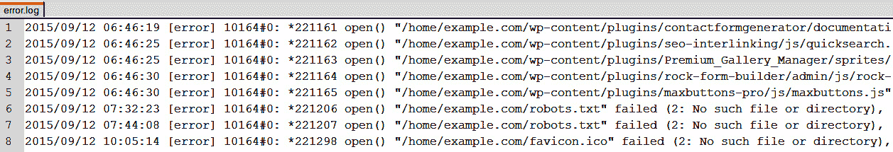
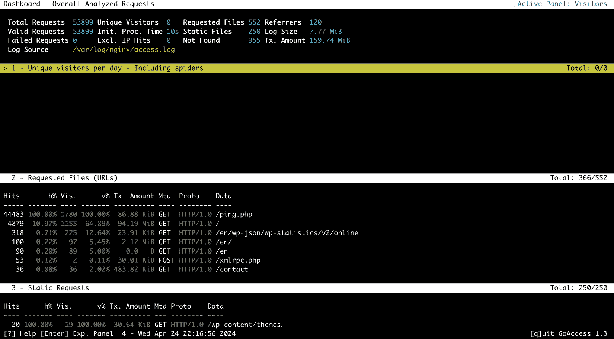

# 11

# 故障排除

即使你认真阅读了本书的每一个字，也无法避免各种问题，从简单的配置错误到偶尔出现的模块意外行为。为了帮助你，在本章中，我们将尝试提供一些常见问题的解决方案，尤其是那些刚开始使用 NGINX 的管理员可能遇到的。

本章涉及以下主题：

+   一个包含常见 NGINX 故障排除技巧的基本指南

+   如何解决一些最常见的安装问题

+   处理 `403 Forbidden` 和 `400 Bad Request` HTTP 错误等

+   为什么你的配置似乎没有正确应用

+   关于 `if` 块行为的一些话

# 看看一些关于 NGINX 故障排除的一般技巧

在我们开始之前，每当你遇到与 NGINX 相关的问题时，应该确保遵循以下章节中给出的建议，因为它们通常是解决方案的良好来源。

## 检查访问权限

很多 NGINX 管理员面临的错误都是由无效的访问权限引起的。在两个不同的情况下，你可以为 NGINX 工作进程指定一个用户和组来运行：

+   在使用 `configure` 命令配置构建时，你可以指定一个将作为默认使用的用户和组（参见 *第一章*）。

+   在配置文件中，`user` 指令允许你指定用户和组。此指令将覆盖你在 `configure` 步骤中可能已定义的值。

如果 NGINX 需要访问没有正确权限的文件，换句话说，如果指定的用户和组无法读取这些文件（例如，对于保存临时文件的目录，无法写入），NGINX 将无法正确提供文件。此外，如果你的 Web 应用程序遇到与文件或目录访问权限相关的错误，应该检查运行 FastCGI 或其他后端的用户和组。

## 测试你的配置

一个常见的错误是一些管理员显示出过多的自信：在修改了配置文件后（通常没有备份），他们会重新加载 NGINX 来应用新的配置。如果配置文件中包含语法或语义错误，应用程序将拒绝重新加载。更糟的是，如果 NGINX 停止（例如，在完全重启服务器后），它将根本无法启动。在这两种情况下，请记得遵循以下建议：

+   始终保留一个工作配置文件的备份，以防出现问题

+   在重新加载或重启 NGINX 之前，使用简单的命令 `nginx -t` 测试你的当前配置文件，或者运行 `nginx -t -c /path/to/config/file.conf`。

+   重新加载服务器，而不是重新启动它，应该使用`systemctl reload nginx`而不是`systemctl restart nginx`（以及`nginx -s reload`代替`nginx -s stop && nginx`），因为这将保持现有连接活跃，从而不会中断正在进行的文件下载。

## 你是否重新加载了服务？

你会惊讶地发现，这种情况发生得多么频繁：最复杂的问题往往有最简单的解决方法。在抓狂之前，在匆忙去论坛或 IRC 寻求帮助之前，从最简单的验证开始。

你刚刚花了两个小时创建虚拟主机配置。你已经正确保存了文件并启动了浏览器检查结果。但是你记得那一步吗？与 Apache 不同，NGINX 不支持在`.htaccess`文件或类似文件中进行动态配置更改。所以请花点时间确保你已经通过`systemctl reload nginx`或`/usr/local/nginx/sbin/nginx -s reload`重新加载了 NGINX，并且在此之前别忘了测试配置！

## 检查日志

通常无需在互联网上查找问题的答案。很可能，答案已经通过 NGINX 的日志文件提供给你。你可能需要查看两种类型的日志文件。首先，检查访问日志。这些日志包含有关请求本身的信息：请求方法和 URI，NGINX 发出的 HTTP 响应码等，具体取决于你定义的日志格式：



图 11.1：用于故障排除和调试的 Nginx 错误日志摘录

更重要的是，对于故障排除，错误日志是信息的宝库。根据你定义的日志级别（有关更多细节，请参见`error_log`和`debug_connection`指令），NGINX 会提供其内部运行的详细信息。例如，你将能够看到请求 URI 转化为实际的文件系统路径。这对于调试重写规则非常有帮助。错误日志应该位于 NGINX 设置的`/logs/`目录中，默认路径是`/usr/local/nginx/logs`或`/var/log/nginx`。

本节中，我们学习了如何排查 NGINX 运行错误。接下来，我们将探索使用外部工具来简化 NGINX 错误的聚合，以提高故障排除效率。

# 安装日志解析器

虽然 NGINX 有很好的日志，但在某些更高级别的日志记录下，它们也可能记录大量信息。一个不错的方法是安装日志解析器，它能够聚合信息，并以更易于理解的格式显示，从而帮助你不会错过任何信息，并能快速了解 NGINX 的运行情况。

注意

我们可以使用的一个开源工具叫做**GoAccess**。更多信息可以在其官网找到：[`goaccess.io/`](https://goaccess.io/)。

GoAccess 的优点，除了免费和开源之外，还在于它可以通过终端和浏览器访问。因此，它可以作为一个监控工具运行在你的终端上，同时也可以作为一个生成统计仪表盘的报告工具：



图 11.2：GoAccess 分析和整理 Nginx 日志，以便清晰查看

要开始并安装 GoAccess，你可以查看你的发行版包管理器（无论是 `apt`、`dnf` 还是其他）或手动下载并编译：

```
wget http://tar.goaccess.io/goaccess-1.9.1.tar.gz
tar -xzvf goaccess-1.9.1.tar.gz
cd goaccess-1.9.1/
./configure --enable-utf8 --enable-geoip=mmdb
make
make install
```

一旦安装完成，使用起来非常简单；你可以通过运行以下命令来获得终端视图：

```
goaccess /var/log/nginx/access.log --log-format=COMBINED
```

这里的 `COMBINED` 日志格式指的是 NGINX 的默认日志格式，但它也与 Apache HTTPd 的日志兼容。如果你想获得一个可以在浏览器中查看的 HTML 报告，或者将其通过电子邮件发送给某人以进行报告，可以运行以下命令：

```
goaccess /var/log/nginx/access.log -o report.html --log-format=COMBINED
```

GoAccess 的一个很酷的功能是，它还可以通过使用 `--real-time-html` 标志提供一个实时自动更新的 HTML 页面。启用此功能将向报告中添加一些 WebSocket 代码，持续获取最新的统计数据。为你的报告创建一个位置块，并将其指向 `report.html`，这样报告就可以始终在线查看。

我们已经讲解了如何处理 NGINX 日志错误。接下来，我们将深入探讨编译和安装 NGINX 的挑战。

# 排查安装问题

在尝试安装 NGINX 或首次运行时，通常会遇到四种错误来源：

+   一些先决条件缺失，或者指定了无效的源路径。关于先决条件的更多细节，请参见 *第一章*。

+   在正确安装 NGINX 后，你不能使用与 SSL 相关的指令来托管一个安全网站。你是否确保在 `configure` 步骤中正确包含了 SSL 模块？更多细节请参见 *第一章*。

+   NGINX 启动失败，并输出类似 `[emerg] bind() to 0.0.0.0:80 failed (98: Address already in use)` 的错误信息。这个错误意味着另一个应用程序正在使用网络端口 `80`。这可能是因为另一个 web 服务器（如 Apache）已经在该机器上运行，或者是因为你没有足够的权限在该端口上打开服务器套接字。如果你是从权限受限的系统账户运行 NGINX，可能会发生这种情况。

NGINX 启动失败并输出类似于 `[emerg] 3629#0: open() "/path/to/logs/access.log" failed (2: No such file or directory)` 的信息。在这种情况下，NGINX 尝试打开的某个文件（例如日志文件）无法访问。这可能是由于无效的访问权限或无效的目录路径（例如，指定要存储日志文件的目录在系统中不存在）。解决了 NGINX 编译问题后，我们将探讨位置块和错误的细微差别。尽管 NGINX 已经运行，我们将学习如何调整这些设置以符合我们的期望。

# 查看 403 禁止访问的自定义错误页面

如果你决定使用 `allow` 和 `deny` 指令来分别允许或拒绝客户端访问服务器上的某个资源，那么被拒绝访问的客户端通常会回退到 `403 Forbidden` 错误页面。假设你已经精心设置了一个自定义的、用户友好的 403 错误页面，帮助客户端理解为什么他们被拒绝访问。可惜的是，你无法让这个自定义页面正常工作，客户端仍然会看到默认的 NGINX 403 错误页面：

```
server {
    [...]
    allow 192.168.0.0/16;
    deny all;
    error_page 403 /error403.html;
}
```

问题很简单：NGINX 也拒绝访问你的自定义 403 错误页面！在这种情况下，你需要在专门匹配该页面的 `location` 块中覆盖访问规则。你可以使用以下代码仅允许访问自定义的 403 错误页面：

```
server {
    [...]
    location / {
        error_page 403 /error403.html;
        allow 192.168.0.0/16;
        deny all;
    }
    location = /error403.html {
        allow all;
    }
}
```

如果你打算设置多个错误页面，你可以指定一个 `location` 块来匹配所有错误页面的文件名：

```
server {
    [...]
    location / {
        error_page 403 /error403.html;
        error_page 404 /error404.html;
        allow 192.168.0.0/16;
        deny all;
    }
    location ~ "^/error[0-9]{3}.html$" {
        allow all;
    }
}
```

现在，所有访问者都可以查看你的自定义错误页面。

# 探索 400 错误请求

偶尔，你可能会遇到一些网站的问题：NGINX 向随机访问者返回 `400 Bad Request` 错误页面，并且只有当访问者清除缓存和 Cookie 时，这个问题才会停止。该错误是由于客户端发送了过大的头字段。大多数情况下，这是因为 Cookie 数据超出了某个大小限制。为了避免进一步的麻烦，你可以通过增加 `large_client_header_buffers` 指令的值来允许更大的 Cookie 数据大小：

```
large_client_header_buffers 4 16k;
```

除了调整 `large_client_header_buffers` 来解决 400 错误请求外，还值得检查 `proxy_buffers`、`proxy_buffer_size` 和 `proxy_busy_buffers_size` 等指令。修改这些设置可以通过优化 NGINX 处理传入数据的方式，进一步缓解 400 错误。

# 查看截断或无效的 FastCGI 响应

当为一个高度依赖 **AJAX**（即 **异步 JavaScript 和 XML**）以及类似 PHP 的 FastCGI 后端设置 NGINX 前端时，你可能会遇到各种问题。如果你的服务器返回截断的 AJAX 响应、无效的 JSON 值，甚至空响应，你可能需要检查以下配置元素：

+   你是否为 FastCGI 临时文件设置了可写目录？确保通过 `fastcgi_temp_path` 指令进行设置。

+   如果`fastcgi_buffering`被设置为`off`，所有的 FastCGI 响应都会以同步的方式分块转发给客户端，每块的大小由`fastcgi_buffer_size`决定。

+   在某些情况下，增加分配给存储 FastCGI 响应的缓冲区的大小和数量，可以防止响应被截断。例如，使用`fastcgi_buffers 256 8k;`为每个 8 千字节的 256 个缓冲区分配内存。

# 探索`location`块的优先级

当在同一个服务器块中使用多个`location`块时，常常会出现这个问题：配置不会像你预期的那样生效。

举个例子，假设你想定义一个行为，适用于所有客户端请求的图片文件：

```
location ~* .(gif|jpg|jpeg|png)$ {
    # matches any request for GIF/JPG/JPEG/PNG files
    proxy_pass http://imageserver; # proxy pass to backend
}
```

后来你决定启用`/images/`目录的自动索引。因此，你决定创建一个新的`location`块，匹配所有以`/images/`开头的请求：

```
location ^~ /images/ {
    # matches any request that starts with /images/
    autoindex on;
}
```

在这种配置下，当客户端请求下载`/images/square.gif`时，NGINX 只会应用第二个`location`块。为什么不是第一个呢？原因在于`location`块是按特定顺序处理的。有关`location`块优先级的更多信息，请参考*第三章*中的*Location 块*部分。

# 查看`if`块的问题

在某些情况下，甚至大多数情况下，你应该避免使用`if`块。不论你使用的是哪种 NGINX 版本，都会遇到两个主要问题。

## 低效的语句

有些情况下，`if`的使用是不恰当的，这种使用方式有可能使你的存储设备充斥着无用的检查：

```
location / {
    # Redirect to index.php if the requested file is not found
    if (!-e $request_filename) {
       rewrite ^ index.php last;
    }
}
```

在这样的配置下，NGINX 接收到的每一个请求都会触发对请求文件名的目录树进行完整验证，因此需要多次访问存储磁盘进行系统调用。如果你测试`/usr/local/nginx/html/hello.html`，NGINX 将检查`/`、`/usr`、`/usr/local`、`/usr/local/nginx`等目录。无论如何，你应该避免使用这种语句，例如，可以通过提前过滤文件类型来避免这种情况（例如，仅在请求的文件与特定扩展名匹配时才进行检查）：

```
location / {
    # Filter file extension first
    if ($request_filename !~ ".(gif|jpg|jpeg|png)" {
       break;
    }
    if (!-f $request_filename) {
       rewrite ^ index.php last;
    }
}
```

## 意外行为

`if`块理应仅在简单的情况下使用，因为在某些情况下，它的行为可能会令人吃惊。除了`if`语句不能嵌套之外，以下情况可能会引发问题：

```
# Two consecutive statements with the same condition:
location / {
    if ($uri = "/test.html") {
       add_header X-Test-1 1;
       expires 7;
    }
    if ($uri = "/test.html") {
       add_header X-Test-1 1;
    }
}
```

在这种情况下，第一个`if`块会被忽略，只有第二个块会被处理。然而，如果你在第一个块中插入了*重写模块*指令，如`rewrite`、`break`或`return`，则第一个块会被处理，第二个块会被忽略。

还有很多其他情况，`if`的使用会引发问题：

+   不建议在同一个`location`块中同时使用`try_files`和`if`语句，因为在大多数情况下，`try_files`指令会被忽略。

+   某些指令在理论上可以在`if`块中使用，但可能会引发严重问题；例如，`proxy_pass`和`fastcgi_pass`。你应当将它们保留在`location`块内。

+   你应避免在一个`location`块内使用包含正则表达式模式的`if`块。

这些问题源于 NGINX 配置看似是声明式语言，然而来自 Rewrite 模块的指令，如`if`、`rewrite`、`return`或`break`，使得它看起来像是事件驱动的编程。通常情况下，你应尽量避免在`if`块中使用来自其他模块的指令。

# 摘要

大多数你可能遇到的问题通常发生在早期配置阶段，即在生产前测试服务器时。这些问题通常较容易处理，因为你在心理上已经为挑战做好了准备，更重要的是，因为 NGINX 会在启动时指出语法或配置错误。另一方面，在网站实际进入生产环境时，识别故障原因要困难得多。但幸运的是，NGINX 再一次提供了帮助：如果你正确配置了日志文件（包括访问日志和错误日志），并养成定期查看日志的习惯，你会发现问题解决变得轻松许多。

这标志着我们与 NGINX 的旅程的结束，在这段旅程中，我们讨论了大量话题，从 HTTP 服务器的基本机制到 Web 应用部署与故障排查。

如果你想深入了解 NGINX，我们邀请你加入充满活力的 NGINX 社区，这里是一个充满专业知识和创新思维的合作平台。无论是寻求项目建议，还是分享自己的见解，社区都是拓宽理解、提升技能的宝贵资源。参与讨论、分享解决方案，并与其他爱好者建立联系，继续你与 NGINX 的探索之旅。
