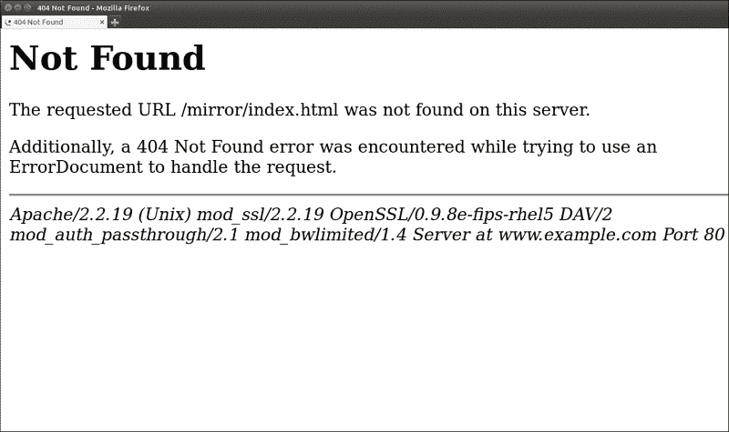

# 第一章：在 Nginx 配置中寻找问题

Nginx 是一款复杂的软件，帮助你实现自己在万维网中的一部分——互联网的杀手级应用之一。尽管看似简单，Web 及其底层的 HTTP 协议有许多复杂的细节，可能需要特别关注。Nginx 通过其丰富的配置语言让你有能力关注这些细节。沿袭了 UNIX 传统的可读性和可写性文本配置文件，Nginx 期待你具备一定的理解力和热情，以便它能够以最佳的方式提供服务。这也意味着存在自由度，并且容易出错。

本章的主要目标是带领你了解 Nginx 的配置方式，并展示一些易出错的区域。

你将进一步了解：

+   配置语法及其描述和示例

+   默认配置文件中所有文件的描述

+   你可能会犯的错误，通过默认配置中的示例，并提供避免这些错误的技巧

# 介绍基本的配置语法、指令以及测试

Nginx 的主要作者 Igor Sysoev 曾多次表示，他设计 Nginx 配置语言的方式是为了让配置过程不应像编程或实际编码一样。长期以来，他自己曾是俄罗斯几家较大网站的专业系统管理员。他完全理解网站管理员的目标不是编写美观、优雅的配置，或是拥有各种可能情况下所需的每个功能，无论这些情况有多么罕见。目标是能够声明性地描述业务需求，表述需要什么样的行为，而不深入探讨如何在软件中实现这些行为。与此相对的语言设计理念的一个有趣例子是 Lighttpd 配置语言，但这不在本书的讨论范围内。

这就是我们现在所拥有的——一个简单的声明性语言，灵感来自 Apache 的配置语言，但没有那些类似 XML 的标签。打开默认的`nginx.conf`文件，看看 Nginx 配置的样子。某些发行版会包含对默认文件的修改。我们将使用来自原始压缩包中的版本，下载链接为[`nginx.org/download/nginx-1.9.12.tar.gz`](http://nginx.org/download/nginx-1.9.12.tar.gz)。接下来是一个快速的语法介绍，使用该文件中的部分作为示例。你可能觉得这很显而易见，但请耐心一点；即便是最有经验的读者，也会从中受益，重新温习一遍。

让我们来看一下文件的最开始部分。以`#`开头的行是注释，它们会被忽略。*注释掉*是一种非常常见的技术，用来让 Nginx 忽略配置中的一部分内容。在默认的 Nginx 配置文件（截至 1.9.12 版本）中，最上面的那一行实际上就是被注释掉的：

```
...
#user  nobody;
...
```

在 vim 中注释掉一段代码块的一个简单方法是通过*Shift-V*高亮显示它们，然后执行`:s/^/#/ ex`命令。在 Emacs 中，只需选择一个区域，然后按*M-;*。

Nginx 配置文件中非空且未注释的行有以下两种类型。

## 简单指令

简单指令由一个命令词、若干参数和一个分号组成。例如（见默认的`nginx.conf`文件顶部）：

```
...
worker_processes  1;
...
```

这里没有什么好担心的。对于那些拥有现代脚本语言（如 Python 和 Ruby）经验的人来说，他们往往会忘记分号；我们建议您确保添加它。

这里提到的参数可以是常量值（数字或字符串，这两者并不重要，它们在这个层级下都以相同方式解析），或者它们可能包含变量。Nginx 中的变量是以`$dollar_prefixed`形式出现的标识符，它们在运行时被替换为实际的值。例如，某些变量包含来自 HTTP 请求的数据，您可以根据这些值来修改网站的行为，或者仅仅将它们记录下来。

在默认的`nginx.conf`文件中，一个非常好的变量示例是：

```
...
#log_format  main  '$remote_addr - $remote_user [$time_local] "$request" '
#                  '$status $body_bytes_sent "$http_referer" '
#                  '"$http_user_agent" "$http_x_forwarded_for"';
...
```

该指令通过为日志的每一行构建一个模板来创建日志格式。它使用了在请求/响应周期中可用的多个变量。

## 多行指令

多行指令是简单指令的扩展。但与简单指令不同，结束时没有分号，而是有一个用大括号`{ ... }`括起来的代码块。在这里，*instead*是字面意义上的。你不需要在关闭大括号后添加分号。对于那些拥有一定经验的传统 C 语言或类似语言的程序员来说，这一点是非常自然的。

这是一个默认 Nginx 1.9.12 版本的`nginx.conf`文件中非常初始的多行指令示例：

```
events {
    worker_connections  1024;
}
```

现在，这是一个`events`指令，它没有任何参数，并且包含一个代码块，而不是分号。由于这些代码块，多行指令也被称为“块指令”。块可以包含各种类型的内容，但其中最重要且有趣的块是包含其他指令的块——无论是简单的还是多行的。

在前面的示例中，`events`指令的代码块包含了一个简单的`worker_connections`指令。

允许其他指令出现在其块内的多行指令被称为“上下文”。它们为封闭的配置内部部分引入了新的上下文。

大多数多行指令实际上都是上下文——从最常见的`server`或`location`，到最冷僻的`limit_except`。一个不是上下文的多行指令的例子是`types`，它引入了文件扩展名与所谓的**多用途互联网邮件扩展**（**MIME**）类型之间的关系。我们将在本章稍后介绍`types`。

上下文非常重要。它们是指令所在的作用域和主题。如果一条命令没有包含在任何多行指令块中，那么它被认为是属于名为“main”的特殊上下文，它的作用域是最广泛的。这个上下文中的指令会影响整个 Nginx 应用程序。其他上下文则位于“main”之内，或者更深层次，而那些上下文中的命令作用范围较小，只影响整个系统的一部分。

## include 指令

除了一个指令外，我们将不会在这里描述实际的指令。这个指令是`include`，它是所有将工作扩展到多个网站、服务器或 URL 的系统管理员心爱的指令。如果我们可以使用更多编程术语，它是一个非常简单的块级“包管理工具”。这个简单的指令有一个参数，即文件名或一个匹配多个文件的通配符（UNIX glob 风格）。在处理过程中，这个指令会被它所引用的文件内容所替代。一个简单的示例（来自默认的`nginx.conf`文件）：

```
...
include fastcgi_params;
...
```

我们不会浪费时间再解释`include`。我们需要补充的是，被包含的文件必须在语法上完全正确。你不能将一条命令的一部分放在一个文件中，然后在另一个文件中包含剩余部分。

就是这样，整个语法已经描述完毕。让我们给你展示一段虚构的配置，虽然它展示了所有内容，但由于包含了不存在的指令（或者可能是某个未来版本的 Nginx 中的指令），它并不能实际工作：

```
...
simple_command 4 "two";
# another_simple_command 0;

special_context {
    some_special_command /new/path;
    multiline_directive param {
        1 2 3 5 8 13;
    }
    include common_parameters;
}
...
```

# 测试 Nginx 配置

Nginx 工具包中有一个非常方便的工具，用于检查配置文件的语法。它是内置于 Nginx 主可执行程序中的，通过以下命令行开关`-t`来调用：

```
...
% nginx -t
nginx: the configuration file /etc/nginx/nginx.conf syntax is ok
nginx: configuration file /etc/nginx/nginx.conf test is successful
...
```

命令`nginx -t`会非常彻底地检查你的配置。例如，它会检查所有被包含的文件，并尝试访问所有辅助文件，如日志文件或 PID 文件，以警告你它们的不存在或权限不足。如果你养成频繁运行`nginx -t`的习惯，你将成为一个更优秀的 Nginx 管理员。

## 默认的配置目录结构

现在，我们将逐一浏览你在 Nginx 默认安装包中得到的配置文件。其中一些是很好的示例，你可以从中开始编写自己的配置。有些则只是 Nginx 版本的陈迹。再次提醒，我们使用的是从官方 Nginx 网站上下载的 1.9.12 版本的原始 tar 包。

这是 Nginx 源代码存档中 `conf` 文件夹内文件的列表：

```
...
% ls
fastcgi.conf    koi-utf  mime.types  scgi_params   win-utf
fastcgi_params  koi-win  nginx.conf  uwsgi_params
...
```

`nginx.conf` 是主文件，是所有内容的起点。所有其他文件要么从 `nginx.conf` 包含，要么根本不使用。实际上，`nginx.conf` 是 Nginx 代码必需的唯一配置文件（你甚至可以通过使用 `-c` 命令行开关来覆盖它）。稍后我们会详细讨论它的内容。

一对 `fastcgi.conf` 和 `fastcgi_params` 文件包含几乎相同的简单命令列表，用于配置 Nginx FastCGI 客户端。默认情况下，FastCGI 不会启用。这两个文件作为示例提供（其中一个甚至是从 `nginx.conf` 文件的注释部分使用 `include` 命令包含的）。

三个具有谜一般名称的文件 `koi-utf`、`koi-win` 和 `win-utf` 是字符映射，用于在电子文档中不同的方式编码 Cyrillic 字符。当然，Cyrillic 是用于俄语和其他几种语言的文字。在俄罗斯的第一批互联网主机的早期，关于在文档中如何编码俄语字母曾有一场争论。你可以在 [`czyborra.com/charsets/cyrillic.html`](http://czyborra.com/charsets/cyrillic.html) 上了解不同的 Cyrillic 字符集和编码。其中几种变得流行起来，而 Web 服务器必须包含转换文档编码的功能，以便在客户端浏览器请求与服务器使用的编码不同时动态转换文档。甚至有一个完全基于此功能的 Apache Web 服务器分支。Nginx 也必须做同样的事情，以与 Apache 竞争。现在，10 多年过去了，作为全球**万维网**继续向 UTF-8 作为所有人类语言的通用编码迈进，这些重新编码文件已深为过时。除非你支持面向俄语访客的非常旧的网站，否则你永远不会使用这些 `koi-utf`、`koi-win` 和 `win-utf` 文件。

名为 `mime.types` 的文件是默认使用的。你可以看到它是从主 `nginx.conf` 中包含的，最好保持这样。"MIME 类型" 是文件中不同信息类型的注册表。

它们起源于一些电子邮件标准（因此称为 MIME），但被广泛用于包括 Web 在内的所有地方。让我们来看看 `mime.types` 的内容：

```
...
types {
    text/html                             html htm shtml;
    text/css                              css;
    text/xml                              xml;
    image/gif                             gif;
...
```

因为它是从 `nginx.conf` 中包含的，所以它应该符合正确的 Nginx 配置语言语法。没错，它包含一个单一的多行指令 `types`，这不是一个上下文（如前一部分所述）。它的块是由一对对组成，每一对都表示一个 MIME 类型与一组文件扩展名的映射关系。这个映射用来标识由 Nginx 提供的静态文件，标明其拥有特定的 MIME（或内容）类型。根据引用的片段，`common.css` 和 `new.css` 将被赋予 `text/css` 类型，而 `index.shtml` 将是 `text/html`，依此类推，这非常简单。

## 修改 MIME 类型注册表的快速示例

有时候，您会往这个注册表中添加内容。现在让我们尝试一下，演示如何引入一个简单的错误以及如何找到并修复它的工作流程。

您的网站将为同事们提供日历。日历是一个由第三方应用生成的 iCalendar 格式文件，并以 `.ics` 扩展名保存。在默认的 `mime.types` 文件中没有关于 `ics` 的内容，因此，您的 Nginx 实例将以默认的 `application/octet-stream` MIME 类型提供这些文件，这基本上意味着“这是一堆字节（字节流），我完全不知道它们的含义”。假设您的同事使用的新日历应用需要正确的 iCalendar 类型的 HTTP 响应。这意味着您必须将 `text/calendar` 类型添加到您的 `mime.types` 文件中。

打开编辑器中的 `mime.types` 文件，并将这一行添加到文件的末尾（不要放到中间，也不要放到开头，末尾对于这个实验很重要）：

```
...
text/calendar ics
...
```

然后，您运行 `nginx -t`，因为您是一个优秀的 Nginx 管理员：

```
...
nginx: [emerg] unexpected end of file, expecting ";" or "}" in /etc/nginx/mime.types:91
nginx: configuration file /etc/nginx/nginx.conf test failed
...
```

啪。Nginx 足够聪明，会告诉您需要修复的地方；这一行看起来既不像简单的指令，也不像多行指令。让我们加上分号：

```
...
text/calendar ics;
...

...
nginx: [emerg] unknown directive "text/calendar" in /etc/nginx/mime.types:90
nginx: configuration file /etc/nginx/nginx.conf test failed
...
```

现在这部分内容稍显复杂。您需要理解的是，这一行并不是一个独立的指令。它是 `types` 多行（稀有的非上下文）指令的一部分；因此，它应该被移入到块中。

将 `mime.types` 文件的尾部从以下内容更改：

```
}
text/calendar ics;
```

上述代码应如下所示：

```
text/calendar ics;
}
```

通过交换最后两行有效的代码实现：

```
nginx: the configuration file /etc/nginx/nginx.conf syntax is ok
nginx: configuration file /etc/nginx/nginx.conf test is successful
```

恭喜，您刚刚为公司启用了一个新的业务流程，涉及到移动工作团队。

最后的两个默认配置文件是 `scgi_params` 和 `uwsgi_params`。这两者分别对应 `fastcgi_params`，为您的 Web 服务器设置了两种替代的 Web 应用程序运行方法（如您所猜测的，分别是 SCGI 和 UWSGI）。当您的应用程序开发人员为您提供这些接口编写的应用程序时，您将使用它们。

## 默认的 nginx.conf

现在，让我们深入了解主配置文件 `nginx.conf`。在它的默认形式中（你在 tarball 中看到的），它相当空洞且没有用处。与此同时，它始终是你编写自己配置时的起始点，并且也可以作为展示一些常见问题的示例，这些问题是人们自己造成的。并不需要逐个讲解所有指令，所以只会包括那些适合展示技巧或常见错误点的部分：

```
...
#user nobody;
...
```

该指令指定了 Nginx 进程将以哪个 UNIX 用户身份运行。注释掉配置中的部分内容是常见的文档技巧。它展示了默认值，并且去掉注释字符是安全的。如果你试图以一个不存在的用户身份运行，Nginx 会报错。作为一般规则，你应该信任你的包管理供应商，不要更改默认设置，或者使用权限最小的帐户。

```
...
#error_log  logs/error.log;
#error_log  logs/error.log  notice;
#error_log  logs/error.log  info;

#pid        logs/nginx.pid;
...
```

这些行指定了一些默认文件名。三个 `error_log` 指令是另一个技术的示例：提供多个变体作为注释，这样你可以取消注释你喜欢的版本。这三者的区别在于错误日志中记录的详细程度。关于日志有一个完整章节，因为它们无疑是任何 Nginx 管理员进行调试和故障排除时最重要的工具。

`pid` 指令允许你更改存储主 Nginx 进程 pid 的文件名。你很少需要更改它。

请注意，这些指令在这些示例中使用了相对路径，但这并不是强制要求的。它们也可以使用绝对路径（以 `/` 开头）。`error_log` 指令提供了除简单文件之外的另外两种日志记录方式，稍后你会看到它们。

```
...
events {
    worker_connections  1024;
}
...
```

这是我们的第一个上下文，且有些混乱。`events` 并不是用来限定其中指令的作用范围。大多数这些指令只能在 `events` 中使用，不能在其他任何上下文中使用。它作为一种逻辑分组机制，用于许多配置 Nginx 如何响应网络活动的参数。这些是非常通用的词汇，但它们恰如其分。你可以将 `events` 看作是一个标记彼此相关参数的历史方式，虽然有些复杂。

`worker_connections` 指令指定了每个工作进程能够拥有的最大网络连接数。它可能是一些奇怪错误的根源。你应该记住，这个限制包括了 Nginx 与用户浏览器之间的客户端连接和 Nginx 为你的后台 Web 应用程序代码所必须打开的 `server` 连接（除非你只提供静态文件）。

## http 指令

```
...
http {
    include       mime.types;
    default_type  application/octet-stream;
...
```

这里我们开始，`http` 标记了一个庞大的上下文的开始，通常会跨越多个文件（通过嵌套包含），并将所有与 Nginx 的 Web 部分相关的配置参数进行分组。你可能会觉得这听起来很像 `events`，但它实际上是一个非常有效的上下文，需要一个单独的指令，因为 Nginx 不仅能作为 HTTP 服务器工作，还能提供其他协议的服务，例如 IMAP 和 POP3。这个使用场景可以说是很少见的，我们不会在这里浪费时间，但它展示了一个非常合理的理由，即为所有 HTTP 选项设立一个特殊的作用域。

你可能知道 `http` 内部的前两个指令的作用。永远不要更改默认的 MIME 类型。许多 Web 客户端使用这种特定类型作为指示，表明一个文件需要作为一个不透明的数据块保存到客户端计算机上，对于所有未知的文件来说，这是一个不错的选择。

```
...
    #log_format  main  '$remote_addr - $remote_user [$time_local] "$request" '
    #                  '$status $body_bytes_sent "$http_referer" '
    #                  '"$http_user_agent" "$http_x_forwarded_for"';

    #access_log  logs/access.log  main;
...
```

这两条指令用于记录所有请求，无论是成功还是失败，目的是为了追踪和统计。第一条指令创建日志格式，第二条指令根据所述格式将日志记录到特定文件中。这是一个非常强大的机制，本书后面会对其进行特别讲解。然后我们有以下代码：

```
...
    sendfile        on;
    #tcp_nopush     on;

    #keepalive_timeout  0;
    keepalive_timeout  65;

    #gzip  on;
...
```

这两条指令打开了 HTTP 支持的某些网络功能。`sendfile` 是一个系统调用，它允许操作系统内核将文件中的字节直接复制到套接字，有时使用 "零拷贝" 语义。除非你的内存非常少，否则通常保持开启是安全的——有报告称，在内存很少的服务器上，`sendfile` 可能会工作不可靠。`tcp_nopush` 仅在 `sendfile on` 的情况下才有意义。它允许你优化通过 `sendfile-d` 文件发送的网络数据包数量。`keepalive` 是现代 HTTP 的一项特性——浏览器（或任何其他客户端）可能会选择不立即关闭与服务器的连接，而是保持连接，以防很快再次需要与同一服务器通信。对于许多由成百上千个对象组成的现代网页，这可能会大有帮助，尤其是在 HTTPS 上，因为开启新连接的成本更高。`keepalive` 超时是 Nginx 在不关闭客户端开放连接时的时间（秒）。调整默认值 75 很少会影响性能。如果你对你的客户端有特殊了解，可以尝试调整，但通常情况下，人们要么保持默认超时，要么通过将超时设置为零来完全关闭 `keepalive`。

现在有很多压缩算法远比传统 gzip 的 LZW 算法要好，但 gzip 在 Web 服务器和客户端中是最广泛使用的，它能提供足够好的文本压缩效果，且几乎没有成本。`gzip on`将启用 Nginx 与其客户端之间的数据自动压缩，当然，前提是客户端声明支持 gzip 压缩的服务器响应。仍然有一些浏览器不完全支持 gzip。有关`gzip_disable`指令的描述，请参考 Nginx 文档中的[`nginx.org/en/docs/http/ngx_http_gzip_module.html#gzip_disable`](http://nginx.org/en/docs/http/ngx_http_gzip_module.html#gzip_disable)。这可能是问题的来源，但只有在您有一些非常特殊的用户，使用奇怪的特殊客户端软件或是来自过去的用户时，才会出现问题。

```
...
    server {
        listen       80;
        server_name  localhost;
...
```

现在我们有了另一个多行上下文指令，位于`http`中。这是一个著名的`server`指令，用于配置一个单独的 Web 服务器对象，指定主机名和监听的 TCP 端口。这两者是该`server`中最上层的指令。第一个，`listen`，其语法比仅指定端口号复杂得多，我们在这里不会详细描述。第二个指令语法简单，但匹配规则较复杂，最好在在线文档中查阅详细描述。简单地说，这两个指令提供了一种选择正确服务器来处理传入 HTTP 请求的方式。最常用的是最简单形式的`server_name`，它只包含一个 DNS 域名形式的主机名，并与浏览器在`Host:`头中发送的名称进行匹配，而该名称实际上只是 URL 中的主机名部分。

```
...
        #charset koi8-r;
...
```

这是指示您为浏览器提供的文档的字符集（编码）的一种方式。默认情况下，它设置为特殊值`off`，而不是 RFC1489 中的老旧`koi8-r`。如今，最佳的选择是指定`utf8`，或者直接不指定。如果您指定的字符集与文档的实际字符集不匹配，将会遇到问题。

```
...
        #access_log  logs/host.access.log  main;
...
```

这是一个有趣的例子，展示了如何在狭窄的上下文中使用指令。记住，我们已经在`http`指令中的上一级讨论过`access_log`。这个指令只会开启对该特定服务器的请求日志记录。将服务器名称包含在其访问日志的名称中是一个好习惯。因此，应该将`host`替换为与`server_name`非常相似的内容。

```
...
        location / {
            root   html;
            index  index.html index.htm;
        }
...
```

再次看到，我们在这个特定服务器上看到一个多行指令，引入了多个 URL 的上下文。`location /`将匹配所有请求，除非在同一级别上有一个更具体的 location 指令。选择正确的 location 块来处理传入请求的规则相当复杂，但简单的情况可以用简单的语言描述。

`index`指令指定了处理对应本地文件夹的 URL 的方式。在这种情况下，Nginx 会在该指令的列表中查找第一个存在的文件。为此类 URL 提供`index.html`或`index.htm`是一个非常古老的约定；除非你知道自己在做什么，否则不应该打破它。

顺便提一下，`index.htm`没有最后一个`l`是旧版 Microsoft 文件系统的遗物，这些文件系统允许文件扩展名中最多有三个字符。Nginx 从未在这种受限的 Microsoft 系统上工作过，但以`htm`结尾而非`html`的文件仍然存在。

```
...
        #error_page  404              /404.html;

        # redirect server error pages to the static page /50x.html
        #
        error_page   500 502 503 504  /50x.html;
        location = /50x.html {
            root   html;
        }
...
```

这些指令设置了错误报告给用户的方式。作为网站管理员，你肯定会依赖日志，但万一发生了什么，用户不应该被置于黑暗之中。`error_page`指令为基于著名 HTTP 状态码的 HTTP 错误安装了一个处理器。第一个示例（已注释）告诉 Nginx，如果遇到 404（未找到）错误，它不应该将其报告为真实的 404 错误，而是应该发起子请求到`/404.html`位置，渲染结果，并将其作为响应呈现给原始用户请求。

顺便说一句，使用 Apache web 服务器时，你可能犯的最尴尬的错误之一就是提供一个 404 处理程序，结果却引发了另一个 404 错误。还记得这些吗？



Nginx 不会向用户显示这种细节，但他们仍然会看到一些非常丑陋的错误信息：


`location = /50x.html`看起来与我们之前讨论的非常相似。唯一重要的区别是`=`字符，表示“精确匹配”。整个匹配算法是一个完整的主题，但在这里你一定要记住，`=`表示“仅处理这个 URL 的请求，不要把它当作可以匹配更长 URL 的前缀”。

```
...
        # proxy the PHP scripts to Apache listening on 127.0.0.1:80
        #
        #location ~ \.php$ {
        #    proxy_pass   http://127.0.0.1;
        #}

        # pass the PHP scripts to FastCGI server listening on 127.0.0.1:9000
        #
        #location ~ \.php$ {
        #    root           html;
        #    fastcgi_pass   127.0.0.1:9000;
        #    fastcgi_index  index.php;
        #    fastcgi_param  SCRIPT_FILENAME  /scripts$fastcgi_script_name;
        #    include        fastcgi_params;
        #}
...
```

这是一个很大的注释块，关于同样的事情——使用两种不同的策略处理 PHP 脚本。正如你所知，Nginx 并不试图做所有事情，尤其是它尽量不作为应用服务器。第一个`location`指令设置了代理到另一个本地 PHP 服务器，可能是启用了`mod_php`的 Apache。

### 注意

注意`location`中的`~`字符。它开启了正则表达式引擎来匹配 URLs，因此末尾的`.`和`$`需要转义。Nginx 的正则表达式使用了源自 1960 年代后期第一个 grep 和 ed 程序的通用语法。它们通过 PCRE 库实现。有关该语言的全面描述，请参见 PCRE 文档：[`www.pcre.org/original/doc/html/pcrepattern.html`](http://www.pcre.org/original/doc/html/pcrepattern.html)。

第二个块与本地运行在 `9000` 端口上的 FastCGI 服务器交互，而不是 HTTP 代理。这是一种较为现代的 PHP 运行方式，但与简单且朴素的 HTTP 相比，它也需要更多的参数（参见包含的文件）。

```
...
        # deny access to .htaccess files, if Apache's document root
        # concurs with Nginx's one
        #
        #location ~ /\.ht {
        #    deny  all;
        #}
...
```

讨论中的服务器块的最后部分引入了**访问控制列表**（**ACLs**），这是一个带有正则表达式的`location`。注释中的说明很有意思。Nginx 与现有的 Apache 安装“结合”使用是一种传统的做法，即让 Nginx 处理所有静态文件，而将更复杂的动态 URL 代理到下游的 Apache。这种设置绝对不推荐，但你可能已经见过甚至继承了这样的配置。Nginx 本身不支持本地 `.htaccess` 文件，但必须保护这些从 Apache 继承的文件，因为它们可能包含敏感信息。

最终的服务器多行指令是一个提供 HTTPS 服务的安全服务器示例：

```
...
    # HTTPS server
    #
    #server {
    #    listen       443 ssl;
    #    server_name  localhost;

    #    ssl_certificate      cert.pem;
    #    ssl_certificate_key  cert.key;

    #    ssl_session_cache    shared:SSL:1m;
    #    ssl_session_timeout  5m;

    #    ssl_ciphers  HIGH:!aNULL:!MD5;
    #    ssl_prefer_server_ciphers  on;

    #    location / {
    #        root   html;
    #        index  index.html index.htm;
    #    }
    #}
...
```

除了中间一堆简单的 `ssl_` 指令外，重要的一点是 `listen 443 ssl`，它启用了 HTTPS（基本上，HTTPS 就是通过 SSL 在 TCP 端口 `443` 上运行的 HTTP）。我们在本书的第三章 *故障排除功能* 中讨论了 HTTPS。

# 配置中的常见错误

阅读默认配置文件可能会让人感兴趣且富有教育意义，但更有用的当然是查看实际用于生产环境的配置示例。我们现在将讨论一些在配置 Nginx 时常见的错误。

如果你没看到一些发生在你身上的情况，并且需要立即帮助，完全可以跳过并浏览书中的其余部分。全书中有更多按问题性质或影响分类的示例。

## 分号和换行符

一个真正伟大的软件的共同特点是它的宽容。Nginx 会在结果不模糊的情况下理解并自动纠正一些语法错误。例如，如果你非得将值用引号括起来——你完全可以这么做。

这是完全合法且运行正常的：

```
...
user "nobody" 'www-data';
worker_processes '2';
...
```

另一方面，这里有一个例子，Nginx 会拒绝你留下一个多余、不必要的分号，即使它并不会引入任何歧义：

```
...
events {
    worker_connections 768;
    # multi_accept on;
};
...
```

```
% sudo nginx -t
nginx: [emerg] unexpected ";" in /etc/nginx/nginx.conf:13
nginx: configuration file /etc/nginx/nginx.conf test failed

```

作者曾经有一个配置文件保存为旧版 Mac 格式，也就是以<CR>作为换行符。这是早期 Apple 操作系统使用的格式。文本编辑器和分页器会处理这种罕见的情况，你几乎不会注意到任何异常。但 Nginx 完全无法将文件分割成行：

```
% sudo nginx -t
nginx: [emerg] unexpected end of file, expecting "}" in /etc/nginx/nginx.conf:1
nginx: configuration file /etc/nginx/nginx.conf test failed

```

修复的方法是将换行符从 <CR> 转换为 <LF> 或 <CR><LF>。最简单的方法是使用 Unix/Linux 命令行中的 `tr`，如下所示：

```
% tr '\r' '\n' < /etc/nginx/nginx.conf > /tmp/nginx.conf

```

（之后，手动检查并用 `mv` 替换旧文件。）

## 文件权限

你注意到我们用 `sudo` 运行 `nginx -t` 吗？让我们试试不加 `sudo` 看会发生什么：


其实这件事很有趣。Nginx 报告说文件的语法是正常的，但随后它决定深入检查，不仅检查语法，还检查配置中提到的某些功能是否可用。首先，它抱怨无法更改有效用户，这个用户是所有工作进程运行时的权限。你记得 `user` 指令吗？它还试图打开主服务器范围的错误日志和 `pid` 文件，后者在每次重启 Nginx 时会被重写。这两个文件都无法从主工作账户进行写操作（当然它们不应该被写）。这就是为什么运行 `nginx -t` 时需要使用 sudo 的原因。

## 变量

这里有另一个简单的语法错误示例，这种错误可能会在你职业生涯中咬你一两次。你还记得我们在前几页讨论过的变量吗？Nginx 使用 `$syntax`，这对有 UNIX shell、awk、Perl 或 PHP 编程经验的人来说非常熟悉。不过，容易忽视美元符号，而 Nginx 并不会注意到这一点，因为变量就会变成一个简单的字符串常量。

当你将 Nginx 设置为另一个 Web 服务器的代理时（这种配置传统上被称为“反向加速器”，但近些年这种叫法越来越少），你会很快发现所有来自客户端的请求都会通过 Nginx 转发到你的后端服务器，而且所有客户端连接看起来都来自同一个 IP 地址——你的 Nginx 主机的地址。原因很明显，但一旦你的后端逻辑依赖于获取实际客户端地址，你就需要绕过这个代理的限制。一个常见的做法是，在所有从 Nginx 发往后端的请求中包含一个额外的 HTTP 请求头。下面是实现方法：

```
...
proxy_set_header X-Real-IP $remote_addr;
...
```

应用程序必须检查这个头部，只有在没有该头部的情况下，才使用来自套接字的实际客户端 IP 地址。现在，假设丢失了 `$remote_addr` 开头的那个美元符号。突然间，你的 Nginx 会给所有请求添加一个非常奇怪的头部 `X-Real-IP: remote_addr`。`nginx -t` 不能检测到这个问题。如果后端应用程序有严格的 IP 地址解析器，可能会崩溃；或者更讽刺的是，它可能会跳过无法解析的 `remote_addr` IP 地址，默认使用实际的 Nginx 地址，并且从不将此信息报告到任何日志中。你最终会得到一个正常工作的配置，但悄悄地丢失了宝贵的信息！根据运气，这个问题可能会在生产环境中存在几个月，直到有人注意到应用程序的新“按 IP 限制速率”功能开始影响所有用户。

啊，真是恐怖！

## 正则表达式

让我们做些不那么具破坏性的事情吧。许多 Nginx 指令都使用了正则表达式。你应该熟悉它们。如果没有，建议尽早停止工作，去书店买本书。许多 IT 从业者认为，正则表达式是继快速打字后，日常使用中最重要的技术或技能。

最常见的是，你会在`location`多行指令中看到正则表达式。除此之外，它们在 URL 重写和主机名匹配中也非常有用（有时是不可避免的）。正则表达式是一种迷你语言，它使用多个字符作为元字符从字符串中构建模式。这些模式覆盖了字符串集合（通常是无限集合）；检查某个特定字符串是否包含在与模式对应的集合中的过程称为匹配。这是来自默认`nginx.conf`文件的一个简单正则表达式：

```
...
#location ~ \.php$ {
#    proxy_pass   http://127.0.0.1;
#}
...
```

`location`命令词后的波浪号意味着后面的内容是一个正则表达式，用来匹配传入的 URL。`\.php$`覆盖了宇宙中所有具有这四个字符的字符串集合，这些字符出现在字符串的最后：`.php`。点前的反斜杠取消了点的元值，它表示“任何字符”。美元符号是一个元字符，它匹配字符串的末尾。

在那个表达式中，有多少种方法可以出错？很多，非常多。`nginx -t`能指出这些错误吗？很可能不会，除非你恰好使整个指令无效，并且由于这个迷你语言的表达力非常强，几乎所有的字符组合都是有效的。我们来试试一些：

```
...
        location ~ \.php {
...
```

你注意到了吗？对，没用美元符号，跟之前展示的变量例子一样。这是完全有效的。它也会通过大多数测试，因为这个正则表达式覆盖了一个更大的无限字符串集合，其中包含`.php`作为子字符串，而不一定是字符串的结尾。可能会出什么问题呢？嗯，首先，你可能会收到一个类似`/mirrors/www.phpworld.example.com/index.html`的 URL 请求，然后崩溃。其次，通过比较最后四个字符来匹配，逻辑上比在整个缓冲区中查找子字符串要简单得多。尽管很小，但这可能会对性能产生影响。

让我们跳过反斜杠吧：

```
...
        location ~ .php$ {
...
```

Evil。这也能通过测试，但再次地，匹配的字符串集合增加了。现在，`php`前面的点不再是字面意思，它是一个元点，表示任何字符。你得非常幸运才能碰到像`/download/version-for-php`这样的东西，但一旦你碰到，它就能匹配到。这就像是一个定时炸弹。

现在，让我们去掉波浪号：

```
...
        location \.php$ {
...
```

顺便问一下，你喜欢我们的游戏吗？你应该已经能预测接下来会发生什么，并知道如何修复它，前提是你喜欢这个游戏，并开始像 Nginx 实例一样思考。

缺失的波浪号将把这个位置指令转化为最简单的形式——完全不使用正则表达式。字符串`\.php$`被解释为要在所有传入的 URL 中搜索的前缀，包括反斜杠和美元符号。这个位置块会处理任何请求吗？我们无法确定。这里有一点很重要，那就是`nginx -t`对于这个指令依然没有任何提示。它在语法上仍然是有效的。

# 总结

在本章中，你刷新了对 Nginx 配置方式的理解。我们展示了语言的样子，以及在编写时一些常见的陷阱。你们中的一些人学到了一些关于 Nginx 作者包含在默认`conf`文件夹中的神秘文件的知识；有些人再也不会错过分号了。经常运行`nginx -t`，但绝不要盲目依赖它说一切正常。

下一章将专门讨论如何读取和配置 Nginx 内部的日志机制。
