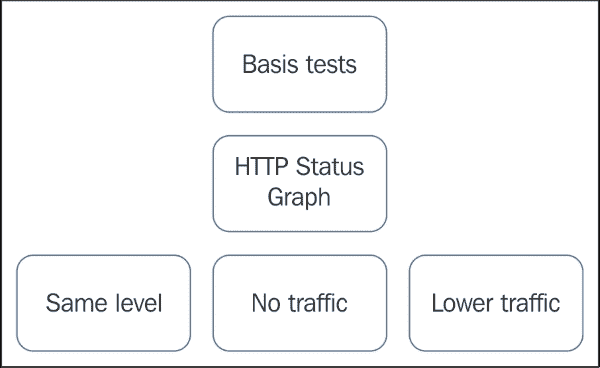
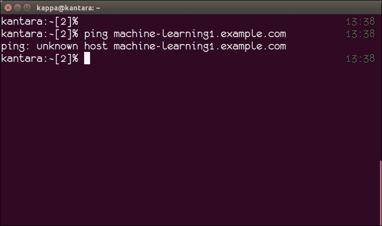
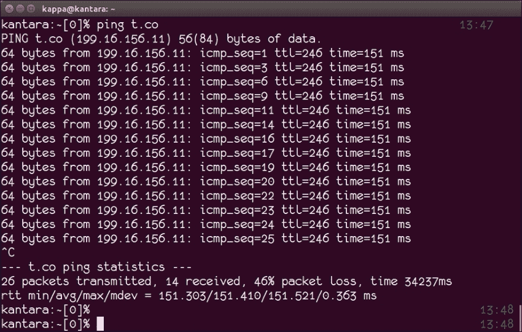
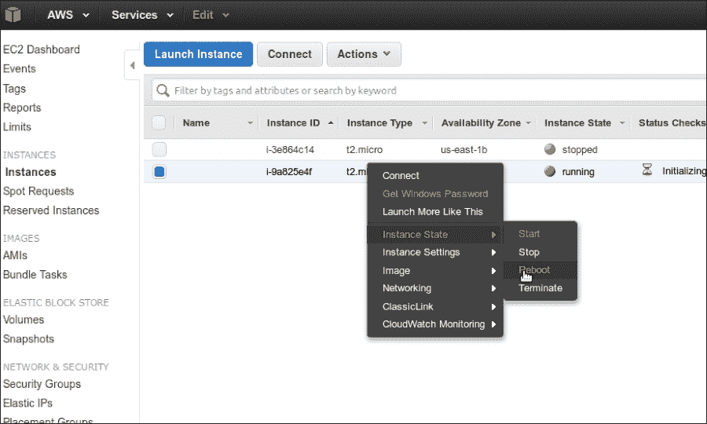
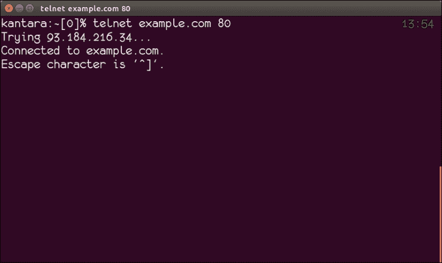

# 第三章：故障排除功能

你在半夜接到电话。“我们的网站不能用了，”老板喊道。几秒钟内，你全神贯注，试图记起“我们昨天到底做了什么更改？”——这是每个系统管理员在这个星球上的自然反应。

你曾经遇到过这样的情况吗？这是每个年轻系统管理员的压力测试，我们希望你在职业生涯早期就经历过，而不是后期，因为这是一次宝贵的教学经验。幸运的是，网站通常在大多数内容加载完毕时发生故障，这通常发生在上午晚些时候或傍晚——如果你很幸运，居住的时区与目标受众的时区大致相同。例如，这是俄罗斯一个大型网站的流量图，俄罗斯是一个非常以两大首都为中心的国家，这些城市在 2016 年时都位于 UTC+03 时区：


正如你所看到的，真实的流量在早晨到来，傍晚达到高峰，随着人们上床睡觉，流量急剧下降。

本章将涵盖以下主题：

+   在处理此类事件时使用的流程，远非完美，但非常可行

+   一些最令人羞愧的失败的描述

+   简短介绍如何重启 Nginx

+   关于如何通过 Nginx 拯救局面的更多信息

# 处理投诉

我们将任何表达出的异常行为称为投诉。这个术语足够模糊，不意味着它总是一个问题或错误，而是一个在开发过程中引入并需要修复的事情。处理投诉从调查开始。你唯一从一开始就知道的是，网站上的某些功能对某些人不起作用。由自动监控系统引发的事件是一个单独的案例。

令人惊讶的是，通常人们很难回答“究竟什么地方对你不起作用？”这个问题。有些人会感到困惑，甚至生气。虽然你必须始终问这个问题，但不要抱有太高的期望。让我们分析一下从最常见到较少见的可能答案：

+   *“什么都没有！”*

+   *“我加载页面，我点击这里和那里，订了一本书，进入购物车，开始付款，得到确认，最后一步出现一个关于证书的安全警告，证书昨天过期了。”*

大多数时候，确定问题具体表现如何的责任在于你。你需要合理安排优先事项，并迅速采取行动。

本章为你提供了一系列步骤，当你只有网站无法工作的报告时可以执行。这个列表并非是平坦的；其中有分支，你需要遵循。在此，我们建议你阅读所有步骤，因为这将帮助你更好地掌握整个过程。你也可以在发生事件时使用这些步骤。在这种情况下，你将从一开始就进入，然后选择合适的下一步，同时跳过不相关的部分。对于很多读者来说，这种格式类似于一个非常简单的有限状态机描述可能会有所帮助。

你将通过解读额外的信号从一个状态转移到另一个状态，并希望最终达到目的。这是我们推荐的一个简单故障排除过程的三级方案。每个框将在后文中解释：



## 回滚

我们在这里需要提供一个非常重要的附加说明。你可以把它当作一个零步骤，总之，始终试图通过去除最近的更改来将系统恢复到工作状态。网站是比我们以前所接触过的任何事物都更加动态的软件。如果你每周部署一次，那么你实际上比许多竞争对手还要慢。因此，当问题发生时，最近的一次变更集是罪魁祸首的可能性非常高。

在这样的事件中，始终紧紧把握你所有行动的主要目标是非常重要的；你需要找到一个解决方法，使业务能够继续进行。你需要尽快恢复操作，只有在恢复后，你才应该开始寻找根本原因并制定一个一劳永逸的解决策略。年轻系统管理员的一个大错误，特别是那些有开发背景的人，就是*过早调试*，我定义为在没有先实现一个快速有效的临时解决方案的情况下，就把资源（即使是你个人的精力，而不是公司资金）投入到修复上。

解决新问题最简单的方式之一是将软件回滚到之前的工作版本。那些有良好变更控制规范的组织，甚至可能选择在任何故障发生时回滚，无论故障是由内部还是外部原因引起的。最难的部分通常是在应用服务器方面，作为负责服务稳定性的人员，你可能需要你的开发团队实现全面的回滚功能。不过，你可以在 Nginx 层面做几件事。

### 将 Nginx 配置文件纳入源代码管理

Nginx 配置文件都是用简单的行和块导向语言编写的纯文本。这种组合对于差异化和合并来说和任何“真实源代码文档”一样完美。所以，请务必投资建立一个适合您的 Nginx 配置的源代码仓库。选择老牌的*Subversion*或现代工作马*Git*，甚至是油腔滑调但功能依旧的*CVS*都无关紧要。这些工具相较于没有任何源代码控制系统的系统，能多次挽救您的理智。只有建立了中央仓库，下一步就是全自动部署。这一步略超出本书范围，但好奇的读者一定会对现代自动化工具感兴趣，比如*Chef*、*RX*或*Ansible*，一旦管理的服务器数量超过五台。

单独访问所有以前版本的配置文件本身就是一件了不起的事情，它将极大地简化回滚过程。任何合理的源代码控制系统都允许您标记特定的修订版本，基于时间戳检出或创建移动分支。通过一个名为**etckeeper**的工具，即可迅速将工作中的服务器与此源代码控制魔法结合起来（参见[`github.com/joeyh/etckeeper`](https://github.com/joeyh/etckeeper)）。它将自动记录您对`/etc`所做的所有更改，因此在出现问题时，您可以轻松回溯。它还会定期将差异邮寄给服务器的管理员。对于服务器来说，这似乎有点过于自动化，但这是一个很好的起点。

这是一个简单的命令，您可以在 etckeeper 控制的`/etc`文件夹中发出，以快速恢复`/etc/nginx`中的某些更改：

```
% sudo git checkout 'master@{11 minute ago}' nginx

```

## 保持案例日志

在调查网站故障时，一个非常推荐的最佳实践是记录日志或想法日记以便以后实施。这样你就会有一个清单，上面写着需要你和同事在开发和管理部门做的事情，以防止这类特定问题的再次发生。这也是为什么我们会用日志标记每一步。你应该将任何疯狂或琐碎的想法都记录在这本日志中，这样你就能在紧急任务时释放你的大脑。即使你之后拒绝了大部分的想法，保持这本日志也会在处理过程中帮助你。

所以，不再拖延，让我们开始吧。

再次，我们只是对您负责的网站进行了模糊的抱怨。有人说它不能用了。

## 执行最简单的测试

亲自加载页面。这可能不是最有效的步骤，但你肯定会这样做，对吧？这是一种自然反应——重要的是不要作出任何过早的结论。如果加载不了，你应该先检查你的互联网连接。请参阅后文。

如果网页对你有效，你可能会感到一种错误的宽慰。实际上，你的问题可能刚刚变得更复杂。该网站对某些人有效（在这种情况下，对你有效），但不一定对所有人都有效。请参见这里的*HTTP 响应流量*部分。

顺便提一下，有时候你可能已经拥有答案。例如，你会立刻看到过期的 SSL 证书。另见*证书测试*。

## 进行互联网连接测试

通过尝试加载一个参考网页，检查自己的互联网连接是否正常，例如，[`www.google.com`](https://www.google.com)。

为什么这要作为一个独立的测试？我们难道不应该谈论电力或清洁空气吗？有两个原因：如果你是一家小公司，租用办公室空间，即使是在世界上最先进的国家，你每年也可能会遇到两到三次互联网服务提供商（ISP）故障的情况。此外，我们需要顺畅地过渡到讨论系统管理员的备用连接设备。

### 注意

日志：时刻确保自己的互联网连接是正常的。奇怪的是，许多人会使用任务栏中的 Dropbox 图标来显示这一点。虽然这是一个有趣的小窍门，但请实现一些更专业、适用于整个办公室和/或你工作站的方式。

你需要为主连接故障的罕见情况准备一个备用的互联网连接。如今，这通常是通过手机进行的共享连接。启动它并重新进行测试。令人惊讶的是，备用连接准备好的人并不多，我们想对此说几句。传统上，备份是存储。你的办公室管理员会镜像硬盘；你自己也会在家里为孩子们的照片和文件设置一个忠诚可靠的 Time Machine 备份。但是在这个时代，随着所有应用程序已经或正在转移到云端，存储备份系统的意义逐渐减弱。你自己是无法建造一个与 Dropbox（借助 Amazon Web Services）相媲美的系统的。规模效应带来额外的冗余和人才。但与此同时，你的连接的重要性却在上升。

一台现代的 Chromebook 是一个快速且廉价的工作机器，直到 WiFi 连接消失，因为接入点的电源适配器被烧毁或发生其他故障。现代 IT 人员在存储备份方面感受到的压力较小，他们应该将释放出的资源用来确保连接备份。考虑一下你的选项，并投资一种替代方式，或许能够以较少的带宽将你的办公室重新连接到互联网。当这个系统帮助你时，你会感到高兴。也请像对待存储备份那样看待它；这些是风险规避系统。它们并不需要被使用，哪怕一次都不需要使用，它们依然算是一个成功的投资。

### 注意

日志：1）为你的办公室实施备份上行链路。2）为所有系统管理员（例如你自己）配备远程管理工具包。推荐的方式是提供独立的设备（无线 3G/LTE 拨号器或预配置的智能手机热点）和预付费数据计划。不要依赖他们的主手机，因为主手机往往在最关键的时刻出现充电和流量问题，而公司提供的独立设备可能会有充满电的要求，特别是在值班时。

## 测试通用 HTTP 响应流量

查看你的通用 HTTP 监控图表，或者至少`tail -f`访问日志。这是了解事件影响最直接的方式（如果有的话）。你必须有合适的基础设施，我们将在第六章中说明如何建立一个基础设施，*监控 Nginx*。通用 HTTP 图表将包含每分钟生成的 HTTP 响应代码的数量图。你最关心的是 200 响应的数量。以下是几种可能的情况：

+   200 响应的数量降到零，或者你无法访问监控系统。

+   200 响应的数量降到了一个较低的水平，但仍高于零。这表明业务正在持续受到损害，概率很高。我们将在稍后（参见*无流量*和*流量减少*的情况）详细讨论这些情况，紧接着我们将处理更简单的情况。

+   你现在的 200 响应数量大致与通常在这一周的这个时刻所得到的数量相同。

这是一个不错的状态。你的网站很可能仍然以以前的方式为访问者提供服务。这时，你必须让开发人员参与进来，因为现在，这些是网站可能仍未按预期运行的方式。

### 注意

日志：实现这种类型的通用 HTTP 监控——按照 Nginx 访问日志的要求，绘制 200、3xx、4xx 和 5xx HTTP 响应的四种颜色的区域图，粒度为 1 分钟，并设定若干告警阈值。

### 检测欺骗的应用程序

Nginx 后面的应用程序实际上无法工作，但仍然返回 HTTP 200 Ok 响应。这是一个重大错误。

优秀的网站绝不会向用户显示内部错误信息。没有必要用不必要的细节吓唬人，如果网站不至于过度隐藏 HTTP 响应代码，这个问题甚至都不会被讨论。没有任何东西可以阻止任何人在所有情况下返回 200 Ok，并仅在响应内容部分指出错误条件。这种做法对于许多实际用途来说是“机器无法读取的”。所有的机器人和爬虫都不会把这种错误当作错误来处理。你的监控软件也需要特别的处理来区分这些情况。

查看著名的**404 Not Found**错误示例：

```
% curl -sLI http://google.com/non-existent | fgrep HTTP/
HTTP/1.1 301 Moved Permanently
HTTP/1.1 404 Not Found

% curl -sLI http://live.com/non-existent | fgrep HTTP/
HTTP/1.1 301 Moved Permanently
HTTP/1.1 301 Moved Permanently
HTTP/1.1 302 Found
HTTP/1.1 200 OK
```

不幸的是，这种情况意味着你仍然没有找到问题，你只是发现你缺少一种简单的方法来找到它。

### 注意

日志：在你的错误追踪系统中为所有没有报告错误的 HTTP 响应代码创建问题。开发者应该修复这些问题。

开发者现在应该和你并肩工作。尽管他们正在研究其应用程序代码的内部运作，这些代码愉快地生成错误消息而没有任何 4xx/5xx HTTP 响应代码，但你可以通过搜索开始发出不同流量量的 URL 来提供一些帮助。你还记得我们在日志章节一起写的脚本吗？如果你在日志中有响应大小，经过一些修改，它将找到那些包含远离平均值的数字的行。

### 注意

日志：最顶级的监控系统应用了混乱检测理论。

有一些方法可以在随机过程的突发变化中自动触发事件（而你监控的数字流就是这种过程）。另一个值得搜索的关键字是“异常检测”。我们遇到的所有系统都是专有的，都是根据大型互联网公司的需求在内部开发的。这个领域中也有一些商业化的产品，例如 Splunk。你实际上可以尝试这种类型的监控，而不必为了另一个学位重返学校，可以通过监控 200 HTTP 响应代码的导数并在该导数超过某个阈值时触发事件。因为导数是变化的指示器，高值将对应于剧烈的上下波动。

### 绕过集成失败

你的网站通过透明地集成另一个服务来实现部分功能，而这个服务正在发生故障。

这是一个完全由别人造成的错误情况。这种配置的例子包括使用外部评论系统、广告投放系统、统计和/或跟踪软件。你的工作是尝试关闭不必要的外部组件。因为这可能需要删除应用程序代码的部分（即使它只是一些静态页面中的简单 HTML 块），我们无法为你提供任何具体细节。你还应该彻底记录哪些服务正在阻止你的操作。

### 注意

日志：1）实施外部服务监控。2）发明一个优雅降级的计划并实施它。3）要求异步的客户端侧包含。

优雅降级是一个有趣的概念，即在网站的某个非关键部分（无论是外部的还是内部的）无法正常工作时，系统仍然能够进入一种特殊的工作模式。对于许多企业而言，进入完全的只读模式可能已经足够优雅。对于一个电子书店来说，无法下单显然比完全没有响应要好得多，后者会立即失去所有搜索引擎的信任，导致网站被立即从搜索结果中剔除。

优雅降级的规划应该在设计过程中尽早开始。当然，这是一个完全可以单独写一本或两本书的主题。在这些阶段，至少应该定期提醒开发团队，并尽可能多地自己动手做。

其他一些可能作为极端措施实施的降级示例，以帮助度过一些艰难时刻，包括：

+   暂时移除全文搜索功能。这通常是一个 CPU 和磁盘密集型的操作，只有很小一部分访问者会使用。

+   隐藏社交功能，如评论和分享。

我们难道不应该努力构建一个系统，不需要时不时地“砍掉一条腿”吗？当然应该。但成本可能会高得让人难以承受。如果你是一个初创公司，你无法计划在**分布式拒绝服务**攻击下完美运行。这会花费你太多。

Nginx 有几个技巧，可以绕过外部故障。

#### `try_files`指令

这个指令提供了一种快速提供本地文件的方式，而不是执行上游请求。它足够重要，因此在这里提到。其通用格式是：

```
try_files file1 file2 … uri;
```

几乎总是，`try_files`被用在一个 location 块中，该块定义了应该从本地文件处理中哪些请求。这个概念可以通过以下示例来说明：

```
location /get-recommendations {
  try_files static-recs.html empty.html @recommender_engine; 
}
location @recommender_engine {
  proxy_pass http://ml-fuzzy-bigdata-pipeline/compute-personal-recommendations?for=$user;
}
```

我们这里有一个独立的系统，使用了一些符合流行词汇的推荐生成技术，为网站访问者提供个性化的产品推荐。这些系统往往比较脆弱，`try_files`通过指定回退的静态 HTML 文件来保护我们。处理的顺序可能会让一些人感到困惑。首先，从左到右尝试静态文件。一旦找到现有文件，就用它来生成响应，剩下的文件和命名的 URI 块将不再使用。

通常，这些静态文件根本不存在于文件系统中。它们是在紧急情况下由监控系统（或人员）创建的。当你或你的同事小心翼翼地让那个重型外部组件复活时，你需要移除静态文件，Nginx 就会开始发出实际的上游查询。

#### 设置从上游自动删除

Nginx 提供的另一个可能在这些情况下帮助你的机制是辉煌的上游模块。这是一个完整的子系统，它增强了尊贵的`proxy_pass`指令，提供了许多故障转移选项。其理念是：与其使用指向外部数据源的传统 URL 来生成客户端请求的响应，不如指向一个通过`upstream`块指令配置的复合对象。这个块只有在与其内容一起使用时才有意义，所以让我先从一个例子开始：

```
upstream ml-backend {
  server machine-learning1.example.com;
  server machine-learning2.example.com;
  server unix:/var/run/mld.sock backup;
}
```

然后稍后：

```
location @recommender_engine {
  proxy_pass http://ml-backend/compute;
}
```

使用`upstream`指令定义的上游可以在 Nginx 的以下五个客户端（请求发起）模块中使用：`proxy`、`fastcgi`、`uwsgi`、`scgi`和`memcached`。它们共享类似的指令，用于设置在为实际客户端提供服务时使用的外部资源。主要指令始终是`*_pass`，这正是我们示例中使用的指令。

这一块的作用是将一组服务器组合成一个具有某些嵌入行为的对象。首先是轮询。当使用`*_pass`指令通过传递到这样的上游对象处理请求时，实际的服务器会从所有配置的替代服务器中选择。

### 提示

选择服务器的算法并不是随机的。服务器按轮询方式排列。你还可以为每个服务器提供相对的权重。在简单起见，可以把选择看作是随机的。从长远来看，带权重的轮询中每个变体的概率将大致等于相同变体在带权重随机分配中的概率。

上游包含的有趣逻辑是将失败的服务器从可用选择池中移除。这个逻辑由多个参数控制：

|

```
max_fails=$number

```

| 这是需要将特定服务器标记为“失败”并从轮询中移除所需的失败尝试次数。这些失败必须在下一个参数指定的固定时间段内发生。 |
| --- |

|

```
fail_timeout=$duration

```

| 这个变量有两个不同的用途。首先，它指定了计算失败尝试的时间段长度。其次，它还用于表示失败服务器保持失败状态而不重新考虑的时间。虽然可能会有一些问题使用相同的值，但事情就是这样。 |
| --- |

|

```
backup

```

| 这是一个二进制或布尔参数。当它存在时，只有当所有其他非备用服务器被标记为失败时，才会选择该标记的服务器。 |
| --- |

你可能已经知道如何使用所描述的上游功能，在服务器端为你调用的外部服务实现故障转移。前一页的示例正是演示了这一点。命名位置`@recommender_engine`是一个 HTTP 代理，将请求隧道传输到三个服务器组成的组中，其中两个服务器看起来非常相似，可能只是为了负载均衡而相互复制。第三个是一个本地服务器，监听一个 UNIX 域套接字。这可能是一个更简单的应用程序，提供的并非实际的推荐，也没有任何流行的术语，只是提供一些静态数据。你甚至可能会将请求代理到你正在编写配置文件的同一实例的 Nginx 上！

#### 配置经典的 SSI

**服务器端包含**（**SSI**）是一种古老的技术，用于在网页服务器软件内部（在你的案例中是 Nginx）动态生成 HTTP 响应。Nginx SSI 是旧版 Apache SSI 的继承者，并加入了一些有用的功能。SSI 的语法和操作模式在[`nginx.org/en/docs/http/ngx_http_ssi_module.html`](http://nginx.org/en/docs/http/ngx_http_ssi_module.html)中有详细的文档。简而言之，它是一种从 Nginx 内部以快速、高效、可控的方式将数据片段粘贴到 HTTP 响应中的方法。你可以使用它来替代在应用程序代码中通过某些 HTTP 客户端库实现该功能。Nginx 将异步获取 URL，并且在远程端响应缓慢或死亡时，优雅地回退到默认块。

**异步包含**是嵌入活跃资源（如：脚本）到网页中的一种非常标准的现代方式，允许浏览器在等待这些脚本被获取和执行时不被阻塞。这项任务属于前端工程师，确保任何包含的内容都能异步工作。你可以通过提供“干扰”并且搭建一个测试环境，模拟除你网站外整个互联网都被黑洞化来提供帮助。这里提到的黑洞化指的是通过防火墙丢弃数据包的方法，这种方法不会拒绝连接，而是使连接挂起并在客户端等待超时。

曾经发生过几起流行的互联网计数器故障，导致大量独立网站的速度变慢。没有理由在同步情况下包含计数器。

无论是*谎言应用*还是*集成故障*，最终都会导致 200 响应的下降，因为人们会停止使用那些从技术上可用但不能满足需求的网站。

### 注意事项

日志：实施适当的升级流程。无论何时，你都应该知道如果 Nginx 配置中的上游块中的某个主机行为异常，应该联系谁。

### 更完整的监控规划

许多大型现代网站不仅由数百个主机组成，还由数百个主机集群组成。这些集群中的每一个在整个大计划中扮演着特定的角色，而单独的服务器则提供负载平衡和高可用性的请求服务。将这样一个集群的入口点的角色通常委托给前面有硬件负载均衡器的一对 Nginx 盒子。

每一个都可能失败。为了解决你自己外部面向基础设施的部分故障，你首先要通过手动查看现代浏览器提供的页面加载的瀑布流来找到它，然后要么关闭阻塞部分，要么快速修复它。

### 注意

Journal: 建立一个流程，永远不要将一组 Web 服务器开放到外部，而不进行通用 HTTP 监控，类似于上述特定服务器的监控。此外，将所有未监控的服务器视为需要在所有“阻塞”问题解决之后立即修复的“关键”错误。

## 处理没有流量的情况

你可能根本不为用户提供服务。这对你的业务来说是最糟糕的情况。你所有的努力都不应该放在解决问题上，而是应该在绕过问题上。你将会在以后以正确的方式调试和修复问题，但现在你需要投入所有精力来恢复服务。

在这种情况下非常有用的一种做法是将一个故障的服务器“冷藏”，即将其从生产中移除，但为了保留错误状态的完整性而将其保留。一个满盘、一个繁忙的等待进程占用了 CPU——让这台机器继续这样做，直到你有足够的时间进行彻底的调试。当然，立即尝试清理是很自然的反应，但通过删除单个核心转储或看似存档的日志，你可能会破坏重要的证据。我们知道这可能比这更模糊，但具体情况需要知道你的确切配置和你面临的麻烦的细节。有时，仅仅从`nginx.conf`中的上游块中删除一个 IP 地址就足够了。

回到我们重型后端机器学习集群的示例：

```
upstream ml-backend {
  server machine-learning1.example.com;
  server machine-learning2.example.com;
  server unix:/var/run/mld.sock backup;
}
```

将`machine-learning1`从阻止中移除并将其保留下来，将使您在启动第二台主机并开始为用户提供服务后能够进行进一步的调查。

首先，您检查与实际的 Nginx 服务器的连接性。您运行`ping`命令，将其在后台运行一分钟以查看丢包情况，并立即尝试通过 Telnet 程序连接到`80`端口。如果您看到`ping`退出并显示：

```
ping: unknown host
```

... 你很可能已经找到了问题。

你的域名过期了。这是最愚蠢的问题。因为这个问题，很多人会被解雇。但它仍然经常发生，这真是让人难以置信。小型商店常见的一种情况是，企业主希望将对域名的最终控制权掌握在自己手中，并将域名注册商的登录凭据保留给自己，但却没有时间和资源去及时响应所有续费提醒邮件。听起来不专业，但这种情况时常发生。

目前，你必须要求提供这些凭据，或者要求他们登录并立即支付注册商费用以保持域名的有效性。

### 注意

日志：为你业务使用的所有域名设置独立的监控。现在有很多在线工具可以定期检查域名到期情况；你可以找到它们的资源非常丰富。流行的监控软件如 Nagios 也有插件。



其他不好的迹象包括：`ping`卡住，丢包率远高于零。这时候，你应该拨打托管服务商的支持电话，同时尝试从另一个位置 ping。你应该在与你的主要运营数据中心完全不同的地方有一个或两个服务器，这样你就可以通过`ssh`连接到其中一个并从那里 ping 你的网站。

这是我和 Twitter 的`t.co`服务之间发生严重丢包的情况。大多数时候，这是你这边的问题，而不是他们的。但偶尔也会有例外，你应该对此做好准备：



如果`ping`也无法从那里访问到你的服务器，开始重启你的服务器。

你应该有一种方法来重启那些无法访问的服务器；每个现代托管提供商都提供此功能，无论是通过简单的菜单项**重启**，如在 Amazon EC2 中，还是通过完整的**智能平台管理接口**（**IPMI**）控制台访问。



**重启**经常能奇迹般地解决问题。它也可能会销毁证据（例如，如果有一个“失控”的进程挂在一个罕见的错误上，重启后它会被终止），但保持在线依然比什么都不做更有价值。

如果你无法重启服务器或重启没有解决问题，你应该联系你的托管服务提供商。他们可能遇到了某种连接问题。否则，你可能是 DDoS 攻击的受害者，而你的托管服务商已经启动了反 DDoS 措施。

### 注意

日志：确保你有快速远程重启任何服务器的方法。如今，要求工程师去机架里找硬件的时代已经过去。重要的是确保启动序列正确。通常，Nginx 服务器是无状态的（或只有可丢弃的状态，如缓存），它们会自己恢复，但请经常测试它们。有时候，进行实时配置更改时，未保存就会出现问题。

如果服务器可达，且你的 `telnet` 命令连接到 `80` 端口时返回以下输出，那么你还没有找到问题所在：



Nginx 正在运行，但因为通常是你的应用程序位于 Nginx 后面，并承载着业务逻辑，所以你的网站现在是无用的。这时，你需要切换角色；现在你需要启动上游服务。

Nginx 有几种方式连接到上游应用程序。它可能是一个相当简单的 HTTP 代理。这在历史上被称为“反向代理”或“Web 加速器”模式。它也可能使用 FastCGI 或其他技术栈特定的协议，如 WSGI 或 PSGI。

HTTP 模式更易于调试，你应该向你的开发人员推荐它，尽管最终由他们决定使用哪种接口。Nginx 对所有这些接口都支持。

找到你应用程序代码中的问题也超出了我们本书的范围。你可能遇到了数据库故障或实际的软件错误。此时，除了让开发人员介入，你可以做的是为访客提供一个简洁的静态页面，解释你们正在面临临时技术问题。一个简单的方式是将所有请求重定向到一个位置：

```
server {
    redirect http://somewhere.on.s3.example.com/status.html 302;
}
```

这将返回一个特殊的 HTTP 响应给所有请求。响应将具有 `302` 状态码（这是最接近“临时重定向”的状态码），并带有你提供的 Location: 头部。

如果 `telnet` 返回以下信息

```
telnet: Unable to connect to remote host: Connection refused
```

或者卡在“尝试 392.1.2.3...”这一阶段，那么继续阅读。

### 注释

日志：

1) 确保你有一种方式检查外部位置的连接性。2) 可能需要切换到另一个托管服务商。3) 计划召开会议，讨论如何为网络故障设置故障切换方案；是的，你可以扩展到另一个数据中心，但这是一个非常有趣的话题，远超本书的范围。

我们现在正处在那些希望满满的步骤中。Nginx 很少崩溃，但 `80` 端口没有响应可能是崩溃的迹象。尝试使用 `ssh` 登录到服务器。如果因为任何原因登录失败，重启服务器并从那里开始。有关重启的信息，请参见之前的内容。

完成后，立即重启 Nginx。具体的命令将取决于你使用的操作系统类型。

在 FreeBSD 上，这样操作就很简单：

```
% sudo /usr/local/etc/rc.d/nginx restart
```

在基于 Debian 的 Linux 发行版中，通常是：

```
% sudo service nginx restart
```

...对于 Debian 8.0 及更高版本，或：

```
% sudo /etc/init.d/nginx restart
```

重启一个服务网络请求的守护进程是一个重要的操作。尽管这个特定的失败通常意味着它当前没有提供任何服务，我们还是希望借此机会描述 Nginx 的作者如何解决重启问题。

### 正确重启 Nginx

Nginx 实现了几种重启操作模式，管理员可以通过向 Nginx 主进程发送不同的信号来控制使用哪种方法。记住，你是使用`kill`命令发送信号的。Nginx 像一群进程一样运行，处理请求的是工作进程。我们将在下一章深入讨论这一点。你几乎永远不需要给工作进程发送信号。相反，你发送信号给主进程，主进程再组织所有工作进程的关闭和重启。

这些是启动不同重启模式的信号：

| 信号 | 模式 |
| --- | --- |
| HUP | 这是挂起信号。在接收到此信号后，Nginx 将执行所谓的优雅重启，也就是在没有任何停机的情况下重启。不会有一个 HTTP 请求未被处理或中断。这个模式的思想是为新请求启动新的工作进程，同时等待旧的工作进程完成对旧请求的处理，然后将其移除。 |
| USR2 | 这个自定义用户信号允许你完全更换 Nginx 的二进制文件。这意味着完全重启，包括甚至主进程。会有一段时间，两个主进程在运行，其中一个“将任务交给”另一个。当你构建了一个包含一些补丁的新版 Nginx 时，需要使用这种模式。 |

重启后，你可能有两种基本结果。首先，你会看到 Nginx 已成功重启。检查端口`80`是否可以打开。如果是，那么你可能已经解决了问题。如果没有，你的 Nginx 可能又崩溃了。接下来的步骤包括仔细查看 Nginx 自身的错误日志，以及操作系统的系统日志（通常是`/var/log/messages`）。这可能是整个调查过程中最不愉快的时刻。我们必须完全交给你处理。不幸的是，我们正处于调试一个非常稳定的软件崩溃的领域，这意味着你遇到了某些非常不寻常、意外的情况，需要定制的解决方案。有关更多信息，请参阅第二章，*登录到 Nginx*。

你记得回滚吗？尝试回滚服务器的整个配置。尝试降级软件和内核。

### 注意

日志：在 Nginx 之前实现高可用性措施。这是更深入的网络配置步骤，但你迟早会需要。了解一下 carp、Cisco IP 负载均衡，或者可能切换到像 Amazon 这样的云服务商，使用他们的解决方案。你需要一种方法，在关闭一个故障的 Nginx 实例时，将其替换为同一 IP 地址上的工作副本。

其次，你可能会看到启动过程中出现的错误信息。如果 Nginx 无法启动，它总会报告具体的原因——无论是配置文件中的简单错误，还是更严重的问题。这种情况发生得非常频繁，令人惊讶。一位过于自信的年轻系统管理员修改了 `nginx.conf`，却既没有提交到版本控制系统，也没有重启 Nginx。过了一段时间，当你需要重启时，你会看到这屏幕上充满恐怖的提示：

```
%  sudo service nginx restart
Job for nginx.service failed. See "systemctl status nginx.service" and "journalctl -xe" for details.
% sudo systemctl status nginx.service
nginx.service - A high performance web server and a reverse proxy server
   Loaded: loaded (/lib/systemd/system/nginx.service; enabled; vendor preset: enabled)
   Active: failed (Result: exit-code)
  Process: 10144 ExecStop=/sbin/start-stop-daemon --quiet --stop --retry QUIT/5 --pidfile /run/nginx.pid (code=exited, status=0/SUCCESS)
  Process: 10112 ExecStart=/usr/sbin/nginx -g daemon on; master_process on; (code=exited, status=0/SUCCESS)
  Process: 10297 ExecStartPre=/usr/sbin/nginx -t -q -g daemon on; master_process on; (code=exited, status=1/FAILURE)
 Main PID: 10113 (code=exited, status=0/SUCCESS)
Mar 10 17:59:27 server systemd[1]: Starting A high performance web server and a reverse proxy server...
Mar 10 17:59:27 server nginx[10297]: nginx: [emerg] "listen" directive is not allowed here in /etc/nginx/nginx.conf:75
Mar 10 17:59:27 server nginx[10297]: nginx: configuration file /etc/nginx/nginx.conf test failed
```

我特意从一台启用了 systemd 的现代机器上收集了这个信息，目的是让它显得有些混乱。你迟早会在一个基于 systemd 的发行版上进行部署。请参见突出显示的行来查看实际的原因。Nginx 在许多方面都非常出色，报告启动错误绝对是其中之一。

## 调查流量低于平常的原因

这个问题对业务似乎较容易处理，可能确实如此，但对你来说却更糟，因为你不知道哪些功能还在正常工作，哪些已经失效。比如，你有一家电子书店，所有的**立即购买**点击都失败了。其他的功能都正常，但你只有成功订单才能盈利。不幸的是，这种情况是最难处理的。不过，这种情况比较罕见。

一个常见的（人为的）错误是让你的 HTTPS 证书过期。网站中没有使用 HTTPS 的部分会继续正常工作。此外，每个浏览器都允许用户忽略过期警告并继续使用。这导致你会在监控和日志中看到一些成功的响应，但成功率会显著低于平常的水平。

发布新证书很简单。在你等待新证书时，你也可以尝试短暂关闭 HTTPS，试图让更多的人访问。但我们不推荐这么做。

### 注意

日志：监控证书过期。这非常简单，能避免非常不专业的错误发生。

你可能会看到流量下降的一个有趣原因是性能问题，我们将专门有一章讨论性能，敬请期待。

# 总结

本章概述了一个简单的流程，通过几个步骤让你能够规避许多类型的网站故障。即使你是一个经验丰富的系统管理员，仍然可以从这些信息中受益，因为它提供了一种系统化的方法。这可能成为你自己检查清单的起点。例如，Nginx 是一款出色的、功能紧凑的软件，故障率异常低。我们希望本章和整本书能帮助你实现通过 Nginx 达到稳定性的目标。下一章将聚焦于 Nginx 的性能。
