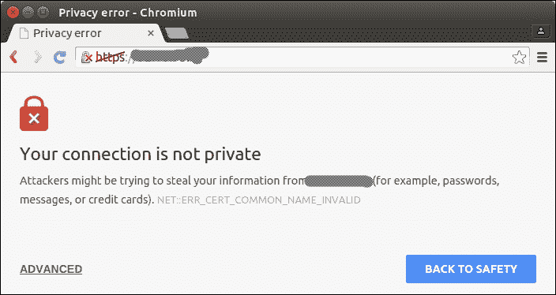
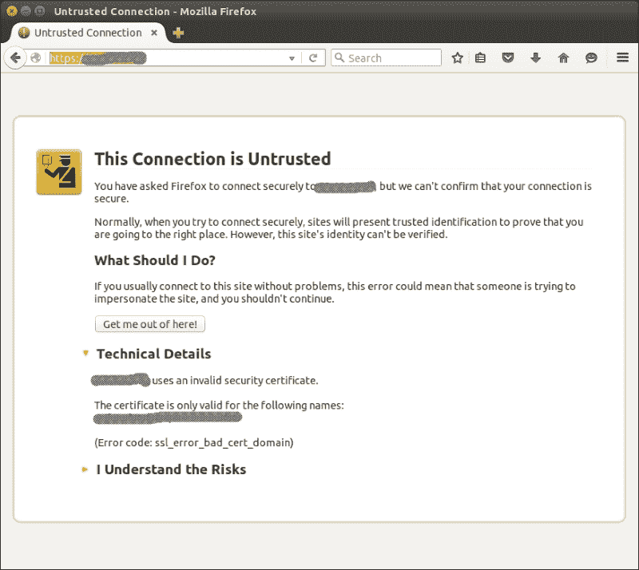
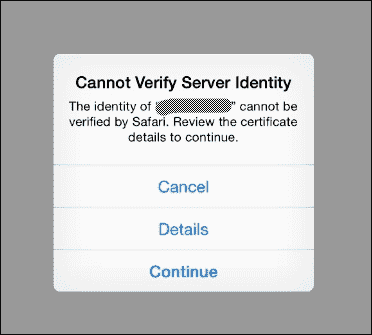
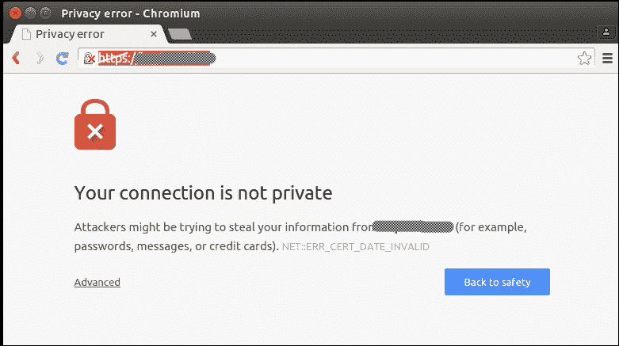
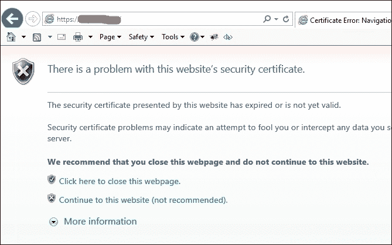
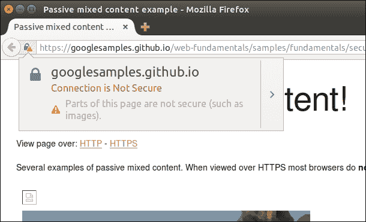
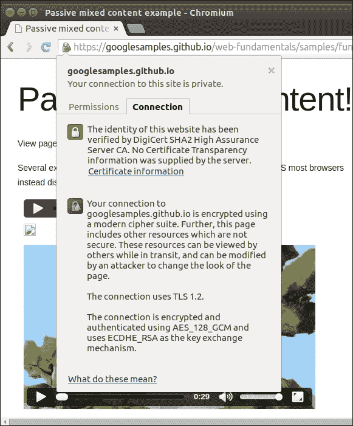
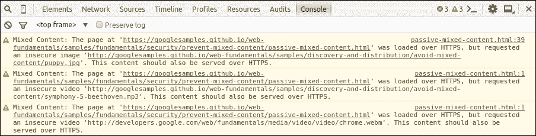

# 第五章 排查罕见的特定问题

你可能遇到的与 Nginx 或任何其他复杂软件（或任何其他人类事业）相关的最有趣的问题，通常都属于“杂项”类别。这个让人头痛的问题类别包括了所有不属于你作为读者和专业人士在前几章花费时间和精力探讨的其他方便类别的内容。Nginx 以其稳定性和可靠性而闻名，因此你在职业生涯中可能永远不会遇到我们在这里描述的任何问题。不过，本着“未雨绸缪”的精神，我们强烈建议你阅读本章，以防万一。

本章将介绍以下主题：

+   用户在你的网站上可能遇到的不同安全警告以及如何修复它们

+   用户可能看到已更新的网页非常过时的几个原因，以及如何解决这种情况

+   一些有趣的配置问题，它们将帮助你更好地理解 Nginx 的内部工作原理以及如何解决它们

不管怎样，让我们从那些我们认为更常见、更容易修复的问题开始，然后再讨论那些不那么明显、更为复杂的问题。

# 安全警告

网络正在转向 HTTPS 这一事实是不争的事实。即使是在三到四年前，纯文本的 HTTP 也是一个完全正常的选择，除非你在构建银行接口。如今，在全球个性化和复杂攻击者的时代，网站正在慢慢采用完全加密。这样做有很多原因，深入讨论超出了本书的范围。你可以参考这篇文档 [`www.eff.org/encrypt-the-web-report`](https://www.eff.org/encrypt-the-web-report)。基本上，在未来 2-3 年里，HTTP 将成为事实上的废弃协议，而这将把我们带入一个充满 HTTPS 公钥基础设施问题的世界。HTTPS 依赖于 TLS，TLS 使用 X.509 PKI，涉及 CA、CRL、OSCP 等等。前一句话中的缩写故意较多；这是一个复杂的主题，常常让经验最丰富的专家也感到困惑。X.509 密钥和证书基础设施的设计已知非常复杂，但它解决的任务也并不简单。一个最近有趣的简化解决方案的倡议是 **Let's Encrypt** 项目，网址为 [`letsencrypt.org`](https://letsencrypt.org)。他们宣称是免费的证书提供商（在 X.509 术语中是认证机构，或 CA），但他们还提供一套协议、服务和工具，允许无痛且透明的证书管理。截至 2016 年 3 月，他们还没有完全投入运营，因此请关注这个领域的动态。

在 Nginx 上设置 HTTPS 是一个在许多文章和书籍中都有详细描述的主题，因此我们不会花太多时间讨论这个话题。你可能已经做过好几次了。

在某些情况下，当访问者请求你网站的页面时，他们可能会遇到与 HTTPS 相关的安全警告。

假设在你的网站配置中有如下内容：

```
        listen 443 ssl;
        ssl_certificate "/site/example.com/conf/https_public_cert.pem";
        ssl_certificate_key "/site/example.com/conf/https_priv.key";
```

当 X.509 基础设施在 1980 年代末期被发明时，它试图解决的任务之一是确保在安全通信通道中各方之间的相互认证和信任问题。虽然加密并不严格要求这种认证，但仍然认为重要的是你的浏览器能够信任加密的 HTTPS 连接另一端的服务器，至少从服务器提供某种不可否认的证明它是所声称的那样。这个证明的实现形式就是服务器在协商连接时展示的数字证书，以及客户端上的一些政策。有趣的是，如果你熟悉其他公钥基础设施（PKI）方案，例如 PGP/GPG，那么你可能会问，为什么 X.509 在必要的公私钥对（其实是实施非对称加密所必需的）之外，还需要一个额外的实体。其实，证书的作用就是作为第三方对服务器的证明，而密钥则是加密过程中使用的技术数据。类似于 PGP 的松散类比，证书就像是其他人签署的、你可能有也可能没有的密钥签名。

## 域名不匹配

HTTPS 服务器最常用的证书是**域名验证**（**DV**）类型，而客户端对连接到具有 DV 证书的服务器施行的最重要政策是证书中提到的域名必须与实际 TCP 连接端点的域名相匹配。

这个政策的问题表现为这些可怕的全屏错误：



前面提到的图像来自 Chromium，它是 Google Chrome 的基础开源浏览器。下一个示例来自 Firefox：



下一个示例来自 iOS 上的移动版 Safari：



这个问题的根源在于历史上的约定，即每个证书只能有一个完全限定的域名。如果你有别名（大多数网站通常至少有一对常见的—一个带“www.”，一个不带“www.”），你要么需要购买单独的证书，要么使用原始 X.509 的扩展。幸运的是，这些扩展得到了广泛支持；我们记得的最后问题出现在默认的 Windows Phone 7 浏览器上，如果你有大量这类客户端，你可能知道该怎么做，并且有资源通过专门的项目解决这个问题。

你需要的扩展功能是：通配符证书和多域证书或 SAN 证书。你的 HTTPS 证书供应商会提供这些证书。它们通常会稍微贵一些，但太有用，值得投资。通配符证书允许你为类似 `*.example.com` 的域名模式申请证书，而**主题备用名称**（**SANs**）是一种列举该证书有效的域名列表的方式。

## 过期证书

你可能遇到的下一个最常见的错误消息如下：



现在我们将以 Chromium 和 Microsoft Internet Explorer 为例展示错误：



iOS 和 Mobile Safari 选择了一种策略，对这两种最常见的错误消息显示相同的 HTTPS 错误信息。

数字证书过期的哲学其实很简单。因为证书是一个由第三方（即你的证书供应商或**证书颁发机构**（**CA**），在 X.509 术语中）验证的电子文档，证明某个人的身份，在没有第三方的情况下，它应该有一个过期日期，以确保对该身份进行定期重新评估。供应商会尽力提醒你证书的过期情况，但尽管如此，过期事件在实际操作中仍然发生得有些频繁。

对于任何负责 Web 服务器的系统管理员来说，这是一个非常尴尬的时刻。几乎和忘记续订域名委托一样尴尬（这种情况也经常发生）。大多数监控解决方案，无论是独立的还是托管的，都有一个用于监控证书过期的传感器。我们甚至找到了一个专门用于证书过期监控的工具，[`snitch.io/`](https://snitch.io/)，尽管我们还没有机会使用它。确保及时续订 TLS 证书的最可靠工具之一，令人惊讶的是，居然是 Google 日历。在每次收到新的证书文件后，养成一个习惯，即在过期日期前四周创建一个事件并设置提醒。这将为你节省很多麻烦，我们保证。

你可能会问，为什么有问题的证书会出现在生产环境中。嗯，大多数时候，生产环境中的证书并不会在开发和测试环境中使用，这与之前提到的老传统有关——每个证书只对应一个域名。因为这个限制已经过时，你可以将测试主机名包含在证书中，这样可以消除生产环境和测试环境（或阶段环境，取决于你的发布生命周期）之间的另一个差异。

## 有效证书的安全警告

现在有数百种不同的证书颁发机构（CA）；其中一些已经存在多年，而另一些则是新成立的。如果您有时间熟悉 X.509 PKI，您会知道客户端应该拥有每个颁发机构（即 CA）的根证书，且这些证书应存储在其受信存储中。否则，所有该 CA 颁发的服务器证书都将无效。在理想的世界里，所有用户的计算机和移动设备都会拥有一个非常更新的受信根证书列表。不幸的是，理想世界并不存在，您可能会面临实际问题——一些较保守的客户端浏览器可能会因为没有相关的 CA 根证书而认为您的 Web 服务器不安全。

为了解决这些问题，您的 CA 可能会提供自己的证书，您应该将其与自己的证书连接起来并将其作为证书集（或链）提供给客户端。这样做是有效的，因为 X.509 支持证书链来验证端点证书。您的证书将引用 CA 证书，如果提供的话，CA 证书将进一步引用客户端信任的根证书存储中的某个中间 CA 证书。

最简单的方法是使用一个简单的 `cat` 命令：

```
$ cat your_example_domain.pem CA.pem > certs.pem

```

然后，在您的 `ssl_certificate` 指令中指定此复合文件的路径。

## 混合内容警告

尽管我们之前展示的两种 HTTPS 问题是实际的错误，且 Web 浏览器会主动阻止用户绕过它们，但仍然有一些不太严重的问题可能会损害客户端的信任。

最常见且同时也是最难以捉摸的警告之一是所谓的“混合内容”警告。其理念是，任何 HTTPS 页面都不应该嵌入 HTTP 对象，因为页面的整体安全级别取决于其最不安全的组件。如果您有一个通过明文 HTTP 获取的图片对象，它可能会危及整个页面，甚至有时危及整个应用程序。所有现代浏览器都会对这种情况发出警告，尽管实际的界面实现可能有所不同。

这些是一些示例。第一个来自 Firefox 的桌面版本：



第二个示例来自 Chromium 的桌面版本：



另外，现代浏览器区分了主动内容和被动内容，前者包括脚本、活动对象（如 Flash）、样式表和整个外部文档（如 IFrames）。主动混合内容通常会被直接阻止，而被动混合内容则只会发出警告。W3C 关于“混合内容”有一个建议，其中包含了处理该问题的所有最佳实践和建议。你可以将其作为你对预期情况的指南。请参阅[`www.w3.org/TR/mixed-content/`](http://www.w3.org/TR/mixed-content/)。

将不安全的链接指向你自己的内容是开发人员显而易见的错误。他们应该永远不再使用带有`http:`协议的直接绝对链接。通过对所有文档和模板进行几次全局全文搜索，修复这个问题可能非常简单。只需确保所有的二级主机都可以通过 HTTPS 访问，并将链接中的`http://`更改为`https://`，或者如果你想通过使用巧妙的无协议 URL（schemeless）技巧节省每个链接的一些字节，也可以使用`//`。没有协议的 URL 如下所示：

```

```

这个方法利用了相对 URL 解析的一个很少使用但所有标准都要求的特性。这也是第二个名称“协议相对”的原因：带有两个斜杠的 URL 会继承基础文档的协议。有关更多信息，请参考 RFC3986 [`tools.ietf.org/html/rfc3986#section-4.2`](http://tools.ietf.org/html/rfc3986#section-4.2)。

### 注意

从长远来看，确保 HTTPS 可用并始终使用`https://`而不是`//`会更安全和实用。这是完全安全的，不会降低（本来就没有的）通过不安全的 HTTP 获取的文档的安全性。

作为一种解决方法（可能变成半永久性），你可以利用 Nginx 的功能帮助你的开发人员通过即时替换修改所有指向内部资源的链接。Nginx 源代码中包含一个名为`ngx_http_sub_module`的特殊模块，通常并不默认构建，尽管它依赖于你所在发行版中的 Nginx 包的作者。要检查它是否可用，请运行以下命令：

```
$ nginx -V 2>&1 | fgrep -c http_sub_module
1
$

```

如果你看到`1`，说明你的 Nginx 已与`sub_module`连接。否则，你需要使用`--with-http_sub_module`参数编译它。

这是你需要根据自己的情况修改的示例：

```
location /path {
    sub_filter_last_modified on;
    subs_filter_types text/css;
    sub_filter ' src="img/img.example.com'  ' src="https://img.example.com';
    sub_filter ' href="http://img.example.com'  ' href="https://img.example.com';
}
```

只有当你的 CSS 文件包含图像的绝对 URL 时，才需要使用带有`sub_filter_types`指令的第二行。这就像许多`sub_module`应用程序一样，是一种不太优雅的解决方法，但它至少可能解决你面临的一些立即问题。记得包括所有的资产主机。

您的网站可能包含两种主要来源的不安全外部内容。第一种包括外部追踪器、广告网络、评论系统等。在 2016 年，这些都已支持 HTTPS 网站。它们可能出现混合内容警告的唯一原因是嵌入代码不正确（例如，使用非常旧的代码）。

另一种不安全对象的来源是 **用户生成内容**（**UGC**）。如果您的网站允许用户发布一些数据，这些数据可能会在您的页面中显示出来，那么您可能会遇到这个问题。例子包括评论系统、博客、论坛、消息等。这种情况比看起来的要常见得多。

查找混合内容违规的罪魁祸首的一种方法是使用浏览器控制台。近期的浏览器会显示哪些对象是不安全的。也有一些工具可以爬取网站并识别不安全的嵌入内容，但这些工具可能不可靠，尤其是当你的网站较为复杂，且不容易被爬取时。例如，可以参考 [`www.whynopadlock.com/`](https://www.whynopadlock.com/) 或 [`www.jitbit.com/sslcheck/`](https://www.jitbit.com/sslcheck/)。



Mozilla 也提供了关于混合内容的一个很好的页面，欢迎参考：[`developer.mozilla.org/en-US/docs/Security/MixedContent`](https://developer.mozilla.org/en-US/docs/Security/MixedContent)。

虽然修复外部组件的嵌入代码相对简单，但处理用户生成内容（UGC）要困难得多。假设你提供了一种方式，让用户通过输入指向图片的 URL 来指定他们的头像。你不能仅仅将 URL 从 `http:` 改为 `https:`，因为这样可能会破坏链接。你无法确保所有远程主机都支持并将永远支持 HTTPS。为用户提供此类服务的唯一方法是通过代理自己提供所有远程内容。

这是一个重要的技巧，涉及一些不太常见的 Nginx 魔法，并且需要与您的开发团队合作，但最终您将拥有一个非常高效的外部内容代理。做好准备。

### 构建外部内容的安全代理

这里是一个简单但相对安全的外部图片代理示例。它可以轻松扩展到其他类型的内容。

Nginx 配置的相关部分如下：

```
server_name proxy.example.com;
location @1.gif {
  empty_gif;
}

location / {
  proxy_cache ext_images_cache;
  proxy_cache_valid 200 48h;
  proxy_cache_valid 301 302 304 404 1h;
  secure_link_secret "some-secret";
  if ($secure_link = "") {
    return 403;
  }
  set $proto "http";
  if ($uri ~ "/secure/")
  {
    set $proto "https";
  }
  image_filter_buffer 10M;
  image_filter test;
  proxy_connect_timeout 5;
  proxy_read_timeout 5;
  proxy_send_timeout 5;
  proxy_ignore_headers Expires Cache-Control X-Accel-Redirect X-Accel-Expires;
  proxy_intercept_errors on;
  proxy_pass $proto://$secure_link;
  error_page 301 302 401 403 404 415 500 501 502 503 504 505 =200 @1.gif;
  access_log /var/log/nginx/cache/access-secure.log proxy;
}
```

它使用了多个 Nginx 模块来实现如下资源：

`https://proxy.example.com/insecure/5f814704a38d9bc1915fd19fa0c7a00a/images.external.com/image.gif`

“不安全”前缀也可能看起来像“安全”，并编码原始 URL 的协议部分。当请求时，该 URL 将从本地缓存生成响应，或通过 HTTP 请求外部图片，将其缓存到本地并发送给客户端。

第一个命名的 location 块提供了一个回退，即一个空的 `1 x 1` 图像，我们将在所有无效请求中提供这个图像。

第二个大的 location 块锚定在 `/`，这是主配置。由于我们为代理配置了专用主机名，因此我们从根目录开始工作。首先声明了缓存和安全链接参数。在使用 `$secure_link` 变量的条件检查请求有效性后，我们计算原始的源 URL 模式或协议。我们使用 `/secure/` 作为 HTTPS 的前缀，任何其他前缀将表示简单的不安全 HTTP。

一些 `image_filter_*` 指令配置了图像过滤器，只检查前 10 兆字节。代理超时为我们提供了一个相对稳健的 HTTP 客户端。我们不希望在非常慢（或恶意地慢）服务器上无限期挂起，同时还要处理那些并不像每个人希望的那么快的服务器。

配置中有趣的部分是安全链接和图像过滤功能，分别使用了 `ngx_http_secure_link` 和 `ngx_http_image_filter` 模块。

图像过滤模块是两者中较简单的一个。它会对图像文件的内容进行若干启发式检查，以确保它确实是 GIF、PNG 或 JPEG 图像。这可以防止利用伪装成图像的特制响应所导致的旧版浏览器安全漏洞。更多信息请见[`nginx.org/en/docs/http/ngx_http_image_filter_module.html`](http://nginx.org/en/docs/http/ngx_http_image_filter_module.html)。

安全链接模块检查 URL 中的加密签名。其目的是，如果没有签名，你将创建一个对全世界开放的 HTTP 代理，这将成为各种恶意行为者的有用资源。签名应由你的开发团队在应用程序端生成。算法在模块文档中有描述，详见[`nginx.org/en/docs/http/ngx_http_secure_link_module.html`](http://nginx.org/en/docs/http/ngx_http_secure_link_module.html)。

该模块还有第二种更加安全的操作模式，它还会检查签名的有效期。我们建议你也实现这种模式，详情请见文档。前面提到的示例为了简洁起见，使用了最简单的模式。

这个代理并不是我们通常在生产环境中安装的最终解决方案，而是一个简单版本。例如，它没有正确处理重定向的图像。正如你从最后几行看到的那样，许多 HTTP 响应代码（包括那些负责重定向的 3xx 代码）被视为错误，并被重定向到一个空的 GIF。解决这个问题是 Nginx 配置中的一个不错的练习。

# 解决缓存问题

我们花了很多时间提供良好的缓存机制，即保存中间结果，并为相同请求提供已保存的副本，而不是从头开始重新计算。这只有在完美的世界中才能完美运行（例如，在一个纯函数的世界里，函数以及由此派生的 GET/HEAD HTTP 请求没有副作用）。在现实世界中，有时两个相同的请求会导致不同的响应。造成这种情况的原因有两个：前面提到的副作用，它们改变了状态，尽管 GET/HEAD 看似是幂等的，或者请求之间的等价关系存在缺陷。一个好的例子是，当响应依赖于墙时，忽略时间。

这种问题通常表现为抱怨在你的网站上看到过时版本的页面，或者看到属于其他用户的页面。虽然你在某种程度上可以容忍第一种情况（例如，作为性能的妥协），但第二种情况是一个重大问题，并且会阻碍你的业务运作。

寻找出现问题的缓存是一个涉及前一章讨论的两个方面的过程。缓存可能在 Nginx 内部发生，作为上游缓存指令的效果，也可能发生在离客户端更近的地方——无论是发起请求的浏览器，还是某个中间缓存代理。如今，客户端缓存的影响通常较小，因此最好首先关闭客户端缓存。你需要在所有作用域中使用此指令：

```
expires -1;
```

任何负值都有效。这指示 Nginx 在内容旁边发送 `Cache-Control: no-cache` HTTP 响应头。它将有效地破坏客户端缓存，但有一些注意事项。首先，当然我们无法直接控制这些缓存，它们可以自由地遵循现代 Web 标准。例如，它们可能会配置为忽略 `no-cache`，以不明智地尝试节省流量。作者个人调试过几次此类过度节俭的案例，简直是噩梦。其次，即使完全遵守标准的缓存也可能存在延迟，因为为了接收 `no-cache` 指令，它们需要联系源服务器，而它们正在积极避免这样做，而这正是缓存的核心目的。

这个故障排除过程的第二步是关闭 Nginx 上游缓存中的缓存。如前一章所解释的，每个 Nginx 上游都有一组指令，用于配置该特定上游连接的缓存机制。整个机制的主要开关是 `*_cache` 指令。在 `ngx_fastcgi` 上游的情况下，指令如下所示：

```
fastcgi_cache zone;
```

这里，`zone` 是所谓缓存区的标识符，它基本上是一个缓存配置或缓存配置文件的集合。要关闭缓存，你将使用固定的区域名称 `off`。

它将立即生效（此时常见的 `nginx -t` 和然后 `sudo service nginx reload` 或者你的发行版的类似命令应该已经非常熟悉了），但它也可能通过显著增加进入请求速率严重影响你的实际应用上游。请注意这一点。你可以通过智能使用 `*_cache_bypass` 或 `*_cache_valid` 指令来逐步采取较小的步骤来排除缓存问题。第一个提供了跳过完全缓存某些响应的方法，而第二个则是限制缓存条目年龄的快速脏方法。

`*_cache_valid` 指令不会覆盖通过上游应用程序的 HTTP 响应头设置的过期参数。因此，为了使其有效，你还需要首先使用 `*_ignore_headers` 指令移除这些头。

再次强调，这里的星号表示实际的上游类型；对于 FastCGI 上游，你将使用 `fastcgi_cache_valid` 和 `fastcgi_ignore_headers` 指令。一个简单的示例将如下所示：

```
fastcgi_ignore_headers "X-Accel-Expires" "Expires" "Cache-Control";
fastcgi_cache_valid 1m;
```

它将强制缓存所有响应 1 分钟。不幸的是，它也会缓存上游不希望被缓存的响应，因为在这种配置下，Nginx 也会忽略 `Cache-Control: no-cache`。请注意不要在生产环境中留下你的故障排除会话。

# 废弃页面和 VirtualBox

还有一个可能的问题表现为用户（或者更频繁地是开发人员）在 HTTP 响应中看到旧版本的网页。这是 VirtualBox 虚拟化软件的一个 bug，在开发虚拟化解决方案中非常流行（例如，使用 Vagrant 或者最近的 Otto）。VirtualBox 有一个名为“共享文件夹”的功能，允许它在一个客户机中拥有主机机器文件夹的副本。

这个 bug 是在 VirtualBox 内部处理 `sendfile()` Linux 内核系统调用时出现的。这个系统调用直接将文件复制到 TCP 套接字，避免额外不必要的内存复制，并为这个相当特定但非常流行的特殊情况提供所有可能的优化。你可以想象在许多 Nginx 工作负载中，这种情况是多么有效。即使它不只是提供本地静态文件，Nginx 缓存也可以非常高效地使用 `sendfile()`。

对 `sendfile()` 的支持是有条件的，可以使用以下指令关闭：

```
sendfile off;
```

如果你在 VirtualBox 内运行 Nginx 并且从共享文件夹中提供文件，则强烈推荐。

# Apache 迁移问题

Nginx 选择不复制的 Apache 特性之一是对所谓 `.htaccess` 文件的支持。这些文件最初是作为一种方便的方式，用于在虚拟主机环境中配置单独虚拟主机的访问控制，在这种环境中，客户端只能通过 `chroot`（通常通过 ftpd 调用）看到自己的子文件夹。其实现非常简单；这是一个自动包含的配置部分，Apache 会持续监控其变化。并非所有可能的 Apache 配置指令都允许出现在 `.htaccess` 中（但很多都可以，基本上是那些不需要重启的指令）。

这个功能曾被（滥）用作一种便捷的方法，将相关的 Web 服务器配置分发到网站或 Web 应用程序的源代码中。尽管这个想法仍然有效，但 Apache 实现的静默变更监控和透明重配置被认为设计不佳。因此，Nginx 建议显式地包含特定站点的配置文件，然后重新加载配置，而不是使用合适的 `.htaccess` 支持。

如果你的网站源目录包含一些 `.htaccess` 文件，那么你很可能需要手动将这些指令转换成主 `nginx.conf` 文件中的某个部分，或者转换成一个单独的文件，再从 `nginx.conf` 中包含该文件。

一个特殊的情况是 `.htaccess` 文件中 Apache `mod_rewrite` 指令的泛滥。这会在一般情况下给你带来麻烦，因为 Nginx 使用与 URL 重写功能完全不同的语言。一个特别棘手的情况是那些在正常工作负载中修改自己 `.htaccess` 中重写规则的 Web 应用程序。不幸的是，你要么需要为它们运行一个 Apache 实例，要么必须重新编写相关部分的代码。

这是一些旧版 Apache 重写规则的示例：

```
RewriteEngine on
RewriteCond %{HTTP_REFERER} !^$
RewriteCond %{HTTP_REFERER} !^http://(www\.)?example.com/.*$ [NC]
RewriteRule \.(gif|jpg|png)$ http://www.example.com/dummy.gif [R,L]
```

这里的想法是打破所谓的热链接——一种将图片直接嵌入到外部文档中的做法，而这个 Web 主机会发送字节，而没有实际用户访问。

相同的逻辑可以通过以下指令在 Nginx 中实现：

```
location ~ \.(jpe?g|png|gif)$ {
   if ($http_referer ~ "^$") {
       return 301 http://www.example.com/dummy.gif;
   }
   if ($http_referer !~ "^http://(www\.)?example\.com") {
       return 301 http://www.example.com/dummy.gif;
   }
}
```

尽管 Nginx 实际上包含一个用于引荐来源检查的特殊模块，但它以更加优雅的方式完成相同的工作。请参见以下内容：

```
    valid_referers none blocked example.com *.example.com;
    if ($invalid_referer) {
        return 301 http://www.example.com/dummy.gif;
    }
```

Apache `mod_rewrite` 规则的长链逻辑在 Nginx 中表现较差。你应该重新思考任务，并尝试使用 Nginx 提供的更优雅的方式来实现解决方案，例如 `try_files` 或特定模块。另见 [`nginx.org/en/docs/http/converting_rewrite_rules.html`](http://nginx.org/en/docs/http/converting_rewrite_rules.html)。

有一些工具可以帮助将静态的 Apache `mod_rewrite` 指令集转换为 Nginx 语法。在我们的实践中，它们都只有部分用处，最终总是需要人工修复。你可以查看 [`winginx.com/en/htaccess`](http://winginx.com/en/htaccess)。

顺便说一句，这个工具没有正确处理之前提到的 HTTP 引荐问题。

# 解决 WebSockets 的问题

**WebSockets**是一种现代协议，它允许 web 应用程序与服务器之间建立持久、双向、长时间的连接，类似于真实的 TCP 连接（实际上，它们在底层就是普通的 TCP 连接）。

WebSockets 使用特殊的 URL 方案 `ws://`（或用于安全连接的 `wss://`），如果你尝试从 Nginx 支持的服务器运行 WebSocket 开放的 web 应用程序，你会在浏览器的错误控制台看到它。

WebSockets 背后的理念与 Nginx 作为 Web 加速器的缓冲反向代理理念直接冲突。有关 Nginx 如何提高性能的详细介绍，请参见上一章。幸运的是，现代的 Nginx 已不仅仅是一个简单的反向代理。它提供了许多功能，即使没有缓冲和廉价的连接池，它也因 WebSockets 而变得不可或缺。自从 2013 年初发布的 1.3.13 版本以来，Nginx 就已特别支持在客户端和服务器之间创建持久的隧道连接，这一功能专门用于支持 WebSockets。

要启用将正常 HTTP 连接升级为 WebSocket，你需要执行以下操作：

```
    proxy_pass http://localhost:8080;
    proxy_http_version 1.1;
    proxy_set_header Upgrade $http_upgrade;
    proxy_set_header Connection "upgrade";
    proxy_read_timeout 1000s;
```

你应该理解，支持的引入没有增加任何新的指令。配置语言本身已经足够丰富来实现这一点。神奇的部分发生在客户端发送的 `Upgrade:` 头部和服务器返回的 `101 Switching Protocols` HTTP 响应码之间。

一个非常重要的参数是通过`proxy_read_timeout`方法指定的超时。1 分钟的默认值可能不足以满足你的（以及大多数其他）WebSocket 使用场景。浏览器应用程序与服务器之间的直接长时间连接的整个概念可能会因短暂的代理超时而受到影响。WebSocket 连接在长时间空闲的情况下是完全正常的，这也是为什么需要增加超时值的原因。另一种解决方案是实现连接双方之间的心跳或 ping。

# 显示文件上传进度条

从 web 浏览器向服务器上传文件是现代 web 应用程序中相当常见的功能。许多内容管理系统或发布系统允许用户上传图像并将其与文本内容一起使用，如下图所示：


下面是一个正在进行的网页上传示例。实现进度条的一个基本算法思想是，在一个 IFrame 中发起 POST 请求，然后轮询一个知名的 URL 来获取进度计数器。现代浏览器允许我们直接在客户端获取进度信息；这是 XMLHttpRequest Level 2 的一部分，约三年前标准化。仍然有很多旧版网页应用依赖于旧的方式。

所描述的方法只有在客户端到服务器端的 POST 请求与用户在界面中实际看到的上传速度相同的情况下才有效。问题在于 Nginx 会缓存长时间的 POST 请求，然后快速高效地将其推送到服务器端代码。进度轮询进程将无法获取任何进度，直到最后一刻，上传过程才会瞬间完成。

有几种解决方案。一种临时的解决方法是将需要显示进度的上传操作移到 Nginx 之外处理。也就是说，使用一个直接连接到互联网的后端服务器，将所有文件 POST 到该服务器，并从它那里获取进度。

更好的解决方案是投入一些资源，重新实现界面中的进度条部分，使用现代浏览器中可用的进度事件。JavaScript（配合 jQuery + jQuery Form 插件）代码看起来会像这样简单：

```
$(function() {
    var bar = $('.progress_bar');
    var percent = $('.percentage');
    var status = $('#status');

    $('form').ajaxForm({
        beforeSend: function() {
            status.empty();
            var percentVal = '0%';
            percent.html(percentVal);
            bar.width(percentVal);
        },
        uploadProgress: function(event, position, total, percentComplete) {
            var percentVal = percentComplete + '%';
            percent.html(percentVal);
            bar.width(percentVal);
        },
        complete: function(xhr) {
            status.html(xhr.responseText);
        }
    });
});
```

一种有点奇怪的折中方案是使用`nginx_uploadprogress`模块，它提供了自己的进度报告端点。示例配置将如下所示：

```
        location / {
            proxy_pass http://backend;
            track_uploads proxied 30s;
        }

        location ^~ /progress {
            report_uploads proxied;
        }
```

客户端需要标记所有发送到`/`位置的 POST 请求，使用一个特殊的头部或 GET 参数`X-Progress-ID`，该参数也可以用来通过`/progress`资源获取该上传过程的进度。

# 解决空闲上游的问题

我们花了很多篇幅介绍上游（upstreams）的概念。提醒一下，上游是指生成 HTTP 响应的实体，这些响应被 Nginx 发送给客户端。通常，一个上游包含多个（或至少一个）使用支持的协议（如 FastCGI 或普通 HTTP）的服务器。Nginx 使用复杂的客户端代码以透明的方式非常高效地代理客户端与上游之间的通信，同时优化空闲连接的数量和浪费的内存。Nginx 有多个算法来平衡客户端在上游块中所有成员之间的负载，其中一个算法已知会让毫无防备的网页管理员吃亏。

正在讨论的配置如下所示：

```
proxy_pass http://backend;

upstream backend {
    server server1.example.com;
    server server2.example.com;
    server server3.example.com;
    ip_hash;
}
```

第一行设置了通过代理将某个位置或整个服务器的请求转发到指定的上游。上述上游将在后面的块中进行配置。它由三台服务器和一个特殊的指令`ip_hash`组成，该指令在选择三台服务器中的一台时会启用一种算法，处理每个传入请求。

默认算法是所谓的加权轮询。在我们没有任何权重的简单配置中，轮询会按照顺序依次选择服务器，并在最后一台之后回到第一台。这是一个高效且简单的算法，能够以一种良好的方式平衡负载。它的一个显著缺点是，来自同一客户端的请求可能会在不同的上游服务器上处理，这有时并不好，例如，由于各个上游服务器的 RAM 缓存。指令`ip_hash`会关闭轮询，取而代之的是，服务器将根据从客户端的 IP 地址计算出的哈希值来选择。

其结果之一是，相同的客户端将始终与同一台服务器通信（除非该服务器宕机，在这种情况下，哈希值会指向另一台服务器，尽量减少对上游其他服务器的影响）。另一个结果是，你的客户端负载将仅根据客户端 IP 地址在服务器之间分配得一样均匀。通常，当负载足够大以至于需要适当的上游块和多台服务器时，客户端 IP 池已经足够大且多样化。有时 Nginx 前面还有另一个代理，所有传入的请求看起来都来自非常有限的地址集。在这种情况下，你可能会遇到一个微妙且难以调试的问题，这个问题可能会导致灾难，亦或不会。

如果你幸运的话，你会注意到上游服务器的负载非常不均衡。例如，如果这三台服务器中的一台完全空闲，尽管它没有问题，而且它很高兴地响应直接请求。

这里的快速简便的解决方法是移除`ip_hash`指令。正确的解决方案需要你使用`ngx_http_realip`模块，并为 IP 哈希算法提供更好的数据。这个思路是将真实的客户端 IP 地址保存到位于 Nginx 前面的代理的特殊 HTTP 请求头中，然后从那里获取，而不是使用传入 TCP 连接的真实端点地址。这个模块可能在你当前版本的 Nginx 中没有编译。

你还可以考虑其他一致性哈希策略。关于哈希的完整文档，请参考[`nginx.org/en/docs/http/ngx_http_upstream_module.html#hash`](http://nginx.org/en/docs/http/ngx_http_upstream_module.html#hash)。

# 总结

在本章中，我们为您提供了一些看似无关的案例，您可能会有机会面对这些问题，也可能不会。我们快速回顾了网站管理员遇到的最常见 SSL/TLS 证书问题，从最尴尬的证书过期开始，到为外部不安全内容构建完整的缓存代理。我们还描述了许多涉及缓存、URL 重写规则迁移、文件上传进度接口的案例，并以一个空闲上游的谜题作为结尾。下一章将专门讨论为您的 Nginx 服务器构建一个适当的监控系统。我们将从解决问题转向主动预防问题。
