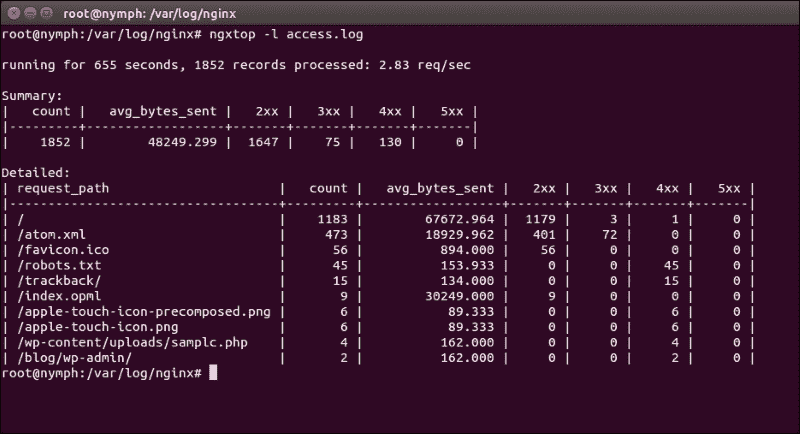
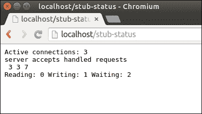
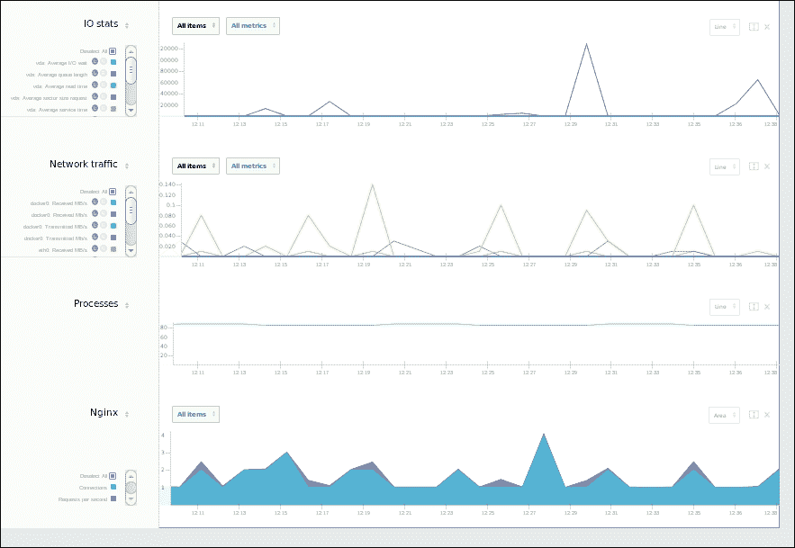
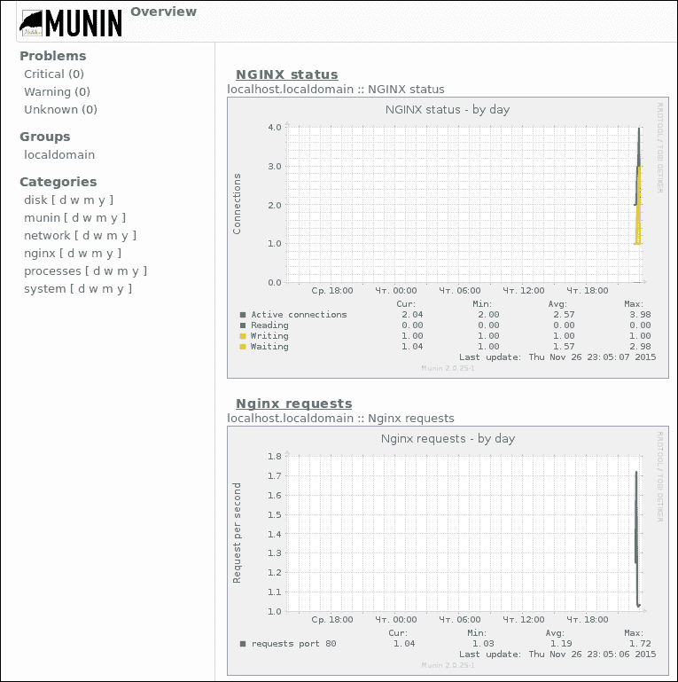
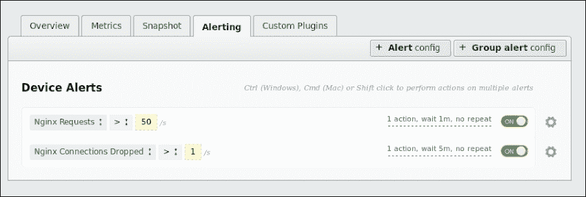
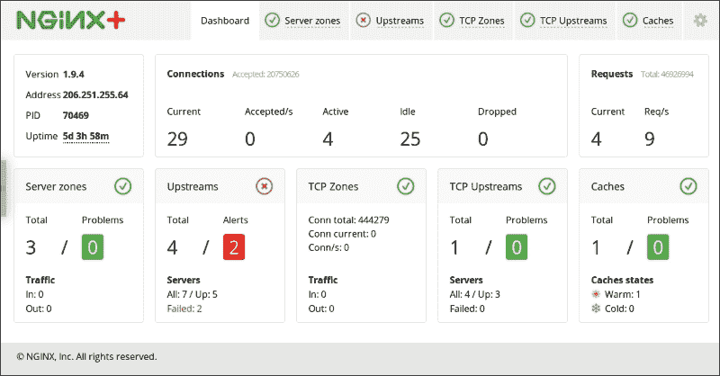

# 第六章：监控 Nginx

阅读本章后，你将能够利用 Nginx 基础发行版中自由提供的功能以及市场上几种流行的监控和报警系统，为你的 Nginx 安装设置合适的监控。

你还将了解一种高级的监控解决方案，它包含在 Nginx Plus 订阅包中，这是 Nginx 开发者作为商业服务出售的。

了解你的 Web 服务器发生了什么，是解决和预防问题的第一步。设置监控和报警是任何生产部署中的重要步骤，Nginx Web 服务器也不例外。经验丰富的 Web 管理员在没有实时性能和负载指标的洞察时，永远无法放松警惕。

Nginx 为你的监控系统提供了多个数据源。首先是日志，你可以根据个人需求进行配置。此外，Nginx 还提供了多个统计接口，您可以启用并连接到各种工业监控系统，包括免费的和商业的。日志子系统在第二章中有描述，*查找日志文件中的问题*，可以参考该章节获取更多信息。有一个特别的工具，它利用日志来进行在线监控和调试，应当提到。

# 使用 ngxtop

当 1984 年设计出著名的 Unix 工具 top(1)时，模仿了一个旧的 VMS 命令，它做的事情很相似，作者不太可能想到他实际上创造了一个适用于常规和紧急情况的在线系统管理工具的完整类别。从那时起，top 成为了一个必不可少的程序，许多其他工具也以相同的原则诞生——生成一个按特定标准排序的动态交互式*前 N 名*项目列表。还有`htop`、`iotop`、`mytop`、`pg_top`、`ntop`、`iftop`等许多工具。Nginx 生态系统也有自己的 top，名为`ngxtop`，并托管在[`github.com/lebinh/ngxtop`](https://github.com/lebinh/ngxtop)上。

推荐的安装 ngxtop 方式是使用 Python 包管理器`pip`。你的发行版可能默认没有安装`pip`，因此你可能需要先安装`pip`。在基于 Debian 的 Linux 发行版中，你通常可以通过以下命令设置：

```
$ sudo apt-get install python-pip

```

在 FreeBSD 系统中，你需要使用以下命令安装端口`devel/py-pip`：

```
$ cd /usr/ports/devel/py-pip
$ sudo make install

```

当`pip`可用时，你可以使用它安装实际的`ngxtop`：

```
$ sudo pip install ngxtop

```

你可以直接运行`ngxtop`，凭借一些启发式的判断，它将自动正确定位你的主 Nginx 日志。

这是`ngxtop`在一个简单且几乎闲置的网站访问日志中的默认输出：



输出中有两个表格。第一个表格显示的是摘要行。各列非常直观，最需要立即注意的是最右边的两列（标题为 4xx 和 5xx），它们包含了导致错误的 HTTP 请求的计数器。

第二个表格更有意思，因为它将所有传入请求按请求路径进行了分类。你可以立刻看到哪些路径产生了错误。例如，在前面的示例中，你会注意到网站缺少`robots.txt`文件以及特殊的高分辨率图标，这些图标最早由 iOS 使用。下表中的计数与上表中的相应计数不完全相等，因为发生频率最低的请求路径没有包含在内。

ngxtop 有几个强大的命令行选项，使它成为分析故障网站日志的最佳工具之一。例如，在第二章，*在日志文件中搜索问题*，我们描述了如何创建自定义日志格式，扩展了常见访问日志所提供的信息。ngxtop 能够接受日志格式定义，甚至可以直接从`nginx.conf`文件中解析。

自定义日志格式的命令行开关是`-f`。整个命令看起来会像这样：

```
$ ngxtop -f  '$remote_addr - $remote_user [$time_local] "$request" '

```

# 从 http_stub_status 获取统计数据

Nginx 基本发行版包含了一个简单的模块，提供对 Nginx 内部几个相当基础但非常有用的计数器的访问，这些计数器对于定期监控非常重要。这个模块名为`ngx_http_stub_status`，我们将描述如何在监控中使用它。

默认情况下，这个模块没有被编译。要检查你的 Nginx 发行版是否已编译了`stub_status`模块，你可以使用以下命令：

```
$ nginx -V 2>&1 | fgrep -c http_stub_status_module
1
$

```

如果你看到`1`，那么这个模块已经编译并链接到你的 Nginx 二进制文件中。否则，你需要在 Nginx 编译期间使用`--with-http_stub_status_module`参数编译它。

一旦你有了这个模块，你可以在`nginx.conf`中使用它的指令（实际上，只有一个指令）。这是`stub-status`共享的示例：

```
location /stub-status {
    stub_status;
}
```

这个模块属于所谓的内容生成模块家族，这些模块能够直接处理传入的 HTTP 请求并生成响应。另一类主要的模块家族是上游模块，它们是更复杂的内容生成器，通过外部资源获取实际数据以提供 HTTP 响应。虽然我们在之前的章节中花了大量时间解释上游模块，但由于内容生成模块相对简单，我们并没有过多关注它们。Nginx 发行版中包含的其他有趣的内容生成模块有`ngx_http_empty_gif`和`ngx_http_autoindex`。

上述配置将在收到 URI 为 `/stub-status` 的 GET 请求时生成一个原始的网页响应。你也可以使用其他 URI。该页面将包含几个计数器。我们来看一个示例，了解这些数字代表什么。重启后的全新 Web 服务器会生成以下页面：



这甚至不是一个真正的网页，而仅仅是一个纯文本 HTTP 响应，显然是为了被脚本处理而非供人查看：

```
$ curl -si http://localhost/stub-status | fgrep Content-Type
Content-Type: text/plain
$

```

让我们更深入地了解你在输出中看到的数值：

| 参数名称 | 描述 |
| --- | --- |
| 活跃连接数 | 这是当前正在处理的所有客户端连接的数量。每当成功执行 `accept()` 时，这个计数器就会增加，而每当执行 `close()` 时，它会减少。这个数字也将是“读取” + “写入” + “等待”的总和。 |
| 服务器接受的连接数 | 所有被 `accept()` 接受过的连接的全局不断增加计数器。 |
| 处理的连接数 | 所有已处理连接的计数器。大多数时候，这个数字与前一个相同，但有些连接在接受后立即关闭，这些连接不会被算作已处理连接。 |
| 请求数 | 这是该 Nginx 实例接收到的所有 HTTP 请求的全局计数器。由于“保持连接”（keep-alive），这个数值可能小于处理连接的计数器，因为保持连接可能在关闭前接收多个请求。 |
| 读取： | 这是当前正在读取 HTTP 请求头的所有连接的快照数。 |
| 写入： | 这是处于读取请求头后状态的连接数。这可能有点混淆，但正在读取请求体或与上游通信的连接也会计入这个数字。 |
| 等待： | 这是所有“保持连接”中等待来自同一连接客户端的下一个请求的计数器。 |

这些计数器中的大多数也作为 Nginx 变量可用，可以在 `log_format` 配置中使用。该模块导出了这些变量：

+   `$connections_active`

+   `$connections_reading`

+   `$connections_writing`

+   `$connections_waiting`

连接数和请求数的全局计数可以通过日志恢复，而无需任何额外的变量。

这个模块的唯一指令是 `stub_status`，它的使用模式从之前的示例中可以看出。你可以在其中一个作用域内指定它；最有可能的是，你会选择一个位置（location）。旧版本的 Nginx 可能要求你为此指令指定类似 `ok` 或 `1` 的参数。

虽然最简单的状态内容生成器可能只包含一行该指令，但强烈建议做一些额外的配置。

这是 `stub_status` 配置的实际工作示例：

```
location /stub-status {
stub_status;  
    access_log   off;
    allow   $monitoring_ip;
    deny    all;
}
```

`access_log off`指令将关闭此位置的日志记录。调试时，您可能希望注释掉此指令，但最终，只有您的监控系统会从预定义的 IP 地址和预定义的时间间隔向此路径发出请求。记录这种常规的 GET 请求-响应对在日志中充斥冗余信息并不会非常有用。

第三行和第四行涉及访问控制。虽然`stub_status`不会共享特别机密的信息，但它仍然可能对竞争对手或有恶意意图的攻击者有所价值，尤其是那些计划攻击您的基础设施的人。遵循默认不共享任何信息的黄金法则在这里同样适用。

为了充分理解如何使用数据，首先让我们编写一个简单的手动告警脚本，使用 cron 来定时执行。举个例子，我们将任务指定为：每分钟检查一次请求速率，如果每分钟的请求速率超过某个预设的阈值，则告警管理员。

检查的代码稍后给出。这是一个简单的 Perl 脚本，应通过 crontab 调用，时间设置为`*/1 * * * *`，意味着每分钟运行一次。它使用`PushBullet`服务来发送告警。`PushBullet`允许移动应用和浏览器扩展接收这些通知，并提供一个简单的 HTTP API：

```
#! /usr/bin/perl
use strict;
use warnings;

use autodie;
use LWP::Simple;
use WWW::PushBullet;

my $stub_status_url = 'http://localhost/stub-status';
my $threshold = 2000; # requests per minute

my $data_file = '/var/run/req-rate';
my $pb = WWW::PushBullet->new( {
    apikey => '...PushBullet API key...',
});

BEGIN {
    # For LWP inside PushBullet
    $ENV{PERL_NET_HTTPS_SSL_SOCKET_CLASS} = 'Net::SSL';
}

open my $fh, '+<', $data_file;
my ($prev, $prev_ts) = split ' ', scalar <$fh>;

my $reqs;
if (get($stub_status_url) =~ /(\d+)\s+Reading: /s) {
    $reqs = $1;
}

my $now = time();

if ($prev && $reqs) {
    my $rate = ($reqs - $prev) / ($now - $prev_ts) * 60;
    if ($rate > $threshold) {
        $pb->push_note({ title => 'req rate alert', body => "Requests per minute: $rate" });
    }
}

seek $fh, 0, 0;
truncate $fh, 0;

say $fh "$reqs $now";
```

脚本通过简单的正则表达式解析`ngx_http_stub_status`模块的输出，并将全局请求计数器与之前保存的值进行比较。如果计数器的增加量除以经过的时间超过一个常数，则发送告警。这是所有监控和告警系统使用的模型。

我们的下一步是使用此模块中的数据作为多个市场上可用监控系统的传感器。大多数系统允许显示所有可用计数器的综合图表，还可以根据事件（例如某个值超过预定阈值）设置自定义告警。

| 监控系统 | Nginx 支持插件 |
| --- | --- |
| Nagios | [`exchange.nagios.org/directory/Plugins/Web-Servers/nginx`](https://exchange.nagios.org/directory/Plugins/Web-Servers/nginx) |
| Zabbix | [`github.com/zbal/zabbix/blob/master/scripts/zabbix_nginx_check.sh`](https://github.com/zbal/zabbix/blob/master/scripts/zabbix_nginx_check.sh) |
| ZTC | [`bitbucket.org/rvs/ztc/wiki/Home`](https://bitbucket.org/rvs/ztc/wiki/Home) |
| Munin | [`github.com/munin-monitoring/contrib/tree/master/plugins/nginx`](https://github.com/munin-monitoring/contrib/tree/master/plugins/nginx) |
| Cacti | [`forums.cacti.net/download/file.php?id=12676`](http://forums.cacti.net/download/file.php?id=12676) |
| Collectd | [`collectd.org/wiki/index.php/Plugin:nginx`](https://collectd.org/wiki/index.php/Plugin:nginx) |
| OpenNMS | [`www.opennms.org/wiki/Monitoring_Nginx_with_the_HTTP_collector`](http://www.opennms.org/wiki/Monitoring_Nginx_with_the_HTTP_collector) |

许多托管的监控解决方案，如 DataDog、Scout、New Relic 或 ServerDensity，也支持从 Nginx `http_stub_status` 模块收集数据。

这是 ServerDensity 如何展示从 Nginx 获取的数据：



前面提到的图表将只包含两个实体：当前的客户端连接和每秒请求数。你会注意到，这两个数据非常接近，意味着没有或只有很少的 keep-alive 连接能够处理超过一个请求。

# 使用 Munin 监控 Nginx

**Munin** 是一个免费的网络和基础设施监控系统。我们选择它是因为配置简单，且可以帮助我们演示原理。你肯定会更喜欢使用你在其他需求中使用的相同监控解决方案。如果你目前没有使用任何监控工具，虽然这不太可能，但 Munin 是一个和其他监控工具一样好的起步选择。

Munin 的开发考虑到了通过插件轻松扩展的需求。它使用著名的 RRDTool 时间序列数据库，该数据库最初作为 MRTG 的一部分开发，但后来成为许多其他免费和开源软件的时间序列数据库和基于时间的图表引擎。

安装 Munin 并不像我们希望的那样简单，但这个过程在 Munin 在线指南中有详细描述：[`guide.munin-monitoring.org/en/latest/installation/index.html`](http://guide.munin-monitoring.org/en/latest/installation/index.html)。另外，*Packt Publishing* 出版了一本关于 Munin 的书，名为 *Instant Munin Plugin Starter*。这本书可能有些过时，但仍包含足够的相关信息。

Munin 也是其中一个监控系统，拥有用于解析 Nginx `http_stub_status` 模块输出的插件。这些插件在 Munin 安装后即可使用，并且在 Munin 的发布周期中会得到支持。

许多网络监控系统的架构与经典的星型拓扑系统非常相似，系统中有一个主机负责绘制图表、监控事件，并根据代理提供的数据发出警报，每个代理代表一个主机或服务。Munin 代理被称为节点，安装 Munin 通常会在同一主机上安装 Munin 节点实例。这完全没问题，因为监控系统的主机本身也应该被监控。节点组件与不同的软件集成，以获取应当监控的指标。Munin 的 Nginx 插件是可执行脚本，作为 Munin 节点操作的一部分运行。节点进程将这些（以及所有其他）插件的数据报告给 Munin 主机，后者提供管理员使用的接口。

在成功安装 Munin 后，你会在`/usr/share/munin/plugins`或根据你的发行版可能存在的其他目录中找到所有标准插件。在 Munin 2.0.25 中，有两个标准的 Nginx 插件——`nginx_requests`和`nginx_status`。这两个插件解析`http_stub_status` Nginx 模块的输出，因此需要将`url`环境变量指向`stub_status`输出 URL，默认值为`http://localhost/nginx_status`。要启用这些插件，你需要使用以下命令将它们链接到`/etc/munin`：

```
$ sudo ln -s /usr/share/munin/plugins/nginx_* /etc/munin/plugins/

```

你还可以查看`contrib` Nginx 插件，访问链接：[`github.com/munin-monitoring/contrib/tree/master/plugins/nginx`](https://github.com/munin-monitoring/contrib/tree/master/plugins/nginx)。这些插件默认未安装，但它们仍然是 Munin 源代码树的一部分。

在重新启动运行 Munin 节点的主机后，Nginx 报告的指标会立即可用。要检查插件是否能够成功访问 Nginx 并解析其`stub_status`，你可以使用以下方便的命令：

```
$ sudo munin-run nginx_request
request.value 15
$ sudo munin-run nginx_status
total.value 2
reading.value 0
writing.value 1
waiting.value 1
$
```

假设你的 Munin 主节点和节点正在运行，你将立刻看到 Nginx 指标的更新图表。一个没有任何历史数据的清洁 Munin 将显示如下内容：



向 Munin 主节点添加更多主机是完全透明的，只要这些主机运行带有 Nginx 插件的节点。所有报告的指标将立即显示，并与限制值进行比较，这也引出了下一个主题。

# 配置警报

尽管监控本身是一个非常广泛的术语，并且作为一项工作可能涉及许多活动，但从本质上讲，Web 服务监控包括两个方面。从传感器获取图形数据是非常重要的，它可以作为一个工具，帮助根据明显的趋势做出战略决策，同时也能用于事后调查，有时甚至作为取证工具。另一个方面是报警，它可以帮助管理员尽快对事件作出反应，从而防止对业务产生影响。所有主要的监控解决方案都包括报警子系统，甚至我们在本章早些时候构建的简单监控脚本，也基本上是一个简单的报警工具。

`http_stub_status`模块提供的信息有限，但它仍然可以用来快速应对事件。这些是一些可以用来检测需要立即关注的异常情况的良好值：

+   传入请求率是衡量网站负载的全球性指标。突如其来的激增表示流行度飙升，这可能是危险的，或者是**拒绝服务**（**DoS**）攻击，这种攻击始终是危险的。突然的下降可能意味着故障，甚至是完全崩溃。

+   高数量的丢失连接可能表示配置无法承受负载。除非由于资源不足或者更常见的情况——达到了资源限制，Nginx 不会丢弃连接。

+   活跃的（包括等待中的）连接数量有时可能意味着恶意攻击者尝试耗尽你的连接限制。这正是 Nginx 通常能够自我防御的内容，无需外部帮助，但监控并调查这些事件仍然很重要。

你可以使用这三种复杂的警报条件，并根据你的特定业务需求发明更多相关的度量指标。创建此类警报的方法取决于你选择的监控系统。这些是我们在 ServerDensity 中使用的示例警报：



+   Munin 使用一个简单的两级阈值系统，附加到插件上作为生成警报的方式。系统包含“警告”和“严重”阈值，一旦实际值达到其中一个阈值，Munin 就会生成警报并发送通知。该系统允许为所有主机设置默认阈值，这可能非常实用。

+   更常见的做法是为所有主机单独设置阈值。这是通过 Munin 主配置文件 `munin.conf` 来完成的。该文件包含所有由此主机监控的主机列表。为主机上的度量指标添加阈值就像这样简单：

    ```
    [www1.example.com]
        nginx_status.total.warning 0:10
        nginx_status.total.critical 0:20
    ```

    这些值是以范围的形式指定的；也就是说，在前面的例子中，只有当`nginx.status.total`度量值（即当前连接的总数）离开 0 到 10 的范围时，才会生成警报。

    Munin 能通过电子邮件、syslog、管道传输到外部程序，或者通过 Nagios（另一种流行的监控系统，拥有更复杂的警报子系统）发送关于警报的通知。通知设置的配置足够简单。请参见在线 Munin 指南：[`guide.munin-monitoring.org/en/latest/tutorial/alert.html`](http://guide.munin-monitoring.org/en/latest/tutorial/alert.html)。

+   所有有趣的度量指标可以在 Nginx 与客户端之间的前端以及 Nginx 由于上游配置而与每个外部链接之间进行测量。不幸的是，开源的 Nginx 没有提供任何暴露来自上游链接的度量指标来进行监控和设置警报的功能。

# 获取更多 Nginx 状态数据

在本节中，我们将探讨如何获取更多有关 Nginx 实例的信息，以便监控可以更广泛，并涵盖更多的细节。

在 2014 年，Nginx 的创始人推出了一个商业母公司，旨在支持开源的 Nginx 软件，并开始探索与服务器相关的商业模式。最受期待的功能之一是全面的监控，开发人员在这一方面做出了贡献。

Nginx 公司的商业产品被命名为 Nginx Plus。它是一种订阅服务，面向已经依赖 Nginx 作为基础设施的中大型企业。Nginx Plus 的定价基于每个实例的年度许可证，并且价格相当激进，这也意味着一旦你需要这些功能，你已经有了多个实例并需要多个许可证。有关完整且最新的信息，请参考 Nginx Plus 的网页 [`www.nginx.com/products/`](https://www.nginx.com/products/)。

订阅服务最重要的部分之一是新状态模块的可用性，它被命名为`ngx_http_status`，是开源的`ngx_http_stub_status`模块的“哥哥”，许多我们描述的监控解决方案都依赖于它。

除了程序化访问机器可读形式的状态数据外，Nginx Plus 还提供了一个美观且富有表现力的仪表盘，你可以在不进行任何集成的情况下使用它来监控。Nginx 团队在[`www.nginx.com`](https://www.nginx.com)上亲切地提供了仪表盘的演示，展示了它可以做什么，访问链接为[`demo.nginx.com/status.html`](http://demo.nginx.com/status.html)。



`ngx_http_status`模块的配置如下所示：

```
location /status {
    status;
}
```

正如你所见，这几乎是我们之前为`stub_status`所做操作的完整复制，但现在的主要指令被更恰当地命名为`status`。这个位置将接受多种不同的请求。它提供了关于不同对象的信息层次结构，如上游服务器和缓存区域。

内置的仪表盘实际上是一个单页 HTML 应用程序，它从`/status`获取所需的所有信息。静态 HTML 文件会随着 Nginx Plus 的发行版一起安装。在基于 Debian 的系统上，你可以在`/usr/share/nginx/html/status.html`找到它。要将仪表盘添加到你的 Nginx Plus 实例中，请参考以下配置示例：

```
location = /status.html {
    root /usr/share/nginx/html;
}
```

拥有自己的 Nginx 仪表盘永远不够，因为如果你投资了 Nginx Plus 订阅，你可能已经有了一些对业务至关重要的操作，并且需要自动化监控。同时，仪表盘是探索 Nginx Plus 导出信息的完美方式。`ngx_http_status`模块以机器可读的格式（JSON 或 JSONP）提供大量信息，方便与我们之前提到的所有系统集成。利用新的可用指标，你将能够进行更多的监控。让我们深入探讨`ngx_http_status`默认返回的内容：

```
$ curl http://localhost/status
{"version":6,"nginx_version":"1.9.4","address":"127.0.0.1","generation":4,"load_timestamp":1448573854895,"timestamp":1448573864361,"pid":3691,"processes":{"respawned":0},"connections":{"accepted":208,"dropped":0,"active":1,"idle":1},"ssl":{"handshakes":0,"handshakes_failed":0,"session_reuses":0},"requests":{"total":8309,"current":1},"server_zones":{"localhost_http":{"processing":1,"requests":12,"responses":{"1xx":0,"2xx":11,"3xx":0,"4xx":0,"5xx":0,"total":11},"discarded":0,"received":3305,"sent":7756}},"upstreams":{},"caches":{}}
$

```

正如你所见，这个模块的默认输出格式是 JSON，它允许更加复杂的数据结构。为便于阅读，相同的数据重新缩进后如下所示：

```
{
   "version":6,
   "nginx_version":"1.9.4",
   "address":"127.0.0.1",
   "generation":4,
   "load_timestamp":1448573854895,
   "timestamp":1448573864361,
   "pid":3691,
   "processes":{
      "respawned":0
   },
   "connections":{
      "accepted":208,
      "dropped":0,
      "active":1,
      "idle":1
   },
   "ssl":{
      "handshakes":0,
      "handshakes_failed":0,
      "session_reuses":0
   },
   "requests":{
      "total":8309,
      "current":1
   },
   "server_zones":{
      "localhost_http":{
         "processing":1,
         "requests":12,
         "responses":{
            "1xx":0,
            "2xx":11,
            "3xx":0,
            "4xx":0,
            "5xx":0,
            "total":11
         },
         "discarded":0,
         "received":3305,
         "sent":7756
      }
   },
   "upstreams":{ },
   "caches":{ }
}
```

在返回的 JSON 对象的上层，我们看到了这些项目：

| `version` | 这是这些数据格式的版本。对于解析器非常重要，因为某些项目只有在特定版本之后才会出现，可能需要升级 Nginx 才能为解析器提供足够的信息。到 2015 年 12 月为止，最后一个版本是 6。 |
| --- | --- |
| `nginx_version` | 这是 Nginx 软件的版本。 |
| `address` | 这是生成状态报告的服务器的 IP 地址。 |
| `generation` | 每次重新加载 Nginx 配置时，此值会增加 1。所以在某种意义上，这是当前配置版本的编号。有人可能会问为什么配置代号很重要。原因之一是，如果代号或配置已更改，可能不适合比较某些指标，例如性能。 |
| `load_timestamp` | 上次配置重载的 Unix 时间戳。 |
| `timestamp` | 当前的 UNIX 时间戳。 |
| `pid` | 处理此特定状态请求的工作进程的进程标识符。 |
| `processes` | 这是一个包含单一字段的对象（未来版本的响应结构可能会扩展），该字段名为 `respawned`，表示我们在故障后重启的所有子进程的数量。 |
| `connections` | 这是一个重要的对象，包含我们通过开源的 `ngx_http_stub_status` 模块可以获取的信息。 |
| `connections.accepted` | `connections` 对象中的这个值表示所有已接受的客户端连接的总数。 |
| `connections.dropped` | 这是掉线连接的总数。请注意，在 `http_stub_status` 模块中，我们需要自行计算此值。 |
| `connections.active` | 当前活动连接的数量。 |
| `connections.idle` | 空闲连接的数量。 |
| `ssl` | 这也是一个包含多个值的对象，这些值是 SSL（实际上是 TLS）计数器。SSL 是加密连接协议的旧版本。当前协议的正确名称是 TLS，但一些保守派专家仍然使用旧名称。 |
| `ssl.handshakes` | TLS 握手的总次数。 |
| `ssl.handshakes_failed` | TLS 握手失败的总次数。这是一个非常有趣且重要的值，通过 `http_stub_status` 无法获取，但对监控来说相当关键。 |
| `ssl.session_reuses` | 每次 TLS 握手都是一个开销较大的操作，优化方式是重用先前建立的 TLS 会话，从而完全避免重新握手。这里的低数字意味着可以通过少量投入来提高性能。 |
| `requests` | 一个包含两个值的对象。 |
| `requests.total` | 这是在 `http_stub_status` 输出的第三行最后显示的数字。所有客户端请求的全局计数器，表示通过所有连接接收的客户端请求总数。 |
| `requests.current` | 当前正在处理的请求数量。 |
| `upstreams` | 如果有一个 Nginx Plus 的重要功能，你可能想提及以证明购买的理由，那应该是 `http_status` 输出中的 upstreams 对象。它允许监控单个上游和上游内主机的度量数据。前面提到的示例主机没有配置任何上游，因此该对象为空。 |
| `caches` | 该对象包含所有配置缓存的状态。大多数缓存配置通过上游指令完成。 |
| `server_zones` | 该对象是一个自定义存储，你可以使用 `status_zone` 指令在某个服务器区块内填充数据。状态区域是 Nginx Plus 中的新概念。它们提供了收集状态数据的额外灵活性。你可以在 [`nginx.org/en/docs/http/ngx_http_status_module.html#status_zone`](http://nginx.org/en/docs/http/ngx_http_status_module.html#status_zone) 查找该指令的详细文档。 |

每个服务器区域包含一个独立的多层对象，该对象收集了所有连接到相同状态区域的服务器的状态信息。该对象如下所示：

| `processing` | 当前正在处理的请求的快照数量。 |
| --- | --- |
| `requests` | 所有请求的总计数。 |
| `responses.total` | 发送给客户端的响应数量。应接近请求的数量。 |
| `1xx` | HTTP 1xx 响应的数量。 |
| `2xx` | HTTP 2xx 响应的数量。 |
| `3xx` | HTTP 3xx 响应的数量（通常是重定向）。 |
| `4xx` | HTTP 4xx 响应的数量（通常表示请求错误，应该在客户端修复）。 |
| `5xx` | HTTP 5xx 响应的数量（表示内部服务器错误）。 |
| `discarded` | 没有生成响应的请求数量。 |
| `received` | 从客户端接收的总字节数。 |
| `sent` | 发送给客户端的总字节数。 |

# 使用 Nginx Plus 替代方案

Nginx Plus 商业订阅不仅仅提供`ngx_http_status`模块。如果你不需要 Plus 版本的其他附加功能，但渴望更多的度量数据，你可以探索一些免费提供的替代方案。

## nginx-module-vts

获取更多来自 Nginx 内部信息的一种方式是这个开源模块，该模块在 GitHub 上发布，网址是 [`github.com/vozlt/nginx-module-vts`](https://github.com/vozlt/nginx-module-vts)。

作者显然受到了官方`ngx_http_status`功能的启发，甚至使用了相同的结构和客户端仪表板代码（尽管是较旧的版本）。这实际上可能是件好事，因为你可以先开始集成`nginx-module-vts`，然后在准备好订阅时将所有脚本通过最小修改迁移到 Nginx Plus。文档非常出色，并且有很多示例。该模块返回的 JSON 对象中的某些键与官方`ngx_http_status`的键不同，因此我们建议在监控配置文件中抽象出实际的键名。

## Luameter

另一个替代官方`ngx_http_status`的优秀选择是 Luameter 包，它是一个用 Lua 编写的脚本集合，集成了 Nginx，并使用`ngx_http_lua`模块。Lua 收集和导出的数据格式显然也受到了官方昂贵替代品的启发，因此你将能够轻松切换。

非常有用的`ngx_http_lua`模块的理念是让 Nginx 管理员在请求处理的不同阶段插入自定义的 Lua 代码片段。

Luameter 采用按需付费模式分发，因此并不是免费的。最低价格仅为 10 美元，相比 Nginx 商业版的售价，它非常便宜。有关 Luameter 的所有信息，请参考[`luameter.com/`](https://luameter.com/)。

## nginx-lua-stats

这是另一组用 Lua 编写的脚本。它可以单独使用，收集并导出有关生成的 HTTP 响应及其各种 HTTP 状态码的在线统计数据，但作为一个使用 Lua 钩子收集额外数据并报告数据的示例，它的价值更大。

代码已发布在 GitHub 上，地址是[`github.com/yandex-sysmon/nginx-lua-stats`](https://github.com/yandex-sysmon/nginx-lua-stats)。

`nginx-lua-stats`通过在日志记录阶段设置钩子来发挥作用，该钩子收集数据，然后在特定位置的内容生成阶段设置另一个钩子，能够实际生成包含收集的统计数据的完整 HTTP 响应。

以下是`nginx.conf`文件的相关部分：

```
 location /stat {
       content_by_lua_file 'show_stat.lua';
    }

    location /html {
      log_by_lua_file 'collect_stats.lua';
    }
```

对`/stat`位置的请求将返回收集的数据。第二个位置块安装了一个额外的日志处理程序，实际上是一个计数钩子。其效果是，所有对`/html`目录下文档的请求将在日志记录阶段触发`collect_stats.lua`脚本。

## tengine 中的 upsteam_check 模块

开源开发模型的众多优点之一是能够进行分叉（fork），即主软件的独立版本，这些版本包含原作者未接受的更改。有时，分叉会非常成功，甚至超越原版本。中国最大的网站之一——淘宝网有自己的 Nginx 分叉，名为 tengine。除了淘宝，许多大型网站也更倾向于使用 tengine 而非原始的 Nginx。Tengine 具有一些非常先进的上游管理和监控功能。

`upstream_check`模块允许我们为上游组中的所有主机指定一些自定义健康检查。这本身就是一个有趣的功能，但正是其次要特性使得该模块被提到在本章中。在一个位置内的指令`check_status`是一个内容生成器，例如我们在本章详细讨论过的官方模块中的`status`和`stub_status`。

该指令提供了以人类可读的 HTML、机器可读的 JSON 或甚至 CSV 格式报告上游组中不同主机的健康状况。

请参见配置和输出的示例：[`tengine.taobao.org/document_cn/http_upstream_check_cn.html`](http://tengine.taobao.org/document_cn/http_upstream_check_cn.html)。

## Catap 的 requests/sec 补丁

有一个针对非常老旧 Nginx 版本的补丁，它向`ngx_http_stub_status`输出添加了一个非常有趣的指标。这个指标是请求速率，否则只能通过从主总请求计数器中保存的过去状态来大致计算。

补丁可在[`catap.ru/patches/nginx/request_per_seconds.dpatch`](http://catap.ru/patches/nginx/request_per_seconds.dpatch)下载。

不幸的是，它不能干净地应用于现代的 Nginx 源码，因此你需要进行一些手动的冲突解决。

## Ustats 模块

还有另一段相当古老的代码，可能已经过时，也可能未被更新以适应现代的 Nginx。它叫做 Ustats，官方将其归类为“废弃软件”。这样的项目可能为某些内部开发提供起点。查看[`github.com/0xc0dec/ustats`](https://github.com/0xc0dec/ustats)获取代码，查看[`code.google.com/p/ustats/`](https://code.google.com/p/ustats/)获取一些文档。

# 摘要

在本章中，我们深入探讨了监控一个运行中的 Nginx 实例的不同方式。介绍了一个非常有用的命令行日志解析工具 ngxtop，以及两个实时统计接口，这些接口在开源版和商业版 Nginx 中都有提供。我们详细讨论了这些接口暴露的所有数据项，并讨论了与市场上许多监控系统的集成选项。

下一章将通过为读者提供未来的方向来结束整本书。它甚至可能看起来包含一些职业建议。还有一个附录，提供了所有你在使用 Nginx 时可能遇到的不同错误和警告的参考。
