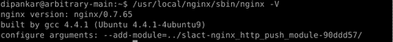
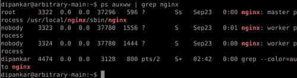
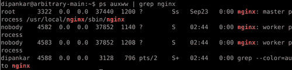
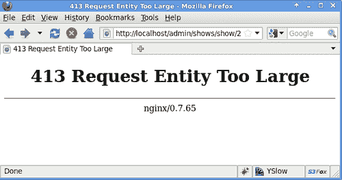
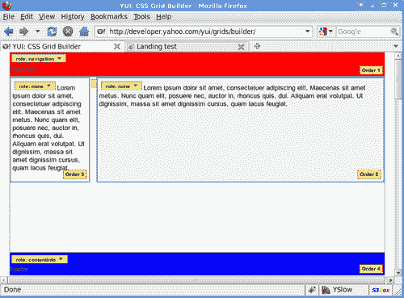
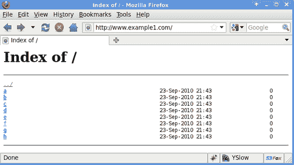

# 第一章. 核心 HTTP 模块

本章将涵盖：

+   安装新模块并编译 Nginx

+   以调试模式运行 Nginx

+   使用 CLI 轻松重新加载 Nginx

+   拆分配置文件以便更好的管理

+   设置多个虚拟主机

+   设置默认的 catch-all 虚拟主机

+   在虚拟主机中使用通配符

+   正确设置工作进程数

+   增加上传文件的大小

+   使用动态 SSI 处理简单站点

+   在特定页面前后添加内容

+   启用目录的自动索引

+   从目录中提供任何随机网页

+   提供 Cookie 用于识别和记录用户

+   将响应重新编码为另一种编码

+   为某些内容类型启用 Gzip 压缩

+   设置 404 和其他错误页面

# 介绍

本章介绍了 Nginx 配置和实现的基础知识。到本章结束时，您应该能够在您的机器上编译 Nginx，创建虚拟主机，设置用户跟踪，并让 PHP 正常工作。

# 安装新模块并编译 Nginx

如今，大多数软件都设计成模块化和可扩展的。Nginx 拥有一个庞大的社区，并提供了一系列很棒的模块，能够让它执行一些非常有趣的功能。虽然大多数操作系统发行版都在其软件库中提供了 Nginx 的二进制文件，但能够编译新的、前沿的模块并进行尝试是一个必要的技能。接下来我们将介绍如何编译和安装 Nginx 以及它的众多第三方模块。

## 如何操作...

1.  第一步是获取最新的 Nginx 发行版，以确保与安全性和性能补丁保持同步（[`sysoev.ru/nginx/nginx-0.7.67.tar.gz`](http://sysoev.ru/nginx/nginx-0.7.67.tar.gz)）。请注意，在某些安装步骤中，您可能需要 sudo 或 root 权限。

1.  解压 Nginx 源代码。这很简单，您只需输入以下命令：

    ```
    tar -xvzf nginx-0.7.67.tar.gz

    ```

1.  进入目录并进行配置。这一步很关键，因为在这里你可以启用或禁用 Nginx 自带的核心模块。以下是一个示例配置命令：

    ```
    ./configure - with-debug \
    --with-http_ssl_module \
    --with-http_realip_module \
    --with-http_ssl_module \
    --with-http_perl_module \
    --with-http_stub_status_module

    ```

    +   您可以了解更多关于其他模块和配置标志的信息：

    ```
    ./configure - help

    ```

1.  如果出现错误，您需要根据系统安装构建依赖项。例如，如果您使用的是 Debian 系统，可以输入以下命令：

    ```
    apt-get build-dep nginx

    ```

    +   这将安装所有必需的构建依赖项，如 PCRE 和 TLS 库。

1.  完成后，您可以继续构建它：

    ```
    sudo make install

    ```

1.  这就是普通的原始安装！如果您想安装一些新模块，我们以 HTTP 订阅发布模块为例：

1.  下载您的模块（[`pushmodule.slact.net/downloads/nginx_http_push_module-0.692.tar.gz`](http://pushmodule.slact.net/downloads/nginx_http_push_module-0.692.tar.gz)）。

1.  在某个位置解压：/path/to/module。

1.  重新配置 Nginx 安装：

    ```
    ./configure ..... --add-module=/path/to/module

    ```

    +   重要部分是将 add-module 标志指向正确的模块路径，其余部分由 Nginx 配置脚本处理。

1.  你可以继续按照第 5 步所示的方式构建和安装 Nginx。

```
sudo make install

```

如果你按照步骤 1 到 10 操作，那么安装任何 Nginx 模块将变得非常简单。

## 还有更多内容...

如果你想检查模块是否正确安装，可以输入以下命令：

```
nginx -V

```

示例输出如下所示：



这基本上会给你列出用于安装此特定 Nginx 二进制文件的编译标志，间接列出编译进该二进制文件的各种模块。

# 以调试模式运行 Nginx

Nginx 是一款相当稳定的软件，已经在生产环境中运行了十多年，并且围绕它建立了一个非常强大的开发者社区。但像所有软件一样，在最关键的情况下，也会出现一些问题和 bug。当这种情况发生时，通常最好重新加载 Nginx，并开启更高等级的错误日志记录，若可能的话，还应开启调试模式。

## 如何操作...

如果你想启用调试模式，那么你需要使用调试标志（--with-debug）编译 Nginx。在大多数情况下，很多发行版都有预编译了调试标志的 Nginx 包。以下是你可以利用的各种调试级别：

```
error_log LOGFILE [debug | info | notice | warn | error | crit | debug_core | debug_alloc | debug_mutex | debug_event | debug_http | debug_imap];

```

### 提示

**下载示例代码**

你可以从你在[`www.PacktPub.com`](http://www.PacktPub.com)的账户中下载所有你购买的 Packt 书籍的示例代码文件。如果你在其他地方购买了本书，可以访问[`www.PacktPub.com/support`](http://www.PacktPub.com/support)并注册，直接通过电子邮件将文件发送给你。

如果没有设置错误日志的位置，它将记录到一个编译时默认的日志位置。这个日志记录是除了你可以针对每个站点进行的常规错误日志记录之外的额外记录。以下是各种具体调试标志的作用：

| 标志 | 应用程序 |
| --- | --- |
| `debug_core` | 在 Nginx 崩溃时允许你转储核心文件 |
| `debug_alloc` | 记录所有内存分配警告和错误 |
| `debug_mutex` | 记录潜在的互斥问题 |
| `debug_event` | 记录事件模块问题 |
| `debug_http` | 这是默认的 HTTP 日志记录 |
| `debug_imap` | 这是默认的 IMAP 日志记录 |

## 还有更多内容...

Nginx 允许我们为特定的 IP 地址记录错误。以下是一个示例配置，它将记录来自`192.168.1.1`和`192.168.10.0/24` IP 范围的错误：

```
error_log logs/error.log;
events {
debug_connection 192.168.1.1;
debug_connection 192.168.10.0/24;
}

```

当你希望在生产环境中进行调试时，这个功能非常有用，因为记录所有情况的日志会带来不必要的性能开销。这个特性使你能够不在`error_log`上设置全局调试，同时根据用户的 IP 地址查看特定匹配的 IP 块的调试输出。

# 使用 CLI 轻松重新加载 Nginx

根据你所使用的系统，它将提供一种简洁的方式来重新加载你的 Nginx 设置

+   **基于 Debian：** `/etc/init.d/Nginx reload`

+   **基于 Fedora：** `service Nginx reload`

+   **FreeBSD/BSD：** `service Nginx reload`

+   **Windows：** `Nginx -s reload`

上述所有命令都会重新加载 Nginx；它们会向主 Nginx 进程发送 HUP 信号。你可以向 Nginx 主进程发送许多控制信号，具体见下表。这些信号帮助你管理一些基本的管理任务：

| 信号 | 活动 |
| --- | --- |
| TERM,INT | 快速关闭 |
| QUIT | 优雅地关闭 |
| HUP | 重新加载配置，优雅地关闭 worker 进程并重启它们 |
| USR1 | 重新打开日志文件 |
| USR2 | 升级可执行文件（已安装时） |
| WINCH | 优雅地关闭 worker 进程 |

## 如何操作...

让我带你通过简单的步骤，如何从命令行重新加载 Nginx。

1.  打开系统中的终端。大多数 UNIX 系统已经有相当强大的终端，而你可以在 Windows 系统上使用 PuTTY。

1.  输入 `ps auxww | grep nginx`。这将输出如下所示的内容：

    +   如果没有任何输出，则表示 Nginx 没有在你的系统上运行。

1.  如果你得到上述输出，那么你可以看到主进程和两个 worker 进程（根据你的 `worker_processes` 配置，可能会更多）。重要的数字是 `3322`，这基本上是主进程的 PID。

1.  要重新加载 Nginx，可以发出命令 `kill -HUP <Nginx 主进程的 PID>`。在这种情况下，主进程的 PID 是 `3322`。这基本上会重新读取配置文件，优雅地关闭当前连接，并启动新的 worker 进程。你可以再执行一次 `ps auxww | grep nginx` 来查看新的 worker 进程 PID（4582，4583）：

1.  如果 worker PIDs 没有变化，意味着在重新加载配置文件时可能出现了问题。你可以检查 Nginx 错误日志。

在编写控制 Nginx 配置的脚本时，这非常有用。一个好的例子是当你在生产环境中部署代码时，你会暂时将站点指向一个静态的登陆页面。

# 为了更好的管理，拆分配置文件

默认情况下，当你安装 Nginx 时，你会得到一个包含大量示例配置的单一配置文件。由于其极为模块化和强大的设计，Nginx 允许你将配置文件维护为一组多个关联的文件。

## 如何操作...

我们以一个示例配置文件 `nginx.conf` 为例，看看它是如何被拆分成逻辑上、易于维护的模块的：

```
user www www; #This directive determines the user and group of the processes started
worker_processes 2;
error_log logs/error.log;
pid logs/nginx.pid;
events {
worker_connections 1024;
}
http {
include mime.types;
default_type application/octet-stream;
gzip on;
gzip_min_length 5000;
gzip_buffers 4 8k;
gzip_types text/plain text/html text/css application/x-javascript text/xml application/xml application/xml+rss text/javascript;
gzip_proxied any;
gzip_comp_level 2;
ignore_invalid_headers on;
server {
listen 80;
server_name www.example1.com;
location / {
root /var/www/www.example1.com;
index index.php index.html index.htm;
}
location ~ \.php$ {
include conf/fcgi.conf;
fastcgi_pass 127.0.0.1:9000;
}
}
}

```

上述配置基本上是在 `http://www.example1.com` 提供一个简单的 PHP 网站，使用 FastCGI。现在我们可以继续将这个文件拆分成以下结构：

+   `nginx.conf:` 中央配置文件保持不变

+   `fcgi.conf:` 这将包含所有 FastCGI 配置

+   `sites-enabled/:` 该目录将包含所有启用的站点（类似于 Apache2 的 sites-enabled 目录）

+   `sites-available/:` 该目录将包含所有未启用但可用的网站（类似于 Apache2 的 sites-available 目录）

+   `sites-enabled/site1.conf:` 这是示例 PHP 站点的虚拟主机配置示例

以下是新的`nginx.conf`的代码：

```
user www www;
worker_processes 2;
error_log logs/error.log;
pid logs/nginx.pid;
events {
worker_connections 1024;
}
http {
include mime.types;
default_type application/octet-stream;
gzip on;
gzip_min_length 5000;
gzip_buffers 4 8k;
gzip_types text/plain text/html text/css application/x-javascript text/xml application/xml application/xml+rss text/javascript;
gzip_proxied any;
gzip_comp_level 2;
ignore_invalid_headers on;
includes sites-available/*;
}

```

如果你注意到，你会看到`includes`允许包含外部配置文件。需要注意的是，如果我们在任何文件中有错误，Nginx 服务器将无法重新加载。

这是该设置使用的 FastCGI 配置；通常大多数 Nginx 安装都会提供一个默认的配置。

以下是`fcgi.conf`的代码：

```
fastcgi_param QUERY_STRING $query_string;
fastcgi_param REQUEST_METHOD $request_method;
fastcgi_param CONTENT_TYPE $content_type;
fastcgi_param CONTENT_LENGTH $content_length;
fastcgi_param SCRIPT_NAME $fastcgi_script_name;
fastcgi_param REQUEST_URI $request_uri;
fastcgi_param DOCUMENT_URI $document_uri;
fastcgi_param DOCUMENT_ROOT $document_root;
fastcgi_param SERVER_PROTOCOL $server_protocol;
fastcgi_param GATEWAY_INTERFACE CGI/1.1;
fastcgi_param SERVER_SOFTWARE nginx/$nginx_version;
fastcgi_param REMOTE_ADDR $remote_addr;
fastcgi_param REMOTE_PORT $remote_port;
fastcgi_param SERVER_ADDR $server_addr;
fastcgi_param SERVER_PORT $server_port;
fastcgi_param SERVER_NAME $server_name;
fastcgi_index index.php ;
fastcgi_param SCRIPT_FILENAME $document_root$fastcgi_script_name ;
# PHP only, required if PHP was built with --enable-force-cgi-redirect
fastcgi_param REDIRECT_STATUS 200;
fastcgi_connect_timeout 60;
fastcgi_send_timeout 180;
fastcgi_read_timeout 180;
fastcgi_buffer_size 128k;
fastcgi_buffers 4 256k;
fastcgi_busy_buffers_size 256k;
fastcgi_temp_file_write_size 256k;
fastcgi_intercept_errors on;

```

以下是`sites-enabled/site1.conf`的代码：

```
server {
listen 80;
server_name www.example1.com;
location / {
root /var/www/www.example1.com;
index index.php index.html index.htm;
}
location ~ \.php$ {
include conf/fcgi.conf;
fastcgi_pass 127.0.0.1:9000;
}
}

```

这种文件排列方式实现了主配置和辅助配置的干净分离。它还促进了结构化思维，当你需要快速切换或部署站点时，这种思维方式非常有用。

我们将在其他章节中详细讨论你在这些文件中看到的各种配置。例如，`fcgi.conf`的内容在使用 FastCGI 让 PHP 与 Nginx 一起工作时会涉及到。

# 设置多个虚拟主机

通常任何 Web 服务器托管一个或多个域名，而 Nginx 作为一个优秀的 Web 服务器，允许你轻松配置任意数量的虚拟主机。

## 如何操作...

让我们来看一个简单的例子。你想在[www.example1.com](http://www.example1.com)上设置一组简单的网页。以下是需要放入`sites-enabled/site1.conf`中的示例配置：

```
server {
listen 80;
server_name www.example1.com example1.com;
access_log /var/log/Nginx/example1.com/access.log;
error_log /var/log/Nginx/example1.com/error.log;
location / {
root /var/www/www.example1.com;
index index.html index.htm;
}
}

```

## 它是如何工作的...

那么我们来看看它是如何工作的。`listen`定义了 Web 服务器监听的端口（在这个例子中是 80）！`server_name`让你轻松定义映射到此虚拟主机配置的域名。在其中，你可以开始定义虚拟主机的工作方式。在这个例子中，它从`/var/www/www.example1.com`目录提供一组 HTML 页面。

所以，当你重新加载 Nginx 配置时，假设你的 DNS 记录正确指向服务器，你应该能在访问网页地址时看到 HTML 页面加载（在这个例子中是[`www.example1.com)`](http://www.example1.com)）。

## 还有更多内容...

这里是快速入门的检查清单：

1.  创建一个包含 HTML 文件的简单目录。

1.  创建一个简单的配置文件，包含`www.example1.com`的虚拟主机配置。

1.  重新加载 Nginx。

1.  将你的 DNS 服务器指向正确运行 Nginx 的服务器。

1.  加载`www.example1.com`。

# 设置默认的 catch-all 虚拟主机

一旦你习惯了设置虚拟主机，你将遇到一个有很多域名指向同一 IP 的情况。除了这些域名外，你还会有 Web 服务器响应它所托管的 IP 地址，以及指向该 IP 的其他许多未使用的子域名。我们可以通过一个简单的示例来看这个问题，假设你有[`www.example1.com`](http://www.example1.com)指向 IP 地址，你已经配置了虚拟主机来处理域名[www.example1.com](http://www.example1.com)和[example1.com](http://example1.com)。在这种情况下，当用户输入`abc.example1.com`或 IP 地址时，Web 服务器将无法提供相关内容（无论是 404 还是其他促销页面）。

## 如何做……

对于像上述情况这样的情形，可以利用 Nginx 提供的默认通配符虚拟主机；这里是一个简单的示例，展示了这个默认的通配符虚拟主机如何服务一组简单的网页。

以下是`sites-enabled/default.conf`的代码：

```
server {
listen 80 default;
server_name _;
location / {
root /var/www/default;
index index.html index.htm;
}
}

```

## 它是如何工作的……

关键点是你正在监听默认端口，并且`server_name`设置为"_"，这是一种通配符机制。所以，每当用户输入一个没有定义虚拟主机的域名时，页面将从`/var/www/default`目录提供。

# 在虚拟主机中使用通配符

想象一个需要在子域上提供动态页面的应用程序！在这种情况下，你需要在 Nginx 中设置一个可以使用通配符的虚拟主机。Nginx 从一开始就被设计成处理这种场景。所以，让我们以我们最喜欢的例子[`www.example1.com`](http://www.example1.com)为例。假设你正在构建一个需要处理各种子域（如`a.example1.com`，`b.example1.com`等）的应用程序。以下配置将允许后台应用程序处理所有这些不同的子域。

## 如何做……

你需要在 DNS 条目上设置通配符。没有 DNS 条目，域名（和子域）永远无法解析到你的服务器 IP。以下是一个示例 DNS 条目，将域名`http://example1.com`指向 IP `69.9.64.11:`。

```
example1.com. IN A 69.9.64.11

```

一旦你了解了你的 DNS 如何工作，你可以将其添加到`nginx.conf`的 http 部分：

```
server {
listen 80;
server_name example1.com *.example1.com;
location / {
........
}
}

```

## 它是如何工作的……

需要注意的重要部分是，在这种情况下，你是使用相同的代码库来服务所有的子域名。我们还设置了虚拟主机来服务非 www 域名（例如 example1.com，它与[www.example1.com](http://www.example1.com)不同）。

所以，当你输入[a.example1.com](http://a.example1.com)时，你的 Web 应用程序会接收到[a.example1.com](http://a.example1.com)作为从 Web 服务器请求的域名，并根据情况处理 HTTP 响应。

# 正确设置工作进程的数量

像其他基于 UNIX 的服务器软件一样，Nginx 通过生成多个进程来工作，并允许对它们周围的各种参数进行配置。基本配置之一是生成的工作进程数！这是配置 Nginx 时最先需要设置的事项之一。

## 如何操作...

这个特定的配置可以在示例配置文件 `nginx.conf` 的顶部找到：

```
user www www;
worker_processes 5;
error_log logs/error.log;
pid logs/nginx.pid;
worker_rlimit_nofile 8192;
events {
worker_connections 4096;
}

```

在上述配置中，我们可以看到各种进程配置的工作方式。你首先设置进程运行的 UNIX 用户，然后设置 Nginx 需要生成的工作进程数，接下来是一些文件位置，用于记录错误和保存 PID（进程 ID）。

## 它是如何工作的...

默认情况下，`worker_processes` 设置为 2\. 在高性能环境中，这个设置非常关键，因为 Nginx 会基于以下原因使用它：

+   它使用 SMP（对称多处理），可以高效利用多核或多处理器系统，从而获得明显的性能提升。

+   它通过增加进程数来减少延迟，因为当工作进程被磁盘 I/O 阻塞时，延迟会降低。

+   当使用任何支持的事件类型时，它限制每个进程的连接数。一个工作进程的连接数不能超过 `worker_connections` 指令所指定的数量。

## 还有更多...

建议将 `worker_processes` 设置为服务器上可用的核心数。如果你知道 `worker_processes` 和 `worker_connections` 的值，那么就可以轻松计算出 Nginx 在当前设置下能处理的最大连接数。

*最大客户端数* = `worker_processes` * `worker_connections`

# 增加上传文件的大小

通常当你运行一个用户上传大量文件的网站时，你会发现当用户上传一个超过 1MB 的文件时，会收到 Nginx 错误，提示“请求实体过大”（413），如下图所示。我们将研究如何配置 Nginx 来处理更大的文件上传。



## 如何操作...

这一点由 Nginx 配置中的一个简单部分控制。你只需将其粘贴到 Nginx 配置中的服务器部分即可：

```
client_max_body_size 100M; # M stands for megabytes

```

上述配置允许你上传一个 100 兆字节的文件。超过这个大小，你将收到 413 错误。你可以将此设置为小于 Nginx 可用磁盘空间的任何值，主要原因是 Nginx 会先将文件下载到临时位置，然后再将其转发到后端应用程序。

## 还有更多...

Nginx 还允许我们控制与用户在 Web 应用程序上传文件相关的其他因素，比如在客户端连接较慢的情况下设置超时。一个慢速客户端可能会占用你应用程序的一个线程，从而可能拖慢应用程序的速度。这是所有大型多媒体用户驱动站点中都会遇到的问题，在这些站点上，消费者上传各种丰富的数据，如图片、文档、视频等。因此，设置较低的超时是明智的。

```
client_body_timeout 60; # parameter in seconds
client_body_buffer_size 8k;
client_header_timeout 60; # parameter in seconds
client_header_buffer_size 1k;

```

所以，这里前两个设置帮助你控制在请求体未在一次读取中接收到时的超时（基本上，如果服务器被查询但没有响应）。类似地，你也可以设置 HTTP 头的超时。下表列出了与客户端上传相关的各种指令和限制。

| 指令 | 用法 |
| --- | --- |
| `client_body_in_file_only` | 该指令强制 Nginx 总是将客户端请求体存储在临时磁盘文件中，即使文件大小为 0。文件将在请求完成时不会被移除。 |
| `client_body_in_single_buffer` | 该指令指定是否将整个请求体保存在单个客户端请求缓冲区中。 |
| `client_body_buffer_size` | 该指令指定客户端请求体缓冲区的大小。如果请求体大于缓冲区，则整个请求体或部分内容将写入临时文件。 |
| `client_body_temp_path` | 该指令指定存储请求体临时文件的目录。 |
| `client_body_timeout` | 该指令设置从客户端读取请求体的超时。 |
| `client_header_buffer_size` | 该指令设置客户端请求头的缓冲区大小。 |
| `client_header_timeout` | 该指令设置读取客户端请求头时的超时。 |
| `client_max_body_size` | 该指令指定客户端请求的最大接受体积，由请求头中的 Content-Length 行表示。 |

# 使用动态 SSI 来处理简单站点

随着现代功能全面的 Web 服务器的出现，大多数服务器都内置了服务器端包含（SSI）。Nginx 提供了简单的 SSI 支持，使你能够完成几乎所有基本的 Web 操作。

## 如何做到这一点...

让我们通过一个简单的例子开始理解如何使用它。

1.  将以下代码添加到 `nginx.conf` 文件中：

    ```
    server {
    …..
    location / {
    ssi on;
    root /var/www/www.example1.com;
    }
    }

    ```

1.  将以下代码添加到 `index.html` 文件中：

    ```
    <html>
    <body>
    <!--# block name="header_default" -->
    the header testing
    <!--# endblock -->
    <!--# include file="header.html" stub="header_default" →
    <!--# echo var="name" default="no" -->
    <!--# include file="footer.html"-->
    </body>
    </html>

    ```

1.  将以下代码添加到 `header.html` 文件中：

    ```
    <h2>Simple header</h2>

    ```

1.  将以下代码添加到 `footer.html` 文件中：

    ```
    <h2>Simple footer</h2>

    ```

### 如何运作...

这是一个简单的示例，我们可以看到，你可以简单地在较大的页面中包含一些局部内容，除此之外，你还可以在页面内创建块。因此，`<block>` 指令允许你创建静默块，这些块可以稍后包含，而 `<include>` 指令则用于从其他文件或 URL 端点中包含 HTML 部分。`<echo>` 指令用于输出来自 Nginx 上下文中的某些变量。

### 还有更多...

你可以将此功能应用于各种有趣的设置，场景包括：

+   你为不同浏览器类型提供不同的 HTML 块

+   你希望优化并加速某些常见网站块的加载

+   你想构建一个简单的网站，使用模板继承而无需安装任何其他脚本语言

## 在特定页面前后添加内容

今天，在我们访问的大多数网站中，网页结构通常被正式分为一组框。通常，所有网站都有一个静态的头部和脚部块。以下页面中，你可以看到 YUI 构建器生成这种页面的基本框架。

在这种情况下，Nginx 提供了一种非常有用的方法，在服务特定页面之前和之后添加内容。这将有助于你将各种块分开，并单独优化它们的性能。

让我们看一个示例页面：


所以在这里，我们想在内容之前插入头部块，然后附加脚部块：



### 如何实现…

该页面的示例配置如下所示：

```
server {
listen 80;
server_name www.example1.com;
location / {
add_before_body /red_block
add_after_body /blue_block;
...
}
location /red_block/ {
…
}
location /blue_block/ {
….
}
}

```

通过仅根据浏览器加载 CSS，它可以作为性能增强工具。有时你可能希望在不修改后端应用程序的情况下，迅速向头部或脚部添加一些内容。这为这种情况提供了一个简单的解决方法。

### 注意

该模块默认未安装，构建 Nginx 时需要启用它。

```
./configure with-http_addition_module

```

## 启用目录的自动索引

Nginx 内置了自动索引模块。任何找不到索引文件的请求都会路由到该模块。这类似于 Apache 显示的目录列表。

### 如何实现...

这是一个 Nginx 目录列表示例。当你希望在本地网络上共享一些文件时，这非常有用。要在任何目录上启动自动索引，你只需执行以下示例，并将其放置在 Nginx 配置文件的服务器部分：

```
server {
location 80;
server_name www.example1.com;
location / {
root /var/www/test;
autoindex on;
}
}

```

### 它是如何工作的...

这将仅在用户输入 `http://www.example1.com` 时启用自动索引。你还可以通过这种方式控制列表中的一些其他内容：

```
autoindex_exact_size off;

```

这将关闭精确的文件大小列出，仅显示估算大小。当你担心文件隐私问题时，这非常有用。

```
autoindex_localtime on;

```

这将表示文件的时间戳为本地服务器时间（默认是 GMT）：



这张图片显示了 Nginx 使用之前的配置自动生成的示例索引。你可以看到文件名、时间戳和文件大小作为三个数据列。

## 从目录中提供任意网页

最近有许多网站开始采用 A/B 测试方法来测试新页面。你可以在[`en.wikipedia.org/wiki/A/B_testing`](http://en.wikipedia.org/wiki/A/B_testing)了解更多关于 A/B 测试的历史以及采用这一方法成功的各家公司。在这个实践中，你有一组页面和一些指标（比如注册人数，或者某个特定元素的点击次数）。然后，你会让一些人随机访问这些页面，并获取他们在页面上的行为数据。这让你能够逐步改进页面及其元素。


Nginx 有一个功能，可以让你在无需编写任何代码的情况下运行自己的 A-B 测试。它允许你从目录中随机选择任何网页并显示。

### 如何操作...

让我们看看一个示例配置，需要放在 Nginx 配置的 HTTP 部分：

```
server {
listen 80;
server_name www.example1.com;
location / {
root /var/www/www.example1.com/test_index;
random_index on;
}
}

```

### 如何操作...

假设你在`/var/www/www.example1.com/test_index`目录下有一些文件。当你启用随机索引时，它会扫描该目录，然后随机选择一个文件来替代默认的`index.html`。唯一的例外是纯文件名。以点号（.）开头的整个文件名将不会成为可选文件的一部分。

所以这里有两个示例测试页面，头部稍有不同。注意 URL 是相同的。通过纯粹的统计方法，它可以帮助你判断最终用户是更倾向于点击红色链接还是蓝色链接：


上面的截图显示了在打开网站时显示的是`A.html`。打开这两个页面的概率是相等的，就像抛硬币一样，可能是正面或反面。


所以，作为 A-B 测试的一个例子，你可以设置一个`A.html`和一个`B.html`，它们会随机显示给用户。这将让你通过简单地分析 Nginx 访问日志，轻松地测量许多有趣的用户行为。

## 提供用于识别和记录用户的 Cookie

Nginx 具有一个有用的功能，用于提供 Cookie 来识别用户。在网站不想使用外部分析软件的情况下，这对于跟踪匿名用户行为非常有用。这个模块与 Apache2 中的`mod_uid`模块兼容，后者提供了类似的功能。

### 如何操作…

这是该模块的示例配置。它需要放在配置文件的服务器部分：

```
userid on;
userid_name uid;
userid_domain example1.com;
userid_path /;
userid_expires 365d;
userid_p3p 'policyref="/w3c/p3p.xml", CP="CUR ADM OUR NOR STA NID"';

```

### 如何操作...

现在让我们来看看并理解各种指令的含义。第一个 `userid` 指令启用此模块；第二个指令为将要在客户端写入的 cookie 分配一个名称。接下来的三个指令是需要的标准 cookie 信息（主域名、路径和过期时间）。最后一个指令使浏览器能够理解网站遵循的隐私做法。这是通过使用 P3P 协议完成的，该协议允许网站声明它们收集的用户信息的使用方式。它基本上是一个 XML 文件，允许你以编程方式显示隐私政策。以下代码是一个简单的配置示例，展示了如何定义一个在 4 个月后删除数据的政策：

```
<META >
<POLICY-REFERENCES>
<EXPIRY max-age="10000000"/><!-- about four months -->
</POLICY-REFERENCES>
</META>

```

这个 XML 放在服务器上将客观地定义网站的隐私政策，供来访的机器人或用户查看。

### 还有更多内容...

启用此模块后，在 Nginx 配置中会有一些变量可用，允许你做一些非常有趣的事情。你可以访问一些配置中的变量，如`$uid_got`、`$uid_set`。

这些可以用于编写有趣的重写规则。使用这些变量的一个简单应用是记录访问你网站的用户，然后通过解析日志来确定用户的跳出率。

## 将响应重新编码为另一种编码

文件编码是大多数网站的一个主要问题，很多时候数据库（大多数情况下是 MySQL）被配置为使用 Latin-1 编码，而不是广泛使用的 UTF-8 编码。Nginx 提供了一个简单的解决方案，可以动态更改网页编码，避免用户在你的网站上看到乱码。

### 如何实现...

你需要做的就是将以下内容放入 Nginx 配置的服务器部分：

```
charset windows-1251;
source_charset koi8-r;

```

### 它是如何工作的...

这基本上定义了源字符集是`koi8-r`。如果编码与字符集不同，则会进行重新编码。如果原始响应中已经存在 "Content-Type" 头部，则需要使用以下内容来覆盖并进行重新编码：

```
overrride_charset on;

```

### 还有更多内容...

你还可以通过定义字符映射来决定如何进行重新编码。一个简单的示例如下：

```
charset_map koi8-r windows-1251 {
C0 FE ; # small yu
C1 E0 ; # small a
C2 E1 ; # small b
C3 F6 ; # small ts
# ...
}

```

Nginx 让你做一些小巧的操作，可以让你的网站对最终用户更加易访问和可用。

## 对某些内容类型启用 Gzip 压缩

随着网络的发展，网页服务器和浏览器技术也得到了改善。近年来，随着消费者互联网市场的蓬勃发展，网页应用必须变得更加快速。

已经存在的压缩技术已经成熟，现在大多数网站都会对其提供的页面启用较高程度的压缩。作为最先进的技术，Nginx 提供了 Gzip 压缩，并允许有很多选项来进行配置。

### 如何实现...

你需要修改 Nginx 配置文件并添加以下指令：

```
http {
gzip on;
gzip_min_length 1000;
gzip_comp_level 6;
gzip_proxied expired no-cache no-store private auth;
gzip_types text/plain application/xml;
gzip_disable "MSIE [1-6]\.";
server {
….
}
}

```

### 它是如何工作的...

这个示例配置允许你为所有大于 1000 字节的页面启用 Gzip 压缩。设置这个限制是因为压缩技术在页面大小较小时性能会下降。你可以设置不同的 MIME 类型，以决定哪些文件需要进行压缩；这个示例仅压缩纯文本文件和 XML 文件。

旧版浏览器在使用这项功能时效果不佳，你可以根据浏览器类型禁用 Gzip。最有趣的设置之一是压缩级别，你需要在压缩和服务页面时所需的 CPU 时间与要花费的 CPU 时间之间做出选择（*这个数字越高，更多的 CPU 时间会花费在压缩和发送页面上*）。建议在这个设置上采取中庸之道；如果设置了此选项，客户端也会花费更多的 CPU 时间来解压页面。这个值的合理设置应该是六。

### 还有更多...

对于代理请求，`gzip_proxied` 实际上根据请求和响应允许或禁止压缩代理请求的响应。你可以使用以下参数：

| 参数 | 功能 |
| --- | --- |
| `off` | 禁用所有代理请求的压缩 |
| `expired` | 如果 `Expires` 头部阻止缓存，则启用压缩 |
| `no-cache` | 如果 `Cache-Control` 头部包含 `no-cache`，则启用压缩 |
| `no-store` | 如果 `Cache-Control` 头部包含 `no-store`，则启用压缩 |
| `private` | 如果 `Cache-Control` 头部包含 `private`，则启用压缩 |
| `no_last_modified` | 如果未设置 `Last-Modified`，则启用压缩 |
| `no_etag` | 如果没有 `ETag` 头部，则启用压缩 |
| `auth` | 如果有 `Authorization` 头部，则启用压缩 |
| `any` | 启用所有请求的压缩 |

所以在前面的示例中（expired `no-cache no-store private auth)`），显然当 `Expires` 头部阻止缓存时，启用压缩；当 `Cache-Control` 包含 `no-cache`、`no-store` 或 `private` 时，启用压缩；并且当存在 `Authorization` 头部时，也启用压缩。这提供了对如何将压缩传递到客户端浏览器的巨大控制。

## 设置 404 和其他错误页面

所有 Web 应用程序都有错误和缺失页面，而 Nginx 提供了简便的方法，确保在应用程序未正确响应时，最终用户依然能获得良好的体验。它成功地处理了所有 HTTP 错误，并使用默认页面优雅地通知用户出了点问题。

### 如何操作...

Nginx 允许你在错误页面上做一些有趣的事情。以下是一些示例配置，可以放在 HTTP 或服务器部分。

我们还将使用“@”前缀定义一个命名的位置。这些位置不会在任何请求的正常处理过程中使用，旨在仅处理内部重定向的请求。

```
location @fallback (
proxy_pass http://backend;
)
error_page 404 /404.html;
error_page 502 503 504 /50x.html;
error_page 403 http://example1.com/forbidden.html;
error_page 404 = @fallback;
error_page 404 =200 /.empty.gif;

```

### 它是如何工作的...

第一个示例让你将一个简单的 404 页面映射到一个简单的 HTML 页面。下一个示例则允许将各种应用错误代码映射到另一个通用的应用错误 HTML 页面。你还可以将错误页面映射到其他外部网站（`http://example1.com/forbidden.html`）。第四个示例允许将页面映射到另一个位置，定义为`@fallback`。最后一个示例很有意思，它实际上允许你将响应代码更改为 200（HTTP OK）。这在你的网站上有过多的 404 页面时非常有用，你可能不希望返回 404，而是返回一个 200，并附带一个非常小的 GIF 文件。

你可以非常有效地利用这一点，为终端用户提供更好的体验，当他们无意中遇到死链和应用错误时。

如果你没有正确设置这些错误页面，你将看到默认的 Nginx 错误页面，这些页面可能对用户没有帮助，甚至可能让他们离开。


