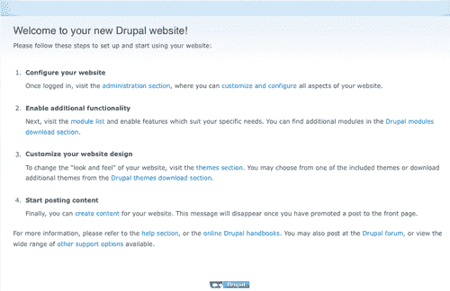

# 第二章：重写所有内容：重写模块

本章将涵盖：

+   设置一个简单的重定向

+   在重写中使用变量

+   使用 cookies 进行重写

+   使用浏览器代理进行重写

+   使用速率限制作为重写的条件

+   基于 HTTP 引荐来源阻止请求

+   部署时提供维护页面

+   设置一个具有静态文件服务的 WordPress 站点

+   设置一个具有静态文件服务的 Drupal 站点

+   设置一个具有静态文件服务的 Magento 站点

+   将 Apache 的 .htaccess 转换为 Nginx 重写规则

+   使用 map 使配置更简洁

# 介绍

本章专注于重写模块；它将教你基础知识，并且让你能够使用正确的重写规则配置各种常见的 Web 开发框架，使其在 Nginx 设置中正常工作。

# 设置一个简单的重定向

很多网站都会进行更改，在某些情况下会完全重写。大多数情况下，早期的内容 URL 会发生变化，导致 SEO 丧失，当然也给老用户带来不便。这个方法将帮助你编写简单的重写规则，确保你的网站的所有重定向都能正常工作。

## 如何操作...

让我们来看一个简单的例子，假设有一个名为 [`www.example1.com`](http://www.example1.com) 的站点。它之前有一个页面，URL 为 [`www.example1.com/blog/test-post.html`](http://www.example1.com/blog/test-post.html)，现在已经重新设计过。新的博客有一个不同的 URL 结构，旧的文章现在位于 [`www.example1.com/blog/test-post/`](http://www.example1.com/blog/test-post/)。看起来这只是一个简单的更改，但当一个旧的书签用户访问旧的 URL 时，他们会看到 404 错误页面。以下的配置更改可以轻松将旧的 URL 重写到新的 URL：

```
server {
server_name www.example1.com;
...
rewrite ^/blog/test-post.html$ /blog/test-post/ permanent;
location ~ .php$ {
...
}
}

```

## 它是如何工作的...

这会为旧 URL 创建一个永久性重定向[301]规则，并将其指向新 URL。随着时间的推移，可以移除此规则，因为永久性重定向会改变书签，并确保人们/爬虫不会继续访问旧的 URL。

## 还有更多内容...

你还可以进行临时重定向，即 302 重定向，只需删除永久关键字，即：

```
rewrite ^/blog/test-post.html$ /blog/test-post/ ;

```

这意味着浏览器不会更新书签，并且搜索爬虫也不会将新 URL 更新为该页面内容的主 URL。

# 在重写中使用变量

现在我们已经掌握了基础知识，接下来我们可以根据配置中可访问的各种变量，编写更有趣的重写规则。我们将查看一个简单的示例，在该示例中，我们检查 URI 中是否存在某个特定的 GET 参数，如果存在，则重写到一个特殊的 URL。

## 如何操作...

我们将使用以下配置来创建条件重写：

```
location / {
...
If ($arg_special ~* (beta|alpha|gamma) ) {
rewrite ^(.*)$ http://www.example1.com/greek/$1/;
}
}

```

## 它是如何工作的...

如果你输入任何包含 GET 参数的 URL（例如，[`www.example.com/?special=beta&test=test1`](http://www.example.com/?special=beta&test=test1)），它将显示相应的 beta 特殊页面。如果你想隐藏网站的某些部分，或者使其只能通过在参数中使用基本密钥来访问，这将非常有用。 |

## 还有更多... |

如上所述，你可以配置更多可用的 HTTP 头变量。以下是更多变量的列表，我们可以访问这些变量来编写更有趣的规则。 |

| 变量 | 描述 |
| --- | --- |
| `$arg_PARAMETER` | 此变量包含查询字符串中如果存在参数`PARAMETER`的 GET 请求变量的值。 |
| `$args` | 此变量包含 URL 中的查询字符串，例如，如果 URL 为`http://example1.com/?foo=123&bar=blahblah`，则为`foo=123&bar=blahblah`。 |
| `$binary_remote_addr` | 客户端的二进制地址。 |
| `$body_bytes_sent` | 发送的正文字节数。 |
| `$content_length` | 此变量等于请求头中的 Content-Length 行。 |
| `$content_type` | 此变量等于请求头中的 Content-Type 行。 |
| `$document_root` | 此变量等于当前请求的 root 指令的值。 |
| `$document_uri` | 与`$uri`相同。 |
| `$host` | 此变量包含请求头中`Host`的值，或者如果`Host`值不可用，则包含处理该请求的服务器名称。 |
| `$http_HEADER` | HTTP 头部`HEADER`的值，当转换为小写并将“破折号”转换为“下划线”时，例如，`$http_user_agent`，`$http_referer`。 |
| `$is_args` | 如果设置了`$args`，则返回“?”，否则返回“”。 |
| `$request_uri` | 此变量等于从客户端接收的*原始*请求 URI，包括参数。它不可修改。查看`$uri`以获取重写/更改后的 URI。不包括主机名。例如："/foo/bar.php?arg=baz"。 |
| `$scheme` | HTTP 协议（即 http、https）。仅在需要时评估，例如：`rewrite ^(.+)$ $scheme://example.com$1 redirect`; |
| `$server_addr` | 此变量包含服务器地址。建议在`listen`指令中正确指示地址，并使用`bind`参数，以便每次访问该变量时不进行系统调用。 |
| `$server_name` | 服务器的名称。 |
| `$server_port` | 此变量等于请求到达的服务器端口。 |
| `$server_protocol` | 此变量等于请求的协议，通常为 HTTP/1.0 或 HTTP/1.1。 |
| `$uri` | 此变量等于请求中的当前 URI（不包含参数，参数在`$args`中）。它可能与`$request_uri`不同，后者是浏览器发送的 URI。它的修改方式包括内部重定向或使用索引。不包括主机名。例如：`"/foo/bar.html"` |

# 使用 Cookies 进行重写 |

现在大多数网站使用其 Cookies 来有效跟踪和与客户端浏览器进行交互。Nginx 通过其强大的重写模块，允许我们编写一些有趣的规则，利用可能存在于浏览器 Cookies 中的信息。你可以通过偏好设置查看浏览器中的各种 Cookies。


## 如何操作...

我们可以举一个简单的例子，假设一个站点在同一 Nginx 实例上运行预发布和生产版本。根据 Cookie，URL 会被重写为正确的版本。以下代码片段将允许你根据 Cookie 中的内容切换站点：

```
if ($cookie_env ~* "testing") {
rewrite ^(.*)$ /testing/$1;
}
if ($cookie_env ~* "staging") {
rewrite ^(.*)$ /staging/$1;
}
if ($cookie_env ~* "production") {
rewrite ^(.*)$ /production/$1;
}

```

## 如何操作...

在上面的配置中，会检查 Cookie 的值，以确定用户正在访问的设置类型。此 Cookie 由应用程序在用户登录时设置，因此测试用户将能够访问前沿功能，而预发布用户仅能访问用于测试的 Beta 功能，普通用户将继续使用稳定的生产系统。

# 使用浏览器代理进行重写

在这个示例中，我们将看到如何利用重写根据客户端浏览器的用户代理显示不同的站点。我们可以以一个非常炫酷的网站为例，该网站希望根据客户端使用的浏览器显示不同的页面集。以下两张截图展示了`facebook.com`在普通桌面浏览器和 iPhone 浏览器中的显示效果；然而，URL 保持不变。


在前面的截图中，我们看到的是 Facebook 的完整浏览器版本，你可以看到一个相当宽屏的网站。在接下来的截图中，我们可以看到 Facebook 的移动版本，明显因为屏幕尺寸的缩小，放弃了很多功能。


## 如何操作...

我们举的简单例子是，iPhone 用户浏览网站时，如何将 URL 重写为显示完全兼容 iPhone 的站点。下面的配置是一个很好的开始！

```
location / {
...
if ($http_user_agent ~* '(iPhone|iPod)') {
set $iphone_request '1';
}
if ($iphone_request = '1') {
rewrite ^.+ http://m.example1.com/$uri;
}
}

```

## 如何操作...

其原理很简单。它允许我们检查已经传来的 HTTP 用户代理头。如果它是 iPhone 或 iPod 浏览器，我们就设置一个变量为某个值。如果该变量为"1"，我们就继续将 URL 重写为移动版本的网站。

# 使用速率限制作为重写的条件

Nginx 在请求的速率限制方面有一些非常有趣的内置功能。本示例将帮助你理解如何控制对应用程序的请求，从而即使在负载较重的情况下，也能保持一定的服务质量。

Nginx 允许你定义区域，这些区域作为会话状态的存储区。会话键的值由所选择的变量决定，通常是客户端的 IP 地址或主机名。

## 如何实现...

在这个示例中，我们将看看如何基于某些参数进行速率限制，比如用户代理。

```
location / {
. . .
if ($http_user_agent ~ "MSIE") {
limit_rate 5k;
}
}

```

## 它是如何工作的...

在前面的示例中，我们检查用户代理是否包含 MSIE，如果是，它将仅限速传输 5000 字节。

## 还有更多...

你还可以通过使用以下代码片段来设置基于请求的速率限制：

```
http {
limit_req_zone $binary_remote_addr zone=one:10m rate=1r/s;
...
server {
...
location / {
limit_req zone=one burst=5;
}
}

```

上述配置创建了一个名为“one”的区域，为其分配了 10MB 的会话存储空间，并允许每秒一个请求的速率。在此配置下，如果任何请求超出了速率限制且无法提供服务，它将返回“服务不可用”503 页面。你可以在一个 1MB 的区域中存储大约 16000 个会话。你可以根据系统需求创建任意数量的区域。


# 基于 HTTP 来源阻止请求

在这个示例中，我们将以编写一个规则为例，该规则查看请求的 HTTP REFERER 头，并阻止你网站上的垃圾邮件者。


上面的截图展示了某个博客一天内的垃圾评论；这些评论是由自动化的机器人发布的，目的是为他们的各种属性获取反向链接。这些技术属于 SEO 的黑暗面。

## 如何实现...

为了阻止垃圾邮件机器人访问你的网站，你可以在配置的 location 部分中使用以下代码片段：

```
location / {
...
if ($http_referer ~* (babes|click|diamond|forsale|girl|jewelry|love|nudit|organic|poker|porn|poweroversoftware|sex|teen|video|webcam|zippo)) {
return 403;
}
}

```

## 它是如何工作的...

这基本上是查看`$http_referer`变量，并将其与提供的各种关键词进行匹配。这在确保系统中没有大量垃圾邮件链接到恶意网站方面非常有效！如果关键词确实匹配，它将返回 403 客户端错误。


# 部署时提供维护页面

大多数网站需要做的事情之一就是部署代码，通常是在站点运行在生产环境时进行。Nginx 在轻松重新加载配置而不终止客户端连接方面真的很棒。你可以查看上一章的重载方法来了解更多信息。在这个示例中，我们将展示一种简单的方法来设置一个系统，使得部署对最终用户和你自己来说都没有痛苦！

## 如何实现...

让我们逐步了解一下需要做什么来实现一个可用的部署。在这个过程中，也会概述各种配置更改。

1.  创建一个目录，里面放有临时的“Coming back soon”HTML 文件。我们称这个目录为`/var/www/www.example1.com/deployment/`，文件名为`index.html`。

1.  你需要创建一个替代的配置文件，名为`temporary.conf`。该文件基本上会用以下内容替换[www.example1.com](http://www.example1.com)的服务器配置：

    ```
    server {
    server_name www.example1.com;
    location / {
    index index.html;
    root /var/www/www.example1.com/deployment/;
    rewrite ^(.*)$ http://www.example1.com/;
    }
    }

    ```

1.  现在我们可以编写一个小脚本来进行部署。它基本上会将站点置于临时模式，然后更新你的代码库。代码更新后，它将简单地复制旧的生产配置并重新加载 Nginx。

    ```
    !#/bin/bash
    mv /etc/nginx/nginx.conf /etc/nginx/nginx_temp.conf
    mv /etc/nginx/temporary.conf /etc/nginx/nginx.conf
    kill -HUP `cat /var/log/nginx/nginx.pid`
    #<deploy the code>
    # Restart the Fcgi / WSGI backend
    mv /etc/nginx/nginx_temp.conf /etc/nginx/nginx.conf
    kill -HUP `cat /var/log/nginx/nginx.pid`

    ```

### 它是如何工作的...

在这个实例中，我们将简单地运用之前学到的技巧，并结合一些巧妙的 bash 脚本编写一个简单的部署脚本。这个思路是，当站点正在部署时，重写所有 URL 指向维护页面，等后台代码部署完成后，我们将恢复到以前的生产配置。


# 使用静态文件服务设置 WordPress 站点

WordPress 是全球领先的博客系统之一，今天几乎是事实上的标准。它与 Apache2 配合设置相对简单，也使得设置干净的 URL 非常容易。然而，使用 Nginx（以及 PHP over fcgi）时，设置 WordPress 的干净 URL 需要一些工作。我自己的博客就运行在 WordPress 和 Nginx 上！


## 如何操作...

让我们尝试使用 Nginx 和 PHP over fcgi 设置一个完整的 WordPress 博客。在这个实例中，你将学习 WordPress 和 Nginx 技术栈的各种细节。

1.  下载 WordPress - [`Wordpress.org/latest.tar.gz`](http://Wordpress.org/latest.tar.gz)。

1.  在 `/var/www/www.example1.com/` 解压它：

    ```
    tar -xvzf latest.tar.gz

    ```

1.  在 `Nginx.conf` 文件中的 http 指令下添加以下配置：

    ```
    server {
    listen 80;
    server_name www.example1.com;
    root /var/www/www.example1.com;
    index index.php index.html;
    try_files $uri $uri/ /index.php?q=$uri;
    location ~* \.(jpg|jpeg|gif|css|png|js|ico|html)$ {
    expires max;
    }
    location ~ \.php$ {
    include /etc/nginx/fastcgi_params;
    fastcgi_pass 127.0.0.1:9000;
    }
    }

    ```

1.  重启服务器：

    ```
    kill -HUP <master PID>

    ```

1.  访问博客并开始安装。

1.  登录到管理部分并设置干净的 URL。

    ```
    /blog/%year%/%monthnum%/%day%/%postname%/

    ```

    

1.  以下截图展示了固定链接设置，它可以让你在没有 `.php` 后缀的情况下使用干净的 URL，并附加各种参数。这样非常有利于搜索引擎和用户友好：

1.  我们快完成了。现在你可以继续自定义你那个酷炫的新 WordPress 博客！


## 它是如何工作的...

这是一个相当基础的设置。干净的 URL 由一个重写规则处理。比较有趣的是静态文件服务，如上面的配置所示，它会检查所提供的文件是否是静态文件（例如 GIF、PNG、DOC 等）。如果是，则该文件会带有一个长期过期时间的过期头部进行服务。这可以减少消耗的带宽，因为它便于客户端延长缓存。

## 还有更多...

许多站点有替代方案来应对更高的负载，并使用像 `wp-supercache` 这样的插件。以下配置具有正确的重写规则，可以充分利用 `wp-supercache` 和 Nginx 的结合能力。该设置能够在非常低的资源限制下处理大量的负载：

```
if (-f $request_filename) {
break;
}
set $supercache_file '';
set $supercache_uri $request_uri;
if ($request_method = POST) {
set $supercache_uri '';
}
if ($query_string) {
set $supercache_uri '';
}
if ($http_cookie ~* "comment_author_|Wordpress|wp-postpass_" ) {
set $supercache_uri '';
}
if ($supercache_uri ~ ^(.+)$) {
set $supercache_file /blog/wp-content/cache/supercache/$http_host/$1index.html;
}
if (-f $document_root$supercache_file) {
rewrite ^(.*)$ $supercache_file break;
}
if (!-e $request_filename) {
rewrite ^(.+)$ /index.php?q=$1 last;
}

```

在下方的截图中，您可以看到 WP 超级缓存管理插件的配置页面，允许您根据网站要求设置缓存的其他参数。在上面的例子中，我们处理了基本设置，假设所有页面都需要缓存。


# 设置具有静态文件服务的 Drupal 网站

Drupal 是一个新兴的开源 CMS，吸引了许多 PHP 开发者和爱好者的关注。在本食谱中，我们将看看如何通过 FastCGI 使用 Nginx 和 PHP 来设置 Drupal。


## 如何操作...

1.  下载 Drupal: [`ftp.Drupal.org/files/projects/Drupal-6.19.tar.gz`](http://ftp.Drupal.org/files/projects/Drupal-6.19.tar.gz)

1.  将 Drupal 解压到 `/var/www/www.example1.com/`。

1.  将以下内容添加到您的 `Nginx.conf:` 

    ```
    server {
    listen 80;
    server_name www.example1.com;
    root /var/www/www.example1.com;
    index index.php index.html index.htm
    try_files $uri $uri/ /index.php?q=$uri;
    location ~* \.(jpg|jpeg|gif|css|png|js|ico|html)$ {
    expires max;
    }
    location ~ \.php$ {
    include /etc/nginx/fastcgi_params;
    fastcgi_pass 127.0.0.1:9000;
    }
    }

    ```

1.  重新加载 Nginx：

    ```
    kill -HUP <master PID>

    ```

1.  设置 Drupal：


上面的截图让您设置安装的数据库设置。在接下来的屏幕中，您将以管理员身份登录，并能操作平台的各种选项：



## 它是如何工作的...

基本的 Drupal 设置与前面食谱中显示的 WordPress 设置非常相似，并且具有相同的重写规则。您需要将干净的 URL 转换为 `index.php` 的参数化 URL，如高亮显示的指令 `try_files` 所示。

## 还有更多...

Drupal 有一个令人兴奋的缓存框架，叫做 Boost，它能显著提高速度。它可以与 Nginx 一起使用，处理相当高的负载。请注意，这个堆栈与 Boost 模块在处理大型 Drupal 网站时会有一些陷阱；它最好用于较小的门户网站。

```
set $boost "";
if ( $request_method = GET ) {
set $boost G;
}
if ($http_cookie !~ "DRUPAL_UID") {
set $boost "${boost}D";
}
if ($query_string = "") {
set $boost "${boost}Q";
}
if ( -f $document_root/cache/$host/0/index.html ) {
set $boost "${boost}I";
}
if ($boost = GDQI) {
rewrite ^/$ /cache/$server_name/0/index.html break;
}
if ( -f $document_root/cache/$host/0$request_uri.html ) {
set $boost "${boost}F";
}
if ($boost = GDQIF) {
rewrite .? /cache/$server_name/0$request_uri.html break;
}
if ( -d $document_root/cache/$host/0$request_uri ) {
set $boost "${boost}E";
}
if ( -f $document_root/cache/$host/0$request_uri/index.html ) {
set $boost "${boost}F";
}
if ($boost = GDQEF) {
rewrite .? /cache/$server_name/0$request_uri/index.html break;
}
if (!-e $request_filename) {
rewrite ^/(.*)$ /index.php?q=$1 last;
}

```

### 提示

上述案例中的一个重要假设是 Boost 缓存设置在 `/cache/`。


# 设置具有静态文件服务的 Magento 网站

Magento 是一个整洁的电子商务 CMS，已经存在了一段时间。由于其强大的 API 和忠诚的开发者社区，它已经获得了广泛的接受。在本食谱中，我们将看看如何通过 FastCGI 使用 Nginx 和 PHP 来设置 Magento。


## 如何操作...

1.  下载 Magento: [`www.magentocommerce.com/getmagento/1.4.1.1/magento-1.4.1.1.zip`](http://www.magentocommerce.com/getmagento/1.4.1.1/magento-1.4.1.1.zip)

1.  将 Magento 解压到 `/var/www/www.example1.com/`。

1.  将此添加到您的 `Nginx.conf:` 

    ```
    server {
    listen 80 default;
    server_name www.example1.com;
    root /var/www/www.example1.com;
    location / {
    index index.html index.php;
    if (!-e $request_filename) {
    rewrite / /index.php;
    }
    }
    location ~ \.php/ {
    rewrite ^(.*\.php)/ $1 last;
    }
    location ~ \.php$ {
    include fastcgi_params;
    fastcgi_pass 127.0.0.1:9000;
    }
    }

    ```

1.  重新加载 Nginx：

    ```
    kill -HUP <master PID>

    ```

1.  安装 Magento：


## 它是如何工作的...

Magento 不像 Drupal 或 WordPress 那样将其 URL 重写为 `index.php`。所有页面都映射到 `index.php`。这是通过上面配置代码中高亮的重写规则实现的。

# 将 Apache 的 .htaccess 转换为 Nginx 重写规则

Nginx 重写的一个主要用途是帮助你轻松地将 Apache2 的 .htaccess 转换为可用的 Nginx 配置。Apache2 是全球主流的开源 Web 服务器。在这种情况下，不可避免地大多数可用代码都有 .htaccess 规则，并且很少有关于如何配置 Nginx 重写规则以便正确运行站点的指导。

## 如何操作…… 

在这里，我们将查看一个示例，看看如何将 .htaccess 文件及其等效的 Nginx 重写规则。接下来的章节，我们将看看转换过程中出现的一些模式，之后你可以利用这些模式转换其他脚本。

```
Options -Indexes
Options +FollowSymLinks
# Enable ETag
#FileETag MTime Size
FileETag none
# Set expiration header
ExpiresActive on
ExpiresDefault A2592000
Header append Cache-Control "public"
# Compress some text file types
AddOutputFilterByType DEFLATE text/html text/plain text/css text/xml application/x-javascript text/javascript application/javascript application/json
# Deactivate compression for buggy browsers
BrowserMatch ^Mozilla/4 gzip-only-text/html
BrowserMatch ^Mozilla/4\.0[678] no-gzip
BrowserMatch \bMSIE !no-gzip !gzip-only-text/html
# Set header information for proxies
Header append Vary User-Agent
########################################################
# Rewrite Rules
########################################################
RewriteEngine on
# Require SSL (HTTPS) on the signup page
rewritesapache .htaccess, conerting intoRewriteCond %{SERVER_PORT} 80
RewriteCond %{REQUEST_URI} ^/signup/?
RewriteRule ^(.*)$ https://www.example.com/$1 [R,L]
# Redirect /signup/plan or /signup/plan/ -> /signup/index.php?account_type=plan
RewriteRule ^signup/([A-Za-z]+)/?$ /signup/index.php?account_type=$1 [NC,L]
# Redirect /home/123 or /home/123/ -> home.php?home_id=123
RewriteRule ^home/([0-9]+)/?$ home.php?home_id=$1 [NC,L]
# Redirect /homes/ in case someone made a typo when it should have been /home/
RewriteRule ^homes/([0-9]+)/?$ home.php?home_id=$1 [NC,L]
#################################################
# Default Settings
#################################################
# hide apache server signaute on apache generated pages (e.g. 404)
ServerSignature Off

```

等效的 Nginx 规则集是：

```
if ($server_port ~ "80"){
set $rule_0 1$rule_0;
}
if ($uri ~ "^/signup/?"){
set $rule_0 2$rule_0;
}
if ($rule_0 = "21"){
rewrite ^/(.*)$ https://www.example.com/$1 redirect;
break;
}
rewrite ^/signup/([A-Za-z]+)/?$ /signup/index.php?account_type=$1 last;
rewrite ^/home/([0-9]+)/?$ /home.php?home_id=$1 last;
rewrite ^/homes/([0-9]+)/?$ /home.php?home_id=$1 last;

```

## 它是如何工作的……

现在让我们来看一下规则是如何被转换的，Apache 重写规则基本上执行以下规则：

+   如果请求在端口 80 上，并且 URL 为 /signup/，则它会被重写为 HTTPS 版本。

+   它将所有的 `/signup/plan` 或 `/signup/plan/` 重定向到 `/signup/index.php?account_type=plan`

+   它将所有的 `/home/123` 或 `/home/123/` 重定向到 `home.php?home_id=123`

+   它将所有 `/homes/` 修正为 `/home/`

所以基本上，如果你注意到，转换是非常直接且相当简单的。Apache .htaccess 基本上利用一组顺序条件，这些条件在 Nginx 中被转换为 if 条件语句，用来操作一些变量。下表为你提供了更清晰的视角，展示了重写规则的直接转换。

| Apache | Nginx | 备注 |
| --- | --- | --- |
| RewriteCond %{SERVER_PORT} 80 | if ($server_port ~ "80"){ set $rule_0 1$rule_0; } | 这是一个简单的重写条件检查，检查服务器端口。 |
| RewriteCond %{REQUEST_URI} ^/signup/? | if ($uri ~ "^/signup/?"){ set $rule_0 2$rule_0; } | 这是对 URL 结构的检查。 |
| RewriteRule ^(.*)$ https://www.example.com/$1 [R,L] | if ($rule_0 = "21"){ rewrite ^/(.*)$ https://www.example.com/$1 redirect; break; } | 这个规则仅在上述两个条件满足时触发。它是一个重定向，就像 Apache 配置中的 R 和 Nginx 中的 redirect 所指定的那样。 |
| RewriteRule ^signup/([A-Za-z]+)/?$ /signup/index.php?account_type=$1 [NC,L] | rewrite ^/signup/([A-Za-z]+)/?$ /signup/index.php?account_type=$1 last; | 这只是匹配像 /signup/something 这样的 URL，并将其重写为 /signup/index.php?account_type=something。如果你注意到，something 可以包含字母以进行匹配。 |
| RewriteRule ^home/([0-9]+)/?$ home.php?home_id=$1 [NC,L] | rewrite ^/home/([0-9]+)/?$ /home.php?home_id=$1 last; | 这与上面的重写规则类似，并且匹配一个数字。 |
| RewriteRule ^homes/([0-9]+)/?$ home.php?home_id=$1 [NC,L] | rewrite ^/homes/([0-9]+)/?$ /home.php?home_id=$1 last; | 这个重写规则匹配像 /homes/123、/homes/123123 这样的模式。它与上述的重写规则类似。 |

很明显，你可以将 Apache htaccess 中的重写条件转换为 Nginx 条件，如上面的对比所示，这些条件会修改变量的值。从表格中很容易看出实际的重写转换模式。

## 还有更多……

今天，有许多功能强大的在线工具可以直接将你的 .htaccess 文件转换为 Nginx 配置！虽然在稍微复杂的情况下，人工转换仍然能生成更高效的代码，但你可以尝试使用 [`www.anilcetin.com/convert-apache-htaccess-to-nginx/`](http://www.anilcetin.com/convert-apache-htaccess-to-nginx/) 这个工具，一键将你的 Apache 配置转换为 Nginx 配置。

# 使用 map 来使配置更加简洁

有一个非常有用的 Nginx 模块，它允许将一组值分类到不同的值集合中，并将其存储在一个变量中。这个思路使得编写类似 `switch-case` 语句变得更加简单，在这些语句中，当值不同时，会有不同的重写规则。所以，让我们看一些有效使用 map 模块的例子。

## 如何操作……

假设你想检测传入的主机名，并且想在某些域名和子域名上执行不同的操作，我们将编写一个 map，并在一个简单的重写规则中使用它：

```
map $http_host $name {
hostnames;
default 0;
example.com 1;
*.example.com 1;
test.com 2;
*.test.com 2;
.site.com 3;
}
if($name ~* 1) {
<some rewrite rule>
}

```

## 它是如何工作的……

这个思路很简单。这里你取了 `$http_host` 变量，并创建了一个 map，在这个 map 中，它会根据匹配的值简单地将 `$name` 填充为对应的值。所以例如，如果访问的网站是 [`abc.site.com`](http://abc.site.com)，那么 `$name` 的值将根据 map 被设置为 3。

主机名指令允许你写一个映射，而不是两个映射，假如你想覆盖整个域名，即：

```
.example1.com 1;

```

而不是：

```
example1.com 1;
*.example1.com 1;

```

## 还有更多……

在这个变量映射之后，你可以利用它触发其他重写规则。使用 cookies 与重写规则配合的方案，可能会采用这种方法，从而使配置文件更加简洁：

```
if ($cookie_env ~* "testing") {
rewrite ^(.*)$ /testing/$1;
}
if ($cookie_env ~* "staging") {
rewrite ^(.*)$ /staging/$1;
}
if ($cookie_env ~* "production") {
rewrite ^(.*)$ /production/$1;
}

```

上述内容可以简单地转换为：

```
map $cookie_env $type {
default /production/;
testing /testing/;
staging /staging/;
production /production/;
}
rewrite ^(.*)$ $type/$1;

```

这样看起来更简洁，并且实际上等同于未使用 Map 模块的配置。
