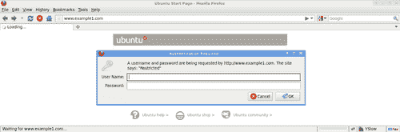
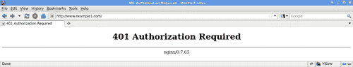
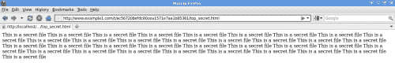
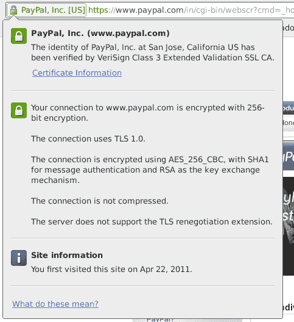
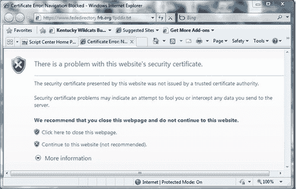
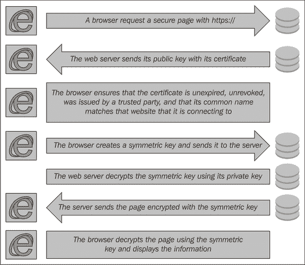
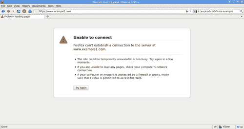
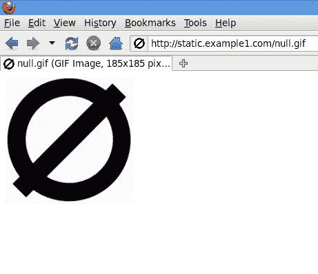

# 第五章：让我们确保安全：安全模块

在本章中，我们将讨论：

+   设置 HTTP 认证以进行访问控制

+   生成文件的安全链接

+   为简单站点设置 HTTPS

+   使用非标准错误代码调试 SSL 设置

+   使用通配符证书与多个服务器

+   使用 Nginx SSL 变量进行重写规则

# 介绍

近年来，互联网安全已成为最热门的研究和进展话题之一。大多数国家要求政府组织与常规安全力量合作，组建网络安全团队。由于 Nginx 体积小、模块化设计清晰，它在维护安全代码库方面，相较于许多体积更大的开源 Web 服务器，具有明显的优势。

公平地说，没有一个 Web 服务器是零漏洞的；防止安全问题的唯一方法是实施正确的政策。政策包括其他系统用户可以执行的活动以及各种安全日志机制。然而，所有政策的效果都取决于通过正确配置来实施。一个简单的例子是，我们可以使用简单的 HTTP 认证来防止随机人员访问一个暂存站点。在这里，政策是防止未知人员访问你的私人 Beta 站点。

在本章中，我们将探讨如何利用 Nginx 内置的安全模块来保护你的站点和用户的数据。

# 设置 HTTP 认证以进行访问控制

在最近的 API 中，一些大型网站已经将 HTTP 认证作为其 API 的访问控制方式。然而，这种方法在大多数应用中逐渐被 OAuth 认证取代。这种方案的优点是，它基于 HTTP 头部，因此实现起来非常快速，适合 API 提供者进行部署。在这个教程中，我们将设置一个特定端点的 HTTP 认证并进行测试。

## 如何做到这一点...

1.  你首先需要使用 Apache 工具创建`htpasswd`文件。这个文件基本上包含用户名和密码哈希对，用于验证用户身份：

    ```
    htpasswd c /etc/nginx/user_auth dipankar

    ```

    +   上述命令将创建一个用户`dipankar`并要求从命令行输入密码。

1.  现在，我们基本上将这个配置添加到配置文件的 location 部分，在这里我们希望使用 HTTP 认证来保护 URL 端点：

    ```
    server {
    server_name www.example1.com;
    . . .
    location / {
    auth_basic "Restricted";
    auth_basic_user_file /etc/nginx/user_auth;
    . . .
    }
    }

    ```

1.  现在，你可以访问`http://www.example1.com`并测试 HTTP 认证。如果你输入`dipankar`以及之前使用的密码，你将能够成功进入，如下图所示：



如果你无法输入正确的用户名和密码组合，你将看到“需要授权”的页面，如下图所示：



## 它是如何工作的...

上述配置需要一个身份验证文件，该文件包含传统 Apache `htpasswd` 格式的用户和密码列表，你可以使用它来为网站的任何部分添加密码保护。

为了为网站上的其他 URL 添加密码保护，拥有一组不同的用户名和密码也同样简单；你只需要创建一组单独的 `htpasswd` 文件。

# 为文件生成安全链接

有时，分享文件时所需的唯一安全方式就是一个特殊的 URL。这在数据仅在网上暂时存在，或者可能只有有限的时间值时非常有用。Nginx 也提供了一个专门为此目的而设计的模块。在这个教程中，我们将看看如何快速为 Web 服务器上的文件实现安全链接。

## 如何实现……

1.  第一步是确保 Nginx 已经编译了该模块，因此你需要确保下载 Nginx，并在编译时使用以下标志：

    ```
    ./configure . . . --with-http_secure_link_module

    ```

1.  下一步是选择一个密钥（例如，`superhash`），然后使用以下配置：

    ```
    location /t/ {
    secure_link_secret superhash;
    # If the hash is incorrect then $secure_link has the value of the null string.
    if ($secure_link = "") {
    return 403;
    }
    # This needs to be here otherwise you'll get a 404.
    rewrite ^ /t/$secure_link break;
    }

    ```

1.  现在我们可以在我们拥有的文件（`top_secret.html`）上进行测试，因此生成的 URL 形式为 `http://www.example1.com/t/<md5 hash>/top_secret.html`，其中

    ```
    echo -n 'top_secret.htmlsuperhash' | openssl dgst -md5

    ```

    +   生成 `<md5-hash>`

1.  如果上述生成的哈希值正确，你将能够下载文件。否则，你将进入一个错误页面：



如果你不小心输入了错误的哈希值，你将会看到一个“禁止访问”的页面，如下所示：


## 它是如何工作的……

这个想法是创建一个简单的机制，使得生成一个特定文件的唯一且难以猜测的 URL 成为可能。在这种情况下，文件名和秘密盐的组合被用来生成 MD5 哈希，从而形成 URL 的一部分。

# 为简单站点设置 HTTPS

加密技术随着时代的演变而不断发展，在今天的世界中，公钥加密技术几乎处于最前沿（这正是 PGP 所基于的技术）。所有浏览器都实现了基于证书的安全性，允许在互联网上进行安全和加密的交易。这被证明是过去十年中促进电子商务增长的关键因素之一。

就像大多数浏览器实现基于 SSL 的客户端机制一样，所有 Web 服务器也需要处理服务器端的内容。Nginx 提供了一种非常简洁且易于配置的 SSL 安全性实现。在这个教程中，我们将看看如何轻松获取一对证书并快速设置一个安全站点。

## 如何实现……

1.  最初，你需要从知名的证书颁发机构（CA）购买证书，或者从免费的公共 CA（如 CAcert）获得证书。或者，你也可以自己生成证书。你可以通过阅读一本关于服务器安全的 Packt 出版书籍，了解更多关于这个的信息。这些证书通常包含两个文件，一个是证书文件，另一个是密钥文件。我们可以称它们为`cert.pem`和`cert.key`。它们总是特定于你使用的域名的。

1.  要在某个终端点实现 SSL，你需要确保防火墙已开放正确的端口（80, 443）。

1.  以下配置片段需要放入特定域名的配置文件中（在本例中为[www.example1.com)](http://www.example1.com))。

    ```
    server {
    server_name www.example1.com;
    listen 443 default ssl;
    ssl_certificate /usr/local/nginx/conf/cert.pem;
    ssl_certificate_key /usr/local/nginx/conf/cert.key;
    . . .
    }

    ```

1.  现在你可以尝试访问[`www.example1.com`](http://https://www.example1.com)，如果没有错误，页面应该能正常打开。如果出现错误，说明浏览器没有正确验证证书。在以下示例中，我们可以看到 Paypal（[`www.paypal.com`](https://www.paypal.com)）有一个来自 Verisign Inc 的有效证书：



在很多情况下，网站的证书可能未正确配置，或已过期。在这种情况下，大多数现代浏览器会询问用户是否要继续访问该网站，如下图所示。大多数情况下，建议删除配置错误的证书，因为它们可能会成为最终用户的障碍。



## 它是如何工作的...

以下图片最好地描述了 SSL 认证的实际过程。在配置中，我们基本上定义了 Web 服务器的证书和密钥，其余的基本上由内部处理：



## 还有更多...

假设你还不想为你的网站购买证书，而是想尝试使用 SSL 安全性。你可以按照以下步骤生成证书：

1.  首先，切换到你想要创建证书和私钥的目录，例如：

    ```
    cd /usr/local/nginx/conf

    ```

1.  现在创建服务器私钥。系统会要求你输入密码短语：

    ```
    openssl genrsa -des3 -out server.key 1024

    ```

1.  创建证书签名请求（CSR）：

    ```
    openssl req -new -key server.key -out server.csr

    ```

1.  使用上述私钥，移除启动 Nginx 时输入密码短语的必要性：

    ```
    cp server.key server.key.org
    openssl rsa -in server.key.org -out server.key

    ```

1.  最后，使用上述私钥和证书签名请求（CSR）签署证书：

```
openssl x509 -req -days 365 -in server.csr -signkey server.key -out server.crt

```

# 使用非标准错误代码调试 SSL 设置

大多数设置第一次配置时会很困难，因此 Nginx 提供了一些非常易于使用的非标准错误代码来调试你的 SSL 设置。

在本教程中，我们将看看这些非标准错误代码，以及如何处理 SSL 设置问题。

## 如何操作...

这些错误代码默认启用，具体如下：

| HTTP 错误代码 | 错误 |
| --- | --- |
| 495 | 检查客户端证书错误 |
| 496 | 客户端未授权所需证书 |
| 497 | 正常请求已发送到 HTTPS |

## 它是如何工作的...

这个想法非常简单。Nginx 允许你记录这些特殊的错误，你可以用来识别并修复 SSL 问题。

一个简单的例子是，你可以创建一个简单的页面，用来查看特定错误代码下所有 Nginx 变量，仅用于调试目的。如果你收到 495 错误页面，意味着客户端证书未能成功通过它所发行的 CA 的检查。这可能是由于防火墙权限问题，或是你在 Web 服务器上可能存在解析问题。在某些情况下，当你得到 496 错误时，可能表明有人试图对你的网站造成一些问题！大多数 SSL 攻击都涉及中间人攻击或重放攻击，这种攻击通过一个小的代理服务器插入其中，记录所有创建 SSL 连接所需的步骤，然后在稍后的时间对目标进行破坏。

# 使用通配符证书和多个服务器

在许多情况下，我们希望在一些不安全的子域名中提供多个安全的子域名，并且在 HTTP 和 HTTPS 子域之间共享资源。在这个实例中，我们将看看如何配置一个 HTTP 域名，一个安全的子域名，以及一个同时在 HTTP 和 HTTPS 子域上共享的目录。

## 如何实现...

为了实现上述目标，我们只需要将以下内容添加到配置中。假设所有证书文件已经合并为一个文件（common.crt），同样，所有密钥也已合并（common.key）：

```
http{
...
ssl_certificate common.crt;
ssl_certificate_key common.key;
server {
listen 80;
server_name www.example1.com;
location / {
...
}
}
server {
listen 443 default ssl;
server_name payment.example1.com;
location / {
...
}
}
server {
listen 80;
listen 443;
server_name static.example1.com;
location / {
root /var/www/www.example1.com/static;
}
}

```

现在，如果你访问网站的三个不同部分，你会发现你可以访问`http://www.example1.com`和`http://static.example1.com/null.gif`，但无法访问`https://www.example1.com`或`http://payment.example1.com/`。以下截图展示了`https://www.example1.com`无法打开：



以下截图显示了`null.gif`文件在 Nginx 中被正确提供，而[`www.example1.com`](http://https://www.example1.com)如前所示无法打开。



## 它是如何工作的...

这个配置展示了 Nginx 的多功能性。在这个实例中，你仅根据域名的不同打开或关闭 SSL。你有一种情况不需要 SSL（`http://www.example1.com`），另一种情况只需要 SSL（`https://payment.example1.com`），还有一种情况是对于某个特定目录中的文件（/var/www/www.example1.com/static），同时启用了 SSL 和非 SSL 的 URL。

# 使用 Nginx SSL 变量进行重写规则

Nginx 有一个非常智能且设计良好的重写系统。它甚至允许您在重写规则中访问 SSL 变量。在这个例子中，我们将探讨一个简单的示例，看看我们可以用这些变量做什么。您可以在第二章中了解更多关于重写规则的内容。

基本上，我们将检查 SSL 验证（`$ssl_client_verify`）是否成功，如果没有成功，将显示不同的页面。

## 如何操作...

将此配置插入您的文件中，基本上将导致如果 SSL 客户端证书成功验证，则向用户显示不同的站点：

```
server {
listen ssl;
server_name www.example1.com;
if($ssl_client_verify ~* SUCCESS) {
rewrite ^ http://www.example1.com/test/;
}
location / {
...
}
location /test/ {
}
}

```

## 它是如何工作的...

这个简单的示例展示了我们如何使客户端证书验证将客户端重定向到站点的不同部分（在这个例子中是`http://www.example1.com/test/`）。

您可以使用 SSL 模块为特定会话填充的其他变量来做更多的事情，比如基于协议的日志记录等。

## 还有更多...

您可以访问以下变量，这些变量可以在创建有趣的规则时使用：

| SSL 变量 | 描述 |
| --- | --- |
| `$ssl_cipher` | 返回当前建立的 SSL/TLS 连接所使用的密码套件。 |
| `$ssl_client_serial` | 返回当前建立的 SSL/TLS 连接中客户端证书的序列号，如果适用的话。即，如果连接中启用了客户端认证。 |
| `$ssl_client_s_dn` | 返回当前建立的 SSL/TLS 连接中客户端证书的主题区分名称（DN），如果适用的话。即，如果连接中启用了客户端认证。 |
| `$ssl_client_i_dn` | 返回当前建立的 SSL/TLS 连接中客户端证书的颁发者区分名称（DN），如果适用的话。即，如果连接中启用了客户端认证。 |
| `$ssl_protocol` | 返回当前建立的 SSL/TLS 连接的协议，具体取决于配置和客户端可用选项，它可能是 SSLv2、SSLv3 或 TLSv1 之一。 |
| `$ssl_session_id` | 已建立安全连接的会话 ID—要求 Nginx 版本大于或等于 0.8.20。 |
| `$ssl_client_cert` | 返回特定域名安装的客户端证书。 |
| `$ssl_client_raw_cert` | 返回原始客户端证书。 |
| `$ssl_client_verify` | 当客户端证书成功验证时，取值为“SUCCESS”。 |
