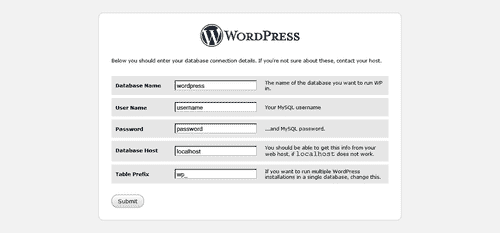

# 第六章：设置应用程序：FCGI 和 WSGI 模块

本章内容包括：

+   设置 PHP FCGI 网站

+   使用 uWSGI 设置 Python 网站

+   修改 FCGI 超时设置

+   使用 FCGI 缓存来加速

+   使用多个 FCGI 后端

# 介绍

这是一个实践部分，旨在帮助程序员和系统管理员理解并使用 Nginx 作为 Web 服务器安装他们的应用程序。由于缺乏集成模块来运行 PHP 和 Python，配置此类系统对经验不足的系统管理员来说可能是一个问题。

Nginx 被设计为一个框架，用于通过事件驱动机制处理本地 Web 和邮件协议。大多数 Web 服务器与应用程序的接口是后来才被加入到主 Web 服务器中的。随着时间的推移，CGI 演变出了许多形式，最终发展成了 FCGI、SCGI 以及用于 Python 的 WSGI 协议。这些协议的最终目标是通过标准化格式与 Web 服务器有效地通信，同时尽可能减少语言开销。

# 设置 PHP FCGI 网站

本篇教程帮助你通过 Nginx 和 PHP-fpm 快速而轻松地设置 PHP 网站。与 Apache 不同，Nginx 不自带 `mod_php`，而是作为一个独立的 Web 服务器，通过核心模块和第三方模块支持多种标准协议，如 CGI、FCGI、SCGI、WSGI 等。

PHP-fpm 是一套工具和脚本，帮助系统管理员轻松运行和管理 PHP FCGI 后端。它是 PHP5.3.x 稳定版的一部分，今后将在 PHP 部署中占据重要地位。

我们将首先了解如何设置 php-fpm，然后通过这个设置配置一个简单的 WordPress 网站。

## 如何操作…

本部分将分为两个部分：一部分帮助你安装 php-fpm，另一部分则帮助你在 Nginx 上使用该设置配置 WordPress。

**为 PHP 5.2.x 安装 php-fpm**

1.  根据你的系统和 PHP 的需求，你需要下载相应的 [deb/rpm] 软件包或源代码。

1.  如果你运气好，你可以使用从 [`php-fpm.org/download/`](http://php-fpm.org/download/) 下载的 PHP 软件包，具体取决于你使用的 PHP 版本。

1.  如果你运气不好找不到相关软件包，你需要按照以下网站的指南操作：[`legacy.php-fpm.org/Documentation`](http://legacy.php-fpm.org/Documentation)。在这个指南中，你需要下载适用于 PHP 5.2.X 的最新补丁，并进行补丁应用：

    ```
    bzip2 -cd php-5.2.11.tar.bz2 | tar xf -
    patch -d php-5.2.11 -p1 <php-fpm-0.6~5.2.patch
    cd php-5.2.11
    ./buildconf --force
    ./configure --enable-fastcgi --with-fpm --with-libevent[=path]

    ```

1.  安装完成后，你可以启动 php-fpm 守护进程。默认情况下，它会在 9000 端口运行（当然，你也可以根据需要进行配置）。

**配置 WordPress**

1.  现在我们将为计划与 Nginx 和 PHP-FPM 一起运行的 WordPress 网站创建一个新的配置。假设 php-fpm 正在监听 9000 端口。

    ```
    server {
    listen 80;
    server_name www.example1.com;
    root /var/www/www.example1.com;
    index index.php index.html index.htm;
    try_files $uri $uri/ /index.php;
    location ~ \.php$ {
    include fastcgi_params;
    fastcgi_pass 127.0.0.1:9000;
    fastcgi_index index.php;
    }
    }

    ```

1.  现在，您只需重启 Nginx，并确保它接受配置即可。

1.  完成后，我们可以访问已经设置的域名，它将会重定向到安装页面，如下所示的屏幕截图所示：

1.  你需要确保在系统上创建了一个 MySQL 数据库，因为下一步安装界面需要你输入数据库信息：

1.  最后，你将成功启动你的 PHP WordPress 博客！


## 它是如何工作的…

根据操作系统和 PHP 版本的不同，您需要选择正确的安装 php-fpm 的方法。安装完成后，您需要启动 php-fpm 守护进程，并确保它绑定到一个没有被其他应用程序占用的端口。

Nginx 配置步骤涉及设置一个服务器指令，该指令将基本上调用守护进程，处理 HTTP 请求和正在查询的脚本。我们还通过上述重写来处理 WordPress 的干净 URL。

## 还有更多…

你也可以继续安装其他 PHP 应用程序，而无需干净的 URL，只需使用以下示例配置！在这种情况下，我们不需要任何静态文件和干净的 URL 重写。

```
server {
listen 80;
server_name www.example1.com;
root /var/www/www.example1.com;
index index.php index.html index.htm;
location ~ \.php$ {
include fastcgi_conf;
fastcgi_pass 127.0.0.1:9000;
fastcgi_index index.php;
}
}

```

# 使用 uWSGI 设置 Python 网站

自从 Python 被 Google 采用，用于其服务器端脚本的重大部分以来，它的受欢迎程度急剧上升。它已经获得了业界的广泛支持，因此在本章中值得关注。

**Web 服务器网关接口**（WSGI）的开发，作为 Web 服务器和近年来出现的各种 Python 框架之间的一个简单通用接口。在本教程中，我们将使用 Django 这一 Python Web 框架的示例安装，展示如何让 Nginx 和 Python 协同工作。

## 如何操作...

为了设置一个简单的 Python 网站，我们将分为三个部分。第一部分将涉及 uWSGI 的安装（`http://projects.unbit.it/uwsgi/wiki`），第二部分将介绍如何设置一个非常基础的 Django 安装，最后一部分则讨论如何让它们一起工作。

**uWSGI 安装**

1.  如果你使用的是版本大于 0.8.4 的 Nginx，那么 uWSGI 已经在你的服务器上安装。如果不是，你将需要按照以下步骤进行操作。假设你拥有 root 权限或可以使用 `sudo` 访问安装服务器。

1.  在与 Nginx 源代码目录同级的地方下载 uWSGI 模块，然后配置该软件包：

    wget [`projects.unbit.it/downloads/uwsgi-0.9.6.5.tar.gz`](http://projects.unbit.it/downloads/uwsgi-0.9.6.5.tar.gz)

    ```
    tar xvzf uwsgi-0.9.6.5.tar.gz
    cd nginx
    ./configure --add-module=../uwsgi-0.9.6.5/nginx/
    make && make install

    ```

1.  这将为你的 Nginx 设置安装 uWSGI 模块。你还需要将 `uwsgi_params` 文件复制到你的 Nginx 安装目录中。

**使用 WSGI 脚本的基本 Django 设置**

1.  我们将首先从[`peak.telecommunity.com/dist/ez_setup.py`](http://peak.telecommunity.com/dist/ez_setup.py)安装 easy_install 脚本。

    ```
    sudo python http://peak.telecommunity.com/dist/ez_setup.py

    ```

1.  然后我们将使用`easy_install`安装 Django 包，这将处理所有依赖项并为你安装它们。

    ```
    sudo easy_install django

    ```

1.  在此之后，我们将开始一个名为`test`的新项目。

    ```
    django-admin.py startproject testapp

    ```

1.  我们现在可以通过进入测试目录并调用内置的开发服务器来测试它是否运行：

    ```
    cd test
    python manage.py runserver

    ```

    

1.  我们现在将创建运行此测试设置的 WSGI 文件。你需要进入测试目录上级并创建一个名为`django_wsgi.py`的新文件：

    ```
    import os
    os.environ['DJANGO_SETTINGS_MODULE'] = 'testapp.settings'
    import django.core.handlers.wsgi
    application = django.core.handlers.wsgi.WSGIHandler()

    ```

1.  你现在需要使用以下命令运行一个 uWSGI 实例来为该站点提供服务。假设该项目是在`/var/www/`创建的，并且 uWSGI 将使用 3031 端口。

```
uwsgi --socket 127.0.0.1:3031 --pythonpath /var/www/ --pythonpath /var/www/testapp/ -w django_wsgi -M -T -d server.log L

```

**Nginx 与 uWSGI**

1.  要运行此测试 Django 站点，你需要添加以下配置：

    ```
    server {
    listen 80;
    server_name www.example1.com;
    location / {
    root /var/www/testapp;
    index index.php index.html index.htm;
    }
    location / {
    uwsgi_pass 127.0.0.1:3031;
    include uwsgi_params;
    }
    }

    ```

1.  你需要重启 Nginx Web 服务器，然后你可以尝试访问你的网站。


## 它是如何工作的...

uWSGI 的核心理念是提供一个应用程序和 Web 服务器之间的通用协议，以便根据需要进行插件式配置。在这个示例中，我们可以清楚地看到如何使用 uWSGI，在某些情况下它已经作为 Nginx 源代码包的一部分。我们可以看到如何创建并运行一个小型 Django 应用。

因此，uWSGI 守护进程在我们的示例中运行在 3031 端口，Nginx 基本上将 HTTP 请求转换为 WSGI 协议，并将其代理到守护进程。uWSGI 提供了许多功能，允许你正确管理 Python 的开销。

## 还有更多...

你可以把这个简单的示例扩展到大多数其他 Python 框架。这里有一个非常小的独立 Python 脚本，供`web.py`开发者使用。将其保存为`django_usgi2.py`：

```
import web
urls = (
'/(.*)', 'hello'
)
app = web.application(urls, globals())
class hello:
def GET(self, name):
if not name:
name = 'World'
return 'Hello, ' + name + '!'
application = app.wsgifunc()

```

要运行此脚本，请使用：

```
uwsgi -s /tmp/web.py.socket -w django_usgi2.py

```

# 修改 FCGI 超时

如果你已经发现了如何在 Nginx 中设置 PHP 的各种可能性，你会清楚地看到，FCGI 是一个相当适合低至中等流量环境的优化配置，尤其是当 RAM 成为限制因素时，无论是 PHP 还是 Python。

在由于资源限制或计算时间过长导致 FCGI 守护进程无法快速返回响应的情况下，用户将被迫等待，这降低了网站的体验质量。

## 如何操作...

为了将 FCGI 超时时间从默认的 60 秒增加，你需要在 FCGI 指令中添加以下内容：

```
server {
listen 80;
server_name www.example1.com;
root /var/www/www.example1.com;
index index.php index.html index.htm;
fastcgi_read_timeout 120;
fastcgi_write_timeout 120;
try_files $uri $uri/ /index.php;
location ~ \.php$ {
include fastcgi_params;
fastcgi_pass 127.0.0.1:9000;
fastcgi_index index.php;
}
}

```

## 它是如何工作的...

这些简单的指令仅仅增加了服务器等待上游 FCGI 进程处理并发送数据的时间。这很重要，因为像`send_timeout`和`proxy_connect_timeout`这样的其他指令不会影响 Nginx 的 FCGI 上游设置。

我们正在使用与上面配置 PHP-fpm 与 Nginx 时相同的 Nginx 设置。

# 利用 FCGI 缓存来加速

由于 Nginx 和 FCGI 守护进程之间是断开的，因此在两者之间放置缓存能够极大地加速常见请求。如果设置正确，它可以对站点和服务器产生极大的帮助，因为 CPU 不会被不必要地占用。

## 它是如何做的...

设置起来非常简单：

```
http {
fastcgi_cache_path /var/www/cache levels=1:2
keys_zone=NAME:10m
inactive=5m;
server {
server_name wwww.example1.com;
...
location / {
...
fastcgi_pass 127.0.0.1:9000;
fastcgi_cache NAME;
fastcgi_cache_valid 200 302 1h;
fastcgi_cache_valid 301 1d;
fastcgi_cache_valid any 1m;
fastcgi_cache_min_uses 1;
fastcgi_cache_use_stale error timeout invalid_header http_500;
}
}
}

```

## 它是如何工作的...

在这个例子中，我们设置了一个名为 `NAME` 的缓存，并为该站点进行配置，任何成功获取的站点都会缓存一个小时，而错误页面的缓存则非常短。

`fastcgi_cache_path` 指令指定缓存存储路径及其他缓存参数。所有数据都存储在该指令中，缓存的键值和缓存文件的名称是通过代理的 URL 的 MD5 和计算得到的。levels 参数设置用于缓存文件位置的子目录名称的数量和宽度。在当前示例中，大小被设置为 10M，并且默认情况下，如果缓存 10 分钟内没有被访问，缓存条目会被删除。

以下表格总结了各种指令及其用途：

| 指令 | 用途 |
| --- | --- |
| fastcgi_cache | 这个指令决定了用于缓存的区域 |
| fastcgi_cache_key | 这个指令设置用于缓存的键值 |
| fastcgi_cache_path | 这个指令设置缓存路径及其他关键参数 |
| fastcgi_cache_methods | 这个指令设置在缓存时允许哪些 HTTP 方法 |
| fastcgi_cache_min_uses | 这个指令指定同一 URL 被缓存的请求次数 |
| fastcgi_cache_use_stale | 这个指令决定了在网关错误的情况下，Web 服务器是否会开始提供陈旧的缓存数据 |
| fastcgi_cache_valid | 这个指令设置指定 HTTP 代码的缓存期限 |

# 使用多个 FCGI 后端

在这个例子中，我们将学习如何在系统上使用多个 FCGI 后端。这种情况可能发生在你有多个类型的应用程序运行时，比如 PHP 应用程序、Python FCGI 应用程序等。

也有可能你希望隔离两个应用程序的后端，以避免它们之间的性能问题，因为一个慢速应用程序肯定会拖慢另一个应用程序的速度。

## 它是如何做的...

这相当简单，因为你可以创建一个简单的`fcgi_common`文件，其中包含常见的 FCGI 配置：

```
fastcgi_param SCRIPT_FILENAME /var/www/www.example1.com$fastcgi_script_name;
fastcgi_param QUERY_STRING $query_string;
fastcgi_param REQUEST_METHOD $request_method;
fastcgi_param CONTENT_TYPE $content_type;
fastcgi_param CONTENT_LENGTH $content_length;
fastcgi_param SCRIPT_NAME $fastcgi_script_name;
fastcgi_param REQUEST_URI $request_uri;
fastcgi_param DOCUMENT_URI $document_uri;
fastcgi_param DOCUMENT_ROOT $document_root;
fastcgi_param SERVER_PROTOCOL $server_protocol;
fastcgi_param GATEWAY_INTERFACE CGI/1.1;
fastcgi_param SERVER_SOFTWARE nginx/$nginx_version;
fastcgi_param REMOTE_ADDR $remote_addr;
fastcgi_param REMOTE_PORT $remote_port;
fastcgi_param SERVER_ADDR $server_addr;
fastcgi_param SERVER_PORT $server_port;
fastcgi_param SERVER_NAME $server_name;
fastcgi_param REDIRECT_STATUS 200;

```

然后，你需要使用以下配置，并将其放入 Nginx 配置文件 `sites-enabled/www.example1.com` 中：

```
server {
listen 80;
server_name www.example1.com;
location / {
root /var/www/www.example1.com;
index index.php index.html index.htm;
}
location ~ \.php$ {
include fcgi_common;
fastcgi_pass 127.0.0.1:9000;
fastcgi_index index.php;
}
}

```

然后，你需要使用以下配置，并将其放入 Nginx 配置文件 `sites-enabled/www.example2.com` 中

```
server {
listen 80;
server_name www.example2.com;
location / {
root /var/www/www.example2.com;
index index.php index.html index.htm;
}
location ~ \.php$ {
include fcgi_common;
fastcgi_pass 127.0.0.1:9001;
fastcgi_index index.php;
}
}

```

## 它是如何工作的...

这种设置基本上让你能够提取 FCGI 指令中的共同部分，并为任意数量的站点建立干净的设置。

如果你注意到，使用这种设置时，针对应用程序的干净 URL 的重写规则是唯一需要的额外指令。
