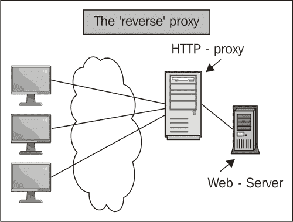
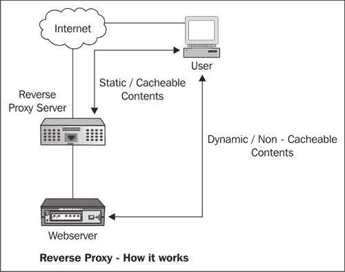
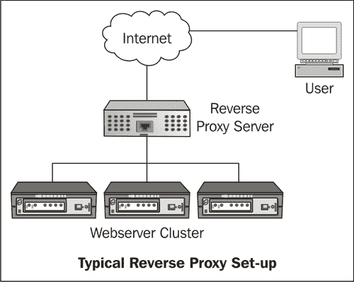

# 第七章 Nginx 作为反向代理

本章内容将涵盖：

+   使用 Nginx 作为一个简单的反向代理

+   使用 Nginx 作为反向代理设置 Rails 站点

+   设置正确的反向代理超时

+   在反向代理上设置缓存

+   为反向代理使用多个后端

+   使用 thttpd 和 Nginx 提供 CGI 文件

+   设置负载均衡与反向代理

+   基于各种条件使用 split-clients 拆分请求

# 介绍

Nginx 已经成为大多数应用作为反向代理使用的解决方案，尤其是对于许多网站。反向代理是一种代理服务器，它为客户端从一个或多个服务器检索资源。这些资源被返回给客户端，就像它们来自于代理服务器本身一样。

由于其事件驱动架构和 C 语言代码库，它比许多其他更知名的解决方案消耗显著更低的 CPU 和内存。本章将讲解如何在各种常见场景中使用 Nginx 作为反向代理。我们将探讨如何设置 Rails 应用，配置负载均衡，并且还将了解如何使用 Nginx 进行缓存设置，这将有可能在不改变代码库的情况下提升现有站点的性能。

# 使用 Nginx 作为一个简单的反向代理

Nginx 在最简单的形式下可以作为任何站点的反向代理；它作为一个中介层，用于安全、负载分配、缓存和压缩等目的。实际上，它可以通过将来自请求的负载分配到多个后端服务器，并缓存静态内容和动态内容，从而在不改变应用源代码的情况下，潜在地提升站点对最终用户的整体质量。



## 如何操作...

你需要首先定义`proxy.conf`，它将在我们设置的反向代理的主配置中被包含：

```
proxy_redirect off;
proxy_set_header Host $host;
proxy_set_header X-Real-IP $remote_addr;
proxy_set_header X-Forwarded-For $proxy_add_x_forwarded_for;
client_max_body_size 10m;
client_body_buffer_size 128k;
proxy_connect_timeout 90;
proxy_send_timeout 90;
proxy_read_timeout 90;s
proxy_buffers 32 4k

```

要使用 Nginx 作为运行在服务器本地端口上的站点的反向代理，以下配置即可满足需求：

```
server {
listen 80;
server_name example1.com;
access_log /var/www/example1.com/log/nginx.access.log;
error_log /var/www/example1.com/log/nginx_error.log debug;
location / {
include proxy.conf;
proxy_pass http://127.0.0.1:8080;
}
}

```

## 如何操作...

在本教程中，Nginx 简单地作为代理，指向运行在服务器 8080 端口上的后端服务器，该服务器可以是任何 HTTP Web 应用程序。稍后的章节中，我们将探讨其他高级教程，介绍如何定义更多后端服务器，以及如何设置它们来响应请求。

# 使用 Nginx 作为反向代理设置 Rails 站点

在本教程中，我们将设置一个工作中的 Rails 站点，并让 Nginx 在应用程序之上工作。假设读者已经具备一定的 Rails 和 thin 知识。还有其他运行 Nginx 和 Rails 的方法，例如使用 Passenger Phusion。


## 如何操作...

这将要求你首先设置 thin，然后为你的应用配置 thin，最后配置 Nginx。

1.  如果你已经安装了 gem，那么以下命令将安装 thin，否则你需要从源代码安装：

    ```
    sudo gem install thin

    ```

1.  现在你需要生成 thin 配置。这将会在`/etc/thin`目录下创建一个配置文件：

    ```
    sudo thin config -C /etc/thin/myapp.yml -c /var/rails/myapp --servers 5 -e production

    ```

1.  现在你可以启动 thin 服务。根据你的操作系统，启动命令会有所不同。

1.  假设你已经安装了 Nginx，你需要将以下内容添加到配置文件中：

    ```
    upstream thin_cluster {
    server unix:/tmp/thin.0.sock;
    server unix:/tmp/thin.1.sock;
    server unix:/tmp/thin.2.sock;
    server unix:/tmp/thin.3.sock;
    server unix:/tmp/thin.4.sock;
    }
    server {
    listen 80;
    server_name www.example1.com;
    root /var/www.example1.com/public;
    location / {
    proxy_set_header X-Real-IP $remote_addr;
    proxy_set_header X-Forwarded-For $proxy_add_x_forwarded_for;
    proxy_set_header Host $http_host;
    proxy_redirect false;
    try_files $uri $uri/index.html $uri.html @thin;
    location @thin {
    include proxy.conf;
    proxy_pass http://thin_cluster;
    }
    }
    error_page 500 502 503 504 /50x.html;
    location = /50x.html {
    root html;
    }
    }

    ```

### 它是如何工作的...

这是一个相对简单的 Rails 堆栈，我们基本上配置并运行五个上游的 thin 线程，它们通过套接字连接与 Nginx 交互。

这里有几个重写规则，确保 Nginx 提供静态文件，并且所有动态请求都由 Rails 后端处理。还可以看到我们如何正确设置代理头，以确保客户端 IP 能够正确传递给 Rails 应用程序。对于许多应用程序来说，能够访问客户端 IP 以展示地理位置相关信息非常重要，记录这个 IP 有助于识别当网站在某些特定客户端上无法正常工作时是否存在地理位置问题。

# 设置正确的反向代理超时时间

在这一部分中，我们将设置正确的反向代理超时时间，这将影响当你的后端应用程序无法响应客户端请求时，用户的交互体验。

在这种情况下，建议设置一些合理的超时页面，让用户了解进一步刷新可能只会加重 Web 应用程序的问题。

## 如何操作...

首先，你需要设置`proxy.conf`，该配置稍后将被包含在配置中：

```
proxy_redirect off;
proxy_set_header Host $host;
proxy_set_header X-Real-IP $remote_addr;
proxy_set_header X-Forwarded-For $proxy_add_x_forwarded_for;
client_max_body_size 10m;
client_body_buffer_size 128k;
proxy_connect_timeout 90;
proxy_send_timeout 90;
proxy_read_timeout 90;s
proxy_buffers 32 4k

```

反向代理超时是一些相当简单的标志，我们需要在 Nginx 配置中设置，就像以下示例一样：

```
server {
listen 80;
server_name example1.com;
access_log /var/www/example1.com/log/nginx.access.log;
error_log /var/www/example1.com/log/nginx_error.log debug;
#set your default location
location / {
include proxy.conf;
proxy_read_timeout 120;
proxy_connect_timeout 120;
proxy_pass http://127.0.0.1:8080;
}
}

```

## 它是如何工作的...

在之前的配置中，我们设置了以下变量，结合配置内容可以很清楚地看出这些变量的作用：

| 指令 | 用途 |
| --- | --- |
| `proxy_read_timeout` | 此指令设置代理服务器响应的读取超时时间。它决定了 Nginx 等待请求响应的时间。超时不适用于整个响应，而仅限于两个读取操作之间。 |
| `proxy_connect_timeout` | 此指令设置与上游服务器传输请求时的超时时间。超时不是针对整个请求传输，而仅适用于两个写操作之间。如果在这段时间内上游服务器没有接收新数据，那么 Nginx 将关闭连接。 |

# 在反向代理上设置缓存

在 Nginx 作为客户端和后台 Web 应用之间的层时，显然缓存是可以带来的一个好处。在本篇中，我们将了解如何为任何由 Nginx 执行反向代理的站点设置缓存。由于极小的占用空间和模块化架构，Nginx 已成为现代 Web 堆栈的瑞士军刀。



## 如何实现...

这个示例配置展示了如何在使用 Nginx 作为反向代理 Web 服务器时启用缓存：

```
http {
proxy_cache_path /var/www/cache levels=1:2 keys_zone=my-cache:8m max_size=1000m inactive=600m;
proxy_temp_path /var/www/cache/tmp;
...
server {
listen 80;
server_name example1.com;
access_log /var/www/example1.com/log/nginx.access.log;
error_log /var/www/example1.com/log/nginx_error.log debug;
#set your default location
location / {
include proxy.conf;
proxy_pass http://127.0.0.1:8080/;
proxy_cache my-cache;
proxy_cache_valid 200 302 60m;
proxy_cache_valid 404 1m;
}
}
}

```

## 它是如何工作的...

这个配置实现了一个简单的缓存，最大大小为 1000MB，并且将所有 HTTP 响应 200 页缓存 60 分钟，HTTP 响应 404 页缓存 1 分钟。

有一个初始指令会在初始化时创建缓存文件，之后的指令基本上配置将要被缓存的位置。

### 提示

实际上，可以为多个位置设置多个缓存路径。

## 还有更多...

这只是代理模块缓存功能可以实现的一部分展示。以下是一些在优化并提升堆栈效率时非常有用的指令：

| 指令 | 用法 |
| --- | --- |
| `proxy_cache_bypass` | 此指令指定在什么条件下不会从缓存中获取响应。如果某个字符串变量不为空且不等于“0”，则响应不会从缓存中获取。 |
| `proxy_cache_min_uses` | 此指令决定了页面被缓存前的访问次数。 |
| `proxy_cache_use_stale` | 此指令告诉 Nginx 何时从代理缓存中提供过期项。例如，当发生应用程序错误 HTTP 代码 500 时。 |
| `proxy_cache_methods` | 此指令允许你选择缓存哪些指令 [GET、PUT 等]。 |

# 使用多个后台处理反向代理

随着流量的增加，扩展站点的需求变得越来越迫切。使用像 Nginx 这样的透明反向代理在前端，绝大多数用户甚至不会感知到扩展对他们与网站交互的影响。通常，对于较小的网站，一个后台进程足以处理流量。随着网站流量的增加，第一个解决方案是增加后台进程的数量，让 Nginx 处理客户端请求的多路复用。本篇将介绍如何为 Nginx 添加新的后台进程。



## 如何实现...

以下配置添加了三个上游服务器，客户端请求将被发送到这些服务器进行处理：

```
upstream backend {
server backend1.example1.com weight=5;
server backend2.example1.com max_fails=3 fail_timeout=30s;
server backend3.example1.com;
}
server {
listen 80;
server_name example1.com;
access_log /var/www/example1.com/log/nginx.access.log;
error_log /var/www/example1.com/log/nginx_error.log debug;
#set your default location
location / {
include proxy.conf;
proxy_pass http://backend;
}
}

```

## 它是如何工作的...

在这个配置中，我们设置了一个上游，这只是一些带有代理参数的服务器集合。对于服务器`http://backend1.example1.com`，我们设置了一个权重为 5，这意味着大多数请求将被指向该服务器。这在有些强大的服务器和一些较弱的服务器的情况下非常有用。对于下一个服务器`http://backend2.example1.com`，我们设置了这样的参数：在 30 秒内三次失败请求将导致该服务器被认为不可用。最后一个是一个普通的基础设置，其中在十秒的窗口内一次错误将使服务器不可用！

这展示了 Nginx 设计背后的深思熟虑。它无缝地处理那些存在问题的服务器，并将它们放入不可用服务器的集合中。所有请求都会以轮询方式发送到服务器。我们将在未来的教程中讨论一些模块，它们可以基于服务器负载和其他上游服务器性能指标，使用其他队列机制来发送请求。

# 使用 thttpd 和 Nginx 提供 CGI 文件

在互联网历史的某个时刻，大多数应用都是基于 CGI 的。Nginx 本身不提供 CGI 脚本服务，因此解决方法是使用一个非常高效且简单的 HTTP 服务器——thttpd，并让 Nginx 作为代理来处理它。

## 如何操作……

最好的做法是从源代码安装 thttpd，应用 IP 转发补丁，然后使用以下配置：

1.  下载 thttpd 并应用补丁。

    ```
    wget http://www.acme.com/software/thttpd/thttpd-2.25b.tar.gz
    tar xvzf thttpd-2.25b.tar.gz

    ```

1.  将下面的代码保存为一个名为`thttpd.patch`的文件：

    ```
    --- thttpd-2.25b/libhttpd.c 2003-12-25 20:06:05.000000000 +0100
    +++ thttpd-2.25b-patched/libhttpd.c 2005-01-09 00:26:04.867255248 +0100
    @@ -2207,6 +2207,12 @@
    if ( strcasecmp( cp, "keep-alive" ) == 0 )
    hc->keep_alive = 1;
    }
    + else if ( strncasecmp( buf, "X-Forwarded-For:", 16 ) == 0 )
    + { // Use real IP if available
    + cp = &buf[16];
    + cp += strspn( cp, " \t" );
    + inet_aton( cp, &(hc->client_addr.sa_in.sin_addr) );
    + }
    #ifdef LOG_UNKNOWN_HEADERS
    else if ( strncasecmp( buf, "Accept-Charset:", 15 ) == 0 ||
    strncasecmp( buf, "Accept-Language:", 16 ) == 0 ||

    ```

1.  应用补丁并安装 thttpd：

    ```
    patch -p 1 -i thttpd.patch
    cd thttpd-2.25b
    make
    sudo make install

    ```

1.  使用以下配置来编辑`/etc/thttpd.conf`：

    ```
    # BEWARE : No empty lines are allowed!
    # This section overrides defaults
    # This section _documents_ defaults in effect
    # port=80
    # nosymlink # default = !chroot
    # novhost
    # nocgipat
    # nothrottles
    # host=0.0.0.0
    # charset=iso-8859-1
    host=127.0.0.1
    port=8000
    user=thttpd
    logfile=/var/log/thttpd.log
    pidfile=/var/run/thttpd.pid
    dir=/var/www
    cgipat=**.cgi|**.pl

    ```

1.  将 Nginx 设置为端口 8000 的代理。

    ```
    server {
    listen 80;
    server_name example1.com;
    access_log /var/www/example1.com/log/nginx.access.log;
    error_log /var/www/example1.com/log/nginx_error.log debug;
    location /cgi-bin {
    include proxy.conf;
    proxy_pass http://127.0.0.1:8000;
    }
    }

    ```

### 它是如何工作的……

上面的设置让你享受 CGI 和 Nginx 的最佳结合。你首先设置了 thttpd，它将在服务器的 8000 端口运行，实际上它将成为核心的 CGI Web 服务器，你可以将 Nginx 作为用户请求的代理。

你需要做的就是将 Perl 脚本放在 `/var/www` 目录下，你就可以通过 Nginx 和 thttpd 运行 CGI。

### 提示

你也可以使用与上述相同的技术，使用其他支持 CGI 的服务器（如 Apache 和 lightHTTPD）运行 CGI 脚本。你只需将这些服务器的操作端口更改为 8000，按照上述配置即可运行。

# 使用反向代理设置负载均衡

在大多数反向代理系统中，人们希望系统能够进行负载均衡。在之前的一个教程中，我们已经看到如何设置和运行多个上游服务器，并以轮询机制发送请求。

在这个教程中，我们将安装一个负载均衡模块，它将允许我们对上游服务器进行公平的负载均衡设置。


## 如何操作……

对于这个特定的教程，我们将安装一个名为“上游公平模块”的第三方模块。

1.  你需要去下载这个模块：

    ```
    wget https://github.com/gnosek/nginx-upstream-fair/tarball/master

    ```

1.  编译带有新模块的 Nginx：

    ```
    Tar xvzf nginx-upstream-fair.tgz
    Cd nginx
    ./configure --with-http_ssl_module --add-module=../nginx-upstream-fair/
    Make && make install

    ```

1.  你需要在 `nginx.conf` 中添加以下配置：

    ```
    upstream backend {
    server backend1.example1.com;
    server backend2.example1.com;
    server backend3.example1.com;
    fair no_rr;
    }
    server {
    listen 80;
    server_name example1.com;
    access_log /var/www/example1.com/log/nginx.access.log;
    error_log /var/www/example1.com/log/nginx_error.log debug;
    #set your default location
    location / {
    proxy_pass http://backend;
    }
    }

    ```

### 它是如何工作的...

一旦你理解了如何设置多个上游服务器的基础知识，设置起来就相当直接。在这个特别的“公平”模式下，`no_rr`，服务器会在空闲时将请求发送到第一个后端。这个模块的目标是避免将请求发送到已经繁忙的后端，因为它会跟踪当前后端已经处理的请求数。这个模型比默认的轮询模式要好得多，因为默认的轮询模式会均匀地分配请求，而忽略了后端服务器的负载情况。

### 还有更多...

你可以根据需求选择以几种模式运行这个负载均衡模块！这是确保所有后端负载均衡的一种非常简单的方法，避免某个后端比其他后端负载重：

| 模式 | 含义 |
| --- | --- |
| 默认（即公平模式） | 默认模式是一个简单的 WLC-RR（加权最小连接轮询）算法，唯一的限制是加权部分在低负载下并不太公平。 |
| `no_rr` | 这意味着每当第一个后端空闲时，它将接收下一个请求。如果它忙碌，请求将转到第二个后端，除非它也忙碌，以此类推。 |
| `weight_mode=idle no_rr` | 这个模式重新定义了“空闲”的含义。现在它意味着“少于权重的并发请求”。这样你可以轻松地对后端进行基准测试，并确定 **X** 并发请求是你的最大负载。 |
| `weight_mode=peak` | 这意味着 Nginx 永远不会将超过权重的请求发送到单个后端。如果所有后端都满负荷，您将开始收到 502 错误。 |

下面是一个峰值权重模式设置的示例：

```
upstream backend {
server backend1.example1.com weight=4;
server backend2.example1.com weight=3;
server backend3.example1.com weight=4;
fair weight_mode=idle no_rr;
}

```

# 使用 split-clients 根据不同条件拆分请求

本教程将探讨如何根据可能出现的不同条件来分离客户端请求。

我们还将了解如何使用这个模块设置一个简单的 A-B 测试页面。


## 如何操作...

这个模块使用起来相当简单，并且已内置在 Nginx 中。你需要做的就是在 `nginx.conf` 中插入以下配置：

```
http {
split-clients "${remote-addr}AAA" $variant {
50.0% .one;
50,0% .two;
- "";
}
...
server {
listen 80;
server_name example1.com;
access_log /var/www/example1.com/log/nginx.access.log;
error_log /var/www/example1.com/log/nginx_error.log debug;
location / {
root /var/www/example1.com;
index index${variant}.html;
}
}
}

```

## 它是如何工作的...

这个配置设置了一个系统，它基于远程客户端地址，并将 `.one`、`.two` 或 `""` 的值分配给变量 `$variant`。根据变量值，系统会从文件位置选择不同的页面。

以下表格显示了从上面的配置中得到的各种概率和操作：

| 变量值 | 概率 | 服务页面 |
| --- | --- | --- |
| `.one` | 50% | `/var/www/example1.com/index.one.html` |
| `.two` | 50% | `/var/www/example1.com/index.two.html` |
| `""` | 0% | `/var/www/example1.com/index.html` |


前面的饼图清晰地展示了两页之间的分割。采用这种方法，我们能够测试您所做的页面更改与页面交互的效果。这构成了可用性测试的基础。
