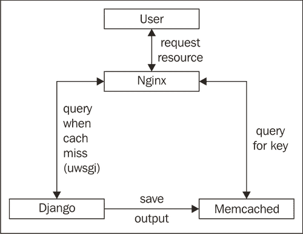
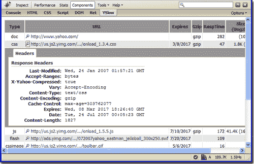
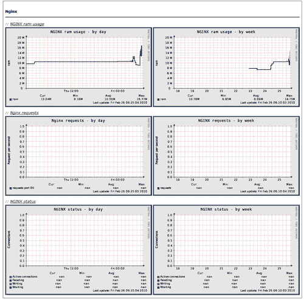
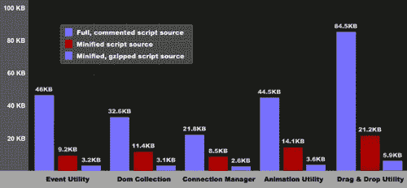
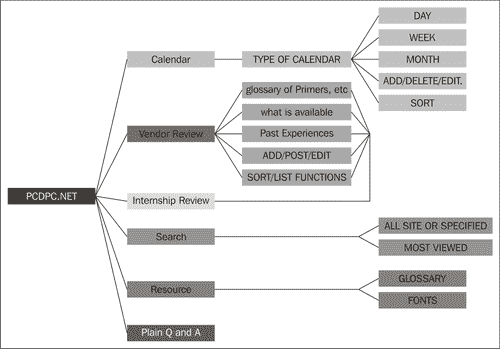
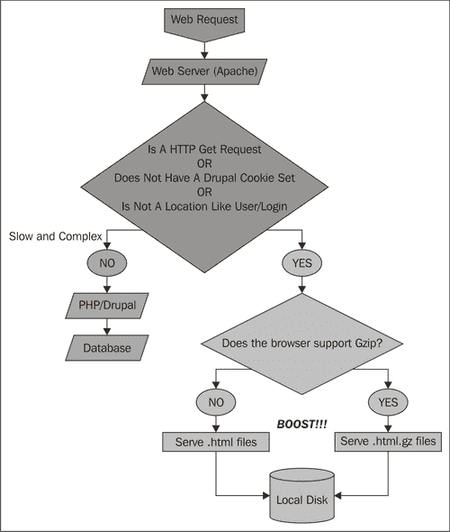
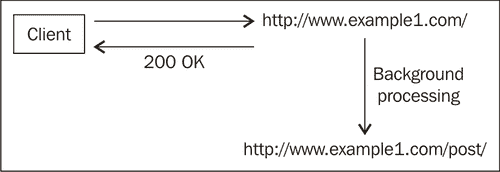

# 第八章：使用 Nginx 提高性能和 SEO

在本章中，我们将涵盖：

+   正确设置 TCP 选项以优化性能

+   减少 keep-alive 连接以释放 Nginx 工作进程

+   使用 Memcached 作为缓存后端

+   配置正确的事件模型和文件限制

+   为客户端缓存设置 max-age 过期头

+   阻止爬虫、机器人和蜘蛛以节省带宽

+   将 www 重定向到非 www 域名以优化 SEO

+   从响应中去除所有空白字符

+   设置服务器状态以便监控

+   设置 Munin 进行 24x7 Nginx 监控

+   启用 gzip 预压缩

+   使用 Nginx 防止热链接

+   使用嵌入式 Perl 来压缩 JavaScript 文件

+   使用嵌入式 Perl 来压缩 CSS 文件

+   使用嵌入式 Perl 来提供站点地图（SEO）

+   在 Drupal 上使用 Nginx 设置 Boost 模块

+   设置 Flash 文件的流媒体

+   利用 1x1 gif 服务模块进行离线处理

# 介绍

本章的内容将讲述如何让你的网站加载更快，并可能为你带来更多流量。我们将涵盖优化 Nginx 配置的基础知识和一些 SEO 技巧。这些技巧不仅对 SEO 有帮助，也对你网站和应用的整体健康有益。

# 正确设置 TCP 选项以优化性能

Nginx 提供了一些简单的方式来调整 TCP 选项，具体取决于你的服务器操作系统，这将允许你的网站更快加载。我们将查看可能的选项及其影响。

## 如何操作...

以下配置将优化你的 Linux 设置：

```
user www-data;
worker_processes 1;
error_log /var/log/nginx/error.log;
pid /var/run/nginx.pid;
events {
worker_connections 1024;
}
http {
include /etc/nginx/mime.types;
default_type application/octet-stream;
access_log /var/log/nginx/access.log;
sendfile on;
tcp_nodelay on;
tcp_nopush off;
…
}

```

## 它是如何工作的...

我们使用以下指令，在下表中可以看到它们的实际用途：

| 指令 | 用法 |
| --- | --- |
| `tcp_nodelay` | 此指令允许或禁止使用套接字选项`TCP_NODELAY`。根据定义，`TCP_NODELAY`有一个特定的目的；禁用 Nagle 缓冲算法。它应仅为那些发送频繁小的突发信息且没有立即响应的应用程序设置；当数据的及时交付是必需的时（经典示例为鼠标移动）。 |
| `tcp_nopush` | 这个指令允许或禁止在 FreeBSD 上使用 `TCP_NOPUSH` 套接字选项，或在 Linux 上使用 `TCP_CORK`。这个选项只有在使用 sendfile 时可用。启用此选项后，Nginx 会尝试在 Linux 和 FreeBSD 4.x 上以一个数据包发送 HTTP 响应头。在 Linux 上，Nginx 可以使用 `TCP_CORK` 套接字选项。来自 tcp(7) 手册：`TCP_CORK` 如果设置，不发送部分帧。所有排队的部分帧会在该选项被清除时发送。这对于在调用 sendfile(2) 之前预先发送头部或进行吞吐量优化非常有用。按当前实现，`TCP_CORK` 会将输出数据暂时封锁最多 200 毫秒。如果超过此时间限制，排队的数据会自动传输。此选项只能与 `TCP_NODELAY` 一起使用，自 Linux 2.5.71 起可用。此选项不应在打算移植的代码中使用。在 FreeBSD 上，Nginx 可以使用 `TCP_NOPUSH` 套接字选项，这启用 T/TCP 事务。这与上面的功能相似，但在许多版本的 FreeBSD 上已知速度较慢且存在一些问题。 |

# 减少 keep-alive 以释放 Nginx 工作进程

你是否开始感觉到很多 Nginx 进程被占用，但你的网站实际上并没有很高的流量？这个简单的调整可以让你在用户在某个页面停留较长时间后，优化你的 Nginx 设置，尤其是在用户切换到下一个页面之前。

## 如何实现...

这又是一个相对简单的配置文件修改，代码如下所示：

```
user www-data;
worker_processes 1;
error_log /var/log/nginx/error.log;
pid /var/run/nginx.pid;
events {
worker_connections 1024;
}
http {
include /etc/nginx/mime.types;
default_type application/octet-stream;
access_log /var/log/nginx/access.log;
. . .
#keepalive_timeout 65;
keepalive_timeout 3;
. . .
}

```

## 如何运作...

这个简单的指令实际上设置了请求后与客户端保持连接的时间。例如，在前述设置中，连接将在服务完客户端请求后等待三秒钟，等待来自客户端的下一个请求（并在此过程中忽略其他客户端）。

这个想法是找到一个合适的时间点，在此之后如果你关闭连接，Nginx 就不会不必要地忽略很多请求。这样可以提高 Nginx 连接管理的效率。

# 使用 Memcached 作为缓存后端

在过去的几年里，Memcached 成为了几乎每个大型门户网站最常使用的缓存层。值得注意的是，几乎每个平台都已经进化为支持 Memcached 作为默认的缓存机制。Nginx 也不落后，它可以利用 Memcached 的所有强大功能作为缓存后端。

## 如何实现...

Memcached 模块默认已编译进 Nginx。在此我们假设本地 Memcached 实例正在 11211 端口运行。以下配置将允许你运行一个简单的缓存设置：

```
server {
server_name www.example1.com;
location / {
set $memcached_key $uri;
memcached_pass 127.0.0.1:11211;
default_type text/html;
error_page 404 @fallback;
}
location @fallback {
proxy_pass http://backend;
}
}

```

## 如何运作...

这是一个相当简单的设置，其中整个站点都缓存到 Memcached 中。其思路是，当 Nginx 接收到某个 URL 的查询时，会检查 Nginx 是否已将相应的页面加载到内存中。如果有，它将直接从内存中提供服务；否则，我们会调用站点的动态后端。

### 备注

然而，需要注意的是，你需要将页面的输出保存到内存中，以便 Nginx 能够从 Memcached 中查询它。以下图表展示了在像 Django（Python）这样的框架中，如何实际操作这一过程。



# 配置正确的事件模型和文件限制

Nginx 是一个事件驱动的 Web 服务器，它总是尽力利用父操作系统中的底层事件模型来高效地运行。我们将看到根据所使用的操作系统提供的各种选择。此外，我们还将查看如何在配置中修改文件描述符的限制。

## 如何实现...

这个简单的配置更改就足以调整事件模型和文件限制。然而，你还需要修改 Linux 中的`sysctl.conf`以及其他操作系统中的相应配置，以增强底层的文件限制，否则以下设置将被忽略：

```
user www-data;
worker_processes 1;
worker_rlimit_nofile 206011;
error_log /var/log/nginx/error.log;
pid /var/run/nginx.pid;
events {
event select;
worker_connections 1024;
}
http {
...
}

```

## 它是如何工作的...

在当前的设置中，我们已为工作进程设置了较高的文件描述符限制。我们还明确选择了 Nginx 默认内置的 select 事件模型。你还可以根据所使用的操作系统选择 poll 事件模型或其他替代方案。以下表格列出了选择事件模型时可用的各种选项。

| Select 方法 | 操作系统 | 备注 |
| --- | --- | --- |
| `select` | 全部 | 默认编译的标准方法 |
| `poll` | 全部 | 默认编译的标准方法 |
| `kqueue` | FreeBSD 4.1+，OpenBSD 2.9+，NetBSD 2.0 和 MacOS X | 使用双处理器的 MacOS X 机器时，使用 kqueue 可能导致内核崩溃 |
| `epoll` | Linux 2.6+ | 在某些发行版中，如 SuSE 8.2，通过 2.4 版本内核有补丁支持 epoll |
| `rtsig` | Linux 2.2.19+ | 默认情况下，系统中最多只能有 1024 个 POSIX 实时（排队）信号 |
| `/dev/poll` | Solaris 7 11/99+，HP/UX 11.22+（eventport），IRIX 6.5.15+ 和 Tru64 UNIX 5.1A+ |   |
| `eventport` | Solaris 10 | 为避免内核崩溃，需要安装此安全补丁 |

# 为客户端缓存设置 max-age 过期头部

在反向代理设置中，像 Nginx 这样的前端 Web 服务器的最重要任务之一是服务静态文件。这是 Web 管理员工具箱中最有效的优化之一。在此，我们将静态文件的客户端缓存过期时间设置为一个非常高的值，远在未来。这确保了如果用户频繁访问该站点，静态文件（如图片、CSS 和 JavaScript 文件）不会再次被下载。这带来了更好的网站交互体验。

如果你经常使用开发插件，如 Firebug（你可以在[`getfirebug.com`](http://getfirebug.com)查看），它们会显示加载页面时下载文件的头部，如下图所示。这展示了在 Yahoo!网站上下载的 CSS 文件示例：



## 如何实现……

这是一个简单的配置更改，需要在服务静态文件的定位指令中进行：

```
location ~* \.(jpg|jpeg|gif|css|png|js|ico|html)$ {
expires max;
}
location / {
...
proxy_pass http://backend;
}

```

## 它是如何工作的……

这是一个相当简单的指令，如果文件是静态文件，比如 CSS、JS 或任何图片文件，我们只需要将文件返回，并设置`Expires`头部为未来的某个时间。这将确保文件保持在客户端浏览器的缓存中，并且当用户将来再次访问相同页面时，不会不必要地重新加载该文件。

像这些静态文件在大多数站点上不会改变，而定义内容结构的 HTML 则可能非常动态。这也防止了网站所有者的不必要带宽使用。

### 注意

你必须记住，很多时候你需要修改静态文件，所以在这些情况下，你需要添加一个随机/不同的查询字符串变量，以强制客户端下载静态文件的最新版本。

# 阻止爬虫、机器人和蜘蛛来节省带宽

如果你曾经查看过访问日志，你会看到一大堆看起来相当奇怪的用户代理访问你的网站。除了 Google、Microsoft Bing 和 Yahoo!等大型搜索引擎，其他的机器人在今天的全球 SEO 大局中几乎是没有必要的。在这个方案中，我们将阻止大量其他的内容窃取者，从而节省你宝贵的带宽。

这还会阻止一大堆评论机器人，它们会发送丑陋且不必要的评论来破坏你的网站。

## 如何实现……

你需要在位置指令中添加以下内容，以防止爬虫、机器人和蜘蛛的访问。我们将从一个较小的用户代理列表开始进行阻止，并且可以在确认其效果后再添加其他内容。

```
location / {
...
if ($http_user_agent ~* aesop_com_spiderman|alexibot|backweb|bandit|batchftp|bigfoot|black.?hole|blackwidow|blowfish|botalot|buddy|builtbottough|bullseye|cheesebot|cherrypicker|chinaclaw|collector|copier|copyrightcheck|cosmos|crescent|curl|custo|da|diibot|disco|dittospyder|dragonfly|drip|easydl|ebingbong|ecatch|eirgrabber) {
rewrite ^/ http://www.example1.com/robots.txt;
}
proxy_pass http://backend;
}

```

## 它是如何工作的……

这一系列规则有效地查看 HTTP 用户代理，并将其与一个“已知恶意”用户代理列表进行比较，通过将请求重定向到 `robots.txt` 文件来拒绝它们。这也确保你不会浪费计算时间和带宽在机器人身上，而这些时间和带宽可以用于为用户提供更高质量的服务。

通过阻止网站上的垃圾评论，你也有效地确保你的 SEO 不会受到它们注入的色情或不当内容的影响。

# SEO 的 www 到非 www 域名重定向

大多数人没有意识到 [www.example1.com](http://www.example1.com) 对于搜索引擎来说与 `example1.com` 不同。从技术上讲，它们是完全独立的实体。所有搜索引擎都有算法来检测抄袭内容，并将剽窃内容的人排除在外。在这种情况下，至关重要的是，人们必须实际使用 [www.example1.com](http://www.example1.com) 或 [example1.com](http://example1.com) 作为他们站点的操作域名。

关于哪种方式更好的判断取决于具体的使用案例；纯粹主义者认为 www 版本代表了所有互联网用户正确的子域名。也可以争辩说，在这个几乎每个单词都使用缩写的时代，额外的字符是多余的，甚至可能影响你站点的受欢迎程度。在这个方案中，我们将坚持使用非 www 作为主域名，并强制所有 www 页面重定向到非 www 页面。

## 如何操作...

我们将插入以下配置到 http 指令中，将所有 `http://example1.com` 请求重定向到 `http://www.example1.com`：

```
server {
listen 80;
server_name example1.com;
location / {
...
}
}
server {
listen 80;
server_name www.example1.com;
rewrite ^ http://example1.com$uri permanent;
}

```

## 它是如何工作的...

这是一个简单的重写规则，适用于所有基于 www 的请求，它们会被重定向到非 www URL。这确保了搜索引擎只会抓取页面的一个版本。

# 去除响应中的所有空白字符

这听起来可能有点荒谬，但空白字符在网站传输的文件中占据了很大一部分。可以说，如果你使用了 GZIP 压缩，那么这就不是问题，但如果你希望从你的配置中获得最大收益，那么每个细节都至关重要。这个方案将帮助你去除所有不必要的空白字符，避免浪费宝贵的开发时间去做同样的事。

## 如何操作...

这个简单的指令将允许你去除 HTML 中的空白字符。你首先需要安装 `mod_strip` 模块。

1.  你首先需要下载该模块并解压：

    ```
    wget http://wiki.nginx.org/File:Mod_strip-0.1.tar.gz
    tar xvzf Mod_strip-0.1.tar.gz

    ```

1.  然后我们使用以下配置语句将模块编译到 Nginx 中：

    ```
    ./configure add-module=../Mod_strip-0.1
    make && make install

    ```

1.  我们然后将以下指令放入我们希望去除空格的站点位置部分：

    ```
    location / {
    strip on;
    . . .
    proxy_pass http://backend;
    }

    ```

### 它是如何工作的...

这是一个非常快速的模块，它有效地从 Nginx 提供的 HTML 中去除所有空白字符（空格、制表符和换行符）。与 GZIP 压缩结合使用，能显著提高页面加载速度。

# 设置服务器状态以进行监控

有时候，在一个活跃的生产环境中，不能实时处理日志以查看 Web 服务器统计信息。在这种情况下，Nginx 为你提供了一个简单的服务器状态页面。该页面将提供足够的信息，让你了解服务器当前的负载。

## 如何操作...

这个模块默认没有编译，所以我们首先会编译该模块，然后配置服务器状态存根。

1.  你需要重新编译 Nginx 并向配置选项添加以下标志：

    ```
    ./configure --with-http_stub_status_module
    make && make install

    ```

1.  然后，我们将继续使用配置来添加新的状态端点：

    ```
    location /nginx_status {
    stub_status on;
    access_log off;
    }

    ```

### 它是如何工作的...

这个简单的配置将创建一个页面 [`www.example1.com/nginx_status`](http://www.example1.com/nginx_status)，该页面将提供有关你的网站服务器负载的统计信息。以下是你可能在页面上看到的示例：

我们还可以通过查看 第五章中的*设置 HTTP 身份验证进行访问控制*食谱来设置此页面的访问控制，这将允许你设置 HTTP 身份验证。

```
Active connections: 291
server accepts handled requests
16630948 16630948 31070465
Reading: 6 Writing: 179 Waiting: 106

```

以下表格解释了服务器状态输出的含义。

| 统计 | 含义 |
| --- | --- |
| 活跃连接数 | 与后台的打开连接数 |
| 服务器接受的处理请求数 | Nginx 接受了 16630948 个连接，并处理了 16630948 个连接，服务了 31070465 个请求 |
| 读取 | Nginx 正在读取的请求数 |
| 写入 | 正在处理或正在写回到客户端的请求 |
| 等待 | 与客户端保持活跃连接的连接数（KeepAlives） |

# 设置 Munin 以进行 24x7 Nginx 监控

在可能有多个服务器运行的生产环境中，使用顶级监控工具，如 Munin 是非常必要的。这些工具能够帮助你汇总信息，并动态计算负载水平，从而让你全天候、每周七天都能保持对系统的监控。本食谱旨在为新手 Nginx 用户和经验丰富的系统管理员提供帮助。以下截图是 Munin 所生成的可视化示例：


## 如何操作...

本食谱有两个部分；第一部分是设置带有服务器存根模块的 Nginx。

1.  你需要重新编译 Nginx 并向配置选项添加以下标志：

    ```
    ./configure --with-http_stub_status_module
    Make && make install

    ```

1.  然后，我们将继续使用配置来添加新的状态端点：

    ```
    location /nginx_status {
    stub_status on;
    access_log off;
    }

    ```

现在，我们将继续安装 Munin 插件。请注意，我们假设你已经在系统上设置了 Munin。

1.  你首先需要下载插件：

    ```
    cd /usr/share/munin/plugins
    sudo wget -O nginx_request http://exchange.munin-monitoring.org/plugins/nginx_request/version/2/download
    sudo wget -O nginx_status http://exchange.munin-monitoring.org/plugins/nginx_status/version/3/download
    sudo wget -O nginx_memory http://exchange.munin-monitoring.org/plugins/nginx_memory/version/1/download
    sudo chmod +x nginx_request
    sudo chmod +x nginx_status
    sudo chmod +x nginx_memory

    ```

1.  现在我们将插件链接到正确的目录：

    ```
    sudo ln -s /usr/share/munin/plugins/nginx_request /etc/munin/plugins/nginx_request
    sudo ln -s /usr/share/munin/plugins/nginx_status /etc/munin/plugins/nginx_status
    sudo ln -s /usr/share/munin/plugins/nginx_memory /etc/munin/plugins/nginx_memory

    ```

1.  将 Nginx 服务器存根 URL 添加到 Munin 配置中 (/etc/munin/plugin-conf.d/munin-node)。

    ```
    [nginx*]
    env.url http://localhost/nginx_status

    ```

1.  重启 munin-node：

```
sudo /etc/init.d/munin-node restart

```

现在，您应该能够在您的 Munin 安装中看到如下所示的截图：



## 它是如何工作的...

这个两部分的设置首先为 Nginx 安装服务器状态模块，该模块被 Munin 用于跟踪服务器负载。第二部分，我们安装了各种 Munin 插件，帮助有效地监控 Nginx。Munin 会不断轮询服务器状态并解析数据，收集相关信息来生成图表。这些简单的可视化效果可以帮助系统管理员进一步优化系统，并可能根据预测规划未来的硬件需求。

# 启用 GZIP 预压缩

我们已经看过了 GZIP 压缩如何大幅降低网站的加载时间。我们可以通过预先压缩我们希望提供的静态文件，进一步减少每次压缩文件时浪费的计算资源。本方法将自动帮助您提供预压缩的 gzip 版本静态文件。

## 如何操作...

您需要执行以下步骤来启用 gzip 预压缩模块并有效使用它。

1.  您需要重新编译 Nginx，并在配置选项中添加以下标志：

    ```
    ./configure --with-http_gzip_static_module
    Make && make install

    ```

1.  现在，您需要压缩各种静态文件（如果在 UNIX 系统上，使用 gzip 命令行工具），这样 Nginx 就可以在可能的情况下提供这些预压缩的文件。确保压缩文件放在与原始文件相同的目录中。

1.  对 Nginx 配置文件进行以下更改：

    ```
    http {
    . . .
    gzip_static on;
    gzip_http_version 1.1;
    gzip_proxied expired no-cache no-store private auth;
    gzip_disable "MSIE [1-6]\.";
    gzip_vary on;

    ```

### 它是如何工作的...

当该模块启用时，Nginx 每次从磁盘提供文件时，都会查找预压缩文件。其思想是避免每次花费更多的 CPU 时间来压缩内容。

# 使用 Nginx 防止热链接

许多多媒体驱动的网站面临着未经明确许可的情况下，别人链接和嵌入其内容的问题。这不仅有时会导致版权问题，还会导致带宽丧失而流量却未增加。这显然不是任何网站希望出现的情况。这个方法可以帮助您防止这种情况发生。

## 如何操作...

这个简单的规则将阻止其他网站链接到您的内容：

```
server {
server_name www.example1.com;
location ~* ^.+\.(jpg|jpeg|gif)$ {
valid_referers none blocked example1.com www.example1.com;
if ($invalid_referer) {
return 444;
}
}
...
}

```

## 它是如何工作的...

其背后的思想是设置一个正确的可接受的引用值列表，其余的将被拒绝。如果没有与此列表匹配的项，则变量`$invalid_referer`被设置为 1。`valid_referers`中的参数列表含义如下：

| 参数 | 含义 |
| --- | --- |
| 无 | 此值意味着当"refer"行不是请求头的一部分时，它是一个匹配项。 |
| 阻止 | 这意味着防火墙通过遮蔽引用头部。例如："Referer : XXXXXX"。 |

请注意，这种方法并不是防止热链接的绝对解决方案，因为伪造请求头比较容易。

# 使用嵌入式 Perl 来最小化 JavaScript 文件

本文将介绍如何在 Nginx 中使嵌入式 Perl 工作，并利用它来压缩 JavaScript 文件。压缩 JavaScript 文件的基本概念是通过去除不必要的空格和缩短变量名来减小文件的大小。当然，任何对 JavaScript 文件的压缩都不应影响网站的实际功能。

## 如何操作……

我们将从安装嵌入式 Perl 模块开始，然后继续配置设置以压缩 JavaScript 文件。

1.  你需要重新编译 Nginx，并在配置选项中添加以下标志：

    ```
    ./configure -with-http_perl_module
    Make && make install

    ```

1.  你需要在 Nginx 配置中添加以下内容，以开始使用嵌入式 Perl。这假设你已经从 CPAN 安装了 JavaScript 压缩库：

    ```
    http {
    perl_modules perl;
    perl_require Javascript/Minifier.pm;
    perl_require Minify.pm;
    root /var/www;
    server {
    server_name www.example1.com;
    location / {
    index index.html index.htm;
    }
    location ~ \.js$ {
    perl Minify::handler;
    }
    }
    }

    ```

1.  然后，你需要创建一个 Minify 处理器，该处理器将驻留在 `Minify.pm` 文件中。这是实际压缩 JavaScript 代码、缓存并提供生成的文件的功能。

    ```
    package Minify;
    use nginx;
    use JavaScript::Minifier qw(minify);
    sub handler {
    my $r=shift;
    my $cache_dir="/tmp"; # Cache directory where minified files will be kept
    my $cache_file=$r->uri;
    $cache_file=~s!/!_!g;
    $cache_file=join("/", $cache_dir, $cache_file);
    my $uri=$r->uri;
    my $filename=$r->filename;
    return DECLINED unless -f $filename;
    if (! -f $cache_file) {
    JavaScript filesminifying, with embedded Perlopen(INFILE, $filename) or die "Error reading file: $!";
    open(OUTFILE, '>' . $cache_file ) or die "Error writting file: $!";
    minify(input => *INFILE, outfile => *OUTFILE);
    close(INFILE);
    close(OUTFILE);
    }
    $r->sendfile($cache_file);
    return OK;
    }
    1;
    __END__

    ```

1.  现在，你可以直接重新启动 Nginx。你将开始注意到 `/tmp` 目录中出现了压缩过的 JavaScript 文件。

## 它是如何工作的……

这是一个相当有趣且简单的设置，基本上我们使用嵌入式 Perl 来压缩 JavaScript 文件并缓存它们。Perl 脚本非常智能，它确保压缩操作仅在最初进行一次，然后在每次请求后从硬盘提供该文件。

以下截图展示了不同的 Yahoo UI JavaScript 文件在压缩后的对比：



## 还有更多……

同样的方法也可以用于在 web 服务器内部进行许多其他实用活动。我们将在下一个食谱中看看如何使用非常相似的方法来压缩 CSS 文件。

# 使用嵌入式 Perl 压缩 CSS 文件

我们将看看如何在 Nginx 中使用嵌入式 Perl 来压缩 CSS 文件。这种简单的方法可以确保你在部署生产站点时不会浪费时间思考类似的优化。压缩 CSS 文件可以显著减小需要用户下载的资源文件大小。

## 如何操作……

我们将从安装嵌入式 Perl 模块开始，然后继续配置设置以压缩 JavaScript 文件。

1.  你需要重新编译 Nginx，并在配置选项中添加以下标志：

    ```
    ./configure --with-http_perl_module
    Make && make install

    ```

1.  你需要在 Nginx 配置中添加以下内容，以开始使用嵌入式 Perl。这假设你已经从 CPAN 安装了 CSS 压缩库：

    ```
    http {
    perl_modules perl;
    perl_require CSS/Minifier.pm;
    perl_require Minify.pm;
    root /var/www;
    server {
    location / {
    embedded PerlCSS files, minifying withindex index.html index.htm;
    }
    location ~ \.css$ {
    perl Minify::handler;
    }
    }
    }

    ```

1.  然后，你需要创建一个 Minify 处理器，它将驻留在 `Minify.pm` 文件中。这是实际压缩代码、缓存并提供生成的 CSS 文件的功能：

    ```
    package Minify;
    use nginx;
    use CSS::Minifier qw(minify);
    sub handler {
    my $r=shift;
    my $cache_dir="/tmp"; # Cache directory where minified files will be kept
    my $cache_file=$r->uri;
    $cache_file=~s!/!_!g;
    $cache_file=join("/", $cache_dir, $cache_file);
    my $uri=$r->uri;
    my $filename=$r->filename;
    return DECLINED unless -f $filename;
    if (! -f $cache_file) {
    open(INFILE, $filename) or die "Error reading file: $!";
    open(OUTFILE, '>' . $cache_file ) or die "Error writting file: $!";
    minify(input => *INFILE, outfile => *OUTFILE);
    close(INFILE);
    close(OUTFILE);
    }
    $r->sendfile($cache_file);
    return OK;
    }
    1;
    __END__

    ```

1.  现在，你可以直接重新启动 Nginx。你将开始注意到 `/tmp` 目录中出现了压缩过的 CSS 文件。

## 它是如何工作的……

在这个教程中，我们首先确保您安装了嵌入式 Perl 模块。然后，我们配置 Nginx 在查询 CSS 文件时运行一段 Perl 代码。Perl 脚本在第一次调用时会有效地压缩 CSS 文件，并且在后续调用中，从缓存位置提供压缩后的文件。

# 使用嵌入式 Perl 提供网站地图（SEO）

自从搜索引擎问世以来，SEO 在互联网经济中发挥了至关重要的作用。企业希望吸引更多的访客访问他们的网站，从而提高品牌知名度并创造更多销售产品/服务的机会。搜索引擎索引网站信息时，最基本的概念之一就是网站地图。网站地图其实就是网站上所有潜在链接的目录。它还为特定页面的更改频率分配权重，确保搜索引擎能够定期访问该页面。

我们将看看如何使用 Nginx 正确提供您的网站地图。然后，您可以在 Google、Bing 和其他搜索引擎提供的各种站长工具中使用这些网站地图。



## 如何做...

在这个教程中，我们将首先设置一个网站地图生成器，然后将其与我们的 Nginx 设置集成，以正确生成和提供网站地图。

1.  在此，我们假设您能够设置 Python 网站地图生成器：([`sitemap-generators.googlecode.com/svn/trunk/docs/en/sitemap-generator.html`](http://sitemap-generators.googlecode.com/svn/trunk/docs/en/sitemap-generator.html))。

1.  现在，您可以继续将以下配置添加到您的 Nginx 设置中，以启用网站地图生成：

    ```
    http {
    include mime.types;
    default_type application/octet-stream;
    perl_modules perl;
    perl_require Sitemap.pm;
    keepalive_timeout 65;
    server {
    listen 80;
    server_name www.example1.com;
    location / {
    root html;
    index index.html index.htm;
    }
    location /sitemap.xml {
    perl Sitemap::handler;
    }
    }
    }

    ```

1.  现在我们需要放置 Perl 处理程序，这将允许您提供生成的网站地图：

    ```
    package Sitemap;
    use nginx;
    use LWP::Simple;
    our $basedir="/var/www/www.example1.com";
    sub handler {
    my $r=shift;
    my $cache_dir="/tmp"; # Cache directory where minified files will be kept
    my $cache_file=$r->uri;
    $cache_file=~s!/!_!g;
    $cache_file=join("/", $cache_dir, $cache_file);
    my $uri=$r->uri;
    my $filename=$r->filename;
    return DECLINED unless -f $filename;
    if (! -f $cache_file) {
    `python sitemap_gen.py` # Assumes that google sitemap generator is in the same directory
    }
    $r->sendfile($cache_file);
    return OK;
    }
    1;
    __END__

    ```

1.  现在，您只需重新启动 Nginx 并访问 [`www.example1.com/sitemap.xml`](http://www.example1.com/sitemap.xml)。

## 它是如何工作的...

这是一个相当有趣的设置，它基本上设置了 Google 网站地图生成器，然后在搜索引擎查询网站地图时使用它。Perl 代码相当简单，只有在找不到网站地图时才会被调用。它实际上调用了 Python 代码，这会生成网站地图并继续提供文件。

# 在 Drupal 上设置 Boost 模块与 Nginx 配合使用

Drupal 是目前领先的开源 CMS 应用之一。它在处理今天互联网上各种内容驱动的门户网站方面表现得极为出色，并将继续在这个市场中占据主导地位。与任何高性能平台一样，一个名为 Boost 的特定模块成为了系统管理员在希望扩展和优化其 Drupal 设置时的重要工具。在这个教程中，我们将研究如何利用包含 Boost 的 Drupal 设置，并使用 Nginx 强大的静态文件服务功能进行显著优化。



## 如何操作...

假设您已经安装并配置了 Boost 用于 Drupal。这是一个相当简单且文档齐全的设置，在线可以找到相关资料 ([`drupal.org/project/boost`](http://drupal.org/project/boost))。

1.  现在您已经安装了 Boost，并且 Nginx 作为前端 Web 服务器正在运行，使用 PHP-FCGI，您需要将以下配置放入 Nginx 的 sites-enabled 目录中：

    ```
    server {
    listen 80;
    server_name example1.com;
    access_log /var/log/nginx/example1.com.access.log;
    error_log /var/log/nginx/example1.com.error.log;
    root /var/www/example1.com;
    index index.php;
    location / {
    rewrite ^/(.*)/$ /$1 permanent; # remove trailing slashes
    try_files $uri @cache;
    }
    location @cache {
    if ( $request_method !~ GET ) {
    return 405;
    }
    if ($http_cookie ~ "DRUPAL_UID") {
    return 405;
    }
    error_page 405 = @drupal;
    expires epoch;
    add_header Cache-Control "must-revalidate, post-check=0, pre-check=0";
    Nginxboost module, setting up on Drupal withcharset utf-8;
    try_files /cache/$host${uri}_$args.html @drupal;
    }
    location @drupal {
    rewrite ^/(.*)$ /index.php?q=$1 last;
    }
    location ~* (/\..*|settings\.php$|\.(htaccess|engine|inc|info|install|module|profile|pl|po|sh|.*sql|theme|tpl(\.php)?|xtmpl)$|^(Entries.*|Repository|Root|Tag|Template))$ {
    deny all;
    }
    location ~ \.php$ {
    try_files $uri @drupal;
    fastcgi_pass 127.0.0.1:9000;
    fastcgi_index index.php;
    fastcgi_param SCRIPT_FILENAME $document_root$fastcgi_script_name;
    include /etc/nginx/fastcgi_params;
    }
    location ~ \.css$ {
    if ( $request_method !~ GET ) {
    return 405;
    }
    if ($http_cookie ~ "DRUPAL_UID") {
    return 405;
    }
    error_page 405 = @uncached;
    access_log off;
    Nginxboost module, setting up on Drupal withexpires max; #if using aggregator
    try_files /cache/$host${uri}_.css $uri =404;
    }
    location ~ \.js$ {
    if ( $request_method !~ GET ) {
    return 405;
    }
    if ($http_cookie ~ "DRUPAL_UID") {
    return 405;
    }
    error_page 405 = @uncached;
    access_log off;
    expires max; # if using aggregator
    try_files /cache/$host${uri}_.js $uri =404;
    }
    location @uncached {
    access_log off;
    expires max;
    }
    location ~* ^.+\.(jpg|jpeg|gif|png|ico)$ {
    if ($http_referer !~ ^(http://example1.com) ) { # prevent image hijacking
    return 444;
    }
    access_log off;
    expires 45d;
    try_files $uri =404;
    }
    }

    ```

1.  现在您需要做的就是重启 Nginx。

## 它是如何工作的...

此特定配置可以通过以下步骤进行查看。首先，当请求到达时，会检查 Boost 的物理缓存。如果在缓存中找到，它会返回给客户端。如果没有找到，它将 URL 重写为 Drupal 的`index.php`参数形式，并发起 PHP 调用。

这是一个高度优化的设置，因为它确保在可能的情况下使用 Nginx 提供静态文件。由于持续生成类似的页面显然是浪费宝贵的服务器资源，因此这将使您能够将精力集中在优化 Web 应用程序的更多前端部分。

# 设置 Flash 文件的流媒体传输

视频已经成为互联网上的主流格式。可以公平地说，Flash 在过去几年里推动了这一趋势。YouTube ([`youtube.com`](http://youtube.com)) 就是 FLV 流媒体视频网站的一个典型例子。在本教程中，我们将看看设置 Flash 视频流播放有多简单。


## 如何操作...

在这个简单的教程中，您首先需要重新编译 Nginx 并加入 FLV 模块，然后配置将提供 FLV 文件的目录。

1.  您需要重新编译 Nginx，并将以下标志添加到配置选项中：

    ```
    ./configure --with-http_flv_module
    Make && make install

    ```

1.  然后您需要将以下配置添加到您从中流式传输视频的目录位置：

    ```
    location ~ \.flv$ {
    flv;
    }

    ```

1.  然后您需要重启 Nginx。

## 它是如何工作的...

这是一个相当简单的设置，您不需要做太多工作就能在短时间内实现 FLV 流式传输。该模块允许您使用基于时间的偏移量在 FLV 文件中进行查找。这意味着用户能够从视频的中间位置开始播放视频并执行其他类似的视频时间轴操作。

# 利用 1x1 GIF 服务模块进行离线处理

有时我们会遇到后端处理花费的时间超过必要的情况，客户端不得不不必要地等待响应。本教程探讨了一种方法，可以对 URL 进行非阻塞调用，可能让您更快地将响应发送回用户的浏览器，同时确保后台处理仍然进行。

它还用于提供一个空的 GIF，可以用于基于表格的 HTML 设计中的间距。

## 如何操作...

您只需要使用以下配置来实现一个简单的示例：

```
upstream backend {
. . .
}
server {
server_name www.example1.com;
. . .
location / {
empty_gif;
post_action /post;
}
location = /post {
internal;
proxy_pass http://backend;
}
}

```

## 它是如何工作的...

这是一个简单的例子，当有人访问网站时，[`www.example1.com`](http://www.example1.com)会立即返回一个 1x1 的 GIF 图像。反过来，这实际上会触发一个 POST 请求，访问[`www.example1.com/post`](http://www.example1.com/post)，这是一个仅限内部使用的调用。该网页服务器调用将执行所需的任何后台活动，而客户端则已经收到了 200OK 响应。


