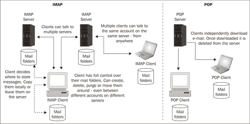
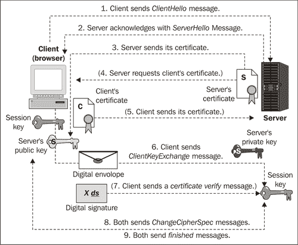
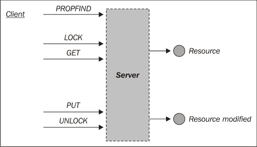
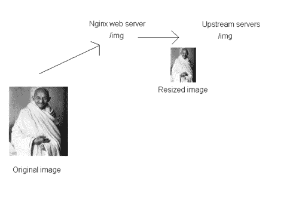
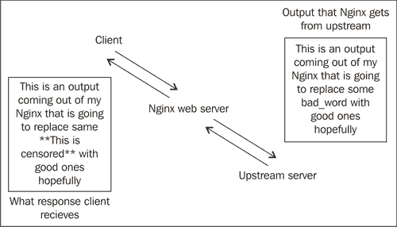
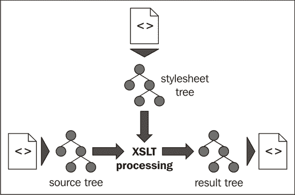
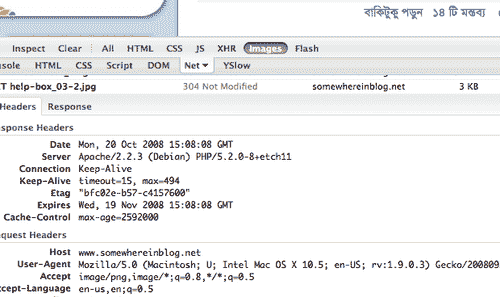
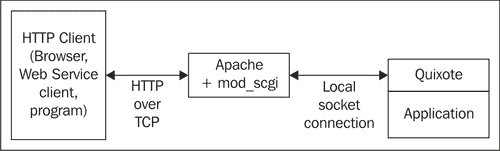

# 第九章：使用其他第三方模块

本章内容包括：

+   设置 IMAP/POP3 代理服务器

+   设置邮件服务的认证

+   设置 SSL 用于邮件认证

+   使用 Nginx 作为 WEBDAV 反向代理

+   使用 Nginx 动态调整图像大小

+   在 Nginx 响应中替换和搜索文本

+   动态组装 ZIP 文件

+   使用 Nginx 作为 HTTP 发布-订阅服务器

+   使用 XSLT 模板转换 XML 响应

+   为静态内容设置 Etags

+   简易记录页面加载时间

+   MP4/H.264 文件流式传输

+   设置 SCGI 站点

+   设置过期链接

# 介绍

本章将介绍一些内置的第三方模块，它们使我们能够将 Nginx 与其他协议一起使用，如 IMAP、POP3、WebDAV 等等。由于灵活且定义明确的模块 API，许多模块开发者已将 Nginx 用于一些有趣的基于 Web 的任务，例如 XSLT 转换、图像大小调整和 HTTP 发布-订阅服务器。

# 设置 IMAP/POP3 代理服务器

Nginx 最被低估的用途之一是作为邮件代理服务器。它理解 IMAP、SMTP 和 POP3 协议。在这个示例中，我们将设置 Nginx 作为你的测试 IMAP/POP3 服务器的代理。不过，你将需要一个认证脚本，该脚本基本上会返回一个重定向响应，将来访客户端引导到正确的 IMAP 或 POP3 服务器。



## 如何操作...

你需要在你的设置中放入以下配置：

```
mail {
auth_http localhost:9000/cgi-bin/auth;
proxy on;
imap_capabilities "IMAP4rev1" "UIDPLUS";
server {
listen 143;
protocol imap;
server_name imap.example1.com;
}
pop3_capabilities "TOP" "USER";
server {
listen 110;
protocol pop3;
server_name pop3.example1.com;
}
}

```

## 它是如何工作的...

该设置接受任何传入请求，并返回一个响应，列出必须连接的 POP3 或 IMAP 服务器。我们可以看到连接客户端必须具备的必要能力，以便与 POP3 或 IMAP 服务器正常工作。

认证端点将返回如下内容：

```
HTTP/1.0 200 OK
Auth-Status: OK
Auth-Server: 192.168.1.10
Auth-Port: 110
Auth-User: newname

```

这基本上告诉客户端，它们需要通过端口 110 连接到 192.168.1.10，才能继续与后端 POP3 服务器的交互。

# 设置邮件服务的认证

由于邮件是个人化的通讯方式，必然需要某种形式的认证。在这个例子中，我们将使用嵌入式 Perl 来进行认证。这是在后端通过一个包含用户和对应邮件服务器列表的表来驱动的。

## 如何操作...

启用 IMAP 和 POP3 支持所需的仅仅是将以下配置粘贴到 Nginx 配置中：

```
user nobody;
worker_processes 1;
error_log logs/error.log info;
pid logs/nginx.pid;
events {
worker_connections 1024;
multi_accept on;
}
http {
perl_modules perl/lib;
Nginxauthentication, setting up for mail servicesperl_require mailauth.pm;
server {
location /auth {
perl mailauth::handler;
}
}
}
mail {
auth_http 127.0.0.1:80/auth;
pop3_capabilities "TOP" "USER";
imap_capabilities "IMAP4rev1" "UIDPLUS";
server {
listen 110;
protocol pop3;
proxy on;
}
server {
listen 143;
protocol imap;
proxy on;
}

```

现在，你还需要在配置目录中创建一个名为 `mailauth.pm` 的文件，并粘贴以下代码：

```
package mailauth;
use nginx;
use DBI;
my $dsn="DBI:mysql:database=DBNAME;host=HOSTNAME";
our $dbh=DBI->connect_cached($dsn, 'dbusername', 'dbpass', {AutoCommit => 1});
our $sth=$dbh->prepare("select password,mail_server from mailaccounts where username=? limit 1");
our $auth_ok;
our $mail_server_ip={};
our $protocol_ports={};
$mail_server_ip->{'mailhost01'}="192.168.1.22";
$mail_server_ip->{'mailhost02'}="192.168.1.33";
$protocol_ports->{'pop3'}=110;
$protocol_ports->{'imap'}=143;
sub handler {
my $r = shift;
$auth_ok=0;
$sth->execute($r->header_in("Auth-User"));
Nginxauthentication, setting up for mail servicesmy $hash=$sth->fetchrow_hashref();
# assuming that the query results password and mail_server
# assuming that the password is in crypt format
if (crypt($r->header_in("Auth-Pass"), $hash->{'password'}) eq $r->header_in("Auth-Pass")){
$auth_ok=1;
}
if ($auth_ok==1){
$r->header_out("Auth-Status", "OK") ;
$r->header_out("Auth-Server", $mail_server_ip->{$hash->{'mail_server'}});
$r->header_out("Auth-Port", $protocol_ports->{$r->header_in("Auth-Protocol")});
} else {
$r->header_out("Auth-Status", "Invalid login or password") ;
}
$r->send_http_header("text/html");
return OK;
}
1;
__END__

```

## 它是如何工作的...

上述配置基本上是通过以下方式工作的；授权信息通过头部传递给代理服务器。

```
GET /auth HTTP/1.0
Host: auth.server.hostname
Auth-Method: plain
Auth-User: user
Auth-Pass: password
Auth-Protocol: imap
Auth-Login-Attempt: 1
Client-IP: 192.168.1.1

```

然后，Perl 代码将验证头部中的信息，并根据协议选择需要重定向到的邮件服务器。端点随后在请求成功时返回如下信息；这将是服务连接到的后端。

```
HTTP/1.0 200 OK
Auth-Status: OK
Auth-Server: 192.168.1.22
Auth-Port: 110
Auth-User: newname

```

# 为邮件认证设置 SSL

这个方案将展示如何为你在 Nginx 中工作的邮件代理设置 SSL。这将为初始认证交换添加一层显著的安全保护，因为这个过程通常是明文进行的，容易遭受中间人攻击和重放攻击。



## 如何操作...

你需要在设置中加入以下配置，并确保证书放置在正确的位置：

```
mail {
auth_http localhost:9000/cgi-bin/auth;
proxy on;
starttls on; ## enable STARTTLS for all mail servers
# The config assumes certificates in /etc/nginx/ssl/ and
# private keys in /etc/nginx/ssl/private/
ssl on;
ssl_prefer_server_ciphers on;
ssl_protocols TLSv1 SSLv3;
ssl_ciphers HIGH:!ADH:!MD5:@STRENGTH;
ssl_session_cache shared:TLSSL:16m;
ssl_session_timeout 10m;
## default SSL cert. Each host should have its own.
ssl_certificate ssl/wildcard.crt;
ssl_certificate_key ssl/private/wildcard.key;
## default, STARTTLS is appended because of starttls directive above
imap_capabilities "IMAP4rev1" "UIDPLUS";
server {
listen 143;
protocol imap;
SSLsetting up, for mail authenticationserver_name mx.example1.com;
}
pop3_capabilities "TOP" "USER";
server {
listen 110;
protocol pop3;
}
}

```

## 它是如何工作的...

这个方案简单地设置了一组证书，这些证书将用于每一个通过 Nginx 的代理请求。它使用 TLS 和 SSL，确保基于所使用的浏览器提供可靠的安全性。

其他指令帮助你设置缓存大小和超时设置，默认配置在大多数使用场景下是相当优化的，只有在安全证书驱动的流量大幅增加时，才需要进行调整。

# 使用 Nginx 作为 WEBDAV 反向代理

基于 Web 的分布式创作和版本控制（WebDAV）是一组基于超文本传输协议（HTTP）的方法，旨在促进用户之间的协作，共同编辑和管理存储在万维网服务器上的文档和文件。WebDAV 在 HTTP 基础上增加了更多的关键字，支持如 PUT、DELETE、MKCOL、COPY 和 MOVE 等方法。

WebDAV 协议使 Web 成为一个可读写的媒介。它为用户提供了一个框架，允许用户在服务器（通常是 Web 服务器或“Web 共享”）上创建、更改和移动文档。

这个方案将帮助我们正确地在 Nginx 上代理 WEBDAV。它在 SVN 通过 HTTP 和许多其他场景中都有应用。



## 如何操作...

我们将首先设置模块，然后添加必要的配置，使 WEBDAV 在 Nginx 后正常工作。

1.  我们将从安装模块开始：

    ```
    ./configure --with-http_dav_module
    make && make install

    ```

1.  然后，我们将在需要支持 WEBDAV 的位置指令中添加配置。

    ```
    root /data/www/www.example1.com;
    location /files {
    dav_methods PUT DELETE MKCOL COPY MOVE;
    create_full_put_path on;
    dav_access group:rw all:r;
    limit_except GET {
    allow 192.168.1.0/32;
    deny all;
    }
    }

    ```

1.  现在，我们将重启服务器以查看更改。

```
/etc/init.d/nginx restart

```

## 它是如何工作的...

在这个配置中，我们设置了 Nginx 支持的各种 WEBDAV 方法。然后，我们启用了在 PUT 新文件时创建中间目录的功能（如果上层目录不存在）。接着，我们使用一些基本的组级权限来限制哪些用户或组可以进行操作和修改文件。

我们还设置了一个限制规则，禁止子网外的计算机进行除 GET 方法以外的任何操作。这确保了外部无法恶意修改文件。

# 使用 Nginx 动态调整图像大小

如今，Web 是一个多媒体平台，图像是其中的重要组成部分。因此，图像大小调整已经成为一种常见的基于 Web 的任务。编写图像处理代码可能会非常繁琐，有时效率低下。为了解决这个问题，我们将看看如何使用 Nginx 实现动态调整图像大小。


## 如何操作...

所以你需要按照这些步骤来安装模块，并配置 Nginx 以调整图像大小。

1.  你首先需要编译带有此模块的 Nginx：

    ```
    ./configure -with-http_image_filter_module
    Make && make install

    ```

1.  然后你需要在你的网站配置中添加以下配置：

    ```
    location /img/ {
    proxy_pass http://backend;
    image_filter resize 150 100;
    error_page 415 = /empty;
    }
    location = /empty {
    empty_gif;
    }

    ```

1.  然后你需要重启 Nginx 来完成安装和配置。

    ```
    /etc/init.d/nginx restart

    ```

### 它是如何工作的...

这个思路相当简单；它充当图像过滤器，调整上传到该端点的任何图像的大小。指令 `image_filter` 使用 `resize` 和尺寸（100 X 100）参数进行必要的过滤：



### 还有更多...

你可以为 `image_filter` 指令设置其他参数，并使其执行其他形式的图像处理。以下表格列出了可能的选项。

| 参数值 | 描述 |
| --- | --- |
| `test` | 这检查图像类型是否为图像格式，否则返回 HTTP 415 错误代码 |
| `size` | 它以 JSON 格式提供关于图像的信息，例如：`{ "img" : { "width": 100, "height": 100, "type": "gif" } }` 如果不是图像，它将返回{} |
| `resize` | 这按给定的高度和宽度按比例缩放图像 |
| `Crop` | 这不进行缩放，而是将图像裁剪到给定的高度和宽度 |

# 在 Nginx 响应中替换和搜索文本

有时你可能需要在最短的时间内阻止或移除网站上的某些关键词。对于更大的站点和静态页面站点，这可能是一个非常繁琐且耗时的过程。Nginx 为你提供了一种快速替换和搜索响应中文本的方法。在这个例子中，我们将清除输出响应中的脏话。


## 如何操作...

你首先需要安装模块，然后我们将添加一些配置来移除各种脏话。

1.  你首先需要编译带有替换模块的 Nginx。

    ```
    ./configure --with-http_sub_module
    Make && make install

    ```

1.  现在我们将输入启用替换所需的配置：

    ```
    Server {
    Server_name www.example1.com;
    ...
    location / {
    ...
    sub_filter 'bad_word' '**This is censored**';
    sub_filter_once off;
    }
    }

    ```

1.  现在我们可以安全地重启 Nginx 来完成安装，并看到模块的效果。

```
/et/init.d/nginx restart

```

## 它是如何工作的...

这段配置基本上会把响应中所有出现的 `bad_word` 替换为 `'**This is censored**'`。指令 `sub_filter_once` 基本上确保只替换第一次出现的情况；我们关闭了它，因为我们希望替换所有出现的情况。



# 动态生成 ZIP 文件

现在大多数网站经常需要的一个功能是能够下载压缩版本的文件。在这个教程中，我们将介绍一个模块，它可以将本地文件系统中的一组文件打包成一个 ZIP 文件并提供下载。这是一个非常高效的模块，可以轻松地将数百兆字节的文件归档。


## 如何实现...

在本篇教程中，我们将首先安装模块，然后我们将看到它是如何工作的。

1.  你需要首先下载模块的代码，然后配置 Nginx。

    ```
    wget http://wiki.nginx.org/images/6/61/Mod_zip-1.1.6.tar.gz
    tar -xvzf Mod_zip-1.1.6.tar.gz
    cd nginx
    ./configure --add-module=../Mod_zip-1.1.6
    make && make install

    ```

1.  你应该重启 Nginx；该命令会根据你的平台有所不同。

    ```
    /etc/init.d/nginx restart

    ```

1.  然后你可以通过发出以下 HTTP 请求来尝试测试该模块。该请求的头部应包含“X-Archive-Files: zip”：

    ```
    - 428 /test1.txt Test file 1.txt
    - 100339 /test2.txt Test file 2.txt

    ```

1.  这应该会触发 ZIP 压缩包的下载。

## 它是如何工作的...

该模块的工作原理很有趣，因为我们发出一个特殊的 HTTP 请求，并带有“X-Archive-Files: zip”头部，这会触发此模块。我们发送的是一个文件列表，需要以以下格式存在于归档中：

`<CRC-32 值> <文件大小（字节）> <文件位置> <归档中的文件名>`

如果文件列表中有任何错误，则下载会被中止。还需要注意的是，在这个例子中，有时文件的 CRC-32 值可能没有现成的，所以你可以在该参数位置发送“-”。

如果文件列表中有任何错误，则下载会被中止。还需要注意的是，在这个例子中，有时文件的 CRC-32 值可能没有现成的，所以你可以在该参数位置发送“-”。

# 使用 Nginx 作为 HTTP 发布-订阅服务器

我们中的大多数人都在使用某个社交网络，近年来非常明显，社交互联网就是实时的。推动这一进展的是异步 JavaScript HTTP 调用，主要有两种形式：短轮询和长轮询。

为了说明这一点，我们以一个实时更新的状态页面为例。有两种可能的更新方式，一种是 JavaScript 定期发送请求，比如每秒一次，从服务器获取更新。这有其优缺点，因为它显然不是实时的。另一种方式是事件驱动的，即 JavaScript 与服务器建立连接，并等待服务器响应（在某些情况下可能需要较长时间）。这种方式的问题在于，它可能会消耗服务器资源，因为它在等待发送响应给客户端。然而，由于 Nginx 的事件驱动架构，Nginx 保持多个连接并发打开是非常轻量的。

在本篇教程中，我们将了解一个 Nginx 模块，它可以帮助你通过 Nginx 容易地实现 HTTP 发布-订阅模型。


## 如何实现...

在本篇教程中，我们将首先安装模块，然后设置配置。

1.  我们将首先下载模块并将其编译到 Nginx 中：

    ```
    wget http://pushmodule.slact.net/downloads/nginx_http_push_module-0.692.tar.gz
    tar -xvzf nginx_http_push_module-0.692.tar.gz
    cd nginx
    ./configure --add-module=../nginx_http_push_module-0.692
    make && make install

    ```

1.  现在，以下配置需要插入到服务器指令中：

    ```
    # internal publish endpoint (keep it private / protected)
    location /publish {
    set $push_channel_id $arg_id; #/?id=239aff3 or somesuch
    push_publisher;
    push_store_messages on; # enable message queueing
    push_message_timeout 2h; # expire buffered messages after 2 hours
    push_max_message_buffer_length 10; # store 10 messages
    push_min_message_recipients 0; # minimum recipients before purge
    }
    # public long-polling endpoint
    location /activity {
    push_subscriber;
    push_subscriber_concurrency broadcast;
    set $push_channel_id $arg_id;
    default_type text/plain;
    }

    ```

1.  然后我们将重启 Nginx。

```
/etc/init.d/nginx restart

```

## 它是如何工作的...

此配置创建了一个发布端点，该端点将接受一个 ID 参数用于发布。它将为新加入频道的接收者存储最后 10 条消息。

它还创建了一个活动端点，实际上是一个长轮询端点，JavaScript 将调用该端点并等待。在当前配置中，它允许任何加入频道的客户端长时间轮询该端点。这将使您的应用程序依赖于 Nginx 来实现长轮询功能，从而释放应用服务器上的资源。Nginx 在维持开放连接方面的开销远低于应用服务器，这是基于长轮询活动的必要条件。


### 注意

上述站点包含由 Nginx 的发布-订阅模块驱动的电视聊天信息流，且可轻松扩展以支持数千个用户。

## 还有更多内容...

您还可以使用相同的频道广播机制进行一对一通信。因此，您可以根据需要设置`push_subscriber_concurrency`指令，从而实现其他通信模式。

| 模式 | 描述 |
| --- | --- |
| 最后 | 仅保留最新的监听请求，其他请求返回 409 |
| 第一个 | 仅保留最旧的监听请求，其他请求返回 409 |
| 广播 | 任意数量的监听请求可以长时间轮询 |

# 使用 XSLT 模板转换 XML 响应

在 JavaScript 成为主要客户端语言之前，JSON 或 JavaScript 对象表示法并未广泛流行。XML 一直是主流的交换格式，并且大多数系统仍然支持某种 XML 格式。值得注意的是，新的文档格式（新的 Office 和 Open Office 格式）也主要是 XML 标准，并且打包成一个完整的归档。

### 注意

Nginx 使我们能够通过应用 XSLT 将其生成的 XML 响应转换为另一种 XML 格式。这在需要将 API 输出适配外部客户端要求而不改变端点的情况下非常有用。



## 如何操作...

我们将首先安装该模块，然后配置您的站点设置。

1.  您需要安装 XSL 模块：

    ```
    ./configure --with-http_xslt_module
    make && make install

    ```

1.  将以下配置插入到您的服务器指令中：

    ```
    server {
    server_name www.example1.com;
    . . .
    location / {
    . . .
    }
    location /xml_api {
    xml_entities /site/dtd/entities.dtd;
    xslt_stylesheet /site/xslt/one.xslt param1="value";
    . . .
    }
    }

    ```

1.  重启 Nginx。

```
/etc/init.d/nginx restart

```

## 工作原理...

此配置允许您对所有`/xml_api`端点生成的 XML 响应应用一个 XSLT 转换。您还可以根据 Nginx 变量（或 GET 参数）在 XSLT 中设置参数。

# 为静态内容设置 Etags

Etags 是 HTTP 协议的一部分，用于缓存验证。这提高了 Web 浏览器的效率，并节省了带宽。您可以将 Etags 视为表示 URL 当前状态的唯一 ID。

Nginx 不会为它提供的静态内容生成 Etags，因此你无法充分利用 Etags 的优势。在这个教程中，我们将安装一个模块，使你的静态内容能够快速支持 Etags。



## 如何操作...

1.  我们将首先安装这个模块：

    ```
    git clone git://github.com/mikewest/nginx-static-etags.git ./nginx-static-etags
    cd nginx
    ./configure --add-module=../nginx-static-etags
    make && make install

    ```

1.  现在，我们可以将以下指令放置在需要包含 Etags 指令的静态文件位置：

    ```
    location / {
    ...
    FileETag on;
    ...
    }

    ```

1.  你需要重新启动 Nginx 才能看到效果。

```
/etc/init.d/nginx restart

```

## 它是如何工作的...

这个指令基本上是为 Nginx 添加了一项功能，使其可以查看正在提供的静态文件，并将 ETag 添加到 HTTP 头中。当文件发生变化时，ETag 头也会相应变化，这确保了客户端浏览器中的缓存失效，并下载更新后的静态文件。

# 页面加载时间的轻松日志记录

如果你从事门户网站或网站的运营，那么你的网站速度就是你与终端用户互动中最重要的部分之一。你需要找出网站中较慢的部分，并可能对代码库进行优化，以更快地响应这些请求。

这个教程介绍了一个模块，帮助你记录页面加载时间，然后你可以解析这些日志，找出网站中加载时间最长的部分。

## 如何操作...

这个教程涉及安装该模块，然后重新配置日志格式以输出页面加载时间变量。我们还会运行一个解析器来获取网站上加载较慢的页面列表。

1.  我们需要首先安装这个模块：

    ```
    wget http://wiki.nginx.org/images/7/78/Ngx_http_log_request_speed.tar.gz
    tar -xvzf Ngx_http_log_request_speed.tar.gz
    cd nginx
    ./configure --add-module=../Ngx_http_log_request_speed
    make && make install

    ```

1.  我们还将配置 Nginx 来记录页面加载时间：

    ```
    user www www;
    worker_processes 2;
    error_log logs/error.log;
    pid logs/nginx.pid;
    events {
    worker_connections 1024;
    }
    http {
    log_request_speed_filter on;
    log_request_speed_filter_timeout 3;
    . . .
    }

    ```

1.  现在我们需要重新启动 Nginx。

    ```
    /etc/init.d/nginx restart

    ```

1.  运行网站一段时间后，你可以运行日志解析器来查看一些分析结果：

```
wget http://wiki.nginx.org/images/a/a8/Log_Analyzer.tar.gz
cd Log_Analyzer
tail -n 10000 /var/log/nginx/error.log | grep 'process request' | ./analyzer.pl -r
POST /message/ajaxWrite/from_profile/toni32 HTTP/1.1 --- avg ms: 3110, value count: 1
POST /sessionupdate_prod.php HTTP/1.1 --- avg ms: 3312, value count: 137
GET /favoriten/1 HTTP/1.1 --- avg ms: 3345, value count: 76
GET /nachrichten/read/in/neu/369217567 HTTP/1.1 --- avg ms: 3737, value count: 1
POST /login_prod.php HTTP/1.1 --- avg ms: 4117, value count: 14
GET /wan/isonline?NICKNAME=luckynight&rtime=1259292758 HTTP/1.1 --- avg ms: 5267, value count: 1
GET /sessionupdate_prod.php HTTP/1.1 --- avg ms: 5572, value count: 8

```

## 它是如何工作的...

在前面的步骤中，我们已经安装了一个插件，该插件添加了一个 Nginx 变量，用于追踪后端响应所需的时间。现在可以轻松地记录这个变量，从而无需编写额外的代码即可获得性能洞察。记录日志后，你可以使用一个简单的脚本来查找响应较慢的页面。

指令 `log_request_speed_filter_timeout` 基本上设置了一个三秒钟的截止时间，超过这个时间的所有页面都会被记录。这可以防止对页面进行不必要的时间日志记录。

# MP4/H.264 文件的流式传输

视频流媒体已经成为一种社会现象，随着 YouTube ([`youtube.com`](http://youtube.com))、Metacafe ([`metacafe.com`](http://metacafe.com)) 和 Dailymotion ([`dailymotion.com`](http://dailymotion.com)) 等网站的崛起。这些网站大多数都流式传输 FLV 文件或 MP4 文件。我们已经讲解了如何高效地流式传输 FLV 文件，现在我们将讨论如何流式传输 MP4 文件。

Nginx 支持一个 MP4 流式传输模块，使你可以轻松地流式传输和定位 MP4 文件。


## 如何操作...

在这个步骤中，我们将首先安装模块，然后配置一个特定位置来服务 MP4 视频文件。

1.  我们将首先安装模块：

    ```
    wget http://i.6.cn/nginx_mp4_streaming_public_20081229.tar.bz2
    tar -xvjf nginx_mp4_streaming_public_20081229.tar.bz2
    cd nginx
    ./configure --add-module=../nginx_mp4_streaming_public_20081229
    make && make install

    ```

1.  现在我们将把以下配置添加到您存放视频文件的位置指令中：

    ```
    server {
    server_name www.example1.com;
    . . .
    root /var/www/www.example1.com;
    location / {
    . . .
    }
    location /videos {
    mp4;
    . . .
    }
    }

    ```

1.  我们需要重新启动 Nginx 来应用设置。

```
/etc/init.d/nginx restart

```

## 它是如何工作的...

支持 MP4 文件流式传输所需的仅是添加上述指令。此模块确保您可以随机定位文件的各个部分。

# 设置 SCGI 网站

Nginx 开箱即支持 SCGI，因此设置起来相当简单。这本应是 CGI 的替代方案，就像 FastCGI 一样。在本教程中，我们假设您已经有了 SCGI 后端，我们将继续将 Nginx 设置为前端代理服务器。

与 SCGI 相比，FastCGI 协议相对复杂，这使得它容易出现效率问题。由于 SCGI 协议定义简单，只有 100 行（[`python.ca/nas/scgi/protocol.txt`](http://python.ca/nas/scgi/protocol.txt)），因此 SCGI 被认为并且常常被发现是一个比 FastCGI 更快速、更高效的 CGI 替代方案。



## 如何操作...

要使其运行，您需要做的就是在您的配置中使用以下设置，然后重新启动 Nginx：

```
http {
scgi_cache_path /usr/local/nginx/temp levels=1:2
keys_zone=NAME:10m
inactive=5m;
server {
location / {
scgi_pass 127.0.0.1:9000;
scgi_cache NAME;
scgi_cache_valid 200 302 1h;
scgi_cache_valid 301 1d;
scgi_cache_valid any 1m;
scgi_cache_min_uses 1;
scgi_cache_use_stale error timeout invalid_header http_500;
}
}

```

## 它是如何工作的...

假设您的 SCGI 后端正在本地主机的 9000 端口上运行。此配置设置了一个 10MB 的 SCGI 缓存，缓存所有 200OK 文件一分钟。这与 FastCGI 缓存的工作方式非常相似。

# 设置过期链接

很多时候，安全性与时间限制和混淆性有关。我们将在这里探索一个模块，它可以让您生成有效期至某个日期/时间的链接。

## 如何操作...

我们将设置模块，然后设置安全下载位置。

1.  我们将首先安装模块：

    ```
    git clone https://github.com/replay/ngx_http_secure_download.git
    cd nginx
    ./configure --add-module=../ngx_http_secure_download
    make && make install

    ```

1.  我们需要在 server 指令下添加以下配置：

    ```
    location /timedfolder {
    secure_download on;
    secure_download_secret IAmSalt$remote_addr;
    secure_download_path_mode file;
    if ($secure_download = "-1") {
    rewrite /expired.html break;
    }
    if ($secure_download = "-2") {
    rewrite /bad_hash.html break;
    }
    if ($secure_download = "-3") {
    return 500;
    }
    rewrite ^(.*)/[0-9a-zA-Z]*/[0-9a-zA-Z]*$ $1 break;
    }

    ```

1.  我们需要重新启动 Nginx 来应用配置。

```
/etc/init.d/nginx restart

```

## 它是如何工作的...

在这个配置中，我们启用了模块，并将 md5 密钥设置为 `IAmSalt$remote_addr`。路径模式为文件，这意味着创建的哈希值包含文件名。生成的 URL 结构如下：

`<real_path>/<md5_hash>/<expiration_timestamp>`

md5 哈希值是从以下字符串生成的：

`<real_path>/<secret>/<expiration_timestamp>`

+   `real_path` 可以是您想要访问的文件的路径，或者是包含该文件的文件夹

+   `secret` 是已定义的哈希值

+   `expiration_timestamp` 是一个 Unix 时间戳（自 1970 年以来的秒数），以十六进制格式表示

所以一个示例 URL 可能如下所示：

`http://www.example1.com/timefolder/protected.html/f901b5272c17b456fabf49c3e9bcc120/49F71056`
