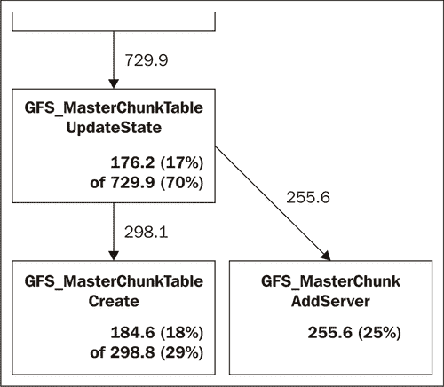

# 第十章：更多第三方模块

本章将覆盖：

+   配置公平负载均衡

+   为后端服务器设置健康检查

+   跟踪和报告文件上传进度

+   使用 Nginx 生成圆角的圆形图形

+   使用 Phusion Passenger 运行 Python

+   直接从 RRDtool 在 Nginx 中生成图表

+   使用 Google 性能工具

+   直接从 GridFS 提供内容

+   使用 PAM 配置基本 HTTP 身份验证

+   使用 Kerberos 配置基本 HTTP 身份验证

# 介绍

本章将讨论各种 Web 场景，如负载均衡、服务器健康检查等，这些内容在生产环境中非常有用。这些简单的配置将在企业场景中高度适用，特别是在你可能需要分析、外部身份验证方案以及许多其他情况时。

# 配置公平负载均衡

Nginx 默认使用循环负载机制将请求代理到其后端服务器。大多数时候，这已经足够，因为后端的机器通常具有相同的构建和配置，但在许多情况下，必须实现公平的负载。此负载平衡会考虑机器的现有负载，在代理请求之前评估负载。这就是 Nginx 公平调度插件的作用。它使系统管理员能够配置公平调度，并允许后端机器具有不同的性能，从而使整个系统能够最佳运行。


## 如何操作…

我们将首先下载插件，安装它，然后按照接下来的步骤进行配置。

1.  我们将首先安装公平调度模块：

    ```
    git clone git://github.com/gnosek/nginx-upstream-fair.git
    cd nginx
    ./configure --add-module=../nginx-upstream-fair
    make
    make install

    ```

1.  接下来，我们将在 Nginx 配置中添加以下内容：

    ```
    upstream backend {
    server 192.168.1.3;
    server 192.168.1.5;
    fair;
    }
    server {
    server_name www.example1.com;
    ...
    location / {
    proxy_pass http://backend;
    ...
    }
    }

    ```

1.  现在，我们需要重新启动 Nginx 以查看更改：

```
/etc/init.d/nginx restart

```

## 它是如何工作的…

该模块让你配置加权最少连接轮询机制，实时跟踪每台后端服务器的负载，并根据负载决定将请求代理到哪个服务器。

该模块还允许你通过访问网页来跟踪每台服务器的负载；这可以轻松地集成到你的 Web 基础设施监控系统中。

## 还有更多…

我们还可以配置该模块来处理以下调度情况：

| 模式 | 描述 |
| --- | --- |
| 默认 | 这让我们配置简单的加权最少连接循环负载均衡，基本上意味着你将请求分配给连接最少的服务器，并以轮询方式进行分配。这是前述示例中解释的默认模式。 |
| no_rr | 这禁用循环负载均衡，适用于在根据负载可能需要启动多个后端的情况。它将确保 Nginx 使用所需的所有后端。 |
| weight_mode=idle no_rr | 此模式尝试在最小的后端服务器池之间平衡负载。它有助于我们确定实际的后端服务器数量。 |
| weight_mode=peak | 在此模式下，Nginx 不会将请求发送到超出一定限制的后端。如果所有后端都满了，客户端将收到 502 错误。 |

以下图表显示了服务器在繁忙时如何响应：


## 另请参见

第七章, *使用反向代理设置负载均衡*

# 设置后端服务器的健康检查

在运行相当大的互联网站的最重要方面之一是能够了解机器的健康状况。在庞大的服务器群中，不可能逐个检查机器的健康状况，或者说检测哪个后端服务器已宕机。

为解决这个问题，Nginx 有一个很好的模块，它可以让您定期检查所有后端服务器，并在它们的行为不符合预期时将它们标记为不良。标记为不良确保 Nginx 不会将端用户的请求发送到存在问题的后端服务器。由于 Nginx 在内存中维护所有健康检查数字，性能开销非常小。


## 如何做…

1.  我们首先要安装 Nginx 后端健康模块：

    ```
    git clone https://github.com/cep21/healthcheck_nginx_upstreams.git
    cd nginx
    ./configure --add-module=../ healthcheck_nginx_upstreams
    make
    backend health moduleinstallingmake install

    ```

1.  然后我们将以下内容放入配置文件中：

    ```
    upstream backend {
    server 192.168.1.2;
    server 192.168.1.5;
    healthcheck_enabled;
    healthcheck_delay 60000;
    }
    server {
    server_name www.example1.com;
    ...
    location / {
    proxy_pass http://backend;
    ...
    }
    location /backend_status {
    healthcheck_status;
    }
    }

    ```

1.  现在，重新启动 Nginx 以查看更改。

```
/etc/init.d/nginx restart

```

## 它是如何工作的…

此模块每分钟向后端服务器发送查询，然后更新每个后端服务器的状态。这是通过`healthcheck_enabled`和`healthcheck_delay`指令实现的。

我们还启用了健康检查状态页面，因此我们可以通过访问[`www.example1.com/backend_status`](http://www.example1.com/backend_status)来检查后端服务器的状态。


# 跟踪和报告文件上传进度

文件上传是网站上最常见的活动之一。它通过进行多部分 POST 提交来实现，不允许您跟踪文件上传的进度。因此，如果用户正在上传相当大的文件，他希望能得知上传的速度和需要的时间。为确保用户知晓情况，有一个模块可以帮助我们跟踪文件上传到服务器的进度。


## 如何做…

我们首先要安装插件，然后看看如何在接下来的步骤中配置它。

1.  我们首先要安装 Nginx 文件上传进度模块：

    ```
    git clone https://github.com/masterzen/nginx-upload-progress-module.git
    cd nginx./configure --add-module=../nginx-upload-progress-module
    make
    make install

    ```

1.  我们将在我们的 Nginx 配置中使用以下内容：

    ```
    http {
    upload_progress proxied 1m;
    server {
    server_name www.example1.com;
    root /var/www/www.example1.com;
    location / {
    proxy_pass http://127.0.0.1;
    proxy_redirect default;
    track_uploads proxied 30s;
    }
    location ^~ /progress {
    report_uploads proxied;
    }
    }
    }

    ```

1.  重新启动 Nginx 将应用这些更改：

```
/etc/init.d/nginx restart

```

## 它是如何工作的…

这个配置基本上设置了一个 1MB 的缓存来跟踪上传文件的状态。每个上传的文件都应该分配一个跟踪 ID，通过它可以查询 `http://www.example1.com/progress` 来了解文件的上传进度。根据我们配置的模块输出格式，它可以返回多种格式；在这个示例中，默认输出为 JSON。

需要注意的是，为了跟踪文件进度，我们需要附加一个 X-Progress-ID，它将唯一标识正在上传的文件。

# 使用 Nginx 生成圆角边缘的圆圈

互联网美学的最新趋势是圆角，显然 Nginx 不会被落下。这个教程介绍了一个有趣的模块，它允许我们生成动态圆圈，我们可以轻松地用它来创建圆角样式。当你需要支持旧版浏览器的圆角样式，而这些浏览器不兼容 CSS3 时，这特别适用。


## 如何做…

我们将首先安装插件，然后按照以下步骤配置它。

1.  我们首先需要安装 Nginx Circle GIF 模块：

    ```
    wget http://wiki.nginx.org/images/b/b6/Nginx_circle_gif-0.1.3.tar.gz
    tar xvzf Nginx_circle_gif-0.1.3.tar.gz
    cd nginx
    ./configure add-module=../ Nginx_circle_gif-0.1.3
    make
    make install

    ```

1.  接下来，我们将在 Nginx 配置中使用以下内容：

    ```
    server {
    server_name www.example1.com;
    ...
    location / {
    proxy_pass http://backend;
    ...
    }
    location /circle {
    circle_gif;
    }
    }

    ```

1.  现在，重启 Nginx 以查看更改。

```
/etc/init.d/nginx restart

```

## 它是如何工作的…

配置这个模块其实很简单，只需要添加一个新的 URL 端点，它将作为一个 Web API 来生成 gif。URL 的格式如下：

`<background color>/<foreground color>/<radius>.gif`

所以，以下 URL 将生成一个半径为 10 像素的黑色圆圈在白色背景上。我们可以用这个生成圆角样式：

`http://www.example1.com/circles/ffffff/000000/10.gif`


# 使用 Phusion Passenger 运行 Python

Nginx 的主要目的，是作为一个最先进的 Web 和邮件代理服务器，这让它的形象不再仅仅是一个全能服务器，尽管它完全有能力做到这一点。我们将探讨如何使用 Phusion Passenger 作为后端运行 Python 应用。


## 如何做…

我们将首先安装所有安装 Phusion Passenger 所需的依赖项，然后在接下来的步骤中配置 Nginx。

1.  我们将首先安装 Ruby：

    ```
    apt-get update
    apt-get -y install build-essential zlib1g zlib1g-dev libxml2 libxml2-dev libxslt-dev
    wget http://ftp.ruby-lang.org/pub/ruby/1.9/ruby-1.9.2-p0.tar.gz
    tar -xvf ruby-1.9.2-p0.tar.gz
    ./configuremake
    make install

    ```

1.  我们需要安装 `rubygems`，这是 Ruby 的包管理工具：

    ```
    wget http://rubyforge.org/frs/download.php/60718/rubygems-1.3.5.tgz
    tar zxvf ./rubygems-1.3.5.tgz
    cd rubygems-1.3.5
    sudo ruby setup.rb

    ```

1.  我们将安装 Rails 和 Passenger Phusion：

    ```
    gem install rails
    gem install passenger

    ```

1.  我们将安装 Passenger Phusion Nginx 模块，如下图所示：

    ```
    Passenger-install-nginx-module

    ```

    

1.  以下配置用于 nginx.conf，并假设应用程序位于 `/var/www/www.example1.com/`。

    ```
    worker_processes 1;
    events {
    worker_connections 1024;
    }
    http {
    include mime.types;
    default_type application/octet-stream;
    sendfile on; keepalive_timeout 65;
    gzip on;
    passenger_root /usr/local/lib/ruby/gems/1.9.1/gems/passenger-2.2.5; passenger_ruby /usr/local/bin/ruby;
    server {
    listen 80;
    server_name localhost;
    root /opt/nginx/html/public/;
    passenger_enabled on
    }
    }

    ```

1.  现在，重启 Nginx 应该让你看到所有更改的效果。

```
/etc/init.d/nginx restart

```

## 它是如何工作的…

Phusion Passenger 是一种非常简便的方式，用于在 Rails（一个 Ruby 的 Web 框架）中部署生产应用。它同样非常高效地部署 Python（WSGI）应用程序。在本食谱中，我们已经提前设置了一个小型 Python Web 脚本来演示这一能力。

## 另请参见

第六章，*使用 uWSGI 设置 Python 网站*

# 直接从 RRDtool 在 Nginx 中生成图表

现在许多网站都会将分析数据作为其服务的一部分。最常见的分析表示形式是基于时间的图表，这些图表是通过 RRDtool 高效生成的，RRDtool 是一个非常好的开源图形生成工具。在本食谱中，我们将探索一个模块，该模块将创建一个可以动态调用的 Web API，用于获取图表。


## 如何做…

我们将首先安装插件，然后按照以下步骤配置它。

1.  我们将安装 Nginx RRDtool 模块；假设你已经安装了 RRDtools：

    ```
    wget http://wiki.nginx.org/images/9/9d/Mod_rrd_graph-0.2.0.tar.gz
    tar xvzf Mod_rrd_graph-0.2.0.tar.gz
    cd nginx
    ./configure add-module=../Mod_rrd_graph-0.2.0
    make
    make install

    ```

1.  然后我们将在配置中使用以下内容：

    ```
    server {
    server_name www.example1.com;
    ...
    location / {
    ...
    }
    location /rrd_gen {
    rrd_graph;
    }
    }

    ```

1.  现在，重启 Nginx 以查看更改。

```
/etc/init.d/nginx restart

```

## 它是如何工作的…

这个设置很容易演示。假设我们想要使用以下命令集在 RRDtool 中生成图表：

```
rrdtool graph --start now-300s \--end now \
DEF:ds0=test.rrd:reading:AVERAGE \
LINE1:ds0#00FF00

```

你可以生成以下 URL，它将返回前述图表，但它将以 Web URL 的形式出现，这将极大简化你的工作。此 URL 包含以 URL 编码格式附加到 `http://www.example1.com/rrd_gen` URL 的前述代码。

`http://www.example1.com/rrd_gen--start%20now-300s%20--end%20now%20DEF%3Ads0%3Dtest.rrd%3Areading%3AAVERAGE%20LINE1%3Ads0%2300FF00`

# 使用 Google 性能工具

更有经验的 Nginx 用户可能需要查看 Nginx 平台的限制，在这种情况下，像 Google 性能工具这样的库将极大地方便开发人员。我们将在本食谱中介绍如何设置 Google 性能工具模块。



## 如何做…

我们将首先安装插件，然后按照以下步骤配置它。

1.  我们将首先安装 Google 性能 Nginx 模块：

    ```
    cd nginx
    ./configure --with-google_perftools_module
    make
    make install

    ```

1.  在你的配置中使用以下内容：

    ```
    worker_processes 1;
    events {
    worker_connections 1024;
    }
    google_perftools_profiles log/profile;
    http {
    include mime.types;
    default_type application/octet-stream;
    sendfile on;
    keepalive_timeout 65;
    gzip on;
    . . .

    ```

1.  我们需要重启 Nginx 以查看更改。

```
/etc/init.d/nginx restart

```

## 它是如何工作的…

这个简单的指令将让我们对工作线程进行性能分析。生成的性能分析文件由 `google_perftools_profiles` 指令定义，配置将生成类似 `log/profile.<pid>` 的文件，其中 `pid` 是工作线程的进程 ID，表示该线程的性能分析信息。

# 直接从 GridFS 提供内容

GridFS 是一种在 MongoDB 中存储大文件的规范。它基本上旨在将文件拆分成更小的块，便于管理，并允许高效的范围操作。我们将查看如何配置 Nginx 直接从 GridFS 提供内容，从而创建一个你可以通过 GridFS 管理所有大文件并使用 Nginx 提供它们的情况。


## 如何操作…

我们将首先安装插件，然后按以下步骤配置 Nginx。

1.  此配方假设你已经安装了 GridFS。我们将安装 Nginx gridFS 模块：

    ```
    git clone https://github.com/mdirolf/nginx-gridfs.git
    cd nginx-gridfs
    git submodule init
    git submodule update
    cd ../nginx
    ./configure --add-module=../nginx-gridfs
    make
    make install

    ```

1.  我们将在 Nginx 配置中加入以下内容：

    ```
    server {
    listen 80;
    server_name www.example1.com;
    . . .
    location /gridfs/ {
    gridfs my_app
    root_collection=pics
    field=_id
    type=int
    user=foo
    pass=bar;
    mongo 127.0.0.1:27017;
    }
    }

    ```

1.  现在，重启 Nginx 来检查更改。测试之前请确保 GridFS 已在运行。

```
/etc/init.d/nginx restart

```

## 如何工作…

上述配置启用了一个名为 `my_app` 的 MongoDB 数据库上的 GridFS，用户名和密码分别为 foo 和 bar。任何像 `http://www.example1.com/gridfs/123/` 的请求都会返回来自 *pic* 集合、ID 为 123 的相应文件。


# 使用 PAM 配置基本 HTTP 认证

Nginx 支持 HTTP 认证，正如我们在之前的配方中所看到的，我们可以生成包含有效用户名和密码的 `htpasswd` 文件。然而，大多数系统已经有一个现有的认证系统，并与 PAM 集成，而 Nginx 已经有一个插件可以让你通过 PAM 进行认证。

### 注意

PAM 是一种将低级认证机制集成到高级编程 API 中的机制，因此你的所有程序都可以独立于登录系统的操作进行工作。


本配方描述了一个情况，在该情况下你希望保护 `http://www.example1.com/downloads` 并确保只有通过 LDAP 认证的用户才能访问该网站部分。

## 如何操作…

我们将首先安装 PAM 认证模型，然后按以下步骤配置 Nginx。

1.  我们将首先安装 Nginx PAM 认证模块。此配方假设你已经配置并运行了 LDAP 设置。

    ```
    wget http://web.iti.upv.es/~sto/nginx/ngx_http_auth_pam_module-1.2.tar.gz
    tar xvzf ngx_http_auth_pam_module-1.2.tar.gz
    cd nginx
    ./configure add-module=../ngx_http_auth_pam_module-1.2
    make
    make install

    ```

1.  然后我们将在 Nginx 配置中加入以下内容：

    ```
    server {
    server_name www.example1.com;
    . . .
    location /downloads {
    auth_pam "Downloads";
    auth_pam_service_name "nginx";
    }
    }

    ```

1.  我们需要在 `/etc/pam.d/nginx` 中加入以下内容：

    ```
    auth required /lib/security/pam_ldap.so
    account required /lib/security/pam_ldap.so

    ```

1.  现在，你需要重启 Nginx 服务器。

```
/etc/init.d/nginx restart

```

## 如何工作…

这个模块基本上利用 PAM 作为顶级 API 来访问 LDAP 认证结构。它首先在必要的位置启用认证，在本例中是`/downloads`。然后我们设置一个名为 Nginx 的 PAM 服务，该服务基本上利用 PAM LDAP 库来完成认证。


# 使用 Kerberos 配置基本 HTTP 认证

如果你在异构环境中使用基于 Windows 的系统，那么你很可能必须使用 Kerberos 作为身份验证协议。在我们内部部署站点的情况下，使用 Kerberos 进行 Web 身份验证可能会很有用。Nginx 为此提供了解决方案，因为它有一个模块，可以使用 Kerberos 来对用户进行身份验证。

这个示例将展示如何使用 Kerberos 作为后台保护特定 Web 位置，通过 HTTP 身份验证来实现。这是一个高度实验性的插件，仅在你在网络中没有其他身份验证方案时才有用。


## 如何操作…

在这个示例中，我们首先安装插件，然后在接下来的步骤中配置 Nginx 使用它。

1.  我们将首先安装 Nginx Kerberos 模块：

    ```
    git clone https://github.com/mike503/spnego-http-auth-nginx-module.git
    cd nginx
    ,/configure add-module=../spnego-http-auth-nginx-module
    make
    make install

    ```

1.  现在我们将配置该模块：

    ```
    location /downloads {
    auth_gss on;
    auth_gss_realm LOCALDOMAIN;
    auth_gss_keytab /etc/krb5.keytab;
    auth_gss_service_name HTTP;
    }

    ```

1.  重启 Nginx 使更改生效。

```
/etc/init.d/nginx restart

```

## 它是如何工作的…

该模块定义了领域名称，接着我们需要定义服务凭据的位置。最后，我们设置用于获取凭据的服务。

前面的配置假设了一些条件。你的 Nginx 网络服务器应该和 Kerberos 服务器处于同一广播范围内，客户端也应该如此，客户端将在该服务器上进行身份验证。

在另一种情况下，你可能已经在服务器上设置了带有 Kerberos 支持的 PAM。在这种情况下，你可以使用前面的做法来配置带有 Kerberos 的 PAM。

## 另见

本章中的 *使用 PAM 配置基本 HTTP 身份验证* 示例
